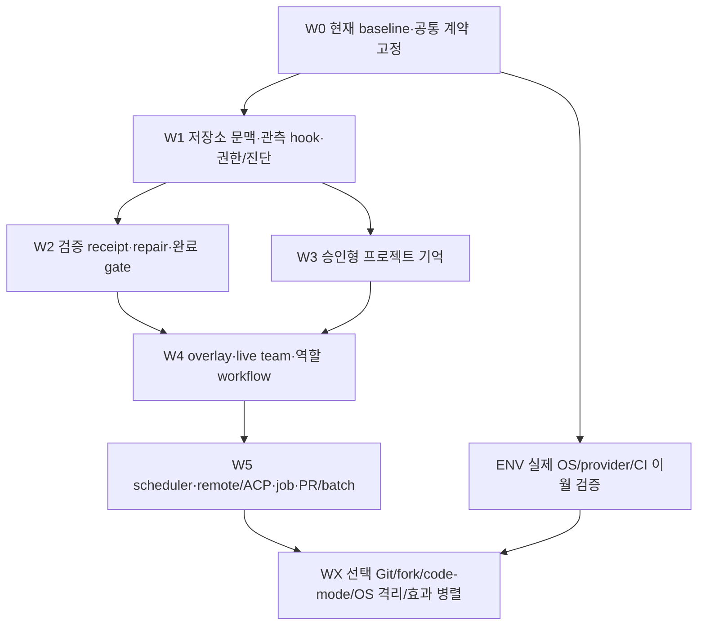

# Moodcode 엔진 개선·구현 상세

2026-10-07. [19개 1:1 비교](one-to-one-comparison.md)의 266개 기능 대조와 후보 75개를 20개 구현 단위로 연결했다. **이 문서의 API·record·새 파일·도구 이름은 설계 제안이다. 현재 engine export나 구현 완료 항목이 아니다.** 비교 source는 Moodcode `e8b0d565828f6c0370424152505a9f6a8497482f`이며 production 내용은 1차 engine `464812f7d1af24466f57070663131f5979aeca51`과 같다.

## 바꿀 곳과 유지할 곳

현재 RunCoordinator·InputScheduler·TurnExecutor·native journal·provider adapters·exact tool runtime·managed child·MCP·PTY·LSP·review를 확장한다. 19개 agent의 loop, prompts, source, fixtures를 새 engine에 합치는 방식을 제안하지 않는다. 파생 자료·새 workflow/job의 identity와 기존 효과 승인·cleanup 증거를 연결하는 자체 TypeScript 모듈을 추가한다.

| 현재 유지하는 계약 | 새 기능에서 추가할 부분 |
|---|---|
| 하나의 capture로 tool/context/request 계산; eager/discovery compatibility | repository/context contributions도 같은 frozen capture·예약에 넣음 |
| 정확한 prepare→approval→effect와 deny 우선 | hook·memory·recipe·child message가 effect 권한을 만들지 않음 |
| 원래 Run/Turn/Attempt/Part와 accepted effect의 source owner | 새 stage/job/client effect는 별도 operation ID와 원래 source를 연결 |
| cancel 의도와 actual cleanup·unknown 격리 | remote/job/hook도 종료 관측 없이 safe retry로 바꾸지 않음 |
| child worktree·DB·budget/deny 상속·terminal inbox | live mailbox/role continuation을 별도 영구 상태로 추가 |
| raw/native replay·summary publication·archive pause import | 파생 map/memory/verification/fork가 과거를 다시 쓰거나 자동 실행하지 않음 |

공통 신규 record는 필요한 범위에 따라 `operationId`, `workspaceId`, `sessionId`, `runId/turnId/attemptId`, `ownerGeneration`, `configRevision`, `sourceManifestDigest`, `state`, `revision`을 가진다. nullable 원래 ID와 새로운 ID를 구분하고 Run이 없는 host 작업에 임의의 Run을 만들지 않는다. 메시지·지침·모델 출력은 데이터이며 새로운 권한의 증거가 아니다.

## 권장 순서와 병렬 경계

단계는 추천 진행 순서이며 새 goal을 시작한 것이 아니다. W1의 작은 hook은 관측/deny부터 시작해 검증 시스템을 선행 요구하지 않는다. artifact 모델 요약·terminal continuation·기억 자동 추출은 W2의 상태·budget/cleanup 통합 뒤에 연결한다. 실제 환경 이월 작업은 기능 개발과 독립해서 진행할 수 있지만 계정/OS/CI 증거가 없으면 완료로 표시하지 않는다.

| 담당 경계 | 독립 진행 범위 | 한 명의 통합 담당이 소유할 변경 |
|---|---|---|
| 저장소 문맥 | index/query/LSP read schema·독자 source fixture | `ports.ts`, `context/service.ts`, tool capture wiring |
| 검증 | plan/receipt/repair decision 모듈·가짜 command/LSP peer | `runner/index.ts`, Turn/terminal·permission 연동 |
| 지식 | candidate/publication/projection·trust registry | native migration/archive·context activation |
| 협업 | mailbox/join/recipe store ports | child admission·input promotion·root close/owner proof |
| host integration | protocol negotiation·remote/job/occurrence adapters | capability API·native receipts·host close/uncertainty |
| 진단·정책 | 읽기 전용 projections·typed decisions | public exports·native queries·budget/report schema |

`packages/contracts`, `ports.ts`, `runner`, `engine.ts`, `storage/migrations.ts`, native schema/archive는 동시 편집하지 않는다. 담당은 먼저 interface와 bounded fake port를 만들고 통합 담당이 순차 연결한다. DB9의 다음 migration 번호는 실제 통합 시 단일 담당이 할당한다. 각 worker가 임의의 DB10이나 별도 source of truth를 만들지 않는다.

## 작업 단위 읽는 법

P1은 먼저 권장하는 기능/정확성 보강, P2는 사용 흐름을 확장하는 후속 기능, P3는 선택 실험이다. 비용 S/M/L/XL은 새로운 영구 상태·외부 의존성·실제 환경 검증의 상대 규모이며 기간/성능 약속이 아니다. 아래 cap 숫자는 **초기 제안**이고 최종 값은 현재 RunLimits와 source corpus 측정에 맞춰 정한다. 새 cap도 기존 전체 budget 안에서 차감하며 초과·unknown은 명시한다.

모든 묶음은 최소 `a 계약/identity → b 독립 모듈 → c 기존 엔진 연결 → d 의미 있는 검증/문서`로 분할한다. core 테스트를 반복해 수만 늘리는 방식 대신 stale input·실제 효과 경계·crash/cancel·상한·재전송을 검증한다. synthetic 검사와 실제 환경 결과를 따로 보관한다.

## MC2-01 — 저장소 문맥·LSP navigation

**P1 · M~L · W1.** AIDER-C01, plandex-task-context-map, zoo-code-C1, roo-code-C1, CONTINUE-C01/C02, CR-C01. 기존 `tools/search`, `lsp/index.ts`, `context/{plan,service,sources}`를 사용한다. 신규 제안 경로는 `repository/{index,query,snapshot}.ts`와 `context/contributions.ts`다.

`RepositoryIndexPort`는 source path/hash·parser/model/ignore revision·worktree/branch·index generation을 등록/조회한다. `querySymbols/queryDefinitions`는 host 등록 LSP capability와 현재 문서 version/hash에 결속한다. `ContextSourcePort`는 결과 URI/range/hash/trust/selection reason·omission을 frozen manifest로 반환한다. 첫 구현은 LSP 읽기 navigation과 구조 map이며 FTS/vector/rerank는 외부 전송 opt-in과 degraded fallback을 별도 제공한다.

| 작은 작업 | 구현과 완료 조건 |
|---|---|
| 01a snapshot/port | ignore·rename/delete·hash/parser revision과 generation CAS. 자료 갱신만으로 쓰기 권한이 생기지 않음 |
| 01b navigation/map | host LSP/query 결과를 workspace 안으로 제한; 제안 초기 cap 64 locations·16KiB·기존 LSP deadline. parser 미지원/stale/실패 분리 |
| 01c projection | map/snippet 선택을 기존 ContextPlan/tool/output 예약에 합산; 전체 token unknown 정책과 complete exchange 유지 |
| 01d 검증/성능 | 동명 심볼·branch/worktree 분리·외부 편집·partial build·UTF-8 cap·cancel. 큰 corpus에서 실제 시간/디스크를 측정하고 품질 향상은 측정 뒤 주장 |

index는 폐기 가능한 cache이고 journal은 실행 사실이다. restart 시 이전 generation을 최신 파일 증거로 쓰지 않는다. vector 실패는 lexical/read fallback으로 표시한다. 새 read tool은 host 등록·captured profile/discovery 경계를 통과하고 원래 core21 의미를 바꾸지 않는다.

## MC2-02 — 검증 계획·제한 repair·완료 gate

**P1 · L · W2.** AIDER-C02, plandex-edit-validation-ladder, OHSDK-C3, roo-code-C4. 신규 `verification/{plan,receipts,repair,completion}.ts`를 제안하고 현재 command/LSP/formatter/review를 호출한다. `VerificationPlan`은 host 등록 check ID·명령/범위·순서·plan revision·max repairs, `VerificationReceipt`는 changed file/checkpoint hash·실제 outcome/exit·원본 diagnostics/artifact·cleanup을 저장한다.

| 작은 작업 | 구현과 완료 조건 |
|---|---|
| 02a 계획/저장 | checks와 allowed command/profile/budget 고정. 모델이 검사 명령/권한을 확대하면 새 승인 필요 |
| 02b 검사/receipt | pass/fail/skipped/unsupported/timeout/cancelled/uncertain을 분리; 검사 중 파일 변경은 stale 결과; 원본 로그/exit 보존 |
| 02c repair | 실패 receipt를 다음 모델 경계에 연결. 제안 초기 최대2회, 동일 source/diagnostic 반복 시 stalled; 부모 예산 안에서 제한 |
| 02d gate/복구 | terminal 전 필요한 receipt와 result schema 검사. late receipt를 종료 Run 이벤트에 덧붙이지 않음; crash 뒤 증명 없이 검사/effect replay 금지 |

기존 `completed`는 engine execution이 종료됐다는 사실을 유지한다. 검증 실패/미실행과 작업 성공을 구분하는 새로운 task/workflow 결과를 먼저 설계하며 legacy terminal 의미를 조용히 바꾸지 않는다. opt-in gate를 쓰는 Run은 completion decision과 rejection/failure reason을 기록한다. commit·patch 존재·모델 답변·todo 완료는 test pass를 대신하지 않는다.

## MC2-03 — 지침 신뢰·승인형 프로젝트 기억

**P1 · L · W3.** gemini-memory-inbox, QWEN-C03, GOOSE-C03, MV-C01, K-C02, OSWE-C4. 신규 `knowledge/{candidates,publication,projection}.ts`, `workspace/trust.ts`를 제안한다. 기존 session semantic summary·nested instructions·skill/reference 읽기를 유지한다. workspace 간 수명은 session document에 큰 전역 blob으로 숨기지 않고 별도 workspace-scoped store port와 bounded paging으로 명시한다.

| 작은 작업 | 구현과 완료 조건 |
|---|---|
| 03a trust/candidate | user/host가 scope/root·trust revision을 선택; source session/message/hash와 target revision·생성 usage를 candidate에 고정 |
| 03b 추출 inbox | 완료 세션만 opt-in bounded 읽기·tools 없는 provider 요청. credential/opaque replay 제외; 후보 생성만으로 active 지침/skill 변경 0 |
| 03c publish/revoke | exact candidate hash/target revision 승인·CAS·dedupe receipt. 새 skill뿐 아니라 기존 skill 수정도 동일 preview/승인 사용 |
| 03d projection/복구 | active scope/revision/source/expiry만 ContextPlan에 넣음. accept 직전 crash·동시수락·철회·deleted source·conflict·budget 검사 |

제안 초기 후보 본문16KiB·source IDs64·조회 페이지32를 적용하되 실제 원본 읽기/summary output/시간은 Run/host budget에 포함한다. 과거 관찰을 현재 파일의 사실로 표시하지 않는다. archive import 후 후보 상태는 조회할 수 있지만 publication·추출 자동 재개나 새로운 hook/plugin 실행권을 발급하지 않는다.

## MC2-04 — typed lifecycle·policy hook

**P1 · M~L · W1 기반, W2 뒤 continuation.** gemini-model-lifecycle-hooks, QWEN-C05, CLINE-C03, GOOSE-C04, MV-C02, kimi-code-C1, kimi-cli-legacy-C3, CR-C04. 신규 `lifecycle/{registry,dispatch,types}.ts`; 기존 `PluginToolHooks.prepared/settled` metadata observer는 유지한다.

`registerLifecycleHook`는 host 고정 ID/revision/순서·stage·bytes/deadline·실패 정책을 받는다. 초기 결과는 observe/deny/stop/bounded context만 허용한다. credential/opaque replay를 전달하지 않는다. `beforeModel`의 context 변경 뒤 최종 request digest를 확정하고 동일 Attempt retry는 같은 frozen snapshot을 사용한다.

| 작은 작업 | 구현과 완료 조건 |
|---|---|
| 04a registry/types | duplicate·stage/revision·timeout·오류 정책 검증; repository hook 발견만으로 실행 금지 |
| 04b observation/deny | bounded metadata·제안 초기4KiB result/1초 callback deadline. 취소/throw/late result를 typed outcome으로 기록 |
| 04c engine 연결 | tool input rewrite 확장은 prepare 이전에만 새 fingerprint 생성. 승인 이후 입력/정책 변경 거절; 기존 eager/discovery request capture 회귀 없음 |
| 04d stop/cleanup | terminal 이전 opt-in continuation은 최대1회·남은 budget/검증 receipt 필요. post-effect hook 실패로 producer 재실행 0 |

callback deadline이 외부 효과 종료를 증명하지 않는다. command/HTTP hook을 나중에 제공한다면 MC2-10/09의 owner/cleanup receipt와 연결하고 미확정 효과는 quarantine한다. 초기 순수 callback hook에 암묵적 shell 실행을 넣지 않는다.

## MC2-05 — 미적용 ProposalSet overlay

**P2 · L · W4, 선행01/02.** plandex-review-proposal-overlay. 신규 `proposals/{store,overlay,apply}.ts`; 현재 patch/review/artifact/worktree를 재사용한다. `ProposalSet`은 base source manifest·파일 preimage/새 내용 hash·operation 순서·review revision을 저장하고 model projection은 pending overlay라고 표시한다.

05a는 proposal/source CAS와 bounded paging, 05b는 read-only diff·overlay context, 05c는 `previewApplyProposal`→exact approval→file revalidation→apply receipt, 05d는 외부편집·다중 파일 partial apply·취소/crash·재전송 검증이다. 제안 초기128파일·총8MiB 이하의 변경안을 artifact로 저장하고 원래 owner/source를 보존한다.

모델이 제안 파일을 봤어도 실제 디스크에 적용됐다고 답하지 않게 result state를 분리한다. 모든 파일이 crash-atomic이라고 약속하지 않는다. 부분 적용 뒤 실제 afterimage/checkpoint와 남은 operation을 기록하며 불확실한 실행은 자동 재적용하지 않는다. preview 승인 이후 proposal revision이 바뀌면 stale로 거절한다.

## MC2-06 — 상주 child·팀 mailbox·board

**P2 · L · W4.** 후보: QWEN-C01, QWEN-C02, CLINE-C01, MV-C03, K-C01.

선행: 04 기반; 역할 간 live join은07과 연결. 신규 제안 경로: `teams/{membership,mailbox,board}.ts`.

제안 API: `sendAgentMessage`, `readAgentMailbox`, `resumeChildTurn`, `claimTeamTask`. 제안 record: `TeamMembership`, `AgentMessage`, `DeliveryReceipt`, `TaskOwnerRevision`.

member/message/receipt/cursor/task owner를 versioned store에 저장한다. durable receipt 이후 송신 성공을 반환하며 cross-session team을 한 session blob에 숨기지 않는다.

host가 승인한 lineage/team membership과 member generation을 고정한다. message/request ID 중복 제거, 수신 cursor/read receipt, task owner/dependency CAS, bounded inbox를 제공한다. 기존 root terminal 결과 전달을 유지하고 live child는 안전한 모델 경계에서만 메시지를 소비한다.

| 작은 작업 | 구현과 완료 조건 |
|---|---|
| 06a | membership/owner 상태와 permission/expiry 규칙 |
| 06b | send/read/claim port와 bounded queue. 제안 초기 mailbox page64KiB·message4KiB |
| 06c | child continuation/input scheduler 연결. 승인 대기 중 메시지가 이미 준비된 효과를 바꾸지 않음 |
| 06d | send/read/owner 충돌·overflow·terminal member·parent cancel·crash/reopen 검사. 미확정 효과가 있는 child의 wake/owner 재사용 금지 |

## MC2-07 — 역할 workflow·recipe·child join

**P2 · L · W4.** 후보: AIDER-C03, plandex-model-role-routing, GOOSE-C01, GOOSE-C05, zoo-code-C2, kimi-code-C3, OSWE-C2, roo-code-C2.

선행: 02 검증 gate·04 제어 경계; 지속 team 상호작용은06. 신규 제안 경로: `workflows/{spec,stages,joins,recipes}.ts`.

제안 API: `registerWorkflow`, `startWorkflow`, `inspectWorkflow`, `joinChildren`. 제안 record: `WorkflowSpec`, `WorkflowStage`, `StageReceipt`, `RecipeResult`.

WorkflowSpec revision, stage Run/Attempt, source/artifact hash, child join과 transition receipt를 저장한다. parent 상태는 단일 CAS로 전이한다.

planner/editor/validator profile·tool set을 먼저 고정한다. 다음 단계에 설계 artifact와 관찰한 source hash를 전달하며 설계 결과가 편집 권한을 부여하지 않는다. all/any join, partial failure, budget reservation, result schema를 구분한다. 역할/모델 escalation은 새 요청이며 같은 요청의 provider retry로 취급하지 않는다.

| 작은 작업 | 구현과 완료 조건 |
|---|---|
| 07a | workflow/recipe parameter·result schema·순서/순환/depth 검사 |
| 07b | stage/join reducer·CAS와 read-only planner/advisory reviewer |
| 07c | 기존 engine-owned child와 승인 merge로 전이. 제안 초기 stage8·depth4 및 parent budget 제한 |
| 07d | child 완료→delivery→stage commit→parent admission crash 구간, 중복 join/submit·stale 설계·deny/cancel/budget 검사. 실패 후 발생한 효과를 자동 재실행하지 않음 |

## MC2-08 — 예약·webhook occurrence admission

**P2 · L · W5.** 후보: CLINE-C02, OHAPP-C2.

선행: 04·기존 durable inbox; worker lifetime 계약 선행. 신규 제안 경로: `schedules/{store,occurrences,dispatcher}.ts`.

제안 API: `registerSchedule`, `disableSchedule`, `acceptTrigger`, `claimOccurrence`. 제안 record: `ScheduleRevision`, `TriggerOccurrence`, `SchedulerLease`.

ScheduleRevision, TriggerOccurrence, claim token/owner generation/lease와 missed-run policy를 저장한다. occurrence→input request ID를 고정하고 journal과 reconcile한다.

timezone/DST·clock 역행·sleep/wake·enabled revision·concurrency/misfire 규칙을 명시한다. lease 만료가 이전 물리 실행 종료를 증명하지 않는다. webhook은 bounded 비신뢰 입력이며 알림/발행은 별도 host integration이다.

| 작은 작업 | 구현과 완료 조건 |
|---|---|
| 08a | schedule/trigger/disabled import 및 capability/profile/workspace pin |
| 08b | due occurrence 계산·claim/lease·dedupe·global/per-schedule cap |
| 08c | occurrence를 input.accept에 연결하고 accepted/promoted/terminal receipt 보존. disable과 실행 중 Run cancel 구분 |
| 08d | 두 scheduler 동시 claim·accept 전후 crash·lease 상실·시간대/수정·workspace quarantine 검사. owner/cleanup 증거 없이 효과 재실행 금지 |

## MC2-09 — ACP·remote host·client effect 완료

**P2 · XL · W5.** 후보: CLINE-C04, GOOSE-C02, OHSDK-C4, MV-C04, kimi-cli-legacy-C4, OHAPP-C1, OHAPP-C3.

선행: 04/11; 원격 효과는 기존 MCP/provider frontier 및10 ownership 계약과 연결. 신규 제안 경로: `agent-backends/{registry,acp,remote,client-effects}.ts`.

제안 API: `registerAgentBackend`, `negotiateCapabilities`, `submitRemoteRun`, `settleClientEffect`. 제안 record: `BackendBinding`, `ConnectionEpoch`, `CapabilityRevision`, `ClientEffectReceipt`.

BackendBinding, connection epoch, capability/config/profile revision, endpoint audience, request/replay cursor, ClientEffectReceipt를 저장한다.

agent-owned/engine-owned context를 구분한다. initialize/new/load/prompt/permission/cancel을 원격 identity에 연결하고 이미 accepted된 요청의 binding을 교체하지 않는다. received/ack/dispatched/completed/failed/uncertain을 구분한다. browser storage를 유일한 durable dedupe로 쓰지 않는다.

| 작은 작업 | 구현과 완료 조건 |
|---|---|
| 09a | capability negotiation·backend launch tuple·secret reference·scope 고정 |
| 09b | synthetic ACP/remote peer·엄격한 command/event schema·bounded replay |
| 09c | exact permission bridge와 기존 child/host port를 통한 client effect 실행. unknown capability는 시작 보류 |
| 09d | disconnect·late approval·event gap·중복 prompt·owner 교체·ack 후 효과 실패 검사. reconnect를 remote rollback/safe retry 증거로 쓰지 않음 |

## MC2-10 — session command job·완료 전달

**P2 · L · W5.** 후보: kimi-code-C2, OSWE-C3, CONTINUE-C03, CR-C03.

선행: 04/11; 완료 전달은 기존 durable inbox 재사용. 신규 제안 경로: `jobs/{store,supervisor,output,delivery}.ts`.

제안 API: `startCommandJob`, `attachCommandJob`, `readCommandJob`, `cancelCommandJob`. 제안 record: `CommandJob`, `JobOwner`, `OutputCursor`, `JobCompletionReceipt`.

Turn과 별개인 CommandJob/JobOwner를 원 승인/native owner/workspace lease에 연결한다. output cursor, terminal/cleanup receipt와 dedupe delivery를 저장한다.

foreground→background 선택은 prepare preview에 포함한다. 명시적인 session/host lifetime·budget을 두고 parent Run 종료 후 ownership을 유지한다. 모델은 승인받은 handle만 조회한다. 새 쓰기/restore와 충돌 정책을 정한다. 기존 user-owned PTY의 read-only 상태 노출부터 구현한다.

| 작은 작업 | 구현과 완료 조건 |
|---|---|
| 10a | job 상태/owner/lease와 prepared command binding |
| 10b | 기존 supervisor/PTY 재사용·bounded output artifact·attach/cancel·lifetime 제한 |
| 10c | terminal/cleanup settled 이후 inbox에 한 번 전달. 이미 terminal인 Run에는 이벤트 추가 금지 |
| 10d | detach/reload·parent 종료·crash/host close/EPERM·output backpressure·중복 delivery 검사. 물리 종료 미확정 시 unknown을 유지하고 재spawn하지 않음 |

## MC2-11 — role 권한·판단 출처·preflight

**P1 · M~L · W1.** 후보: zoo-code-C3, zoo-code-C4, K-C03, roo-code-C3.

선행: 04 observation; 기존 exact approval·deny 우선 정책 유지. 신규 제안 경로: `policy/{role-resources,decision-receipts,preflight}.ts`.

제안 API: `getPolicyDecisionReceipt`, `registerCommandPreflight`, `profile resource scopes`. 제안 record: `PolicyDecisionReceipt`, `ResourceScopeRevision`, `PreflightVerdict`.

PolicyDecisionReceipt에 role/path/MCP server-resource identity, policy revision, rule provenance를 고정한다. preflight에는 command/cwd/source/analyzer revision과 approval fingerprint를 저장한다.

allow 정책이 사용자 승인을 우회하지 않는다. 기존 deny 우선·plan read-only·unknown ask를 유지한다. path realpath와 MCP resource/server identity로 제한하며 preflight가 명령 input을 바꾸면 prepare부터 다시 수행한다. 기존 policy reason을 더 자세히 노출하는 보강 작업이다.

| 작은 작업 | 구현과 완료 조건 |
|---|---|
| 11a | role file/MCP resource 규칙·우선순위·default unknown 계약 |
| 11b | exact policy decision receipt·사용자 설명·scope/provenance projection |
| 11c | bounded command preflight port와 source revision pin. 검사 결과를 실제 OS sandbox 증거로 표시하지 않음 |
| 11d | symlink/root 이동·MCP server 교체·stale rule/approval·deny 충돌·analyzer 실패 검사. 승인 뒤 input 변경 또는 silent allow 금지 |

## MC2-12 — projection·manifest·무진전·오류 진단

**P1 · S~M/L · W1.** 후보: gemini-artifact-distillation, MSA-C01, MSA-C02, SWA-C01, SWA-C02, SWA-C04, kimi-cli-legacy-C2, CR-C02.

선행: 기존 journal/context/metrics; 검증-aware 요약은02 이후 opt-in. 신규 제안 경로: `diagnostics/{trajectory,projection,attempt-manifest,stall}.ts`.

제안 API: `exportTrajectory`, `inspectToolRegistration`, `getCodingEvidence`, `getStallObservation`. 제안 record: `JournalProjection`, `CodingEvidenceManifest`, `ToolRegistrationManifest`, `StallObservation`.

journalSeq 기반 frozen diagnostic projection, coding attempt source/config manifest, provider error classification, stall window를 저장한다. raw credential/opaque provider replay는 내보내지 않는다.

실패한 요청·부분 출력·usage unknown을 보존하고 JSON 파일 생성만으로 성공을 판정하지 않는다. 반복 감지는 tool input/result digest와 effect epoch를 함께 본다. 동일 조회가 타당한 경우가 있으므로 횟수만으로 금지하지 않는다. provider retry는 원 snapshot/receipt 계약을 따른다.

| 작은 작업 | 구현과 완료 조건 |
|---|---|
| 12a | bounded trajectory export/replay inspection·schema/source/journal provenance |
| 12b | typed provider error fixture와 request/usage/null projection 보강 |
| 12c | stall/advisory signal·attempt manifest·선택적 tools-free summary. 생성 비용과 남은 budget을 반영 |
| 12d | failed Attempt·truncated/partial output·일관된 seq snapshot·unknown usage·동일 read 후 source 변화·오류 분류 검사. inspector가 producer를 재실행하지 않음 |

## MC2-13 — 승인형 Git commit 영수증

**P3 · M · WX.** 후보: AIDER-C04.

선행: 02 verification receipt·기존 Git preview/approval·review/worktree. 신규 제안 경로: `git/{commit-preview,commit-receipts}.ts`.

제안 API: `previewGitCommit`, `commitReviewedChanges`. 제안 record: `GitCommitPreview`, `GitCommitReceipt`.

GitCommitPreview에 HEAD/index/선택 파일 hash·message·검증 receipt를 고정하고 실행 후 전체 commit SHA와 owner/outcome receipt를 저장한다.

사용자 staged/dirty 변경을 보존한다. exact preview 승인 후 HEAD/index를 재검사하고 선택 변경만 commit한다. hook 실패/commit 직후 crash는 실제 Git 상태를 먼저 조회한다. reset·자동 push·중복 commit을 기본 복구로 쓰지 않는다.

| 작은 작업 | 구현과 완료 조건 |
|---|---|
| 13a | selection/HEAD/index/message/verification preview와 conflict 표시 |
| 13b | prepare→approval→revalidation→commit producer 연결 |
| 13c | commit SHA/outcome receipt·receipt 미기록 시 Git 상태 reconcile |
| 13d | 사용자 staged 변경·HEAD 이동·hook failure·cancel·commit 직후 crash 검사. 재전송으로 같은 변경을 두 번 commit하지 않음 |

## MC2-14 — 효과 보존 대화 fork

**P3 · M~L · WX.** 후보: OHSDK-C1, kimi-cli-legacy-C1.

선행: 기존 durable history/opaque replay/archive; 새 쓰기는 기존 approval. 신규 제안 경로: `sessions/{fork-preview,fork-lineage}.ts`.

제안 API: `forkConversationView`, `inspectConversationLineage`. 제안 record: `ConversationFork`, `FrozenHistoryManifest`.

fork source session/journalSeq, provider replay profile, runtime capability/source snapshot, parent lineage와 branch disposition을 저장한다.

대화 fork 시점 이후 실제 filesystem 효과는 남아 있다. history fork를 파일 undo로 표시하지 않는다. context lineage와 새로운 write authority를 구분하고 inherited context는 read-only로 시작한다. worktree 생성은 별도 preview/승인 경로이며 archive import가 원 owner를 재발급하지 않는다.

| 작은 작업 | 구현과 완료 조건 |
|---|---|
| 14a | bounded source history snapshot·fork preview·provider replay compatibility |
| 14b | lineage/materialization와 child context 전달; 원 source ID/hash 보존 |
| 14c | read-only fork 후 새 write approval/worktree 옵션 연결 |
| 14d | fork 이후 이미 발생한 효과·stale source·opaque replay mismatch·import relocated workspace·중복 fork/crash 검사 |

## MC2-15 — 제한 code-mode

**P3 · XL · WX.** 후보: QWEN-C04.

선행: 11 policy·09/10 effect owner·기존 tool prepare/approval/budget. 신규 제안 경로: `code-mode/{host,broker,requests}.ts`.

제안 API: `registerCodeModeHost`, `prepareCodeMode`, `executeCodeMode`. 제안 record: `CodeModeRequest`, `NestedCallReceipt`.

CodeModeRequest/ExecutionReceipt에 runtime capability·broker generation·nested tool request IDs·time/bytes/calls budget을 고정한다.

모델 코드의 모든 tool 호출이 기존 prepare/approval/budget/cancel/receipt를 통과한다. 임의 process/network/stdin/credential 접근을 허용하지 않는다. tool name만으로 권한을 정하지 않는다. runtime 격리와 broker 효과 종료를 각각 증명해야 하며 미확정 효과를 새 코드로 재시도하지 않는다.

| 작은 작업 | 구현과 완료 조건 |
|---|---|
| 15a | 제한 언어/runtime factory·capability negotiation·source preview |
| 15b | typed broker request/result·nested call budget·exact approval 전달 |
| 15c | timeout/cancel/owner cleanup·bounded result artifact와 uncertain receipt |
| 15d | 하나의 실제 지원 환경에서 sandbox 탈출 차단·stale grant·중복 nested call·cancel 직후 dispatch·crash 검사. 검증되지 않은 runtime은 비활성 |

## MC2-16 — media 확대·실제 공급자 검증

**P2/P3 · L~XL · ENV/WX.** 후보: kimi-code-C4.

선행: 기존 image/PDF/refs/archive; 실제 계정 검증 E5-13 선행. 신규 제안 경로: `media/{capabilities,segments,output-artifacts}.ts`.

제안 API: `importMedia`, `resolveMediaCapability`, `media validation matrix`. 제안 record: `MediaReferenceV2`, `ModelMediaCapability`, `RecognitionReceipt`.

MIME/model/runtime capability revision, input segment/anchor/hash, bounded payload와 생성 output artifact receipt를 저장한다.

image/PDF 구현과 실제 모델 검증 미완료를 구분한다. video/audio/output은 신규 capability로 명시하고 unknown 지원 모델은 요청하지 않는다. payload bytes·시간·usage와 원 source/ref를 고정하며 replay/import로 media producer를 재실행하지 않는다.

| 작은 작업 | 구현과 완료 조건 |
|---|---|
| 16a | 기존 image/PDF 실제 계정·모델 검증 계획과 증거 기록. 이 문서 작업에서는 계정 호출하지 않음 |
| 16b | video/audio segment·anchor·MIME/model gating·bounded paging |
| 16c | 생성 media output artifact·usage/null·archive/import schema 연결 |
| 16d | 실제 지원 모델별 invalid MIME·oversize·unknown capability·부분 생성·중복 delivery·source 삭제 검사. E5-13 닫힘과 신규 video/audio 완료를 따로 판정 |

## MC2-17 — 실제 OS 파일/네트워크 sandbox

**P3 · XL · ENV/WX.** 후보: gemini-os-sandbox.

선행: 기존 command backend·11 exact policy; E5-08/E6-07 환경 증거와 분리. 신규 제안 경로: `sandbox/{capabilities,platform-backends,denials}.ts`.

제안 API: `registerSandboxBackend`, `previewSandboxGrant`, `observeEnforcement`. 제안 record: `SandboxCapability`, `EnforcementPolicy`, `ProcessOwnerReceipt`.

OS/backend/version과 filesystem/network enforcement capability, exact restriction revision, owner/denial/cleanup receipt를 저장한다.

현재 backend의 fileIsolation/networkIsolation=false를 문서나 policy만으로 true로 바꾸지 않는다. 실제 OS가 강제하는 파일/네트워크 제한을 각각 증명한다. child/MCP 효과에도 동일 제한을 적용한다. denied 실행 뒤 권한 확대는 새 exact preview이며 부분 효과가 있으면 자동 재실행하지 않는다.

| 작은 작업 | 구현과 완료 조건 |
|---|---|
| 17a | capability port/version·지원 OS/backend matrix·제한 source manifest |
| 17b | 한 OS에서 실제 filesystem/network enforcement와 native ownership 연결 |
| 17c | denial projection·추가 승인 preview·child/MCP 제약 상속 |
| 17d | 실제 OS에서 symlink·subprocess·network·cancel·denial 후 부분 효과 검사. Windows native ownership E5-08과 kernel sandbox 지원을 혼동하지 않음 |

## MC2-18 — prepared resource 기반 효과 병렬

**P3 · XL · WX.** 후보: OHSDK-C2.

선행: 01 source identity·11 resource policy·기존 read parallel/owner/receipt. 신규 제안 경로: `effects/{resource-claims,locks,batch-coordinator}.ts`.

제안 API: `prepareResourceClaims`, `executeConflictFreeBatch`. 제안 record: `ResourceClaimSet`, `BatchExecutionReceipt`.

PreparedResourceClaim에 실제 path/resource identity·input ownership·effect class·lock epoch를 고정한다. batch membership, 각 producer receipt와 aggregate cleanup을 저장한다.

현재 read batch parallel은 유지한다. 쓰기 병렬화는 tool name이 아니라 prepared resource claim 충돌 여부로 판단한다. 불명확한 claim은 직렬 fallback한다. 모든 batch 비용을 먼저 budget에 예약하고 하나라도 미확정이면 다음 충돌 효과를 시작하지 않는다.

| 작은 작업 | 구현과 완료 조건 |
|---|---|
| 18a | prepared resource claim·physical path/MCP identity·conflict matrix |
| 18b | lock/lease epoch·parent budget reservation·직렬 fallback coordinator |
| 18c | effect receipt와 per-member cancel/cleanup·partial batch 결과 |
| 18d | 교차 파일 rename/symlink·동일 resource 다른 tool·한 member crash/cancel·lock loss·receipt 미기록 검사. 성능 향상은 별도 benchmark 이후에만 주장 |

## MC2-19 — PR SHA 기반 CI/review feedback

**P2 · L · W5.** 후보: OSWE-C1.

선행: 08 durable trigger/input·02 verification receipt; 실제 remote 연결 필요. 신규 제안 경로: `integrations/{pr-watch,check-receipts,ci-input}.ts`.

제안 API: `registerPrWatch`, `acceptCiFeedback`, `reconcilePrHead`. 제안 record: `PrWatchRevision`, `FeedbackOccurrence`, `ExternalPublicationReceipt`.

repository/base/head SHA, provider/check identity·required check set, API cursor/delivery ID와 polling occurrence를 저장한다.

모든 check/review를 정확한 PR head SHA에 결합한다. head가 바뀌면 오래된 피드백을 현재 결과로 쓰지 않는다. pending/missing/failed/passed를 구분하고 stable key로 inbox에 입력한다. 조회 watcher는 comment/merge/push 권한을 부여하지 않으며 발행은 별도 명시적 승인 preview를 거친다.

| 작은 작업 | 구현과 완료 조건 |
|---|---|
| 19a | SHA-bound PR/check snapshot·필수 check policy·read-only watcher port |
| 19b | polling/webhook dedupe·cursor/gap 처리·bounded input enqueue |
| 19c | CI failure를 원 source manifest·repair budget·검증 receipt로 연결 |
| 19d | head 변경·reordered delivery·check 재실행·API outage/rate limit·crash 검사. stale green check로 merge 가능 판정 금지 |

## MC2-20 — coding attempt group·headless batch

**P2 · L · W5.** 후보: MSA-C03, MSA-C04, SWA-C03.

선행: 02 completion gate·12 attempt manifest·기존 child/worktree/DB/budget. 신규 제안 경로: `coding-runs/{groups,cases,selection,batch-host}.ts`.

제안 API: `startCodingAttemptGroup`, `inspectBatchEvidence`, `resumeVerifiedBatch`. 제안 record: `CodingAttemptGroup`, `BatchCaseReceipt`, `SelectionReceipt`.

case source/config/plan/worktree/reviewer profile·budget, coding attempt group/member receipt·selection revision을 저장한다.

provider Attempt와 문제 단위 coding attempt를 구분한다. 독립 worktree/DB를 재사용하고 group/case 수·출력·비용을 제한한다. 선택 결과 merge에는 기존 승인이 필요하다. predictions ID 존재나 task future cancel을 성공/물리 종료 증거로 쓰지 않는다.

| 작은 작업 | 구현과 완료 조건 |
|---|---|
| 20a | case/group manifest·attempt/result schema·strict success 기준 |
| 20b | bounded headless batch host·격리 worktree/DB·fair budget reservation |
| 20c | reviewer/verification receipt 기반 selection preview와 승인 merge |
| 20d | partial case failure·skip/resume·cancel pending/running 구분·child cleanup unknown·중복 selection/crash 검사. output export 후 source/runtime를 다시 검증 |

## API·record와 구현 작업 목록

아래 이름은 모두 제안이다. 구체적인 source 후보별 독립 계약·완료 검사는 [75개 mapping](one-to-one-comparison.json)의 `independentContract`/`acceptance`에서 확인한다. [작업 목록 JSON](implementation-work-items.json)은 20개 묶음을 80개 작업으로 나누며 전부 `proposed` 상태다.

| 범위 | 제안 API | 제안 record |
|---|---|---|
| [MC2-01](#mc2-01) | `RepositoryIndexPort`, `ContextSourcePort`, `querySymbols/queryDefinitions` | `RepositorySnapshot`, `IndexGeneration`, `ContextSourceManifest` |
| [MC2-02](#mc2-02) | `registerVerificationPlan`, `verifyChanges`, `getVerificationReceipts` | `VerificationPlan`, `VerificationReceipt`, `RepairStage`, `CompletionDecision` |
| [MC2-03](#mc2-03) | `proposeKnowledge`, `acceptKnowledge`, `revokeKnowledge`, `setWorkspaceTrust` | `TrustRevision`, `KnowledgeCandidate`, `KnowledgePublication` |
| [MC2-04](#mc2-04) | `registerLifecycleHook`, `observe/deny/stop/context result` | `HookRegistration`, `HookInvocation`, `HookOutcome` |
| [MC2-05](#mc2-05) | `createProposalSet`, `getProposalDiff`, `previewApplyProposal`, `applyProposal` | `ProposalSet`, `ProposalRevision`, `ProposalApplyReceipt` |
| [MC2-06](#mc2-06) | `sendAgentMessage`, `readAgentMailbox`, `resumeChildTurn`, `claimTeamTask` | `TeamMembership`, `AgentMessage`, `DeliveryReceipt`, `TaskOwnerRevision` |
| [MC2-07](#mc2-07) | `registerWorkflow`, `startWorkflow`, `inspectWorkflow`, `joinChildren` | `WorkflowSpec`, `WorkflowStage`, `StageReceipt`, `RecipeResult` |
| [MC2-08](#mc2-08) | `registerSchedule`, `disableSchedule`, `acceptTrigger`, `claimOccurrence` | `ScheduleRevision`, `TriggerOccurrence`, `SchedulerLease` |
| [MC2-09](#mc2-09) | `registerAgentBackend`, `negotiateCapabilities`, `submitRemoteRun`, `settleClientEffect` | `BackendBinding`, `ConnectionEpoch`, `CapabilityRevision`, `ClientEffectReceipt` |
| [MC2-10](#mc2-10) | `startCommandJob`, `attachCommandJob`, `readCommandJob`, `cancelCommandJob` | `CommandJob`, `JobOwner`, `OutputCursor`, `JobCompletionReceipt` |
| [MC2-11](#mc2-11) | `getPolicyDecisionReceipt`, `registerCommandPreflight`, `profile resource scopes` | `PolicyDecisionReceipt`, `ResourceScopeRevision`, `PreflightVerdict` |
| [MC2-12](#mc2-12) | `exportTrajectory`, `inspectToolRegistration`, `getCodingEvidence`, `getStallObservation` | `JournalProjection`, `CodingEvidenceManifest`, `ToolRegistrationManifest`, `StallObservation` |
| [MC2-13](#mc2-13) | `previewGitCommit`, `commitReviewedChanges` | `GitCommitPreview`, `GitCommitReceipt` |
| [MC2-14](#mc2-14) | `forkConversationView`, `inspectConversationLineage` | `ConversationFork`, `FrozenHistoryManifest` |
| [MC2-15](#mc2-15) | `registerCodeModeHost`, `prepareCodeMode`, `executeCodeMode` | `CodeModeRequest`, `NestedCallReceipt` |
| [MC2-16](#mc2-16) | `importMedia`, `resolveMediaCapability`, `media validation matrix` | `MediaReferenceV2`, `ModelMediaCapability`, `RecognitionReceipt` |
| [MC2-17](#mc2-17) | `registerSandboxBackend`, `previewSandboxGrant`, `observeEnforcement` | `SandboxCapability`, `EnforcementPolicy`, `ProcessOwnerReceipt` |
| [MC2-18](#mc2-18) | `prepareResourceClaims`, `executeConflictFreeBatch` | `ResourceClaimSet`, `BatchExecutionReceipt` |
| [MC2-19](#mc2-19) | `registerPrWatch`, `acceptCiFeedback`, `reconcilePrHead` | `PrWatchRevision`, `FeedbackOccurrence`, `ExternalPublicationReceipt` |
| [MC2-20](#mc2-20) | `startCodingAttemptGroup`, `inspectBatchEvidence`, `resumeVerifiedBatch` | `CodingAttemptGroup`, `BatchCaseReceipt`, `SelectionReceipt` |

## 저장·이전·import 기준

현재 native DB9/journal이 실행 사실의 기준이다. 새 durable 상태는 store port로 먼저 설계하고 통합 시 하나의 migration sequence에 넣는다. workspace knowledge/team/job처럼 session보다 오래 사는 상태는 scope·owner·조회 paging을 명시한다. index/cache는 다시 만들 수 있으며 immutable artifact·source manifest·effect receipt를 cache로 취급하지 않는다.

각 신규 table/document는 schema version, CAS revision, bounded query, archive/export/import 분류를 함께 정의한다. import는 조회/검토 상태로 시작한다. hook·schedule·job·remote binding·publication을 자동 재개하거나 원 credential/approval/native process owner를 재발급하지 않는다. 알려지지 않은 record/capability는 unsupported로 남기고 알 수 없는 효과는 quarantine한다. relocation은 source path/identity 재검증을 요구한다.

## 착수·종료 기준

W0에서는 현재 source SHA·계약·지원 환경을 고정한다. 이전 1차 검증의 2,594 pass/0 fail은 역사적 기록이며 이번 정적 비교에서 엔진 테스트를 다시 실행한 결과가 아니다. 첫 구현 묶음은 MC2-01/04/11/12의 독립 port·조회/관측 모듈이며 통합 담당이 계약을 확정한 뒤 wiring한다. MC2-02는 source 변경과 검증 receipt의 결합이 검증된 후 완료 gate를 연결한다.

각 작업은 구현 source·독자 fixture·검증 결과·공개 contract 문서가 있어야 완료다. fake peer 결과로 actual OS/provider 지원을 선언하지 않는다. 한 묶음의 완료에는 그 source 후보들의 acceptance, stale/cancel/crash/budget 경계, 기존 request capture·approval·owner/cleanup 회귀 검사가 필요하다. 실제 환경 의존 기능은 해당 환경 증거가 없는 동안 선택 기능/미검증 상태를 유지한다.

기존 이월 항목 E5-13(실제 모델/media), E5-08(Windows native ownership), E6-07(hosted CI), E6-08(지원 matrix)은 그대로 열린 상태다. 새20개 묶음 완료와 기존 이월4개 완료를 합치지 않는다. 이전 1차 goal은 끝난 상태를 유지하며 이 문서는 새로운 구현 착수/goal 활성화로 간주하지 않는다.

이번 문서의 검증 결과는 [comparison-verification.json](comparison-verification.json)에 기록한다. 엔진 구현 파일 변경·upstream 실행·실제 계정 호출은 없다.
