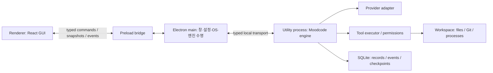

# Moodcode 아키텍처 초안

## 기술 스택과 선택 근거

사용자가 확정한 것은 **Electron 데스크톱 앱**, **자체 엔진**, **엔진부터 개발하는 순서**다. 엔진은 **TypeScript + Node + SQLite**, 이후 GUI는 **React + TypeScript + Vite**를 제안한다. GUI·host·엔진에서 TypeScript 계약을 공유하고, 엔진의 실행 수명과 UI의 화면 수명을 분리한다. React와 Vite의 조합은 별도 웹 서버 프레임워크 없이 renderer를 구성하는 선택이다. [React TypeScript 문서](https://react.dev/learn/typescript), [Vite 문서](https://vite.dev/guide/).

[Electron·Tauri 비교](./desktop-framework.md)에 선택 근거를 기록한다. 아래 프로세스 구조는 GUI를 연결한 최종 형태다. 초기 구현은 Node 개발 harness에서 같은 엔진을 실행한다. [엔진 구현 명세](./engine-spec.md)와 [구현 순서](./implementation-plan.md)에 GUI 없는 첫 구현 범위를 정한다.

Electron은 main, renderer, utility process를 제공한다. main이 창과 OS 기능을, renderer가 화면을, utility process가 Moodcode 엔진을 소유하도록 구성한다. OS 기능은 제한된 preload API로 전달한다. [Electron process model](https://www.electronjs.org/docs/latest/tutorial/process-model), [preload 문서](https://www.electronjs.org/docs/latest/tutorial/tutorial-preload).

패키지 버전과 SQLite driver는 E0에서 Node 및 창 없는 Electron utility runtime의 호환성을 확인한 뒤 고정한다. 최종 배포 호환성은 E5의 앱 bundle에서 다시 확인한다. provider SDK/HTTP transport는 첫 공급자가 정해진 후 E2의 단일 model turn 실험으로 선택한다. 현재 Node 26.9.0 개발 runtime, Electron 44.5.1, TypeScript 7.0.2와 node:sqlite를 사용한다. 실제 Electron utility의 Node는 24.21.0이며 최종 배포 bundle은 후속 검증이다. 모델 transport는 OpenAI-compatible Chat Completions HTTP/SSE adapter를 구현하고 local fixture로 검증하며, 실제 공급자 계정 연결은 별도다.

## 프로세스와 패키지



renderer는 contracts와 UI에 의존한다. 엔진은 Electron·React에 의존하지 않는다. host가 transport와 OS adapter를 제공하므로 이후 CLI/TUI를 추가할 때 같은 엔진을 구성할 수 있다.

```text
apps/engine-harness/
  src/                      개발용 요청·이벤트 출력·승인·중지·기록 조회
apps/desktop/               GUI를 연결하는 E5부터 생성
  src/main/                 창, engine host, native 설정·자격증명 adapter
  src/preload/              제한된 typed bridge
  src/renderer/             프로젝트·세션·설정·검토 화면
packages/contracts/
  src/                      IDs, command/result, event, snapshot, schema version
packages/engine/
  src/session/              요청 접수, 세션 상태, 실행 coordinator
  src/runner/               provider-turn loop, budgets, 종료·취소
  src/provider/             model adapter, credential interface, stream normalization
  src/tools/                registry, file/search/patch/command leaves
  src/permission/           policy, 승인 요청·결정·유효성
  src/workspace/            placement, Git, 수정 lease, 변경 checkpoint
  src/storage/              SQLite, migration, event journal, projection
packages/ui/                GUI 단계에서 필요할 때 생성
  src/                      composer, timeline, tool step, approval, file/diff viewer
```

현재 contracts·engine·engine-harness 세 개를 생성했다. 위 desktop·ui 경로는 후속 GUI 단계의 구조다. 도메인별 구현은 engine 내부 모듈로 나누고 GUI 패키지는 후속 단계에서 추가한다.

## 도메인과 실행 루프

| 개념 | 소유하는 상태 |
|---|---|
| Project / Workspace | 저장소 identity, 실제 실행 directory, branch, 변경 lease |
| Session | 대화 기록과 후속 요청의 맥락 |
| Input | request ID, 사용자 입력, 첨부, 제출 시 고정한 설정 |
| Run | 입력 하나를 처리하는 실행, 상태·budget·취소·종료 원인 |
| Message / Part | 사용자·assistant·tool 결과, 텍스트와 구조화 데이터 |
| ToolCall / Approval | 실제 호출, 정확한 요청과 승인 결정·만료 |
| Checkpoint | 도구 변경 전후의 파일 상태와 실행별 diff |
| Event | session별 순서와 공개 상태 변화 |

1. 요청 schema, workspace, 모델 설정과 실행 가능 상태를 검사한다.
2. request ID로 중복 요청을 판단한다. 새 요청은 coordinator가 session/workspace 실행 lease를 확보한 뒤 input/run 접수를 영속 기록한다. 실행 중이면 접수하지 않고 busy 결과를 반환한다. 접수 응답은 실행 완료가 아니다.
3. session 실행 owner가 기록된 Run을 실행한다. MVP에서는 workspace 전체에 하나의 활성 실행 lease를 유지한다.
4. 고정된 설정과 기록·도구 결과·명시적 context로 다음 model turn을 구성한다.
5. provider adapter가 단일 turn의 text, tool-call, usage, finish/error를 반환한다.
6. 완성된 tool input을 검증하고 정책을 판단한다. 필요한 승인을 기다린 뒤 부작용 직전에 다시 검증한다.
7. 도구를 실행하고 결과·실패·제한 출력·파일 변경을 기록한다. 결과를 다음 model turn의 입력으로 제공한다.
8. 승인 거절·복구 가능한 도구 오류는 tool result로 전달해 다음 model turn에서 대응하게 한다. 도구 호출 없이 종료하면 완료한다. budget 초과·복구 불가능한 오류·취소·중단은 terminal 상태를 기록하고 실행 정리 뒤 lease를 해제한다.

agent loop는 Moodcode가 소유한다. provider adapter는 한 turn의 모델 통신 계약만 제공하며, 자동 도구 loop·승인·저장·복구를 소유하지 않는다.

## 상태와 동시성

Run 상태는 `created → running ↔ awaiting_approval → completed`가 기본이다. 중지는 `cancelling → cancelled`, 오류는 `failed`, 프로세스 손실은 `interrupted`로 마감한다. 각 terminal 상태 뒤에는 추가 성공 이벤트를 적용하지 않는다.

세션마다 활성 Run은 하나이며 MVP에서는 같은 workspace의 활성 실행도 하나다. 다른 요청이 들어오면 `WORKSPACE_BUSY`를 반환하고 입력 초안을 유지한다. durable queue/steer를 지원하는 단계에서는 별도 admission·promotion 계약과 UI를 추가한다. 작업 queue와 대화 중간 입력을 같은 개념으로 취급하지 않는다.

멀티 에이전트·병렬 작업은 worktree 격리와 결과 합치기를 함께 설계하는 다음 단계다. UI 병렬 표시만 추가해 같은 파일에 여러 엔진이 쓰게 하지 않는다.

## command·event 계약

현재 command는 `engine.getCapabilities`, `workspace.open`, `session.create/list/getSnapshot`, `run.submit/cancel`, `approval.decide`, `review.getDiff`, `events.subscribe`다. 파일 읽기는 `read_file` tool을 사용한다. GUI 단계에서 host 설정을 연결한다. command input/result와 event는 contracts의 versioned schema로 검증한다.

event는 `eventId`, `schemaVersion`, `sessionId`, `runId`, `seq`, `timestamp`, `type`, `payload`를 갖는다. 예시는 `input.admitted`, `run.started`, `message.delta`, `tool.requested/running/completed/failed`, `approval.requested/resolved`, `workspace.changed`, `run.completed/cancelled/failed/interrupted`다.

현재 텍스트 delta는 수신마다 commit한다. 공개 projection과 event journal은 같은 DB transaction에서 갱신하고 commit 후 UI에 전달한다. 짧은 시간 묶음으로 합치는 최적화는 후속 단계다. UI에는 committed seq만 전달한다.

snapshot은 해당 session의 watermark seq와 함께 반환한다. 구독은 `afterSeq` 이후 committed journal을 읽고 live 변경 통지를 이용해 tail을 다시 읽는다. 통지는 wake-up이며 journal이 이벤트의 원본이다. 구독 등록·재생 사이에 이벤트를 잃지 않도록 DB catch-up과 중복 제거를 포함한다. UI는 seq 중복을 무시하고 gap·overflow 시 snapshot/replay로 재동기화한다.

## 저장·재시작

SQLite에는 프로젝트·세션·input/run·message/part·tool call·approval 기록·event·checkpoint metadata를 둔다. 현재 파일 preimage/postimage는 크기 한도를 적용한 checkpoint JSON으로 SQLite에 기록한다. 명령 출력은 별도 artifact 파일과 참조를 기록한다. 큰 파일 snapshot을 content-addressed artifact로 옮기는 구성은 후속 단계다. artifact 기록 실패는 숨기지 않으며 불완전 checkpoint로 자동 복원을 시도하지 않는다.

Native Responses adapter는 한 turn의 완료 output을 bounded `providerReplay` metadata로 message에 함께 저장한다. reasoning ciphertext, assistant phase, 원본 item/call 순서를 후속 context에서 유지한다. 공급자를 바꾸면 normalized history를 사용한다. Run terminal transaction은 pending 승인을 만료한 뒤 마지막 seq에 terminal event를 기록한다. `integrityCheck()`와 `backup()`은 프로그램 API로 제공하며 backup은 committed WAL snapshot을 별도 새 DB 파일로 내보낸다.

앱 UI 설정과 draft는 도메인 기록과 분리한다. 현재 개발 harness는 환경에서 공급자 키를 읽어 adapter에 주입한다. 최종 데스크톱은 host의 OS 저장 adapter를 연결한다. 공급자 키를 SQLite·로그·event payload에 기록하지 않는 경계를 유지한다. renderer의 일반 조회 API는 키 원문을 반환하지 않는다.

엔진 재시작 시 완료되지 않은 Run을 `interrupted`로 마감하고 남은 승인 요청을 만료한다. 기록을 기반으로 사용자가 후속 실행을 시작한다. crash 직전 도구 실행 여부가 불명확하면 자동 재실행하지 않고 해당 상태와 파일 변경을 확인한다. 기록 복원과 부작용의 exactly-once 보장은 별개다.

## 모델·context

첫 공급자는 미결정이며 API 키 방식의 텍스트·tool calling을 우선 제안한다. adapter는 capability·model ID·인증·한 turn stream·usage·오류·AbortSignal 계약을 제공한다. 실제 지원이 검증된 모델만 실행 가능 목록에 표시한다.

현재 context는 사용자 입력, root AGENTS.md 지침, 대화와 tool result로 구성한다. 도구 schema와 wrapper 예약 용량을 제외한 한도에 과거 기록을 맞춘다. 명시적 파일·줄 범위 첨부는 이후 입력 UI와 함께 연결한다. 첨부와 읽기는 line/byte 예산을 적용하며 모델별 context 한도를 확인한다. 자동 compaction 전에는 한도 초과를 명시적으로 알리고 입력 범위를 줄이게 한다. usage는 provider가 반환한 값과 미제공 상태를 구분한다.

재시도는 요청·부분 출력·도구 부작용의 경계에 따라 제한한다. 이미 stream을 일부 전달했거나 도구 실행 여부가 불명확한 요청을 새로운 요청으로 조용히 재실행하지 않는다.

## 도구·승인·변경 보존

첫 도구는 `list_files`, `read_file`, `search_files`, `apply_patch`, `run_command`다. 도구 정의는 input schema, permission requirement, execute, model용 결과와 artifact 참조를 제공한다. catalog 노출과 실제 권한 검사를 각각 수행한다.

승인은 run/tool ID, 작업 내용, 대상 real path, cwd/명령 또는 patch hash, 파일의 expected version에 귀속된다. 첫 버전은 요청별 허용·거절을 제공한다. 취소·변경·만료 뒤 오래된 승인을 적용하지 않는다. `Plan` preset은 읽기·검색, `Build` preset은 승인 가능한 변경·명령 도구를 사용하도록 제안한다.

patch는 적용 전 대상 content hash와 변경 내용을 검사하고, 모든 대상의 준비 검증 후 변경한다. 여러 파일·shell side effect가 SQLite transaction과 원자적으로 묶인다고 보장하지 않는다. 부분 적용·실패·중단의 실제 결과와 checkpoint를 기록한다.

실행별 diff는 실행 시작의 전체 Git diff와 섞지 않고, Moodcode가 만진 파일의 변경 직전/직후 상태를 기준으로 구성한다. 승인 대기 후 외부 편집이 생기면 stale preimage로 거절하며, 새 준비와 승인이 필요하다. 되돌리기는 현재 파일이 기록한 변경 후 버전과 일치할 때 해당 변경을 복원하고, 충돌 시 사용자의 선택을 받는다. 기존 사용자 변경을 지우는 전체 reset은 복원 수단으로 사용하지 않는다.

명령 실행은 cwd·timeout·취소·stdout/stderr capture 한도를 명시한다. capture 제한과 모델 결과 제한을 분리하고, 잘린 출력에는 artifact 참조를 제공한다. process-tree 종료와 PTY/native 모듈의 패키징은 플랫폼별 검증 항목이다.

## GUI와 실행 경계

preload는 도메인별 command와 구독을 노출한다. renderer에 범용 Node/IPC primitive를 노출하지 않는다. context isolation, renderer sandbox와 Node integration 비활성화를 적용한다. [Electron 지침](https://www.electronjs.org/docs/latest/tutorial/security).

UI는 event reducer로 도메인 상태를 갱신하고 선택·탭·draft·scroll은 별도 UI 상태로 둔다. 도구·message row의 identity를 유지하며 token마다 전체 timeline을 새로 만들지 않는다. 대량 history는 페이지 단위 로딩과 가상화를 적용하고, UI unmount는 구독 정리로 처리한다. 실행 중지는 명시적 command이며 컴포넌트 unmount와 구별한다.
