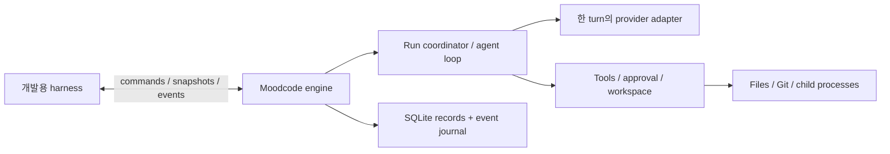

# Moodcode 엔진 구현 명세

작성일: 2026-10-04, Asia/Seoul. Electron·자체 엔진·엔진 우선 개발은 사용자 확정이다. TypeScript/Node·내장 SQLite와 아래 API를 구현했다. 이 문서는 단계별 설계 계약이며, 실제 소스·검증 결과와 아직 남은 범위는 [구현 상태](./implementation-status.md)를 따른다.

2026-10-07 갱신: 아래 첫 구현의 v1 계약을 보존하며 [v2 계약](engine-contracts-v2.md)의 영구 inbox·Turn/Part·ContextRevision·tasks/questions·진단을 추가했다. 실제 host 확장과 소유권·종료·OS 제한은 [host API](engine-host-api.md), 검증 범위는 [최종 headless 보고서](engine-native-final-verification.md), 미완료 조건은 [TODO](../../TODO.md)를 따른다. v1 설계의 향후 계획 문장은 최신 구현 완료 여부의 근거로 사용하지 않는다.

2026-10-09 실제 지원 갱신: [836db4b CI](engine-ci.md)의 macOS arm64/Linux x64 Node24·26 headless gate와 Windows x64 Node24·26 portable 계약·SQLite gate가 통과했다. Linux의 Darwin 전용62skip과 Windows nativeJobObject 미구현은 지원 공백으로 유지한다. 새로운 계약·실제 소비와 저장/archive 증거는 [2차 진행](engine-phase-two-progress.json), host 연결은 [host API](engine-host-api.md), archive의 명시적 문서 증명 시간 예산은 [API](engine-archive-document-budget.md)를 따른다. [모델별 media 감사](engine-phase-two-media-model-account-acceptance-audit.json)의 선택 profile만 검증됐다. ACP session/load 원조건 누락은 재개하며 [전체 범위 감사](engine-phase-two-final-scope-audit.json)를 완료로 재분류하지 않는다.

## 첫 목표와 실행 형태

첫 목표는 **로컬 workspace에서 세션을 만들고 입력 하나를 접수해 응답을 기록하며, 중지·재시작 후에도 결과를 조회하는 엔진**이다. 테스트용 provider로 이 흐름을 완성하고, 실제 provider와 파일·명령 도구를 순서대로 추가한다. 최종 엔진 목표는 작은 코드 수정과 검증을 끝내는 것이다.



engine은 Electron·React import 없이 Node에서 실행되는 라이브러리다. harness는 이 라이브러리를 구성하고 입력·출력을 전달한다. 이후 Electron main이 utility process에서 같은 엔진을 구성하며, preload는 command·snapshot·event를 전달한다. Electron utility process는 Node 환경을 제공한다. [Electron process model](https://www.electronjs.org/docs/latest/tutorial/process-model).

첫 패키지는 `packages/contracts`, `packages/engine`, `apps/engine-harness`다. 별도 HTTP 서버나 GUI가 없어도 엔진을 실행·검증한다. transport에 HTTP가 필요해지는 시점에는 같은 계약의 adapter를 추가한다.

## 모듈의 책임

| 모듈 | 담당할 일 | 외부에 제공하는 결과 |
|---|---|---|
| contracts | command/result, event/snapshot, IDs, schema version, runtime 입력 검증 | transport와 무관한 공개 계약 |
| session | workspace/session 조회·생성, request ID 검사·접수 | Run receipt, session snapshot |
| runner | 활성 실행 소유, 상태 전이, 여러 model turn·도구 결과 연결, budget·취소 | 확정된 실행 상태와 원인 |
| provider | 한 model turn의 요청·stream·완성된 tool call·usage·오류 정규화 | 모델 통신 결과; 도구 실행은 runner에 반환 |
| context | 지침·첨부·history·tool result 구성, 파일·context 한도 | 제출 시 설정을 반영한 모델 입력 |
| tools | 목록·읽기·검색·patch·명령의 schema·실행·결과 제한 | 구조화 결과와 artifact 참조 |
| permission | 도구 정책, 정확한 요청에 대한 승인·거절·만료 | 실행 직전에도 유효한 결정 |
| workspace | canonical root, 변경 실행 lease, Git 상태, checkpoint·diff | 실행 위치와 실제 파일 변경 기록 |
| storage | migration, 도메인 rows, journal/projection transaction, replay, artifact metadata | 재시작 가능한 기록과 순서 |

처음부터 각 모듈을 별도 패키지로 만들지 않는다. engine 내부 모듈로 시작하고 외부 의존성과 공개 계약이 필요할 때만 나눈다.

## E0~E1의 공개 API

| Command | 입력의 핵심 | 응답의 의미 |
|---|---|---|
| engine.getCapabilities | 빈 payload | 실제 runtime·등록 provider/tool·mode·기본 Run 설정 |
| workspace.open | 로컬 저장소 경로 | canonical root와 workspace ID 확인 |
| session.create | workspace ID | 빈 세션 생성 |
| session.list | workspace ID | 저장된 세션 목록; page cursor는 후속 구현 |
| session.getSnapshot | session ID | message/run 상태와 같은 시점의 `lastSeq` |
| run.submit | session ID, request ID, prompt, 실행 설정 | durable 접수 뒤 `runId`, `inputId`, `admittedSeq`, 중복 여부 |
| run.cancel | run ID | 취소 요청 접수 또는 이미 종료된 상태; 실제 완료는 event/snapshot으로 확인 |

구독은 `subscribe(sessionId, afterSeq, signal)` 형태를 제안한다. command의 응답과 event stream은 분리한다. `run.submit` 응답을 최종 모델 답변으로 취급하지 않는다. 같은 세션의 후속 요청은 저장된 history를 사용하는 새 Run이다.

transport에는 command ID와 schema version을 포함한다. command ID는 전달 요청의 상관관계용이며 `run.submit`의 request ID는 중복 실행 방지용이다. E4의 `approval.decide`와 `review.getDiff`, journal 구독 command `events.subscribe`도 현재 구현했다. 전체 command는 source contracts와 구현 상태 문서를 따른다.

엔진 구성 시 `defaults: RunConfigInput`을 지정한다. `run.submit`에 명시한 config 필드는 기본값을 덮어쓰며 limits도 필드별로 병합한다. `loadConfig()`는 user/workspace JSON을 검증하고 불변 설정과 credential 환경 변수 참조를 반환한다. harness는 명시 CLI flag를 추가로 적용한다. API key 값은 이 설정 계약에 포함하지 않는다.

## 접수·실행·취소 계약

1. 동일한 session/request ID와 동일한 정규화 입력은 저장된 Run receipt를 반환한다. ID가 같고 prompt·첨부·실행 설정이 다르면 `REQUEST_ID_CONFLICT`다. 종료된 Run을 재실행하려면 새 request ID가 필요하다.
2. 중복 검사를 먼저 수행하고 새 입력에 대해서만 busy를 검사한다. MVP는 workspace당 활성 Run 하나다. 새 입력은 `WORKSPACE_BUSY`로 거절하며, 접수되지 않은 요청을 history에 실행으로 기록하지 않는다.
3. 새 input/run과 `input.admitted` event를 하나의 transaction으로 기록한 뒤 receipt를 반환한다. 접수 직후 engine가 종료되면 재시작 시 해당 Run은 `interrupted`가 된다.
4. 상태는 `created → running → completed`, 오류는 `failed`, 중지는 `cancelling → cancelled`, 프로세스 손실은 `interrupted`다. E4에는 `running ↔ awaiting_approval`을 추가한다.
5. Run owner가 상태 전이와 journal 쓰기를 직렬화한다. 성공과 취소가 경합하면 먼저 확정된 terminal을 유지한다. terminal event는 하나이며, 늦은 provider/tool 결과로 종료 상태를 뒤집지 않는다.
6. cancel은 provider·도구·승인 대기에 전달한다. `cancelled`는 실행 정리를 확인한 뒤 기록한다. 정리가 실패하면 해당 오류·불확실성을 보존하고 성공적으로 중지했다고 표시하지 않는다.
7. 같은 DB는 하나의 engine owner만 연다. startup recovery는 단독 소유권 확인 후 수행하며, 살아 있는 다른 engine의 Run을 중단 처리하지 않는다.

취소 이후 filesystem/process의 실제 결과와 DB 기록이 완전히 원자적으로 일치한다고 보장하지 않는다. E4는 이 차이를 tool/checkpoint 상태에 보존하고, 새 변경 실행 전에 정리 상태를 확인한다.

## 기록·event·재접속

SQLite는 workspace/session/input/run/message와 순서가 있는 event journal을 저장한다. E4에서 tool call·approval·checkpoint를 추가한다. 초기 migration은 적용 버전을 기록하며 지원하지 않는 DB 버전을 읽은 경우 명확히 실패한다.

event envelope는 `schemaVersion`, `eventId`, `sessionId`, `runId`, `seq`, `timestamp`, `type`, `payload`다. session별 seq는 증가하고 snapshot의 `lastSeq`와 같은 기준을 쓴다. E1은 `input.admitted`, `run.started`, `message.delta`, `run.cancelling`과 terminal event를 제공한다.

도메인 상태와 공개 journal을 같은 transaction으로 갱신하고 commit 뒤에 통지한다. 현재 text delta는 수신마다 저장한다. 짧은 묶음으로 합치는 최적화는 후속 단계다. 화면에 공개하는 delta는 committed 기록을 기준으로 한다.

구독은 afterSeq 이후 DB 기록을 페이지로 읽고 변경 통지에 따라 다시 조회한다. 메모리 통지는 조회를 깨우는 역할이고 journal이 원본이다. snapshot과 구독 사이에 발생한 event도 재생한다. 느린 소비자가 실행을 막지 않도록 pending 출력량을 제한하고 cursor부터 다시 조회할 수 있게 한다.

재시작 시 미완료 Run을 `interrupted`로 마감하고 남은 승인을 만료한다. 저장된 대화·변경 기록을 읽고 새 후속 요청을 받을 수 있게 한다. crash 당시 실행 여부가 불명확한 tool call은 자동 반복하지 않는다.

## 모델과 agent loop

provider의 핵심 계약은 `streamTurn(request, abortSignal) → AsyncIterable<ProviderEvent>`다. 현재 `request`에는 run ID, turn index, model ID, 메시지와 tool schema가 포함된다. 공개 provider event는 text delta, 완성된 tool call, usage, finish를 나타낸다. partial tool arguments의 조립은 adapter 내부에서 처리하고 호출 실행에 사용하지 않는다. 별도 모델 옵션은 후속 계약이다.

정상 `finish`에는 선택적 `replayItems`가 있다. Responses adapter는 terminal response의 native output을 순서·phase·reasoning ciphertext·call ID·arguments와 함께 검증·복제해 반환한다. runner는 이를 `Message.providerReplay = {providerId, items}`로 message와 같은 transaction에 저장한다. context는 완전한 exchange와 같은 provider의 replay를 byte budget 안에서 전달한다. 다른 provider로 전환하면 일반 text/calls/results를 사용한다. 같은 provider의 잘못된 replay는 HTTP 호출 전에 거절한다.

runner는 아래 흐름을 소유한다.

```text
입력·history·context 구성
  → provider 한 turn
  → 완성된 tool call 입력 검증
  → 권한 검사·필요 시 사용자 승인
  → 도구 실행·결과 기록
  → 결과를 넣어 다음 model turn
  → 도구 호출 없이 종료하면 Run 완료
```

첫 버전은 tool call을 순서대로 실행한다. provider가 병렬 호출을 제안해도 workspace 쓰기·프로세스를 병렬 실행하지 않는다. 실패·승인 거절은 구조화 tool result로 반환해 모델이 다음 대응을 선택하게 한다. 취소·복구 불가능한 오류·실행 budget 초과는 Run을 마감한다.

budget은 model turn 수, tool call 수, 전체 시간, 도구별 timeout, context·출력량을 제한한다. token usage는 공급자의 제공 값과 미제공을 구별한다. 자동 재시도는 부분 응답·부작용의 경계를 확인하고 명시적으로 설계한다.

scripted provider는 텍스트 분할, 대기, 실패, 취소에 대한 늦은 응답을 정해진 시나리오로 재현한다. E3~E4에는 tool-call 시나리오를 추가한다. 실제 supplier의 capability·인증·stream 동작은 E2에서 별도로 검증한다. 실제 provider 검증 전에는 tool calling 지원을 확정하지 않는다.

자격증명은 engine 구성 시 adapter로 주입한다. 첫 실제 호출은 API 키 방식부터 제안하되 공급자·인증 방식은 미정이다. 키 원문은 DB·journal·출력에 기록하지 않는다. 개발 harness의 credential 주입과 최종 Electron OS 저장 adapter를 분리한다.

## 도구·승인·변경의 첫 범위

| 도구 | 첫 구현 | 필요한 확인 |
|---|---|---|
| list_files | workspace 파일 목록, 제외 규칙과 개수 한도 | root·symlink 정책, 대량 파일 |
| read_file | 지정 파일·줄 범위·byte 한도 | binary 처리, 현재 version, 경로 정책 |
| search_files | 검색 결과·위치·결과 수 한도 | 검색 취소, 외부 실행물 사용 시 배포 |
| apply_patch | 변경 preview, expected content hash, 승인 후 적용 | 외부 편집 재검증, 부분 실패, 전후 checkpoint |
| run_command | 정확한 cwd·명령, 승인, timeout·cancel·제한 출력 | 실제 자식 프로세스 종료, artifact 저장 한도 |

E3는 읽기 세 도구부터 붙인다. E4는 쓰기·명령을 요청별 허용/거절로 시작한다. 승인 대상에는 run/tool ID, 실행할 명령·cwd 또는 patch hash, 대상 파일과 expected version을 포함한다. 승인 직전·실행 직전에 다시 유효성을 확인한다. 승인 결정의 재전송은 같은 결정을 반환하고, 변경되거나 만료된 요청에 새 효과를 만들지 않는다.

실행별 diff는 Moodcode가 관찰하고 변경한 파일의 전후 상태를 사용한다. shell 명령이 만드는 변경도 검토할 수 있도록 전후 수집 범위와 unsupported 대상은 E4에서 정한다. 명령 전후 diff만으로 동시 외부 편집의 원인을 확정할 수 없으므로 불확실성을 표시한다. 기존 사용자 수정이 들어 있는 Git 전체 diff를 Run의 변경으로 복사하지 않는다.

복원은 현재 파일이 기록된 postimage와 일치할 때 해당 preimage를 복구한다. 불일치하면 충돌로 처리한다. 임의 shell 명령의 모든 부작용을 되돌릴 수 있다고 표시하지 않는다. 큰 출력은 capture·모델 전달·artifact 저장 한도를 각각 적용하고 잘린 범위를 기록한다.

## 개발용 harness와 첫 완료 조건

harness는 JSONL command를 stdin으로 받고 result/event를 stdout으로 출력하는 간단한 형태를 제안한다. 진단은 stderr로 분리한다. 같은 engine 프로세스에 `run.cancel`을 보낼 수 있고, 재실행하면 같은 DB에서 snapshot·journal을 조회한다. 승인 command도 E4에 이 transport를 사용하므로 GUI 없이 코딩 전체 흐름을 검증할 수 있다.

E0~E1 완료 조건은 다음 여섯 가지다.

1. 새 workspace/session에서 입력 하나를 접수하고 테스트용 provider의 응답·terminal 기록을 조회한다.
2. 접수 응답 손실을 가정한 재전송에서도 모델을 두 번 호출하지 않는다. ID 충돌과 busy는 구별한다.
3. 응답 중 중지하고 `cancelling`과 최종 상태를 확인한다. 늦은 event가 상태를 바꾸지 않는다.
4. snapshot 조회와 구독 사이에 발생한 event를 afterSeq부터 빠짐없이 읽는다.
5. 실행 중 프로세스를 강제로 종료한 뒤 같은 DB를 열면 기록과 `interrupted`를 확인한다. provider를 자동 재호출하지 않는다.
6. Node에서의 engine 실행과 GUI 창 없는 Electron utility에서의 entry·SQLite 호환성을 확인한다. 최종 앱 bundle 검증은 별도로 남긴다.

이 조건은 실제 파일 수정·명령 실행까지 완료했다는 뜻이 아니다. E4에서는 **파일 읽기 → 작은 코드 수정 제안 → 승인 → 적용 → 검증 명령 → 결과 응답 → 실행별 diff 조회**를 별도 완료 조건으로 삼는다. 작업 단위와 검증 순서는 [구현 계획](./implementation-plan.md)에 둔다.
