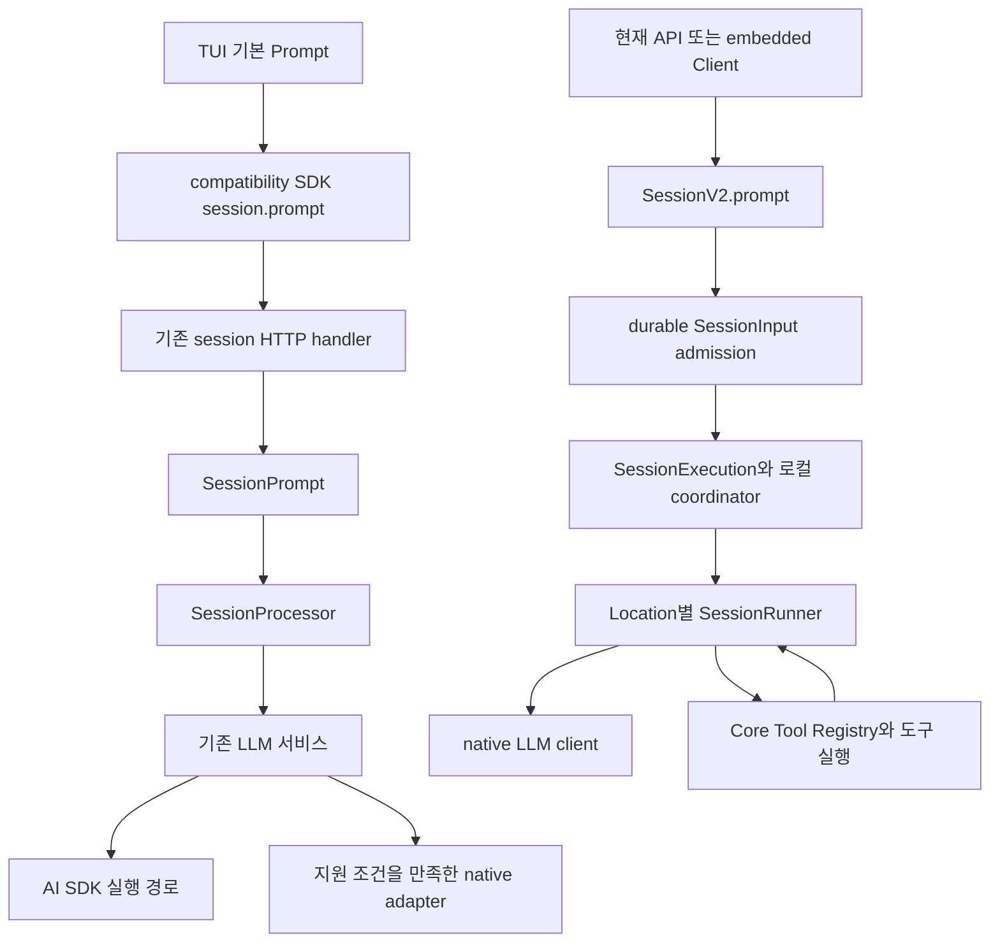

# OpenCode 구조 종합 분석

OpenCode는 TUI, 에이전트 실행, 도구, 모델 연동과 서버를 분리한 TypeScript 모노레포다. 이 커밋에서 가장 중요한 해석 기준은 기존 실행 경로와 새 V2 실행 경로가 함께 존재한다는 점이다. 같은 화면이나 `v2`라는 이름을 공유해도 요청 API, 실행 엔진, 지원 기능이 같다고 가정할 수 없다.

분석 기준은 `dev` 커밋 `907b3bc518fa48e90e8ec24dd327d13eee71c36c`이며, 원본 checkout은 `/Users/yakisoba0728/Documents/GitHub/opencode`이다. GPT 6.1 Sol / ultra 세션 8개가 모두 오류 없이 완료했고, 보고서와 coverage 파일을 확인했다. 이 문서는 영역별 핵심 결론과 직접 확인한 교차 호출 경로를 연결한다. 아래 설명의 확인 수준과 실행 한계는 마지막 절에 구분한다.

## 먼저 읽을 보고서

| 영역 | 보고서 | 핵심 질문 |
|---|---|---|
| 엔진 | [엔진과 세션 실행](./01-engine.md) | 입력이 언제 모델에 보이며, 실행과 취소 및 재개를 누가 소유하는가 |
| 도구 | [도구 실행과 권한](./02-tools.md) | 호출을 언제 기록하고 승인하며, 파일과 프로세스 및 결과를 어떻게 관리하는가 |
| 모델 | [모델 연동과 스트리밍](./03-models.md) | 어떤 요청과 프로토콜이 각 실행 경로에서 실제 사용되는가 |
| TUI | [TUI 구현과 상호작용](./04-tui.md) | 입력과 스트리밍 이벤트가 화면 및 사용자 상호작용으로 연결되는가 |
| 데이터 | [데이터 저장과 API](./05-data-api.md) | 접수, 메시지, 이벤트 및 API의 영속성과 재생 계약은 무엇인가 |
| 확장 | [설정과 확장 기능](./06-extensions.md) | 설정, 플러그인과 외부 도구를 어느 실행 경로에 주입하는가 |
| 클라이언트 | [웹과 데스크톱](./07-clients.md) | 공용 화면, 서버 상태와 OS 통합의 책임을 어떻게 분리하는가 |
| 운영 | [빌드와 테스트 및 운영](./08-build-ops.md) | 개발 진입점, 배포 바이너리와 서비스 운영 경로는 어떻게 다른가 |

영역과 담당 경로는 [분석 계획](./analysis-plan.json), 패키지 manifest 목록과 의존성은 [저장소 목록](./repository-inventory.json)에 있다. 각 영역의 coverage JSON은 자세히 읽은 경로, 표본 조사 및 실행하지 못한 범위를 기록한다.

## 8개 영역의 핵심 결과

| 영역 | 현재 커밋에서 확인한 핵심 결과 | 이번 분석에서 실행한 검증 |
|---|---|---|
| [엔진](./01-engine.md) | 기존 SessionPrompt와 V2 SessionRunner가 공존한다. V2는 입력 접수와 실행을 분리하고, 같은 세션의 실행을 프로세스 내 coordinator가 직렬화한다. 영속 입력이 전체 실행의 재시작 복구를 보장하지는 않는다. | 격리 환경에서 coordinator·Runner·SystemContext·mutex·LayerNode 관련 기존 테스트 75개 통과 |
| [도구](./02-tools.md) | 모델 catalog 노출과 leaf 권한 검사는 별개다. 승인 대기 상태는 메모리에 있고, 파일·프로세스 side effect와 영속 결과는 공통 transaction으로 묶이지 않는다. V2 task/MCP/plugin/codemode 연결 일부는 미완료다. | 소스·테스트 assertion 독해와 링크/coverage 검사; 기능 테스트 미실행 |
| [모델](./03-models.md) | 기본 기존 엔진은 AI SDK를 사용한다. V2 runner의 native route 지원은 catalog보다 좁고, 기존 Codex/Copilot transport 및 AISDK hook과의 동등한 연결은 갖춰지지 않았다. | 소스·테스트 assertion 독해와 링크/coverage 검사; 실제 provider/OAuth 호출 미실행 |
| [TUI](./04-tui.md) | OpenTUI와 Solid 화면을 두 CLI가 공유하지만 기본 제출과 세션 표시는 기존 경로다. 새 CLI의 빈 plugin host와 slot 초기화 차이, 남아 있는 Core 의존성을 확인했다. | 원본 순수 helper를 Node에서 실행한 assertion 18개 통과; 터미널 renderer 미기동 |
| [데이터/API](./05-data-api.md) | V2 durable event·sequence·projection은 SQLite transaction을 공유한다. 전체 live SSE와 세션별 durable replay는 계약이 다르고, compatibility SDK의 v2 이름도 엔진 선택을 뜻하지 않는다. | 생성 Promise client의 request/error/SSE 시나리오 10개를 fetch fixture로 실행해 통과 |
| [설정/확장](./06-extensions.md) | 기존 설정 병합과 V2 ordered entries, 기존 plugin 함수와 native scoped plugin의 ABI가 다르다. 설정 변환만으로 확장 기능 호환을 보장할 수 없으며 native 연결 일부는 미완료다. | 소스·테스트 assertion 독해와 링크/coverage 검사; MCP/LSP/외부 통합 미실행 |
| [웹/데스크톱](./07-clients.md) | UI 레이아웃, 서버 프로토콜, desktop sidecar는 서로 다른 선택 축이다. 웹은 API를 소비하고 Electron이 app을 호스팅한다. V2 reconnect의 replay cursor와 일부 PTY 연결은 추가 검증 대상이다. | app 순수 모듈 3개 smoke 검증 및 desktop helper 8개·assertion 27개 통과 |
| [빌드/운영](./08-build-ops.md) | 기본 개발·npm 배포는 기존 opencode로 이어진다. 새 CLI lildax는 preview이며 표준 npm 발행 연결은 없다. 일반 Turbo test graph에서 실제 test 명령을 가진 패키지는 6개다. | Turbo dry-run, Bash/Node 문법 검사, 가짜 executable을 이용한 launcher 전달 검증 통과 |

위 실행 결과는 각 세션 보고서에 기록된 제한 검증이다. root 검토에서는 주요 결론과 경계, 링크·coverage 정합성을 대조했으며 해당 테스트를 다시 실행하지 않았다. 서로 다른 테스트·assertion·smoke 검증을 하나의 전체 통과 수치로 합산하지 않는다.

## 실제 실행 경로 두 가지

기본 TUI의 Prompt는 compatibility SDK의 `session.prompt`를 호출한다. 기존 HTTP handler는 `SessionPrompt.Service`에 요청을 전달한다. 따라서 현재 기본 TUI 입력을 V2 durable inbox 요청으로 설명하면 실제 호출 경로와 다르다. [TUI 제출](https://github.com/anomalyco/opencode/blob/907b3bc518fa48e90e8ec24dd327d13eee71c36c/packages/tui/src/component/prompt/index.tsx#L1093), [기존 서버 handler](https://github.com/anomalyco/opencode/blob/907b3bc518fa48e90e8ec24dd327d13eee71c36c/packages/opencode/src/server/routes/instance/httpapi/handlers/session.ts#L295).

현재 V2 `SessionV2.prompt`는 기본 delivery를 `steer`로 정하고 `SessionInput.admit`을 통해 입력을 기록한다. 접수 후 `resume:false`가 아니면 실행 wake를 요청한다. 이는 요청이 접수되었다는 상태이며 모델 응답 완료와는 별도다. 실행 placement는 로컬 coordinator가 SessionStore에서 조회하고 해당 Location의 SessionRunner로 전달한다. [V2 접수](https://github.com/anomalyco/opencode/blob/907b3bc518fa48e90e8ec24dd327d13eee71c36c/packages/core/src/session.ts#L360), [실행 routing](https://github.com/anomalyco/opencode/blob/907b3bc518fa48e90e8ec24dd327d13eee71c36c/packages/core/src/session/execution/local.ts#L16).

기존 LLM 서비스에는 AI SDK와 opt-in native adapter의 분기가 있다. 새 native runner가 존재한다는 사실이 기존 에이전트 루프의 제거를 뜻하지 않는다. 각 adapter와 provider의 지원 조건은 모델 보고서에서 확인한다. [기존 runtime 분기](https://github.com/anomalyco/opencode/blob/907b3bc518fa48e90e8ec24dd327d13eee71c36c/packages/opencode/src/session/llm.ts#L224), [V2 runner 계약](https://github.com/anomalyco/opencode/blob/907b3bc518fa48e90e8ec24dd327d13eee71c36c/packages/core/src/session/runner/index.ts#L19).

## TUI 공유와 기능 동등성의 차이

`packages/tui`는 OpenTUI renderer와 Solid reactive 상태를 사용한다. 기존 CLI와 새 CLI가 같은 `run`을 호출하지만 host 구성이 다르다. 새 CLI adapter는 빈 설정을 resolve하고 plugin host의 start와 dispose를 비워 둔다. 네 개의 기존 catalog/config endpoint가 404일 때 빈 결과로 치환하는 좁은 fallback도 있다. 이러한 코드 공유만으로 두 실행 방식의 기능 동등성을 입증할 수 없다. [새 CLI의 TUI adapter](https://github.com/anomalyco/opencode/blob/907b3bc518fa48e90e8ec24dd327d13eee71c36c/packages/cli/src/tui.ts#L7).

화면 상태 갱신은 모델의 요청 응답 body를 화면에 그대로 출력하는 구조가 아니다. SDK context가 별도 이벤트 source 또는 SSE를 구독하고, Sync/Data 등의 context가 이벤트를 화면용 store에 반영한다. renderer와 입력, API transport, 세션 실행은 서로 다른 수명과 책임을 갖는다. [SDK 이벤트 context](https://github.com/anomalyco/opencode/blob/907b3bc518fa48e90e8ec24dd327d13eee71c36c/packages/tui/src/context/sdk.tsx#L9), [TUI 상태 동기화](https://github.com/anomalyco/opencode/blob/907b3bc518fa48e90e8ec24dd327d13eee71c36c/packages/tui/src/context/sync.tsx#L176).

기존 worker 기반 실행, 원격 attach, 새 daemon 기반 실행과 각 plugin/slot 경계의 세부 동작 및 정적 제한은 TUI 보고서에서 다룬다. 실제 터미널에서의 기능 검증과 코드 경로 분석은 별도로 구분해야 한다.

## SDK와 API 이름을 읽는 기준

`packages/sdk/js/src/v2`는 compatibility SDK의 생성 디렉터리이며 현재 SessionV2 API만을 의미하지 않는다. TUI의 `@opencode-ai/sdk/v2` import를 보고 새 durable prompt API를 사용하는 것으로 판단해서는 안 된다.

현재 계약은 Schema, Protocol, Core, Server, Client 및 sdk-next로 분리되어 있다. runtime 의존성 방향과 generated code의 원본은 루트 지침 및 manifest에 명시되어 있다. `sdk-next`의 embedded 조합과 기존 SDK의 subprocess host도 실행 배치가 다르다. [저장소 지침](https://github.com/anomalyco/opencode/blob/907b3bc518fa48e90e8ec24dd327d13eee71c36c/AGENTS.md#L1), [현재 Protocol](https://github.com/anomalyco/opencode/blob/907b3bc518fa48e90e8ec24dd327d13eee71c36c/packages/protocol/package.json#L1), [현재 Server](https://github.com/anomalyco/opencode/blob/907b3bc518fa48e90e8ec24dd327d13eee71c36c/packages/server/package.json#L1), [sdk-next](https://github.com/anomalyco/opencode/blob/907b3bc518fa48e90e8ec24dd327d13eee71c36c/packages/sdk-next/src/opencode.ts#L1).

API가 선언되거나 SDK 메서드가 생성되었다는 사실만으로 기능 완료를 판단하지 않는다. 예를 들어 V2 Session의 shell은 현재 `OperationUnavailableError`를 반환한다. 실제 handler와 service까지 추적해야 기능의 구현 수준을 알 수 있다. [현재 Session operation](https://github.com/anomalyco/opencode/blob/907b3bc518fa48e90e8ec24dd327d13eee71c36c/packages/core/src/session.ts#L387).

## 실행 상태와 영속 기록의 구분

V2의 SessionExecution은 현재 프로세스의 coordinator와 Location routing을 소유한다. SessionInput과 history를 영속 저장하는 구조는 실행 중인 프로세스와 도구 side effect 전체를 재시작 후 자동 복구한다는 보장과 다르다. runner 주석도 durable continuation recovery를 별도 작업으로 명시한다. 구체적인 interruption settlement, stale tool 정리, Context Epoch와 compaction은 엔진 보고서의 구현 및 테스트 근거를 함께 읽어야 한다. [실행 수명](https://github.com/anomalyco/opencode/blob/907b3bc518fa48e90e8ec24dd327d13eee71c36c/packages/core/src/session/execution/local.ts#L11), [runner의 복구 범위](https://github.com/anomalyco/opencode/blob/907b3bc518fa48e90e8ec24dd327d13eee71c36c/packages/core/src/session/runner/llm.ts#L85).

이벤트에도 서로 다른 계약이 있다. 현재 전체 서버 이벤트 stream은 실시간 bounded 구독을 설치하고 SSE frame의 id를 넣지 않는다. 세션의 durable events API는 aggregate별 after cursor를 받아 저장된 이벤트를 조회한다. 실시간 token 갱신과 durable history 재생을 하나의 보장으로 묶지 않는다. [전체 이벤트 SSE](https://github.com/anomalyco/opencode/blob/907b3bc518fa48e90e8ec24dd327d13eee71c36c/packages/server/src/handlers/event.ts#L9), [세션 durable events](https://github.com/anomalyco/opencode/blob/907b3bc518fa48e90e8ec24dd327d13eee71c36c/packages/core/src/session.ts#L346).

기존 EventV2Bridge는 event에 directory/workspace와 기존 payload wrapper를 붙여 GlobalBus에 전달한다. 코드에는 모든 V2 도메인 이벤트를 기존 Message/Part 이벤트로 의미 변환하는 로직이 없다. UI가 각 이벤트를 소비하는 방식과 실제 projector를 함께 확인해야 한다. [bridge의 실제 변환](https://github.com/anomalyco/opencode/blob/907b3bc518fa48e90e8ec24dd327d13eee71c36c/packages/opencode/src/event-v2-bridge.ts#L35).

## 도구와 화면의 경계

도구의 실행 계약과 모델에 보이는 결과의 크기 제한은 Core에 있다. ToolOutputStore의 기본 한도는 2,000줄과 50 KiB이며 설정으로 바꿀 수 있다. 이는 shell 프로세스의 capture 한도나 UI 스크롤 창의 크기와 별개다. [결과 기본 한도](https://github.com/anomalyco/opencode/blob/907b3bc518fa48e90e8ec24dd327d13eee71c36c/packages/core/src/tool-output-store.ts#L13), [설정 적용](https://github.com/anomalyco/opencode/blob/907b3bc518fa48e90e8ec24dd327d13eee71c36c/packages/core/src/tool-output-store.ts#L120).

TUI와 공용 session-ui의 도구 renderer는 서버에서 받은 이름, 상태와 metadata를 표시한다. 도구의 권한 결정과 파일 및 프로세스 실행은 별도의 서버/Core 책임이다. 도구를 추가할 때 필요한 registry, 실행 policy, output shape와 표시 컴포넌트의 계약을 구분해 읽는 것이 전체 구조를 이해하는 데 도움이 된다.

## 교차 확인한 질문

| 질문 | 코드에서 확인한 내용 | 남은 경계 |
|---|---|---|
| 기본 TUI prompt가 어느 엔진을 사용하는가 | 기존 handler가 SessionPrompt.Service에 전달한다 | native opt-in과 AI SDK 선택 조건은 모델 보고서 |
| V2 prompt 응답이 실행 완료인가 | durable admission을 반환하고 별도 wake를 요청한다 | 실행 종료와 재개 정책은 엔진 보고서 |
| bridge가 V2 transcript를 기존 transcript로 모두 바꾸는가 | metadata와 payload wrapper를 변환한다 | projector 및 각 UI reducer의 소비 범위는 데이터와 클라이언트 보고서 |
| 같은 TUI package를 쓰면 두 CLI의 기능이 같은가 | 새 CLI에는 빈 plugin host와 제한된 404 fallback이 있다 | 실제 standalone·daemon·터미널 통합 실행은 미검증 |
| SSE와 durable replay는 같은 계약인가 | 전체 이벤트 live stream과 aggregate after replay가 분리되어 있다 | disconnect, overflow와 UI catch-up은 end-to-end 확인이 필요 |

## 검증 범위

이 종합 안내의 직접 검증은 세션 8개의 정상 완료 상태, 고정 HEAD, 공용 checkout의 Git 상태, 위 주요 호출 경로의 정적 대조다. 보고서와 coverage 파일 8쌍이 존재하고 모두 같은 커밋을 기준으로 작성됐으며, coverage의 필수 항목과 경로를 확인했다. 영역별 보고서의 소스 링크 2,017개는 커밋·파일 존재·줄 범위를 검사했고, 참조 누락이나 임시 소스 표시는 남지 않았다. 원본 checkout은 변경 없이 깨끗하다. 검사 결과와 검토 범위는 [verification-results.json](./verification-results.json)에 저장했다.

링크 검사는 근거 위치의 유효성을 확인하는 절차이며, 보고서의 모든 문장을 실행으로 증명한 결과는 아니다. 영역별 세션이 수행한 테스트와 제한 실행은 각 보고서의 검증 절에 기록한다. 테스트 소스를 읽은 경우와 실제로 실행해 통과한 경우를 합산하거나 혼동하지 않는다.

이번 분석은 운영 설치와 실제 모델 provider를 연결한 전체 coding-agent 실행의 성공을 증명하지 않는다. 명세의 완료 표시, 구현 주석의 체크리스트, 테스트의 존재와 현재 executable behavior 사이의 차이를 각 영역에서 명시한다. 모든 파일과 생성 자산을 동일한 깊이로 읽었다는 주장은 하지 않으며 조사 깊이는 coverage JSON을 통해 확인할 수 있다.
