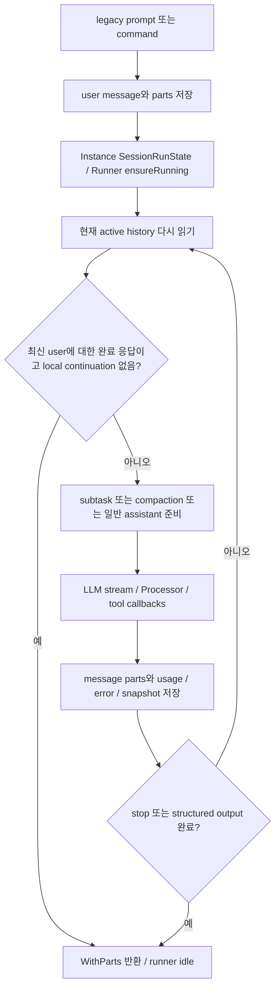
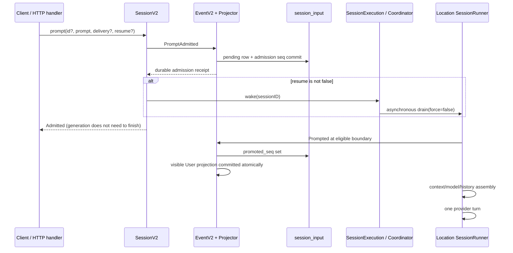
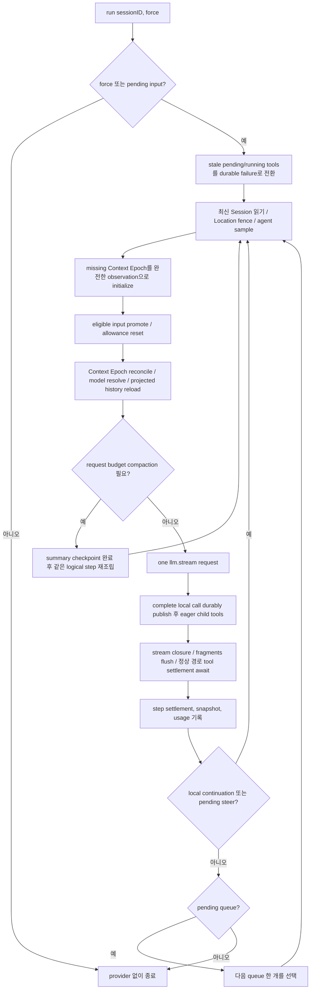
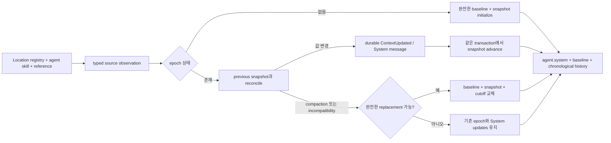
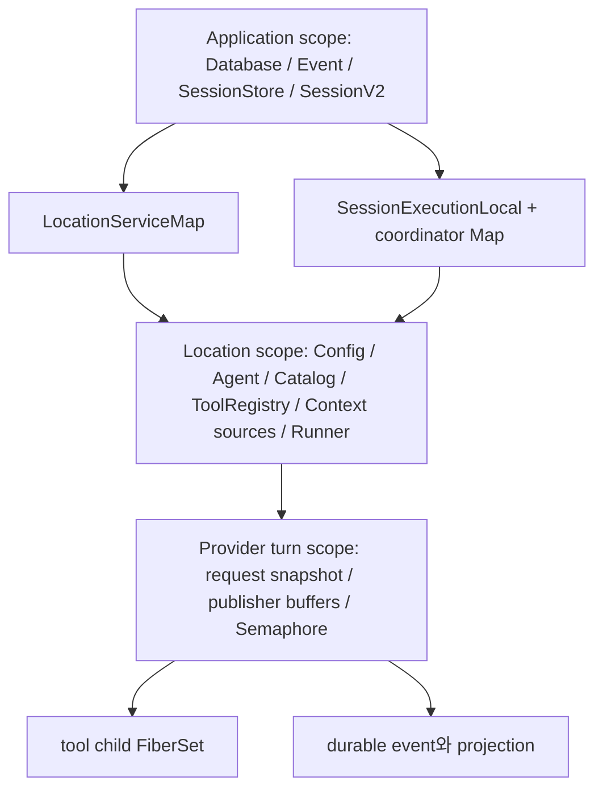

# OpenCode 에이전트 엔진과 세션 실행 분석

분석 기준은 `dev`의 커밋 `907b3bc518fa48e90e8ec24dd327d13eee71c36c`이다. 분석일은 2026-10-04 Asia/Seoul이며, 공용 checkout의 HEAD와 작업 트리가 이 기준에 일치하는지 확인했다. 이 보고서는 OpenCode 자체의 구현을 설명하며 Moodcode 설계 제안은 포함하지 않는다. SQL·migration·HTTP 전송의 세부는 05-data-api, 도구 내부는 02-tools, provider wire encoding은 03-models와 경계를 나눈다.

## 1. 핵심 판단과 읽는 방법

이 커밋에는 **두 개의 실제 엔진이 공존한다**. 기존 `packages/opencode`의 `SessionPrompt`/`SessionProcessor`는 사용자 입력 확장, legacy message/part 저장, 모델 호출, tool orchestration, compaction·subagent를 담당한다. 새 `packages/core`의 `SessionV2`/`SessionExecution`/`SessionRunner`는 입력 접수와 모델 실행을 분리하고, durable inbox와 provider-turn 경계에서 실행을 조립한다. V2는 실험용 파일만 있는 상태가 아니라 실제 서버에 연결되어 있다. 다만 현재 TUI의 일반 submit은 여전히 legacy `sdk.client.session.prompt(...)`를 호출한다. `@opencode-ai/sdk/v2` 또는 V1의 `MessageV2`라는 이름은 native SessionV2 엔진을 뜻하지 않는다. [TUI submit](https://github.com/anomalyco/opencode/blob/907b3bc518fa48e90e8ec24dd327d13eee71c36c/packages/tui/src/component/prompt/index.tsx#L1093-L1112), [legacy와 native router 병합](https://github.com/anomalyco/opencode/blob/907b3bc518fa48e90e8ec24dd327d13eee71c36c/packages/opencode/src/server/routes/instance/httpapi/server.ts#L174-L181), [실제 local execution 주입](https://github.com/anomalyco/opencode/blob/907b3bc518fa48e90e8ec24dd327d13eee71c36c/packages/opencode/src/server/routes/instance/httpapi/server.ts#L271-L304)

V2에서 중요한 영속 경계는 **admission → promotion → provider turn → tool settlement**다. `prompt()` 성공은 입력 접수 성공을 뜻하며, provider 응답 완료를 뜻하지 않는다. 같은 세션은 현재 프로세스의 coordinator에서 하나의 실행에 합류하고, 다른 세션은 동시에 실행된다. 이 직렬화는 distributed lease가 아니며, 재시작 후 provider dispatch의 불확실성을 자동 해결하지 않는다. [SessionV2.prompt](https://github.com/anomalyco/opencode/blob/907b3bc518fa48e90e8ec24dd327d13eee71c36c/packages/core/src/session.ts#L360-L385), [coordinator](https://github.com/anomalyco/opencode/blob/907b3bc518fa48e90e8ec24dd327d13eee71c36c/packages/core/src/session/run-coordinator.ts#L24-L104), [복구가 별도 설계임을 명시한 명세](https://github.com/anomalyco/opencode/blob/907b3bc518fa48e90e8ec24dd327d13eee71c36c/specs/v2/session.md#L160-L185)

**확인 수준**을 다음과 같이 구분한다. 본문의 구현 설명은 고정 커밋 소스와 테스트를 읽은 정적 확인이다. 별도 표시한 소형 실행 테스트만 이번 조사에서 실행했다. 명세의 목표·TODO는 구현 사실로 취급하지 않는다. 설계 제약에서 가능한 결과를 논할 때는 해석 또는 미검증 질문이라고 표시한다. 실제 provider 요청과 전체 앱 통합 테스트는 실행하지 않았다.

## 2. 책임과 실제 진입점

| 모듈 | 범위와 역할 | 실행상의 의미 |
|---|---|---|
| V1 `SessionPrompt` | Instance 범위의 입력·명령·shell·loop facade | user message를 먼저 만들고 동일 세션의 기존 loop에 합류할 수 있다 |
| V1 `SessionProcessor` | assistant provider stream 처리 | text/reasoning/tool/usage/snapshot part를 갱신하고 `continue`/`compact`/`stop`을 반환한다 |
| V1 `SessionRunState` + `Runner` | Instance별 session-key 실행 소유권 | model loop와 shell 작업의 충돌·합류·취소를 조정한다 |
| V2 `SessionV2` | global graph의 Session facade | create/adopt, input admission, switching, read APIs, 실행 위임 |
| V2 `SessionExecution` | global graph의 Session-ID router 계약 | abstract unbound node를 local 구현으로 교체한다 |
| V2 `SessionRunCoordinator` | local active Map과 owner fiber | 같은 ID의 run 합류, wake 합치기, interrupt cleanup |
| V2 `SessionRunner` | Location 범위의 `run({sessionID, force})` | turn preparation·stream·tool settlement·durable continuation |
| `SessionStore`/`SessionHistory` | 영속 projection 읽기 | history를 매 turn 재조회하며 compaction/epoch cutoff 적용 |
| `SessionContextEpoch` | 세션별 operational state | 고정 baseline과 변경 비교용 snapshot을 저장한다 |

V2 데이터 타입의 정의 주체는 `packages/schema`다. core의 `session/schema`, `message`, `event`, `prompt`는 이를 re-export하며 별도 transcript 타입을 만들지 않는다. `Session.Info`는 placement·agent·model·parent·usage·revert state이고, 사용자 `PromptInput`의 file attachment에는 MIME이 없지만 durable `Prompt`에는 정규화한 MIME이 있다. admission receipt, projected message, execution completion은 서로 다른 반환 타입이다. [Session 타입 alias](https://github.com/anomalyco/opencode/blob/907b3bc518fa48e90e8ec24dd327d13eee71c36c/packages/core/src/session/schema.ts#L1-L9), [message/event alias](https://github.com/anomalyco/opencode/blob/907b3bc518fa48e90e8ec24dd327d13eee71c36c/packages/core/src/session/message.ts#L1-L2), [event alias](https://github.com/anomalyco/opencode/blob/907b3bc518fa48e90e8ec24dd327d13eee71c36c/packages/core/src/session/event.ts#L1-L2), [입력 타입](https://github.com/anomalyco/opencode/blob/907b3bc518fa48e90e8ec24dd327d13eee71c36c/packages/schema/src/prompt-input.ts#L7-L26), [durable Prompt](https://github.com/anomalyco/opencode/blob/907b3bc518fa48e90e8ec24dd327d13eee71c36c/packages/schema/src/prompt.ts#L12-L57), [Info row 변환](https://github.com/anomalyco/opencode/blob/907b3bc518fa48e90e8ec24dd327d13eee71c36c/packages/core/src/session/info.ts#L14-L50)

Effect의 typed failure에는 Session의 NotFound/PromptConflict/OperationUnavailable와 turn 준비의 message/context decode·model resolution·LLM 오류 등이 있다. defect·interrupt는 별도 Cause로 처리한다. “API가 접수를 반환했다”, “대화에 실패가 저장됐다”, “실행 Effect가 실패했다”는 서로 같지 않으며 아래 오류 경로에서 이 구분을 유지한다. [facade error](https://github.com/anomalyco/opencode/blob/907b3bc518fa48e90e8ec24dd327d13eee71c36c/packages/core/src/session.ts#L94-L113), [decode 오류](https://github.com/anomalyco/opencode/blob/907b3bc518fa48e90e8ec24dd327d13eee71c36c/packages/core/src/session/error.ts#L5-L24), [RunError](https://github.com/anomalyco/opencode/blob/907b3bc518fa48e90e8ec24dd327d13eee71c36c/packages/core/src/session/runner/index.ts#L11-L20)

V2 `runner/index.ts`는 구현 파일이 아니라 `RunError`와 Service 계약이며, 실제 layer는 `runner/llm.ts`에 있다. `SessionExecution.node` 역시 unbound다. `execution/local.ts`가 SessionStore에서 최신 placement를 읽고 `LocationServiceMap.get(session.location)`을 제공하여 `runner.run(...)`을 호출한다. Session ID를 layer의 identity로 삼지 않는다. [Runner 계약](https://github.com/anomalyco/opencode/blob/907b3bc518fa48e90e8ec24dd327d13eee71c36c/packages/core/src/session/runner/index.ts#L11-L28), [Execution 계약과 noopLayer](https://github.com/anomalyco/opencode/blob/907b3bc518fa48e90e8ec24dd327d13eee71c36c/packages/core/src/session/execution.ts#L9-L34), [local routing](https://github.com/anomalyco/opencode/blob/907b3bc518fa48e90e8ec24dd327d13eee71c36c/packages/core/src/session/execution/local.ts#L11-L44)

실제 연결은 세 갈래로 확인했다.

1. `packages/opencode`의 기존 HTTP 서버는 legacy instance handlers와 새 `packages/server` handlers를 함께 병합하고, native facade에 `SessionExecutionLocal.node`를 주입한다. 따라서 같은 binary가 두 계약을 제공할 수 있다. [router 구성](https://github.com/anomalyco/opencode/blob/907b3bc518fa48e90e8ec24dd327d13eee71c36c/packages/opencode/src/server/routes/instance/httpapi/server.ts#L156-L181), [layer 교체](https://github.com/anomalyco/opencode/blob/907b3bc518fa48e90e8ec24dd327d13eee71c36c/packages/opencode/src/server/routes/instance/httpapi/server.ts#L295-L306)
2. 새 `packages/server/routes.ts`는 SessionV2.node를 application graph에 넣고 local execution 구현으로 교체한다. 새 CLI의 `serve`는 이 router를 NodeHttpServer로 노출한다. 다만 새 CLI가 호출하는 TUI 일반 submit은 앞서 설명한 legacy API이므로 새 CLI와 TUI 사이의 전체 기능 호환을 이 정적 연결만으로 확정할 수 없다. [native server graph](https://github.com/anomalyco/opencode/blob/907b3bc518fa48e90e8ec24dd327d13eee71c36c/packages/server/src/routes.ts#L26-L62), [새 CLI serve](https://github.com/anomalyco/opencode/blob/907b3bc518fa48e90e8ec24dd327d13eee71c36c/packages/cli/src/commands/handlers/serve.ts#L15-L45), [새 CLI 기본 명령](https://github.com/anomalyco/opencode/blob/907b3bc518fa48e90e8ec24dd327d13eee71c36c/packages/cli/src/commands/handlers/default.ts#L6-L12)
3. `sdk-next/OpenCode.create()`는 같은 native router를 in-memory HTTP transport로 사용한다. 별도 orchestration shortcut이 아니다. acquire/release된 web handler의 `dispose`가 owner scope 종료에 연결된다. [embedded 진입점](https://github.com/anomalyco/opencode/blob/907b3bc518fa48e90e8ec24dd327d13eee71c36c/packages/sdk-next/src/opencode.ts#L10-L42)

HTTP의 native `POST /api/session/:sessionID/prompt`는 `SessionV2.prompt()`의 admission receipt를 반환한다. `resume`은 여기서 boolean scheduling 옵션이다. core의 `sessions.resume(sessionID)`는 기다리는 explicit 실행 API지만, 조사한 Protocol Session group에는 별도 resume endpoint가 없다. `wait` endpoint는 존재하나 현재 facade에서 OperationUnavailableError를 반환한다. `SessionExecution.noopLayer`는 durable recording만 필요한 저수준 호환·테스트용이며 실제 위 서버 graph는 local 구현을 선택한다. [prompt endpoint](https://github.com/anomalyco/opencode/blob/907b3bc518fa48e90e8ec24dd327d13eee71c36c/packages/protocol/src/groups/session.ts#L204-L223), [native handler](https://github.com/anomalyco/opencode/blob/907b3bc518fa48e90e8ec24dd327d13eee71c36c/packages/server/src/handlers/session.ts#L139-L171), [wait 미구현](https://github.com/anomalyco/opencode/blob/907b3bc518fa48e90e8ec24dd327d13eee71c36c/packages/core/src/session.ts#L417-L431)

## 3. V1 SessionPrompt와 SessionProcessor 실행

### 3.1 실제 진입점과 입력 저장

V1 HTTP 핸들러는 `SessionPrompt.Service`의 `prompt`, `loop`, `command`, `shell`, `cancel`을 직접 호출한다. `prompt`는 세션 조회와 revert cleanup 후 사용자 메시지를 만들고 touch한 다음 `loop`를 호출한다. `createUserMessage`는 agent/model 선택을 먼저 세션에 반영하고 입력 part를 해석한 뒤 `chat.message` hook, 이미지 정규화, 메시지 저장, 각 part 저장을 순서대로 수행한다. `noReply`면 저장한 사용자 메시지를 반환한다. 동기 HTTP prompt는 최종 `WithParts` 결과를 JSON stream으로 반환하고, `promptAsync`는 전체 prompt effect를 handler Scope에 fork하고 NoContent를 반환한다. 따라서 async 응답 자체가 사용자 메시지와 모든 part의 원자적 durable admission을 확인하는 시점은 아니다. [handlers/session.ts:275–329](https://github.com/anomalyco/opencode/blob/907b3bc518fa48e90e8ec24dd327d13eee71c36c/packages/opencode/src/server/routes/instance/httpapi/handlers/session.ts#L275-L329) [prompt.ts:635–699](https://github.com/anomalyco/opencode/blob/907b3bc518fa48e90e8ec24dd327d13eee71c36c/packages/opencode/src/session/prompt.ts#L635-L699) [prompt.ts:995–1071](https://github.com/anomalyco/opencode/blob/907b3bc518fa48e90e8ec24dd327d13eee71c36c/packages/opencode/src/session/prompt.ts#L995-L1071)

`loop`는 `SessionRunState.ensureRunning(sessionID, lastAssistant, runLoop)`에 들어간다. 이미 같은 runner가 Running이면 새 work를 실행하지 않고 기존 run의 Deferred 결과에 합류한다. 새 prompt의 사용자 메시지는 이 합류 **전에** 이미 저장되므로, 실행 중 새 입력은 다음 반복의 transcript 조회에서 관찰된다. 이는 durable inbox에 별도 `queue`/`steer` delivery를 admission하는 V2 계약과 구별된다. V1 `PromptInput`에 delivery/resume/queue/steer 필드는 없고 `noReply`만 있다. Slash command는 template·shell expansion과 agent/model 선택 뒤 prompt로 들어가며, subagent command는 `subtask` part를 만든다. CLI `run`은 legacy SDK의 session.prompt/command를 호출한다. [prompt.ts:1343–1481](https://github.com/anomalyco/opencode/blob/907b3bc518fa48e90e8ec24dd327d13eee71c36c/packages/opencode/src/session/prompt.ts#L1343-L1481) [prompt.ts:1499–1520](https://github.com/anomalyco/opencode/blob/907b3bc518fa48e90e8ec24dd327d13eee71c36c/packages/opencode/src/session/prompt.ts#L1499-L1520) [runner.ts:115–138](https://github.com/anomalyco/opencode/blob/907b3bc518fa48e90e8ec24dd327d13eee71c36c/packages/opencode/src/effect/runner.ts#L115-L138) [cli/cmd/run.ts:828–878](https://github.com/anomalyco/opencode/blob/907b3bc518fa48e90e8ec24dd327d13eee71c36c/packages/opencode/src/cli/cmd/run.ts#L828-L878)

### 3.2 history reload와 loop 종료

`runLoop`는 세션 객체를 입장 시 한 번 읽고 `step=0`을 둔다. 매 반복 busy 상태를 내보내고 DB projection에서 `MessageV2.filterCompactedEffect`로 현재 활성 history를 다시 읽는다. `latest`는 compaction 후 배열 재배치에도 생성시각과 ID로 최신 user/assistant/finished를 찾는다. 종료는 최신 assistant의 finish가 `tool-calls`/`unknown` 외의 값이고, provider가 자체 실행한 도구나 interrupted orphan을 제외한 로컬 tool part가 없으며, assistant.parentID가 최신 user.id와 같을 때다. 따라서 provider가 `stop`과 로컬 tool call을 함께 보내면 다음 LLM 호출로 tool 결과를 회신하고, 도중 저장된 새 user가 있으면 이전 assistant의 stop으로 끝나지 않는다. pending/running transcript tool은 model-message 변환 시 interrupted 오류로 표현하며 도구를 그대로 재실행하는 복구 루프는 아니다. [prompt.ts:1081–1179](https://github.com/anomalyco/opencode/blob/907b3bc518fa48e90e8ec24dd327d13eee71c36c/packages/opencode/src/session/prompt.ts#L1081-L1179) [message-v2.ts:525–609](https://github.com/anomalyco/opencode/blob/907b3bc518fa48e90e8ec24dd327d13eee71c36c/packages/opencode/src/session/message-v2.ts#L525-L609) [message-v2.ts:297–360](https://github.com/anomalyco/opencode/blob/907b3bc518fa48e90e8ec24dd327d13eee71c36c/packages/opencode/src/session/message-v2.ts#L297-L360)

`step++`는 subtask/compaction dispatch보다 먼저 수행되며 새 사용자 입력이나 compaction 후에 초기화되지 않는다. tasks.pop으로 subtask를 처리하거나 compaction.process를 실행한 뒤 continue하고, 마지막 완료 응답의 사용량이 overflow면 compaction marker를 생성한다. 일반 turn은 assistant 메시지를 먼저 저장하고 Processor handle을 만든 다음 tool과 system/history를 구성한다. 첫 step의 title 생성 및 snapshot summary 계산, 끝의 prune는 service Scope의 별도 fiber에 fork되고 오류는 ignore한다. title은 첫 실제 사용자 입력의 기본 이름인 root 세션만 대상으로 별도 title agent와 small model을 사용한다. `SessionSummary.summarize`는 파일 snapshot diff 계산이며 LLM 대화 요약은 `SessionCompaction.process`의 일이다. [prompt.ts:193–253](https://github.com/anomalyco/opencode/blob/907b3bc518fa48e90e8ec24dd327d13eee71c36c/packages/opencode/src/session/prompt.ts#L193-L253) [prompt.ts:1132–1255](https://github.com/anomalyco/opencode/blob/907b3bc518fa48e90e8ec24dd327d13eee71c36c/packages/opencode/src/session/prompt.ts#L1132-L1255) [prompt.ts:1319–1341](https://github.com/anomalyco/opencode/blob/907b3bc518fa48e90e8ec24dd327d13eee71c36c/packages/opencode/src/session/prompt.ts#L1319-L1341) [summary.ts:82–129](https://github.com/anomalyco/opencode/blob/907b3bc518fa48e90e8ec24dd327d13eee71c36c/packages/opencode/src/session/summary.ts#L82-L129)

### 3.3 Processor의 part·tool·실패·retry 계약

Processor는 AI SDK/normalized LLM event를 받아 text/reasoning part, pending→running→completed/error tool part, step-start/finish, snapshot patch 및 사용량을 저장한다. `create`는 stream이 도구를 실행하기 전에 snapshot을 먼저 잡는다. text/reasoning delta는 live delta event로 발행하고 end/cleanup에서 전체 part를 저장한다. Tool resolve 경계는 EffectBridge로 instance/workspace context를 유지한 채 plugin before→실제 tool→plugin after를 Promise execute에 감싼다. 실제 도구 실행과 abortSignal은 기본 경로에서 AI SDK가 소유하고 Processor는 event·metadata·결과를 영속 transcript로 연결한다. Permission/Question 거절은 기본 설정에서 blocked로 다음 loop를 정지시키고, 일반 tool 오류는 tool-error part로 남아 다음 model turn에서 보일 수 있다. Doom-loop 검사는 현재 assistant의 마지막 3개 part에서 동일 도구/input을 확인한다. [processor.ts:98–253](https://github.com/anomalyco/opencode/blob/907b3bc518fa48e90e8ec24dd327d13eee71c36c/packages/opencode/src/session/processor.ts#L98-L253) [processor.ts:331–497](https://github.com/anomalyco/opencode/blob/907b3bc518fa48e90e8ec24dd327d13eee71c36c/packages/opencode/src/session/processor.ts#L331-L497) [processor.ts:500–550](https://github.com/anomalyco/opencode/blob/907b3bc518fa48e90e8ec24dd327d13eee71c36c/packages/opencode/src/session/processor.ts#L500-L550) [tools.ts:41–134](https://github.com/anomalyco/opencode/blob/907b3bc518fa48e90e8ec24dd327d13eee71c36c/packages/opencode/src/session/tools.ts#L41-L134)

`process`의 외부 retry는 동일 assistant handle과 동일 streamInput을 다시 사용하며 매 retry에 currentText/reasoningMap을 초기화한다. retry 정책은 context overflow를 제외하고 retryable/API 5xx/알려진 transient 메시지를 분류하며 최대 retry 5와 retry-after 또는 지수 backoff·jitter를 사용한다. retry 상태에는 attempt/message/next를 내보낸다. overflow는 compact로, blocked/assistant.error는 stop으로, 그 외는 continue로 반환한다. interruption은 AbortError를 기록하고 cleanup을 실행한다. cleanup은 남은 snapshot/text/reasoning을 마무리하고 tool Deferred 완료를 최대 **250ms** 기다린 뒤 미완료 tool을 `Tool execution aborted`, `metadata.interrupted=true` 오류로 닫으며 assistant.completed를 저장한다. 이 grace는 도구의 durable exactly-once나 crash 후 실행 재개 계약이 아니다. [processor.ts:553–611](https://github.com/anomalyco/opencode/blob/907b3bc518fa48e90e8ec24dd327d13eee71c36c/packages/opencode/src/session/processor.ts#L553-L611) [processor.ts:613–695](https://github.com/anomalyco/opencode/blob/907b3bc518fa48e90e8ec24dd327d13eee71c36c/packages/opencode/src/session/processor.ts#L613-L695) [retry.ts:26–86](https://github.com/anomalyco/opencode/blob/907b3bc518fa48e90e8ec24dd327d13eee71c36c/packages/opencode/src/session/retry.ts#L26-L86) [retry.ts:183–207](https://github.com/anomalyco/opencode/blob/907b3bc518fa48e90e8ec24dd327d13eee71c36c/packages/opencode/src/session/retry.ts#L183-L207)

### 3.4 Runner 상태·동시성·취소

Runner의 `SynchronizedRef` 상태는 아래 네 가지다. SessionRunState는 `InstanceState.make` 내부의 sessionID→Runner Map을 사용하고 InstanceState cache key는 `InstanceRef.directory`다. 따라서 동일 service runtime/instance(directory) 안에서 세션별 실행이 직렬화되고 서로 다른 sessionID는 별도 runner를 얻는다. 여러 directory/runtime 전체에 대한 전역 session lock으로 일반화할 수 없다. status 또한 InstanceState Map으로 busy/retry를 유지하고 idle이면 항목을 삭제한다. [runner.ts:33–138](https://github.com/anomalyco/opencode/blob/907b3bc518fa48e90e8ec24dd327d13eee71c36c/packages/opencode/src/effect/runner.ts#L33-L138) [run-state.ts:35–105](https://github.com/anomalyco/opencode/blob/907b3bc518fa48e90e8ec24dd327d13eee71c36c/packages/opencode/src/session/run-state.ts#L35-L105) [instance-state.ts:26–50](https://github.com/anomalyco/opencode/blob/907b3bc518fa48e90e8ec24dd327d13eee71c36c/packages/opencode/src/effect/instance-state.ts#L26-L50) [status.ts:26–48](https://github.com/anomalyco/opencode/blob/907b3bc518fa48e90e8ec24dd327d13eee71c36c/packages/opencode/src/session/status.ts#L26-L48)

| 상태 | 입장/전이 계약 |
|---|---|
| Idle | ensureRunning은 instance Scope에 run을 fork; startShell은 shell을 시작 |
| Running | ensureRunning 호출자는 동일 run Deferred에 합류; startShell은 Busy |
| Shell | ensureRunning은 단 하나의 대기 run을 만들어 ShellThenRun으로; 추가 shell은 Busy |
| ShellThenRun | 추가 ensureRunning은 대기 run에 합류; shell 완료 후 그 run을 시작 |

취소는 synchronized state를 먼저 Idle로 바꾼 다음 이전 fiber interruption/cleanup을 기다린다. 이전 run의 finish는 현재 run id가 같은 경우에만 idle 전이를 수행하므로, interruption cleanup이 아직 끝나기 전에 시작된 replacement를 이전 완료가 지우지 않는다. Shell 취소는 transcript setup의 ready latch를 기다리고 shell fiber를 interrupt한다. process cleanup은 SessionPrompt.shell의 실행 경로에 연결되어 있으며 leaf 구현은 02 범위다. 부모 취소는 background job의 sessionId/parentSessionId 연결을 재귀적으로 찾아 취소한다. 실행 중 waiter의 수와 저장 사용자 입력 수가 각각 독립적이므로 테스트의 “queued callers”를 사용자 turn FIFO inbox로 읽으면 안 된다. 원본 runner.ts를 변경 없이 복사하고 원본 runner.test.ts의 두 import만 격리 경로로 바꿔 실행한 결과 **25 pass, 0 fail, 60 expect**였다(Bun 1.3.14, effect 4.0.0-beta.83). 이는 Runner 동시성/취소 단위 검증이며 V1 전체 통합 실행은 아니다. [runner.ts:70–113](https://github.com/anomalyco/opencode/blob/907b3bc518fa48e90e8ec24dd327d13eee71c36c/packages/opencode/src/effect/runner.ts#L70-L113) [runner.ts:140–202](https://github.com/anomalyco/opencode/blob/907b3bc518fa48e90e8ec24dd327d13eee71c36c/packages/opencode/src/effect/runner.ts#L140-L202) [run-state.ts:111–143](https://github.com/anomalyco/opencode/blob/907b3bc518fa48e90e8ec24dd327d13eee71c36c/packages/opencode/src/session/run-state.ts#L111-L143) [runner.test.ts:206–249](https://github.com/anomalyco/opencode/blob/907b3bc518fa48e90e8ec24dd327d13eee71c36c/packages/opencode/test/effect/runner.test.ts#L206-L249)

### 3.5 task child·background와 compaction

TaskTool은 promptOps를 주입받아 child 세션에서 다시 `SessionPrompt.prompt`를 호출한다. task_id가 있으면 기존 child transcript에 새 user를 추가하여 재사용하고 조회 실패면 child를 새로 만든다. 새 child의 parentID는 호출 세션이며 parent chain에 대한 subagent_depth(기본 1) 한계를 검사한다. parent session의 external_directory 규칙과 명시적 deny를 상속하고, child agent 자체의 permission 및 task/todowrite 제한과 합친다. parent agent의 모든 permission을 복사하는 방식은 아니다. explicit agent mention/slash subtask의 bypassAgentCheck는 task agent 선택 확인을 건너뛰지만 depth 검사까지 제거하지 않는다. foreground task는 부모 abort→child cancel을 연결하고, background start/extend/promotion은 같은 child 세션을 이어가며 완료 내용을 부모의 synthetic prompt로 알린다. legacy BackgroundJob wrapper는 instance scoped이며 core registry 자체도 메모리 Map/Scope여서 process restart 복구를 약속하지 않는다. [task.ts:104–224](https://github.com/anomalyco/opencode/blob/907b3bc518fa48e90e8ec24dd327d13eee71c36c/packages/opencode/src/tool/task.ts#L104-L224) [task.ts:227–355](https://github.com/anomalyco/opencode/blob/907b3bc518fa48e90e8ec24dd327d13eee71c36c/packages/opencode/src/tool/task.ts#L227-L355) [subagent-permissions.ts:1–27](https://github.com/anomalyco/opencode/blob/907b3bc518fa48e90e8ec24dd327d13eee71c36c/packages/opencode/src/agent/subagent-permissions.ts#L1-L27) [background/job.ts:18–35](https://github.com/anomalyco/opencode/blob/907b3bc518fa48e90e8ec24dd327d13eee71c36c/packages/opencode/src/background/job.ts#L18-L35) [core/background-job.ts:112–135](https://github.com/anomalyco/opencode/blob/907b3bc518fa48e90e8ec24dd327d13eee71c36c/packages/core/src/background-job.ts#L112-L135)

V1 compaction은 user compaction marker→hidden compaction agent의 summary assistant→성공한 summary의 `tail_start_id` 및 history 재배치라는 transcript 방식이다. 수동 summarize HTTP는 marker를 만들고 prompt.loop를 실행한다. 선택기는 token 추정값과 preserve budget으로 최근 user turn을 보존하고, 큰 turn의 뒤 message suffix도 보존할 수 있다. head는 text/reasoning/tool을 plain transcript로 serialize하여 tools={}로 summary LLM에 보낸다. 성공한 summary만 이전 history를 잘라내는 기준이며 재조회에서는 marker, summary, retained tail 순서로 재배치한다. auto compaction은 원래 user의 내용·format·system을 복사해 replay하거나 synthetic continue user를 생성하고, overflow면 실패 원인이 된 최근 turn을 summary에서 제외해 replay하려 시도한다. prune는 최근 tool output 약 40k token을 보호하고 20k 초과 제거 가능할 때 완료 tool의 time.compacted만 기록한다(skill 제외); 저장 output을 삭제하지 않고 model replay에서 placeholder로 치환한다. [compaction.ts:115–265](https://github.com/anomalyco/opencode/blob/907b3bc518fa48e90e8ec24dd327d13eee71c36c/packages/opencode/src/session/compaction.ts#L115-L265) [compaction.ts:273–314](https://github.com/anomalyco/opencode/blob/907b3bc518fa48e90e8ec24dd327d13eee71c36c/packages/opencode/src/session/compaction.ts#L273-L314) [compaction.ts:319–554](https://github.com/anomalyco/opencode/blob/907b3bc518fa48e90e8ec24dd327d13eee71c36c/packages/opencode/src/session/compaction.ts#L319-L554) [message-v2.ts:525–576](https://github.com/anomalyco/opencode/blob/907b3bc518fa48e90e8ec24dd327d13eee71c36c/packages/opencode/src/session/message-v2.ts#L525-L576) [marker 생성](https://github.com/anomalyco/opencode/blob/907b3bc518fa48e90e8ec24dd327d13eee71c36c/packages/opencode/src/session/compaction.ts#L559-L583) [handlers/session.ts:275–293](https://github.com/anomalyco/opencode/blob/907b3bc518fa48e90e8ec24dd327d13eee71c36c/packages/opencode/src/server/routes/instance/httpapi/handlers/session.ts#L275-L293)

### 3.6 structured output·maxSteps·영속 상태와 V2 경계

JSON schema format이면 일반 도구 집합에 `StructuredOutput` 도구를 추가하고 toolChoice=required를 지정한다. execute callback이 캡처한 output을 processor 종료 후 assistant.structured에 저장하고 loop를 끝낸다. 정상 종료했는데 output이 없으면 StructuredOutputError(retries:0)를 기록한다. format.retryCount는 schema와 저장 테스트에 존재하지만 이 loop의 구조화 출력 repair/retry 제어에는 사용되지 않는다. “한 번 호출”은 system prompt 지시이며 execute 자체의 중복 호출 차단은 없다. agent.steps(설정 maxSteps가 정규화된 필드)는 step>=steps 때 MAX_STEPS_PROMPT를 append할 뿐 도구를 제거하거나 강제 종료하지 않는다. 기본 LLM 경계는 `streamText`에 tools/toolChoice/abortSignal/maxRetries를 넘기고 normalized fullStream을 Processor가 읽는다. legacy LLM의 native runtime flag는 provider transport 경로 선택이며 SessionPrompt/Processor/Runner를 V2 Runner로 전환하는 스위치가 아니다. [prompt.ts:1178–1286](https://github.com/anomalyco/opencode/blob/907b3bc518fa48e90e8ec24dd327d13eee71c36c/packages/opencode/src/session/prompt.ts#L1178-L1286) [prompt.ts:1288–1316](https://github.com/anomalyco/opencode/blob/907b3bc518fa48e90e8ec24dd327d13eee71c36c/packages/opencode/src/session/prompt.ts#L1288-L1316) [prompt.ts:1565–1590](https://github.com/anomalyco/opencode/blob/907b3bc518fa48e90e8ec24dd327d13eee71c36c/packages/opencode/src/session/prompt.ts#L1565-L1590) [llm.ts:224–381](https://github.com/anomalyco/opencode/blob/907b3bc518fa48e90e8ec24dd327d13eee71c36c/packages/opencode/src/session/llm.ts#L224-L381)

`MessageV2`라는 legacy 파일명이나 `EventV2Bridge`라는 공통 이벤트 전달 이름은 V2 orchestration 실행의 증거가 아니다. V1의 message.updated/part.updated는 sessionID aggregate의 durable v1 event이며, core Event는 **각 이벤트 단위**로 projector·event sequence·event row를 한 DB transaction에 commit한 뒤 알린다. Session.updateMessage/updatePart는 이를 await하므로 다음 history 조회에서 projection을 읽지만 사용자 메시지와 여러 part 전체를 한 admission transaction으로 묶지 않는다. 델타는 live-only이며 전체 part snapshot으로 최종 보존된다. Runner/status/provider attempt/BackgroundJob 소유권은 메모리 상태다. system은 turn마다 env/instruction/skill/MCP 정보로 구성하고 session.permission은 run 입장 시 읽은 session 객체를 사용한다. V2의 durable inbox·Context Epoch·tool turn closure와 현재 프로세스의 실행 소유권을 이 legacy 경로의 계약으로 그대로 적용할 수 없다. V2의 post-crash provider recovery도 별도 미완료 영역이다. [session.ts:629–647](https://github.com/anomalyco/opencode/blob/907b3bc518fa48e90e8ec24dd327d13eee71c36c/packages/opencode/src/session/session.ts#L629-L647) [schema/v1/session.ts:502–506](https://github.com/anomalyco/opencode/blob/907b3bc518fa48e90e8ec24dd327d13eee71c36c/packages/schema/src/v1/session.ts#L502-L506) [schema/v1/session.ts:596–638](https://github.com/anomalyco/opencode/blob/907b3bc518fa48e90e8ec24dd327d13eee71c36c/packages/schema/src/v1/session.ts#L596-L638) [core/event.ts:237–366](https://github.com/anomalyco/opencode/blob/907b3bc518fa48e90e8ec24dd327d13eee71c36c/packages/core/src/event.ts#L237-L366) [event-v2-bridge.ts:19–63](https://github.com/anomalyco/opencode/blob/907b3bc518fa48e90e8ec24dd327d13eee71c36c/packages/opencode/src/event-v2-bridge.ts#L19-L63) [prompt.test.ts:583–632](https://github.com/anomalyco/opencode/blob/907b3bc518fa48e90e8ec24dd327d13eee71c36c/packages/opencode/test/session/prompt.test.ts#L583-L632)

## 4. V2 입력 접수와 실행 소유권

### 4.1 입력 identity와 idempotency

`SessionV2.create({id,...})`는 기존 ID가 있으면 현재 projection을 그대로 반환한다. 다른 location/agent/model 인자가 들어와도 새 Session으로 덮어쓰지 않는다. concurrent creation에서 projection race를 진 caller도 기존 Session을 채택한다. ID를 생략하면 새 ID다. [create](https://github.com/anomalyco/opencode/blob/907b3bc518fa48e90e8ec24dd327d13eee71c36c/packages/core/src/session.ts#L208-L261), [채택 계약 테스트](https://github.com/anomalyco/opencode/blob/907b3bc518fa48e90e8ec24dd327d13eee71c36c/packages/core/test/session-create.test.ts#L96-L126)

`prompt()`는 uninterruptible 구간에서 Session 존재 확인 → PromptInput을 durable Prompt로 정규화 → message ID 선택 → `delivery ?? "steer"` → `SessionInput.admit` → exact equivalence 확인 → 필요 시 `execution.wake` → admission receipt 반환을 수행한다. 파일 MIME도 admission 전에 정규화한다. exact retry는 Session, 정규화된 prompt, delivery가 일치해야 하며, 다른 prompt·delivery·Session 또는 이미 다른 visible message가 쓰는 ID는 conflict다. 현재 equivalence는 codec-encoded Prompt의 `JSON.stringify` 동일성으로 구현되어 있으며 의미적 문장 비교가 아니다. [admission facade](https://github.com/anomalyco/opencode/blob/907b3bc518fa48e90e8ec24dd327d13eee71c36c/packages/core/src/session.ts#L360-L385), [MIME 정규화](https://github.com/anomalyco/opencode/blob/907b3bc518fa48e90e8ec24dd327d13eee71c36c/packages/core/src/session.ts#L460-L472), [equivalent](https://github.com/anomalyco/opencode/blob/907b3bc518fa48e90e8ec24dd327d13eee71c36c/packages/core/src/session/input.ts#L191-L214)

`SessionInput.admit`는 이미 있는 row를 돌려주거나 `PromptAdmitted`를 publish한다. publish가 defect로 끝나면 row를 다시 읽어 concurrent exact retry를 reconcile한다. `resume:false`는 입력만 남긴다. exact retry의 `resume:true` 또는 생략은 이미 committed input에도 다시 wake를 보내므로 admission과 scheduling 사이 실패를 회복할 수 있다. receipt의 `admittedSeq`는 admission event sequence이며 assistant turn ID가 아니다. [admit](https://github.com/anomalyco/opencode/blob/907b3bc518fa48e90e8ec24dd327d13eee71c36c/packages/core/src/session/input.ts#L41-L81), [retry wake 테스트](https://github.com/anomalyco/opencode/blob/907b3bc518fa48e90e8ec24dd327d13eee71c36c/packages/core/test/session-prompt.test.ts#L252-L290)

promotion은 pending row 삭제가 아니라 `promoted_seq`를 채우는 전이다. `Prompted` projector는 inbox 상태와 visible user projection을 같은 EventV2 durable event transaction에서 바꾼다. history는 admission time/ID 순서가 아닌 aggregate `seq` 순서다. 이미 보이는 historical `Prompted`를 projection할 때 inbox가 없으면 promoted row를 합성하여 exact retry를 지원한다. [promotion projection](https://github.com/anomalyco/opencode/blob/907b3bc518fa48e90e8ec24dd327d13eee71c36c/packages/core/src/session/projector.ts#L348-L374), [historical reconciliation](https://github.com/anomalyco/opencode/blob/907b3bc518fa48e90e8ec24dd327d13eee71c36c/packages/core/src/session/input.ts#L118-L168), [event transaction](https://github.com/anomalyco/opencode/blob/907b3bc518fa48e90e8ec24dd327d13eee71c36c/packages/core/src/event.ts#L315-L353)

### 4.2 run·wake·interrupt의 차이

`SessionRunCoordinator.make`는 layer scope 안에 `Map<Key, Entry>`와 FiberSet runtime을 만든다. Entry에는 shared `done` Deferred, owner fiber, `pendingWake`, `stopping`만 있다. durable drain ID나 execution row는 없다. [구조와 scope](https://github.com/anomalyco/opencode/blob/907b3bc518fa48e90e8ec24dd327d13eee71c36c/packages/core/src/session/run-coordinator.ts#L17-L49)

| 호출/상태 | 실제 행동 | caller의 완료 의미 |
|---|---|---|
| idle `run(key)` | Entry를 만들고 `drain(key,true)` 시작 | shared Deferred가 종료될 때까지 기다림 |
| active `run(key)` | 기존 Entry.done에 합류 | 동일 실행 결과·failure를 받음 |
| stopping `run(key)` | 정리 완료 후 다시 run | cleanup 이후 새 forced drain 시작 또는 successor에 합류 |
| idle `wake(key)` | `drain(key,false)`를 fork | schedule 등록이 끝나면 반환 |
| active `wake(key)` | `pendingWake=true` | 반복 wake는 한 flag로 합쳐짐 |
| active `interrupt(key)` | stopping=true, 이전 wake flag 제거, owner interrupt | owner cleanup 종료를 기다림 |
| idle/missing interrupt | no-op | 영속 Session 조회도 필요 없음 |

성공 종료 때 pendingWake가 있으면 같은 Entry와 Deferred를 유지한 채 advisory successor를 실행한다. 따라서 explicit waiter는 합쳐진 follow-up까지 기다린다. failure 또는 stopping 종료 때 새 wake가 남아 있으면 새 Entry를 만들고, 이전 waiter에는 이전 실패를 전달한다. 취소 cleanup 중 새로 접수된 wake는 실행될 수 있다. predecessor wake를 모두 영구 삭제하는 cancel semantics가 아니다. successor는 `Effect.yieldNow`로 trampoline하여 synchronous self-wake의 깊은 재귀를 피한다. [settle](https://github.com/anomalyco/opencode/blob/907b3bc518fa48e90e8ec24dd327d13eee71c36c/packages/core/src/session/run-coordinator.ts#L51-L65), [run/wake/interrupt](https://github.com/anomalyco/opencode/blob/907b3bc518fa48e90e8ec24dd327d13eee71c36c/packages/core/src/session/run-coordinator.ts#L67-L103)

waiter fiber를 interrupt하는 것과 owner Session을 interrupt하는 것은 다르다. run caller는 Deferred를 기다릴 뿐이므로 한 HTTP/SDK caller의 대기 취소가 coordinator-owned 실행을 죽이지 않는다. owner fiber는 coordinator scope에 속해 있고 scope가 닫히면 정리된다. 다른 key의 owner는 독립적이어서 서로 동시에 실행한다. 이번 조사에서 이러한 coordinator 원본 테스트 16개를 실행했다. [waiter 취소 테스트](https://github.com/anomalyco/opencode/blob/907b3bc518fa48e90e8ec24dd327d13eee71c36c/packages/core/test/session-run-coordinator.test.ts#L351-L369), [scope cleanup](https://github.com/anomalyco/opencode/blob/907b3bc518fa48e90e8ec24dd327d13eee71c36c/packages/core/test/session-run-coordinator.test.ts#L122-L139), [다른 Session 동시 실행](https://github.com/anomalyco/opencode/blob/907b3bc518fa48e90e8ec24dd327d13eee71c36c/packages/core/test/session-run-coordinator.test.ts#L372-L393)

`active`는 이 Map의 key snapshot이다. HTTP는 각 ID를 `{type:"running"}`으로 표시한다. DB의 busy/idle 상태나 재시작 후 복구 대상 목록이 아니다. **범위 주의:** process-global은 application service graph의 global node 분류다. 실제 Map은 service layer가 생성할 때 만들어지므로 서로 독립된 runtime/memoMap을 같은 프로세스에 복수 생성할 때의 전역 exclusion까지 이 코드로 보장된다고 확장해서 해석하면 안 된다. [active HTTP](https://github.com/anomalyco/opencode/blob/907b3bc518fa48e90e8ec24dd327d13eee71c36c/packages/server/src/handlers/session.ts#L80-L89), [coordinator Map 생성](https://github.com/anomalyco/opencode/blob/907b3bc518fa48e90e8ec24dd327d13eee71c36c/packages/core/src/session/run-coordinator.ts#L24-L29), [embedded의 별도 memoMap](https://github.com/anomalyco/opencode/blob/907b3bc518fa48e90e8ec24dd327d13eee71c36c/packages/sdk-next/src/opencode.ts#L10-L17)

## 5. V2 provider-turn 상태 전이

### 5.1 durable input을 언제 모델에 보이는가

`SessionRunner.run({sessionID,force})`는 먼저 pending steer를 확인하고, steer가 없을 때 queue를 확인한다. advisory `force:false`이고 둘 다 없으면 즉시 끝난다. 실행이 필요하면 stale tool들을 실패로 닫고, 현재 continuation을 처리하는 inner loop와 idle-boundary queue를 처리하는 outer loop를 돈다. `force:true`인 explicit resume은 inbox가 없어도 한 번 turn 준비를 시도한다. provider call 전에 context/model 준비가 실패할 수 있으므로 “forced”가 반드시 provider dispatch를 의미하지는 않는다. [run](https://github.com/anomalyco/opencode/blob/907b3bc518fa48e90e8ec24dd327d13eee71c36c/packages/core/src/session/runner/llm.ts#L392-L415)

`steer`는 한 번의 경계에서 `EventV2.latestSequence`로 capture한 cutoff 이하의 pending steers를 admission 순서로 모두 promote한다. cutoff 후 접수된 입력은 다음 경계에 남는다. `queue`는 continuation이 끝났을 때 한 개만 promote하고, 같은 경계에서 cutoff 이하의 steers도 함께 promote한다. queue 한 개가 시작한 turn에서 도구 continuation이나 신규 steer가 생기면 그 일을 마친 다음 queued input을 검토한다. 따라서 queue는 즉시 모델 history에 추가되는 중간 개입이 아니라 Session이 otherwise idle이 되는 경계의 새 입력이다. [promotion 선택](https://github.com/anomalyco/opencode/blob/907b3bc518fa48e90e8ec24dd327d13eee71c36c/packages/core/src/session/runner/llm.ts#L179-L201), [steer cutoff/FIFO](https://github.com/anomalyco/opencode/blob/907b3bc518fa48e90e8ec24dd327d13eee71c36c/packages/core/src/session/input.ts#L245-L288)

이 그림의 `one llm.stream`은 일반 provider turn의 호출이다. 별도의 compaction summary도 자신의 provider 요청을 가지며, overflow recovery는 output 이전에 실패한 turn을 제한적으로 다시 조립한다. 이들은 한 번의 stream 안에서 agent tool loop를 숨기는 방식이 아니다.

### 5.2 turn preparation과 sampling

turn 시작 때 Session의 placement를 현재 Location service와 비교하여 다르면 Effect interrupt한다. agent는 이 Session snapshot에서 선택하고 model resolver도 같은 Session snapshot을 사용한다. 중간에 agent/model switch가 접수되어도 준비 중인 turn을 재시작하지 않으며 다음 turn의 reload에서 반영한다. selected-agent skill guidance는 Location-wide registry 및 reference guidance와 합쳐서 관찰한다. 초기 epoch가 없으면 input promotion **전에** 완전한 baseline을 initialize하여 unavailable 상태에서 입력이 이미 consumed되는 일을 피한다. 기존 epoch reconcile은 promotion **뒤**에 한다. [sampling과 준비](https://github.com/anomalyco/opencode/blob/907b3bc518fa48e90e8ec24dd327d13eee71c36c/packages/core/src/session/runner/llm.ts#L168-L203), [agent/model sampling 테스트](https://github.com/anomalyco/opencode/blob/907b3bc518fa48e90e8ec24dd327d13eee71c36c/packages/core/test/session-runner.test.ts#L881-L939)

request에는 agent.system, epoch.baseline, canonical chronological messages, materialized tool definitions가 들어간다. correlation headers에는 Session ID, 선택적으로 parent Session ID가 들어가며 OpenAI promptCacheKey는 특정 64-character hex Session ID의 `ses_` 접두사를 제거한다. model resolution의 세부 protocol/auth/variant mapping은 03 범위이나, native runner model service가 모든 V1 provider를 지원하는 것은 아니다. 현재 Catalog API를 OpenAI Responses, Anthropic Messages, URL이 있는 OpenAI-compatible Chat route로 resolve하는 경로를 확인했다. [request 조립](https://github.com/anomalyco/opencode/blob/907b3bc518fa48e90e8ec24dd327d13eee71c36c/packages/core/src/session/runner/llm.ts#L202-L223), [native model routes](https://github.com/anomalyco/opencode/blob/907b3bc518fa48e90e8ec24dd327d13eee71c36c/packages/core/src/session/runner/model.ts#L131-L179)

`AgentV2.select`는 explicit ID가 있으면 해당 ID를 보존하며 info가 없어도 반환한다. ID를 생략한 default 선택만 hidden 및 subagent 전용 agent를 제외하고, configured default → build → 첫 selectable → fallback build ID 순서로 내려간다. “agent를 생략하면 무조건 build”라는 오래된 명세 문구와 현재 구현이 다르다. native per-turn 요청 조립은 agent.system과 permissions를 사용하지만 V1의 provider-family baseline, per-prompt system/tools/format 및 generation plugin hooks와 동일한 전체 assembly는 아직 없다. [Agent 선택](https://github.com/anomalyco/opencode/blob/907b3bc518fa48e90e8ec24dd327d13eee71c36c/packages/core/src/agent.ts#L67-L100), [runtime parity 명세](https://github.com/anomalyco/opencode/blob/907b3bc518fa48e90e8ec24dd327d13eee71c36c/specs/v2/session.md#L129-L151)

configured `steps`의 final step이면 tools를 materialize하지 않고 빈 tools와 `toolChoice:"none"`, MAX_STEPS_PROMPT를 요청에 넣는다. 정상적인 local tool continuation을 모델이 다시 요구하지 못하게 하는 V2의 구현이다. 그래도 provider가 tool-call을 보내면 unsettled tool을 “Tools are disabled after the maximum agent steps”로 실패 처리한다. 새로운 입력이 한 개라도 promote되면 `currentStep=1`; 같은 경계의 steer batch는 한 번만 reset한다. compaction 재조립은 같은 step을 보존한다. 이 counter는 run-local 값이며 재시작과 새 explicit resume에는 복원되지 않는다. [final step](https://github.com/anomalyco/opencode/blob/907b3bc518fa48e90e8ec24dd327d13eee71c36c/packages/core/src/session/runner/llm.ts#L195-L223), [비정상 tool call 처리](https://github.com/anomalyco/opencode/blob/907b3bc518fa48e90e8ec24dd327d13eee71c36c/packages/core/src/session/runner/llm.ts#L252-L280), [allowance reset 테스트](https://github.com/anomalyco/opencode/blob/907b3bc518fa48e90e8ec24dd327d13eee71c36c/packages/core/test/session-runner.test.ts#L3064-L3162)

### 5.3 tool 실행과 결과 반영

provider stream에서 complete `tool-call`을 받으면 먼저 publisher를 await하여 Called event와 assistant ownership을 durable하게 만든다. `providerExecuted:true`이면 Core가 실행하지 않는다. local call은 stable selected agent, Session ID, owning assistant ID, call을 `toolMaterialization.settle`로 전달하고 turn-scoped FiberSet에 즉시 시작한다. 여러 call은 stream이 끝나기 전에도 동시에 실행될 수 있다. 각 성공·실패는 canonical `tool-result` event로 publisher에 돌아가고 outputPaths와 함께 Session 결과를 기록한다. [eager execution](https://github.com/anomalyco/opencode/blob/907b3bc518fa48e90e8ec24dd327d13eee71c36c/packages/core/src/session/runner/llm.ts#L237-L283), [실패 barrier](https://github.com/anomalyco/opencode/blob/907b3bc518fa48e90e8ec24dd327d13eee71c36c/packages/core/src/session/runner/llm.ts#L141-L142), [원본 동시 실행 테스트](https://github.com/anomalyco/opencode/blob/907b3bc518fa48e90e8ec24dd327d13eee71c36c/packages/core/test/session-runner.test.ts#L1689-L1748)

materialization은 advertised registration identity를 캡처한다. 도구가 그 사이 교체·제거되면 같은 이름이라도 stale call로 실패시키고 새 implementation을 대신 실행하지 않는다. sampled agent permissions는 definitions visibility에 적용하지만 실제 resource authorization은 leaf executor가 맡는다. 현재 local child concurrency에 명시적 상한은 없고 provider/tool event publication만 같은 Semaphore(1)로 직렬화한다. [materialization capture](https://github.com/anomalyco/opencode/blob/907b3bc518fa48e90e8ec24dd327d13eee71c36c/packages/core/src/tool/registry.ts#L106-L121), [identity fence와 leaf settlement](https://github.com/anomalyco/opencode/blob/907b3bc518fa48e90e8ec24dd327d13eee71c36c/packages/core/src/tool/registry.ts#L50-L81), [publication semaphore](https://github.com/anomalyco/opencode/blob/907b3bc518fa48e90e8ec24dd327d13eee71c36c/packages/core/src/session/runner/llm.ts#L237-L283)

provider-stream closure만으로 다음 요청을 시작하지 않는다. 정상·typed tool-result 경로에서는 시작한 tool fiber들이 모두 settlement될 때까지 기다린 뒤 end snapshot/files와 `Step.Ended`를 발행한다. 다음 turn에서는 저장된 projected history를 다시 읽는다. 따라서 local tools의 완료 결과가 다음 request에 들어가는 것은 in-memory result 배열을 append하는 shortcut이 아니라 durable projection을 통해서다. provider-hosted 결과는 해당 provider stream에서 이미 실행된 것으로 처리되어 local continuation 이유를 만들지 않으며, metadata를 별도로 보존하여 compatible replay가 가능하다. [settlement barrier와 Step.Ended](https://github.com/anomalyco/opencode/blob/907b3bc518fa48e90e8ec24dd327d13eee71c36c/packages/core/src/session/runner/llm.ts#L304-L354), [재조회 continuation 테스트](https://github.com/anomalyco/opencode/blob/907b3bc518fa48e90e8ec24dd327d13eee71c36c/packages/core/test/session-runner.test.ts#L1474-L1530)

native `toLLMMessages`는 user/assistant/system/synthetic/shell/compaction/agent-switched/model-switched를 분기한다. failed/incompatible assistant의 opaque native reasoning/tool metadata는 request에 그대로 replay하지 않는다. visible reasoning은 다른 model에 ordinary assistant text로 낮출 수 있으며 provider-hosted tool call/result는 다른 model에서도 inline 구조를 보존하되 native metadata는 exact originating model이고 assistant error가 없는 경우에만 재사용한다. 이는 단순 화면 text 재사용보다 엄격한 모델 history 계약이다. [canonical lowering](https://github.com/anomalyco/opencode/blob/907b3bc518fa48e90e8ec24dd327d13eee71c36c/packages/core/src/session/runner/to-llm-message.ts#L1-L171), [reasoning/hosted result replay 테스트](https://github.com/anomalyco/opencode/blob/907b3bc518fa48e90e8ec24dd327d13eee71c36c/packages/core/test/session-runner.test.ts#L1577-L1687)

### 5.4 취소·오류와 종료 조건

turn-scoped FiberSet과 uninterruptible mask를 조합하여 provider stream/도구 대기는 interruptible하게 하고 cleanup/publication을 보호한다. provider stream 실패에도 정상·typed tool-result 경로에서는 이미 시작된 local tool 결과를 기다린다. 다만 settlement barrier는 FiberSet.join과 awaitEmpty의 race이므로 child defect가 먼저 실패하면 미완료 도구를 generic failure로 기록하고 turn scope가 남은 child들을 정리한다. interrupt가 있으면 FiberSet.clear, 미완료 tool failure, active assistant failure를 기록한다. 사용자 permission decline 또는 question dismissal은 모델에게 ordinary tool error로 보내 계속 진행하는 대신 interrupt로 loop를 중단한다. registry는 ToolFailure를 model-facing 실패 결과로 변환한다. 예상치 못한 defect·출력 보관 실패는 fiber 실패로 전파되며, runner가 Cause를 squash하여 미완료 tool들에 generic Tool execution failed를 발행한 뒤 continuation할 수 있다. 모든 defect를 leaf registry가 삼키는 계약은 아니다. [turn cleanup](https://github.com/anomalyco/opencode/blob/907b3bc518fa48e90e8ec24dd327d13eee71c36c/packages/core/src/session/runner/llm.ts#L286-L357), [decline 분류](https://github.com/anomalyco/opencode/blob/907b3bc518fa48e90e8ec24dd327d13eee71c36c/packages/core/src/session/runner/llm.ts#L144-L150), [permission decline 테스트](https://github.com/anomalyco/opencode/blob/907b3bc518fa48e90e8ec24dd327d13eee71c36c/packages/core/test/session-runner.test.ts#L2771-L2813), [question dismiss 테스트](https://github.com/anomalyco/opencode/blob/907b3bc518fa48e90e8ec24dd327d13eee71c36c/packages/core/test/session-runner.test.ts#L2864-L2918)

provider-error event는 현재 assistant Step.Failed를 durable하게 만들고 그 turn의 local-tool-driven continuation을 끈다. 대기 steer/queue는 별도의 새 turn으로 실행될 수 있으므로 drain 전체가 즉시 종료된다는 뜻은 아니다. raw `LLMError`는 failure event를 보강한 뒤 original failCause를 caller에 돌려준다. 따라서 transcript상 terminal failure와 Effect caller의 failure 채널은 동일한 관찰값이 아니다. 일반 retry/backoff/inactivity timeout/watchdog는 이 native loop에 없고, pre-output context overflow만 제한된 compaction recovery가 있다. provider stream이 실패해도 이미 실행한 local tool들을 기다리는 경로에는 별도 보편 timeout이 없으므로 외부 stream/tool의 수명 보장이 중요하다. [failure 처리](https://github.com/anomalyco/opencode/blob/907b3bc518fa48e90e8ec24dd327d13eee71c36c/packages/core/src/session/runner/llm.ts#L288-L354), [timeout deferred 명세](https://github.com/anomalyco/opencode/blob/907b3bc518fa48e90e8ec24dd327d13eee71c36c/specs/v2/session.md#L153)

run 종료는 provider의 finish 문자열 하나로 결정하지 않는다. local tool이 실행되었고 provider error가 없으면 continuation, 그렇지 않더라도 pending steer가 있으면 continuation, 이들이 끝난 뒤 queue가 있으면 다음 새 입력을 실행한다. drain 완료·raw failure·user-declined interrupt가 owner를 끝내면 coordinator가 해당 Entry를 정리하거나 pending wake의 successor로 넘긴다. 그러나 native Session 상태를 durable busy/retry/idle 상태 기계로 관리하는 기능은 아직 없다. [loop 조건](https://github.com/anomalyco/opencode/blob/907b3bc518fa48e90e8ec24dd327d13eee71c36c/packages/core/src/session/runner/llm.ts#L349-L415), [남은 status 작업](https://github.com/anomalyco/opencode/blob/907b3bc518fa48e90e8ec24dd327d13eee71c36c/packages/core/src/session/runner/llm.ts#L49-L83)

이동은 **다음 turn의 placement fence**와 **다음 drain의 Location routing**으로 확인된다. MoveSession 구현 자체는 active provider turn을 interrupt하지 않고 Moved event를 발행한다. 실행 중 movement가 발생했을 때 이미 dispatched된 turn·도구 side effect를 즉시 중지한다는 보장은 이 경로에서 확인되지 않았다. 관련 원본 테스트는 move 뒤 source Location에 고정된 fake runner의 subsequent resume이 interrupted되는 경우를 검사하며 full mid-turn migration 검증은 아니다. [MoveSession](https://github.com/anomalyco/opencode/blob/907b3bc518fa48e90e8ec24dd327d13eee71c36c/packages/core/src/control-plane/move-session.ts#L77-L111), [turn fence](https://github.com/anomalyco/opencode/blob/907b3bc518fa48e90e8ec24dd327d13eee71c36c/packages/core/src/session/runner/llm.ts#L179-L183), [테스트 범위](https://github.com/anomalyco/opencode/blob/907b3bc518fa48e90e8ec24dd327d13eee71c36c/packages/core/test/session-runner.test.ts#L690-L713)

AgentV2의 subagent mode, parentID schema와 request headers가 존재하지만 native BuiltInTools는 task port를 TODO로 남긴다. 그러므로 native V2가 V1 task child orchestration·background subagent 기능을 이미 제공한다고 판단하지 않는다. [task port TODO](https://github.com/anomalyco/opencode/blob/907b3bc518fa48e90e8ec24dd327d13eee71c36c/packages/core/src/tool/builtins.ts#L26-L29), [parent correlation](https://github.com/anomalyco/opencode/blob/907b3bc518fa48e90e8ec24dd327d13eee71c36c/packages/core/src/session/runner/llm.ts#L205-L215)

## 6. 엔진이 사용하는 영속 상태와 복구 계약

### 6.1 메시지와 이벤트의 계약

V1의 legacy `message`/`part`와 V2의 `session_message`/`session_input`는 서로 다른 projection이다. 양쪽이 SessionTable과 EventV2 기반 저장·이벤트 인프라를 공유한다고 자동으로 같은 모델 transcript가 되는 것은 아니다. `SessionStore.context`는 `SessionHistory.load`, runner 전용 history는 epoch cutoff가 있는 `loadForRunner`로 위임한다. codec decode 실패는 `MessageDecodeError`/`ContextSnapshotDecodeError`로 turn 준비를 중단한다. [별도 projection tables](https://github.com/anomalyco/opencode/blob/907b3bc518fa48e90e8ec24dd327d13eee71c36c/packages/core/src/session/sql.ts#L68-L102), [V2 tables](https://github.com/anomalyco/opencode/blob/907b3bc518fa48e90e8ec24dd327d13eee71c36c/packages/core/src/session/sql.ts#L119-L176), [read-side Store](https://github.com/anomalyco/opencode/blob/907b3bc518fa48e90e8ec24dd327d13eee71c36c/packages/core/src/session/store.ts#L14-L63)

V2 assistant/tool 이벤트는 반드시 owning `assistantMessageID`를 가진다. provider-local call ID가 다음 turn에 반복되어도 이전 assistant 결과를 덮어쓰지 않기 위한 경계다. message updater의 tool 상태는 `pending` → `running` → `completed`/`error`다. `Tool.Failed`는 pending 또는 running 모두를 terminal error로 전환하고, call-side provider metadata와 result-side metadata를 구분하여 보존한다. 새로운 `Step.Started`는 이전 최신 incomplete assistant를 닫지만 오래된 임의 assistant를 재활성화하지 않는다. [tool projection](https://github.com/anomalyco/opencode/blob/907b3bc518fa48e90e8ec24dd327d13eee71c36c/packages/core/src/session/message-updater.ts#L249-L341), [step 시작](https://github.com/anomalyco/opencode/blob/907b3bc518fa48e90e8ec24dd327d13eee71c36c/packages/core/src/session/message-updater.ts#L186-L207), [stale row guard](https://github.com/anomalyco/opencode/blob/907b3bc518fa48e90e8ec24dd327d13eee71c36c/packages/core/src/session/projector.ts#L133-L168)

text/reasoning/tool-input delta는 연결된 소비자에게 전달되는 ephemeral event다. publisher는 turn-local buffer에 조각을 모으고 `Ended`에서 완성 text를 durable event로 저장한다. stream 실패·취소에도 `ensuring(flush)`로 남은 부분을 닫는다. 갑작스러운 process 종료에서는 아직 `Ended`로 flush되지 않은 조각이 소실될 수 있다는 것이 이 계약의 한계다(정적 해석). provider turn별 semaphore는 provider stream과 eager tool child 결과 publication을 직렬화한다. 모델 전체 stream을 in-memory AI tool loop에 맡기는 방식이 아니다. [fragments와 flush](https://github.com/anomalyco/opencode/blob/907b3bc518fa48e90e8ec24dd327d13eee71c36c/packages/core/src/session/runner/publish-llm-event.ts#L91-L163), [publication 및 stream 종료](https://github.com/anomalyco/opencode/blob/907b3bc518fa48e90e8ec24dd327d13eee71c36c/packages/core/src/session/runner/llm.ts#L237-L284), [durable Session stream facade](https://github.com/anomalyco/opencode/blob/907b3bc518fa48e90e8ec24dd327d13eee71c36c/packages/core/src/session.ts#L346-L359)

usage는 V2 `Step.Ended`에서 assistant projection에 기록되지만 native runner는 `cost:0`을 발행한다. 조사한 core의 SessionTable cost/tokens 증분은 legacy `PartUpdated`의 `step-finish`와 legacy removal rollback에만 연결되어 있다. native V2 assistant usage를 세션 총계에 누적하는 경로는 여기에서 확인되지 않았다. 이를 V2 accounting 완성으로 해석하지 않는다. [native cost/usage](https://github.com/anomalyco/opencode/blob/907b3bc518fa48e90e8ec24dd327d13eee71c36c/packages/core/src/session/runner/llm.ts#L325-L345), [assistant projection](https://github.com/anomalyco/opencode/blob/907b3bc518fa48e90e8ec24dd327d13eee71c36c/packages/core/src/session/message-updater.ts#L209-L228), [legacy aggregate 증분](https://github.com/anomalyco/opencode/blob/907b3bc518fa48e90e8ec24dd327d13eee71c36c/packages/core/src/session/projector.ts#L310-L327), [V2 Step projector](https://github.com/anomalyco/opencode/blob/907b3bc518fa48e90e8ec24dd327d13eee71c36c/packages/core/src/session/projector.ts#L375-L393)

### 6.2 복구를 무엇까지 구현했는가

| 상황 | 구현된 대응 | 아직 보장하지 않는 것 |
|---|---|---|
| 동일 input ID 재전송 | durable admission을 reconcile하고 다시 wake 가능 | 이미 promoted된 입력의 provider 재호출을 자동 판단 |
| promotion transaction 실패 | inbox pending 유지, 다음 wake/resume에서 재시도 가능 | provider dispatch 이후 crash recovery |
| promotion 이후 context/model 준비 실패 | 이미 visible User와 promoted_seq는 유지; provider dispatch 전에 실패할 수 있음 | 같은 input의 advisory retry만으로 반드시 재실행 |
| durable commit 후 listener defect | EventV2 durable listener 실패를 격리해 committed promotion을 stranded 상태로 만들지 않음 | 외부 provider·filesystem side effect와 DB의 원자성 |
| 이전 프로세스의 pending/running tool | 실행이 실제 시작될 때 `Tool.Failed("Tool execution interrupted")`로 기록 | abandoned tool side effect 재실행·보상·결과 회수 |
| provider-error event | 현재 assistant 실패, 해당 local-tool-driven continuation 중단; 새 pending steer/queue는 계속 처리 가능 | drain 전체가 언제나 즉시 종료된다는 보장 |
| raw LLMError | 실패 event를 보강하고 runner caller에 failCause 반환 | event-only 오류와 동일한 caller success/failure |
| 현재 provider/tool 취소 | scoped child interrupt·tool settlement, active assistant가 있으면 실패 기록 | 프로세스 강제 종료 전 반드시 모든 settlement flush |
| pending input 없이 advisory wake | 즉시 return | stale assistant를 보고 자동 continuation 결정 |
| pending input 없이 explicit resume | forced preparation/provider turn 가능 | 기존 attempt의 정확히 한 번 실행·distributed lease |
| restart | inbox/history/epoch 재사용 | active Map·step allowance 복원, 자동 재가동 scan |

근거는 runner의 no-work guard 및 stale tool settlement, EventV2의 durable listener isolation, 회복 관련 원본 테스트다. 주의할 점은 `failInterruptedTools()`도 no-work guard 뒤에 있다는 것이다. pending input 없는 advisory wake는 stale tool cleanup조차 수행하지 않는다. 반면 explicit resume 또는 신규 pending input drain은 projected context에 남은 pending/running tool들을 실패로 닫고 다음 요청에 결과를 반영한다. [run guard](https://github.com/anomalyco/opencode/blob/907b3bc518fa48e90e8ec24dd327d13eee71c36c/packages/core/src/session/runner/llm.ts#L392-L415), [stale tools 처리](https://github.com/anomalyco/opencode/blob/907b3bc518fa48e90e8ec24dd327d13eee71c36c/packages/core/src/session/runner/llm.ts#L119-L139), [listener isolation](https://github.com/anomalyco/opencode/blob/907b3bc518fa48e90e8ec24dd327d13eee71c36c/packages/core/src/event.ts#L369-L415), [rollback/committed listener 테스트](https://github.com/anomalyco/opencode/blob/907b3bc518fa48e90e8ec24dd327d13eee71c36c/packages/core/test/session-runner.test.ts#L2443-L2489), [이전 local tool 복구 테스트](https://github.com/anomalyco/opencode/blob/907b3bc518fa48e90e8ec24dd327d13eee71c36c/packages/core/test/session-runner.test.ts#L2264-L2322)

**정적 추적에서 확인한 준비 실패의 경계:** 새 epoch unavailable은 promotion 전에 block하지만, 기존 epoch snapshot decode와 model resolution은 promotion 뒤다. 여기서 실패하면 provider dispatch 없이 input만 promoted된 상태가 남을 수 있다. 실패 원인을 해소한 뒤에도 다른 pending input이 없으면 exact retry의 advisory wake는 no-work guard에서 끝난다. 이 경우 core explicit resume(force=true) 또는 새 입력 admission이 필요하다. 이는 corrupt snapshot·잘못된 model 자체를 자동 수리한다는 뜻이 아니며, 이 조합의 E2E 실행은 하지 않았다. [promotion 뒤 준비](https://github.com/anomalyco/opencode/blob/907b3bc518fa48e90e8ec24dd327d13eee71c36c/packages/core/src/session/runner/llm.ts#L179-L201), [기존 epoch 검사·decode](https://github.com/anomalyco/opencode/blob/907b3bc518fa48e90e8ec24dd327d13eee71c36c/packages/core/src/session/context-epoch.ts#L56-L62), [exists이면 초기화 생략](https://github.com/anomalyco/opencode/blob/907b3bc518fa48e90e8ec24dd327d13eee71c36c/packages/core/src/session/context-epoch.ts#L80-L88), [no-work guard](https://github.com/anomalyco/opencode/blob/907b3bc518fa48e90e8ec24dd327d13eee71c36c/packages/core/src/session/runner/llm.ts#L392-L400)

**해석:** 영속 inbox와 이벤트 replay는 입력·대화 상태를 복원하는 장치다. provider request를 보냈는지, provider가 처리했는지, side effect가 어디까지 적용됐는지에 대한 durable attempt ledger는 별개다. 명세 역시 post-crash continuation을 deferred라고 명시한다. 따라서 “resume 가능”을 “임의 crash 후 exactly-once 자동 복구”로 읽으면 실제 범위를 넘어선다. EventV2 replay owner claim은 projection 재생 소유권이며 clustered execution ownership이 아니다. [복구/owner 명세](https://github.com/anomalyco/opencode/blob/907b3bc518fa48e90e8ec24dd327d13eee71c36c/specs/v2/session.md#L165-L185)

revert는 engine history와도 연결된다. native stage는 Session info의 revert state와 filesystem restore를 준비하고, committed revert가 이후 visible projection 및 이후 admitted/promoted inbox row들을 제거한다. 현재 SessionHistory의 selection은 compaction/epoch cutoff만 적용하며 staged revert boundary를 읽지 않는다. native prompt/runner에서 stage를 자동 commit하는 호출도 확인되지 않았다. API facade의 stage/clear/commit에는 coordinator run 합류나 interrupt가 직접 들어 있지 않으므로 active drain과 동시 revert의 안전한 사용 정책까지 자동 보장한다고 단정하지 않는다. filesystem snapshot·restore 내부는 02, event log/replay 결과는 05가 교차 확인할 영역이다. [revert facade](https://github.com/anomalyco/opencode/blob/907b3bc518fa48e90e8ec24dd327d13eee71c36c/packages/core/src/session.ts#L433-L453), [실제 history selection](https://github.com/anomalyco/opencode/blob/907b3bc518fa48e90e8ec24dd327d13eee71c36c/packages/core/src/session/history.ts#L24-L53), [history 삭제와 inbox cutoff](https://github.com/anomalyco/opencode/blob/907b3bc518fa48e90e8ec24dd327d13eee71c36c/packages/core/src/session/projector.ts#L413-L449), [revert 서비스](https://github.com/anomalyco/opencode/blob/907b3bc518fa48e90e8ec24dd327d13eee71c36c/packages/core/src/session/revert.ts#L60-L121)

## 7. Context Epoch와 System Context

### 7.1 context는 문자열보다 오래 사는 비교 상태다

SystemContext의 `Source<A>`는 namespaced key, JSON codec, `load`, `baseline`, `update`, 선택적 `removed`를 묶는다. `make`는 A를 감춘 composable carrier를 만들고, generation은 모델에 보이는 baseline 문자열과 source별 snapshot을 함께 가진다. snapshot은 JSON value 및 미리 렌더한 removal text를 저장한다. `Schema.toEquivalence`로 값의 변화를 비교하므로 임의 prompt 문자열 diff가 아니다. `combine`은 입력 순서를 유지하고 duplicate source key를 즉시 거부한다. source observation은 병렬이며 렌더 결과의 순서는 안정적이다. 빈 baseline/update/removal text는 defect다. [Source·snapshot 타입](https://github.com/anomalyco/opencode/blob/907b3bc518fa48e90e8ec24dd327d13eee71c36c/packages/core/src/system-context/index.ts#L21-L80), [codec와 비교](https://github.com/anomalyco/opencode/blob/907b3bc518fa48e90e8ec24dd327d13eee71c36c/packages/core/src/system-context/index.ts#L135-L179), [병렬 observation](https://github.com/anomalyco/opencode/blob/907b3bc518fa48e90e8ec24dd327d13eee71c36c/packages/core/src/system-context/index.ts#L182-L215), [빈 text와 identity 검증](https://github.com/anomalyco/opencode/blob/907b3bc518fa48e90e8ec24dd327d13eee71c36c/packages/core/src/system-context/index.ts#L309-L320)

`unavailable`은 source가 잠시 관찰되지 않는다는 뜻이고 source removal과 다르다. initialize는 어떤 source라도 unavailable이면 typed InitializationBlocked로 중단한다. 기존 generation의 reconcile/replace는 다음 정책을 사용한다.

| 관찰 결과 | 현재 generation에서의 의미 |
|---|---|
| 기존 source 값 동일 | admitted snapshot 유지, System update 없음 |
| 기존 source 값 변경 | 해당 update text와 새 snapshot 생성 |
| source 신규 추가·관찰 가능 | source baseline을 chronological update에 포함 |
| 기존 source unavailable | 이전 snapshot을 보존; removal로 취급하지 않음 |
| source 제거, 이전 removal text 있음 | 이전 snapshot에 저장했던 removal text를 update로 발행하고 snapshot에서 제거 |
| source 제거, removal text 없음 | 완전한 baseline replacement 필요 |
| 같은 key의 이전 JSON을 현재 codec으로 decode 불가 | 완전한 baseline replacement 필요 |
| replacement 때 previously admitted source unavailable | ReplacementBlocked, 기존 generation 유지 |
| replacement 때 아직 admitted되지 않은 source unavailable | 그 source를 생략한 generation을 만들 수 있음 |

reconcile이 replacement를 요구할 때 이미 얻은 observation을 다시 사용한다. baseline replacement에 필요하다고 source를 두 번 읽지 않는다. source의 stable key와 codec 의미가 바뀌면 compatibility와 generation 정책에 영향을 주므로 plugin 교체를 단순 문자열 갱신으로 다룰 수 없다. [reconcile](https://github.com/anomalyco/opencode/blob/907b3bc518fa48e90e8ec24dd327d13eee71c36c/packages/core/src/system-context/index.ts#L217-L280), [replacement](https://github.com/anomalyco/opencode/blob/907b3bc518fa48e90e8ec24dd327d13eee71c36c/packages/core/src/system-context/index.ts#L282-L290)

### 7.2 Registry와 실제 system 조립

SystemContextRegistry는 Location-scoped이다. entry registration은 acquireRelease여서 scope가 닫히면 동일 entry가 제거된다. entry key 충돌은 defect이고, load는 entry key로 정렬한 뒤 producers를 병렬 호출하여 contexts를 합친다. entry identity와 그 안의 개별 Source key identity를 별도로 검증한다. runner는 registry, selected-agent SkillGuidance, ReferenceGuidance를 합친다. agent.system은 epoch snapshot source로 넣지 않고 request의 privileged system에 baseline과 함께 별도로 넣는다. [Registry](https://github.com/anomalyco/opencode/blob/907b3bc518fa48e90e8ec24dd327d13eee71c36c/packages/core/src/system-context/registry.ts#L12-L49), [runner 조립](https://github.com/anomalyco/opencode/blob/907b3bc518fa48e90e8ec24dd327d13eee71c36c/packages/core/src/session/runner/llm.ts#L168-L171), [agent.system](https://github.com/anomalyco/opencode/blob/907b3bc518fa48e90e8ec24dd327d13eee71c36c/packages/core/src/session/runner/llm.ts#L217-L225)

BuiltIns는 Location 환경과 날짜를 등록하며 InstructionContext를 dependency로 구성한다. environment는 Location layer 생성 때 directory/project/VCS/platform을 캡처한다. date는 관찰 때 `DateTime.nowAsDate`를 `toDateString()`으로 바꾸므로 실행 host의 날짜 표시를 사용한다. 사용자의 UI timezone을 입력으로 받는 source가 아니다. instruction discovery·selected-agent skill/reference의 전체 parity는 06과 교차 확인할 영역이다. [Builtin source](https://github.com/anomalyco/opencode/blob/907b3bc518fa48e90e8ec24dd327d13eee71c36c/packages/core/src/system-context/builtins.ts#L12-L49)

native InstructionContext는 global `AGENTS.md`와 Location directory에서 project root까지 upward `AGENTS.md`를 읽는다. global을 먼저, project 파일은 가까운 directory부터 root 방향으로 렌더한다. project config disable 또는 project 밖 canonical directory이면 project discovery를 생략한다. ordered aggregate 변경은 이전 지침을 대체한다는 문구와 현재 전체 지침을 System update로 보내며, 발견한 project 파일을 읽는 동안 없어지면 unavailable로 처리한다. configured glob/URL, `CLAUDE.md`/deprecated `CONTEXT.md`, read 이후 nested instruction은 native discovery에 아직 없다. V1은 이들 경로와 nested read reminder를 구현하므로 지침 parity도 엔진 간 차이다. discovery/install 상세는 06 범위다. [native 지침 source](https://github.com/anomalyco/opencode/blob/907b3bc518fa48e90e8ec24dd327d13eee71c36c/packages/core/src/instruction-context.ts#L29-L88), [upward 순서](https://github.com/anomalyco/opencode/blob/907b3bc518fa48e90e8ec24dd327d13eee71c36c/packages/core/src/fs-util.ts#L168-L181), [V1 discovery](https://github.com/anomalyco/opencode/blob/907b3bc518fa48e90e8ec24dd327d13eee71c36c/packages/opencode/src/session/instruction.ts#L60-L169), [V1 nested resolution](https://github.com/anomalyco/opencode/blob/907b3bc518fa48e90e8ec24dd327d13eee71c36c/packages/opencode/src/session/instruction.ts#L179-L220), [read reminder](https://github.com/anomalyco/opencode/blob/907b3bc518fa48e90e8ec24dd327d13eee71c36c/packages/opencode/src/tool/read.ts#L353-L365)

### 7.3 epoch의 durable baseline과 chronological update

`session_context_epoch`에는 Session ID당 baseline, snapshot, baseline_seq가 있다. baseline은 정상 reconcile 중 바뀌지 않고, 변경분은 새 `ContextUpdated` → System message로 chronology 안에 들어간다. `ContextUpdated` publish의 commit callback이 같은 DB transaction 안에서 snapshot을 advance한다. 해당 update text만 durability에 남고 structured operational snapshot은 별도 epoch row다. snapshot을 event payload만으로 그대로 replay한다고 단정할 수 없다. [epoch table](https://github.com/anomalyco/opencode/blob/907b3bc518fa48e90e8ec24dd327d13eee71c36c/packages/core/src/session/sql.ts#L168-L176), [reconcile와 atomic advance](https://github.com/anomalyco/opencode/blob/907b3bc518fa48e90e8ec24dd327d13eee71c36c/packages/core/src/session/context-epoch.ts#L40-L78), [event commit transaction](https://github.com/anomalyco/opencode/blob/907b3bc518fa48e90e8ec24dd327d13eee71c36c/packages/core/src/event.ts#L315-L353)

새 epoch는 promotion 전에 initialize한다. unavailable이면 입력은 pending으로 남고 exact retry/wake로 다시 시도할 수 있다. epoch가 이미 있으면 promotion 뒤 prepare에서 최신 context를 observe한다. snapshot JSON decode 실패는 typed ContextSnapshotDecodeError이며 corrupt snapshot을 조용히 새 baseline으로 대체하지 않는다. [initialize 순서](https://github.com/anomalyco/opencode/blob/907b3bc518fa48e90e8ec24dd327d13eee71c36c/packages/core/src/session/runner/llm.ts#L179-L200), [initialization](https://github.com/anomalyco/opencode/blob/907b3bc518fa48e90e8ec24dd327d13eee71c36c/packages/core/src/session/context-epoch.ts#L80-L89), [decode](https://github.com/anomalyco/opencode/blob/907b3bc518fa48e90e8ec24dd327d13eee71c36c/packages/core/src/session/context-epoch.ts#L56-L62)

completed compaction의 seq가 baseline_seq보다 새로우면 context를 강제 replace한다. replacement가 가능하면 baseline과 snapshot을 교체하고 cutoff를 compaction seq로 올린다. codec/removal incompatibility 때문에 replace하는 경우에는 latest aggregate seq를 사용한다. ReplacementBlocked면 baseline과 cutoff를 유지한다. runner history는 latest completed compaction부터 읽되 baseline_seq 이후의 System updates를 함께 유지하고, baseline에 이미 접힌 System messages는 다시 모델 history에 넣지 않는다. 따라서 compaction은 단순히 앞의 메시지를 삭제하는 작업이 아니라 baseline과 chronological update의 경계를 옮기는 작업이다. [replacement와 cutoff](https://github.com/anomalyco/opencode/blob/907b3bc518fa48e90e8ec24dd327d13eee71c36c/packages/core/src/session/context-epoch.ts#L59-L77), [history 선택](https://github.com/anomalyco/opencode/blob/907b3bc518fa48e90e8ec24dd327d13eee71c36c/packages/core/src/session/history.ts#L24-L53)

이동 경계에는 명세와 코드의 차이가 있다. CONTEXT/session 명세는 move 후 epoch clear를 요구하지만, 현재 Moved projector는 placement만 수정한다. `SessionContextEpoch.reset`은 정의되어 있으나 조사한 core 호출 경로에서 호출자를 찾지 못했다. source Location fence와 destination routing이 존재해도 destination에서 이전 epoch를 자동 폐기한다는 구현 근거는 부족하다. 이는 **코드에서 관찰한 갭**이며 실제 move/restart 실행 실험 결과가 아니다. [reset 정의](https://github.com/anomalyco/opencode/blob/907b3bc518fa48e90e8ec24dd327d13eee71c36c/packages/core/src/session/context-epoch.ts#L111-L120), [Moved projector](https://github.com/anomalyco/opencode/blob/907b3bc518fa48e90e8ec24dd327d13eee71c36c/packages/core/src/session/projector.ts#L242-L255), [명세](https://github.com/anomalyco/opencode/blob/907b3bc518fa48e90e8ec24dd327d13eee71c36c/specs/v2/session.md#L82)

## 8. V2 compaction의 실제 알고리즘

### 8.1 budget과 retained recent context

native compaction은 조립된 request의 system/messages/tools를 JSON 직렬화하여 Token.estimate로 비용을 추정한다. automatic 경로는 `context - max(output limit, buffer)`를 초과할 때 동작한다. 기본 buffer는 20,000, recent keep budget은 8,000 estimated tokens, summary output 상한은 4,096 tokens다. context limit이 없거나 non-positive이면 compaction을 하지 않는다. `auto:false`는 사전 budget compaction을 끄며, 별도의 overflow recovery 함수는 이 flag를 검사하지 않는다. settings는 Config documents를 순서대로 reduce하고 make 시점에 고정된다. compaction config hot reload가 per-turn 반영된다는 보장은 여기에서 확인되지 않는다. [defaults](https://github.com/anomalyco/opencode/blob/907b3bc518fa48e90e8ec24dd327d13eee71c36c/packages/core/src/session/compaction.ts#L12-L15), [settings capture](https://github.com/anomalyco/opencode/blob/907b3bc518fa48e90e8ec24dd327d13eee71c36c/packages/core/src/session/compaction.ts#L123-L135), [make와 overflow gate](https://github.com/anomalyco/opencode/blob/907b3bc518fa48e90e8ec24dd327d13eee71c36c/packages/core/src/session/compaction.ts#L176-L190), [request budget](https://github.com/anomalyco/opencode/blob/907b3bc518fa48e90e8ec24dd327d13eee71c36c/packages/core/src/session/compaction.ts#L232-L242)

message는 User/Assistant text·visible reasoning·tool call/result·System update·Synthetic·Shell을 plain text로 serialize한다. attachment는 설명으로 바꾸고 성공 tool output과 shell output이 길면 앞 2,000 JS string units 뒤에 `[truncated]` marker를 붙인다. agent/model switch marker는 여기서 빈 문자열이다. 최근 suffix를 직렬화된 message 전체 단위로 뒤에서 선택하므로 가장 최신 message 하나가 keep budget보다 크면 recent가 비고 그 message도 요약 대상 head에 들어간다. tool block이나 native signature를 중간에서 잘라 원래 wire structure로 보존하는 방식이 아니다. [serialize](https://github.com/anomalyco/opencode/blob/907b3bc518fa48e90e8ec24dd327d13eee71c36c/packages/core/src/session/compaction.ts#L83-L121), [complete-message suffix](https://github.com/anomalyco/opencode/blob/907b3bc518fa48e90e8ec24dd327d13eee71c36c/packages/core/src/session/compaction.ts#L137-L158)

### 8.2 summary stream과 checkpoint의 완료

summary에는 기존 compaction.summary가 있으면 이를 이어받고, 기존 recent와 새 head를 함께 넣는다. Objective/Important Details/Work State/Next Move/Relevant Files 구조로 이전 결정과 병렬 작업을 보존하도록 지시한다. 요약은 현재 선택 모델을 사용하며 원래 http correlation을 전달하되, tools 없는 단일 User prompt와 제한된 maxTokens를 보낸다. V1의 dedicated compaction agent와 다르다. summaryPrompt가 summary용 context budget 자체를 초과하거나, 줄일 head도 이전 compaction summary도 없으면 false로 끝난다. 이전 summary가 있으면 새 head가 비어도 다시 요약할 수 있다. [incremental prompt](https://github.com/anomalyco/opencode/blob/907b3bc518fa48e90e8ec24dd327d13eee71c36c/packages/core/src/session/compaction.ts#L160-L190), [summary 요청](https://github.com/anomalyco/opencode/blob/907b3bc518fa48e90e8ec24dd327d13eee71c36c/packages/core/src/session/compaction.ts#L192-L218)

Compaction.Started를 먼저 저장하고 textDelta를 내부 chunks에 모은다. provider-error, typed LLM failure 또는 공백 summary면 Ended를 발행하지 않는다. interrupt도 성공 checkpoint를 만들지 않는다. nonempty summary가 완료된 경우만 Compaction.Ended에 summary와 serialized recent를 durable하게 기록한다. 따라서 실패한 summary가 model history의 최신 completed boundary를 밀어내지 않는다. 현재 구현은 Compaction.Delta를 발행하지 않고, overflow 요약도 reason:"auto"로 기록한다. [성공 gate](https://github.com/anomalyco/opencode/blob/907b3bc518fa48e90e8ec24dd327d13eee71c36c/packages/core/src/session/compaction.ts#L199-L230), [latest completed boundary](https://github.com/anomalyco/opencode/blob/907b3bc518fa48e90e8ec24dd327d13eee71c36c/packages/core/src/session/history.ts#L13-L22)

다음 모델 요청에서 compaction checkpoint는 summary 및 serialized recent를 ordinary User content로 낮춘다. 최근 대화는 assistant/tool/reasoning의 원래 native 구조를 그대로 보존하지 않고 텍스트 설명으로 남는다. 이 선택은 opaque signature 재사용을 줄이는 대신 retained context의 구조·매체 충실도를 낮춘다(구현에서 도출한 해석). 원본 transcript projection은 남아 있고 model-active history의 selection boundary만 바뀐다. [compaction lowering](https://github.com/anomalyco/opencode/blob/907b3bc518fa48e90e8ec24dd327d13eee71c36c/packages/core/src/session/runner/to-llm-message.ts#L39-L171), [compaction projection](https://github.com/anomalyco/opencode/blob/907b3bc518fa48e90e8ec24dd327d13eee71c36c/packages/core/src/session/projector.ts#L393)

automatic compaction은 turn assistant 시작 전에 checkpoint를 만들고 같은 logical step으로 request를 다시 준비한다. pre-output context overflow는 assistant가 아직 시작되지 않았을 때 한 번만 compaction recovery를 허용한다. provider step-start만 온 것은 assistant start가 아니지만 text/reasoning/tool activity가 저장됐다면 이미 시작된 것이다. 둘째 overflow 또는 output 이후 overflow는 ordinary 실패 경로로 간다. public `SessionV2.compact`는 현재 unavailable이고, 이 내부 automatic/overflow 알고리즘과 다르다. [재조립](https://github.com/anomalyco/opencode/blob/907b3bc518fa48e90e8ec24dd327d13eee71c36c/packages/core/src/session/runner/llm.ts#L364-L390), [overflow eligibility](https://github.com/anomalyco/opencode/blob/907b3bc518fa48e90e8ec24dd327d13eee71c36c/packages/core/src/session/runner/llm.ts#L286-L303), [lazy assistant](https://github.com/anomalyco/opencode/blob/907b3bc518fa48e90e8ec24dd327d13eee71c36c/packages/core/src/session/runner/publish-llm-event.ts#L74-L89), [manual unavailable](https://github.com/anomalyco/opencode/blob/907b3bc518fa48e90e8ec24dd327d13eee71c36c/packages/core/src/session.ts#L417-L419)

## 9. Effect 의존성 구성과 자원 수명

### 9.1 LayerNode는 service graph를 조립한다

Core의 AppNode tags는 `global`과 `location`이다. location node는 global/location dependency를 가질 수 있지만 global node가 location dependency를 요구하는 것은 type-level 제약으로 막는다. LayerNode는 layer/unbound/group, service key 또는 named identity, deps, tag를 가진다. compile은 dependencies를 먼저 제공하고 같은 node 객체의 compiled layer를 재사용하며 cycle/unbound를 거부한다. replacement는 service/name과 tag가 같아야 하고 dependency rewrite를 거친다. 이런 graph 제약은 DI 구성 규칙이며 clustered execution ownership이나 보안 격리 장치가 아니다. [AppNode tags](https://github.com/anomalyco/opencode/blob/907b3bc518fa48e90e8ec24dd327d13eee71c36c/packages/core/src/effect/app-node.ts#L3-L12), [Node·dependency 타입](https://github.com/anomalyco/opencode/blob/907b3bc518fa48e90e8ec24dd327d13eee71c36c/packages/core/src/effect/layer-node.ts#L9-L55), [replacement 검증](https://github.com/anomalyco/opencode/blob/907b3bc518fa48e90e8ec24dd327d13eee71c36c/packages/core/src/effect/layer-node.ts#L135-L150), [cycle 검증](https://github.com/anomalyco/opencode/blob/907b3bc518fa48e90e8ec24dd327d13eee71c36c/packages/core/src/effect/layer-node.ts#L171-L208), [compile](https://github.com/anomalyco/opencode/blob/907b3bc518fa48e90e8ec24dd327d13eee71c36c/packages/core/src/effect/layer-node.ts#L250-L283)

AppNodeBuilder는 root가 unbound LocationServiceMap을 실제로 요구하고 replacement가 없을 때만 map을 구성한다. SessionExecution 역시 entrypoint에서 local 구현으로 bind한다. 기본 graph를 import했다는 사실과 실제 runtime graph에서 어떤 replacement를 선택했는지를 구분해야 한다. native HTTP server와 embedded SDK의 local execution 연결은 §2에서 확인했다. [자동 Location map bind](https://github.com/anomalyco/opencode/blob/907b3bc518fa48e90e8ec24dd327d13eee71c36c/packages/core/src/effect/app-node-builder.ts#L6-L21), [abstract map](https://github.com/anomalyco/opencode/blob/907b3bc518fa48e90e8ec24dd327d13eee71c36c/packages/core/src/location-service-map.ts#L7-L16), [abstract execution](https://github.com/anomalyco/opencode/blob/907b3bc518fa48e90e8ec24dd327d13eee71c36c/packages/core/src/session/execution.ts#L17-L34)

convenience runtime의 수명도 entrypoint와 구분한다. core makeRuntime은 shared memoMap을 쓰는 lazy ManagedRuntime을 보존하며 dispose를 반환 interface에 노출하지 않는다. V1 AppRuntime은 dispose를 노출하고 embedded sdk-next는 자체 scope의 release에 web.dispose를 연결한다. helper를 만들었다는 것만으로 application 종료 cleanup까지 확인한 것은 아니다. [core runtime wrapper](https://github.com/anomalyco/opencode/blob/907b3bc518fa48e90e8ec24dd327d13eee71c36c/packages/core/src/effect/runtime.ts#L5-L20), [V1 dispose](https://github.com/anomalyco/opencode/blob/907b3bc518fa48e90e8ec24dd327d13eee71c36c/packages/opencode/src/effect/app-runtime.ts#L111-L135), [embedded release](https://github.com/anomalyco/opencode/blob/907b3bc518fa48e90e8ec24dd327d13eee71c36c/packages/sdk-next/src/opencode.ts#L10-L37)

### 9.2 Location은 Session보다 큰 service scope다

`locationServices`는 Location, Config, Agent/Catalog, plugin/skill/reference, registry/permissions/question, filesystem/PTY/snapshot, native model resolver·runner를 함께 구성한다. `LocationServiceMap.get(ref)`가 이 graph를 key별로 제공한다. Location.boundNode는 Project resolve 결과를 제공하며, hoist가 global deps를 떼어낸 뒤 location portion에는 `Layer.fresh`를 적용한다. replacement는 hoist **이전**에 반영한다. Location bind가 새 Project dependency를 들여오므로 hoist 뒤 replacement를 하면 dependency slicing을 놓칠 수 있기 때문이다. idleTimeToLive는 60분이다. 세션 하나가 끝났다고 Location graph를 즉시 폐기하는 설계가 아니다. [graph 목록](https://github.com/anomalyco/opencode/blob/907b3bc518fa48e90e8ec24dd327d13eee71c36c/packages/core/src/location-services.ts#L43-L80), [map 생성·hoist·fresh·TTL](https://github.com/anomalyco/opencode/blob/907b3bc518fa48e90e8ec24dd327d13eee71c36c/packages/core/src/location-services.ts#L86-L111), [Location bind](https://github.com/anomalyco/opencode/blob/907b3bc518fa48e90e8ec24dd327d13eee71c36c/packages/core/src/location.ts#L19-L39), [hoist](https://github.com/anomalyco/opencode/blob/907b3bc518fa48e90e8ec24dd327d13eee71c36c/packages/core/src/effect/layer-node.ts#L211-L248)

별도 library-level probe에서 같은 directory 값으로 새로 만든 두 Schema.Struct ref의 Equal/hash가 일치하고, Effect 4.0.0-beta.83의 LayerMap이 context acquisition을 1회만 수행함을 확인했다. 이는 value key reuse에 관한 격리 실행이며 production Location graph 전체를 실행한 결과는 아니다. 이 probe는 §11의 75개 원본 테스트 수에 포함하지 않는다.

| 소유 범위 | 메모리·자원 | 종료/공유 계약 |
|---|---|---|
| application service graph | DB/Event/Session facade, execution coordinator | 같은 graph caller가 공유; owner scope 종료 때 coordinator fibers 정리 |
| Location layer | Config/Agent/Catalog/registry/context·filesystem 서비스 | Location ref로 획득·재사용; map scope와 60분 idle TTL이 수명을 관리 |
| Session durable state | inbox/messages/epoch baseline·snapshot | run fiber나 Location cache가 끝나도 DB에 남음 |
| coordinator Entry | shared Deferred, owner, pendingWake/stopping | run join·wake successor·interrupt settle 후 삭제/교체 |
| provider turn | sampled Session/agent/model, publisher buffer, Semaphore(1), scoped FiberSet | ordinary settlement barrier 뒤 scope 종료; interrupt/failure cleanup |
| scoped registration | SystemContext entry, tool/agent contributions | acquireRelease/finalizer로 registration 제거; 수명 계약은 entry 구현별 확인 |

scope는 실패·취소의 정리 단위이며 모든 leaf side effect의 보상 transaction을 뜻하지 않는다. Event transaction·external stream·filesystem 작업이 서로 다른 수명을 가진다는 제한은 §6·12에서 설명했다. platform node는 Node FileSystem/Path, FetchHttpClient, RequestExecutor와 LLMClient를 global graph에 넣는다. wire protocol 내부는 03 담당이다. [platform graph](https://github.com/anomalyco/opencode/blob/907b3bc518fa48e90e8ec24dd327d13eee71c36c/packages/core/src/effect/app-node-platform.ts#L8-L16), [turn scoped cleanup](https://github.com/anomalyco/opencode/blob/907b3bc518fa48e90e8ec24dd327d13eee71c36c/packages/core/src/session/runner/llm.ts#L173-L184), [tool barrier와 scope 종료](https://github.com/anomalyco/opencode/blob/907b3bc518fa48e90e8ec24dd327d13eee71c36c/packages/core/src/session/runner/llm.ts#L304-L357)

### 9.3 V1 Effect runtime과 JS callback bridge

V1도 이미 Effect 기반이다. AppRuntime은 SessionPrompt/Processor/RunState/Compaction/LLM뿐 아니라 DB·provider·permission·plugin 등의 AppLayer를 구성하고 ManagedRuntime과 shared memoMap을 사용한다. AppNodeBuilderV1는 core builder에 legacy InstanceStore bootstrap replacement를 추가한다. 별도 service convenience runtime도 lazy ManagedRuntime을 만들며 호출 때 InstanceRef/WorkspaceRef를 attach한다. V1과 V2의 차이를 Promise 대 Effect로 분류하면 실제 소유 경계를 놓친다. [V1 graph](https://github.com/anomalyco/opencode/blob/907b3bc518fa48e90e8ec24dd327d13eee71c36c/packages/opencode/src/effect/app-runtime.ts#L58-L111), [runtime wrappers와 dispose](https://github.com/anomalyco/opencode/blob/907b3bc518fa48e90e8ec24dd327d13eee71c36c/packages/opencode/src/effect/app-runtime.ts#L114-L135), [bootstrap replacement](https://github.com/anomalyco/opencode/blob/907b3bc518fa48e90e8ec24dd327d13eee71c36c/packages/opencode/src/effect/app-node-builder-v1.ts#L6-L10), [lazy run-service](https://github.com/anomalyco/opencode/blob/907b3bc518fa48e90e8ec24dd327d13eee71c36c/packages/opencode/src/effect/run-service.ts#L33-L47), [shared memoMap](https://github.com/anomalyco/opencode/blob/907b3bc518fa48e90e8ec24dd327d13eee71c36c/packages/core/src/effect/memo-map.ts#L1-L3)

V1 InstanceState는 directory-keyed ScopedCache다. init 때 현재 InstanceRef가 필요하고, registered disposer가 directory entry를 invalidate한다. workspace ref도 전달하지만 cache identity 자체는 directory다. InstanceState 안의 SessionRunState가 session-key Runner를 가지므로 같은 Session이라는 이유만으로 서로 다른 Instance directory/runtime의 실행까지 합류하는 것은 아니다. [InstanceState](https://github.com/anomalyco/opencode/blob/907b3bc518fa48e90e8ec24dd327d13eee71c36c/packages/opencode/src/effect/instance-state.ts#L14-L49), [directory invalidation](https://github.com/anomalyco/opencode/blob/907b3bc518fa48e90e8ec24dd327d13eee71c36c/packages/opencode/src/effect/instance-state.ts#L61-L67)

EffectBridge는 Effect context와 InstanceRef/WorkspaceRef를 capture하고, AI SDK·도구·MCP 등 JS callbacks로 넘어갈 때 WorkspaceContext의 AsyncLocalStorage를 복원한다. 일반 JS callback이 자동으로 fiber의 InstanceRef를 읽는다고 가정하지 않고 ref를 명시적으로 전달해야 한다는 계약이 주석에도 있다. Promise rejection은 EffectPromise.refineRejection이 AbortSignal을 전달하고, 알려진 cause만 typed failure로 바꾸며 나머지는 defect로 유지한다. bridge가 context를 보존한다는 사실과 task를 어떤 scope가 소유하는지는 별개이며, 실행 수명은 V1 Runner·background owner·leaf cleanup 경로에서 확인해야 한다. [bridge capture/bind](https://github.com/anomalyco/opencode/blob/907b3bc518fa48e90e8ec24dd327d13eee71c36c/packages/opencode/src/effect/bridge.ts#L20-L52), [captured context의 callback 실행](https://github.com/anomalyco/opencode/blob/907b3bc518fa48e90e8ec24dd327d13eee71c36c/packages/opencode/src/effect/bridge.ts#L54-L82), [Promise rejection 분류](https://github.com/anomalyco/opencode/blob/907b3bc518fa48e90e8ec24dd327d13eee71c36c/packages/opencode/src/effect/promise.ts#L3-L15)

core `serviceUse`는 Effect-returning methods에 접근하는 lazy Proxy이며 method lookup 실패를 defect로 만든다. convenience wrapper가 engine execution identity를 추가하지 않는다. KeyedMutex는 holder와 waiter 수를 함께 세어 마지막 사용자가 나갈 때 key entry를 제거하는 ordinary per-key queue다. coordinator의 같은 run 결과 join과는 다른 추상화다. 이번에 runtime LayerNode 13개, KeyedMutex 3개 테스트도 격리 실행했다. type-level LayerNode assertions는 실행하지 않았다. [serviceUse](https://github.com/anomalyco/opencode/blob/907b3bc518fa48e90e8ec24dd327d13eee71c36c/packages/core/src/effect/service-use.ts#L17-L43), [mutex 수명](https://github.com/anomalyco/opencode/blob/907b3bc518fa48e90e8ec24dd327d13eee71c36c/packages/core/src/effect/keyed-mutex.ts#L20-L45)

## 10. V1/V2 기능 비교와 명세의 현재 위치

| 항목 | V1 현재 구현 | native V2 현재 구현 |
|---|---|---|
| 입력 저장 | user message/parts 즉시 기록, `noReply`로 실행 생략 | durable inbox admission과 visible promotion 분리, `resume:false` |
| 추가 입력 | loop가 history 재조회 | steer batch cutoff + queue 한 개씩 FIFO |
| 같은 세션 실행 | Instance별 Runner join | global service graph의 coordinator join/coalesced wake |
| 다른 세션 실행 | 별도 session-key Runner | 별도 key owner fiber; 같은 Location에서도 동시 실행 |
| step 제한 | 마지막 단계 reminder, 도구를 강제로 제거하지 않음 | final step에서 tools 제거·toolChoice none, 신규 promotion 시 allowance reset |
| cancellation | Instance Runner cancel, AbortSignal과 scoped 실행, unfinished tool part 종료 | coordinator owner interrupt, scoped tool children·fragment flush·terminal tool/step 처리 |
| compaction | dedicated summary agent, replay/tail marker, pruning와 auto-continue | request-budget/overflow automatic summary와 최근 대화 직렬화 checkpoint, epoch 재생성 |
| subagent | task child Session, 같은 legacy engine, background lifecycle | agent mode/parent metadata는 있으나 built-in task port 없음 |
| model context | provider-family baseline + AGENTS/config/remote/nested instructions + hooks/reminders | agent.system + immutable epoch baseline + chronological system updates |
| provider/model 선택 | 기존 provider 및 AI SDK/native LLM 경로 | Catalog에서 일부 native protocols로 resolve; 전체 provider parity 아님 |
| per-prompt 옵션 | system·tools·format·variant 등 | 현재 PromptInput에는 native replay 의미가 정해진 범위만 |
| structured output | StructuredOutput tool와 missing-output error | 해당 orchestration 미구현 |
| 상태·retry | busy/retry/idle, legacy retry 정책·snapshot summary/title 등 | active process snapshot, 일부 durable assistant/tool failure; 일반 retry/watchdog/status 유지보수 미완성 |
| restart recovery | 저장된 history 재사용, explicit loop 가능 | inbox/history/epoch 재사용 + stale tool 실패 처리; promoted/provider-dispatched 자동 복구 deferred |

V2는 legacy를 단순히 Effect 문법으로 복사한 엔진이 아니다. SessionRunCoordinator는 execution identity를 DB에 만들지 않으며, 작은 collaborators가 history·context·provider event·tool settlement을 나눈다. 반대로 새 패키지로 옮긴 것만으로 V1 feature parity가 끝난 것도 아니다. `SessionV2.shell/skill/compact/wait`는 typed unavailable을 반환하고, runner 내부 automatic compaction과 public manual compact를 구분해야 한다. [unavailable facade](https://github.com/anomalyco/opencode/blob/907b3bc518fa48e90e8ec24dd327d13eee71c36c/packages/core/src/session.ts#L387-L423), [native compaction 호출](https://github.com/anomalyco/opencode/blob/907b3bc518fa48e90e8ec24dd327d13eee71c36c/packages/core/src/session/runner/llm.ts#L224-L225), [native task TODO](https://github.com/anomalyco/opencode/blob/907b3bc518fa48e90e8ec24dd327d13eee71c36c/packages/core/src/tool/builtins.ts#L26-L29)

조사 중 다음 문서·주석의 불일치를 확인했다. 이는 현재 소스 커밋 기준이며, 문서의 전체 의도를 부정하는 의미가 아니다.

| 명세·주석 | 코드에서 확인한 실제 상태 | 판단 |
|---|---|---|
| session.md의 V1 shadow bridge가 Prompted를 발행한다 | EventV2Bridge는 Location 및 GlobalBus 전달 adapter이고 legacy prompt 테스트는 session.next.*가 없음을 확인한다 | 이 커밋에서 자동 transcript shadowing을 구현 사실로 사용할 수 없음 |
| parity 표: agent system prompt를 아직 적용해야 함 | runner가 `[agent.info?.system, system.baseline]`을 직접 system에 조립한다 | 해당 행은 실제 구현보다 뒤처짐 |
| parity 표: final-step reminder missing | runner가 MAX_STEPS_PROMPT, 빈 tools, toolChoice none을 적용한다 | final-step 부분은 구현됨; plan/build/steer reminder 전체 parity는 별개 |
| 생략 agent는 항상 build | AgentV2 selection이 configured visible이며 subagent 전용이 아닌 default부터 선택하고 테스트도 configured reviewer를 검증한다 | 일반 default 정책을 build 상수로 단정하면 틀림 |
| move는 epoch를 clear한다 | Moved projector는 placement만 변경하고 reset 호출자를 찾지 못했다; projector 테스트는 epoch table 없이 move 가능을 검증한다 | source-location fence는 존재하나 destination rebaseline 계약은 별도 갭 |
| compaction delta는 live progress | native compaction은 chunks를 내부 누적하며 Started/Ended만 발행한다 | delta schema가 존재해도 native 발행 연결은 확인되지 않음 |
| runner 상단 TODO: snapshot·cancellation·compaction 미완성 | 아래 실제 코드에 snapshot capture, interrupted settlement, auto/overflow compaction이 존재한다 | TODO checkbox는 전체 구현 상태의 신뢰할 수 있는 인벤토리가 아님 |
| opencode AGENTS의 bootstrap init은 forkDetach | 실제 bootstrap은 config/plugin init 후 나머지 init들을 concurrent await한다 | lifecycle 설명은 코드 기준으로 읽어야 함 |

근거: [shadow 주장](https://github.com/anomalyco/opencode/blob/907b3bc518fa48e90e8ec24dd327d13eee71c36c/specs/v2/session.md#L35), [bridge 전체 역할](https://github.com/anomalyco/opencode/blob/907b3bc518fa48e90e8ec24dd327d13eee71c36c/packages/opencode/src/event-v2-bridge.ts#L19-L65), [legacy 이벤트 테스트](https://github.com/anomalyco/opencode/blob/907b3bc518fa48e90e8ec24dd327d13eee71c36c/packages/opencode/test/session/prompt.test.ts#L583-L627), [parity 표](https://github.com/anomalyco/opencode/blob/907b3bc518fa48e90e8ec24dd327d13eee71c36c/specs/v2/session.md#L129-L153), [agent system/final step](https://github.com/anomalyco/opencode/blob/907b3bc518fa48e90e8ec24dd327d13eee71c36c/packages/core/src/session/runner/llm.ts#L202-L225), [configured default 테스트](https://github.com/anomalyco/opencode/blob/907b3bc518fa48e90e8ec24dd327d13eee71c36c/packages/core/test/session-runner.test.ts#L775-L850), [move 명세](https://github.com/anomalyco/opencode/blob/907b3bc518fa48e90e8ec24dd327d13eee71c36c/specs/v2/session.md#L82), [move projection](https://github.com/anomalyco/opencode/blob/907b3bc518fa48e90e8ec24dd327d13eee71c36c/packages/core/src/session/projector.ts#L242-L255), [move without epoch table 테스트](https://github.com/anomalyco/opencode/blob/907b3bc518fa48e90e8ec24dd327d13eee71c36c/packages/core/test/session-projector.test.ts#L48-L78), [compaction stream 소비](https://github.com/anomalyco/opencode/blob/907b3bc518fa48e90e8ec24dd327d13eee71c36c/packages/core/src/session/compaction.ts#L192-L237), [runner TODO](https://github.com/anomalyco/opencode/blob/907b3bc518fa48e90e8ec24dd327d13eee71c36c/packages/core/src/session/runner/llm.ts#L43-L90), [실제 bootstrap](https://github.com/anomalyco/opencode/blob/907b3bc518fa48e90e8ec24dd327d13eee71c36c/packages/opencode/src/project/bootstrap.ts#L30-L45)

## 11. 테스트의 검증 범위와 이번 실행

### 11.1 이번에 실행한 것

공용 checkout에 Bun·node_modules를 설치하지 않았다. 별도 임시 디렉터리에서 **Bun 1.3.14와 저장소와 같은 Effect 4.0.0-beta.83**을 설치하고, 아래 구현과 원본 테스트를 복사하여 실행했다. import를 격리 상대경로로 바꿨으며 구현 소스의 동작은 수정하지 않았다. 총 **75 pass, 0 fail**이다. 이 결과는 세션 엔진 전체 통합 검증이 아니라 아래 독립 모듈의 실행 근거다.

| 실행 대상 | 결과 | 격리 실행 변경 범위와 주요 검증 |
|---|---:|---|
| core SessionRunCoordinator | 16 pass / 25 expects | test의 core import 1개 변경; 원본 test/lib/effect 유지. join/coalescing/active/cleanup/interrupt races/waiter 취소/다중 key/20,000 self-wake |
| opencode Effect Runner | 25 pass / 60 expects | test import 2개 변경; 원본 test helper의 isolatedRun+it.live만 추출. result/failure fanout/cancel fallback/replacement/shell exclusivity/queued handoff |
| core SystemContext index | 18 pass | test import 1개 변경; 원본 Effect test helper. unavailable/identity/codec/source addition/removal/baseline replacement |
| core KeyedMutex | 3 pass | test import 1개 변경; same/different key와 interruption cleanup |
| core LayerNode | 13 pass | test import 1개 변경; compile/replacement/hoist/diamond/unbound 등 graph 동작 |

마지막 세 suite는 합계 52 expects다. 격리 npm Effect에는 저장소의 HTTP SSE identifier patch를 적용하지 않았으며, 이 소형 테스트들은 해당 SSE API를 사용하지 않는다. [patch 내용](https://github.com/anomalyco/opencode/blob/907b3bc518fa48e90e8ec24dd327d13eee71c36c/patches/effect@4.0.0-beta.83.patch#L18-L28) coordinator command는 `./node_modules/.bin/bun test ./test/session-run-coordinator.test.ts`; V1 Runner는 격리 subdirectory에서 `../node_modules/.bin/bun test runner.test.ts --timeout 30000`; context/effect는 같은 격리 dependency를 사용한다. 전체 package preload, DB migrations, typecheck, native bindings, actual provider 호출, TUI/server end-to-end는 실행하지 않았다. LayerNode type-level 테스트 역시 읽은 것과 실행한 runtime 테스트를 구분한다.

### 11.2 읽어서 확인한 통합 테스트

| 원본 테스트 | 확인한 시나리오 | 검증 수준 |
|---|---|---|
| core session-create/session-prompt | Session 채택, exact retry/conflict, admission과 promotion, rollback/replay, delivery cutoff, resume false | source assertions를 읽음; DB suite 미실행 |
| core session-runner | context unavailable·snapshot decode, agent/model sampling, system update, compaction/overflow, eager tool concurrency, steer/queue, cancellation, stale tool, final step, terminal error/delta flush | 주요 엔진 시나리오를 읽음; fake LLM/registry/service replacements 사용을 확인, 실행하지 않음 |
| core session-runner-tool-events/registry/progress/message/model | owner assistantID, provider metadata, message lowering, application tools, policy visibility와 settlement, native routing | source 및 assertions 읽음; 일부 경계는 02/03 담당 |
| core session-runner-recorded | recorded HTTP transport를 통한 OpenAI Chat text 경로 | 테스트 설계를 읽음; 실제 provider 서비스 호출 검증으로 취급하지 않음 |
| core session-compaction/system-context/registry/builtins/instruction-context | request estimate, full-message retention, summary failure, source ordering/removal/instruction discovery | 독립 SystemContext 실행 suite를 제외한 DB/integration suite 미실행 |
| core session-history/projector | seq 기반 ordering/pagination/replay, inbox promotion, stale assistant, move/revert | 소스 읽음; storage 세부는 05 |
| opencode session prompt/processor-effect/compaction/instruction/structured-output/tools/revert-compact | legacy event 분리, loop cancellation, overflow, same-session coordination, plan/build reminder, task/structured output 및 legacy replay | 대표 시나리오 읽음; 원본 V1 Runner 단독 외 전체 미실행 |

대표적인 강한 근거는 [queued 입력 FIFO](https://github.com/anomalyco/opencode/blob/907b3bc518fa48e90e8ec24dd327d13eee71c36c/packages/core/test/session-runner.test.ts#L2053-L2094), [eager tools와 settlement barrier](https://github.com/anomalyco/opencode/blob/907b3bc518fa48e90e8ec24dd327d13eee71c36c/packages/core/test/session-runner.test.ts#L1689-L1748), [provider error 뒤 해당 tool-driven continuation 금지](https://github.com/anomalyco/opencode/blob/907b3bc518fa48e90e8ec24dd327d13eee71c36c/packages/core/test/session-runner.test.ts#L3251-L3274), [context 변경의 chronological admission](https://github.com/anomalyco/opencode/blob/907b3bc518fa48e90e8ec24dd327d13eee71c36c/packages/core/test/session-runner.test.ts#L941-L1005), [overflow 한 번만 recovery](https://github.com/anomalyco/opencode/blob/907b3bc518fa48e90e8ec24dd327d13eee71c36c/packages/core/test/session-runner.test.ts#L1214-L1264)다. 반대로 이름만으로 검증 강도를 판단하면 안 된다. 일부 legacy StructuredOutput schema 테스트는 required/type shape를 assert하며 실제 invalid model call을 실행하지 않으므로 runtime invalid-argument recovery 검증으로 올려 읽지 않았다. [해당 schema 테스트](https://github.com/anomalyco/opencode/blob/907b3bc518fa48e90e8ec24dd327d13eee71c36c/packages/opencode/test/session/structured-output.test.ts#L237-L281)

## 12. 설계 제약과 남은 질문

확인된 구현 제약은 다음과 같다.

- **실행 소유권과 DB 원자성의 범위가 다르다.** coordinator가 local caller를 직렬화해도 provider·도구 side effect와 durable event commit은 단일 transaction이 아니다. direct low-level Runner 호출이나 독립 runtime graph, 다른 프로세스에는 별도 실행 ownership 설계가 필요하다.
- **입력·도구 concurrency의 운영 한도가 아직 명시되지 않았다.** steer batch와 inbox backlog의 명시적 최대치가 없고, local tool fiber는 eager/unbounded다. publication semaphore와 SQLite commit은 병목을 따로 만든다. 이는 명세에도 후속 과제로 기록되어 있다. [운영 제약](https://github.com/anomalyco/opencode/blob/907b3bc518fa48e90e8ec24dd327d13eee71c36c/specs/v2/session.md#L171-L175)
- **“도구가 실행됐는가”와 “모델이 그 결과를 봤는가”가 분리된다.** durable call 기록 후 side effect, 결과 기록 후 다음 history reload 순서다. crash 시 side effect replay를 피하도록 stale tool을 failure로 닫지만 외부 실행의 완료 여부를 복원하지는 않는다.
- **step allowance는 durable budget이 아니다.** V2의 let step은 forced run을 시작할 때 초기화되고 input promotion에도 reset된다. 새 explicit resume으로 이전 allowance를 복원하지 않는다. V1은 reminder 중심이라 동등한 강제 제한이 아니다.
- **epoch baseline과 요청 고정비의 크기 제약이 남는다.** compaction은 대화 prefix를 줄일 수 있지만 baseline/tool definitions 같은 고정 request 비용을 제거하지 않는다. automatic compaction 재구성에는 overflow recovery처럼 명시적인 횟수 상한이 보이지 않는다. 고정 비용 때문에 계속 budget을 초과할 때 반복 가능성은 정적 질문이며 재현·실행 검증하지 않았다. [compaction budget](https://github.com/anomalyco/opencode/blob/907b3bc518fa48e90e8ec24dd327d13eee71c36c/packages/core/src/session/compaction.ts#L232-L242), [automatic 재구성](https://github.com/anomalyco/opencode/blob/907b3bc518fa48e90e8ec24dd327d13eee71c36c/packages/core/src/session/runner/llm.ts#L378-L390)
- **snapshot은 turn 주변의 Location filesystem 관찰이다.** 서로 다른 세션의 동시 실행이 허용되므로 같은 Location에서 캡처된 변경을 특정 세션의 독점적인 side effect attribution으로 해석하지 않도록 도구/파일 계층과 교차 확인이 필요하다. [snapshots](https://github.com/anomalyco/opencode/blob/907b3bc518fa48e90e8ec24dd327d13eee71c36c/packages/core/src/session/runner/llm.ts#L226-L235), [settlement 후 files](https://github.com/anomalyco/opencode/blob/907b3bc518fa48e90e8ec24dd327d13eee71c36c/packages/core/src/session/runner/llm.ts#L325-L345)

교차 영역별로 넘길 구체적인 질문은 다음과 같다. 이는 미확인 사실의 단정이 아니라 후속 확인 항목이다.

| 담당 | 후속 질문 |
|---|---|
| 02-tools | native task/subagent port의 예정 경계는 무엇인가? 같은 Location의 다중 Session에서 file mutation 직렬화와 turn snapshot attribution은 어떤 보장을 제공하는가? 취소된 tool side effect의 정리·출력 파일 수명은 어디까지인가? |
| 03-models | native SessionRunnerModel의 protocol 지원/선택·variant 옵션과 V1 provider/AI SDK/native route 사이의 parity는 어디까지인가? provider error event와 raw LLMError의 표면화 차이를 provider adapter가 어떻게 보장하는가? |
| 04-tui, 08-build-ops | 새 CLI의 native-only server transport에 기존 TUI legacy session submit이 연결되었을 때의 실제 호환 수준은 무엇인가? 사용자에게 제공되는 기본 binary 경로와 미이행 native UI 흐름을 어떻게 구분하는가? |
| 05-data-api | V2 Step.Ended의 Session aggregate cost/tokens 누적은 누락된 slice인가? operational epoch snapshot은 replay/replication에서 어떻게 다시 구성하는가? move 후 epoch clear와 active revert 정책의 계약은 어디에서 보강되는가? |
| 06-extensions | configured/remote/nested instruction과 plugin context registration·hot reload의 구현 범위는 무엇인가? V1 per-turn plugin message/system/parameter/header hooks를 native runner로 이행하는 계약은 어디까지인가? |

## 13. 조사 범위와 제외 기준

담당 핵심 경로의 모듈·호출자·테스트·명세를 함께 읽었다. 전체 Session 계층의 SQL schema는 엔진의 데이터 계약을 확인할 정도로 읽었으며 migration·DB adapter·event transport의 세부 검증은 05에 맡겼다. 도구 executor, provider wire implementation, TUI 렌더링, plugin discovery는 실제 engine 호출 경계와 연결 여부를 중심으로 표본 조사했다. prompt `.txt`와 recording JSON은 데이터 자산으로 취급하여 대표 사용 지점과 replay fixture 의미를 확인했으며, 모든 payload를 별도 구현 코드처럼 정밀 분석했다고 주장하지 않는다. core/effect의 `dfdf`는 103-byte editor 안내 문자열 artifact이며 TS runtime 모듈이 아니다.

정확한 reviewed/sampled/excluded 경로, 실행한 테스트와 import/helper 변경 범위, 미검증 사항 및 교차 질문은 [01-engine.coverage.json](./01-engine.coverage.json)에 기록한다. 이번 분석으로 수정한 것은 Moodcode의 이 보고서와 같은 접두사의 조사 산출물뿐이며 공용 OpenCode checkout의 소스·branch·lockfile·node_modules는 변경하지 않았다.
