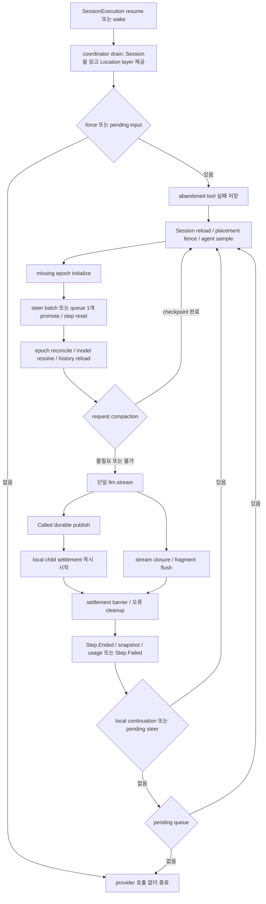

# V2 SessionRunner 조사 메모

기준: `anomalyco/opencode` dev 커밋 `907b3bc518fa48e90e8ec24dd327d13eee71c36c`, 조사일 2026-10-04 Asia/Seoul. 공용 checkout을 읽기 전용으로 사용했다. 아래 내용은 **정적 코드 확인 및 테스트 읽기** 결과이며 테스트 실행·실제 provider 호출 결과가 아니다. 루트 AGENTS.md와 경계 조사에 필요한 `packages/core/src/tool/AGENTS.md`를 확인했다.

## 본문 재사용용 핵심 분석

### 실행 진입점과 turn 준비

실제 runner 서비스에는 `resume` 메서드가 없고 `run({sessionID, force})`가 있다. `SessionV2.resume` → process-global `SessionExecution.resume` → coordinator.run → SessionStore에서 placement 조회 → LocationServiceMap의 Location layer 제공 → `SessionRunner.run` 순서다. runner/model/tool registry는 Location-scoped이고 동일 Session 직렬화는 runner 내부 mutex가 아닌 coordinator가 맡는다. runner는 pending steer를 우선 확인하며 steer가 없을 때 queue를 확인한다. advisory `force:false`에 eligible input이 없으면 stale tool 정리·epoch 초기화·provider dispatch를 모두 건너뛴다. explicit resume의 `force:true`는 준비를 시도하지만 context/model 오류 때문에 provider 호출 전에 실패할 수 있다. [runner 계약](https://github.com/anomalyco/opencode/blob/907b3bc518fa48e90e8ec24dd327d13eee71c36c/packages/core/src/session/runner/index.ts#L19-L28), [Location routing](https://github.com/anomalyco/opencode/blob/907b3bc518fa48e90e8ec24dd327d13eee71c36c/packages/core/src/session/execution/local.ts#L16-L35), [run guard와 loop](https://github.com/anomalyco/opencode/blob/907b3bc518fa48e90e8ec24dd327d13eee71c36c/packages/core/src/session/runner/llm.ts#L392-L415)

provider attempt 시작마다 최신 Session을 읽고 현재 Location의 directory/workspaceID와 비교한다. 다르면 interrupt한다. 이 Session snapshot에서 agent를 선택하고 model을 resolve하므로 준비 중 들어온 switch는 이미 준비 중인 요청을 재시작하지 않고 다음 turn reload에 반영된다. agent는 configured default → build → 첫 selectable → info 없는 fallback build ID 순서이며 hidden/subagent 전용 agent는 default 후보에서 제외된다. explicit ID는 info가 없어도 ID 자체를 보존한다. AgentV2 서비스는 빈 상태에서 시작하고 기본 agent 목록은 plugin contribution으로 채워진다. [turn sampling](https://github.com/anomalyco/opencode/blob/907b3bc518fa48e90e8ec24dd327d13eee71c36c/packages/core/src/session/runner/llm.ts#L173-L203), [Agent 선택](https://github.com/anomalyco/opencode/blob/907b3bc518fa48e90e8ec24dd327d13eee71c36c/packages/core/src/agent.ts#L48-L100)

SystemContextRegistry, selected-agent SkillGuidance, ReferenceGuidance를 병렬 관찰해 합친다. epoch가 없을 때는 **input promotion 전에** 완전한 baseline을 만든다. 초기 context unavailable이면 prompt는 pending 상태로 남는다. epoch가 있을 때는 eligible input을 승격한 **뒤** context를 reconcile한다. 기존 baseline은 바꾸지 않고 변경분을 chronological System message로 저장하며 ContextUpdated event의 commit hook으로 snapshot도 함께 전진한다. `baselineSeq`는 실행 ID·provider dispatch cursor가 아니라 baseline에 이미 접힌 System message의 cutoff다. history 선택은 최신 completed compaction 이후 대화를 가져오되 baseline 이후 아직 유효한 System updates를 유지한다. replacement가 blocked되면 이전 baseline과 유효한 System updates를 보존한다. [epoch 준비](https://github.com/anomalyco/opencode/blob/907b3bc518fa48e90e8ec24dd327d13eee71c36c/packages/core/src/session/context-epoch.ts#L40-L88), [history cutoff](https://github.com/anomalyco/opencode/blob/907b3bc518fa48e90e8ec24dd327d13eee71c36c/packages/core/src/session/history.ts#L24-L52)

request는 `agent.system`, epoch baseline, canonical chronological messages, materialized tool definitions로 구성한다. Session/parent Session correlation headers와 OpenAI promptCacheKey를 넣는다. 특정 `ses_`+64 hex ID는 접두사를 제거해 key 길이를 64로 맞춘다. model adapter 상세는 03 범위이며, 이 native runner resolver가 지원하는 Catalog API는 OpenAI Responses, Anthropic Messages, URL이 있는 OpenAI-compatible Chat이다. V1의 모든 provider 경로를 자동 대체하는 resolver가 아니다. [request assembly](https://github.com/anomalyco/opencode/blob/907b3bc518fa48e90e8ec24dd327d13eee71c36c/packages/core/src/session/runner/llm.ts#L202-L225), [native routes](https://github.com/anomalyco/opencode/blob/907b3bc518fa48e90e8ec24dd327d13eee71c36c/packages/core/src/session/runner/model.ts#L131-L179)

### steer, queue, provider-turn allowance

한 boundary에서 `EventV2.latestSequence`를 capture한 뒤 cutoff 이하의 steers를 admission sequence 순서로 모두 승격한다. 이 cutoff 이후 새 steers는 다음 boundary에 남는다. 현재 local tool continuation 또는 steering continuation을 마친 뒤 otherwise idle이면 queue를 FIFO로 **한 개만** 승격하고, 그 경계의 steers도 함께 승격한 다음 continuation 여부를 다시 평가한다. drain은 inner continuation loop와 outer queue loop로 구현된다. steer는 실행 중 provider stream에 직접 주입되거나 현재 stream을 끊지 않는다. [promotion](https://github.com/anomalyco/opencode/blob/907b3bc518fa48e90e8ec24dd327d13eee71c36c/packages/core/src/session/runner/llm.ts#L187-L200), [inbox 순서와 cutoff](https://github.com/anomalyco/opencode/blob/907b3bc518fa48e90e8ec24dd327d13eee71c36c/packages/core/src/session/input.ts#L245-L288), [loop](https://github.com/anomalyco/opencode/blob/907b3bc518fa48e90e8ec24dd327d13eee71c36c/packages/core/src/session/runner/llm.ts#L400-L414)

`steps`의 final step이면 tools를 materialize하지 않으며 빈 definitions, toolChoice none, MAX_STEPS_PROMPT를 보낸다. 그래도 provider가 local tool-call을 보내면 호출은 durable하게 기록한 뒤 실패시키고 실행하지 않는다. 승격된 user input이 하나라도 있으면 `currentStep=1`; 한 steer batch는 한 번만 reset한다. compaction 재조립은 같은 step을 보존한다. 이 allowance는 `run` 내부 메모리 값이므로 새 explicit resume이나 process restart에서 복구되는 durable counter가 아니다. [allowance와 final request](https://github.com/anomalyco/opencode/blob/907b3bc518fa48e90e8ec24dd327d13eee71c36c/packages/core/src/session/runner/llm.ts#L195-L223), [final step 위반 처리](https://github.com/anomalyco/opencode/blob/907b3bc518fa48e90e8ec24dd327d13eee71c36c/packages/core/src/session/runner/llm.ts#L251-L280)

### 한 provider turn과 도구 상태

일반 provider turn은 명시적인 `llm.stream(request)` 한 번이다. complete local tool-call을 받으면 먼저 event publisher를 await해 assistant ownership과 Tool.Called를 durable하게 저장하고, 즉시 turn-scoped FiberSet으로 `toolMaterialization.settle`을 시작한다. `providerExecuted:true`는 Core가 실행하지 않는다. local tools는 stream closure 전에도 여러 개가 동시에 실행되며 현재 구현은 별도 동시 실행 상한이 없다. 반면 provider stream event와 tool settlement event의 발행은 같은 Semaphore(1)로 직렬화한다. registry materialization은 광고했던 registration identity를 보존해 그 사이 교체·삭제된 tool을 stale call로 거부한다. authorization은 registry가 아니라 captured leaf executor가 맡는다. [stream과 eager child](https://github.com/anomalyco/opencode/blob/907b3bc518fa48e90e8ec24dd327d13eee71c36c/packages/core/src/session/runner/llm.ts#L237-L283), [registration identity와 settlement](https://github.com/anomalyco/opencode/blob/907b3bc518fa48e90e8ec24dd327d13eee71c36c/packages/core/src/tool/registry.ts#L50-L81)

publisher는 assistant를 첫 text/reasoning/tool activity 또는 실제 settlement 시 lazy 생성한다. provider의 step-start 이벤트 자체는 무시한다. text/reasoning/tool input은 ID별 fragment buffer를 가지며 duplicate start, delta-before-start, 이름 변경 등을 defect로 거부한다. live delta를 방송하고 끝났을 때 합친 전체 값을 durable Ended event로 저장한다. EOF·실패·interrupt에서는 `ensuring(flush)`가 partial fragment를 닫는다. tool은 pending raw input → Called/running parsed input → success/completed 또는 failed/error로 전이한다. tool settlement에는 owning assistantMessageID를 실어 다른 turn의 동일 provider-local call ID를 구분한다. [lazy assistant](https://github.com/anomalyco/opencode/blob/907b3bc518fa48e90e8ec24dd327d13eee71c36c/packages/core/src/session/runner/publish-llm-event.ts#L74-L89), [fragment 상태](https://github.com/anomalyco/opencode/blob/907b3bc518fa48e90e8ec24dd327d13eee71c36c/packages/core/src/session/runner/publish-llm-event.ts#L91-L193), [tool publish 상태](https://github.com/anomalyco/opencode/blob/907b3bc518fa48e90e8ec24dd327d13eee71c36c/packages/core/src/session/runner/publish-llm-event.ts#L313-L394)

normal path에서는 stream closure 뒤 모든 tool settlement를 기다리고 end snapshot/files를 계산해 Step.Ended를 발행한 후 다음 turn history를 다시 읽는다. publisher의 step-finish는 finish/usage를 기억만 하며 Step.Ended를 즉시 발행하지 않는다. local result를 in-memory history에 덧붙여 재사용하지 않는다. 다만 FiberSet join/awaitEmpty의 race는 child defect·typed retention failure가 발생하면 empty까지 기다리기 전에 failure로 반환할 수 있다. 이 경우 runner는 unsettled calls를 generic 실패로 닫고 turn scope finalizer가 나머지 children을 정리한다. “항상 모든 성공 결과를 기다린다”는 단정은 이 실패 경로를 포함하지 않는다. [barrier](https://github.com/anomalyco/opencode/blob/907b3bc518fa48e90e8ec24dd327d13eee71c36c/packages/core/src/session/runner/llm.ts#L141-L142), [finalization](https://github.com/anomalyco/opencode/blob/907b3bc518fa48e90e8ec24dd327d13eee71c36c/packages/core/src/session/runner/llm.ts#L304-L357), [step-finish 기록](https://github.com/anomalyco/opencode/blob/907b3bc518fa48e90e8ec24dd327d13eee71c36c/packages/core/src/session/runner/publish-llm-event.ts#L396-L407)

canonical lowering은 agent/model switch를 숨기고 user/synthetic/shell/system/assistant/compaction을 변환한다. local 결과는 별도 tool message, hosted call/result는 assistant content에 inline으로 들어간다. 같은 originating model이고 assistant.error가 없을 때만 opaque reasoning/tool metadata를 재사용한다. model이 바뀌면 visible reasoning을 ordinary text로 바꾸며 native metadata를 버린다. **hosted call/result 자체는 다른 model에서도 남는다**. unresolved remote/managed URI materialization은 TODO다. [lowering](https://github.com/anomalyco/opencode/blob/907b3bc518fa48e90e8ec24dd327d13eee71c36c/packages/core/src/session/runner/to-llm-message.ts#L39-L171)

### 오류, 취소, 종료와 복구 한계

tool의 예상 `ToolFailure`는 registry가 model-facing 결과로 변환한다. registry는 defect와 interrupt를 삼키지 않는다. runner는 non-interrupt child 실패를 squash해 unsettled calls에 Tool execution failed를 기록하고 다음 provider turn을 이어갈 수 있다. Permission.DeclinedError/Question.RejectedError defect는 별도로 분류해 미완료 tool을 실패시킨 뒤 drain을 interrupt한다. provider stream이나 settlement 대기의 interrupt에는 children clear, 미완료 tool failure, active assistant의 Provider turn interrupted를 보호된 cleanup 구간에서 기록한다. 실제 stream/tool 대기는 restore로 interruptible하다. [registry failure 변환](https://github.com/anomalyco/opencode/blob/907b3bc518fa48e90e8ec24dd327d13eee71c36c/packages/core/src/tool/registry.ts#L62-L72), [user decline 분류](https://github.com/anomalyco/opencode/blob/907b3bc518fa48e90e8ec24dd327d13eee71c36c/packages/core/src/session/runner/llm.ts#L144-L150), [cleanup](https://github.com/anomalyco/opencode/blob/907b3bc518fa48e90e8ec24dd327d13eee71c36c/packages/core/src/session/runner/llm.ts#L286-L324)

provider-error event는 Step.Failed를 저장하고 local continuation을 끄지만 stream Effect 자체는 성공일 수 있다. 이후 event는 무시하면서 stream closure를 기다린다. raw LLMError는 실패를 기록한 뒤 원래 failCause를 caller에 반환한다. raw failure여도 이미 시작된 local tool은 ordinary-result 경로에서 settlement를 기다린다. 정상 EOF의 미해결 hosted tools는 Provider did not return a tool result로 실패시킨다. provider finish 문자열만으로 종료를 결정하지 않으며 local call과 provider error 여부, pending steer, 그 이후 queue 여부를 순서대로 본다. 일반 retry/backoff/watchdog/inactivity timeout, durable busy/retry/idle status, 반복 tool-call 감지는 이 native loop에서 확인되지 않는다. [terminal 판단](https://github.com/anomalyco/opencode/blob/907b3bc518fa48e90e8ec24dd327d13eee71c36c/packages/core/src/session/runner/llm.ts#L325-L415)

run 시작 시 active projected history의 pending/running tool을 Tool execution interrupted로 실패시킨다. prior process의 side effects를 재실행하지 않는다. 이는 provider-dispatch ambiguity를 해결하는 durable recovery가 아니다. promoted input 이후 crash가 나고 새 pending input이 없으면 wake는 no-op이며 explicit resume만 durable history에서 새 시도를 시작한다. move fence는 다음 attempt 시작에 적용되므로 이미 실행 중인 stream/side effects를 이동 즉시 취소한다는 보장은 없다. subagent mode/parent headers는 존재하지만 native BuiltInTools에는 task가 없고 port TODO다. native V2의 V1 task child orchestration/background 실행 지원으로 해석해서는 안 된다. [abandoned tool cleanup](https://github.com/anomalyco/opencode/blob/907b3bc518fa48e90e8ec24dd327d13eee71c36c/packages/core/src/session/runner/llm.ts#L119-L139), [task gap](https://github.com/anomalyco/opencode/blob/907b3bc518fa48e90e8ec24dd327d13eee71c36c/packages/core/src/tool/builtins.ts#L18-L29), [recovery deferred 명세](https://github.com/anomalyco/opencode/blob/907b3bc518fa48e90e8ec24dd327d13eee71c36c/specs/v2/session.md#L160-L173)

### compaction 경계와 영속 usage

request 전체 budget을 검사한 automatic compaction은 snapshot/assistant 시작 전에 별도 summary stream을 수행한다. completed checkpoint가 생기면 같은 logical step으로 요청을 다시 조립하고 epoch baseline을 교체한다. overflow recovery는 publisher의 assistant가 아직 생성되지 않은 경우에 한 번 허용한다. provider step-start만 받은 상태는 아직 assistant가 시작되지 않은 상태다. text-start/reasoning-start/tool activity로 assistant가 이미 durable하게 시작됐으면 recovery하지 않는다. 둘째 overflow는 ordinary terminal failure다. summary 실패·interrupt는 Ended를 저장하지 않아 기존 history boundary를 유지한다. manual SessionV2.compact는 아직 OperationUnavailable이다. [automatic/overflow transitions](https://github.com/anomalyco/opencode/blob/907b3bc518fa48e90e8ec24dd327d13eee71c36c/packages/core/src/session/runner/llm.ts#L224-L225), [one recovery](https://github.com/anomalyco/opencode/blob/907b3bc518fa48e90e8ec24dd327d13eee71c36c/packages/core/src/session/runner/llm.ts#L286-L303), [rebuild 경로](https://github.com/anomalyco/opencode/blob/907b3bc518fa48e90e8ec24dd327d13eee71c36c/packages/core/src/session/runner/llm.ts#L364-L390), [manual compact unavailable](https://github.com/anomalyco/opencode/blob/907b3bc518fa48e90e8ec24dd327d13eee71c36c/packages/core/src/session.ts#L417-L419)

Step.Ended는 assistant에 tokens를 저장하지만 runner cost는 현재 0이다. Core 전체의 SessionTable tokens/cost 증분 검색에서 applyUsage는 V1 PartUpdated step-finish와 V1 삭제 rollback에만 연결되어 있었다. native Step.Ended projector는 message updater만 호출하며 assistant usage만 갱신한다. native V2 Session aggregate usage 누적은 이 경로에 없다. [native cost](https://github.com/anomalyco/opencode/blob/907b3bc518fa48e90e8ec24dd327d13eee71c36c/packages/core/src/session/runner/llm.ts#L334-L345), [V1 증분](https://github.com/anomalyco/opencode/blob/907b3bc518fa48e90e8ec24dd327d13eee71c36c/packages/core/src/session/projector.ts#L310-L327), [V2 projector](https://github.com/anomalyco/opencode/blob/907b3bc518fa48e90e8ec24dd327d13eee71c36c/packages/core/src/session/projector.ts#L375-L393), [assistant usage](https://github.com/anomalyco/opencode/blob/907b3bc518fa48e90e8ec24dd327d13eee71c36c/packages/core/src/session/message-updater.ts#L209-L228)

## 흐름 도식



## 코드·명세 차이와 추가 질문

- `llm.ts` 상단 체크리스트의 snapshots/cancellation/compaction 일부 `[ ]`는 실제 하단 구현보다 뒤처져 있다. 해당 코멘트를 완성도 근거로 단독 사용하지 않는다.
- session.md parity 표의 agent.system/final-step reminder 상태 및 L191의 omitted-agent build 단정은 현재 코드·테스트와 다르다.
- session.md L117의 compaction delta progress는 native make에서 확인되지 않는다. `compaction.ts` L201-219는 textDelta를 memory chunks에만 쌓고 Started/Ended만 발행한다. Core source의 Compaction.Delta 검색 결과는 updater no-op branch뿐이다.
- retention failure/child defect 때 나머지 children을 중단하고 generic failure로 닫는 경로가 모든 local outcome을 기록한다는 명세 문장과 어느 수준까지 일치하는지는 추가 의미론 검토 대상이다.
- SessionTable aggregate usage, cost 계산과 compaction summary의 usage accounting은 05/03 교차 질문이다.
- native built-in task·subagent 도입 시 parent ownership, interrupt 전파, background registry, child output 반환은 별도 설계가 필요하다.
- 실행 중 Location move가 already-dispatched provider/child side effects를 즉시 중지하는 E2E 보장은 확인하지 않았다. source runner 테스트는 이동 후 다음 resume의 placement mismatch만 검증한다.

## 테스트 읽기 결과

`session-runner.test.ts` 전체 3,475줄을 읽었다. 실서비스 runner/event projection/inbox를 사용하지만 LLMClient·model resolver·context/skill/reference·Snapshot 등은 test layers로 대체한다. `real runner`라는 테스트 이름은 실제 provider 호출 검증을 뜻하지 않는다. `session-runner-recorded.test.ts`는 실제 LLMClient/RequestExecutor와 recorded HTTP cassette를 쓰되 기본은 replay이며 RECORD=true일 때만 record다. 이번 조사에서 어느 테스트도 실행하지 않았다. shell PATH에서 Bun을 찾지 못했고 checkout에 node_modules가 없었다. 공용 checkout 변경 없이 정적 분석을 유지했다.

| 파일·대표 테스트 | 읽어 확인한 범위 |
| --- | --- |
| runner.test L658 `retries the first provider turn after system context becomes available` | epoch unavailable에서 inbox pending 유지, exact prompt retry 후 실행 |
| L690 `interrupts a source Location runner after a Session moves` | 이동 후 fixed source layer의 다음 resume fence. 실행 중 move E2E 아님 |
| L741/L852/L881/L913 | baseline immutability, selected-agent guidance update, agent/model sample 고정 |
| L1039/L1078/L1153/L1185 | completed checkpoint rebaseline, automatic compaction, complete serialized messages, oversized newest message 처리 |
| L1214/L1243/L1266/L1294/L1314/L3205 | event/raw overflow 1회 recovery, 두번째 실패, summary failure/interrupt, output 후 recovery 금지 |
| L1474/L1532/L1577/L1634 | tool 결과 durable reload, 다음 turn model switch, native reasoning/hosted metadata replay |
| L1689/L1750 | 5개 tools eager concurrent 실행, stream/settlement barrier, provider-local call ID 재사용 |
| L1838/L1877/L1920/L2053/L2130/L2195/L2491/L2597 | same-session joins, steer continuation/batching, queue deferred/FIFO, steer 우선, 다른 Session 동시 실행, failure fanout/retry |
| L1967/L2010/L2264/L2324/L2384 | interrupt 후 pending inbox 유지, prior-process local/hosted/pending-input tools durable failure |
| L2443/L2469 | promotion transaction rollback retry, post-commit listener defect 이후 committed prompt 실행 |
| L2628/L2674/L2722/L2771/L2815/L2864 | unknown/defect/policy error 모델 반영, permission decline interrupt, correction continuation, question dismissal interrupt |
| L2920/L2954/L3004/L3027 | raw provider failure settlement, stream/settlement interruption cleanup |
| L3064/L3112 | final-step tools none, violation 미실행, promoted steer allowance reset |
| L3164/L3186/L3234/L3251/L3276/L3307/L3332 | event/raw provider failure 차이, local continuation 차단, unresolved hosted result failure |
| L3405-L3475 | 3종 ephemeral deltas, failure/interrupt partial flush, ordering defect |
| session-runner-message.test 501줄 | 전체 variants lowering, empty assistant 제외, media single encoding, same/failed/switched model metadata 규칙 |
| session-runner-tool-events.test 136줄 | local result 중복 base64 방지, hosted compatibility result, binary failure, step-finish가 즉시 Ended 발행하지 않음 |
| session-runner-tool-registry.test 452줄 | materialization identity fencing, scoped registration lifetime, codec/output bounding, retention failure와 defect 전파 |
| session-runner-model.test 347줄 | native route 세 범위, variant merge, unsupported API, credential precedence |
| session-runner-recorded.test 193줄 | default replay cassette를 통해 prompt admission→Started→Text Ended→Step Ended durable sequence |
| agent.test 131줄 | empty service, scoped/replayable transforms, reload/remove, 기본 agent plugin 목록 및 permissions |

대표 테스트 링크: [eager tools](https://github.com/anomalyco/opencode/blob/907b3bc518fa48e90e8ec24dd327d13eee71c36c/packages/core/test/session-runner.test.ts#L1689-L1748), [steer/queue](https://github.com/anomalyco/opencode/blob/907b3bc518fa48e90e8ec24dd327d13eee71c36c/packages/core/test/session-runner.test.ts#L1877-L2193), [interrupt/allowance](https://github.com/anomalyco/opencode/blob/907b3bc518fa48e90e8ec24dd327d13eee71c36c/packages/core/test/session-runner.test.ts#L2954-L3162), [recorded path](https://github.com/anomalyco/opencode/blob/907b3bc518fa48e90e8ec24dd327d13eee71c36c/packages/core/test/session-runner-recorded.test.ts#L138-L193)

## Coverage 전달용

```json
{
  "source_commit": "907b3bc518fa48e90e8ec24dd327d13eee71c36c",
  "area": "01-engine/V2 runner",
  "reviewed_paths": [
    "AGENTS.md",
    "packages/core/src/tool/AGENTS.md",
    "packages/core/src/session/runner/index.ts",
    "packages/core/src/session/runner/llm.ts",
    "packages/core/src/session/runner/max-steps.ts",
    "packages/core/src/session/runner/model.ts",
    "packages/core/src/session/runner/publish-llm-event.ts",
    "packages/core/src/session/runner/to-llm-message.ts",
    "packages/core/src/agent.ts",
    "packages/core/src/session/context-epoch.ts",
    "packages/core/src/session/history.ts",
    "packages/core/src/session/execution/local.ts",
    "packages/core/src/session/run-coordinator.ts",
    "packages/core/src/tool/registry.ts",
    "packages/core/src/tool/builtins.ts",
    "packages/core/test/session-runner.test.ts",
    "packages/core/test/session-runner-message.test.ts",
    "packages/core/test/session-runner-model.test.ts",
    "packages/core/test/session-runner-recorded.test.ts",
    "packages/core/test/session-runner-tool-events.test.ts",
    "packages/core/test/session-runner-tool-registry.test.ts",
    "packages/core/test/agent.test.ts",
    "packages/core/package.json",
    "packages/core/bunfig.toml"
  ],
  "sampled_paths": [
    "CONTEXT.md",
    "specs/v2/session.md",
    "specs/v2/instructions.md",
    "packages/core/src/session.ts",
    "packages/core/src/session/input.ts",
    "packages/core/src/session/projector.ts",
    "packages/core/src/session/message-updater.ts",
    "packages/core/src/session/compaction.ts",
    "packages/core/src/plugin/agent.ts"
  ],
  "excluded_paths": [
    { "path": "packages/llm", "reason": "03가 provider protocol/transport 상세 담당; canonical client/request/event 경계만 추적" },
    { "path": "packages/core/src/tool", "reason": "registry/builtins 엔진 계약 외 leaf 도구 내부는 02 담당" },
    { "path": "packages/core/src/database", "reason": "05가 SQL·transaction·migration 상세 담당" },
    { "path": "packages/core/test/fixtures/recordings/session-runner/openai-chat-streams-text.json", "reason": "recorded test 사용 경로만 확인, cassette payload 전체는 미열람" },
    { "path": "packages/opencode", "reason": "01-engine 다른 하위 조사자가 V1 분석 담당" }
  ],
  "unverified_points": [
    "테스트 미실행: PATH에 Bun 없고 공용 checkout node_modules 없음",
    "실제 provider 호출 및 production LocationServiceMap 전체 구성 E2E 미검증",
    "여러 child 중 하나 defect 시 sibling settlement/finalizer ordering 실행 미검증",
    "실행 중 Session move의 immediate interruption/side-effect fencing 보장 없음",
    "post-crash provider dispatch ambiguity와 자동 continuation recovery deferred"
  ],
  "cross_area_questions": [
    "03: native runner의 제한된 Catalog API route 지원과 OAuth/provider-specific parity",
    "05: native Step.Ended usage의 SessionTable aggregate 누적 부재와 compaction summary accounting",
    "02: task/subagent port 및 leaf permission/context capture 계약",
    "06: V2 runtime context/plugin/generation transform parity, agent defaults contribution"
  ]
}
```
