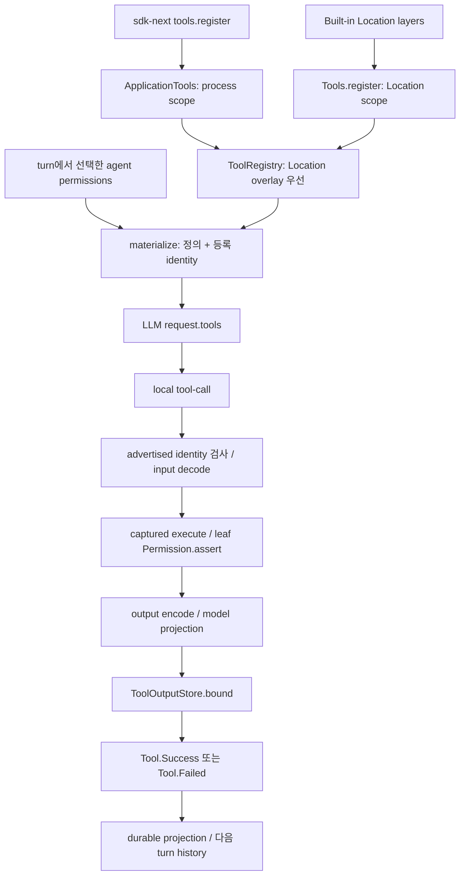
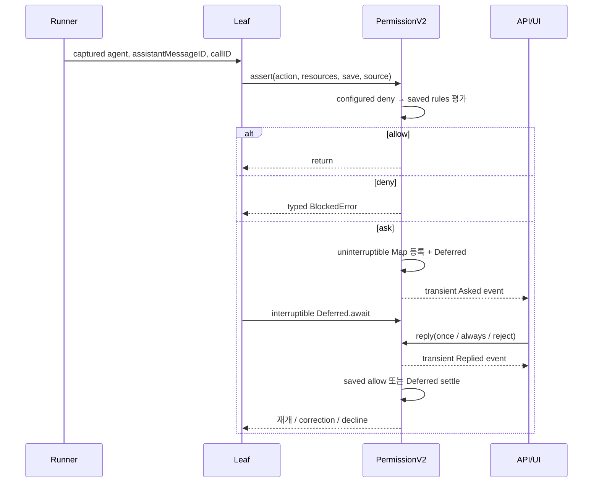
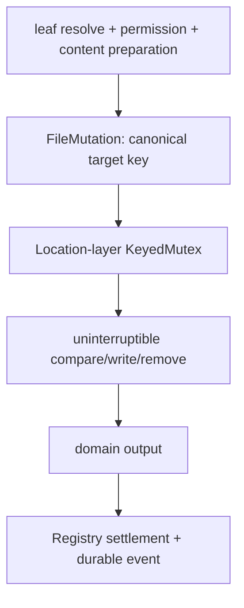
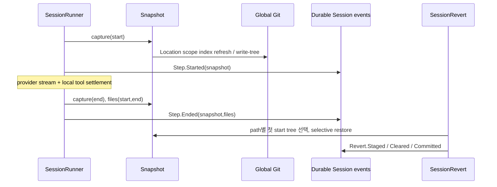
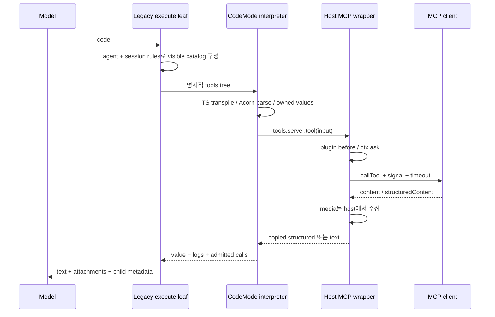

# OpenCode 도구 실행과 파일·프로세스 관리 분석

분석 기준은 `dev`의 **907b3bc518fa48e90e8ec24dd327d13eee71c36c**이며, 조사일은 2026-10-04(Asia/Seoul)이다. `/Users/yakisoba0728/Documents/GitHub/opencode`의 HEAD 일치와 clean 상태를 확인했다. 공용 checkout, 의존성, 설정은 변경하지 않았다. 아래의 구현·테스트 설명은 **소스와 assertion을 읽은 정적 확인**이다. Bun이 일반 PATH에 없고 checkout에 의존성이 설치되지 않아 프로젝트 테스트·typecheck는 실행하지 않았다. 실제 provider 호출, 취약점 재현도 수행하지 않았다.

이 보고서의 V1/기존 구현은 주로 `packages/opencode`의 SessionPrompt/SessionTools/ToolRegistry 경로, V2는 `packages/core`의 SessionRunner/ToolRegistry/Location 서비스 경로를 뜻한다. 기존 경로도 Core의 Git·Project·PTY·프로세스 서비스를 일부 공유하므로 패키지 이름만으로 완전히 독립된 두 제품이라고 해석하면 안 된다. 조사 경로와 제외 이유는 [02-tools.coverage.json](./02-tools.coverage.json)에 기록했다.

## 1. 핵심 구조와 실제 연결 상태

V2 도구 계층은 **도구 carrier → scoped 등록 → provider-turn materialization → leaf 실행 → 결과 검증·projection → 일반 출력 제한 → 세션 이벤트**로 나뉜다. 권한은 leaf가 행사하며 Registry는 모델 catalog 가시성과 settlement를 맡는다. 각 leaf는 생성 시 Location 서비스와 PermissionV2를 확보한다. ApplicationTools는 process-global, ToolRegistry와 filesystem·permissions·runner는 Location-scoped다. [Tool 구조](https://github.com/anomalyco/opencode/blob/907b3bc518fa48e90e8ec24dd327d13eee71c36c/packages/core/src/tool/tool.ts#L9-L67), [Registry 의존성](https://github.com/anomalyco/opencode/blob/907b3bc518fa48e90e8ec24dd327d13eee71c36c/packages/core/src/tool/registry.ts#L42-L48), [Location 서비스 조합](https://github.com/anomalyco/opencode/blob/907b3bc518fa48e90e8ec24dd327d13eee71c36c/packages/core/src/location-services.ts#L42-L79).

| 기능 | 이 커밋의 기존 경로 | 이 커밋의 V2 경로 |
|---|---|---|
| read/edit/write/apply_patch/grep/glob | Tool.define + SessionTools | canonical Tool.make + built-in Location 등록 |
| shell | tree-sitter 기반 ShellTool, 모델 도구 ID `bash` | 간소화된 BashTool |
| task/subagent | TaskTool + BackgroundJob + SessionPrompt | built-in task leaf 미이식 |
| skill/question/todowrite/webfetch/websearch | 기존 leaf와 plugin/MCP 연결 | 별도 V2 leaf 구현·등록 |
| MCP/custom plugin tool | 기존 registry/SessionTools에서 동적 등록 | canonical 등록 boot 설계 미완료 |
| codemode `execute` | experimental flag에서 MCP 도구 catalog를 감싸 제공 | Core built-in 미이식 |
| snapshot/revert | 기존 processor/revert | runner start/end capture와 SessionRevert에 연결됨 |
| PTY | compatibility HTTP surface | 같은 canonical Core Pty의 현재 API |

V2 shipped 목록은 12개 leaf이며 task·LSP·repo tools·plan_exit·Rune/code mode가 TODO로 남는다. 기존 registry는 환경 플래그로 question/LSP/plan/codemode를 포함하고, GPT 모델 이름에 따라 apply_patch와 edit/write를 교체한다. 이 모델별 선택은 V2 Registry에는 없다. V2 plugin/MCP 미완료 사항은 명세도 follow-up으로 구분한다. [V2 목록·TODO](https://github.com/anomalyco/opencode/blob/907b3bc518fa48e90e8ec24dd327d13eee71c36c/packages/core/src/tool/builtins.ts#L18-L47), [기존 목록](https://github.com/anomalyco/opencode/blob/907b3bc518fa48e90e8ec24dd327d13eee71c36c/packages/opencode/src/tool/registry.ts#L206-L249), [기존 모델 필터](https://github.com/anomalyco/opencode/blob/907b3bc518fa48e90e8ec24dd327d13eee71c36c/packages/opencode/src/tool/registry.ts#L291-L330), [명세의 follow-up](https://github.com/anomalyco/opencode/blob/907b3bc518fa48e90e8ec24dd327d13eee71c36c/specs/v2/tools.md#L182-L186).

## 2. 정의·등록·모델 노출·실행 계약

### 2.1 Canonical carrier와 codec 경계

`Tool.make`의 반환값은 frozen empty object이며 private WeakMap에 executor/codecs/definition 함수를 둔다. tool 자체에 이름은 없고 register record의 key가 모델 이름이다. 이름은 `[A-Za-z][A-Za-z0-9_-]{0,63}`로 제한한다. definition은 tool/name별로 cache하며 input과 output schema를 서비스 없이 JSON Schema로 변환한다. [carrier와 정의](https://github.com/anomalyco/opencode/blob/907b3bc518fa48e90e8ec24dd327d13eee71c36c/packages/core/src/tool/tool.ts#L69-L90), [이름·schema](https://github.com/anomalyco/opencode/blob/907b3bc518fa48e90e8ec24dd327d13eee71c36c/packages/core/src/tool/tool.ts#L134-L162).

실행은 provider의 raw input을 decode한 뒤 단 하나의 `config.execute(decoded, context)`를 호출한다. output codec으로 encode한 뒤 projection에는 **encoded output**을 전달한다. 입력 실패는 executor를 호출하지 않고, 출력 실패는 성공 settlement를 만들지 않는다. 실제 구현에는 명세의 기본 API 외에도 `structured`/`toStructuredOutput`이라는 별도 구조화 출력 투영이 있다. media projection은 `{data,mime}`를 data URI로 바꾼다. projection이 없으면 encoded string은 text, 다른 값은 content 없는 structured로 남는다. [실행·투영](https://github.com/anomalyco/opencode/blob/907b3bc518fa48e90e8ec24dd327d13eee71c36c/packages/core/src/tool/tool.ts#L91-L129).

`toModelOutput`이 pure/total이어야 한다는 것은 명세의 계약이다. runtime이 purity를 검증하거나 callback exception을 ToolFailure로 자동 분류하지 않는다. executor dependencies도 invocation context에 주입하지 않고 생성 시 closure로 잡는다. context에는 Session ID, agent ID, durable assistant message ID, tool-call ID만 있다. [명세](https://github.com/anomalyco/opencode/blob/907b3bc518fa48e90e8ec24dd327d13eee71c36c/specs/v2/tools.md#L29-L63).

### 2.2 Scope overlay와 stale-call 거절

동일 placement에서 최근 active 등록이 이기며, 해당 Scope가 닫히면 그 등록만 사라져 이전 등록이 드러난다. Location 등록이 application 등록보다 우선한다. ApplicationTools는 record entries를 미리 복사하고 State의 scoped transform으로 재구성한다. Location Registry는 token별 등록 stack과 finalizer를 사용한다. [application 등록](https://github.com/anomalyco/opencode/blob/907b3bc518fa48e90e8ec24dd327d13eee71c36c/packages/core/src/tool/application-tools.ts#L30-L57), [State scope·직렬화](https://github.com/anomalyco/opencode/blob/907b3bc518fa48e90e8ec24dd327d13eee71c36c/packages/core/src/state.ts#L61-L124), [Location 등록](https://github.com/anomalyco/opencode/blob/907b3bc518fa48e90e8ec24dd327d13eee71c36c/packages/core/src/tool/registry.ts#L84-L105).

provider turn의 materialization은 정의와 **등록 identity**를 묶는다. settlement 때 현재 effective identity와 달라졌으면 `Stale tool call`이며 handler를 실행하지 않는다. overlay를 닫아 이전 tool이 다시 드러나도 identity가 달라 stale다. 검사 후 handler를 잡고 실행하기 시작한 invocation은 이후 등록 제거·교체로 executor가 바뀌지 않는다. 등록 Scope의 종료와 실행 fiber의 취소는 같은 작업이 아니다. [lookup·settlement](https://github.com/anomalyco/opencode/blob/907b3bc518fa48e90e8ec24dd327d13eee71c36c/packages/core/src/tool/registry.ts#L50-L82), [materialize](https://github.com/anomalyco/opencode/blob/907b3bc518fa48e90e8ec24dd327d13eee71c36c/packages/core/src/tool/registry.ts#L106-L122), [stale·captured execution 테스트](https://github.com/anomalyco/opencode/blob/907b3bc518fa48e90e8ec24dd327d13eee71c36c/packages/core/test/session-runner-tool-registry.test.ts#L336-L450).

`sdk-next.create()`가 global ApplicationTools를 build한 뒤 `tools.register`를 공개하고 같은 memoMap의 embedded routes를 구성한다. registration은 local Effect Scope capability이며 원격 HTTP 도구 설치 API가 아니다. [SDK의 실제 제공 지점](https://github.com/anomalyco/opencode/blob/907b3bc518fa48e90e8ec24dd327d13eee71c36c/packages/sdk-next/src/opencode.ts#L10-L42).

### 2.3 Catalog filtering과 authorization은 별개

Registry의 permission import는 타입·순서 평가 용도이고 Permission 서비스 dependency는 없다. materialize는 action에 일치하는 마지막 rule이 `resource:"*", effect:"deny"`일 때 전체 도구를 숨긴다. 부분 resource deny는 tool을 숨기지 않는다. edit/write/apply_patch는 공통 `edit` action을 선언한다. model visibility를 통과한 invocation의 권한은 leaf가 다시 assert해야 한다. Application Tool.make도 자동 권한 wrapper를 받지 않는다. [전체 도구 필터](https://github.com/anomalyco/opencode/blob/907b3bc518fa48e90e8ec24dd327d13eee71c36c/packages/core/src/tool/registry.ts#L106-L140), [application authorization 분리 테스트](https://github.com/anomalyco/opencode/blob/907b3bc518fa48e90e8ec24dd327d13eee71c36c/packages/core/test/application-tools.test.ts#L86-L105).

V2 runner는 turn마다 agent를 선택하고 그 permissions로 materialize한다. local call이 들어오면 먼저 Called 이벤트를 발행하고, assistantMessageID를 얻어 FiberSet에서 settlement를 시작한다. provider stream을 계속 소비하면서 여러 도구를 병행 실행하고 다음 turn 전 결과를 기다린다. publication semaphore는 이벤트 순서를 직렬화하며 도구 실행 전체를 직렬화하지 않는다. five-call 테스트는 최대 동시 실행 5와 두 번째 request가 모든 도구 완료 뒤에 생김을 확인한다. [runner](https://github.com/anomalyco/opencode/blob/907b3bc518fa48e90e8ec24dd327d13eee71c36c/packages/core/src/session/runner/llm.ts#L179-L280), [동시 도구 테스트](https://github.com/anomalyco/opencode/blob/907b3bc518fa48e90e8ec24dd327d13eee71c36c/packages/core/test/session-runner.test.ts#L1689-L1747).

### 2.4 기존 실행 경로와 native LLM adapter

기존 `SessionPrompt → SessionTools.resolve → ToolRegistry.tools → AI SDK Tool.execute → leaf` 경로는 Tool.Context에 AbortSignal·messages·metadata callback·ask callback을 준다. ask는 `agent.permission + session.permission`을 캡처하고 tool.execute.before/after plugin hooks가 실행을 감싼다. 모델 요청 직전에는 전체 deny와 `user.tools[name] === false`를 추가 적용한다. [기존 context·실행](https://github.com/anomalyco/opencode/blob/907b3bc518fa48e90e8ec24dd327d13eee71c36c/packages/opencode/src/session/tools.ts#L41-L133), [최종 catalog filtering](https://github.com/anomalyco/opencode/blob/907b3bc518fa48e90e8ec24dd327d13eee71c36c/packages/opencode/src/session/llm/request.ts#L210-L215).

기존 `Tool.define`는 input decode를 wrapper에 두고 결과에 `metadata.truncated`가 없을 때 Truncate를 적용한다. 여러 leaf는 이미 `truncated`를 설정하여 이 일반 wrapper를 건너뛴다. plugin 도구는 Zod/legacy JSON Schema를 registry 경계에서 변환하고 별도로 truncate한다. V2의 단일 settlement boundary와 구조가 다르다. [기존 wrapper](https://github.com/anomalyco/opencode/blob/907b3bc518fa48e90e8ec24dd327d13eee71c36c/packages/opencode/src/tool/tool.ts#L99-L145), [plugin normalization](https://github.com/anomalyco/opencode/blob/907b3bc518fa48e90e8ec24dd327d13eee71c36c/packages/opencode/src/tool/registry.ts#L125-L169).

기존 Session의 experimental native LLM 경로도 canonical V2 Registry로 바뀌는 것이 아니다. AI SDK 형태의 tool을 `@opencode-ai/llm.Tool`로 감싸 기존 execute를 호출하고 ToolRuntime으로 dispatch한다. 이 LLM 패키지 carrier는 Core의 opaque Tool과 다른 층이다. 기본 AI SDK 실행도 계속 존재한다. [native bridge](https://github.com/anomalyco/opencode/blob/907b3bc518fa48e90e8ec24dd327d13eee71c36c/packages/opencode/src/session/llm/native-runtime.ts#L105-L140), [기존 handler adapter](https://github.com/anomalyco/opencode/blob/907b3bc518fa48e90e8ec24dd327d13eee71c36c/packages/opencode/src/session/llm/native-runtime.ts#L169-L190), [AI SDK dispatch](https://github.com/anomalyco/opencode/blob/907b3bc518fa48e90e8ec24dd327d13eee71c36c/packages/opencode/src/session/llm.ts#L276-L319). provider transport의 세부 계약은 03-models 범위다.

## 3. 결과 저장, 출력 제한, 오류와 취소

### 3.1 모델 출력과 구조화 데이터의 두 채널

V2 ToolOutput는 `{structured, content}`다. 모델 result는 content가 비면 JSON structured, text 하나면 text, 그 외는 content를 사용한다. 따라서 projected text를 보낼 때 structured를 다시 모델 문자열로 세지 않는다. [ToolOutput.toResultValue](https://github.com/anomalyco/opencode/blob/907b3bc518fa48e90e8ec24dd327d13eee71c36c/packages/llm/src/schema/messages.ts#L80-L109).

ToolOutputStore 기본 한도는 **2,000줄·50 KiB**, retention은 7일이다. 설정 document들의 tool_output을 순서대로 합쳐 override한다. content가 있으면 text parts를 합쳐 측정하고 file/media와 structured metadata는 그대로 둔다. content가 없으면 structured JSON을 측정한다. 초과하면 `global.data/tool-output/tool_<id>`에 complete contextual text를 `wx`로 저장한 뒤 marker를 포함해 한도 안의 head/tail preview를 만든다. 보존 write/encode가 실패하면 StorageError이며 lossy success를 만들지 않는다. 한도는 도구 domain output 전체의 메모리 상한이 아니다. [한도·preview](https://github.com/anomalyco/opencode/blob/907b3bc518fa48e90e8ec24dd327d13eee71c36c/packages/core/src/tool-output-store.ts#L13-L103), [bound·storage](https://github.com/anomalyco/opencode/blob/907b3bc518fa48e90e8ec24dd327d13eee71c36c/packages/core/src/tool-output-store.ts#L119-L174).

managed path는 tool schema/projection에는 주입하지 않고 settlement의 outputPaths로 runner에 전달한다. 다만 preview marker 및 공개 Session result의 outputPaths에는 경로가 드러난다. 완전히 opaque storage reference인 상태는 아니다. cleanup은 global server node에서 한 시간 간격으로 `tool_` prefix·mtime 기준 오래된 파일을 지운다. 세션 history가 오래 유지되어도 해당 출력 파일이 영구 보존된다는 계약은 없다. [정리](https://github.com/anomalyco/opencode/blob/907b3bc518fa48e90e8ec24dd327d13eee71c36c/packages/core/src/tool-output-store.ts#L176-L211), [server 연결](https://github.com/anomalyco/opencode/blob/907b3bc518fa48e90e8ec24dd327d13eee71c36c/packages/server/src/routes.ts#L26-L37), [공개 경로 계약](https://github.com/anomalyco/opencode/blob/907b3bc518fa48e90e8ec24dd327d13eee71c36c/specs/v2/tools.md#L186).

기존 Truncate도 2,000줄·50 KiB·7일 보존이지만 기본 head 또는 tail 전체 줄을 잘라 **그 뒤** hint를 붙인다. 최종 hint까지 한도에 포함하는 V2 boundedPreview와 다르다. task 사용 권한에 따라 saved output을 explore agent에 맡기라는 모델 안내도 달라진다. [기존 truncate](https://github.com/anomalyco/opencode/blob/907b3bc518fa48e90e8ec24dd327d13eee71c36c/packages/opencode/src/tool/truncate.ts#L85-L147).

### 3.2 Producer 제한과 일반 bound를 혼동하면 안 되는 이유

| 경계 | 실제 제한 | 초과 시 의미 |
|---|---|---|
| V2 Bash/AppProcess | merged capture 1 MiB | prefix 이후 bytes 폐기, 손실 flag |
| ReadToolFileSystem text page | 2,000줄·50 KiB, 긴 줄 2,000자 | 다음 page/줄 preview, 전체 원문 retention 아님 |
| read media ingestion | 20 MiB | typed 오류 |
| Image normalization 기본 | 2,000×2,000, base64 5 MiB | resize 또는 decode/size 실패, unavailable만 fallback |
| ripgrep JSON record | 64 KiB, submatches 100, line text 2,000자 | record 오류/row preview |
| webfetch body | 5 MiB | Content-Length 또는 streaming limit 실패 |
| websearch body | 256 KiB | 수신 중 중단·실패 |
| ToolOutputStore | 모델 channel 2,000줄·50 KiB | complete **생성된 결과**를 파일에 저장·preview |
| PTY | string length 2 Mi, exited 25개 | retained tail/종료 세션 eviction |

따라서 Bash의 “full content saved”는 producer가 이미 버린 원래 shell bytes까지 보존했다는 뜻이 아니다. producer가 반환한 capture-loss 설명을 포함한 결과를 보존한다는 뜻이다. V2 bound는 native media도 일반 제한으로 자르지 않는다. [명세의 producer 경계](https://github.com/anomalyco/opencode/blob/907b3bc518fa48e90e8ec24dd327d13eee71c36c/specs/v2/tools.md#L149-L159), [media·중복 측정 테스트](https://github.com/anomalyco/opencode/blob/907b3bc518fa48e90e8ec24dd327d13eee71c36c/packages/core/test/tool-output-store.test.ts#L86-L175).

### 3.3 Durable 도구 결과와 failure policy

publisher는 call-before-result, 같은 call의 name 불변, duplicate settlement 등을 검사한다. local success는 structured/content/outputPaths를 저장하고 compatibility result는 provider-executed 경우만 추가한다. media base64 중복 저장을 피하는 테스트가 있다. projector는 Called/Progress/Success/Failed를 durable assistant projection으로 반영한다. **Progress 이벤트가 존재하는 것**과 canonical Tool.Context가 일반 progress callback을 제공한다는 것은 다르다. [publisher 결과](https://github.com/anomalyco/opencode/blob/907b3bc518fa48e90e8ec24dd327d13eee71c36c/packages/core/src/session/runner/publish-llm-event.ts#L315-L393), [projector 등록](https://github.com/anomalyco/opencode/blob/907b3bc518fa48e90e8ec24dd327d13eee71c36c/packages/core/src/session/projector.ts#L380-L389), [media 저장 테스트](https://github.com/anomalyco/opencode/blob/907b3bc518fa48e90e8ec24dd327d13eee71c36c/packages/core/test/session-runner-tool-events.test.ts#L72-L113).

| 발생 지점/오류 | 이 커밋의 처리 |
|---|---|
| unknown/stale/invalid input/output | Registry/codec에서 explicit model error, handler 미실행 또는 성공 거절 |
| expected ToolFailure | Registry가 error result로 settlement |
| retention StorageError / executor defect | Registry 밖으로 전파; runner가 미결 도구를 `Tool execution failed: …`로 마감하고 정상 provider turn이면 continuation 가능 |
| 사용자 기본 approval decline/question dismiss | defect의 특정 타입을 runner가 알아보고 다른 tool fibers 정리·turn interruption |
| Effect interruption | leaf/Registry는 model result로 삼키지 않음; runner가 transcript의 미결 calls를 interrupted failure로 마감 |
| provider stream 오류 | 이미 시작한 local tool settlement를 기다리는 경로와 interruption 정리를 구분; provider error 뒤 자동 continuation 없음 |
| 이전 프로세스의 pending/running transcript | 다음 explicit drain 시작 시 interrupted failure로 마감; 기존 외부 부작용을 재실행하지 않음 |

“defect를 삼키지 않는다”는 Registry 경계의 계약이지 모든 defect가 세션을 영구 실패시킨다는 뜻이 아니다. 실제 runner test는 unexpected tool defect를 모델에 반환하고 다음 turn을 진행한다. [runner 오류 policy](https://github.com/anomalyco/opencode/blob/907b3bc518fa48e90e8ec24dd327d13eee71c36c/packages/core/src/session/runner/llm.ts#L286-L354), [defect continuation 테스트](https://github.com/anomalyco/opencode/blob/907b3bc518fa48e90e8ec24dd327d13eee71c36c/packages/core/test/session-runner.test.ts#L2674-L2719), [이전 미결 도구 마감](https://github.com/anomalyco/opencode/blob/907b3bc518fa48e90e8ec24dd327d13eee71c36c/packages/core/src/session/runner/llm.ts#L119-L150).

파일/프로세스 부작용과 Tool.Success durable commit 사이에 filesystem+DB 공통 transaction은 없다. 중단 후 결과가 error여도 이미 일어난 변경은 남을 수 있다. crash recovery/idempotency는 FileMutation TODO로 명시되어 있다. [미완료 부작용 계약](https://github.com/anomalyco/opencode/blob/907b3bc518fa48e90e8ec24dd327d13eee71c36c/packages/core/src/file-mutation.ts#L198-L207).

## 4. 권한 우선순위, 승인 대기·재개, agent 적용

### 4.1 순서가 우선이며 specificity 정렬은 없다

두 권한 시스템 모두 wildcard action/resource에 **마지막으로 일치한 rule**을 택하고, 없으면 ask다. 뒤의 `*`도 앞의 exact rule을 덮을 수 있다. merge는 배열 이어붙이기다. V2는 explicit agent ID가 생략되면 Session agent를 사용하고, 그것도 생략되면 configured default → build → 첫 eligible agent 순으로 선택한다. 최종적으로 agent를 resolve하지 못했을 때 전체 deny ruleset을 쓴다. explicit ID가 있으면 Session의 현재 agent 대신 그 ID를 resolve한다. [V2 evaluate](https://github.com/anomalyco/opencode/blob/907b3bc518fa48e90e8ec24dd327d13eee71c36c/packages/core/src/permission.ts#L15-L89), [agent resolution](https://github.com/anomalyco/opencode/blob/907b3bc518fa48e90e8ec24dd327d13eee71c36c/packages/core/src/permission.ts#L137-L161), [기본 agent 선택](https://github.com/anomalyco/opencode/blob/907b3bc518fa48e90e8ec24dd327d13eee71c36c/packages/core/src/agent.ts#L67-L92).

| 항목 | 기존 Permission | PermissionV2 |
|---|---|---|
| 규칙 | permission/pattern/action | action/resource/effect |
| 실행 정책 제공 | caller가 agent + Session rules 전달 | 서비스가 Session과 invocation agent 조회 |
| remembered allow | InstanceState 메모리 approved[] | Project별 permission DB 행 |
| remembered 우선순위 | ruleset 뒤에 approved를 합침 | configured resource 평가가 deny면 먼저 거절, 나머지만 saved allow와 합침 |
| pending owner | instance/directory | Location |
| always가 기존 pending을 즉시 푸는 범위 | 같은 Session | 같은 Location의 모든 Session 후보, 각 원래 agent deny 재평가 |
| 재시작 보존 | approved/pending 없음 | saved rows만 보존, pending 없음 |

configured deny 보호는 “ruleset 안에 deny가 한 번이라도 있으면 영원히 deny”가 아니다. resource의 **최종 configured 평가**가 deny일 때 saved allow가 이를 뒤집지 못한다. 여러 resources는 deny 하나가 있으면 deny, 그 다음 ask, 모두 allow면 allow다. legacy의 approved 후순위 동작을 V2와 동일한 hard ceiling으로 설명하면 틀린다. [V2 우선순위](https://github.com/anomalyco/opencode/blob/907b3bc518fa48e90e8ec24dd327d13eee71c36c/packages/core/src/permission.ts#L147-L162), [기존 합침·평가](https://github.com/anomalyco/opencode/blob/907b3bc518fa48e90e8ec24dd327d13eee71c36c/packages/opencode/src/permission/index.ts#L67-L107).

V2 saved table은 project/action/resource unique이며 Project 삭제에 cascade한다. `save`가 비어 있는 always는 once와 같은 재개이고, save가 있으면 DB에 allow를 기록한다. 같은 프로젝트의 다른 Location도 **새 assert**에서 이 saved rule을 읽지만, 현재 pending을 즉시 푸는 loop는 replying Location의 Map만 훑는다. [saved 저장](https://github.com/anomalyco/opencode/blob/907b3bc518fa48e90e8ec24dd327d13eee71c36c/packages/core/src/permission/saved.ts#L42-L72), [unique 계약](https://github.com/anomalyco/opencode/blob/907b3bc518fa48e90e8ec24dd327d13eee71c36c/packages/core/src/permission/sql.ts#L7-L19), [always fanout](https://github.com/anomalyco/opencode/blob/907b3bc518fa48e90e8ec24dd327d13eee71c36c/packages/core/src/permission.ts#L250-L283).

### 4.2 승인 대기는 메모리 Deferred다

공개 `ask()`는 effect/id를 반환하고 기다리지 않는다. built-in은 `assert()`를 사용한다. pending 등록·Asked 발행은 uninterruptible이며 duplicate ID는 defect, 기다림은 restore로 interruptible하고 ensuring으로 Map을 지운다. Location finalizer는 모든 Deferred를 decline하고 Map을 비운다. 일반 reject는 같은 Session의 다른 pending도 거절한다. 최초 요청의 feedback이 있어도 나머지는 기본 decline다. [등록·대기](https://github.com/anomalyco/opencode/blob/907b3bc518fa48e90e8ec24dd327d13eee71c36c/packages/core/src/permission.ts#L176-L218), [finalizer](https://github.com/anomalyco/opencode/blob/907b3bc518fa48e90e8ec24dd327d13eee71c36c/packages/core/src/permission.ts#L119-L129), [reject fanout](https://github.com/anomalyco/opencode/blob/907b3bc518fa48e90e8ec24dd327d13eee71c36c/packages/core/src/permission.ts#L220-L246).

Permission/Question 이벤트에는 durable 선언이 없다. EventV2를 쓴다는 이유로 DB에 replay 가능한 approval inbox가 있는 것은 아니다. 프로세스 재시작 후 pending Deferred 복구는 없다. 또한 V2 reply는 Replied 발행 **뒤** Deferred를 완료하므로 transient listener 실패 시 pending이 남는 순서다. create는 발행 실패 시 onError로 정리한다. 이는 정적 failure-order 확인이며 실패 주입은 실행하지 않았다. API는 요청 ID 외에 경로 Session의 소유 일치도 검사한다. [Permission 이벤트](https://github.com/anomalyco/opencode/blob/907b3bc518fa48e90e8ec24dd327d13eee71c36c/packages/schema/src/permission.ts#L43-L52), [Question 이벤트](https://github.com/anomalyco/opencode/blob/907b3bc518fa48e90e8ec24dd327d13eee71c36c/packages/schema/src/question.ts#L70-L86), [EventV2 ephemeral 분기](https://github.com/anomalyco/opencode/blob/907b3bc518fa48e90e8ec24dd327d13eee71c36c/packages/core/src/event.ts#L369-L415), [API ownership 검사](https://github.com/anomalyco/opencode/blob/907b3bc518fa48e90e8ec24dd327d13eee71c36c/packages/server/src/handlers/permission.ts#L60-L76).

### 4.3 Agent ID 고정과 정책 snapshot은 다르다

turn에서 선택된 agent ID는 도구 context와 pending에 남는다. Session agent를 바꿔도 발행된 invocation의 identity가 새 agent로 바뀌지 않는다. 하지만 PermissionV2는 assert 및 always 재평가 때 해당 ID를 다시 resolve한다. 따라서 permissions 전체가 immutable turn snapshot으로 고정되는 계약은 아니다. 같은 ID의 config/plugin reload가 진행 중 도구에 적용되는 시점은 남은 질문이다. [turn 선택](https://github.com/anomalyco/opencode/blob/907b3bc518fa48e90e8ec24dd327d13eee71c36c/packages/core/src/session/runner/llm.ts#L179-L203), [권한 재조회](https://github.com/anomalyco/opencode/blob/907b3bc518fa48e90e8ec24dd327d13eee71c36c/packages/core/src/permission.ts#L137-L145), [pending agent 재평가](https://github.com/anomalyco/opencode/blob/907b3bc518fa48e90e8ec24dd327d13eee71c36c/packages/core/src/permission.ts#L264-L273).

기본 decline는 assert에서 defect로 바뀌어 leaf의 typed mapError와 Registry의 ToolFailure catch를 통과하고 runner를 중단한다. 반면 feedback reject는 CorrectedError typed failure이며 대부분 built-in이 일반 `Unable to …`/`Permission denied` 문장으로 바꾸므로 feedback 내용이 모델에 보존되지 않는다. correction continuation 테스트는 **custom tool이 feedback을 직접 ToolFailure.message로 보존한 경우**다. [decline/correction 차이](https://github.com/anomalyco/opencode/blob/907b3bc518fa48e90e8ec24dd327d13eee71c36c/packages/core/src/permission.ts#L208-L235), [read leaf 오류 투영](https://github.com/anomalyco/opencode/blob/907b3bc518fa48e90e8ec24dd327d13eee71c36c/packages/core/src/tool/read.ts#L95-L104), [custom correction 테스트](https://github.com/anomalyco/opencode/blob/907b3bc518fa48e90e8ec24dd327d13eee71c36c/packages/core/test/session-runner.test.ts#L2815-L2861).

### 4.4 Policy와 Permission은 별도

Policy는 allow/deny만 가진 Location 서비스이고 caller fallback을 받는다. 현재 주요 사용처는 Catalog의 provider.use 필터이며 tool approval의 PermissionV2.assert와 다르다. 일반 config document 순서와 달리 experimental.policies는 documents를 뒤집어 global authored rule이 repository rule보다 후순위에 놓인다. agent permissions는 공통 config rules 뒤에 agent-local rules를 붙인다. [Policy](https://github.com/anomalyco/opencode/blob/907b3bc518fa48e90e8ec24dd327d13eee71c36c/packages/core/src/policy.ts#L8-L42), [config policy 순서](https://github.com/anomalyco/opencode/blob/907b3bc518fa48e90e8ec24dd327d13eee71c36c/packages/core/src/config.ts#L193-L210), [agent rules 조합](https://github.com/anomalyco/opencode/blob/907b3bc518fa48e90e8ec24dd327d13eee71c36c/packages/core/src/config/plugin/agent.ts#L70-L110). 설정·plugin 생명주기의 상세는 06-extensions 범위다.

## 5. Location·Workspace·Project와 파일 authority

Location.Ref는 `{directory, workspaceID?}`이며 Location.directory는 작업 디렉터리다. Project.resolve가 project ID/root/VCS를 붙여도 이 directory를 Git root로 바꾸지 않는다. Project ID는 normalized origin → 공통 Git directory의 opencode ID → 첫 root commit → global 순으로 선택한다. Git이 없으면 project.directory는 filesystem root다. legacy Project도 이 Core resolver를 이용한 뒤 persistence migration과 ID commit bridge를 호출한다. [Location binding](https://github.com/anomalyco/opencode/blob/907b3bc518fa48e90e8ec24dd327d13eee71c36c/packages/core/src/location.ts#L19-L39), [Project.resolve](https://github.com/anomalyco/opencode/blob/907b3bc518fa48e90e8ec24dd327d13eee71c36c/packages/core/src/project.ts#L65-L125), [기존 migration](https://github.com/anomalyco/opencode/blob/907b3bc518fa48e90e8ec24dd327d13eee71c36c/packages/opencode/src/project/project.ts#L146-L193), [resolver 호출](https://github.com/anomalyco/opencode/blob/907b3bc518fa48e90e8ec24dd327d13eee71c36c/packages/opencode/src/project/project.ts#L213-L221), [ID commit](https://github.com/anomalyco/opencode/blob/907b3bc518fa48e90e8ec24dd327d13eee71c36c/packages/opencode/src/project/project.ts#L300-L309).

WorkspaceV2 모듈 자체는 ID 재수출뿐이다. 명시 workspaceID를 별도 remote/isolated execution으로 구현했다는 근거가 아니다. LocationServiceMap은 Ref별 fresh layer를 만들고 idle TTL 60분으로 관리한다. actual workspace adapter/control-plane placement는 06·05와 교차 확인해야 한다. [Workspace](https://github.com/anomalyco/opencode/blob/907b3bc518fa48e90e8ec24dd327d13eee71c36c/packages/core/src/workspace.ts#L1-L6), [Location lifetime](https://github.com/anomalyco/opencode/blob/907b3bc518fa48e90e8ec24dd327d13eee71c36c/packages/core/src/location-services.ts#L84-L110).

LocationMutation은 **authority 해석**을 맡고 승인하거나 파일을 쓰지는 않는다. 상대 lexical 탈출은 relative_escape, 내부 lexical 경로의 realpath가 외부이면 location_escape다. 기존 파일은 realpath를 잡고 없는 파일은 가까운 기존 canonical directory 아래 prospective target으로 만든다. 내부 resource는 Location-relative, 명시 외부 절대경로는 canonical target과 canonical directory `*` 권한을 만든다. kind는 승인 경계 선택이며 파일 종류 검증은 아니다. [resolver](https://github.com/anomalyco/opencode/blob/907b3bc518fa48e90e8ec24dd327d13eee71c36c/packages/core/src/location-mutation.ts#L90-L149).

기존 external 경계는 Instance directory **또는 전체 worktree**다. 같은 worktree의 형제 경로는 외부로 보지 않고, 상대 외부 경로도 별도 external_directory 승인으로 진행한다. V2 read/mutation resolver는 상대 Location 탈출 자체를 거절한다. [기존 containsPath](https://github.com/anomalyco/opencode/blob/907b3bc518fa48e90e8ec24dd327d13eee71c36c/packages/opencode/src/project/instance-context.ts#L13-L23), [external 승인](https://github.com/anomalyco/opencode/blob/907b3bc518fa48e90e8ec24dd327d13eee71c36c/packages/opencode/src/tool/external-directory.ts#L15-L44).

경로 brand 이름을 authority 검증으로 보면 안 된다. Schema의 RelativePath/AbsolutePath는 String brand이며 runtime containment check가 없다. 특히 V2 grep/glob는 LocationMutation을 거치지 않고 path.resolve 후 Ripgrep를 호출한다. read·mutation resolver의 confinement 계약을 모든 검색 leaf에 그대로 일반화할 수 없다. 이는 경계 일관성에 관한 정적 관찰이며 외부 대상 테스트·취약점 재현은 하지 않았다. [path brand](https://github.com/anomalyco/opencode/blob/907b3bc518fa48e90e8ec24dd327d13eee71c36c/packages/schema/src/schema.ts#L6-L10), [grep 실행](https://github.com/anomalyco/opencode/blob/907b3bc518fa48e90e8ec24dd327d13eee71c36c/packages/core/src/tool/grep.ts#L79-L126), [glob 실행](https://github.com/anomalyco/opencode/blob/907b3bc518fa48e90e8ec24dd327d13eee71c36c/packages/core/src/tool/glob.ts#L60-L94).

## 6. 파일 읽기·쓰기·편집·패치와 직렬화

### 6.1 읽기와 media

V2 read는 path resolve → external approval → inspect → read approval → directory list/file read 순서다. supported image만 text+file로 projection하며 나머지는 structured output이다. PDF는 binary 오류다. 기존 read에는 AGENTS instruction loading, LSP warm-up, PDF attachment 경로가 있어 parity가 아니다. [V2 read](https://github.com/anomalyco/opencode/blob/907b3bc518fa48e90e8ec24dd327d13eee71c36c/packages/core/src/tool/read.ts#L53-L105), [기존 media 처리](https://github.com/anomalyco/opencode/blob/907b3bc518fa48e90e8ec24dd327d13eee71c36c/packages/opencode/src/tool/read.ts#L300-L357).

ReadToolFileSystem은 scoped file handle, fatal UTF-8 decode, binary 검사, bytes 기반 image sniff를 사용한다. initial size 50 KiB 이하이고 page controls가 없으면 전체 FileSystem.Content를, 큰 파일 또는 명시 page에는 TextPage(offset,truncated,next)를 반환한다. page가 끝나면 이후 bytes를 읽거나 검증하지 않는다. 디렉터리 목록은 그 directory 안에 realpath가 남는 file/directory만 정렬하고 page를 자른다. 일반 FileSystem.Service의 full bytes API와 모델용 read의 typed pagination 계약은 별개다. [text/media 읽기](https://github.com/anomalyco/opencode/blob/907b3bc518fa48e90e8ec24dd327d13eee71c36c/packages/core/src/tool/read-filesystem.ts#L171-L234), [page·목록](https://github.com/anomalyco/opencode/blob/907b3bc518fa48e90e8ec24dd327d13eee71c36c/packages/core/src/tool/read-filesystem.ts#L284-L351), [일반 FileSystem](https://github.com/anomalyco/opencode/blob/907b3bc518fa48e90e8ec24dd327d13eee71c36c/packages/core/src/filesystem.ts#L65-L109).

Image.normalize는 기본 2,000×2,000, base64 5 MiB, autoResize=true다. Photon adapter가 PNG/JPEG 후보 encode·축소를 시도하고 native 자원을 finally로 free한다. ResizerUnavailableError만 원본 media fallback이며 decode/size 오류는 model failure다. [Image 기본](https://github.com/anomalyco/opencode/blob/907b3bc518fa48e90e8ec24dd327d13eee71c36c/packages/core/src/image.ts#L47-L73), [Photon 자원](https://github.com/anomalyco/opencode/blob/907b3bc518fa48e90e8ec24dd327d13eee71c36c/packages/core/src/image/photon.ts#L30-L92).

### 6.2 도구별 변경 계약

| 도구 | V2 실행 순서와 실패 처리 | 기존 차이 |
|---|---|---|
| write | resolve → external → edit approval → BOM 보존 overwrite/create | 기존 content/diff를 승인 전에 읽고 formatter/events/LSP까지 수행 |
| edit | no-op·빈 oldString 거절 → 승인 → 읽기 → CRLF 맞춘 정확 치환 → expected bytes conditional commit | fuzzy replacer 9개, 빈 oldString 새 파일 허용, read/diff/approval를 잠금 안에서 실행 |
| apply_patch | parse·move 사전 거절 → 전체 대상 resolve/승인 → 전체 update/delete 준비 → 순차 commit | move 지원, 직접 write/remove, formatter/events/LSP |

V2 edit의 multiple occurrence는 replaceAll이 필요하며 stale content는 “File changed after permission approval. Read it again …”으로 설명한다. write는 input/current UTF-8 BOM이 있으면 하나만 유지한다. patch update는 exact edit와 달리 `Patch.derive`의 exact → trimEnd → trim → punctuation-normalized line matching을 쓴다. [exact edit](https://github.com/anomalyco/opencode/blob/907b3bc518fa48e90e8ec24dd327d13eee71c36c/packages/core/src/tool/edit.ts#L109-L208), [write](https://github.com/anomalyco/opencode/blob/907b3bc518fa48e90e8ec24dd327d13eee71c36c/packages/core/src/tool/write.ts#L63-L90), [Patch matching](https://github.com/anomalyco/opencode/blob/907b3bc518fa48e90e8ec24dd327d13eee71c36c/packages/core/src/patch.ts#L132-L195), [기존 fuzzy chain](https://github.com/anomalyco/opencode/blob/907b3bc518fa48e90e8ec24dd327d13eee71c36c/packages/opencode/src/tool/edit.ts#L682-L736).

apply_patch의 **준비 실패**에는 아직 변경을 적용하지 않는다. **commit 중 실패**에는 이미 변경한 파일이 남고 typed failure 문장에 적용 경로를 기록한다. add는 `wx`, update는 expected bytes, delete는 conditional content 확인 없이 remove다. defect/interruption은 typed partial failure 변환과 다르며 runner의 운영 오류 정책으로 넘어간다. multi-file transaction, move, rollback은 미지원이다. [전체 준비·순차 commit](https://github.com/anomalyco/opencode/blob/907b3bc518fa48e90e8ec24dd327d13eee71c36c/packages/core/src/tool/apply-patch.ts#L76-L189), [partial/defect/interrupt tests](https://github.com/anomalyco/opencode/blob/907b3bc518fa48e90e8ec24dd327d13eee71c36c/packages/core/test/tool-apply-patch.test.ts#L302-L435).

기존 Patch 모듈에는 shell argv/heredoc를 인식하는 maybeParseApplyPatch/Verified helpers도 있지만, `packages/opencode/src`의 호출 검색에서 외부 연결은 확인되지 않았다. 실제 model apply_patch는 parsePatch와 deriveNewContentsFromChunks를 직접 사용한다. 따라서 shell 명령이 자동으로 Patch 검증 경로로 rewrite된다고 설명할 근거가 없다. [legacy helper](https://github.com/anomalyco/opencode/blob/907b3bc518fa48e90e8ec24dd327d13eee71c36c/packages/opencode/src/patch/index.ts#L244-L298), [legacy model leaf](https://github.com/anomalyco/opencode/blob/907b3bc518fa48e90e8ec24dd327d13eee71c36c/packages/opencode/src/tool/apply_patch.ts#L72-L140).

### 6.3 잠금이 보장하는 범위

FileMutation은 Location layer마다 KeyedMutex를 만든다. 동일 canonical target의 실제 변경 단계를 uninterruptible로 감싸며 같은 key는 순차, 다른 key는 병행이다. writeIfUnchanged는 잠금 안에서 bytes 비교와 write를 함께 한다. lock waiter/holder가 사라지면 keyed entry도 제거한다. 기존 edit는 모듈 전역 Map을 쓰고 resolved path별 read→approval→write 전체를 잠그며, 기존 write/apply_patch는 이 공통 잠금을 쓰지 않는다. [V2 잠금](https://github.com/anomalyco/opencode/blob/907b3bc518fa48e90e8ec24dd327d13eee71c36c/packages/core/src/file-mutation.ts#L69-L82), [conditional commit](https://github.com/anomalyco/opencode/blob/907b3bc518fa48e90e8ec24dd327d13eee71c36c/packages/core/src/file-mutation.ts#L144-L157), [KeyedMutex lifetime](https://github.com/anomalyco/opencode/blob/907b3bc518fa48e90e8ec24dd327d13eee71c36c/packages/core/src/effect/keyed-mutex.ts#L10-L41), [기존 edit 잠금](https://github.com/anomalyco/opencode/blob/907b3bc518fa48e90e8ec24dd327d13eee71c36c/packages/opencode/src/tool/edit.ts#L35-L45).

이 잠금은 같은 Location 서비스의 협력적 writes를 위한 것이다. 별도 Location, 다른 프로세스, 외부 편집기까지 전역 배타성을 보장하지 않으며 filesystem atomic rename/transaction도 아니다. writeIfUnchanged의 bytes 재확인은 경로 authority의 재해석과 다르다. 역사적 schema-changelog에는 references/쓰기 직전 authority revalidation이 있지만 현재 ResolveInput에는 reference가 없고 FileMutation은 받은 canonical target을 쓴다. 명세의 요구를 구현 사실로 옮기지 않았다. [현 ResolveInput](https://github.com/anomalyco/opencode/blob/907b3bc518fa48e90e8ec24dd327d13eee71c36c/packages/core/src/location-mutation.ts#L12-L21), [역사적 명세](https://github.com/anomalyco/opencode/blob/907b3bc518fa48e90e8ec24dd327d13eee71c36c/specs/v2/schema-changelog.md#L265-L270), [unknown reference 테스트](https://github.com/anomalyco/opencode/blob/907b3bc518fa48e90e8ec24dd327d13eee71c36c/packages/core/test/location-mutation.test.ts#L172-L176).

formatter, leaf의 file-edited/watcher notification, LSP diagnostics는 V2 TODO다. Location Watcher 서비스가 존재한다는 것만으로 leaf의 기존 UX 통합이 완성되었다고 볼 수 없다. [FileMutation TODO](https://github.com/anomalyco/opencode/blob/907b3bc518fa48e90e8ec24dd327d13eee71c36c/packages/core/src/file-mutation.ts#L198-L207).

## 7. grep/glob, 파일 검색 서비스와 웹 도구

V2 grep/glob leaf는 pattern resource를 승인한 뒤 **직접 Ripgrep.Service**를 호출한다. FileSystemSearch의 FFF routing을 사용하지 않는다. V2 기본 result limit은 Number.MAX_SAFE_INTEGER이며 마지막 모델 출력은 Registry가 bound한다. 기존 grep/glob는 producer 결과 100개를 자르고 `metadata.truncated`를 설정한다. V2는 raw array를 반환하므로 result limit truncation/partial status를 모델 domain output에 별도로 보존하지 않는다. [V2 grep](https://github.com/anomalyco/opencode/blob/907b3bc518fa48e90e8ec24dd327d13eee71c36c/packages/core/src/tool/grep.ts#L79-L126), [V2 glob](https://github.com/anomalyco/opencode/blob/907b3bc518fa48e90e8ec24dd327d13eee71c36c/packages/core/src/tool/glob.ts#L60-L94), [기존 grep cap](https://github.com/anomalyco/opencode/blob/907b3bc518fa48e90e8ec24dd327d13eee71c36c/packages/opencode/src/tool/grep.ts#L63-L110), [기존 glob cap](https://github.com/anomalyco/opencode/blob/907b3bc518fa48e90e8ec24dd327d13eee71c36c/packages/opencode/src/tool/glob.ts#L49-L70).

Ripgrep는 scoped process stdout을 line stream으로 parse하고 limit+1개로 early return해 scope 정리를 유도한다. exit 1은 no-match, exit 2의 regex error는 InvalidPatternError, 그 외 exit 2는 partial로 처리하지만 공개 array mapping에는 partial flag가 사라진다. stderr는 8 KiB, JSON record는 64 KiB, match submatches 100개와 line 2,000자 preview 제한이 있다. grep는 hidden 포함, 기본 glob/find는 hidden flag가 있어야 포함하며 모두 Git metadata를 제외한다. [실행·exit](https://github.com/anomalyco/opencode/blob/907b3bc518fa48e90e8ec24dd327d13eee71c36c/packages/core/src/ripgrep.ts#L98-L152), [검색 options·row 제한](https://github.com/anomalyco/opencode/blob/907b3bc518fa48e90e8ec24dd327d13eee71c36c/packages/core/src/ripgrep.ts#L154-L279).

RipgrepBinary는 system rg → cached global bin → 플랫폼별 15.1.0 다운로드/압축 해제 순으로 경로를 캐시한다. 실제 설치는 수행하지 않았다. [binary 획득](https://github.com/anomalyco/opencode/blob/907b3bc518fa48e90e8ec24dd327d13eee71c36c/packages/core/src/ripgrep/binary.ts#L91-L130).

일반 FileSystemSearch는 Bun의 FFF availability와 flag로 FFF/ripgrep fallback layer를 선택한다. Node의 FFF는 unavailable이다. FFF를 선택한 뒤 초기화가 실패하면 empty search service를 반환하며 ripgrep를 다시 고르지 않는다. ripgrep find index는 scoped background fiber에서 점진적으로 구축되어 초기/중간 검색 결과를 볼 수 있다. Protected 경로 목록은 스캔·watch용 플랫폼 회피 목록이며 도구 전체 승인 정책과 동일한 기능이 아니다. [검색 layer](https://github.com/anomalyco/opencode/blob/907b3bc518fa48e90e8ec24dd327d13eee71c36c/packages/core/src/filesystem/search.ts#L31-L49), [FFF failure](https://github.com/anomalyco/opencode/blob/907b3bc518fa48e90e8ec24dd327d13eee71c36c/packages/core/src/filesystem/search.ts#L123-L147), [routing](https://github.com/anomalyco/opencode/blob/907b3bc518fa48e90e8ec24dd327d13eee71c36c/packages/core/src/filesystem/search.ts#L236-L240).

webfetch는 URL scheme 확인 → 요청 URL resource 승인 → HTTP status 확인 → Content-Length와 stream bytes limit → text/HTML conversion이다. 기본 30초, 최대 120초, 5 MiB body다. images/PDF 등 binary fetched attachment는 V2에서 미지원이며 일반 `Unable to fetch`로 실패한다. Cloudflare challenge만 user-agent를 opencode로 바꿔 한 번 재시도한다. websearch는 Exa/Parallel을 session checksum 또는 operational override로 선택하는 로컬 도구이며 provider-hosted web search와 별개다. HTTP 25초·256 KiB와 JSON/SSE response parse를 거쳐 text를 반환한다. [webfetch 경계](https://github.com/anomalyco/opencode/blob/907b3bc518fa48e90e8ec24dd327d13eee71c36c/packages/core/src/tool/webfetch.ts#L131-L176), [bounded body](https://github.com/anomalyco/opencode/blob/907b3bc518fa48e90e8ec24dd327d13eee71c36c/packages/core/src/tool/http-body.ts#L4-L30), [websearch 선택·transport](https://github.com/anomalyco/opencode/blob/907b3bc518fa48e90e8ec24dd327d13eee71c36c/packages/core/src/tool/websearch.ts#L88-L184).

기존 webfetch는 image attachment를 지원하며 Content-Length 검사 뒤 body를 arrayBuffer로 모두 받은 후 5 MiB를 다시 검사한다. timeout wrapper도 HTTP response 획득을 감싸며 뒤의 body 수집을 함께 감싸지 않는다. V2는 body streaming cap과 수집을 포함한 timeout으로 경계를 바꿨다. 기존 websearch의 MCP helper도 response.text를 전체 수집하며 V2의 256 KiB body cap은 없다. 모델 결과에 적용하는 일반 Truncate와 HTTP 수신 메모리 제한은 다른 계약이다. [기존 fetch 수집·image](https://github.com/anomalyco/opencode/blob/907b3bc518fa48e90e8ec24dd327d13eee71c36c/packages/opencode/src/tool/webfetch.ts#L79-L123), [기존 search helper](https://github.com/anomalyco/opencode/blob/907b3bc518fa48e90e8ec24dd327d13eee71c36c/packages/opencode/src/tool/mcp-websearch.ts#L69-L96).

## 8. task·skill·question·todo

task는 V2 built-in에 없으며 아래 계약은 기존 TaskTool이다. background flag와 subagent_depth(기본 1)를 승인 전에 검사하고, 통상 task/subagent_type 권한을 요청한다. 직접 사용자 agent subtask의 bypassAgentCheck는 이 ask를 생략한다. task_id 조회에 성공하면 기존 Session을 재사용하고, 조회 실패는 catchCause로 무시해 새 child를 만든다. 재사용 Session의 parent/agent 및 derived permissions는 이 경로에서 다시 검증·설정하지 않는다. 새 child는 parent **agent** 제한을 복사하지 않고 parent **Session**의 deny/external_directory 규칙과 기본 task/todowrite deny 등을 받은 뒤 child 자체 agent 정책을 쓴다. [task admission](https://github.com/anomalyco/opencode/blob/907b3bc518fa48e90e8ec24dd327d13eee71c36c/packages/opencode/src/tool/task.ts#L96-L172), [permission inheritance helper](https://github.com/anomalyco/opencode/blob/907b3bc518fa48e90e8ec24dd327d13eee71c36c/packages/opencode/src/agent/subagent-permissions.ts#L14-L26), [직접 subtask bypass](https://github.com/anomalyco/opencode/blob/907b3bc518fa48e90e8ec24dd327d13eee71c36c/packages/opencode/src/session/prompt.ts#L323-L348).

foreground/background 모두 BackgroundJob을 사용한다. foreground는 completion/promotion을 race하고 AbortSignal과 Effect interruption을 child cancel에 연결한다. background 완료는 parent에 synthetic prompt로 전달한다. child failure는 resumable task_id를 포함한다. description의 agent 목록은 caller agent permission으로만 필터해 Session 제한까지 반영한 정확한 execution catalog는 아니다. [task 결과·수명](https://github.com/anomalyco/opencode/blob/907b3bc518fa48e90e8ec24dd327d13eee71c36c/packages/opencode/src/tool/task.ts#L181-L358), [agent description](https://github.com/anomalyco/opencode/blob/907b3bc518fa48e90e8ec24dd327d13eee71c36c/packages/opencode/src/tool/registry.ts#L265-L277).

skill V2는 discovered list의 정확한 name을 찾고 skill/name resource를 승인한 뒤 body와 base directory를 반환한다. location basename이 SKILL.md인 경우만 주변 파일을 dot 포함 glob, 본문 제외, 정렬, 10개 샘플로 제공한다. embedded source에도 같은 location 기준을 적용하며 다른 basename이면 샘플링하지 않는다. 별도 read/external_directory 승인은 추가하지 않는다. system skill guidance는 agent상 deny되지 않은 name/description이고 body/location은 leaf 결과다. [skill leaf](https://github.com/anomalyco/opencode/blob/907b3bc518fa48e90e8ec24dd327d13eee71c36c/packages/core/src/tool/skill.ts#L71-L97), [guidance](https://github.com/anomalyco/opencode/blob/907b3bc518fa48e90e8ec24dd327d13eee71c36c/packages/core/src/skill/guidance.ts#L46-L68). discovery·설치·instruction 적용은 06-extensions 범위다.

question V2는 question/* 승인 후 QuestionV2.ask를 호출하고 canonical tool metadata를 남긴다. 기존 QuestionTool leaf는 별도 ctx.ask가 없고 catalog 필터에 의존한다. QuestionV2의 Map/Deferred도 Location 메모리 수명이며 dismiss는 defect로 runner interruption에 연결된다. schema의 header 30자/label 1–5단어는 annotation이며 check가 아니고 답변 옵션 대응·개수를 서비스에서 다시 검증하지 않는다. [question leaf](https://github.com/anomalyco/opencode/blob/907b3bc518fa48e90e8ec24dd327d13eee71c36c/packages/core/src/tool/question.ts#L62-L83), [Question lifecycle](https://github.com/anomalyco/opencode/blob/907b3bc518fa48e90e8ec24dd327d13eee71c36c/packages/core/src/question.ts#L70-L141), [schema](https://github.com/anomalyco/opencode/blob/907b3bc518fa48e90e8ec24dd327d13eee71c36c/packages/schema/src/question.ts#L22-L67), [기존 leaf](https://github.com/anomalyco/opencode/blob/907b3bc518fa48e90e8ec24dd327d13eee71c36c/packages/opencode/src/tool/question.ts#L22-L41).

todowrite는 현재 Session ID로 permission assertion 후 SessionTodo.update를 호출하고 전체 todos를 structured/text로 반환한다. 이 도구는 Registry 자동 authorization의 예외가 아니라 일반 leaf authority 패턴을 따른다. [todo leaf](https://github.com/anomalyco/opencode/blob/907b3bc518fa48e90e8ec24dd327d13eee71c36c/packages/core/src/tool/todowrite.ts#L25-L51).

## 9. Git snapshot·revert·repository cache·worktree

### 9.1 Snapshot은 V2 runner에 이미 연결되어 있다

leaf의 snapshots/undo TODO와 달리 runner는 provider attempt 앞 start capture, tool settlement 뒤 end capture/files를 이미 저장한다. end capture는 stepSettlement가 있고 provider error가 없을 때만 한다. 모든 failed/interrupted side effect에 undo files가 반드시 남는다는 보장은 없다. 기존 processor는 SDK가 step-start 전에 tool을 실행할 수 있어 create에서 snapshot을 먼저 잡고 cleanup의 잔여 patch도 남긴다. [V2 capture](https://github.com/anomalyco/opencode/blob/907b3bc518fa48e90e8ec24dd327d13eee71c36c/packages/core/src/session/runner/llm.ts#L226-L235), [V2 end](https://github.com/anomalyco/opencode/blob/907b3bc518fa48e90e8ec24dd327d13eee71c36c/packages/core/src/session/runner/llm.ts#L325-L345), [legacy pre-capture](https://github.com/anomalyco/opencode/blob/907b3bc518fa48e90e8ec24dd327d13eee71c36c/packages/opencode/src/session/processor.ts#L98-L109), [legacy cleanup](https://github.com/anomalyco/opencode/blob/907b3bc518fa48e90e8ec24dd327d13eee71c36c/packages/opencode/src/session/processor.ts#L553-L567).

snapshot 저장소는 `global.data/snapshot/projectID/Hash.fast(canonicalWorktree)`다. Location scope만 index refresh하고 다른 entries는 유지한다. Git이 아니거나 snapshots=false이거나 best-effort capture 실패이면 undefined다. preview/restore failure는 Snapshot.Error다. Snapshot이 사용하는 tree capture/preview/restore/checkout은 global Git 서비스의 gitDirectory-key mutex로 직렬화되며 FileMutation lock과 별개다. 공개 index.refresh/tree.write API 각각에 잠금이 내장된 것은 아니다. ignored paths를 source repository의 check-ignore로 필터하고 **untracked** 2 MiB 초과 파일만 제외한다. tracked 큰 파일은 이 cap 대상이 아니다. [Snapshot capture](https://github.com/anomalyco/opencode/blob/907b3bc518fa48e90e8ec24dd327d13eee71c36c/packages/core/src/snapshot.ts#L94-L175), [Git 잠금](https://github.com/anomalyco/opencode/blob/907b3bc518fa48e90e8ec24dd327d13eee71c36c/packages/core/src/git.ts#L175-L182), [큰 파일 필터](https://github.com/anomalyco/opencode/blob/907b3bc518fa48e90e8ec24dd327d13eee71c36c/packages/core/src/git.ts#L429-L488), [scoped capture](https://github.com/anomalyco/opencode/blob/907b3bc518fa48e90e8ec24dd327d13eee71c36c/packages/core/src/git.ts#L530-L547), [공개 index API](https://github.com/anomalyco/opencode/blob/907b3bc518fa48e90e8ec24dd327d13eee71c36c/packages/core/src/git.ts#L932-L935).

selective restore는 지정 path만 돌리고 선택 tree에 없는 path는 삭제한다. whole checkout의 read-tree/checkout-index는 tree에 없는 unrelated 파일을 지우지 않는다. snapshot은 filesystem 관측이라 같은 worktree의 동시 Session/사용자 변경을 원인별로 귀속한다는 구현은 확인되지 않았다. V2 Snapshot에는 legacy의 hourly `git gc --prune=7.days` 대응 루프가 보이지 않는다. 이 두 항목은 소스에서 도출한 제약/미확인 운영 정책이다. [restore/checkout](https://github.com/anomalyco/opencode/blob/907b3bc518fa48e90e8ec24dd327d13eee71c36c/packages/core/src/snapshot.ts#L178-L223), [Git checkout](https://github.com/anomalyco/opencode/blob/907b3bc518fa48e90e8ec24dd327d13eee71c36c/packages/core/src/git.ts#L690-L725), [기존 GC](https://github.com/anomalyco/opencode/blob/907b3bc518fa48e90e8ec24dd327d13eee71c36c/packages/opencode/src/snapshot/index.ts#L300-L316), [hourly schedule](https://github.com/anomalyco/opencode/blob/907b3bc518fa48e90e8ec24dd327d13eee71c36c/packages/opencode/src/snapshot/index.ts#L761-L766).

### 9.2 Revert의 transcript boundary와 filesystem 복원

SessionRevert.stage는 boundary 뒤 assistant rows를 durable sequence 순으로 읽고 각 path의 첫 start tree로 selective restore한다. 원래 filesystem snapshot을 저장하여 boundary 변경/clear에 사용한다. `files:false`는 새 boundary의 파일 revert를 적용하지 않지만 이미 staged revert가 있으면 이전에 되돌린 파일을 original snapshot으로 복원한다. commit은 Git commit이 아니라 Revert.Committed event다. Core Session 진입점은 해당 session.location의 services를 얻어 stage/clear를 호출한다. 여기에는 기존 `SessionRunState.assertNotBusy` 또는 coordinator interruption이 없어 active runner와 revert의 배타성은 미확인 질문이다. 실행 race는 재현하지 않았다. [V2 revert](https://github.com/anomalyco/opencode/blob/907b3bc518fa48e90e8ec24dd327d13eee71c36c/packages/core/src/session/revert.ts#L27-L121), [Session 진입점](https://github.com/anomalyco/opencode/blob/907b3bc518fa48e90e8ec24dd327d13eee71c36c/packages/core/src/session.ts#L433-L452), [기존 busy guard](https://github.com/anomalyco/opencode/blob/907b3bc518fa48e90e8ec24dd327d13eee71c36c/packages/opencode/src/session/revert.ts#L38-L40).

### 9.3 Repository cache와 worktree는 다른 수명

remote cache는 canonical remote identity+percent-encoded branch별 checkout이다. ensure는 checkout별 EffectFlock을 쓰고 exact canonical worktree/origin을 확인하여 enclosing parent repo를 cache로 오인하지 않는다. refresh는 fetch→checkout→hard reset으로 newest-wins이며 읽는 도중 checkout이 바뀔 수 있다는 계약이 있다. lock/clone/fetch/checkout/reset typed failures를 구분한다. FileMutation의 메모리 mutex와 달리 Flock은 directory lock/heartbeat/stale recovery다. [cache 계약](https://github.com/anomalyco/opencode/blob/907b3bc518fa48e90e8ec24dd327d13eee71c36c/packages/core/src/repository-cache.ts#L1-L7), [ensure/refresh](https://github.com/anomalyco/opencode/blob/907b3bc518fa48e90e8ec24dd327d13eee71c36c/packages/core/src/repository-cache.ts#L141-L237), [Flock](https://github.com/anomalyco/opencode/blob/907b3bc518fa48e90e8ec24dd327d13eee71c36c/packages/core/src/util/effect-flock.ts#L169-L212).

V2 ProjectCopy의 기본 git_worktree strategy는 HEAD의 detached worktree를 만들고 directory row/Updated event를 기록한다. source directory가 등록되어 있어야 하며 boot refresh는 외부 worktree도 발견한다. dirty remove는 explicit force/forceRequired를 가진다. 기존 Worktree는 opencode/name branch, async bootstrap/start scripts, Ready/Failed events를 제공하고 create 반환이 boot 완료는 아니다. remove/reset은 별도 강제 정리와 startup lifecycle을 갖고 legacy control-plane adapter가 계속 이 service를 쓴다. [V2 Git worktree](https://github.com/anomalyco/opencode/blob/907b3bc518fa48e90e8ec24dd327d13eee71c36c/packages/core/src/git.ts#L879-L922), [ProjectCopy](https://github.com/anomalyco/opencode/blob/907b3bc518fa48e90e8ec24dd327d13eee71c36c/packages/core/src/project/copy.ts#L141-L269), [기존 create lifecycle](https://github.com/anomalyco/opencode/blob/907b3bc518fa48e90e8ec24dd327d13eee71c36c/packages/opencode/src/worktree/index.ts#L175-L292), [기존 adapter](https://github.com/anomalyco/opencode/blob/907b3bc518fa48e90e8ec24dd327d13eee71c36c/packages/opencode/src/control-plane/adapters/worktree.ts#L28-L95).

Git helpers 일부는 AppProcess stdout capture의 truncated 필드를 검사하지 않고 text로 사용한다. 큰 diff/tree output이 capture cap을 넘을 때 결과 계약에 미치는 영향은 이번 실행 검증 범위 밖이다. [Git process adapter](https://github.com/anomalyco/opencode/blob/907b3bc518fa48e90e8ec24dd327d13eee71c36c/packages/core/src/git.ts#L324-L357), [repository operation](https://github.com/anomalyco/opencode/blob/907b3bc518fa48e90e8ec24dd327d13eee71c36c/packages/core/src/git.ts#L959-L978).

## 10. Bash·프로세스 취소와 정리

V2 Bash는 LocationMutation으로 cwd를 잡고 외부 workdir를 먼저 승인한 다음 **전체 command 문자열**을 bash resource/save로 승인한다. 명령 인수의 외부 절대경로 탐지는 advisory warning이며 별도 권한 검사가 아니다. POSIX `/bin/sh`, Windows COMSPEC/cmd.exe 또는 configured shell을 실행하며 기본 120초/최대 600초/1 MiB capture다. host user의 filesystem/process/network authority를 사용한다. [Bash 입력·실행](https://github.com/anomalyco/opencode/blob/907b3bc518fa48e90e8ec24dd327d13eee71c36c/packages/core/src/tool/bash.ts#L19-L196).

| 항목 | V2 Bash | 기존 ShellTool |
|---|---|---|
| 권한 pattern | command 전체 | tree-sitter Bash/PowerShell commands와 BashArity prefix |
| 외부 경로 | workdir 승인, command path 경고 | workdir 및 선택한 파일 명령의 정적 인수 승인 |
| shell.env | 없음 | plugin hook 있음 |
| 출력 | bounded prefix + capture-loss flag | progress metadata, tail preview, 초과 출력 spool |
| timeout | 설명 text/timeout=true, partial capture 미반환 | 이미 수신한 출력과 metadata 보존 |
| interruption | Effect scope | ctx.abort race/handle.kill 및 상위 scope |
| 호출 간 상태 | 매번 spawn | 매번 spawn |

기존 파서도 동적 인수 전체를 이해하는 완전한 shell authority 분석기는 아니다. prompt에 persistent shell이라는 표현이 있지만 실제 도구 호출마다 spawner.spawn한다. V2에는 파서·prefix·Windows parity·shell.env·progress·background·binary·disk spooling TODO가 명시돼 있다. 사용자 직접 `SessionPrompt.shellImpl`은 또 다른 transcript/명령 경로이며 model-tool 파서 승인을 지나지 않는다. [기존 scan](https://github.com/anomalyco/opencode/blob/907b3bc518fa48e90e8ec24dd327d13eee71c36c/packages/opencode/src/tool/shell.ts#L369-L414), [기존 spawn/수집](https://github.com/anomalyco/opencode/blob/907b3bc518fa48e90e8ec24dd327d13eee71c36c/packages/opencode/src/tool/shell.ts#L428-L595), [persistent 문구](https://github.com/anomalyco/opencode/blob/907b3bc518fa48e90e8ec24dd327d13eee71c36c/packages/opencode/src/tool/shell/prompt.ts#L257-L261), [V2 TODO](https://github.com/anomalyco/opencode/blob/907b3bc518fa48e90e8ec24dd327d13eee71c36c/packages/core/src/tool/bash.ts#L62-L77), [사용자 shell](https://github.com/anomalyco/opencode/blob/907b3bc518fa48e90e8ec24dd327d13eee71c36c/packages/opencode/src/session/prompt.ts#L451-L589).

AppProcess는 process-global이며 run은 Effect.scoped로 spawn한다. collectStream은 limit까지 prefix를 저장하고 이후 bytes를 버리면서 drain을 계속한다. nonzero exit 자체는 run failure가 아니며 caller가 requireSuccess/requireExitIn을 적용한다. runStream은 text line 형태이고 okExitCodes가 있어야 exit policy를 실패로 만든다. AbortSignal race, timeout, 상위 interruption은 scope finalizer로 연결된다. [process capture·run](https://github.com/anomalyco/opencode/blob/907b3bc518fa48e90e8ec24dd327d13eee71c36c/packages/core/src/process.ts#L121-L196), [stream/exit 정책](https://github.com/anomalyco/opencode/blob/907b3bc518fa48e90e8ec24dd327d13eee71c36c/packages/core/src/process.ts#L198-L259).

CrossSpawnSpawner는 POSIX detached process group의 negative PID kill, Windows taskkill /T /F, 실패 시 direct child signal을 사용한다. exit Deferred는 close에 완료되며 살아 있는 finalizer는 signal→close wait→설정된 forceKillAfter 뒤 KILL을 한다. code 0으로 이미 close 완료한 process는 group kill을 생략한다. cleanup 오류는 억제한다. 이는 process-group 정리이며 모든 descendant PID를 추적하는 완전한 tree 관리 계약은 아니다. V2 Bash는 3초 escalation을 command option에 넣지만 기존 모델 ShellTool은 abort/timeout의 handle.kill에만 넣어 상위 fiber interruption finalizer와 차이가 있다. [kill routing](https://github.com/anomalyco/opencode/blob/907b3bc518fa48e90e8ec24dd327d13eee71c36c/packages/core/src/cross-spawn-spawner.ts#L267-L312), [finalizer](https://github.com/anomalyco/opencode/blob/907b3bc518fa48e90e8ec24dd327d13eee71c36c/packages/core/src/cross-spawn-spawner.ts#L361-L450), [기존 abort/timeout](https://github.com/anomalyco/opencode/blob/907b3bc518fa48e90e8ec24dd327d13eee71c36c/packages/opencode/src/tool/shell.ts#L533-L559).

Core Shell.killTree helper는 남아 있지만 조사한 TypeScript 호출부가 없었다. 현재 cleanup 근거는 CrossSpawnSpawner다. 기존 util/process의 timeout 옵션도 wall-clock timeout이 아니라 abort 후 강제 종료 유예이며 다른 Promise wrapper다. [남은 helper](https://github.com/anomalyco/opencode/blob/907b3bc518fa48e90e8ec24dd327d13eee71c36c/packages/core/src/shell.ts#L31-L60), [기존 process wrapper](https://github.com/anomalyco/opencode/blob/907b3bc518fa48e90e8ec24dd327d13eee71c36c/packages/opencode/src/util/process.ts#L59-L163).

## 11. PTY의 수명·replay·transport 경계

PTY는 Location Map에 native process/buffer를 보관하며 Bun은 bun-pty, Node는 @lydell/node-pty를 쓴다. PermissionV2 dependency가 없는 사용자 terminal 서비스다. HTTP admission/인증/ticket 연결은 서버 경계이며 모델 Bash 권한과 같은 경로가 아니다. [PTY create](https://github.com/anomalyco/opencode/blob/907b3bc518fa48e90e8ec24dd327d13eee71c36c/packages/core/src/pty.ts#L165-L201), [native Node adapter](https://github.com/anomalyco/opencode/blob/907b3bc518fa48e90e8ec24dd327d13eee71c36c/packages/core/src/pty/pty.node.ts#L6-L28).

buffer 한도 2 Mi는 **JavaScript 문자열 길이**이고 cursor도 chunk.length 누적이다. byte offset으로 설명하면 틀린다. attach는 이미 폐기된 부분을 replay에서 제외하고 현재 출력 끝의 cursor를 반환한다. 요청 cursor가 현재 끝 이상이면 replay는 비어 있다. attach 이후 inactive 상태에서 live chunks를 모으고, 서버가 replay→cursor frame→activate 순으로 붙인다. remove/Location close는 listener dispose→running native kill→subscriber end를 수행하며 CrossSpawn의 group/escalation 계약을 쓰지 않는다. exited 세션은 25개까지 get/list로 관찰하지만 새 attach를 거절하므로 종료 buffer의 신규 replay는 공개 attach로 불가능하다. inactive pending과 HTTP outbound Queue는 해당 코드에서 unbounded다. [buffer/teardown](https://github.com/anomalyco/opencode/blob/907b3bc518fa48e90e8ec24dd327d13eee71c36c/packages/core/src/pty.ts#L14-L133), [data/exit](https://github.com/anomalyco/opencode/blob/907b3bc518fa48e90e8ec24dd327d13eee71c36c/packages/core/src/pty.ts#L203-L240), [attach](https://github.com/anomalyco/opencode/blob/907b3bc518fa48e90e8ec24dd327d13eee71c36c/packages/core/src/pty.ts#L259-L309).

wire protocol은 raw text, NUL+JSON cursor frame, 64 Ki 문자열 replay chunk와 invalid binary UTF-8 drop이다. PtyTicket은 process-global cache(60초 TTL, 10,000 capacity)의 ptyID/directory/workspaceID-bound one-use capability다. atomic invalidateWhen으로 소비한다. legacy HTTP는 canonical Pty를 이용하면서 exited를 filter하고 현재 /api surface는 exited status를 노출한다. canonical server graceful socket tracking은 TODO다. [protocol](https://github.com/anomalyco/opencode/blob/907b3bc518fa48e90e8ec24dd327d13eee71c36c/packages/core/src/pty/protocol.ts#L3-L36), [ticket](https://github.com/anomalyco/opencode/blob/907b3bc518fa48e90e8ec24dd327d13eee71c36c/packages/core/src/pty/ticket.ts#L9-L56), [canonical connect](https://github.com/anomalyco/opencode/blob/907b3bc518fa48e90e8ec24dd327d13eee71c36c/packages/server/src/handlers/pty.ts#L176-L217). transport authorization 세부는 05-data-api 범위다.

## 12. Codemode 실행 경계와 통합 수준

현재 dev의 실제 codemode는 기존 registry의 experimental `execute` 도구다. Core의 canonical execute leaf는 없고 builtins TODO에 남아 있다. codemode.md의 V2 adapter 설명은 별도 **v2 branch integration**이라고 명시한다. 이를 현 dev 구현 사실로 옮기지 않았다. [실제 flag 연결](https://github.com/anomalyco/opencode/blob/907b3bc518fa48e90e8ec24dd327d13eee71c36c/packages/opencode/src/tool/registry.ts#L118-L119), [문서 브랜치 구분](https://github.com/anomalyco/opencode/blob/907b3bc518fa48e90e8ec24dd327d13eee71c36c/packages/codemode/codemode.md#L86-L114).

CodeMode는 별도 OS sandbox/process가 아니라 **tree-walking interpreter**다. 허용 globals만 seed하며 ambient filesystem/network/process/import/eval authority가 없다. 외부 작업은 호스트가 명시적으로 제공한 도구를 통해 한다. parse/owned object/function/property 해석 경계를 직접 관리한다. 값 복사는 depth 32·cycle·nonplain object·blocked property·un-awaited promise 등을 검사한다. Date/URL은 string, Map/Set/RegExp는 JSON 의미에 맞춰 `{}`다. Effect Schema는 decode/transform하지만 MCP JSON Schema는 signature rendering용이며 domain input 검증을 대신하지 않는다. [parser](https://github.com/anomalyco/opencode/blob/907b3bc518fa48e90e8ec24dd327d13eee71c36c/packages/codemode/src/interpreter/runtime.ts#L115-L149), [globals](https://github.com/anomalyco/opencode/blob/907b3bc518fa48e90e8ec24dd327d13eee71c36c/packages/codemode/src/interpreter/runtime.ts#L617-L660), [복사/호스트 경계](https://github.com/anomalyco/opencode/blob/907b3bc518fa48e90e8ec24dd327d13eee71c36c/packages/codemode/src/tool-runtime.ts#L122-L314), [schema decode](https://github.com/anomalyco/opencode/blob/907b3bc518fa48e90e8ec24dd327d13eee71c36c/packages/codemode/src/tool-schema.ts#L286-L301).

tool calls는 supervised fiber로 eager 실행하고 최대 8개 병행한다. 정상 결과 전에 abandoned calls도 drain하며 unobserved failure는 diagnostic이 된다. Promise.race loser는 interruption을 받는다. host interruption은 Effect interruption으로 전파한다. 패키지 timeoutMs는 실행과 child fibers를 중단하고 바깥 호출자에게 TimeoutExceeded diagnostic을 반환한다. 프로그램 내부의 일반 try/catch로 이 중단을 삼키게 하지 않는다. [promise 수명](https://github.com/anomalyco/opencode/blob/907b3bc518fa48e90e8ec24dd327d13eee71c36c/packages/codemode/src/interpreter/runtime.ts#L692-L775), [병행 cap](https://github.com/anomalyco/opencode/blob/907b3bc518fa48e90e8ec24dd327d13eee71c36c/packages/codemode/src/stdlib/promise.ts#L3-L6), [timeout/interruption 결과](https://github.com/anomalyco/opencode/blob/907b3bc518fa48e90e8ec24dd327d13eee71c36c/packages/codemode/src/interpreter/runtime.ts#L3377-L3403).

패키지 timeoutMs/maxToolCalls/maxOutputBytes는 기본값이 없다. 기존 OpenCode wrapper도 limits를 설정하지 않고 결과 text는 외부 legacy truncate에 맡긴다. ctx.abort와 runtime 실행을 race하고 MCP callTool에도 signal을 보낸다. 취소 child metadata가 running으로 남는 사례가 테스트에 고정되어 있다. generic host failure는 explicit ToolError만 safe message를 보존하고 unknown failure는 일반 문구로 감싼다. OpenCode wrapper는 permission/plugin/MCP 메시지를 toolError로 변환해 더 많은 공개 메시지 책임을 갖는다. [limits](https://github.com/anomalyco/opencode/blob/907b3bc518fa48e90e8ec24dd327d13eee71c36c/packages/codemode/src/codemode.ts#L9-L17), [host wrapper·run](https://github.com/anomalyco/opencode/blob/907b3bc518fa48e90e8ec24dd327d13eee71c36c/packages/opencode/src/tool/code-mode.ts#L219-L290), [cancel/output 테스트](https://github.com/anomalyco/opencode/blob/907b3bc518fa48e90e8ec24dd327d13eee71c36c/packages/opencode/test/tool/code-mode.test.ts#L604-L641).

**해석:** Effect child interruption이나 MCP abort는 이미 수행된 외부 부작용의 rollback/exactly-once 보장이 아니다. underlying host operation의 취소 완료도 제공 도구 계약에 달려 있다. 패키지는 durable pause/resume/replay를 제공하지 않는다고 문서화한다. [정책 경계](https://github.com/anomalyco/opencode/blob/907b3bc518fa48e90e8ec24dd327d13eee71c36c/packages/codemode/codemode.md#L116-L124).

OpenAPI adapter도 export하지만 현재 Core/legacy OpenCode에서 실제 연결 호출을 찾지 못했다. supported operations만 tools로 만들고 skipped reasons를 제공한다. host auth resolver/HttpClient, 50 MiB body limit, 1,024자 HTTP error summary가 있으며 streaming/binary와 runtime response-schema validation 등은 제외/TODO다. 대형 OpenAPI fixtures는 구조 확인만 했고 모두 독해하지 않았다. [OpenAPI construction](https://github.com/anomalyco/opencode/blob/907b3bc518fa48e90e8ec24dd327d13eee71c36c/packages/codemode/src/openapi/index.ts#L33-L115), [body bound](https://github.com/anomalyco/opencode/blob/907b3bc518fa48e90e8ec24dd327d13eee71c36c/packages/codemode/src/openapi/runtime.ts#L288-L325), [TODO](https://github.com/anomalyco/opencode/blob/907b3bc518fa48e90e8ec24dd327d13eee71c36c/packages/codemode/src/openapi/TODO.md#L3-L19).

## 13. 테스트가 뒷받침하는 범위와 실행 검증 상태

아래는 **테스트를 실행한 결과가 아니라 구현과 assertion을 읽어 확인한 검증 의도**다. native platform-dependent cases와 service stub 테스트를 구분했다.

| 영역 | 읽은 대표 테스트와 검증 범위 | 한계 |
|---|---|---|
| canonical registry | application-tools, session-runner-tool-registry: scope overlay, narrow registration, name validation, stale rejection, captured execution, transformed codec, retention failure | runner 전체와 platform process까지 동시에 검증하는 테스트가 아님 |
| output store | tool-output-store: text 합산·structured-only bound·media 보존·중복 미측정·write failure·interrupt·configured limit·cleanup | producer가 폐기한 shell bytes 복원 검증 아님 |
| session settlement | session-runner-tool-events, session-tool-progress, session-runner 일부: media 1회 저장, durable results/progress, eager tools, defect continuation, decline/dismiss interrupt, 미결 calls 마감 | session-runner 전체 파일은 관련 구간만 표본 독해 |
| permission/question | permission.test: explicit agent, missing/default agent, configured deny vs saved, once/always/decline; question.test: lifecycle/isolation/finalizer | permission 파일의 reject fanout·listener failure 등은 직접 테스트 coverage 확인 안 됨 |
| file mutation | file-mutation: 동일 target 순차·다른 target 병행·같은 expected bytes 경쟁 1회 성공; location-mutation: 상대/symlink boundary | 다른 Location·외부 editor·다른 프로세스 배타성 증거 아님 |
| file leaves | edit/write/apply-patch: deny면 content read/write 없음, BOM/CRLF, stale, 준비 실패 무변경, partial mutation·defect/interruption | 여러 사례는 Permission/FS service replacement 사용 |
| read/media | read-filesystem: 실제 scoped temp FS의 UTF-8/binary/page/20 MiB; read leaf: authorization/projection와 media 처리 | leaf와 reader의 fixture 성격이 다름 |
| search/web | ripgrep: ignored/Git metadata/Unicode preview; webfetch/search: body caps, timeout, scheme, conversion, JSON/SSE | transport를 stub한 사례이며 실제 외부 서비스 호출 없음 |
| snapshot/cache | snapshot/git/repository-cache: Location scope, linked worktree, selective restore, unrelated preservation, concurrent ensure/origin/branch | 실제 runner-revert race·큰 capture cap 영향 미실행 |
| legacy snapshot race | snapshot-tool-race: pre-capture 뒤 actual bash-created file이 nonempty session diff에 남음 | 테스트 소스 확인만 했음 |
| process cleanup | AppProcess/CrossSpawn: real stdout/stderr, timeout/interrupt SIGTERM marker, stubborn process escalation, pipeline | 전체 descendant/Windows cleanup 검증 아님 |
| Bash | 승인 순서/timeout/truncated를 stub, POSIX real /bin/sh 사례 1건 | 실제 cap/timeout producer와 leaf settlement를 함께 검증하는 모든 플랫폼 E2E는 아님 |
| PTY | replay/live/detach/isolation/exited attach rejection/defaults, protocol, one-use ticket | native tests Windows skip; 2 Mi overflow/25 eviction/descendant teardown은 직접 확인 안 됨 |
| codemode | busy-loop timeout, schema transform, 기본 limit 없음, parallel 8, abandoned drain, race loser·timeout cleanup | legacy real MCP integration fixture는 SDK + InMemoryTransport; 외부 network/stdio cancel 완료 증거 아님 |

대표 근거: [codec·retention](https://github.com/anomalyco/opencode/blob/907b3bc518fa48e90e8ec24dd327d13eee71c36c/packages/core/test/session-runner-tool-registry.test.ts#L206-L334), [file 경쟁](https://github.com/anomalyco/opencode/blob/907b3bc518fa48e90e8ec24dd327d13eee71c36c/packages/core/test/file-mutation.test.ts#L217-L351), [snapshot regression](https://github.com/anomalyco/opencode/blob/907b3bc518fa48e90e8ec24dd327d13eee71c36c/packages/opencode/test/session/snapshot-tool-race.test.ts#L126-L185), [real process cleanup](https://github.com/anomalyco/opencode/blob/907b3bc518fa48e90e8ec24dd327d13eee71c36c/packages/core/test/process/process.test.ts#L154-L195), [Bash real/stub 구분](https://github.com/anomalyco/opencode/blob/907b3bc518fa48e90e8ec24dd327d13eee71c36c/packages/core/test/tool-bash.test.ts#L230-L260), [codemode in-memory fixture](https://github.com/anomalyco/opencode/blob/907b3bc518fa48e90e8ec24dd327d13eee71c36c/packages/opencode/test/tool/code-mode-integration.test.ts#L123-L159).

테스트 이름과 assertion이 불일치하는 사례도 있었다. tool-question.test의 “without a permission assertion” 이름과 달리 실제로 assertion 호출을 기대한다. permission legacy의 “abort should clear” 테스트는 store.reload를 호출한다. 기능 판단은 이름 대신 본문 assertion을 기준으로 했다. [question assertion](https://github.com/anomalyco/opencode/blob/907b3bc518fa48e90e8ec24dd327d13eee71c36c/packages/core/test/tool-question.test.ts#L74-L117), [legacy reload 테스트](https://github.com/anomalyco/opencode/blob/907b3bc518fa48e90e8ec24dd327d13eee71c36c/packages/opencode/test/permission/next.test.ts#L1148-L1173).

실제로 수행한 검증은 HEAD/status·파일/호출 검색·줄 번호/보고서 링크·coverage JSON 정합성 검사다. 테스트 실행/통과, typecheck 통과, 플랫폼 E2E 검증으로 표현하지 않는다.

## 14. 설계 제약과 남은 교차 질문

| 질문 | 현재 확인한 사실 | 교차 담당 |
|---|---|---|
| V2 plugin/MCP/task/codemode 포팅 계약 | canonical 등록은 구현, boot·여러 leaves는 TODO | 01-engine, 06-extensions |
| 동일 agent ID reload 시 active call 정책 | ID는 고정, assert마다 rules 재조회 | 01, 06 |
| approval/question 재시작 복구 | pending/이벤트 ephemeral, saved allow만 DB | 01, 05-data-api |
| correction feedback 보존 | 대부분 built-in generic failure에서 내용 소실 | 01, 04-tui |
| 동일 파일의 여러 Location 수정 | Location별 mutex, 전역/외부 배타성 없음 | 01, 05 |
| active runner와 V2 revert | V1 busy guard와 같은 진입점 guard 없음 | 01, 05 |
| 실패/interruption 뒤 undo 파일 목록 | 정상 step settlement 조건의 end snapshot, origin ownership 없음 | 01, 05 |
| snapshot GC와 큰 Git output | V2 GC loop 미확인, helper capture flag 미검사 | 08-build-ops |
| 검색 path authority의 일관성 | grep/glob는 mutation resolver 미사용, brands는 문자열 | 05, 06 |
| shell/PTY platform cleanup | group kill/native kill의 서로 다른 계약, 실행 미검증 | 08, 05 |
| PTY queue backpressure/종료 replay | pending/outbound unbounded, exited 신규 attach 거절 | 05, 07-clients |
| MCP abort의 외부 작업 종료 | interpreter cancellation이 rollback을 보장하지 않음 | 06 |
| 문서 TODO의 신뢰 수준 | leaf snapshot TODO와 실제 runner 연결, codemode 다른 branch 설명 공존 | 01, 06, 08 |

중요한 해석 범위는 세 가지다. 첫째, catalog 필터와 leaf authorization은 다른 경계다. 둘째, 모델 출력 보존과 producer capture는 다른 제한이다. 셋째, durable 결과와 filesystem/process side effect에는 공통 transaction이 없다. 이 커밋은 각 경계를 코드와 테스트로 분리하기 시작했지만 plugin boot, leaf parity, crash recovery, 플랫폼별 자원 정리와 같은 후속 계약은 여전히 남겨 두고 있다.
