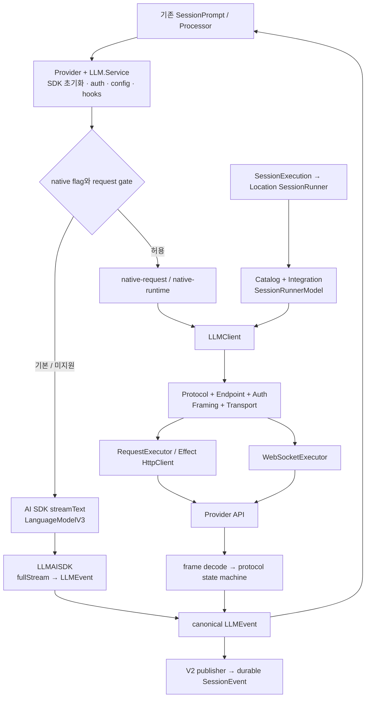
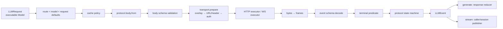
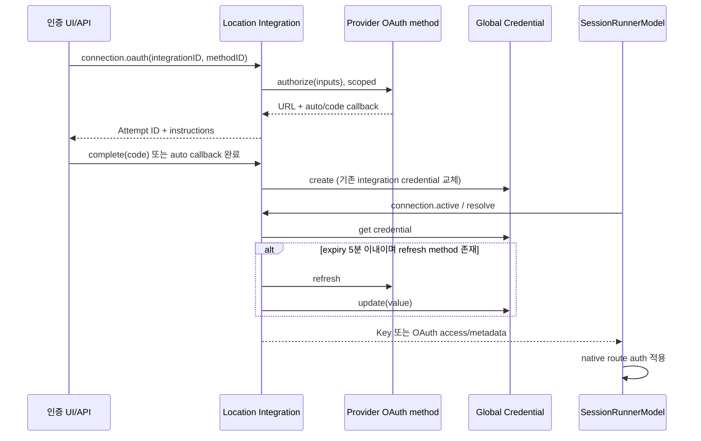

# OpenCode 모델 연동과 스트리밍 분석

분석 기준은 dev의 `907b3bc518fa48e90e8ec24dd327d13eee71c36c`이며, 분석일은 2026-10-04 Asia/Seoul이다. 공용 checkout의 HEAD와 작업 트리가 기준에 맞는지 확인하고 소스를 읽기 전용으로 조사했다. 이 보고서는 공급자 catalog·모델 해석·인증·요청 구성·transport·공통 이벤트의 연결을 다룬다. 엔진의 입력 접수/continuation 정책은 01, 도구 실행과 권한은 02, 영속 이벤트/API는 05, 공통 plugin lifecycle/config discovery는 06의 경계다.

**실행 검증:** 아래 구현 결론은 소스와 테스트 본문의 정적 확인이다. 현재 shell PATH에 Bun이 없고 원본 checkout에 의존성이 설치되지 않아 Bun 테스트/typecheck를 실행하지 않았다. 실제 공급자 요청·로그인·과금 호출도 하지 않았다. 테스트가 존재한다는 사실, fixture로 검증할 수 있는 범위, 이 조사에서 실행한 사실을 구분한다. 산출물의 JSON·소스 링크·줄 번호 및 checkout 불변성은 별도로 검사했다. 상세 범위는 [03-models.coverage.json](/Users/yakisoba0728/Documents/GitHub/Moodcode/docs/opencode-analysis/03-models.coverage.json)에 있다.

## 1. 가장 중요한 결론과 구현 지형

이 커밋에는 **기존 세션의 AI SDK 경로, 기존 세션의 실험적 native 경로, V2 SessionRunner의 native 경로**가 함께 있다. `packages/llm`이 여러 프로토콜을 구현했다고 모든 OpenCode 세션이 그 프로토콜을 사용하지는 않는다. 특히 V2의 catalog에 `aisdk` 모델이 있어도 runner는 AI SDK를 호출하는 대신 package 이름으로 세 가지 native route를 고른다. [기존 runtime 분기](https://github.com/anomalyco/opencode/blob/907b3bc518fa48e90e8ec24dd327d13eee71c36c/packages/opencode/src/session/llm.ts#L226-L280), [V2 모델 해석](https://github.com/anomalyco/opencode/blob/907b3bc518fa48e90e8ec24dd327d13eee71c36c/packages/core/src/session/runner/model.ts#L131-L179).

| 계층/경로 | 이 커밋의 실제 책임 | 실행 범위·중요한 제약 |
|---|---|---|
| 기존 `Provider` + `LLM.Service` | models.dev/config/auth/plugin을 합치고 `LanguageModelV3`를 생성; 세션 hook·권한·header·telemetry 구성 | AI SDK `streamText`가 기본. 새 llm도 공통 이벤트 타입으로 사용 |
| 기존 native adapter | 정상화된 AI SDK 메시지/도구를 canonical LLMRequest로 낮추고 `LLMClient`에 전달 | 별도 native flag와 provider/package/auth gate; OpenAI OAuth는 custom fetch가 있을 때 허용 |
| V2 `Catalog` + `Integration` | Location별 모델/공급자 state와 연결 가능성; process-global Credential에 저장된 key/OAuth 해석 | catalog 가용성과 runner 실행 가능성은 별개 |
| V2 `SessionRunnerModel` | 최종 catalog API·variant·credential → 실행 가능한 llm Model | OpenAI Responses, Anthropic Messages, URL이 있는 compatible Chat만. 최종 `api.type=native` 자체는 미지원 |
| `packages/llm` | protocol/endpoint/auth/framing/transport, canonical message/event/error, 한 provider turn | catalog/가격/session/권한/자동 도구 loop를 소유하지 않음 |
| `AISDK` + V2 provider plugins | SDK factory/language hook·provider별 catalog/auth 등록 | 서비스는 연결되어 있지만 현재 V2 runner는 `AISDK.language`와 해당 hook을 호출하지 않음 |
| `http-recorder` | Effect HTTP/socket record/replay와 비밀값 redaction | fixture 내용/요청 형태 검증; 실제 streaming 시간·backpressure 검증 아님 |

전체 의존성은 `Schema → Core/Protocol → Server`라는 저장소 방향을 따른다. provider/model wire 타입은 Schema가 소유하고 Core가 같은 Schema를 재수출한다. 반면 llm의 실행 Model은 route를 담는 별도 runtime 객체다. catalog ModelRef와 llm Model을 같은 직렬화 타입으로 취급하면 안 된다. [Core Model facade](https://github.com/anomalyco/opencode/blob/907b3bc518fa48e90e8ec24dd327d13eee71c36c/packages/core/src/model.ts#L1-L41), [Schema Model](https://github.com/anomalyco/opencode/blob/907b3bc518fa48e90e8ec24dd327d13eee71c36c/packages/schema/src/model.ts#L45-L106).

V2의 실제 연결은 local execution이 SessionStore에서 placement를 읽고 `LocationServiceMap.get(session.location)`을 제공해 runner를 호출하며, Location service group에는 Catalog/AISDK/Integration/Plugin/SessionRunner가 함께 있다. `LLMClient`와 RequestExecutor/FetchHttpClient는 global node다. [local placement](https://github.com/anomalyco/opencode/blob/907b3bc518fa48e90e8ec24dd327d13eee71c36c/packages/core/src/session/execution/local.ts#L14-L27), [Location service 구성](https://github.com/anomalyco/opencode/blob/907b3bc518fa48e90e8ec24dd327d13eee71c36c/packages/core/src/location-services.ts#L42-L79), [LLM global transport 구성](https://github.com/anomalyco/opencode/blob/907b3bc518fa48e90e8ec24dd327d13eee71c36c/packages/core/src/effect/app-node-platform.ts#L10-L16).

## 2. 모델 선택과 catalog

### 2.1 기존 Provider: metadata와 실행 SDK의 결합

기존 `Provider.Model`은 UI ID와 wire `api.id/url/npm`을 분리하고 capabilities, 비용, context/output 한도, status, options, headers, variants를 담는다. provider ID는 배포/계정 식별자이며 protocol 이름이 아니다. 같은 OpenAI Responses protocol을 OpenAI/Azure/Mantle/Copilot 등이 각기 다른 adapter와 인증으로 실행할 수 있다. [기존 Model 타입](https://github.com/anomalyco/opencode/blob/907b3bc518fa48e90e8ec24dd327d13eee71c36c/packages/opencode/src/provider/provider.ts#L1129-L1154).

InstanceState 안에서 구성하는 순서는 models.dev catalog → plugin config/models hook → 설정 provider/model 확장 → env → 저장된 API key → auth plugin loader → 내장 custom loader → 설정 재적용 → GitLab discovery → 최종 provider/model 필터다. env는 등록된 이름 중 첫 truthy 값을 쓰지만 이름이 하나일 때만 단순 provider.key가 된다. 저장 key가 그 위에 병합되고 마지막 config options가 다시 덮는다. alpha flag/deprecated/whitelist/blacklist와 enabled/disabled providers를 최종 적용하고 모델이 없으면 provider도 제거한다. [catalog 초기화](https://github.com/anomalyco/opencode/blob/907b3bc518fa48e90e8ec24dd327d13eee71c36c/packages/opencode/src/provider/provider.ts#L1451-L1480), [인증/loader 순서](https://github.com/anomalyco/opencode/blob/907b3bc518fa48e90e8ec24dd327d13eee71c36c/packages/opencode/src/provider/provider.ts#L1635-L1705), [최종 필터](https://github.com/anomalyco/opencode/blob/907b3bc518fa48e90e8ec24dd327d13eee71c36c/packages/opencode/src/provider/provider.ts#L1734-L1779).

models.dev의 model npm → provider npm → compatible 기본값으로 SDK를 고르고, experimental mode는 `model-mode`라는 별도 catalog entry로 펼친다. reasoning_options에서 만든 variant가 heuristic보다 우선한다. 이는 원격 entitlement/capability 검증과 같지 않다. [metadata 정규화](https://github.com/anomalyco/opencode/blob/907b3bc518fa48e90e8ec24dd327d13eee71c36c/packages/opencode/src/provider/provider.ts#L1316-L1408).

SDK 생성 시 provider options의 baseURL → model API URL 순으로 정하고 URL template는 vars loader/env로 확장한다. model header가 provider header를 덮고 options apiKey가 없으면 provider.key를 쓴다. SDK cache는 provider/npm/options hash, language cache는 provider/model ID다. 번들 밖 SDK는 Npm.add 뒤 `create*` export를 찾는 dynamic import이며 file URL도 허용한다. 따라서 native branch도 앞에서 `Provider.getLanguage()`를 호출하는 현재 구조에서는 SDK package loading 의존성을 피하지 못한다. [SDK resolution](https://github.com/anomalyco/opencode/blob/907b3bc518fa48e90e8ec24dd327d13eee71c36c/packages/opencode/src/provider/provider.ts#L1785-L1887), [language cache](https://github.com/anomalyco/opencode/blob/907b3bc518fa48e90e8ec24dd327d13eee71c36c/packages/opencode/src/provider/provider.ts#L1918-L1946), [native보다 먼저 SDK 초기화](https://github.com/anomalyco/opencode/blob/907b3bc518fa48e90e8ec24dd327d13eee71c36c/packages/opencode/src/session/llm.ts#L95-L103).

사용자 prompt 모델은 명시 input → agent 모델 → 세션의 현재 모델 순이고, 현재 모델은 SessionTable → 과거 user 메시지 → Provider.defaultModel 순이다. agent variant는 동일한 모델이며 존재하는 variant일 때만 적용한다. defaultModel은 config.model → state/model.json recent의 유효 항목 → 설정 provider에 맞는 첫 provider → 정렬 첫 모델이다. 정렬 preference 배열은 `findIndex` **내림차순**이므로 배열 첫 항목을 최고 우선이라고 설명하면 잘못이다. 이어 latest와 ID 내림차순이다. [prompt 모델/variant 선택](https://github.com/anomalyco/opencode/blob/907b3bc518fa48e90e8ec24dd327d13eee71c36c/packages/opencode/src/session/prompt.ts#L614-L654), [기본 모델과 정렬](https://github.com/anomalyco/opencode/blob/907b3bc518fa48e90e8ec24dd327d13eee71c36c/packages/opencode/src/provider/provider.ts#L2030-L2076).

small model은 explicit config → provider small_model hook → provider별 family/release heuristic이며 Azure 자동 추정은 제외한다. Bedrock은 global/지역/unprefixed 순으로 찾는다. 이런 로컬 선택 규칙과 실제 account가 호출 가능한 deployment는 별개의 사실이다. [small model 선택](https://github.com/anomalyco/opencode/blob/907b3bc518fa48e90e8ec24dd327d13eee71c36c/packages/opencode/src/provider/provider.ts#L1961-L2027).

### 2.2 V2 Schema와 Catalog: 읽을 때 합성하는 state

현행 Schema의 Provider는 `integrationID?, disabled?, api:{aisdk|native}, request:{headers,body}`이며 Model은 `api.id`, capabilities, request/variant, variants 배열, millis release time, cost tier 배열, enabled와 limits를 갖는다. specs/v2/provider-model.md의 endpoint discriminator·provider.enabled via env/account·Options.aisdk·NotFound/Option 형태는 이 커밋의 실제 Schema와 다르다. 보고서의 타입 설명은 source Schema를 기준으로 한다. [현행 Provider](https://github.com/anomalyco/opencode/blob/907b3bc518fa48e90e8ec24dd327d13eee71c36c/packages/schema/src/provider.ts#L26-L72), [현행 Model](https://github.com/anomalyco/opencode/blob/907b3bc518fa48e90e8ec24dd327d13eee71c36c/packages/schema/src/model.ts#L59-L106), [이전 endpoint 중심 명세](https://github.com/anomalyco/opencode/blob/907b3bc518fa48e90e8ec24dd327d13eee71c36c/specs/v2/provider-model.md#L24-L111).

Catalog는 Location별 State transform 목록을 재실행해 `Map<providerID,{provider,models:Map}>`를 만든다. state의 reader는 즉시 현재 snapshot을 반환하며 transform/reload는 semaphore로 직렬화되고 scoped 등록이 닫히면 이전 transform 결과를 다시 합성한다. state는 빈 catalog에서 시작한다. get/all은 등록된 모델 API의 빈 native placeholder를 provider API로 상속하거나 같은 aisdk 설정을 병합하고, request header/body는 provider → model 순의 얕은 merge다. `body.baseURL`은 API URL로 옮겨 body에서 제거한다. [projection/normalization](https://github.com/anomalyco/opencode/blob/907b3bc518fa48e90e8ec24dd327d13eee71c36c/packages/core/src/catalog.ts#L78-L103), [State 재합성/수명](https://github.com/anomalyco/opencode/blob/907b3bc518fa48e90e8ec24dd327d13eee71c36c/packages/core/src/state.ts#L78-L125).

가용성은 provider.disabled이면 false, 직접 `request.body.apiKey`가 string이면 true, 연결된 Integration에 credential/env connection이 있으면 true, 지정된 integration도 실제 integration도 없으면 true다. `provider.available`와 `model.available`는 이 판정 및 model.enabled를 결합한다. catalog 가용성은 credential expiry refresh 성공이나 protocol 지원을 미리 보장하지 않는다. [가용성 판정](https://github.com/anomalyco/opencode/blob/907b3bc518fa48e90e8ec24dd327d13eee71c36c/packages/core/src/catalog.ts#L71-L76), [모델 가용성](https://github.com/anomalyco/opencode/blob/907b3bc518fa48e90e8ec24dd327d13eee71c36c/packages/core/src/catalog.ts#L175-L213).

default는 transform/config가 설정한 모델이 usable+enabled일 때 사용하고, 아니면 available 모델의 release millis 최신 항목이다. small은 Azure 제외, OpenCode gpt-5-nano 특별 취급, active/text 입출력/18개월 이내/양의 비용 후보를 찾고 nano/flash/lite/mini/haiku/small/fast 이름을 먼저 제한한 뒤 cost 80% + age 20% 상대 점수를 쓴다. 비용 0 entry는 일반 small 후보에서 빠진다. [default/small 실제 알고리즘](https://github.com/anomalyco/opencode/blob/907b3bc518fa48e90e8ec24dd327d13eee71c36c/packages/core/src/catalog.ts#L215-L285).

models-dev plugin이 env/key Integration method와 catalog provider/models를 등록하고 experimental mode를 별도 모델로 펼친다. 기본 variants는 비어 있으며 provider plugins/config 및 마지막 VariantPlugin이 추가한다. 마지막 plugin의 자동 생성은 compatible GLM-5.2 high/max에 한정되며 explicit variant를 우선한다. 기존 ProviderTransform의 폭넓은 variant heuristic과 동등한 기능은 아니다. [models-dev catalog plugin](https://github.com/anomalyco/opencode/blob/907b3bc518fa48e90e8ec24dd327d13eee71c36c/packages/core/src/plugin/models-dev.ts#L119-L181), [config overlays](https://github.com/anomalyco/opencode/blob/907b3bc518fa48e90e8ec24dd327d13eee71c36c/packages/core/src/config/plugin/provider.ts#L41-L109), [좁은 V2 variant 생성](https://github.com/anomalyco/opencode/blob/907b3bc518fa48e90e8ec24dd327d13eee71c36c/packages/core/src/plugin/variant.ts#L10-L38).

### 2.3 provider policy와 catalog 갱신

Policy는 action/resource wildcard의 **마지막 일치**를 선택하고 catalog는 모든 transform 후 finalize에서 provider.use deny provider를 제거한다. config는 일반 값과 반대 순서로 authored document를 읽어 global user 정책이 repository 정책보다 뒤에서 적용되게 한다. plugin provider load 후 필터하므로 나중 로더가 deny entry를 되살리는 순서 문제를 피한다. organization-managed 정책 전달은 명세의 future 항목이다. arbitrary executable plugin 전체를 sandbox하는 계약도 아니다. [정책 evaluator](https://github.com/anomalyco/opencode/blob/907b3bc518fa48e90e8ec24dd327d13eee71c36c/packages/core/src/policy.ts#L31-L42), [최종 provider 제거](https://github.com/anomalyco/opencode/blob/907b3bc518fa48e90e8ec24dd327d13eee71c36c/packages/core/src/catalog.ts#L160-L169), [config 정책 순서](https://github.com/anomalyco/opencode/blob/907b3bc518fa48e90e8ec24dd327d13eee71c36c/packages/core/src/config.ts#L200-L211), [managed policy·plugin 경계 명세](https://github.com/anomalyco/opencode/blob/907b3bc518fa48e90e8ec24dd327d13eee71c36c/specs/v2/provider-policy.md#L145-L169).

models.dev 데이터는 기본 models.opencode.ai/api.json에서 받아 source별 cache filename을 쓰고 disk → build-in snapshot → network 순으로 populate한다. in-memory get은 무한 TTL cachedInvalidate, refresh는 disk 5분 freshness와 cross-process Flock를 두 번 확인하며 temp write+rename 후 invalidate/event를 발행한다. refresh HTTP는 10초 timeout, transient 2회 retry와 exponential jitter이고 60분 spaced scoped background loop가 있다. refresh 실패는 로그 후 무시하며 기존 cache를 유지한다. 이 모델 목록 cache와 LLM prompt cache는 다른 기능이다. [catalog HTTP/cache](https://github.com/anomalyco/opencode/blob/907b3bc518fa48e90e8ec24dd327d13eee71c36c/packages/core/src/models-dev.ts#L145-L181), [populate/refresh 수명](https://github.com/anomalyco/opencode/blob/907b3bc518fa48e90e8ec24dd327d13eee71c36c/packages/core/src/models-dev.ts#L184-L258).

**startup의 확인 한계:** provider-model 명세는 runner가 Location plugin boot를 기다린다고 쓰지만, 현행 PluginInternal boot는 State.batch를 forkScoped하고 조사한 local execution/Location map/resolver 경로에는 명시적인 join/readiness barrier가 없다. PluginV2.wait API가 있어도 core 호출자는 찾지 못했다. 따라서 초기 빈 catalog를 읽는 race 가능성은 소스상 남으며 실제 빈도는 실행하지 않았다. 이는 초기화 완료 보장이 있다는 설명과 구분해야 한다. [boot fork](https://github.com/anomalyco/opencode/blob/907b3bc518fa48e90e8ec24dd327d13eee71c36c/packages/core/src/plugin/internal.ts#L108-L123), [Location 획득](https://github.com/anomalyco/opencode/blob/907b3bc518fa48e90e8ec24dd327d13eee71c36c/packages/core/src/location-services.ts#L84-L110), [명세의 boot 설명](https://github.com/anomalyco/opencode/blob/907b3bc518fa48e90e8ec24dd327d13eee71c36c/specs/v2/provider-model.md#L268-L284).

## 3. 요청 준비와 runtime 선택

### 3.1 기존 세션 request prep

SessionPrompt는 모델 조회 → SessionProcessor 생성 → SessionTools.resolve → messages transform hook → stored history를 ModelMessage로 변환 → processor.process로 전달한다. processor가 같은 LLM.Service stream을 구독해 message/part·도구 상태·usage·retry를 처리한다. title과 project-copy 같은 small 호출도 이 서비스에 들어온다. [prompt 실행 연결](https://github.com/anomalyco/opencode/blob/907b3bc518fa48e90e8ec24dd327d13eee71c36c/packages/opencode/src/session/prompt.ts#L1213-L1286), [processor의 stream 소비](https://github.com/anomalyco/opencode/blob/907b3bc518fa48e90e8ec24dd327d13eee71c36c/packages/opencode/src/session/processor.ts#L650-L660).

LLMRequestPrep은 agent prompt 또는 provider system + input system + user system을 합치고 system/params/headers hooks를 실행한다. defaults/smallOptions → model → agent → 선택 variant 순 deep merge이며 small에서는 사용자 variant를 제외한다. OpenAI OAuth는 system을 instructions 옵션에 넣고 일반 system 메시지 삽입을 생략한다. GitLab workflow도 system 전달이 별도다. tools는 permission/input filter 뒤 OpenAI/Azure/Mantle strict=false, 과거 tool call만 있고 current tools가 없는 Copilot에는 _noop을 보완하며 이름을 정렬한다. header에는 session/parent affinity와 project/request/client identity가 들어가고 model → plugin header가 덮는다. [system/options/hooks](https://github.com/anomalyco/opencode/blob/907b3bc518fa48e90e8ec24dd327d13eee71c36c/packages/opencode/src/session/llm/request.ts#L56-L112), [tools/header 준비](https://github.com/anomalyco/opencode/blob/907b3bc518fa48e90e8ec24dd327d13eee71c36c/packages/opencode/src/session/llm/request.ts#L148-L205).

ProviderTransform은 지원하지 않는 media를 모델용 오류 text로 낮추고 provider별 빈 content/Unicode/tool ID/reasoning 조정, cache points, providerOptions namespace, Responses item ID 제거를 적용한다. Anthropic은 빈 signed/redacted reasoning을 보존하고 Bedrock은 signed/redacted reasoning만 replay한다. Mistral은 9자리 tool ID와 tool→user 사이 assistant "Done."을 요구한다. DeepSeek/interleaved 모델은 reasoning을 body namespace에 재배치한다. schema는 OpenAI 지원 subset·Moonshot 제한·Gemini nullable/enum 규칙에 맞춰 손실 정규화한다. 실제 registry/MCP schema도 이 변환에 들어간다. [message pipeline](https://github.com/anomalyco/opencode/blob/907b3bc518fa48e90e8ec24dd327d13eee71c36c/packages/opencode/src/provider/transform.ts#L465-L514), [provider별 message 보정](https://github.com/anomalyco/opencode/blob/907b3bc518fa48e90e8ec24dd327d13eee71c36c/packages/opencode/src/provider/transform.ts#L168-L352), [도구 schema 변환](https://github.com/anomalyco/opencode/blob/907b3bc518fa48e90e8ec24dd327d13eee71c36c/packages/opencode/src/provider/transform.ts#L1492-L1714).

reasoning/variant는 공급자 옵션으로 표현한다. models.dev reasoning_options는 effort/toggle/budget을 만들고, empty 배열은 generated variant를 억제한다. 기본 GPT5 store=false/promptCacheKey/reasoning summary/encrypted include, Gemini includeThoughts/thinking, Claude budget/adaptive 같은 규칙이 있다. Claude 5.1+ signed prefix block binding은 drop_block 기본이며 특정 Mythos 예외와 OpenCode opt-out을 적용한다. 이것은 저장소의 SDK patch까지 연결되는 동작이다. [reasoning/options](https://github.com/anomalyco/opencode/blob/907b3bc518fa48e90e8ec24dd327d13eee71c36c/packages/opencode/src/provider/transform.ts#L1220-L1387), [명시 reasoning variants](https://github.com/anomalyco/opencode/blob/907b3bc518fa48e90e8ec24dd327d13eee71c36c/packages/opencode/src/provider/transform.ts#L1717-L1920), [block binding policy](https://github.com/anomalyco/opencode/blob/907b3bc518fa48e90e8ec24dd327d13eee71c36c/packages/opencode/src/provider/transform.ts#L693-L735).

### 3.2 기존 native gate와 실제 예외

runtime의 `experimentalNativeLlm`은 `OPENCODE_EXPERIMENTAL_NATIVE_LLM`을 읽는다. session/llm/AGENTS.md의 umbrella experimental opt-in 설명과 달리 해당 flag 정의는 enabledByExperimental을 쓰지 않는다. gate는 provider=openai/anthropic/opencode prefix, npm=openai/openai-compatible/anthropic, API key 존재 여부를 본다. OpenAI OAuth는 provider.options.fetch가 있으면 허용하고 이 override만 native HttpClient bridge에 전달한다. 지침의 "OpenAI OAuth fallback" 설명도 현행 gate·테스트와 다르다. [현재 flag 정의](https://github.com/anomalyco/opencode/blob/907b3bc518fa48e90e8ec24dd327d13eee71c36c/packages/opencode/src/effect/runtime-flags.ts#L47-L57), [native gate](https://github.com/anomalyco/opencode/blob/907b3bc518fa48e90e8ec24dd327d13eee71c36c/packages/opencode/src/session/llm/native-runtime.ts#L50-L70), [OAuth fetch bridge](https://github.com/anomalyco/opencode/blob/907b3bc518fa48e90e8ec24dd327d13eee71c36c/packages/opencode/src/session/llm/native-runtime.ts#L148-L153).

gate를 통과한 요청은 ProviderTransform.message 뒤 native-request가 text/file/reasoning/tool-call/tool-result를 canonical 타입으로 만든다. lowering에 Google/Bedrock/Azure/OpenRouter helper가 있어도 위 session gate는 그 경로를 선택하지 않는다. file은 string/Uint8Array로 제한하고 image/unsupported content는 throw하며 gate는 content까지 검사하지 않는다. 이 lowering 실패를 AI SDK fallback reason으로 돌리는 catch는 없다. 일반 API key의 custom fetch·legacy header/chunk timeout wrapper도 OAuth처럼 forwarding하지 않으므로 runtime parity는 미검증이다. [content lowering 제약](https://github.com/anomalyco/opencode/blob/907b3bc518fa48e90e8ec24dd327d13eee71c36c/packages/opencode/src/session/llm/native-request.ts#L56-L99), [provider lowerer 목록](https://github.com/anomalyco/opencode/blob/907b3bc518fa48e90e8ec24dd327d13eee71c36c/packages/opencode/src/session/llm/native-request.ts#L153-L178), [native 준비/실행](https://github.com/anomalyco/opencode/blob/907b3bc518fa48e90e8ec24dd327d13eee71c36c/packages/opencode/src/session/llm/native-runtime.ts#L94-L137).

native tool-call은 먼저 emit한 뒤 OpenCode-owned execute를 FiberSet에서 시작하고 결과 queue를 provider stream 뒤에 합친다. 따라서 finish 이벤트가 local tool-result보다 앞설 수 있으며 provider turn과 local tool settlement는 같은 끝점이 아니다. typed dispatcher를 사용해도 permissions/plugin/abort/history 책임은 OpenCode에 남는다. [native settlement 순서](https://github.com/anomalyco/opencode/blob/907b3bc518fa48e90e8ec24dd327d13eee71c36c/packages/opencode/src/session/llm/native-runtime.ts#L106-L137), [finish 뒤 tool result 테스트](https://github.com/anomalyco/opencode/blob/907b3bc518fa48e90e8ec24dd327d13eee71c36c/packages/opencode/test/session/llm-native.test.ts#L543-L600).

### 3.3 V2 native resolver와 한 provider turn

V2 명시 모델은 available catalog에서 정확히 찾아 실패하면 ModelUnavailable을 내며 다른 모델로 조용히 바꾸지 않는다. 모델이 없으면 supported catalog default → 첫 available supported 모델 → ModelNotSelected 순이다. variant="default"/생략이면 model.request.variant를 쓰고, 명시 variant가 없으면 VariantUnavailable이다. overlays는 headers/body에 얕게 merge한다. [selection/fallback](https://github.com/anomalyco/opencode/blob/907b3bc518fa48e90e8ec24dd327d13eee71c36c/packages/core/src/session/runner/model.ts#L181-L218), [variant overlay](https://github.com/anomalyco/opencode/blob/907b3bc518fa48e90e8ec24dd327d13eee71c36c/packages/core/src/session/runner/model.ts#L104-L126).

credential key → OAuth access → request.body.apiKey → api.settings.apiKey 순으로 auth를 만든다. key metadata만 body에 합치고 OAuth metadata는 제외한다. route defaults에는 URL/header/body/limits만 보내며 body.apiKey는 삭제한다. generic api.settings fetch/timeout/SDK 옵션은 전달하지 않는다. 최종 API가 aisdk/openai면 Responses, aisdk/anthropic이면 x-api-key Messages, URL을 갖는 aisdk/openai-compatible이면 bearer Chat이다. source model의 빈 native placeholder는 projection에서 aisdk를 상속할 수 있지만 resolver에 전달된 **최종 API가 native이면 UnsupportedApiError**다. Google/Bedrock/Azure/Copilot 등도 미지원이다. [auth/defaults](https://github.com/anomalyco/opencode/blob/907b3bc518fa48e90e8ec24dd327d13eee71c36c/packages/core/src/session/runner/model.ts#L83-L101), [native route adaptation](https://github.com/anomalyco/opencode/blob/907b3bc518fa48e90e8ec24dd327d13eee71c36c/packages/core/src/session/runner/model.ts#L131-L179), [API/metadata 제약 테스트](https://github.com/anomalyco/opencode/blob/907b3bc518fa48e90e8ec24dd327d13eee71c36c/packages/core/test/session-runner-model.test.ts#L295-L345).

runner는 projected history를 매 turn 다시 읽고 model을 다시 resolve한다. request는 agent+context epoch baseline system, chronological system 메시지, materialized tools, session affinity headers와 OpenAI promptCacheKey를 담고 정확히 한 `llm.stream(request)`를 실행한다. local tool call은 durable publish 후 eagerly 실행하며 publication semaphore가 delta/tool-result를 직렬화한다. 모든 settlement 후 history를 reload하여 다음 turn을 명시적으로 시작한다. providerHosted call은 local 실행하지 않는다. orchestration 상세는 01/02 보고서 경계다. [V2 request 구성](https://github.com/anomalyco/opencode/blob/907b3bc518fa48e90e8ec24dd327d13eee71c36c/packages/core/src/session/runner/llm.ts#L173-L239), [한 turn·tool publication](https://github.com/anomalyco/opencode/blob/907b3bc518fa48e90e8ec24dd327d13eee71c36c/packages/core/src/session/runner/llm.ts#L240-L284).

V2 replay는 동일 model+provider이고 assistant error가 없을 때 reasoning/tool provider metadata를 재사용한다. 모델을 바꾸면 reasoning을 text로 낮추고 opaque continuation data를 버린다. hosted 결과는 assistant block에, local 결과는 별도 tool message로 만들며 완료 tool output의 unresolved remote/managed URI materialization은 TODO다. agent/model switched record는 provider history에 넣지 않는다. [V2 history lowering](https://github.com/anomalyco/opencode/blob/907b3bc518fa48e90e8ec24dd327d13eee71c36c/packages/core/src/session/runner/to-llm-message.ts#L39-L113), [메시지 종류 처리](https://github.com/anomalyco/opencode/blob/907b3bc518fa48e90e8ec24dd327d13eee71c36c/packages/core/src/session/runner/to-llm-message.ts#L115-L171).

## 4. native LLM: route에서 transport와 protocol event까지

### 4.1 현재 패키지의 책임과 executable Model

현재 private `@opencode-ai/llm`은 Effect, shared Schema, Smithy event-stream codec, aws4fetch를 사용하는 독립 구현이며 AI SDK runtime dependency를 갖지 않는다. `LLM.stream/generate`는 `LLMClient`의 alias로 **한 provider 요청**을 처리한다. session 선택·plugin·권한·catalog·가격 및 다음 turn orchestration은 caller가 소유한다. `DESIGN.md`는 현재 private API를 대체할 `@opencode-ai/ai` 논의 초안임을 명시한다. 거기에 제안된 run/turn API, catalog snapshot, pricing/cost, configurable retry/timeouts를 현재 기능으로 읽으면 안 된다. [manifest](https://github.com/anomalyco/opencode/blob/907b3bc518fa48e90e8ec24dd327d13eee71c36c/packages/llm/package.json#L1-L52), [공개 alias](https://github.com/anomalyco/opencode/blob/907b3bc518fa48e90e8ec24dd327d13eee71c36c/packages/llm/src/llm.ts#L37-L47), [설계 초안 상태](https://github.com/anomalyco/opencode/blob/907b3bc518fa48e90e8ec24dd327d13eee71c36c/packages/llm/DESIGN.md#L1-L8).

실행 Model은 `id/provider/route/defaults/compatibility`를 가지며 `ModelSchema`는 `instanceof Model`을 검사한다. 전역 route registry 없이 model 자신이 route를 보유한다. protocol은 body 생성/schema와 event schema/state machine을 소유하고, endpoint는 주소, auth는 요청 인증, transport는 보내고 읽는 방법을 소유한다. Route는 이들을 조합하며 `.with()`가 새 route를 반환한다. protocol은 constructor closure에 고정되어 `.with()`로 교체하지 않는다. [Model과 runtime schema](https://github.com/anomalyco/opencode/blob/907b3bc518fa48e90e8ec24dd327d13eee71c36c/packages/llm/src/schema/options.ts#L180-L243), [Protocol contract](https://github.com/anomalyco/opencode/blob/907b3bc518fa48e90e8ec24dd327d13eee71c36c/packages/llm/src/route/protocol.ts#L20-L66), [Route 생성과 patch](https://github.com/anomalyco/opencode/blob/907b3bc518fa48e90e8ec24dd327d13eee71c36c/packages/llm/src/route/client.ts#L247-L300).

### 4.2 compile과 실행의 구체적 순서

옵션 우선순위는 **route defaults < model defaults < request**다. records는 deep merge, arrays/scalars/null은 replacement, undefined는 ignore한다. catalog projection의 얕은 request merge와 별도 규칙이다. compile은 옵션 해석 → cache policy → protocol body 생성 → schema 검증 → transport prepare 순서다. [옵션 해석](https://github.com/anomalyco/opencode/blob/907b3bc518fa48e90e8ec24dd327d13eee71c36c/packages/llm/src/route/client.ts#L167-L179), [merge 규칙](https://github.com/anomalyco/opencode/blob/907b3bc518fa48e90e8ec24dd327d13eee71c36c/packages/llm/src/schema/options.ts#L6-L61), [compile](https://github.com/anomalyco/opencode/blob/907b3bc518fa48e90e8ec24dd327d13eee71c36c/packages/llm/src/route/client.ts#L341-L359).

`prepare<Body>()`는 전송하지 않지만 transport preparation까지 수행하므로 credential resolution·SigV4 signing은 일어날 수 있다. 반환 `PreparedRequest.body`는 **HTTP overlay 이전 protocol body**이며 실제 transport-private request나 최종 bytes를 노출하지 않는다. generic Body는 caller의 type assertion이며 선택 route를 추가로 검사하지 않는다. 따라서 prepare 결과만으로 auth가 없는 dry run이나 최종 wire body라고 판단할 수 없다. [prepare 계약](https://github.com/anomalyco/opencode/blob/907b3bc518fa48e90e8ec24dd327d13eee71c36c/packages/llm/src/route/client.ts#L141-L154), [prepare 반환값](https://github.com/anomalyco/opencode/blob/907b3bc518fa48e90e8ec24dd327d13eee71c36c/packages/llm/src/route/client.ts#L361-L371).

`http.body` overlay는 protocol schema validation 뒤 적용한다. `model/messages/input/tools/stream/generationConfig/inferenceConfig/thinking/tool_choice` 등 denylist에 열거된 주요 root field를 거부하고, 목록 밖 field는 deep merge해 JSON encoding한다. max_output_tokens/instructions/modelId 등도 denylist 밖이며, overlay 전체를 원 protocol body schema로 다시 검증하지 않는다. route headers → request headers → Auth.apply 순서로 최종 URL/body bytes에 인증을 적용한다. endpoint query보다 request query가 우선한다. [HTTP overlay와 auth 순서](https://github.com/anomalyco/opencode/blob/907b3bc518fa48e90e8ec24dd327d13eee71c36c/packages/llm/src/route/transport/http.ts#L24-L105).

stream은 frames → event schema decode → 선택적 terminal `takeUntil` → `mapAccumEffect(initial,step,onHalt)`를 수행한다. 기존 LLMError는 보존하고 다른 read/parse cause는 InvalidProviderOutput으로 낮춘다. generate는 같은 stream을 reducer로 fold하며 terminal finish/provider-error가 없으면 실패한다. **provider-error event는 finishReason=error인 정상 Effect 반환값으로 완성될 수 있다.** caller는 response 상태와 Effect error channel을 함께 해석해야 한다. response reducer는 마지막 usage-bearing event를 보존하고 step usage를 누적하지 않는다. [stream decoding](https://github.com/anomalyco/opencode/blob/907b3bc518fa48e90e8ec24dd327d13eee71c36c/packages/llm/src/route/client.ts#L220-L294), [generate 종료 조건](https://github.com/anomalyco/opencode/blob/907b3bc518fa48e90e8ec24dd327d13eee71c36c/packages/llm/src/route/client.ts#L374-L390), [error event 축약](https://github.com/anomalyco/opencode/blob/907b3bc518fa48e90e8ec24dd327d13eee71c36c/packages/llm/src/schema/events.ts#L594-L602).

### 4.3 HTTP, SSE, AWS binary framing과 native WebSocket

| 경계 | 실제 구현 | 해석할 때의 제약 |
|---|---|---|
| HTTP | Effect RequestExecutor로 JSON POST; 성공 response.stream을 framing에 전달 | header/status 단계의 retry와 body streaming의 오류는 별도 |
| SSE | incremental UTF-8 → Effect SSE decoder → empty/`[DONE]` 제외 → data JSON | SSE event name을 protocol에 전달하지 않음; Retry control은 empty stream으로 처리, reconnect 없음 |
| Bedrock binary | 누적 buffer에서 big-endian length 읽고 Smithy codec으로 CRC/header/payload decode | `:message-type=event`만 전달; exception envelope와 stream 끝 잔여 incomplete bytes의 검증은 추가 확인 필요 |
| native WS | http(s)를 ws(s)로 바꾸고 headers 확장을 지원하는 global WebSocket constructor 사용 | runtime별 constructor 호환성 필요; legacy WS pool과 별개 |
| native WS lifecycle | 요청별 open → sendText 한 번 → capacity 128 수신 queue → scoped close | pooling/reuse/fallback/reconnect loop 없음 |
| Responses WS | body.stream 제거 후 `type:response.create`; HTTP와 동일 protocol state machine | transport 변경이 continuation 자동 관리로 이어지지 않음 |

SSE와 binary의 구체적 구현은 [SSE framing](https://github.com/anomalyco/opencode/blob/907b3bc518fa48e90e8ec24dd327d13eee71c36c/packages/llm/src/protocols/shared.ts#L234-L249), [AWS framing](https://github.com/anomalyco/opencode/blob/907b3bc518fa48e90e8ec24dd327d13eee71c36c/packages/llm/src/protocols/bedrock-event-stream.ts#L24-L85)에 있다. AWS codec은 완전한 frame의 CRC를 검사하지만 framing 파일에는 max frame length guard나 종료 시 남은 bytes를 확인하는 onHalt가 없다. 실제 AWS exception header 및 truncated frame의 동작은 실행 재현하지 않았다.

WS는 text/Uint8Array/ArrayBuffer/view를 받고 unsupported payload 또는 비정상 close는 TransportReason, close1000/1005는 stream end로 처리한다. callback이 `Queue.offerUnsafe` 반환값을 소비하지 않으므로 느린 consumer와 capacity 초과 동작은 정적 분석만으로 보장하지 않는다. scoped acquireRelease는 listener 제거·queue shutdown·close1000을 수행한다. `LLMClient.layer`는 HTTP executor가 필수이고 WS executor는 선택적이라 WS route에서도 layer 구성의 HTTP dependency가 남는다. [WS constructor·queue·cleanup](https://github.com/anomalyco/opencode/blob/907b3bc518fa48e90e8ec24dd327d13eee71c36c/packages/llm/src/route/transport/websocket.ts#L125-L204), [요청별 WS 자원 수명](https://github.com/anomalyco/opencode/blob/907b3bc518fa48e90e8ec24dd327d13eee71c36c/packages/llm/src/route/transport/websocket.ts#L226-L261), [client layer](https://github.com/anomalyco/opencode/blob/907b3bc518fa48e90e8ec24dd327d13eee71c36c/packages/llm/src/route/client.ts#L417-L435), [Responses WS route](https://github.com/anomalyco/opencode/blob/907b3bc518fa48e90e8ec24dd327d13eee71c36c/packages/llm/src/protocols/openai-responses.ts#L994-L1020).

### 4.4 protocol별 request·stream state machine

| Protocol | 요청 lowering | parser와 종료 |
|---|---|---|
| OpenAI Chat | `/chat/completions`, stream=true, include_usage; max_tokens/temp/topP/penalties/seed/stop; reasoning_effort/store | first choice만; reasoning_content/text/tool deltas; finish_reason 때 tool JSON 완료, 뒤 usage chunk를 반영해 onHalt에서 tool-call/finish 방출 |
| OpenAI Responses | `/responses`; max_output_tokens/temp/topP; store/prompt_cache_key/include/reasoning summary·effort/verbosity/service tier/instructions | item ID와 summary block lifecycle; function item.done의 args가 누적 delta보다 우선; completed/incomplete/failed terminal |
| Anthropic Messages | `/v1/messages`, version 2023-06-01; max_tokens는 generation.maxTokens → model/route output limit →4096, topK/stop; enabled thinking budget | content-block별 text/thinking/signature/tool; message_delta에서 finish; message_stop만으로 finish 생성하지 않음 |
| Gemini | `models/{id}:streamGenerateContent?alt=sse`; max/temp/topP/topK/stop; thinkingBudget/includeThoughts | first candidate만; 완성 functionCall 즉시 출력, synthetic tool_0… ID; finish reason 또는 usage가 있으면 onHalt finish |
| Bedrock Converse | `/model/{encoded id}/converse-stream`; inference max/temp/topP/stop; topK는 additionalModelRequestFields.top_k | messageStop을 보류하고 뒤 metadata usage를 합쳐 onHalt finish; metadata만 있으면 기본 stop; protocol exception은 provider-error |

근거: [Chat builder/parser](https://github.com/anomalyco/opencode/blob/907b3bc518fa48e90e8ec24dd327d13eee71c36c/packages/llm/src/protocols/openai-chat.ts#L344-L491), [Responses builder](https://github.com/anomalyco/opencode/blob/907b3bc518fa48e90e8ec24dd327d13eee71c36c/packages/llm/src/protocols/openai-responses.ts#L456-L497), [Responses terminal](https://github.com/anomalyco/opencode/blob/907b3bc518fa48e90e8ec24dd327d13eee71c36c/packages/llm/src/protocols/openai-responses.ts#L959-L977), [Anthropic request](https://github.com/anomalyco/opencode/blob/907b3bc518fa48e90e8ec24dd327d13eee71c36c/packages/llm/src/protocols/anthropic-messages.ts#L493-L552), [Anthropic parser](https://github.com/anomalyco/opencode/blob/907b3bc518fa48e90e8ec24dd327d13eee71c36c/packages/llm/src/protocols/anthropic-messages.ts#L657-L811), [Gemini request](https://github.com/anomalyco/opencode/blob/907b3bc518fa48e90e8ec24dd327d13eee71c36c/packages/llm/src/protocols/gemini.ts#L292-L333), [Gemini parser](https://github.com/anomalyco/opencode/blob/907b3bc518fa48e90e8ec24dd327d13eee71c36c/packages/llm/src/protocols/gemini.ts#L363-L496), [Bedrock request](https://github.com/anomalyco/opencode/blob/907b3bc518fa48e90e8ec24dd327d13eee71c36c/packages/llm/src/protocols/bedrock-converse.ts#L388-L425), [Bedrock pending finish](https://github.com/anomalyco/opencode/blob/907b3bc518fa48e90e8ec24dd327d13eee71c36c/packages/llm/src/protocols/bedrock-converse.ts#L574-L629).

Responses standalone `error`는 completed/incomplete/failed terminal set에 들어 있지 않으며, Chat에 finish_reason이 없으면 completed tool-call/finish가 나오지 않는다. Gemini는 usage만 있으면 unknown finish도 가능하다. 이 차이 때문에 stream의 EOF를 모든 protocol에 동일한 성공 종료로 해석하면 안 된다. Anthropic은 adaptive thinking이나 effort 전체 옵션을 보편적으로 낮추는 코드가 아니라 enabled/budget 경로다. catalog variant가 있다고 모든 native protocol이 그대로 수용하는 것은 아니다.

### 4.5 native provider facade와 protocol의 구분

provider facade는 auth/env/주소/기본 API를 편리하게 구성한다. model discovery/capability/가격 조회는 하지 않는다. generic compatible은 OpenAIChat.protocol을 그대로 쓰며, OpenRouter는 Chat parser에 자체 body builder/schema를 붙인다. [compatible reuse](https://github.com/anomalyco/opencode/blob/907b3bc518fa48e90e8ec24dd327d13eee71c36c/packages/llm/src/protocols/openai-compatible-chat.ts#L1-L24), [OpenRouter route](https://github.com/anomalyco/opencode/blob/907b3bc518fa48e90e8ec24dd327d13eee71c36c/packages/llm/src/providers/openrouter.ts#L33-L95).

| Facade | API·주소 선택 | 인증·설정 |
|---|---|---|
| OpenAI | 기본 Responses; 명시 Chat/Responses WS | OPENAI_API_KEY; store=false; GPT5 조건부 effort/summary/encrypted include/verbosity default |
| Anthropic/Google | Messages/Gemini | x-api-key / x-goog-api-key; 각 env fallback |
| Amazon Bedrock | Converse, region config→credentials.region→us-east-1 | explicit apiKey면 bearer; 아니면 static AWS credentials SigV4. native 안에는 AWS chain/STS refresh 없음 |
| Azure | 기본 Responses, useCompletionUrls면 Chat; baseURL/resourceName | api-version=v1; authorization 제거 후 api-key, AZURE_OPENAI_API_KEY |
| GitHub Copilot | endpoint metadata 우선; GPT≥5 Responses, gpt-5-mini 제외 | baseURL 필수; bearer, env fallback 없음 |
| xAI | 기본 Responses, Chat은 compatible | XAI_API_KEY; OpenAI의 GPT5 facade default는 적용하지 않음 |
| compatible | custom provider/baseURL와 family helper | bearer/env fallback 없음 |
| Cloudflare | Workers/Gateway compatible Chat | gatewayApiKey는 cf-aig-authorization, apiKey는 authorization; 양쪽이면 모두 |

각 계약은 [OpenAI facade](https://github.com/anomalyco/opencode/blob/907b3bc518fa48e90e8ec24dd327d13eee71c36c/packages/llm/src/providers/openai.ts#L12-L54), [GPT5 defaults](https://github.com/anomalyco/opencode/blob/907b3bc518fa48e90e8ec24dd327d13eee71c36c/packages/llm/src/providers/openai-options.ts#L44-L79), [Bedrock facade](https://github.com/anomalyco/opencode/blob/907b3bc518fa48e90e8ec24dd327d13eee71c36c/packages/llm/src/providers/amazon-bedrock.ts#L13-L43), [Azure facade](https://github.com/anomalyco/opencode/blob/907b3bc518fa48e90e8ec24dd327d13eee71c36c/packages/llm/src/providers/azure.ts#L12-L103), [Copilot facade](https://github.com/anomalyco/opencode/blob/907b3bc518fa48e90e8ec24dd327d13eee71c36c/packages/llm/src/providers/github-copilot.ts#L10-L62), [Cloudflare facade](https://github.com/anomalyco/opencode/blob/907b3bc518fa48e90e8ec24dd327d13eee71c36c/packages/llm/src/providers/cloudflare.ts#L36-L70)에서 확인했다. V2 resolver가 이 전체 facade 목록을 노출하는 것은 아니다.

## 5. reasoning, tools, media, cache와 continuation

### 5.1 canonical content와 tool settlement

canonical request는 model/system/messages/tools/toolChoice/generation/providerOptions/http/responseFormat/cache/metadata다. message content는 text/media/reasoning/tool-call/tool-result이며 providerMetadata와 encrypted state를 보유할 수 있다. `Message.native`의 실제 production consumer는 Chat reasoning_content fallback이고, `ToolDefinition.native`는 현재 body builder에서 소비하지 않는다. native Lifecycle의 step index는 turn마다0이며 전체 session numbering은 caller 책임이다. [message content](https://github.com/anomalyco/opencode/blob/907b3bc518fa48e90e8ec24dd327d13eee71c36c/packages/llm/src/schema/messages.ts#L122-L189), [tool/request schema](https://github.com/anomalyco/opencode/blob/907b3bc518fa48e90e8ec24dd327d13eee71c36c/packages/llm/src/schema/messages.ts#L224-L295), [step lifecycle](https://github.com/anomalyco/opencode/blob/907b3bc518fa48e90e8ec24dd327d13eee71c36c/packages/llm/src/protocols/utils/lifecycle.ts#L1-L65).

ToolStream은 protocol의 index/item ID를 stream key로 사용하며 최종 call ID와 구분한다. first delta의 id/name 또는 명시 start가 필요하고, 시작되지 않은 후속 delta를 거부한다. 종료 시 누적 args를 JSON decode하며 empty string은 {}다. Responses의 authoritative final args는 누적 delta를 대체한다. [tool accumulation](https://github.com/anomalyco/opencode/blob/907b3bc518fa48e90e8ec24dd327d13eee71c36c/packages/llm/src/protocols/utils/tool-stream.ts#L105-L192), [empty args](https://github.com/anomalyco/opencode/blob/907b3bc518fa48e90e8ec24dd327d13eee71c36c/packages/llm/src/protocols/shared.ts#L149-L156).

`ToolRuntime.dispatch`는 call 하나의 input decode → execute → success encode → model projection을 수행한다. unknown tool/no execute/ToolFailure/validation 오류는 model-visible error settlement로 바꾼다. providerExecuted 여부를 dispatch가 검사하지 않으므로 caller가 건너뛰어야 한다. typed Effect Schema는 runtime decode/encode가 있지만 dynamic JSON Schema의 decoder/encoder는 passthrough다. output의 structured 값과 model에게 보이는 content를 분리할 수 있으며, content 없음→JSON, 단일 text→text, 그 외→content result다. [dispatch](https://github.com/anomalyco/opencode/blob/907b3bc518fa48e90e8ec24dd327d13eee71c36c/packages/llm/src/tool-runtime.ts#L22-L75), [dynamic tool 계약](https://github.com/anomalyco/opencode/blob/907b3bc518fa48e90e8ec24dd327d13eee71c36c/packages/llm/src/tool.ts#L165-L199), [output projection](https://github.com/anomalyco/opencode/blob/907b3bc518fa48e90e8ec24dd327d13eee71c36c/packages/llm/src/schema/messages.ts#L80-L109).

**hosted tool 정의와 hosted 응답의 지원 수준은 다르다.** package AGENTS는 Anthropic/Responses hosted tool definition lowering을 설명하지만 실제 Anthropic lowerTool은 항상 name/description/input_schema, Responses는 항상 function/strict=false다. hosted 응답 parser와 replay는 존재해 providerExecuted=true로 표시하지만 hosted definition을 request에 낮추는 분기는 없다. tools overlay도 금지하므로 http.body로 이 공백을 채울 수 없다. [문서의 hosted 주장](https://github.com/anomalyco/opencode/blob/907b3bc518fa48e90e8ec24dd327d13eee71c36c/packages/llm/AGENTS.md#L248-L254), [Anthropic 도구 encoder](https://github.com/anomalyco/opencode/blob/907b3bc518fa48e90e8ec24dd327d13eee71c36c/packages/llm/src/protocols/anthropic-messages.ts#L261-L266), [Responses 도구 encoder](https://github.com/anomalyco/opencode/blob/907b3bc518fa48e90e8ec24dd327d13eee71c36c/packages/llm/src/protocols/openai-responses.ts#L259-L266), [hosted 응답](https://github.com/anomalyco/opencode/blob/907b3bc518fa48e90e8ec24dd327d13eee71c36c/packages/llm/src/protocols/openai-responses.ts#L543-L601).

`responseFormat`은 schema/request 복사에 있으나 protocol builder가 소비하지 않는다. structured output의 실제 API인 generateObject는 generate_object synthetic tool을 named choice로 강제하고 call input을 Schema decode한다. raw JSONSchema dynamic 경로는 typed validator를 자동 생성하지 않는다. [structured output 구현](https://github.com/anomalyco/opencode/blob/907b3bc518fa48e90e8ec24dd327d13eee71c36c/packages/llm/src/llm.ts#L110-L157).

### 5.2 media 입력·도구 결과의 범위

media는 Uint8Array 또는 canonical base64/data URL이며 remote URL을 fetch하지 않는다. MIME allowlist와 data URL의 declared MIME 일치, encoded28MiB/decoded20MiB, canonical base64를 검사한다. 실제 파일 내용 sniffing이나 선택 model의 capability 검사는 하지 않는다. ToolFile URI도 같은 validator를 거쳐 protocol replay에는 base64/data URL이 필요하다. [media validation](https://github.com/anomalyco/opencode/blob/907b3bc518fa48e90e8ec24dd327d13eee71c36c/packages/llm/src/protocols/shared.ts#L158-L209).

| Protocol | user media | tool result encoding |
|---|---|---|
| Chat | PNG/JPEG/GIF/WebP | 텍스트 tool message 후 synthetic user image message |
| Responses | 같은 image | function_call_output의 text/image content |
| Anthropic | 같은 image | tool_result content의 text/image |
| Gemini | image + MP4/WebM/QuickTime + WAV/MP3/AIFF/AAC/OGG/FLAC | functionResponse와 inline media |
| Bedrock | image + PDF/CSV/DOC/DOCX/XLS/XLSX/HTML/TXT/MD documents | toolResult의 text/JSON/image; document tool output 미지원 |

[Chat tool media](https://github.com/anomalyco/opencode/blob/907b3bc518fa48e90e8ec24dd327d13eee71c36c/packages/llm/src/protocols/openai-chat.ts#L264-L290), [Responses result media](https://github.com/anomalyco/opencode/blob/907b3bc518fa48e90e8ec24dd327d13eee71c36c/packages/llm/src/protocols/openai-responses.ts#L325-L343), [Anthropic result media](https://github.com/anomalyco/opencode/blob/907b3bc518fa48e90e8ec24dd327d13eee71c36c/packages/llm/src/protocols/anthropic-messages.ts#L325-L350), [Gemini result media](https://github.com/anomalyco/opencode/blob/907b3bc518fa48e90e8ec24dd327d13eee71c36c/packages/llm/src/protocols/gemini.ts#L251-L290), [Bedrock media allowlist](https://github.com/anomalyco/opencode/blob/907b3bc518fa48e90e8ec24dd327d13eee71c36c/packages/llm/src/protocols/utils/bedrock-media.ts#L32-L90), [Bedrock tool media](https://github.com/anomalyco/opencode/blob/907b3bc518fa48e90e8ec24dd327d13eee71c36c/packages/llm/src/protocols/bedrock-converse.ts#L268-L299).

Gemini output inlineData를 canonical media event로 방출하는 경로는 없다. 또한 V2 history의 관리형 tool URI를 media data로 materialize하는 코드에는 TODO가 남아 있으며 unresolved URI를 ToolOutput conversion이 거부한다. URI 저장 계약과 native wire media 지원을 같은 기능으로 취급할 수 없다. [V2 tool result 변환](https://github.com/anomalyco/opencode/blob/907b3bc518fa48e90e8ec24dd327d13eee71c36c/packages/core/src/session/runner/to-llm-message.ts#L39-L68).

### 5.3 reasoning과 replay는 provider metadata를 포함한 계약

| Protocol | 저장/다음 요청에 필요한 값 | replay 동작 |
|---|---|---|
| Responses | openai.itemId와 reasoning summary/encryptedContent | store!=false는 item_reference; store=false는 같은 item summary 합치고 encrypted_content 있는 item만, id는 제외 |
| Anthropic | encrypted 또는 anthropic.signature | thinking block과 signature 재전송; server tool block/result도 유지 |
| Gemini | google thoughtSignature | reasoning와 functionCall에 signature; functionResponse는 call ID보다 function name으로 연결 |
| Bedrock | reasoning text/signature | reasoningContent와 signature 재전송 |
| compatible Chat | reasoning_content 또는 해당 canonical/native 값 | compatible dialect에 맞춰 재전송, provider별 opaque 상태까지 일반화하지 않음 |

Responses에서 canonical `ReasoningPart.encrypted`만 채워서는 replay되지 않는다. lowerReasoning은 providerMetadata.openai.itemId를 요구하고 provider namespace의 encrypted content를 읽는다. hosted call은 replay input에서 제외하고 store!=false인 hosted result item만 reference로 보낸다. store=false에서는 hosted item replay가 없다. typed previous_response_id handling/response delta 저장은 이 native layer에 없으며 caller가 명시한 허용 HTTP body field를 전달할 수 있다는 것과 automatic continuation은 구분한다. [Responses reasoning metadata](https://github.com/anomalyco/opencode/blob/907b3bc518fa48e90e8ec24dd327d13eee71c36c/packages/llm/src/protocols/openai-responses.ts#L283-L324), [Responses replay](https://github.com/anomalyco/opencode/blob/907b3bc518fa48e90e8ec24dd327d13eee71c36c/packages/llm/src/protocols/openai-responses.ts#L370-L453), [Anthropic replay](https://github.com/anomalyco/opencode/blob/907b3bc518fa48e90e8ec24dd327d13eee71c36c/packages/llm/src/protocols/anthropic-messages.ts#L439-L480), [Gemini replay](https://github.com/anomalyco/opencode/blob/907b3bc518fa48e90e8ec24dd327d13eee71c36c/packages/llm/src/protocols/gemini.ts#L200-L247), [Bedrock signature](https://github.com/anomalyco/opencode/blob/907b3bc518fa48e90e8ec24dd327d13eee71c36c/packages/llm/src/protocols/bedrock-converse.ts#L252-L267).

initial request.system과 chronological Message.system은 구별된다. 대부분 protocol은 중간 system을 escaped `<system-update>` user text로 낮춰 시간 순서를 보존한다. Anthropic은 model ID가 정확히 claude-opus-4-8이며 주변 위치 조건이 맞을 때만 native 중간 system role을 사용한다. 미완료 local tool-call과 result 사이를 update가 가르면 InvalidRequest다. 따라서 protocol-neutral chronological context가 모든 공급자에서 동일한 privileged system semantics를 가진다는 보장은 없다. [wrapped system update](https://github.com/anomalyco/opencode/blob/907b3bc518fa48e90e8ec24dd327d13eee71c36c/packages/llm/src/protocols/shared.ts#L111-L146), [Anthropic system 조건](https://github.com/anomalyco/opencode/blob/907b3bc518fa48e90e8ec24dd327d13eee71c36c/packages/llm/src/protocols/anthropic-messages.ts#L353-L435).

V2 toLLMMessages는 **같은 provider/model이고 실패하지 않은 assistant**에만 provider metadata를 유지한다. 모델을 바꾸거나 실패한 turn은 opaque replay metadata를 제외하고 reasoning은 text로 보낸다. providerExecuted call/result는 assistant content, 로컬 result는 tool message로 구성한다. 이 변환 후 runner가 매 turn durable history를 다시 읽어 request를 만든다. [V2 모델별 metadata 재사용](https://github.com/anomalyco/opencode/blob/907b3bc518fa48e90e8ec24dd327d13eee71c36c/packages/core/src/session/runner/to-llm-message.ts#L70-L113), [V2 다음 turn 경계](https://github.com/anomalyco/opencode/blob/907b3bc518fa48e90e8ec24dd327d13eee71c36c/packages/core/src/session/runner/llm.ts#L392-L414).

### 5.4 prompt cache의 실제 policy와 한계

native default/auto는 마지막 tool definition, 마지막 initial system part, latest user message에 hint를 채운다. 기존 수동 hint는 유지한다. none은 **자동 배치만** 끄고 수동 hint나 provider implicit cache까지 끄지는 않는다. granular object로 latest-assistant/tail 전략을 고를 수 있다. message에서는 마지막 text part, 없으면 마지막 content를 표시한다. pure media part의 schema/lowering가 cache marker를 수용하는지는 별도 확인 필요다. [policy 기본값과 none](https://github.com/anomalyco/opencode/blob/907b3bc518fa48e90e8ec24dd327d13eee71c36c/packages/llm/src/cache-policy.ts#L18-L42), [part placement](https://github.com/anomalyco/opencode/blob/907b3bc518fa48e90e8ec24dd327d13eee71c36c/packages/llm/src/cache-policy.ts#L47-L110).

자동 배치 gate는 protocol.id가 아니라 **route.id가 literal anthropic-messages/bedrock-converse인지**다. 같은 protocol에 custom route ID를 붙이면 자동 policy가 적용되지 않는다. Anthropic/Bedrock은 tools → system → messages 순서로 총4 breakpoint budget을 소비하고 초과 marker를 경고하며 버린다. ephemeral/persistent는 같은 wire marker로 낮추며 ttl>=3600은1h, 나머지는 provider default5m다. [route ID gate](https://github.com/anomalyco/opencode/blob/907b3bc518fa48e90e8ec24dd327d13eee71c36c/packages/llm/src/cache-policy.ts#L99-L110), [TTL bucket](https://github.com/anomalyco/opencode/blob/907b3bc518fa48e90e8ec24dd327d13eee71c36c/packages/llm/src/protocols/utils/cache.ts#L1-L16), [Anthropic breakpoint 소비](https://github.com/anomalyco/opencode/blob/907b3bc518fa48e90e8ec24dd327d13eee71c36c/packages/llm/src/protocols/anthropic-messages.ts#L506-L537), [Bedrock breakpoint 소비](https://github.com/anomalyco/opencode/blob/907b3bc518fa48e90e8ec24dd327d13eee71c36c/packages/llm/src/protocols/bedrock-converse.ts#L388-L403).

OpenAI/Gemini는 inline auto pass를 건너뛴다. OpenAI prompt_cache_key는 별도 옵션이고 V2 runner가 session ID 기반 key를 구성한다. Gemini cachedContent 생성·수명 관리 API는 구현되어 있지 않다. cache policy와 provider의 실제 hit/할인 여부는 별개이며 최신 모델별 minimum prefix/가격을 이 분석에서 외부 조회하지 않았다. [V2 cache key](https://github.com/anomalyco/opencode/blob/907b3bc518fa48e90e8ec24dd327d13eee71c36c/packages/core/src/session/runner/llm.ts#L205-L223).

### 5.5 자동 tool loop의 소유권

production LLMClient는 한 요청만 보낸다. ToolRuntime은 한 call만 실행하고 history append/maxSteps/concurrency/usage 누적/다음 provider 요청을 소유하지 않는다. 테스트의 `test/lib/tool-runtime.ts`는 test-owned continuation loop라고 명시하며 default maxSteps10/concurrency10, providerExecuted skip, usage 합산과 history append를 구현한다. “without looping by default”라는 테스트도 maxSteps1을 명시한 helper 호출이다. 이 테스트를 production 기본 loop 기능의 근거로 쓸 수 없다. [production 단일 요청](https://github.com/anomalyco/opencode/blob/907b3bc518fa48e90e8ec24dd327d13eee71c36c/packages/llm/src/route/client.ts#L374-L390), [test-owned loop](https://github.com/anomalyco/opencode/blob/907b3bc518fa48e90e8ec24dd327d13eee71c36c/packages/llm/test/lib/tool-runtime.ts#L23-L69), [명시 maxSteps1](https://github.com/anomalyco/opencode/blob/907b3bc518fa48e90e8ec24dd327d13eee71c36c/packages/llm/test/tool-runtime.test.ts#L406-L419).

기존 native-runtime은 tool을 FiberSet으로 시작하고 provider finish 후 결과를 이어 공통 event stream에 합친다. V2 runner는 publisher로 tool-call을 durable publish한 뒤 local execution fiber를 시작하고 settlement를 기다린다. 실제 continue/stop/steer/queue policy의 전수 분석은 01, 도구 권한·output 보관은 02의 범위다. [legacy native tool settlement](https://github.com/anomalyco/opencode/blob/907b3bc518fa48e90e8ec24dd327d13eee71c36c/packages/opencode/src/session/llm/native-runtime.ts#L94-L137), [V2 eager tool dispatch](https://github.com/anomalyco/opencode/blob/907b3bc518fa48e90e8ec24dd327d13eee71c36c/packages/core/src/session/runner/llm.ts#L240-L284).

## 6. 인증, refresh, 공급자 전용 adapter

### 6.1 세 종류의 저장 계약

기존 Auth는 Global.Path.data/auth.json에 provider별 api/oauth/wellknown을 저장한다. OAuth access/refresh/expires와 accountId/enterpriseUrl, API key metadata가 있다. 파일 write mode는 0600이다. OPENCODE_AUTH_CONTENT가 있으면 JSON을 우선 읽으며 파일 경로와 같은 Schema filter를 거치지 않는다. ProviderAuth는 Instance별 pending OAuth callback을 providerID로 보관한다. authorize의 method 선택 결과를 나중 callback이 실행하고, success 후 Auth.set으로 저장한다. pending 항목은 성공 뒤 삭제되지 않으며 callback의 method 인자는 실제 pending 선택에 사용되지 않는다. [기존 Auth 저장](https://github.com/anomalyco/opencode/blob/907b3bc518fa48e90e8ec24dd327d13eee71c36c/packages/opencode/src/auth/index.ts#L14-L88), [기존 OAuth pending 계약](https://github.com/anomalyco/opencode/blob/907b3bc518fa48e90e8ec24dd327d13eee71c36c/packages/opencode/src/provider/auth.ts#L100-L221).

V2 Credential은 integrationID별 key/OAuth value를 SQLite JSON column에 저장하는 global service다. create는 한 transaction에서 같은 integration의 이전 credential을 지우고 새 ID를 넣는다. list 형태의 API가 있어도 현재 일반 create 계약은 integration당 한 credential 교체다. AccountTable의 Console access/refresh/expiry와도 다른 저장소다. [Credential value/table](https://github.com/anomalyco/opencode/blob/907b3bc518fa48e90e8ec24dd327d13eee71c36c/packages/core/src/credential/sql.ts#L5-L14), [교체 transaction](https://github.com/anomalyco/opencode/blob/907b3bc518fa48e90e8ec24dd327d13eee71c36c/packages/core/src/credential.ts#L94-L120), [Account table](https://github.com/anomalyco/opencode/blob/907b3bc518fa48e90e8ec24dd327d13eee71c36c/packages/core/src/account/sql.ts#L6-L22).

Integration은 Location별 method registry/attempt scope이며 global Credential을 projection한다. 최신 saved credential → env 순으로 연결 목록을 만들고 첫 연결을 active로 사용한다. OAuth auto callback은 attempt scope의 fiber, code callback은 complete가 실행한다. lifetime 10분/terminal retention 1분/scrub 30초이며 성공·실패·만료·취소 시 scope를 정리한다. expiry가 now+5분보다 가까우면 method.refresh를 호출하고 Credential을 update한다. 공통 resolve에는 refresh single-flight가 없고 method-specific contract가 이를 보완해야 한다. [active 연결 우선순위](https://github.com/anomalyco/opencode/blob/907b3bc518fa48e90e8ec24dd327d13eee71c36c/packages/core/src/integration.ts#L288-L301), [attempt lifetime](https://github.com/anomalyco/opencode/blob/907b3bc518fa48e90e8ec24dd327d13eee71c36c/packages/core/src/integration.ts#L198-L200), [attempt settlement/expiry](https://github.com/anomalyco/opencode/blob/907b3bc518fa48e90e8ec24dd327d13eee71c36c/packages/core/src/integration.ts#L322-L364), [refresh와 method 실행](https://github.com/anomalyco/opencode/blob/907b3bc518fa48e90e8ec24dd327d13eee71c36c/packages/core/src/integration.ts#L380-L456).

Console Account 서비스는 별도 device login/org/config 계약이다. refresh window는 5분이며 AccountID-keyed Effect Cache(timeToLive=0)가 in-flight refresh를 합치고 token pair를 AccountRepo에 저장한다. config GET에는 selected x-org-id가 들어가며 404는 없음으로 처리한다. login success는 user/org 조회 후 첫 org를 선택한다. 이 legacy Account service는 V2 OpenAI/Copilot 인증 서비스가 아니다. [Account refresh/dedupe](https://github.com/anomalyco/opencode/blob/907b3bc518fa48e90e8ec24dd327d13eee71c36c/packages/opencode/src/account/account.ts#L216-L282), [org config](https://github.com/anomalyco/opencode/blob/907b3bc518fa48e90e8ec24dd327d13eee71c36c/packages/opencode/src/account/account.ts#L363-L384), [device login settlement](https://github.com/anomalyco/opencode/blob/907b3bc518fa48e90e8ec24dd327d13eee71c36c/packages/opencode/src/account/account.ts#L417-L460).

V2 OpenCode provider plugin도 별도 Console device method/refresh를 등록한다. org는 이름+ID 정렬의 첫 항목을 metadata에 저장하고 bearer+x-org-id로 remote V1 config를 가져와 V2 catalog에 변환한다. provider entries는 integrationID=opencode를 가리키며 remote apiKey는 제거한다. 연결 갱신 이벤트가 catalog reload를 촉발한다. key/connection이 없으면 public key를 사용하고 input 비용이 양수인 모델을 disable한다. output-only 비용은 이 조건에 걸리지 않는다. 계정·조직 선택 parity와 서버 과금/Zen proxy의 구현은 08 분석 경계다. [V2 Console method](https://github.com/anomalyco/opencode/blob/907b3bc518fa48e90e8ec24dd327d13eee71c36c/packages/core/src/plugin/provider/opencode.ts#L37-L83), [remote config의 catalog 반영](https://github.com/anomalyco/opencode/blob/907b3bc518fa48e90e8ec24dd327d13eee71c36c/packages/core/src/plugin/provider/opencode.ts#L118-L195), [config fetch/credential metadata](https://github.com/anomalyco/opencode/blob/907b3bc518fa48e90e8ec24dd327d13eee71c36c/packages/core/src/plugin/provider/opencode.ts#L199-L296).

### 6.2 기존 OpenAI ChatGPT/Codex OAuth

기존 CodexAuthPlugin은 browser S256 PKCE/state/openid-profile-email-offline_access와 localhost:1455 callback, 5분 callback timeout을 쓴다. callback 서버와 pending은 module singleton이다. headless deviceauth poll은 403/404 pending과 interval+safety margin을 처리하지만 그 함수 내부에 전체 deadline/AbortSignal은 없다. JWT payload decode는 account/residency metadata 추출용이며 token 서명 검증을 이 helper가 수행하는 것은 아니다. [browser callback 수명](https://github.com/anomalyco/opencode/blob/907b3bc518fa48e90e8ec24dd327d13eee71c36c/packages/opencode/src/plugin/openai/codex.ts#L164-L279), [login methods](https://github.com/anomalyco/opencode/blob/907b3bc518fa48e90e8ec24dd327d13eee71c36c/packages/opencode/src/plugin/openai/codex.ts#L439-L556), [JWT metadata 추출](https://github.com/anomalyco/opencode/blob/907b3bc518fa48e90e8ec24dd327d13eee71c36c/packages/opencode/src/plugin/openai/codex.ts#L49-L97).

OAuth loader는 SDK에 dummy key+fetch를 제공한다. request 시 access가 없거나 expired면 loader별 refreshPromise로 동시 refresh를 합치고 rotated refresh/access/expires/account ID를 Auth에 저장한다. 저장 실패도 요청 실패로 전달한다. Authorization은 실제 access로 바꾸고 Responses/Chat endpoint를 chatgpt.com/backend-api/codex/responses로 rewrite하며 ChatGPT-Account-Id를 붙인다. Codex 대상에만 compute residency header를 붙인다. title에는 내부 header, 일반 chat에는 originator/User-Agent/session-id가 들어가고 maxOutputTokens를 제거한다. [loader refresh/rewrite](https://github.com/anomalyco/opencode/blob/907b3bc518fa48e90e8ec24dd327d13eee71c36c/packages/opencode/src/plugin/openai/codex.ts#L328-L435), [chat hooks](https://github.com/anomalyco/opencode/blob/907b3bc518fa48e90e8ec24dd327d13eee71c36c/packages/opencode/src/plugin/openai/codex.ts#L559-L575).

OAuth catalog는 로컬 allow/disallow 및 GPT version 규칙으로 모델을 줄이고 pro reasoning mode를 제외하며 비용을 0으로 바꾼다. 일부 GPT5 계열 limit도 변경한다. 이것은 live entitlement 조회가 아니다. [OAuth model catalog 규칙](https://github.com/anomalyco/opencode/blob/907b3bc518fa48e90e8ec24dd327d13eee71c36c/packages/opencode/src/plugin/openai/codex.ts#L288-L326).

V2 OpenAIPlugin에도 browser/headless authorize와 refresh가 있으며 attempt finalizer/Effect interruption에 연결하고 accountID metadata를 저장한다. 그러나 현재 V2 runner는 plugin AISDK hook을 호출하지 않고 access bearer만 native Responses에 전달한다. 이 경로에는 legacy Codex URL rewrite·account header·residency·OAuth catalog filter·WS pool 연결이 없다. **로그인 method 구현과 ChatGPT inference transport 구현은 별도로 확인해야 한다.** 실제 V2 ChatGPT OAuth inference 성공은 실행하지 않았다. [V2 OpenAI method의 자원 수명](https://github.com/anomalyco/opencode/blob/907b3bc518fa48e90e8ec24dd327d13eee71c36c/packages/core/src/plugin/provider/openai.ts#L39-L174), [V2 refresh/credential](https://github.com/anomalyco/opencode/blob/907b3bc518fa48e90e8ec24dd327d13eee71c36c/packages/core/src/plugin/provider/openai.ts#L209-L246), [현재 runner auth lowering](https://github.com/anomalyco/opencode/blob/907b3bc518fa48e90e8ec24dd327d13eee71c36c/packages/core/src/session/runner/model.ts#L131-L160).

### 6.3 기존 OpenAI WebSocket pool

기존 OpenAI WS는 AI SDK용 fetch adapter로 `POST */responses`의 string JSON body/stream=true만 가로챈다. title/부적합/busy/fallback 요청은 HTTP다. key는 x-session-affinity 또는 session-id + `:conversation`; connect 중부터 busy를 예약하고 한 세션에 active stream 하나만 socket을 사용한다. default connect 15초/idle 5분/max age 55분이며 handshake에 responses_websockets beta, Authorization 등의 header를 넣고 content-length를 제거한다. channel rollout은 local/dev/beta 기본, latest/prod explicit experimental이다. [rollout 목록](https://github.com/anomalyco/opencode/blob/907b3bc518fa48e90e8ec24dd327d13eee71c36c/packages/opencode/src/plugin/index.ts#L62-L85), [pool fetch routing](https://github.com/anomalyco/opencode/blob/907b3bc518fa48e90e8ec24dd327d13eee71c36c/packages/opencode/src/plugin/openai/ws-pool.ts#L31-L168), [WS handshake](https://github.com/anomalyco/opencode/blob/907b3bc518fa48e90e8ec24dd327d13eee71c36c/packages/opencode/src/plugin/openai/ws.ts#L72-L137).

WS body는 stream/background를 제거하고 response.create로 보낸다. server text JSON을 SSE data frame으로 감싸 AI SDK parser를 계속 사용한다. completed/done/failed/incomplete/error terminal 뒤 DONE을 넣어 stream을 닫으며 provider 의미상의 실패는 downstream parser가 판정한다. 유효한 HTTP non-2xx status error는 첫 frame 전이면 JSON HTTP response, 부분 출력 뒤면 APICallError로 status/body/response headers를 보존한다. binary/premature close/idle 실패는 ResponseStreamError, abort/body cancel은 socket을 닫는다. completed/done 성공만 connection을 유지한다. [WS→SSE adapter와 실패](https://github.com/anomalyco/opencode/blob/907b3bc518fa48e90e8ec24dd327d13eee71c36c/packages/opencode/src/plugin/openai/ws.ts#L139-L376).

재시도는 pool 내부 reconnect loop가 아니다. 실패를 상위로 전달한 뒤 **다음 fetch 호출**에서 새 socket을 시도하고 transport/setup 실패 budget을 누적한다. websocket_connection_limit_reached도 같은 budget을 소비한다. 일반 API terminal 오류는 이 누적 transport 실패와 구분한다. 기본 streamRetries=5는 최초 실패+5회 retry budget이다. 1009/message-too-big는 즉시 HTTP fallback을 세우고 첫 frame 이전이면 같은 호출도 HTTP로 갈 수 있다. fallback entry는 prune에서 제외되므로 idle timeout 후에도 유지되며 session.deleted/remove 또는 pool.close까지 남는다. README의 idle-prune 설명은 이 커밋의 코드/테스트와 다르다. [실패 budget·prune](https://github.com/anomalyco/opencode/blob/907b3bc518fa48e90e8ec24dd327d13eee71c36c/packages/opencode/src/plugin/openai/ws-pool.ts#L90-L205), [fallback 수명 테스트](https://github.com/anomalyco/opencode/blob/907b3bc518fa48e90e8ec24dd327d13eee71c36c/packages/opencode/test/plugin/openai-ws.test.ts#L219-L246).

`previous_response_id`는 이 pool에 response ID 저장·history delta 계산으로 구현되지 않았고 README Next Steps다. caller body에 필드를 넣을 수 있는 것과 세션 continuation 자동화는 다르다. pool key에는 credential/endpoint가 없고 재사용 socket에는 새 handshake header를 적용하지 않는다. 살아 있는 socket의 account/token 교체 동작은 미검증이다. [WS 설계·next steps](https://github.com/anomalyco/opencode/blob/907b3bc518fa48e90e8ec24dd327d13eee71c36c/packages/opencode/src/plugin/openai/README.md#L21-L31).

### 6.4 GitHub Copilot과 bundled SDK

기존 Copilot은 public/enterprise GitHub device flow(read:user)를 수행하고 GitHub token을 access/refresh 양쪽에 저장하며 expires=0으로 둔다. loader는 refresh grant를 하지 않고 auth.refresh를 bearer로 쓴다. OAuth라는 저장 타입만 보고 OpenAI refresh 계약을 일반화하면 안 된다. poll은 pending/slow_down+safety margin이 있지만 전체 deadline은 없다. fetch는 Chat/Responses/Messages body 모양으로 vision과 agent initiated 여부를 판단하여 Openai-Intent/x-initiator/vision headers를 넣는다. chat hook은 session interaction ID, API version, title type, Anthropic thinking beta와 compaction/subagent initiator를 구성한다. [Copilot device flow](https://github.com/anomalyco/opencode/blob/907b3bc518fa48e90e8ec24dd327d13eee71c36c/packages/opencode/src/plugin/github-copilot/copilot.ts#L182-L339), [initiator/vision 판정](https://github.com/anomalyco/opencode/blob/907b3bc518fa48e90e8ec24dd327d13eee71c36c/packages/opencode/src/plugin/github-copilot/copilot.ts#L94-L180), [Copilot chat hooks](https://github.com/anomalyco/opencode/blob/907b3bc518fa48e90e8ec24dd327d13eee71c36c/packages/opencode/src/plugin/github-copilot/copilot.ts#L340-L397).

authenticated /models(5초 timeout)의 entry는 policy/limits/tools 조건으로 거르고 remote에 없는 기존 모델을 지운다. picker와 전체 모델 목록은 다르며 utility는 small title 모델용으로 남는다. advertised /v1/messages는 Anthropic SDK, Responses/Chat은 bundled Copilot SDK로 분기한다. remote reasoning effort/adaptive/budget/PDF/가격을 반영하며 AIC 가격은 10,000/batch_size로 USD per million token 형태로 변환한다. 실패하면 기존 모델을 compatible adapter로 재배치한다. [Copilot model discovery/lowering](https://github.com/anomalyco/opencode/blob/907b3bc518fa48e90e8ec24dd327d13eee71c36c/packages/opencode/src/plugin/github-copilot/models.ts#L82-L261).

bundled `core/src/github-copilot`은 일반 OpenAI-compatible adapter와 별개다. Chat은 reasoning_text/opaque를 copilot metadata로 보존하고 opaque가 있을 때만 reasoning을 replay하며 한 응답의 opaque 값은 하나로 제한한다. Responses는 event별 item ID 변화에 대응해 output_index 기준으로 reasoning ID를 안정화하고 copilot namespace의 encrypted reasoning/item references/responseId를 보존한다. store=true reference, false encrypted+summary replay로 나뉘며 previousResponseId/store/cache/serviceTier 등의 request 옵션도 지원한다. session이 그 옵션을 실제로 구성하는지와 SDK 지원은 별개다. [Copilot factory](https://github.com/anomalyco/opencode/blob/907b3bc518fa48e90e8ec24dd327d13eee71c36c/packages/core/src/github-copilot/copilot-provider.ts#L52-L100), [Chat opaque 처리](https://github.com/anomalyco/opencode/blob/907b3bc518fa48e90e8ec24dd327d13eee71c36c/packages/core/src/github-copilot/chat/openai-compatible-chat-language-model.ts#L468-L478), [Chat replay](https://github.com/anomalyco/opencode/blob/907b3bc518fa48e90e8ec24dd327d13eee71c36c/packages/core/src/github-copilot/chat/convert-to-openai-compatible-chat-messages.ts#L73-L122), [Responses ID 안정화](https://github.com/anomalyco/opencode/blob/907b3bc518fa48e90e8ec24dd327d13eee71c36c/packages/core/src/github-copilot/responses/openai-responses-language-model.ts#L836-L904), [Responses replay](https://github.com/anomalyco/opencode/blob/907b3bc518fa48e90e8ec24dd327d13eee71c36c/packages/core/src/github-copilot/responses/convert-to-openai-responses-input.ts#L120-L231).

V2 Copilot plugin은 SDK/endpoint routing을 제공하지만 OAuth method를 등록하지 않고, 현재 native runner의 지원 package 목록에도 Copilot adapter가 없다. GPT>=5 heuristic보다 advertised endpoint가 우선하며 gpt-5-mini는 Chat 예외다. [V2 Copilot plugin](https://github.com/anomalyco/opencode/blob/907b3bc518fa48e90e8ec24dd327d13eee71c36c/packages/core/src/plugin/provider/github-copilot.ts#L6-L52).

### 6.5 공급자 adapter와 인증 특성의 차이

| 공급자 | 기존/V2 adapter의 확인된 계약 | native V2 runner와 구분할 점 |
|---|---|---|
| Anthropic | SDK beta headers(interleaved/fine-grained tool streaming). V2 내부 OAuth method 없음 | runner는 직접 Messages protocol+x-api-key 사용 |
| Google Gemini | Google SDK factory; 일반 API key 인증 | llm Gemini protocol은 있어도 V2 session 지원 아님 |
| Vertex | project/location/template. native SDK는 ADC에 위임; compatible Vertex는 cloud-platform GoogleAuth token을 custom fetch로 주입 | 서명/IAM/ADC adapter를 V2 native runner가 호출하지 않음 |
| Bedrock/Mantle | bearer env/options 우선, 없으면 profile 포함 AWS default credential chain. 대부분 Mantle Responses, safeguard 두 모델 Chat. 지역 inference prefix 규칙 | bearer를 process.env에 투영하는 부수효과. native Bedrock facade의 SigV4와도 구분 |
| Azure | 기존 az CLI token cache(60초 buffer), Foundry/Cognitive scope 선택; dummy OAuth pair+resourceName marker | V2는 resource/SDK/Responses·Chat·Messages routing만; Entra CLI OAuth 없음 |
| Snowflake | 기존 PKCE+state/동적 loopback port, 120초 refresh single-flight, 401 한번 refresh/replay·best-effort 저장 | V2는 PAT SDK+Cortex max token/empty-role/400-stop quirks; OAuth method 없음 |
| xAI | 기존 RFC8628 deadline/slow_down, JWT/stored expiry 120초 refresh single-flight·best-effort 저장 | 주석의 401 refresh와 달리 fetch에는 replay 없음. V2 SDK+Responses만 |
| DigitalOcean | implicit fragment를 bootstrap POST로 전달, API key+OAuth/router metadata로 저장; refresh grant 없음 | router 5분 cache 갱신과 access token refresh는 별개 |
| Cloudflare | Workers account URL와 API key. Gateway는 Workers upstream에만 CF token, third-party는 BYOK; cacheTtl/cacheKey/skipCache/collectLog | prompt cache policy와 gateway HTTP cache는 다른 계층 |
| OpenRouter/Groq/Mistral 등 | dedicated npm SDK/canonical namespace 또는 compatible fallback, headers·aliases·request quirks | protocol 재사용과 provider adapter별 routing을 동일시하지 않음 |

근거: [Anthropic/Google](https://github.com/anomalyco/opencode/blob/907b3bc518fa48e90e8ec24dd327d13eee71c36c/packages/core/src/plugin/provider/anthropic.ts#L7-L24), [Vertex auth](https://github.com/anomalyco/opencode/blob/907b3bc518fa48e90e8ec24dd327d13eee71c36c/packages/core/src/plugin/provider/google-vertex.ts#L5-L173), [Bedrock auth/routing](https://github.com/anomalyco/opencode/blob/907b3bc518fa48e90e8ec24dd327d13eee71c36c/packages/core/src/plugin/provider/amazon-bedrock.ts#L15-L130), [기존 Azure](https://github.com/anomalyco/opencode/blob/907b3bc518fa48e90e8ec24dd327d13eee71c36c/packages/opencode/src/plugin/azure.ts#L20-L122), [V2 Azure](https://github.com/anomalyco/opencode/blob/907b3bc518fa48e90e8ec24dd327d13eee71c36c/packages/core/src/plugin/provider/azure.ts#L13-L55), [Snowflake refresh](https://github.com/anomalyco/opencode/blob/907b3bc518fa48e90e8ec24dd327d13eee71c36c/packages/opencode/src/plugin/snowflake-cortex.ts#L286-L367), [V2 Cortex wrapper](https://github.com/anomalyco/opencode/blob/907b3bc518fa48e90e8ec24dd327d13eee71c36c/packages/core/src/plugin/provider/snowflake-cortex.ts#L8-L85), [xAI polling/refresh](https://github.com/anomalyco/opencode/blob/907b3bc518fa48e90e8ec24dd327d13eee71c36c/packages/opencode/src/plugin/xai.ts#L148-L294), [DigitalOcean implicit auth](https://github.com/anomalyco/opencode/blob/907b3bc518fa48e90e8ec24dd327d13eee71c36c/packages/opencode/src/plugin/digitalocean.ts#L51-L165), [Cloudflare gateway](https://github.com/anomalyco/opencode/blob/907b3bc518fa48e90e8ec24dd327d13eee71c36c/packages/core/src/plugin/provider/cloudflare-ai-gateway.ts#L21-L82).

GitLab workflow는 session/llm에서 SDK에 system/session/toolExecutor/approvalHandler를 직접 넣는 특수 경로다. wire WebSocket은 외부 gitlab-ai-provider가 소유하고 내장 auth는 외부 npm opencode-gitlab-auth다. Poe auth도 외부 package다. DynamicProvider는 미등록 SDK의 npm/file create factory를 찾아 실행하는 마지막 fallback이다. 이 외부 구현까지 repository-owned protocol이라고 주장하지 않는다. [GitLab workflow bridge](https://github.com/anomalyco/opencode/blob/907b3bc518fa48e90e8ec24dd327d13eee71c36c/packages/opencode/src/session/llm.ts#L119-L204), [dynamic SDK provider](https://github.com/anomalyco/opencode/blob/907b3bc518fa48e90e8ec24dd327d13eee71c36c/packages/core/src/plugin/provider/dynamic.ts#L1-L31).

## 7. 오류, 재시도, usage와 관측성

### 7.1 retry는 하나의 계층이 아니다

| 경계 | 현재 동작 | retry가 다루지 못하는 범위 |
|---|---|---|
| 기존 AI SDK streamText | input.retries 기본 0; small caller가 별도 설정할 수 있음 | processor retry와 구분 |
| 기존 SessionProcessor/SessionRetry | 최대 5회; 2초 ×2 exponential + 0~25% jitter; retry-after-ms/seconds/date 우선 | 부분 출력/실행 tool 전체 transaction rollback 없음 |
| native RequestExecutor | RateLimit/ProviderInternal만 기본 2 retry(최대 3 HTTP 시도), hint 최대 10초 cap | Transport는 retryable=false; 성공 HTTP의 stream 읽기/parse 오류에 retry loop 없음 |
| 기존 OpenAI WS pool | 다음 fetch에서 reconnect, 기본 실패 budget 후 sticky HTTP fallback | provider turn/도구 실행 recovery 정책을 소유하지 않음 |
| V2 SessionRunner | native executor status retry 사용; 시작 전 overflow를 compaction 후 한 번 복구 | 일반 V1 SessionRetry 정책을 호출하지 않음, durable crash retry는 미래 계약 |

기존 SDK fetch는 header/chunk timeout 기본 300초를 각각 둔다. header timer는 headers 도착 시 종료하고 chunk timer는 SSE reader의 각 read마다 다시 시작한다. total timeout은 별도 옵션, false로 끌 수 있으며 non-SSE body idle read에는 이 SSE wrapper가 적용되지 않는다. API key native branch는 이 wrapper를 그대로 사용하지 않는다. [legacy timeout fetch](https://github.com/anomalyco/opencode/blob/907b3bc518fa48e90e8ec24dd327d13eee71c36c/packages/opencode/src/provider/provider.ts#L37-L126), [AI SDK 내부 retry 설정](https://github.com/anomalyco/opencode/blob/907b3bc518fa48e90e8ec24dd327d13eee71c36c/packages/opencode/src/session/llm.ts#L320-L343).

기존 ProviderError는 APICallError의 status/body/headers/url을 Session APIError로 보존하고 HTTP 413/context_length_exceeded 등의 overflow를 별도 타입으로 낮춘다. MessageV2.fromError는 abort/auth/network reset/decompression/header timeout/SSE timeout/SDK structured error를 다룬다. SessionRetry는 SDK flag뿐 아니라 5xx/body/message의 transport/rate-limit heuristic을 적용하고 context overflow는 제외한다. overflow는 processor compaction으로 넘어간다. Free/Go limit은 retry status에 user action을 담는다. [SDK error 분류](https://github.com/anomalyco/opencode/blob/907b3bc518fa48e90e8ec24dd327d13eee71c36c/packages/opencode/src/provider/error.ts#L172-L192), [retry hint/backoff](https://github.com/anomalyco/opencode/blob/907b3bc518fa48e90e8ec24dd327d13eee71c36c/packages/opencode/src/session/retry.ts#L26-L98), [retry schedule 상한](https://github.com/anomalyco/opencode/blob/907b3bc518fa48e90e8ec24dd327d13eee71c36c/packages/opencode/src/session/retry.ts#L183-L207), [overflow/cleanup](https://github.com/anomalyco/opencode/blob/907b3bc518fa48e90e8ec24dd327d13eee71c36c/packages/opencode/src/session/processor.ts#L620-L690).

native LLMError는 module/method/reason과 redacted HttpContext(request/response/body/bodyTruncated/requestId/rateLimit)를 갖는다. HTTP 응답은 인증/금지/429 quota 또는 rate-limit/overflow/5xx 등으로 분류하고 reason의 retryable·retryAfterMs를 이용한다. executeOnce의 status 검사에만 retry를 감싸므로 stream 일부를 읽다가 재전송하는 자동 loop가 아니다. [typed LLM 오류](https://github.com/anomalyco/opencode/blob/907b3bc518fa48e90e8ec24dd327d13eee71c36c/packages/llm/src/schema/errors.ts#L25-L32), [retryable reason](https://github.com/anomalyco/opencode/blob/907b3bc518fa48e90e8ec24dd327d13eee71c36c/packages/llm/src/schema/errors.ts#L74-L131), [LLMError contract](https://github.com/anomalyco/opencode/blob/907b3bc518fa48e90e8ec24dd327d13eee71c36c/packages/llm/src/schema/errors.ts#L174-L191), [HTTP status retry](https://github.com/anomalyco/opencode/blob/907b3bc518fa48e90e8ec24dd327d13eee71c36c/packages/llm/src/route/executor.ts#L345-L379).

**공통 이벤트가 같아도 오류 의미는 완전히 같지 않다.** native protocol의 provider-error는 이벤트이며 generate는 error finish response로 수집할 수 있다. 기존 processor는 이 이벤트를 new Error(message)로 던진다. native LLMError도 legacy fromError에 전용 분기가 없어 일반 Error→Unknown으로 낮아져 구조적 HTTP/retry hint가 저장 오류 data에 보존되지 않는다. 문자열 heuristic으로 일부 retry는 가능하지만 status/headers/context 정보 보존과는 다르다. V2는 LLMError/overflow를 직접 판단하므로 또 다른 경계다. [provider-error legacy 처리](https://github.com/anomalyco/opencode/blob/907b3bc518fa48e90e8ec24dd327d13eee71c36c/packages/opencode/src/session/processor.ts#L421-L422), [generic Error normalization](https://github.com/anomalyco/opencode/blob/907b3bc518fa48e90e8ec24dd327d13eee71c36c/packages/opencode/src/session/message-v2.ts#L700-L737), [V2 native failure/overflow 처리](https://github.com/anomalyco/opencode/blob/907b3bc518fa48e90e8ec24dd327d13eee71c36c/packages/core/src/session/runner/llm.ts#L286-L303).

기존 processor retry는 같은 streamInput을 다시 실행하고 text/reasoning state를 초기화한다. 도구가 이미 수행한 외부 부수효과를 일반적으로 rollback하는 구현은 이 경로에 없다. 취소는 scoped AbortController와 Effect interruption에 연결하고 cleanup으로 incomplete parts/tools를 정리한다. retry 중 도구 중복/부분 transcript의 정책은 01/02와 교차 확인이 필요하다. [retry attempt와 interrupt](https://github.com/anomalyco/opencode/blob/907b3bc518fa48e90e8ec24dd327d13eee71c36c/packages/opencode/src/session/processor.ts#L650-L690), [LLM abort scope](https://github.com/anomalyco/opencode/blob/907b3bc518fa48e90e8ec24dd327d13eee71c36c/packages/opencode/src/session/llm.ts#L357-L381).

native executor는 hint가 없으면 500ms 기반 exponential ±20% jitter, delay 상한10초를 사용한다. compile/auth/signing을 retry 앞에서 한 번 수행하므로 retry는 같은 prepared request를 재실행하며 credential reload나 재서명은 하지 않는다. diagnostic body는 읽은 뒤16KiB로 잘라 저장하므로 body-read 자체가16KiB로 제한된다는 뜻은 아니다. 이 패키지에 built-in configurable timeout/retry budget은 없고 Bedrock STS refresh는 caller 책임이다. [executor constants/diagnostics](https://github.com/anomalyco/opencode/blob/907b3bc518fa48e90e8ec24dd327d13eee71c36c/packages/llm/src/route/executor.ts#L35-L74), [retry 구현](https://github.com/anomalyco/opencode/blob/907b3bc518fa48e90e8ec24dd327d13eee71c36c/packages/llm/src/route/executor.ts#L345-L379), [static Bedrock credentials](https://github.com/anomalyco/opencode/blob/907b3bc518fa48e90e8ec24dd327d13eee71c36c/packages/llm/src/protocols/utils/bedrock-auth.ts#L7-L18).

### 7.2 usage normal form과 비용

native Usage는 inclusive input/output total과 optional subset breakdown이다. visibleOutputTokens는 max(0,output−reasoning)이며 llm 자체 가격 계산은 없다. Chat/Responses는 input에서 cached subset을 빼 fresh를 만들고, Anthropic은 fresh input_tokens에 cache read/write를 더해 input total을 만든다. Gemini는 visible candidatesTokenCount에 thoughtsTokenCount를 더해 output total을 만들되 candidates가 없으면 thoughts만으로 total을 만들지 않는다. Bedrock은 inclusive input에서 read/write를 뺀다. response reducer는 step 합산이 아니라 마지막 usage를 보존한다. [native Usage contract](https://github.com/anomalyco/opencode/blob/907b3bc518fa48e90e8ec24dd327d13eee71c36c/packages/llm/src/schema/events.ts#L35-L76), [Anthropic usage](https://github.com/anomalyco/opencode/blob/907b3bc518fa48e90e8ec24dd327d13eee71c36c/packages/llm/src/protocols/anthropic-messages.ts#L573-L617), [Gemini usage](https://github.com/anomalyco/opencode/blob/907b3bc518fa48e90e8ec24dd327d13eee71c36c/packages/llm/src/protocols/gemini.ts#L338-L360), [Bedrock usage](https://github.com/anomalyco/opencode/blob/907b3bc518fa48e90e8ec24dd327d13eee71c36c/packages/llm/src/protocols/bedrock-converse.ts#L439-L456).

기존 AI SDK adapter는 input/output/total/reasoning/cache read/write를 common Usage로 만들고 step index/fragment/tool name map을 관리한다. raw finish_reason=network_error는 ResponseStreamError로 실패시킨다. source/file/approval/denied/abort는 processor-visible LLMEvent로 전달하지 않으며 raw error는 Effect 실패다. Copilot만 includeRawChunks로 authoritative total_nano_aiu를 추출하여 step-finish metadata에 넣는다. [usage·Copilot raw bridge](https://github.com/anomalyco/opencode/blob/907b3bc518fa48e90e8ec24dd327d13eee71c36c/packages/opencode/src/session/llm/ai-sdk.ts#L31-L65), [step normalization](https://github.com/anomalyco/opencode/blob/907b3bc518fa48e90e8ec24dd327d13eee71c36c/packages/opencode/src/session/llm/ai-sdk.ts#L77-L125), [event 경계](https://github.com/anomalyco/opencode/blob/907b3bc518fa48e90e8ec24dd327d13eee71c36c/packages/opencode/src/session/llm/ai-sdk.ts#L267-L291).

기존 Session.getUsage는 finite/nonnegative를 보장하고 total input에서 cache read/write를 뺀 non-cached input, output에서 reasoning을 뺀 visible output을 저장한다. cache write가 없으면 Anthropic/Vertex/Bedrock/Venice metadata를 본다. context tier/200k 초과 가격, reasoning의 output 가격, 백만 token 단위 비용을 계산한다. Copilot nanoAIU가 있으면 token 견적보다 이를 우선한다. processor는 step-finish마다 cost를 누적하고 최신 step tokens를 메시지에 저장하며 전체 finish는 no-op다. [usage와 비용 계산](https://github.com/anomalyco/opencode/blob/907b3bc518fa48e90e8ec24dd327d13eee71c36c/packages/opencode/src/session/session.ts#L338-L404), [step usage persistence](https://github.com/anomalyco/opencode/blob/907b3bc518fa48e90e8ec24dd327d13eee71c36c/packages/opencode/src/session/processor.ts#L435-L469).

V2 publisher는 nonCachedInputTokens/visibleOutputTokens와 reasoning/cache를 선택해 정규화하고 step-finish를 settlement에 저장한다. runner는 도구 settlement 후 Step.Ended에 tokens와 **cost:0**을 publish한다. catalog에 cost가 있어도 현재 이 실행 경로에서 실제 가격 계산에 사용하지 않는다. 따라서 V1 비용과 V2 비용의 parity는 구현되지 않았다. [V2 tokens](https://github.com/anomalyco/opencode/blob/907b3bc518fa48e90e8ec24dd327d13eee71c36c/packages/core/src/session/runner/publish-llm-event.ts#L16-L27), [finish 처리](https://github.com/anomalyco/opencode/blob/907b3bc518fa48e90e8ec24dd327d13eee71c36c/packages/core/src/session/runner/publish-llm-event.ts#L396-L407), [V2 cost 0](https://github.com/anomalyco/opencode/blob/907b3bc518fa48e90e8ec24dd327d13eee71c36c/packages/core/src/session/runner/llm.ts#L325-L344).

### 7.3 로그와 OpenTelemetry

기존 LLM.Service는 provider/model/session/agent/runtime/fallback reason과 stream error를 로그한다. experimental.openTelemetry가 켜지면 AI SDK telemetry functionId=session.llm/userId/sessionId를 설정하고 tracer proxy가 session.id span attribute를 더한다. native branch는 이 streamText telemetry block을 지나지 않으므로 AI SDK별 token/request spans와 같다고 볼 수 없다. Anthropic input_transformations로 signed block이 제거된 경우 processor warning도 남긴다. [runtime selection 로그](https://github.com/anomalyco/opencode/blob/907b3bc518fa48e90e8ec24dd327d13eee71c36c/packages/opencode/src/session/llm.ts#L244-L291), [tracer 연결](https://github.com/anomalyco/opencode/blob/907b3bc518fa48e90e8ec24dd327d13eee71c36c/packages/opencode/src/session/llm.ts#L208-L222), [AI SDK telemetry](https://github.com/anomalyco/opencode/blob/907b3bc518fa48e90e8ec24dd327d13eee71c36c/packages/opencode/src/session/llm.ts#L344-L351).

공통 Observability는 structured file logger와 옵션 stderr/OTLP 로그를 만들고 OTEL endpoint가 있을 때 batch trace exporter를 연결한다. runID/service instance/client/channel/version resource를 붙이고 AsyncLocalStorage global context manager를 설치해 AI SDK span parent를 연결한다. Effect.fn span과 durable SessionEvent는 다른 수명/소비 계약이다. native 패키지의 PreparedRequest transport metadata는 존재하지만 자체 tracing wrapper로 위 AI SDK telemetry를 대체하는 코드는 없다. [logging layer](https://github.com/anomalyco/opencode/blob/907b3bc518fa48e90e8ec24dd327d13eee71c36c/packages/core/src/observability.ts#L11-L24), [structured logger](https://github.com/anomalyco/opencode/blob/907b3bc518fa48e90e8ec24dd327d13eee71c36c/packages/core/src/observability/logging.ts#L6-L20), [OTLP resource/context](https://github.com/anomalyco/opencode/blob/907b3bc518fa48e90e8ec24dd327d13eee71c36c/packages/core/src/observability/otlp.ts#L36-L76).

### 7.4 AI SDK dependency patch가 소유한 동작

AI SDK는 6.0.168, Effect는 4.0.0-beta.83으로 고정되어 있고 provider SDK 다수에 repo patch가 적용된다. 따라서 stock npm API만 보고 stream 동작을 추론할 수 없다. compatible midstream error 전체 object 보존, Google empty assistant 제외, OpenAI serviceTier local model 제한 제거, Anthropic/Bedrock block_binding와 input_transformations, Mistral signed thinking metadata replay와 effort/cache 옵션 등이 대표적이다. upstream SDK 전체 코덱은 checkout에 없어서 repository adapter/patch/request capture 테스트까지만 확인했다. [dependency catalog](https://github.com/anomalyco/opencode/blob/907b3bc518fa48e90e8ec24dd327d13eee71c36c/package.json#L34-L67), [provider patches 등록](https://github.com/anomalyco/opencode/blob/907b3bc518fa48e90e8ec24dd327d13eee71c36c/package.json#L148-L167), [compatible error object patch](https://github.com/anomalyco/opencode/blob/907b3bc518fa48e90e8ec24dd327d13eee71c36c/patches/@ai-sdk%252Fopenai-compatible@2.0.41.patch#L27-L39), [Anthropic binding/metadata patch](https://github.com/anomalyco/opencode/blob/907b3bc518fa48e90e8ec24dd327d13eee71c36c/patches/@ai-sdk%252Fanthropic@3.0.111.patch#L463-L525), [Mistral signed thinking patch](https://github.com/anomalyco/opencode/blob/907b3bc518fa48e90e8ec24dd327d13eee71c36c/patches/@ai-sdk%252Fmistral@3.0.51.patch#L427-L599).

## 8. record/replay와 테스트가 증명하는 범위

### 8.1 HTTP recorder의 state와 redaction

`HttpRecorder.http`는 Effect FetchHttpClient·Cassette·filesystem layer를 묶는다. 기본 auto mode는 CI에서 replay, 로컬에서는 cassette 존재 시 replay/없으면 record다. llm recorded harness는 이에 별도로 RECORD=true만 record를 고르고 cassette가 없으면 test.skip하므로 두 default를 구분해야 한다. [공개 HTTP layer](https://github.com/anomalyco/opencode/blob/907b3bc518fa48e90e8ec24dd327d13eee71c36c/packages/http-recorder/src/effect.ts#L1-L25), [auto mode](https://github.com/anomalyco/opencode/blob/907b3bc518fa48e90e8ec24dd327d13eee71c36c/packages/http-recorder/src/recorder.ts#L6-L18), [LLM skip 조건](https://github.com/anomalyco/opencode/blob/907b3bc518fa48e90e8ec24dd327d13eee71c36c/packages/llm/test/recorded-runner.ts#L65-L86).

replay는 SynchronizedRef cursor로 interaction을 **기록된 순서대로 한 번씩** claim한다. JSON key order 등을 canonicalize해 matching하고 같은 request가 반복되어도 매번 다음 interaction을 소비한다. finalizer는 하나 이상 소비한 후 남은 interaction이 있으면 실패한다. record는 request가 시작되는 순서대로 Deferred tail을 예약하고, upstream 응답 완료 순서가 달라도 이전 append 완료를 기다려 cassette에 넣는다. [replay cursor/finalizer](https://github.com/anomalyco/opencode/blob/907b3bc518fa48e90e8ec24dd327d13eee71c36c/packages/http-recorder/src/recorder.ts#L26-L62), [record request 순서](https://github.com/anomalyco/opencode/blob/907b3bc518fa48e90e8ec24dd327d13eee71c36c/packages/http-recorder/src/internal-effect.ts#L120-L179).

HTTP response는 전체 arrayBuffer를 읽어 snapshot으로 만들고 caller에게 snapshot Response를 재구성한다. binary는 base64로 lossless 저장한다. 따라서 fixture에서 SSE parser와 event shape는 검증할 수 있지만 실제 network chunk 시간·취소·backpressure·일부 read 실패를 그대로 재현하지 않는다. stored response만 redact하며 live caller에게는 unredacted snapshot을 반환한다. [body buffering](https://github.com/anomalyco/opencode/blob/907b3bc518fa48e90e8ec24dd327d13eee71c36c/packages/http-recorder/src/internal-effect.ts#L55-L76), [저장 response와 caller response](https://github.com/anomalyco/opencode/blob/907b3bc518fa48e90e8ec24dd327d13eee71c36c/packages/http-recorder/src/internal-effect.ts#L131-L150), [문서화된 제약](https://github.com/anomalyco/opencode/blob/907b3bc518fa48e90e8ec24dd327d13eee71c36c/packages/http-recorder/README.md#L202-L213).

request header는 기본 content-type/accept/openai-beta allowlist, response는 content-type 중심으로 보존한다. URL query·민감 JSON key·secret pattern·선택한 env secret을 redact/scan한다. cassette append는 semaphore 안에서 interaction과 metadata를 secret-scan하고, 안전 판정 후 tempfile→rename으로 기록한다. unsafe interaction은 기존 파일을 덮어쓰지 않도록 append 전에 실패한다. 이 분석은 secret scanner의 보편적 탐지율을 평가하거나 실제 credential로 테스트하지 않았다. [redactor](https://github.com/anomalyco/opencode/blob/907b3bc518fa48e90e8ec24dd327d13eee71c36c/packages/http-recorder/src/redactor.ts#L72-L126), [redaction/secret scan](https://github.com/anomalyco/opencode/blob/907b3bc518fa48e90e8ec24dd327d13eee71c36c/packages/http-recorder/src/redaction.ts#L5-L49), [atomic cassette append](https://github.com/anomalyco/opencode/blob/907b3bc518fa48e90e8ec24dd327d13eee71c36c/packages/http-recorder/src/cassette.ts#L104-L122).

### 8.2 WebSocket replay에는 두 계약이 있다

public `HttpRecorder.socket` replay는 transcript에서 server frame을 내보내다가 client frame 위치에서 기다린다. caller가 해당 client frame을 보내면 이후 server frame을 진행한다. causal client/server 순서·내용과 binary base64를 보존하고 close 때 남은 transcript를 확인한다. 실제 close code/reason/transport failure/timing은 V1 cassette에 없으며 실패·중단 live run은 record하지 않는다. [public socket replay](https://github.com/anomalyco/opencode/blob/907b3bc518fa48e90e8ec24dd327d13eee71c36c/packages/http-recorder/src/socket.ts#L74-L110), [record 성공 범위](https://github.com/anomalyco/opencode/blob/907b3bc518fa48e90e8ec24dd327d13eee71c36c/packages/http-recorder/src/socket.ts#L119-L200), [소비/종료 검증](https://github.com/anomalyco/opencode/blob/907b3bc518fa48e90e8ec24dd327d13eee71c36c/packages/http-recorder/src/socket.ts#L227-L279).

반면 native llm의 recorded WS adapter는 `HttpRecorderInternal.makeWebSocketExecutor`다. 이 adapter는 client/server events를 각 배열로 분리하고 server frames를 독립 iterable로 내보낸다. client send 내용과 개수는 검사하지만 public Socket의 client-send barrier와 같은 causal replay는 아니다. 해당 adapter에 기록 순서 보존이라는 README의 모든 의미를 적용하면 검증 범위를 과장한다. [LLM WS adapter 사용](https://github.com/anomalyco/opencode/blob/907b3bc518fa48e90e8ec24dd327d13eee71c36c/packages/llm/test/recorded-websocket.ts#L16-L24), [내부 adapter replay](https://github.com/anomalyco/opencode/blob/907b3bc518fa48e90e8ec24dd327d13eee71c36c/packages/http-recorder/src/websocket.ts#L138-L169).

### 8.3 테스트별 실제 assertion과 연결 수준

아래는 **테스트를 실행한 결과가 아니라 읽은 본문과 assertion**이다. 큰 테스트 파일은 coverage의 sampled_paths로 분류했다.

| 영역 | 읽어 확인한 검증 시나리오 | 여기까지는 증명하지 않음 |
|---|---|---|
| 기존 Provider/Transform | config/env/auth merge, custom headers/timeouts, SDK disposal, variants, provider options, cache markers, reasoning replay | 실제 공급자 API/installed patched SDK와의 호환성 |
| 기존 session LLM/native | request body/hook/usage/metadata, gate, tool 결과 ordering, cancellation, OAuth custom fetch 경로 | 전체 production entrypoint의 flag/CLI/UI 연결 전수 |
| 기존 Codex/WS | rotated token 저장과 동시 refresh, residency/model filter; reuse/busy/age/fallback/abort/error mapping | live account entitlement/WS 서버·계정 전환/backpressure |
| 기존 Copilot | interaction ID, remote limits/pricing/variant/endpoint, opaque metadata | 실제 entitlement·GitHub enterprise 연결 |
| V2 Catalog/Model/Integration | provider/model projection, available/default/small, OAuth attempt settle/cancel/expiry, env/key 연결 | catalog available이 inference 성공을 보장함 |
| V2 SessionRunnerModel | 3 native route, apiKey priority, key metadata body, OAuth metadata 미주입, unsupported native/Google | 범용 AISDK settings/hook transport와 동등함 |
| V2 runner/message | stream→durable fragments, usage 저장, 동일 모델 metadata replay 및 failed/switch 시 제거 | boot 준비·기본 catalog/auth 경로 전체가 fixture로 검증됨 |
| llm route/client | custom protocol/framing, executable Model, duplicate route ID, stream/generate reducer, schema/type 계약 | JSON durable ModelRef나 가격 계산·자동 session loop |
| llm executor | status/overflow/quota, redacted diagnostics, retry headers/jitter, parse 뒤 retry 금지 | 네트워크 시간·성공 stream 부분 실패 recovery |
| llm protocol | text/reasoning/tool lifecycle, encrypted/signed replay, provider usage, schema/media/cache | 모델별 최신 capability와 provider runtime 일치 |
| http-recorder | 순차 cursor/동시 request 시작 순서, binary, causal public socket, unsafe/atomic append | live streaming timing·cancel/backpressure |

대표 근거는 [native gate/finish ordering](https://github.com/anomalyco/opencode/blob/907b3bc518fa48e90e8ec24dd327d13eee71c36c/packages/opencode/test/session/llm-native.test.ts#L390-L600), [Codex tests](https://github.com/anomalyco/opencode/blob/907b3bc518fa48e90e8ec24dd327d13eee71c36c/packages/opencode/test/plugin/codex.test.ts#L1-L40), [WS fallback 수명 assertion](https://github.com/anomalyco/opencode/blob/907b3bc518fa48e90e8ec24dd327d13eee71c36c/packages/opencode/test/plugin/openai-ws.test.ts#L219-L240), [V2 route/metadata 미지원 assertion](https://github.com/anomalyco/opencode/blob/907b3bc518fa48e90e8ec24dd327d13eee71c36c/packages/core/test/session-runner-model.test.ts#L295-L345), [V2 usage 저장](https://github.com/anomalyco/opencode/blob/907b3bc518fa48e90e8ec24dd327d13eee71c36c/packages/core/test/session-runner.test.ts#L1417-L1440), [executor contract tests](https://github.com/anomalyco/opencode/blob/907b3bc518fa48e90e8ec24dd327d13eee71c36c/packages/llm/test/executor.test.ts#L76-L458), [recorder 시작 순서 test](https://github.com/anomalyco/opencode/blob/907b3bc518fa48e90e8ec24dd327d13eee71c36c/packages/http-recorder/test/record-replay.test.ts#L641-L704)다.

검증 수준을 더 제한하는 구체적 사실도 있다.

- V2 runner recorded test는 SessionRunnerModel.layerWith로 OpenAIChat model을 주입하고 Config/Permission 등 layer도 교체한다. **기본 Catalog→Integration→resolver 또는 plugin boot barrier의 통합 증거가 아니다.** [recorded runner의 대체 layer](https://github.com/anomalyco/opencode/blob/907b3bc518fa48e90e8ec24dd327d13eee71c36c/packages/core/test/session-runner-recorded.test.ts#L41-L85).
- llm golden WS tool-loop 시나리오는 선언되어 있으나 현재 fixture tree에 openai-responses-websocket cassette가 없다. xAI와 Bedrock cache cassette도 없고 Anthropic malformed-order test title은 남아 있는 old-suffix fixture name과 다르다. default replay에서는 missing cassette skip 조건에 해당한다. 파일 존재 확인만 했으며 이 조사에서 JSON payload를 전수 검토하거나 replay하지 않았다. [WS golden 선언](https://github.com/anomalyco/opencode/blob/907b3bc518fa48e90e8ec24dd327d13eee71c36c/packages/llm/test/provider/golden.recorded.test.ts#L93-L98), [missing cassette skip](https://github.com/anomalyco/opencode/blob/907b3bc518fa48e90e8ec24dd327d13eee71c36c/packages/llm/test/recorded-runner.ts#L68-L75).
- Responses WS unit test는 mock server events 두 개, client send 한 개, close를 확인한다. 실제 서버 stream timing이나 abort의 network cleanup 증거는 아니다. [WS mock test](https://github.com/anomalyco/opencode/blob/907b3bc518fa48e90e8ec24dd327d13eee71c36c/packages/llm/test/provider/openai-responses.test.ts#L178-L231).
- Bedrock exception unit helper는 message-type=event를 만든다. 이 assertion은 실제 message-type=exception envelope handling까지 검사하지 않는다. [Bedrock fixture frame builder](https://github.com/anomalyco/opencode/blob/907b3bc518fa48e90e8ec24dd327d13eee71c36c/packages/llm/test/provider/bedrock-converse.test.ts#L27-L35).
- Anthropic/OpenAI cache recorded test는 second request의 cached token>0을 요구하지만 Gemini cache test는 cached count fallback0이 >=0인지만 확인한다. Gemini assertion은 field 존재나 cache hit를 보장하지 않는다. [Gemini cache assertion](https://github.com/anomalyco/opencode/blob/907b3bc518fa48e90e8ec24dd327d13eee71c36c/packages/llm/test/provider/gemini-cache.recorded.test.ts#L35-L45).
- GitLab Duo test는 export {} 뒤 테스트 전체가 주석 처리되어 있으며 활성 integration 검증으로 볼 수 없다. Cloudflare gateway e2e 이름의 test도 stub network와 SDK를 직접 사용하는 경계가 있어 Provider 전체 경로와 구별했다. [GitLab test 비활성](https://github.com/anomalyco/opencode/blob/907b3bc518fa48e90e8ec24dd327d13eee71c36c/packages/opencode/test/provider/gitlab-duo.test.ts#L1-L15), [gateway SDK test](https://github.com/anomalyco/opencode/blob/907b3bc518fa48e90e8ec24dd327d13eee71c36c/packages/opencode/test/provider/cf-ai-gateway-e2e.test.ts#L1-L70).

## 9. 구현 제약, 미확인 사항과 교차 질문

### 9.1 명세·지침과 구현을 구별해야 하는 지점

| 자료의 설명 | 이 커밋에서 확인한 구현 | 근거 위치 |
|---|---|---|
| provider-model spec의 Endpoint union·enabled 모델 | 현재 Schema의 aisdk/native API와 request/variant/capabilities | 2.2의 Schema·Catalog |
| spec의 native endpoint 지원과 startup 준비 | resolver 최종 native API unsupported; plugin boot는 fork이며 호출 경로에 명시 join 없음 | 3.3 및 아래 질문 |
| legacy LLM AGENTS의 experimental umbrella·OpenAI OAuth fallback | 별도 native flag; custom OAuth fetch가 있으면 native 허용 | 3.2의 gate/flag |
| llm DESIGN의 새 run/turn/catalog/cost/retry | intended replacement discussion draft | 4.1 |
| llm AGENTS의 hosted definition lowering | hosted response/replay는 있으나 request는 일반 function tool lowering | 5.1 |
| WS README의 fallback idle-prune까지 | prune이 fallback entry를 건너뛰어 session remove/dispose까지 유지 | 6.3 |

문서 차이는 기능 누락의 배경을 설명할 수 있으나, 미래 의도와 현재 사용 경로를 혼합할 근거는 아니다. “V2에 OAuth method가 있다”는 사실과 “기존 ChatGPT/Codex inference transport가 완성되었다”는 사실도 별도다.

### 9.2 정적 분석에서 확인한 구조적 제약

현재 V2 runner 지원이 catalog 공급자 폭보다 좁고, AISDK hook/settings/Codex transport·Copilot SDK가 이 runner에 연결되지 않는다. catalog가 connection을 가진 모델을 available로 보여도 runner의 UnsupportedApiError 또는 provider auth/wire error가 발생할 수 있다. OAuth metadata는 유지되지만 request에 투영하지 않고, 가격은 catalog에 있어도 runner가 step cost0을 기록한다.

plugin boot는 State.batch를 forkScoped하고, Catalog 초기 상태는 빈 Map이다. State reader는 현재 state를 즉시 반환한다. 조사한 Location→local execution→model resolver 경로에는 boot fiber를 join하는 barrier가 없고 PluginV2.wait 호출도 찾지 못했다. **첫 요청이 완성되지 않은 catalog를 읽을 가능성은 소스상의 추론**이며, 실제 scheduling에서 발생하는지·얼마나 자주인지는 실행 미검증이다. coordinator ready는 owner 등록 handshake이며 catalog readiness가 아니다. [fork된 boot](https://github.com/anomalyco/opencode/blob/907b3bc518fa48e90e8ec24dd327d13eee71c36c/packages/core/src/plugin/internal.ts#L108-L123), [initial catalog](https://github.com/anomalyco/opencode/blob/907b3bc518fa48e90e8ec24dd327d13eee71c36c/packages/core/src/catalog.ts#L105-L106), [State reader](https://github.com/anomalyco/opencode/blob/907b3bc518fa48e90e8ec24dd327d13eee71c36c/packages/core/src/state.ts#L78-L96), [coordinator ready](https://github.com/anomalyco/opencode/blob/907b3bc518fa48e90e8ec24dd327d13eee71c36c/packages/core/src/session/run-coordinator.ts#L37-L48).

native protocol은 catalog의 capability/variant를 전수 검증하지 않는다. 선택 모델이 입력 media/thinking option/cache hint를 실제 지원하는지는 provider가 판정한다. retry 계층은 prepared HTTP status 실패, legacy processor, WS pool로 분리되며 partial output/local tool side effect 전체를 묶는 rollback은 없다. 기록 cassette는 wire shape와 deterministic parser assertion에 유용하지만 live timing 검증의 대체 자료가 아니다.

### 9.3 다른 분석 영역에 넘길 질문

| 담당 | 교차 확인 질문 | 이번 분석이 확정한 경계 |
|---|---|---|
| 01-engine | 최초 provider turn 전에 plugin/catalog 준비를 기다리는 상위 barrier가 다른 경로에 있는가? V2 unsupported fallback·overflow recovery·중간 tool 실행 뒤 retry의 정책은 무엇인가? | 조사한 Location local runner 경로에는 boot join 없음; single-turn LLM과 session continuation 분리 |
| 02-tools | 관리형 tool file URI를 다음 model request의 base64/data URL로 materialize하는 책임·수명은 어디인가? providerExecuted 도구가 local 실행되지 않는 보장은 caller마다 유지되는가? | native validator는 remote URI fetch 없음; V2 conversion TODO 및 runner skip 확인 |
| 05-data-api | global Credential/Account token 저장과 location connection view 갱신의 transaction/event 계약은 무엇인가? 오류/취소 turn의 signed metadata가 projection/export/import에서 유지·제거되는가? | key/OAuth schema·global store와 request projection은 본 보고서; 전체 migration/API는05 |
| 06-extensions | AISDK provider hooks를 호출하는 다른 V2 caller가 있는가? ChatGPT transport와 Copilot OAuth/native 지원 연결 계획은 무엇인가? integration resolve의 refresh 동시성 정책은 별도 layer에 있는가? | 현재 SessionRunner는 AISDK.language 미호출, resolve 자체 single-flight 없음 |
| 08-build-ops | AI SDK patches의 배포 artifact 적용·test/typecheck 연결은 보장되는가? Zen proxy의 실제 auth/org/cost 모델과 catalog free/paid 정책은 어떻게 맞물리는가? | patch hunks와 package 버전 확인; 설치/빌드/console live backend 미검증 |

### 9.4 미실행·미검토 범위와 coverage 기준

reviewed_paths는 핵심 구현과 계약을 충분히 읽은 파일이다. sampled_paths는 큰 테스트·manifest·명세·공통 경계에서 관련 함수/시나리오만 읽은 파일이다. 두 집합은 실행 검증 여부를 의미하지 않는다. llm production src56개와 V2 provider plugin 디렉터리의 구현 전체를 검토했고, llm tests45개 TypeScript 중39개는 전체/6개는 표본 검토했다. legacy Provider/Transform/LLM 및 credential/catalog/integration/account 핵심 경로도 충분히 읽었다. 실제 경로 목록과 제외 이유는 coverage JSON을 기준으로 한다.

recordings는 filename/path 존재 여부만 열거했고 cassette payload 전수와 media image pixels는 검사하지 않았다. generated ModelsDev data JSON/bundled SDK type declarations·반복 patch dist 전체의 동등성 검증, 외부 GitLab/Poe auth npm package 내부, llm example/recording scripts, console/Zen server의 과금 구현, UI provider 선택 흐름은 이번 범위에서 제외했다. OAuth bootstrap HTML은 성공/error/fragment 전달 계약만 읽고 시각 layout/CSS asset은 분석하지 않았다. source를 수정하거나 의존성을 설치하지 않았으며 보고서/coverage만 작성했다.

실행이 필요한 남은 확인은 **기본 V2 startup·실제 ChatGPT OAuth inference, refresh 다중 request/process 동시성, 살아 있는 WS의 계정 교체·queue/backpressure/취소, 실제 AWS exception/truncated binary frame, Cortex SSE rewrite의 network chunk 경계, live cache hit와 최신 모델 capability/가격**이다. 이들은 현재 확정된 결함 재현이 아니라 구현 계약의 한계 및 미검증 항목이다.
