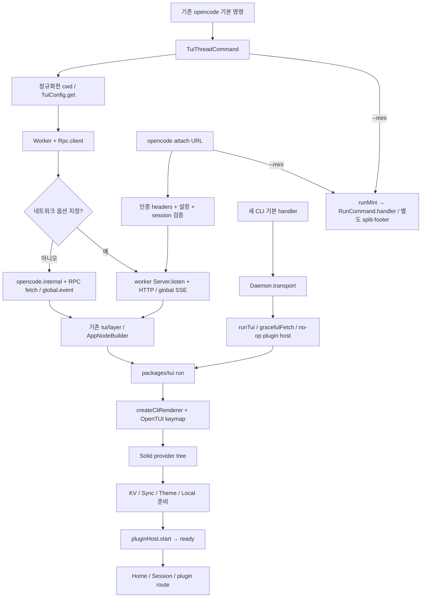
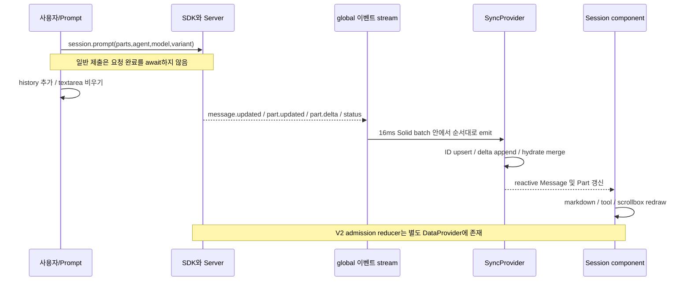

# OpenCode TUI 구현과 상호작용 분석

분석 기준은 `dev`의 **907b3bc518fa48e90e8ec24dd327d13eee71c36c**이다. 조사일은 2026-10-04(Asia/Seoul), 원본은 `/Users/yakisoba0728/Documents/GitHub/opencode`이다. `git rev-parse HEAD`로 커밋을 확인했고 checkout을 수정하지 않았다. 아래의 구현 설명은 이 커밋의 소스와 테스트를 정적으로 읽은 결과다. 실제 실행 검증은 마지막 절에 별도로 기록한다.

## 1. 먼저 확인해야 할 구조와 구현 상태

OpenCode의 기본 전체 화면 TUI는 **하나의 `packages/tui` 구현**을 두 CLI가 공유한다. 기존 `packages/opencode`는 yargs 명령과 worker/server를 관리하고, 새 `packages/cli`는 daemon의 인증된 transport를 확보한다. 두 host가 모두 `@opencode-ai/tui`의 `run`을 호출한다. 화면은 OpenTUI renderer 위에서 Solid의 reactive store와 component를 사용하는 방식이다. package root는 `app.tsx`의 `run`과 `TuiInput`만 재수출한다. [기존 CLI 진입점][entry-old], [새 CLI handler][entry-new], [패키지 root][tui-root].

이 공유 관계를 기능 동등성으로 해석하면 안 된다. 현재 새 CLI는 빈 설정을 resolve하고 plugin host의 `start`/`dispose`를 no-op으로 제공한다. 404인 기존 provider/config endpoint 네 개만 빈 응답으로 치환한다. 반면 기존 CLI는 설정 discovery와 실제 TUI plugin host를 주입한다. 새 CLI는 동일한 화면 코드를 실행하지만 provider 연결 화면으로 퇴화할 수 있고, host가 활성화해야 하는 builtin sidebar·tips·notifications·diff viewer 기능은 자동 활성화되지 않는다. 더 나아가 no-op host는 슬롯 registry도 초기화하지 않아 소스 경로상 Home Logo·Prompt와 Session 일반 Prompt의 슬롯 fallback도 반환되지 않는다. 이것은 실행 미검증인 정적 호출 경로 결론이다. 명세 Section 9의 provider 화면 제한만으로 이 차이를 전부 설명할 수는 없다. [새 CLI adapter][new-adapter], [초기 null 슬롯][slots], [Home fallback][home], [분리 명세의 새 CLI 상태][spec-cli].

또 다른 중요한 구분은 **SDK의 `v2` 디렉터리 이름과 새 SessionV2 API**이다. 기본 Prompt는 `sdk.client.session.prompt`와 `/session/{sessionID}/message`를 사용한다. 기본 Session 화면은 `useSync()`의 기존 `Message`/`Part`를 표시한다. 새 `/api/session/{sessionID}/prompt`의 durable admission, `delivery: steer|queue`, `resume`는 SDK에 있지만 기본 Prompt는 호출하지 않는다. V2 `DataProvider`도 실제 mount되나 `useData()`의 화면 측 호출자는 현재 자동완성뿐이다. 따라서 현재 TUI를 “V2 세션 UI로 완전히 전환했다”고 말할 근거는 없다. [기본 제출][prompt-submit], [기존 SDK prompt][sdk-prompt-old], [새 SDK prompt][sdk-prompt-new], [V2 상태 provider][data-refresh], [자동완성의 V2 data 사용][autocomplete].

`specs/tui-package.md`는 전체 10단계를 Completed로 표시하고 Core 의존성 제거와 host adapter 주입을 완료 기준으로 삼는다. 실제 커밋에는 `@opencode-ai/core`가 TUI의 직접 dependency이고 `Global`, `Flag`, installation version, `openUrl`, flock/which/glob 등이 import된다. `run` 자체가 `Global.Service`를 요구하며, 환경변수·process signal·Windows console·native audio도 TUI 내부에서 처리한다. **디렉터리 분리는 구현되어 있지만 명세의 의존성 경계는 현재 코드와 일치하지 않는다.** 원인은 Git 이력으로 추정하지 않았고, 현재 상태만 확인했다. [명세의 경계 요구][spec-boundary], [manifest][manifest], [renderer와 Global][render], [SDK의 Flag][sdk-events], [KV의 Core 사용][kv].

| 영역 | 실제 책임과 상태 |
|---|---|
| CLI host | 명령 parsing, 실행 directory, 기존 worker/HTTP 또는 새 daemon transport, 설정 discovery, 기존 plugin discovery/install/activation |
| `app.tsx` | Effect scope, OpenTUI renderer, keymap, Solid provider tree, route dispatch, global command, attention, 종료 출력 |
| `context/sdk.tsx` / `event.ts` | SDK client, custom event source 또는 global SSE, 이벤트 batching, metadata 전달 |
| `context/sync.tsx` | 기존 세션·message·part·승인·질문·provider·MCP·LSP·status 화면 store |
| `context/data.tsx` | V2 location catalog/resource와 새 session message event reducer. 기본 세션 화면과 제출로의 전환은 미완료 |
| `context/local.tsx` / `prompt/*` | agent/model 선택, 최근·favorite·variant, prompt history/stash/frecency 등 client-local 상태 |
| `routes/`, `component/`, `ui/` | home/session/plugin 화면, 대화상자, prompt textarea, scrollbox, markdown/diff/tool presentation |
| `plugin/`, `feature-plugins/` | presentation API, 등록 가능한 route/slot와 builtin 기능. 활성화 및 scoped lifecycle은 host가 담당 |

서버·SQLite·durable event 구현은 05-data-api가 주 담당이다. 이 보고서는 요청 형태, 이벤트 소비, UI의 기대 계약과 경합을 분석한다. 도구 권한 정책 및 filesystem placement는 02-tools, durable 실행/steer 정책은 01-engine, 설정 discovery와 외부 plugin loader는 06-extensions, CLI 배포와 parser/native asset bundling은 08-build-ops의 경계다.

## 2. CLI에서 첫 화면까지의 실제 호출 경로

### 2.1 기존 local-worker와 attach

루트 `bun dev`는 `packages/opencode/src/index.ts`로 진입하고 yargs가 `$0 [project]`인 `TuiThreadCommand`를 선택한다. `PWD`와 실제 cwd의 차이 및 symlink를 고려해 directory를 resolve하고 `process.chdir`한 뒤 worker를 생성한다. worker path는 compile-time `OPENCODE_WORKER_PATH`, dist worker.js, source worker.ts 순으로 선택한다. 현재 환경 전체를 worker에 전달한다. `--prompt`와 non-TTY stdin은 newline으로 합쳐 초기 prompt에 사용한다. [명령 등록][old-registration], [directory/worker/transport][old-worker].

네트워크 옵션이 없으면 `http://opencode.internal`은 실제 listen URL이 아니라 SDK용 base URL이다. custom fetch가 `Request`를 URL/method/headers/text body로 직렬화해 RPC `fetch`를 부르고 worker가 `Server.Default().app.fetch`에 전달한다. worker는 응답을 `.text()`로 전부 읽어 돌려준다. 이벤트는 응답 body의 streaming을 이용하지 않고 `GlobalBus → Rpc.emit("global.event") → EventSource.subscribe`로 따로 전달한다. 따라서 화면의 token streaming은 HTTP prompt 응답을 직접 그리는 방식이 아니다. [RPC transport][rpc-transport], [worker fetch와 GlobalBus][worker].

`--port`, `--hostname` 또는 mDNS가 선택되면 worker가 `Server.listen`을 실행하고 TUI는 실제 HTTP와 global SSE를 사용한다. `ServerAuth.headers`는 host가 만들며 worker 내부 fetch도 필요한 auth header를 보완한다. `attach`는 서버를 새로 만들지 않는다. `--dir`가 locally 존재하면 chdir하고, remote-only path면 그대로 server directory 값으로 전달한다. 둘 다 선택한 session을 SDK `session.get`으로 검증한 뒤 TUI를 시작한다. [local transport 선택][old-worker], [attach][attach], [session 검증][validate-session].

기존 명령은 TUI run 뒤 `finally`에서 idempotent `stop()`을 실행한다. `SIGUSR2` reload listener를 제거하고 worker `shutdown`에 최대 5초를 준 뒤 terminate한다. worker shutdown은 instance와 server를 정리한다. 단, 이 `finally`는 실제 TUI run을 둘러싼 범위다. worker 생성 이후 설정 로딩·session 검증 등 **run 이전 실패가 모두 같은 stop scope로 감싸져 있지는 않다**. 예컨대 validateSession catch의 return은 run의 finally 이전에 있다. 조기 실패의 자원 회수는 실행 검증하지 않은 확인 항목이다. [stop과 run 경계][old-cleanup].

### 2.2 새 CLI

새 CLI index는 명령별 handler를 lazy import하고 기본 handler만 TUI adapter를 import한다. `Daemon.transport()`는 기존 daemon의 상태/버전을 확인해 필요하면 detached `serve --register`를 spawn하고 인증 header를 반환한다. TUI는 그 서버에 attach하듯 연결되며, 종료할 때 daemon을 종료하는 hook은 `runTui`에 없다. 상세 daemon 관리와 배포는 08 범위다. [새 CLI index][new-index], [daemon transport][daemon].

`runTui`는 `TuiConfig.resolve({}, {terminalSuspend:false})`, `args:{}`, `gracefulFetch`, no-op plugin host를 준다. `gracefulFetch`는 `/config/providers`, `/provider`, `/agent`, `/config`의 **404만** fallback한다. 다른 endpoint 실패, auth 실패, 5xx에 대한 일반 호환 계층이 아니다. 공유 TUI `run`에는 두 CLI 모두 `AppNodeBuilder.build(Global.node)`를 제공한다. [adapter][new-adapter], [기존 Effect layer][legacy-layer].

### 2.3 renderer와 provider tree

`run`은 `Effect.scoped` 안에서 renderer와 keymap 등록을 acquire/release한다. 주요 옵션은 `externalOutputMode:passthrough`, target 60 FPS, `exitOnCtrlC:false`, Kitty keyboard, `autoFocus:false`, mouse capture다. Ctrl-C 처리와 prompt focus는 앱/keymap 쪽이 소유한다. palette 16색을 미리 요청하고 theme mode를 최대 1초 기다린 뒤 dark로 fallback한다. 실제 frame rate·터미널 latency를 측정한 값은 아니다. [renderer][render].

Provider의 중요한 의존 순서는 다음과 같다. 경로/터미널/시작값 → clipboard/keymap/args → KV → toast/route/config/plugin runtime → SDK → permission/project → Sync → Data → theme → Local → stash/dialog/frecency/history/prompt-ref/editor/location → App이다. `createSimpleContext`는 `init.ready`가 false일 때 children을 mount하지 않는다. KV의 파일 읽기, Sync의 blocking bootstrap, theme 준비가 하위 화면 생성을 gate한다. Local에는 top-level ready가 없어 즉시 context를 제공하고 model/session 파일 로딩의 ready를 따로 노출한다. Home 초기 자동 제출이 model.ready를 기다린다. route는 `home|session|plugin`이고 Solid store의 `reconcile`로 바꾸며 URL router나 browser history를 사용하지 않는다. [provider composition][providers], [ready gate][context-helper], [Local 반환값][local-return], [route][route].

App은 별도로 plugin host의 start promise가 settle할 때 `ready=true`를 만든다. reject는 log하고 기본 화면 진입을 허용하지만 **pending promise에는 timeout이 없다**. `StartupLoading`은 500ms 뒤 “Loading plugins…”를 표시하고 한번 보이면 최소 약 3초 유지한다. 명세의 “plugin 실패가 base TUI를 막지 않음”은 rejection에는 적용되나 모든 hang을 해결하는 계약은 아니다. [plugin startup][plugin-start], [loading 표시][startup-loading].

초기 `--agent`, `--model`, `--session`은 App의 onMount에서 적용된다. `--continue`는 Sync partial 이후 updated가 가장 최근인 parent session을 선택한다. `--session --fork`는 session-list hydrate가 새 session을 덮어쓰지 않도록 complete까지 기다린다. `--prompt` 자동 제출은 Home에서 Sync ready와 local model 준비 이후에 수행한다. [초기 route/선택][initial-selection], [fork 경합 회피][initial-fork], [Home 초기 prompt][home].

## 3. 서버 이벤트를 화면 상태로 만드는 방식

### 3.1 SDK와 event batching

SDKProvider는 모든 일반 요청에 사용할 AbortController와 SSE용 controller를 따로 가진다. host가 EventSource를 주면 그것을 구독하고, 없으면 `sdk.global.event`의 `/global/event` stream을 읽는다. EventSource 경로는 subscribe 완료 뒤 workspace sync start를 호출한다. SSE 경로는 stream 객체를 받은 뒤 sync.start를 await하고 그다음 for-await에 진입한다. 생성 SDK의 async generator는 첫 iteration에서 실제 fetch를 시작하므로, SSE 경로에서 “실제 구독 후 sync 시작”이라는 코드 주석의 의도를 정적으로 보장하지는 않는다. client directory는 SDK wrapper에서 header로 들어가고, GET/HEAD에는 query로 옮겨진다. `/api/*`는 `location[...]` query도 보완한다. 이 placement 변환은 SDK 계약이고 상세 server 해석은 05에서 확인할 부분이다. [SDK provider][sdk-events], [lazy SSE client][sdk-sse], [SDK placement wrapper][sdk-wrapper].

수신 이벤트는 FIFO queue에 넣고 최근 flush 이후 16ms 이내면 timer로 모은다. flush에서 한 번의 Solid `batch`로 모든 listener를 호출한다. 이것은 이벤트 순서를 유지하면서 연속 token delta가 만드는 reactive render 횟수를 줄이는 선택이다. byte/token 자체를 합치거나 이벤트를 drop하지 않는다. [16ms batching][sdk-batch].

SSE는 SDK의 내부 retry를 0으로 두고 TUI가 1초부터 30초까지 지수 backoff를 수행한다. 정상 stream 종료나 SDK SSE client가 오류를 처리하고 stream을 닫은 경우 모두 다시 client stream을 만든다. attempt는 연결마다 늘고 성공 이벤트로 reset되지 않는다. SDK SSE 구현은 한 client 내부에는 Last-Event-ID 상태를 보관하지만, TUI의 새 `global.event()` 호출마다 client를 새로 만들어 그 상태를 이어 넘기는 코드는 없다. TUI에 별도 event ID dedupe, gap detection, reconnect 후 자동 full rehydrate도 없다. 이것이 replay 신뢰성을 보장하는지는 server/bridge 계약을 함께 확인해야 한다. [TUI 재연결][sdk-reconnect], [생성 SSE client][sdk-sse].

`useEvent()`는 special `sync` payload만 제외하고 `{directory,workspace}` metadata와 함께 전달한다. **여기에는 project/directory/workspace 필터가 없다.** 소비자가 필요한 필터를 구현한다. App의 toast/command/select/session-error와 Sync의 branch 처리는 active workspace를 확인하지만 session/message/permission store는 주로 전역 session ID로 indexing한다. 양쪽을 동일한 scope filtering이라고 서술할 수 없다. [event adapter][event], [Sync event reducer][sync-events], [App workspace 필터][app-events].

### 3.2 기존 SyncProvider

Store는 `loading → partial → complete` 단계와 provider/config/agent/session 목록, `message[sessionID]`, `part[messageID]`, `permission[sessionID]`, `question[sessionID]`, todo/diff/status, MCP/LSP 등을 가진다. bootstrap에서 project path와 provider/config/agent를 blocking으로 받고, `--continue` 때만 session list도 blocking에 포함한다. command·LSP·MCP·resource·formatter·status·auth·VCS·workspace 등은 non-blocking 묶음에서 뒤이어 받는다. critical bootstrap 실패는 `exit(error)`로 renderer를 종료한다. 그 뒤 실행한 `void Promise.all`의 실패를 모두 같은 fatal catch가 처리한다고 보장할 수는 없다. [bootstrap][sync-bootstrap].

Session list 기본 범위는 현재 worktree 상대 path이고 최근 30일을 요청한다. local KV의 directory filter를 끄면 project scope다. ID 기준 정렬된 session 배열과 message의 created-time/ID tie-break, part ID 배열을 사용해 binary-search upsert한다. `session.status` 이벤트가 status map을 업데이트하지만 별도 `sync.session.status()` helper는 transcript 완료 여부로 working/idle을 추정한다. 이 둘은 다른 데이터다. [list 범위][sync-list], [message upsert][sync-message], [status helper][sync-status].

세션 route 진입은 `session.sync(id)`로 session/messages(limit 100)/todo/diff를 병렬 hydrate한다. 같은 ID의 in-flight Promise를 공유하고 성공한 세션은 fullSynced Set으로 다시 로딩하지 않는다. hydrate 동안 message/part 이벤트로 만져진 ID를 tracker에 기록해 늦은 REST 응답보다 live store를 우선한다. hydrate 전 이미 쌓인 text/reasoning이 있고 REST가 빈 text면 기존 text를 유지한다. live/hydrated merge 후에도 최신 100개 message만 보이고 탈락한 message의 part를 정리한다. 이는 **전체 transcript pagination이 아니라 고정된 최근 창**이다. [hydration merge][sync-hydrate].

`message.part.delta`는 part가 먼저 있어야 append한다. orphan delta는 buffering하지 않고 무시하며, hydrate tracker에도 존재하는 part에 대한 delta만 기록한다. `message.part.updated`는 전체 part를 reconcile한다. 서버가 start/update보다 delta를 먼저 보내거나 중복 delta를 보내는 경우의 복구는 TUI reducer 자체가 담당하지 않는다. 정상 순서와 재전달 여부는 05 경계 질문이다. [part reducer][sync-parts].

`permission.asked`는 normal mode이면 pending store에 추가한다. auto mode이면 해당 이벤트의 directory/workspace를 넣어 `permission.reply(once)`를 바로 호출한다. 모드 자체는 `--auto` 또는 local toggle로 정하며 backend permission policy를 편집하지 않는다. 질문은 별도 pending store에 들어가고 reply/reject event가 목록에서 제거한다. [승인 reducer][sync-permission], [local permission mode][permission-mode].

### 3.3 V2 DataProvider의 실제 범위

DataProvider의 location key는 `[directory,workspaceID]`를 JSON 문자열로 만든다. agent/command/integration/model/provider/reference/skill을 새 API로 읽고 catalog/integration/reference event에 맞춰 refresh한다. mount에서 `Promise.allSettled`로 기본 location catalog를 준비하며 실패 항목은 log한다. 기존 Sync와 독립된 store와 refresh 체계다. [V2 resources][data-refresh].

새 session message는 `user|assistant|shell|system|synthetic|compaction|agent-switched|model-switched` union이다. assistant content 안에 text/reasoning/tool을 넣고 explicit assistantMessageID/callID/textID를 찾아 delta와 tool progress/result를 반영한다. 새 메시지는 배열 앞에 prepend한다. tool은 pending string input → running structured input/content → completed/error 상태를 가진다. 실패는 pending 상태도 종료시키고 provider call/result metadata를 보존한다. [V2 message reducer][data-message], [V2 tool reducer][data-tools].

`session.next.prompt.admitted`는 의도적으로 아무 transcript message도 만들지 않고 `session.next.prompted`가 와야 user message를 만든다. 즉 durable inbox admission과 model-visible history를 구분한 reducer는 구현되어 있다. 그러나 기본 Session 화면이 이 배열을 표시하거나 Prompt가 delivery mode를 선택하는 UI는 없다. V2 permission/question list refresh는 존재하지만 해당 event의 asked/replied reducer도 이 switch에는 없다. V2 message REST refresh는 현재 배열을 교체하며 기존 Sync의 hydrate tracker와 100-message merge 보호를 공유하지 않는다. [admission 처리][data-admission], [V2 refresh][data-session], [admission 테스트][test-admission].

## 4. 입력, 키맵과 제출

### 4.1 keymap이 명령의 공통 기반이다

OpenTUI keymap에 timed leader, comma-separated binding과 alias, base-layout fallback, pending Esc clear/Backspace pop, managed textarea layer를 등록한다. 마지막으로 push된 mode가 `opencode.mode` data이고 layer의 mode는 이를 require한다. textarea binding은 현재 focus가 TextareaRenderable이며 일반 InputRenderable가 아닌 경우에만 적용한다. register의 cleanup은 layer와 mode stack을 해제한다. [mode stack과 등록][keymap].

App/Session/Prompt/plugin은 command를 keymap에 등록하고 UI는 동일한 reachable command를 사용한다. 팔레트는 `palette` namespace 중 hidden과 자기 자신을 제외하고, 빈 검색이면 suggested 항목을 앞에 추가한다. shortcut도 현재 등록 binding을 읽는다. 선택은 dialog clear 후 `dispatchCommand`이다. `/` 자동완성도 command의 slashName/slashAliases를 읽어 UI command를 만든다. 키를 재설정한 뒤에도 도움말·팔레트·slash가 이 등록을 공유하는 구조다. [팔레트][palette], [slash command 추출][keymap-slash].

기본 leader는 Ctrl+X, timeout은 2초다. keybind override는 string/object/array, false 또는 `none`을 받고 unknown override 이름은 오류다. Enter 제출, Shift/Ctrl/Alt+Enter 및 Ctrl+J 개행, Ctrl+C clear, Ctrl+V paste, Up/Down history, Tab/Shift+Tab agent, F2/Shift+F2 최근 model, Ctrl+T variant가 기본이다. suspend 미지원 host에서는 Ctrl+Z를 input undo에 추가한다. [기본 keybind][keybind-defaults], [config resolve][config].

normal Prompt는 Tab만 capture하고 autocomplete가 열리면 Escape/navigate/submit/Tab도 capture한다. shell mode는 capture를 비우고 `SHELL` status를 준다. App의 agent/model/palette binding은 base mode에만 있지만 session list/new/quick switch는 global layer여서 dialog/question/autocomplete mode에서도 유지된다. Ctrl+C는 초안이 있을 때 clear하고 focused prompt가 비어 있을 때 app exit binding이 허용된다. `DialogPrompt`의 submit은 priority 1로 textarea newline보다 form 동작을 우선한다. [traits][traits], [App keymap layer][app-keymap], [dialog submit][dialog-prompt].

Prompt는 textarea의 `plainText`와 `PromptInfo {input,mode?,parts}`를 연결한다. file·agent·축약 paste text의 표시 범위를 extmark ID→part index Map으로 추적한다. content change 시 source offset을 갱신하고 표시자가 삭제되면 part도 제거한다. textarea 높이는 최소 1행, 최대는 설정값 또는 `max(6, floor(terminalHeight/3))`다. 다중 행은 별도의 chat input model이 아니라 같은 textarea 안에서 유지된다. [Prompt 상태][prompt-state], [extmark 동기화][prompt-extmarks], [textarea][prompt-textarea].

### 4.2 자동완성과 첨부

자동완성은 slash가 입력 첫 위치에 있고 cursor 앞에 whitespace가 없을 때, 또는 시작/whitespace 다음의 `@` 뒤에 공백이 없을 때 열린다. 이메일의 `foo@bar`는 trigger가 아니다. `Intl.Segmenter`의 grapheme 단위와 `Bun.stringWidth`를 사용해 CJK/emoji를 처리하며 newline을 textarea offset 1로 센다. 자동완성 mode를 push하고 input 위에 최대 10행을 표시하며 anchor 위치는 50ms polling한다. [display offset][display], [자동완성 수명][autocomplete-lifecycle].

`@` 파일 검색은 V2 `fs.find(query, limit:"20", location)`를 사용한다. 파일에는 다시 fuzzy scoring하지 않고 backend 순위를 유지한다. 파일 외에는 visible non-primary agent, reference alias, MCP resource를 합치며 비파일 fuzzy filter와 slash description 검색을 적용한다. `#12`/`#12-20`은 file URL의 start/end query로 바꾼다. Enter는 선택, Tab은 directory일 때 하위 path로 확장한다. UI slash는 바로 dispatch하고 server command 선택은 `/name `만 넣어 뒤의 실제 제출을 기다린다. skill command는 이 목록에서 제외하고 skills dialog로 선택한다. [검색과 항목 구성][autocomplete], [정렬·선택][autocomplete-select].

선택한 file/agent는 표시자와 part를 만든다. 동일 file URL의 재선택은 기존 part의 source 범위를 바꾼다. 다만 이 분기는 새 extmark를 만든 뒤 Map 등록 이전에 return한다. 반복 mention에서 cursor·part·extmark가 어떻게 수렴하는지 실제 renderer 검증은 남았다. 비텍스트 첨부는 실제 이미지가 textarea에 표시되는 것이 아니라 `[Image N]` 등의 가상 표시자다. [mention 삽입][autocomplete-insert], [첨부 표시][prompt-attachments].

브래킷 paste는 OpenTUI paste bytes를 decode하고 CRLF/CR을 LF로 정규화한다. async 처리 전에 preventDefault하여 native paste 중복을 막는다. 빈 paste는 Windows Terminal image-only clipboard를 고려해 clipboard read command를 실행한다. clipboard의 image MIME은 attachment로, text는 경로인지 먼저 판별한다. 로컬 SVG는 원문 text, PNG/JPEG/WebP/AVIF/GIF/PDF는 data URL file part다. extension 기반 MIME 판별이며 HTTP(S)는 local read에서 제외한다. remote attach에서 이 파일 읽기는 **TUI가 실행되는 client 머신**에서 일어난다. [paste boundary][prompt-textarea], [local attachment][local-attachment], [첨부 처리][prompt-attachments].

3행 이상 또는 150자 초과 paste는 summary가 켜져 있으면 trim한 원문과 `[Pasted ~N lines]`로 저장한다. submit 때 extmark 범위를 뒤에서 앞으로 치환해 해당 occurrence의 원문을 복원하고 text part를 별도 전송에서 제외한다. copy hook은 표시자 값의 첫 occurrence를 string replace하는 방식이므로 submit의 range 기반 확장과 같은 알고리즘은 아니다. 설정은 server의 disable_paste_summary와 local KV override를 읽는다. [paste summary][paste-summary], [원문 확장][paste-expand].

### 4.3 submit와 abort

native textarea submit는 setTimeout을 두 번 거쳐 마지막 IME 조합 문자가 content change에 반영될 시간을 준다. `submitInner` 첫 단계도 `input.plainText`와 store가 다르면 재동기화한다. 코드 주석은 한글 IME를 명시한다. `submitting` boolean으로 전체 submitInner를 감싸 session/worktree 생성 await 중 중복 Enter를 막는다. 그러나 immutable input snapshot을 잡거나 textarea 편집을 disable하지는 않아서 생성 대기 중 초안 수정의 의미는 실행 확인 항목이다. [IME와 guard][submit-guard], [textarea submit][prompt-textarea].

disabled, workspace/move 생성, autocomplete 표시, 빈 입력, agent/model 부재를 검사한다. 연결되지 않은 workspace면 복구 dialog를 연다. **busy session status는 이 제출 검사에 포함되지 않는다.** busy 중 추가 입력 처리와 안전한 promotion 정책은 backend에 위임한다. 새 session일 때만 `session.create`를 await하고 `{error}` 결과가 오면 toast와 초안을 유지한다. 이 호출 자체의 thrown rejection을 같은 toast 경로로 처리하는 catch는 없다. [검사·생성][submit-create].

| 입력 | SDK 호출과 payload 특징 |
|---|---|
| shell mode | `session.shell`에 command/agent/model. 직후 normal mode로 돌아감 |
| server `/command` | 첫 줄의 name/arguments + 나머지 newline을 보존. file part만 첨부 |
| normal | `session.prompt`에 text/nonTextParts/agent/model/variant, pending IDE selection을 synthetic editor context part로 추가 |

세 호출은 모두 응답 완료를 기다리지 않고 history append, input/extmark clear, onSubmit을 수행한다. 일반 prompt rejection에는 toast가 있지만 자동 초안 복원은 없다. shell/command 응답의 error는 UI에서 확인하지 않는다. 새 session route는 주석에 temporary hack이라고 적힌 50ms timer로 바꾼다. 이 client behavior를 durable admission 성공 확인으로 혼동하면 안 된다. [전송과 후처리][prompt-submit].

Esc는 shell이면 normal mode로 돌아가고, autocomplete가 없으며 prompt focus인 상태에서 busy session에 대해 5초 안의 두 번째 Esc가 `session.abort`를 호출한다. abort 처리·provider interrupt의 세부 계약은 01 범위다. [중단 key][prompt-abort]. `session_queued_prompts` 기본 binding과 command map은 있지만 이 커밋 TUI source에서 실제 `session.queued_prompts` command 등록·관리 화면은 찾지 못했다. [queue binding 선언][queued-keybind].

### 4.4 history, stash, local persistence

history/stash/frecency는 `${state}` 아래 JSONL이고 세션·프로젝트별로 나누지 않는다. 각각 50/50/1,000 entry를 유지하며 invalid JSON line을 건너뛰고 mount에서 valid retained records를 rewrite한다. runtime schema validation까지 하는 것은 아니며 구조를 type cast한다. history는 전체 PromptInfo를 deep clone하고 연속으로 동일한 JSON인 경우만 dedupe한다. mode나 attachment가 다르면 다른 기록이다. Up/Down은 시작/끝 cursor에서만 history로 이동하고 autocomplete가 열리면 history layer는 꺼진다. trim한 초안이 20자 이상이거나 parts가 있으면 Ctrl+C로 지울 때도 history에 보관한다. [history][history], [history key·clear][history-input], [JSONL stash][stash].

명시적 stash는 input/parts/timestamp를 저장하고 **mode는 저장하지 않는다**. push 후 clear, pop은 LIFO, dialog 선택은 해당 entry를 제거해 복원하며 두 번 Ctrl+D로 삭제 확인한다. 이와 별개로 module-scoped `stashed`가 Prompt unmount의 draft/cursor를 다음 mount에 한 번 넘긴다. 이것은 session별 draft map이나 durable stash가 아니라 route/plugin remount 사이의 client 메모리 보존이다. [stash command][stash-command], [stash dialog][stash-dialog], [remount draft][prompt-remount].

KV는 `kv.json`을 flock 안에서 읽고 같은 프로세스의 writes를 Promise queue로 직렬화한다. 각 값 변경 때 전체 store snapshot을 임시 파일→rename으로 저장한다. model.json은 recent/favorite/variant를 저장하지만 agent별 현재 model map은 persist하지 않는다. frecency는 `frequency/(1+ageDays)`를 계산하지만 현재 file completion rank는 backend가 소유한다. remote session 상태와 이런 client-local preference의 영속 범위는 다르다. [KV][kv], [atomic persistence][persistence], [model persistence][local-model], [frecency][frecency].

## 5. 세션 화면과 승인·질문·전환

### 5.1 메시지, reasoning과 스크롤

Session은 route ID로 legacy Sync session/messages/parts를 읽고 LocationProvider에 session directory/workspace를 준다. transcript는 sticky-bottom ScrollBox 안에서 `For`로 message를 모두 렌더한다. route 내부의 virtualization은 없다. route 변경·입력 제출 때 bottom으로 이동하고, 이전/다음 메시지 명령은 nonsynthetic/nonignored text를 가진 실제 renderable의 위치를 찾는다. page command는 화면의 절반, half-page는 1/4을 움직인다. scroll acceleration이 켜지면 OpenTUI MacOSScrollAccel, 아니면 설정값 또는 speed 3을 사용한다. [세션 store와 위치][session-data], [scrollbox와 part 선택][session-render], [스크롤 command][session-scroll], [scroll acceleration][scroll].

AssistantMessage는 text/tool/reasoning을 선택한다. text는 OpenTUI markdown의 `streaming:true`, top-level block, grid table rendering을 사용한다. markdown parsing·width/wrap·terminal raster는 외부 OpenTUI의 책임이고 이 checkout의 호출 옵션까지만 조사했다. inline tool margin은 Yoga layout 이전 lifecycle pass에서 이전 sibling을 계산하고 frame별 WeakMap으로 캐시하여 sticky scroll geometry와 표시 간격을 맞춘다. [markdown][message-markdown], [inline layout][layout].

thinking은 KV에서 기본 hide이며 과거 `thinking_visibility` boolean/`minimal` 값을 migration한다. hide는 reasoning 삭제가 아니라 한 줄 Thought와 선택적 펼침이다. OpenAI summary의 bold 첫 블록은 제목으로 분리하고 `[REDACTED]` placeholder는 제거한다. reasoning 완료는 `time.end`로 판단한다. 텍스트 본문 및 tool 실패·pending 표시와 thinking mode는 독립된 선택이다. [thinking state][thinking], [reasoning renderer][reasoning].

사용자 메시지의 `QUEUED`는 마지막 완료 assistant 이후의 미완료 assistant index와 해당 user index를 비교한 **기존 transcript 휴리스틱**이다. durable `session_input.delivery`나 V2 admission event를 읽지 않는다. 표시 문구를 엔진의 steer/queue 정책과 동일시하면 안 된다. [pending 계산][session-data], [QUEUED 표시][queued-label].

선택은 OpenTUI renderer의 selection을 사용하며 일반 mouse-up이면 copy한다. disable-copy-on-select flag에서는 우클릭과 priority 1 keyboard intercept를 사용한다. selected renderable의 `getClipboardText`가 있으면 textarea paste placeholder 등을 실제 텍스트로 바꿀 수 있다. copy를 요청한 뒤 selection을 clear한다. 메시지 click dialog는 selection text가 있을 때 열지 않아 드래그 복사와 충돌하지 않는다. [선택 처리][selection], [App mouse handler][app-mouse], [message click][session-render].

copy/export는 화면 raster가 아니라 `formatTranscript`로 만든 Markdown이다. messages는 created/id로 정렬하고 part의 배열 순서는 유지한다. nonsynthetic text, optional reasoning/tool input·output·error, assistant metadata를 직렬화한다. export는 cwd 아래 파일 저장 또는 local editor로 열기를 제공한다. raw triple-backtick을 포함한 내용의 테스트는 문자열 assertion이며 Markdown parser 검증까지 의미하지 않는다. [transcript][transcript], [copy/export 호출][session-export].

### 5.2 도구와 diff

ToolPart는 SDK wire name whitelist renderer에 dispatch하고 unknown tool은 generic fallback이다. backend Tool 구현을 직접 import하지 않는다. **현재 기본 화면은 기존 `part.state.metadata`를 읽는다.** V2 structured metadata용 `toolDisplayMetadata` helper는 정의·테스트는 있지만 runtime caller를 찾지 못했다. showDetails=false는 completed tool을 숨기고 pending/error까지 모두 없애지 않는다. [tool dispatch][tool-dispatch], [wire name fallback][tool-fallback], [metadata helper][tool-metadata].

| 표시 종류 | 구현과 제한 |
|---|---|
| generic | output 기본 숨김, 펼침 preview는 3행 및 content width 기반 문자 제한 |
| bash | running metadata.output을 ANSI 제거 후 표시, 기본 10행 preview, 완료 output 포함 |
| read/grep/glob | 파일·검색 경로와 counts/loaded 정보를 metadata에서 읽어 inline 상태를 구성 |
| edit/apply_patch | OpenTUI diff; auto에서 content width 120 초과면 split, stacked면 unified, syntax/wrap 설정 적용 |
| task | child session을 sync하고 tool/status/retry/background/duration을 표시; child route로 이동 |
| execute | metadata.toolCalls를 한 tool 안에 나열하는 별도 렌더; metadata.error 시 제한된 output |
| diagnostics | record guard 후 severity 1 오류 최대 3개 |

위 preview는 backend tool output truncation 정책과 별개인 화면 축약이다. `collapseToolOutput`은 Unicode code point를 기준으로 제한하고 실제 terminal cell width와 같지는 않다. nested metadata guard는 존재하지만 모든 unknown 입력에 대한 전면 schema validator가 아니다. [generic][tool-generic], [bash][tool-bash], [task/execute][tool-task], [edit/patch][tool-diff], [diagnostics][tool-diagnostics].

별도 DiffViewer는 builtin plugin의 `diff` route와 `/diff` command다. 이전 route를 보관하고 돌아갈 수 있다. last-turn은 legacy session.diff, git/branch는 vcs.diff(directory, context 12)를 요청한다. 파일 트리는 32열, 남은 pane 100열 이상에서 split 가능하고 file/hunk navigation은 renderable geometry를 읽는다. reviewed filename은 local review 상태이며 diff 변경 시 reset된다. view/filetree/single-patch 설정은 KV로 보관한다. [diff 요청][diff-fetch], [diff plugin 등록][diff-register], [diff layout][diff-layout].

정적 확인 중 error UI의 조건 순서도 보았다. no-files Match가 error Match보다 앞서므로 최초 요청 실패에서 files가 비어 있으면 “No diff”를 표시할 가능성이 있다. 이는 실행 확인하지 않은 UI 경로 추론이며 확정 회귀로 분류하지 않았다. [diff 상태 분기][diff-state].

### 5.3 승인과 질문

parent Session은 자신과 child session의 pending permission/question을 함께 모은다. child 화면은 이 목록을 비우고 SubagentFooter를 표시한다. bottom 영역은 permission 우선 → permission이 없으면 question → 정상 prompt 순서다. 이 위치 교체는 도구가 기다리는 동안 사용자 입력의 목적을 명확히 바꾸는 선택이다. [요청 수집][session-data], [bottom UI 선택][session-bottom].

PermissionPrompt는 callID로 tool 입력을 연결하고 once/always/reject와 fullscreen preview를 제공한다. always에는 별도 확인이 있고 문구는 재시작 전까지의 UX를 설명한다. child 거절 feedback도 있다. 기본 승인 단계의 Escape/app.exit는 reject에 연결되지만 always 확인이나 거절 사유 입력 단계에서는 cancel하여 원래 승인 단계로 돌아간다. 적용 범위와 rule persistence 자체는 backend 권한 계약이며 UI 문구만으로 결론내리지 않았다. [승인 UI][permission-ui], [승인 keymap][permission-keys].

QuestionPrompt는 단일 nonmultiple 선택이면 즉시 reply하고 여러 질문이면 review/confirm tab을 둔다. multi-select와 custom answer를 지원하며 unanswered 항목은 빈 배열로 제출할 수 있다. reply/reject는 대체로 `void` SDK 호출이며 UI의 busy/retry/error 상태보다 server event에 따른 pending 목록 제거에 의존한다. question reply가 directory만 넣고 permission reply는 workspace도 넣는 차이는 placement 교차 확인 항목이다. [질문 답변][question-ui], [질문 review][question-review].

### 5.4 agent/model/session/workspace 전환

Local agent 목록은 visible이며 subagent-only가 아닌 agent다. `@agent` completion은 visible이며 primary-only가 아닌 agent를 사용한다. all-mode agent는 양쪽에 올 수 있다. 현재 session의 마지막 user message에서 agent/model/variant를 복원하되 CLI agent override는 유지한다. model 선택은 agent별 메모리 선택 → agent 지정 model → CLI/config/recent/provider default fallback이다. variant는 provider/model별 지원 목록을 확인해 저장하며 model dialog는 favorite/recent/provider 그룹과 Free 우선·release date 순서를 사용한다. [local selection][local-selection], [model dialog][model-dialog], [Prompt session 복원][prompt-session-selection].

provider “connected” 표시는 transport health 검사가 아니다. opencode 외 provider가 있거나 opencode 유료 model이 있으면 true인 onboarding 휴리스틱이다. provider dialog는 server auth method와 conditional prompt를 읽어 API/OAuth code/auto로 분기한다. 성공하면 `instance.dispose → sync.bootstrap → model dialog`로 이동한다. custom provider는 자격증명 저장과 별도 config 필요를 구분한다. org switch는 switchable count>1 때 보이고 dispose event에 의한 재bootstrap을 기대한다. skill/resource 실패는 locked inline error, MCP toggle은 한 작업씩 수행하고 status를 refresh하며 실패는 console에 남긴다. [connected helper][connected], [provider 연결][provider-dialog], [org][org-dialog], [MCP][mcp-dialog], [skill 실패][skill-dialog].

Session picker는 root browse 최대 100/search 30, 150ms debounce를 사용하고 pending/failed resource에서는 cache를 유지한다. current/pinned session을 보강하며 삭제는 두 번 확인한다. timeline/message dialog는 fork, redo/revert, prompt 재사용·copy를 SDK로 연결한다. revert boundary 뒤 messages는 화면에서 숨기고 변경 파일 요약과 redo를 표시한다. [session picker][session-picker], [timeline/message action][message-dialog], [revert 표시][session-revert].

workspace warp는 experimental flag로 제한되지만 project directory `/move`는 같은 flag 없이 등록한다. 새 세션용 warp 선택은 prompt의 local signal에, `/move` 선택은 Home destination에 보관해 session.create에 전달한다. 기존 warp는 workspace.warp → workspace.set → Sync bootstrap → noReply synthetic directory reminder → workspace/session 목록 refresh 순서다. `/move`는 VCS 변경을 확인하고 controlPlane.moveSession을 await한 다음 기존 promptAsync로 reminder를 보낸다. 이 함수가 직접 동일한 bootstrap을 수행하지는 않으며 moved 이벤트의 directory 갱신과 Session의 재조회 효과가 별도로 연결된다. 새 git worktree는 V2 projectCopy.create를 사용하고 목록은 V2 copy refresh + 기존 project.directories를 혼합한다. copy 삭제는 force=false 후 forceRequired인 경우 변경 파일 확인을 거쳐 force=true로 재요청한다. UI 자체가 filesystem 이동의 원자성을 보장하는 것은 아니다. [warp][workspace-warp], [warp 선택 상태][prompt-workspace], [move][prompt-move], [copy 목록·삭제][move-dialog].

### 5.5 `--mini`는 별도 split-footer 구현이다

기본 TUI/attach의 `--mini`는 공유 `packages/tui/run`을 호출하지 않고 `runMini → RunCommand.handler`로 간다. attach/resume는 runInteractiveMode, 새 local mini는 runInteractiveLocalMode다. 별도의 OpenTUI renderer를 `screenMode:split-footer`, footerHeight 4, stdout capture, mouse false로 생성한다. footer 안에서 공유 keymap을 사용해 prompt/status/permission/question/model/subagent/queued menu를 repaint하지만 transcript는 터미널 scrollback에 append한다. [mini 진입][mini-entry], [mini renderer][mini-renderer], [mini footer][mini-footer].

진행 part의 StreamCommit을 microtask에서 합치고 Promise chain으로 scrollback append를 직렬화한다. retained Text/Code/Markdown surface는 진행 중 text/code의 마지막 행을 보류하고 markdown의 stable block까지만 확정한다. 완료 시 나머지를 settle/commit하고 surface를 destroy한다. resize replay도 별도 reset/replay 경로다. 이것은 기본 Session의 reactive scrollbox와 다른 출력 모델이며 **mini queued 메뉴의 존재를 기본 TUI queue UI의 증거로 사용할 수 없다.** [stream commit][mini-commit], [직렬 drain][mini-commit-drain], [scrollback surface][mini-surface], [mini resize][mini-runtime].

이 mini 추가 조사에서는 진입/renderer/footer/scrollback와 대표 테스트만 표본으로 읽었다. runtime.queue·transport engine·footer 하위 editor/permission/question 구현 전체는 이번 04 담당 경로 밖의 추가 범위이므로 완독하지 않았다. coverage에 이 제한을 명시하며 CLI 운영은 08에 연결한다.

## 6. 플러그인, 테마와 터미널 수명

### 6.1 화면 API와 host lifecycle

`createPluginRuntime`은 reactive command/status 목록, route registry와 Slot façade를 만든다. route는 이름별 등록 stack의 마지막 항목이 이기고 disposer를 호출하면 이전 등록이 다시 드러난다. public API는 command compatibility shim, keymap/mode, route/dialog, event, SDK, KV, theme, attention, state와 실제 `CliRenderer`를 제공한다. 화면 state getter가 반환하는 배열을 모두 deep copy하여 격리하는 API는 아니다. 여기서 command API의 v1 호환은 SessionV1/V2 전환과 다른 계약이다. [presentation runtime][plugin-runtime], [route stack과 기본 API][plugin-api], [공개 타입][plugin-types], [command shim][plugin-command].

`createTuiApi` 자체의 lifecycle signal/onDispose는 placeholder다. 기존 CLI host가 plugin별 AbortController와 cleanup stack을 가진 scoped API로 감싸야 실제 해제 계약이 생긴다. keymap/event/mode/route/slot/sound-pack 등록 disposer를 자동 추적하며 slot 등록 ID는 plugin ID와 증가 suffix를 사용한다. builtin 뒤 external을 순차 활성화하고 초기화 실패 시 rollback한다. dispose는 역순이며 플러그인별 모든 cleanup callback을 합쳐 기본 5초의 총예산을 주고 오류를 기록한다. 이 범위의 설치·discovery·manifest/config 변경은 06이 주 담당이다. [scoped lifecycle][plugin-scope], [등록 추적][plugin-register], [load/dispose][plugin-host].

**슬롯 초기화는 단순한 plugin 장식 이상의 요구사항이다.** `createSlots()`의 처음 view는 `() => null`이어서 children fallback도 표시하지 않는다. legacy host의 `setupSlots(api)`가 OpenTUI Solid registry와 실제 Slot view를 설치해야 Home의 Logo/Prompt 및 Session의 일반 Prompt가 표시되는 경로가 열린다. 새 CLI의 no-op host에는 이 호출이 없다. 따라서 소스상 builtin 누락뿐 아니라 기본 입력 슬롯도 비어 있는 상태이며 실제 터미널 실행은 확인하지 않았다. 승인·질문은 슬롯 바깥이므로 모든 입력 UI가 사라진다는 뜻은 아니다. [슬롯 초기화][slots], [legacy setup][plugin-setup], [Session bottom][session-bottom], [새 adapter][new-adapter].

cleanup timeout을 startup timeout으로 읽어서도 안 된다. legacy host의 dispose는 먼저 초기화 `loaded` promise를 await하고 나서 cleanup 예산을 적용한다. 따라서 plugin start가 영원히 pending이면 startup ready뿐 아니라 TUI Effect scope 완료도 막을 수 있다. renderer/audio/SIGHUP 등의 정리가 일부 이루어졌더라도 scope 뒤 input flush, 기존 명령의 worker stop·Windows guard restore까지 도달하는 시간은 이 경로에서 보장되지 않는다. 이 결론은 정적 수명 추적이며 hang을 주입한 실행 테스트 결과가 아니다. [start gate][plugin-start], [loaded 대기][plugin-host], [앱 finalizer와 scope 후 처리][render], [host finally][old-cleanup].

### 6.2 builtin 기능

기존 host가 등록하는 builtin은 12개다. home footer/tips, sidebar context/MCP/LSP/Todo/files/footer, notifications, plugin manager, which-key, diff viewer다. `experimentalEventSystem` 옵션은 현재 builtin 배열 선택에 쓰이지 않는다. which-key는 자체 기본 비활성이고 나머지는 host 기본 활성이다. [builtin 목록][builtins], [which-key 기본값][which-key].

sidebar는 Sync의 token/cost, MCP/LSP 상태, 미완료 Todo, 파일 diff 증감을 presentation slot에 넣는다. notifications는 permission/question request ID를 dedupe하고 resolved 이벤트로 제거한다. busy/retry에서 idle로 바뀌면 완료를 알리고 error 뒤의 idle 완료 알림을 억제한다. child session은 sound-only이며 같은 session.error 재수신 자체를 모두 dedupe하지는 않는다. plugin manager는 enable toggle, local/global 설치 scope와 설치 후 runtime add를 제공한다. which-key는 현재 keymap mode/sequence의 다음 key를 dock/overlay로 표시하고 layout을 KV에 저장한다. [sidebar][sidebar-context], [notification reducer][notifications], [plugin 관리 화면][plugin-manager], [which-key][which-key].

### 6.3 theme, markdown parser와 terminal state

theme는 palette JSON → reference/mode resolver → RGBA 값 → SyntaxStyle 순으로 변환된다. registry 우선순위는 builtin < plugin < custom < generated system이다. root schema 검사는 얕고 누락·순환 reference는 resolver에서 예외가 된다. config/KV theme 선택과 mode lock, renderer theme mode 및 초기 mode가 적용된다. system theme는 renderer의 16색 palette와 밝기 계산을 사용하며 terminal background에 alpha 0을 허용한다. [theme registry/resolver][theme-core], [system theme][theme-system], [theme context][theme-context].

custom theme discovery는 global config부터 cwd `.opencode`, 그 부모, filesystem root 순이다. 같은 basename은 나중 항목이 덮어쓰므로 현재 구현에서는 부모의 theme가 더 가까운 directory의 theme를 덮을 수 있다. `THEME_MODE`/OSC 통지와 SIGUSR2 refresh가 theme cache와 palette를 갱신하고 timer/listener는 cleanup한다. 이전 native SyntaxStyle은 renderer idle 이후 destroy한다. theme picker는 선택 중 preview하고 확정하지 않고 닫으면 원래 선택으로 복원한다. [discovery 순서][theme-discovery], [refresh/style 수명][theme-context], [theme picker][theme-picker].

Session module import에서 `addDefaultParsers`를 등록한다. Markdown/JavaScript/TypeScript 등은 OpenTUI builtin을 사용하고 다른 문법은 WASM/query URL을 지정한다. grammar release가 고정된 항목과 달리 query URL 다수는 `master`를 가리킨다. HTML injection은 TODO로 비활성이다. 이 커밋 고정이 외부 parser 다운로드 내용까지 고정하지는 않는다. parser 번들·native library·audio asset의 배포 결과는 08 교차 확인 항목이다. [등록][parser-registration], [parser 설정][parsers].

renderer destroy helper는 이미 destroy됐더라도 terminal title을 빈 문자열로 설정한다. 이전 title 복원은 구현하지 않는다. SIGHUP은 renderer를 destroy해 Deferred를 완료시키고 scoped finalizer를 진행시킨다. 기본 renderer/keymap/plugin/audio 수명과 종료 후 stderr reason/exitCode 및 stdout epilogue가 연결된다. non-Windows suspend는 process group에 SIGTSTP를 보내고 SIGCONT에 renderer를 resume한다. [title helper][renderer-destroy], [앱 자원 수명][render], [suspend][terminal-suspend].

Windows에서는 kernel32 FFI로 processed input을 끄고 setRawMode wrapper, 즉시 재적용과 100ms poll로 Ctrl-C guard를 유지한다. 기존 TUI 명령의 outer finally가 원래 console mode를 복원한다. 앱도 renderer 생성 후 processed input을 끄며 input buffer flush는 Effect scope 완료 뒤다. 실제 Windows console/ConPTY 실행은 확인하지 않았다. [Windows guard][windows], [기존 guard 범위][old-cleanup], [앱 순서][render].

### 6.4 clipboard, 외부 editor와 attention

clipboard write는 OSC52와 native clipboard를 함께 시도한다. tmux에서는 normal/passthrough, screen에서는 passthrough escape를 쓰고 native 경로는 macOS osascript, Wayland wl-copy, X11 xclip/xsel, Windows PowerShell, clipboardy fallback이다. read는 OS별 PNG를 먼저 시도하고 text로 fallback한다. 대부분의 native 실패는 삼켜지므로 resolve를 clipboard 갱신의 엄격한 성공 증거로 볼 수는 없다. remote attach에서도 이것은 client 머신의 clipboard다. [clipboard 구현][clipboard], [clipboard context][clipboard-context].

외부 editor는 VISUAL → EDITOR 순으로 고르고 임시 Markdown 파일을 만든 뒤 renderer suspend → spawn → 파일 read를 수행한다. finally에서 파일 삭제/resume/requestRender를 처리한다. prompt의 축약 paste text 확장과 attachment 위치 재계산은 별도 Prompt 경로다. IDE selection은 env port 또는 `~/.claude/ide` lock에서 연결 대상을 고른다. 변수명에 SSE가 있어도 실제 transport는 WebSocket JSON-RPC다. session directory에 따라 재연결하며 실패는 1초부터 최대 10초 backoff, Zed는 1초 poll이다. Zed adapter는 read-only SQLite의 editor/selection/contents를 읽고 UTF-8 byte offset을 JS 문자열과 1-based 행/열로 변환한다. client-local IDE 내부 schema에 의존하는 부분이다. [외부 editor와 lock discovery][editor], [IDE context][editor-context], [Zed adapter][editor-zed].

attention 전체는 기본 비활성이다. notifications/sound 항목 자체의 기본값은 true이고 volume은 0.4다. 활성화되면 focus 정책에 따라 notification 기본 blurred/sound always를 적용하고 ANSI/control 문자를 제거하며 title/message 길이를 제한한다. sound 후보는 config override → active sound pack → builtin이다. audio는 필요할 때 만드는 singleton과 파일별 load Promise cache를 사용하며 실패는 null로 기억한다. app finalizer가 audio dispose와 cache clear를 실행한다. 여섯 sound 역할에 MP3를 import하며 default와 done은 같은 파일을 사용한다. [attention defaults][attention-config], [focus/notification/sound 정책][attention], [builtin asset][attention-assets], [audio 수명][audio].

## 7. 테스트에서 확인한 것과 실행 검증

이 조사에서는 원본 repository의 Bun test/typecheck와 실제 전체 화면 TUI를 실행하지 않았다. 일반 PATH 및 확인한 `~/.bun/bin` 등에 Bun이 없고 root와 TUI `node_modules`도 없었다. 공용 checkout에 dependency를 설치하지 않았으며 실제 provider 호출도 하지 않았다. OpenTUI native renderer의 terminal protocol 처리, 플랫폼 clipboard/audio 및 실제 remote server 호환은 정적 확인 범위다.

별도로 독립 temporary directory에 **production source 7개를 그대로 복사**하고 Node v26.9.0의 TypeScript stripping으로 직접 import했다. `runtime.tsx`는 JSX가 없는 내용이므로 임시 복사본 이름만 `.ts`로 바꾸었다. home 경계 축약, nested model ID/fallback, tool output newline/Unicode 제한, malformed structured metadata 방어, prompt capture traits, default session title, exit epilogue를 **18개 assertion으로 실행하여 모두 통과**했다. 임시 환경은 정리했다. 이는 Bun suite 통과·Solid/OpenTUI 렌더 통과를 뜻하지 않으며, `toolDisplayMetadata` 같은 V2 표시 helper가 기본 route에서 사용된다는 증거도 아니다.

| 테스트 묶음 | 읽어서 확인한 검증 대상 | 이 조사에서 실행 |
|---|---|---|
| `app-lifecycle.test.tsx`, `util/renderer.test.ts` | SIGHUP, title clear, plugin dispose 1회, epilogue 출력 순서, fatal startup의 exitCode. test renderer와 mock 사용 | 미실행 |
| `runtime/config/keymap` | immutable paths, config validation/defaults, suspend-disabled undo, keyboard mode/capture와 binding restoration | 미실행 |
| `sync-live-hydration.test.tsx` | live created-time 정렬, stale hydration 대비, orphan delta, hydrate 전 text 보존, 100개 창, hydrate 중 삭제 | 미실행 |
| `sync.test.tsx`, `use-event.test.tsx` | path/project list query와 workspace branch filter, global metadata 전달 | 미실행 |
| `cli/tui/data.test.tsx` | V2 resource refresh, tool 실패 정리, admission과 visible prompt 구분, context message ID | 미실행 |
| `prompt/*`, `prompt-submit-race` | Unicode display offset, paste expansion, local attachment, persistence/history/stash, submission guard | 미실행 |
| diff/file-tree/inline-tool snapshot | source 선택, route return, hunk/file navigation, wrapping·pending spacer·sticky bottom geometry | 미실행 |
| plugin/theme/clipboard/editor/attention | slot replacement/fallback, route registration, theme merge, platform helper, focus/sound/notification lifecycle | 미실행 |
| 기존 CLI `thread/attach` | lazy TUI integration, worker env forwarding, cwd/symlink와 mini 옵션 parsing | 미실행 |
| mini renderer/footer/scrollback 대표 테스트 | split-footer 수명, stable text/markdown commit, resize replay, queued menu. 추가 범위 표본 | 미실행 |
| 위 7 production pure modules | 실제 source 함수에 대한 18 assertion | **통과** |

두 테스트의 검증 범위에는 특히 주의가 필요하다. `prompt-submit-race.test.ts`는 production Prompt를 import하지 않고 guard 형태를 복제한 harness를 사용하므로 IME/renderer/network 경합 전체를 검증하지 않는다. `sync-undefined-messages.test.tsx`는 500 응답을 `/session/{id}/messages`에 설정하지만 현재 generated SDK의 `messages()` URL은 단수 `/session/{id}/message`다. 의도한 500 branch에 도달하는지 실행 확인 없이 회귀가 충분히 검증된 것으로 셀 수 없다. 구현에는 `(messages.data ?? [])` fallback이 실제 존재한다. [submit harness][test-submit-race], [오류 응답 fixture][test-undefined], [실제 messages URL][sdk-messages-old], [hydration fallback][sync-hydrate].

Diff file-tree의 한 hierarchical rendering case는 `test.skip`이며 pure tree-utils 테스트와 나머지 rendering 테스트가 별개다. mini footer-view 테스트에는 Bun crash 관련 주석과 다섯 개의 skipped case도 있다. 따라서 파일 존재나 테스트 개수를 실행 coverage로 해석하지 않았다. permission/question의 실제 UI reply flow, default 새 CLI의 완전한 세션 생성→입력→stream 결과, reconnect replay 복구, native clipboard/audio/Windows console을 모두 검증하는 end-to-end 실행 증거는 이번 조사에서 확보하지 못했다. [mini skip 근거][mini-test-skip].

## 8. 설계 제약과 남은 질문

| 관찰한 사실 | 해석 또는 남은 확인 |
|---|---|
| 기존/새 CLI가 renderer와 Session component를 공유한다 | host 차이로 설정·builtin plugin·provider 데이터 가용성이 달라진다. 코드 공유와 제품 기능 동등성은 별개다 |
| 새 CLI no-op host가 Slot registry를 setup하지 않는다 | 초기 Slot은 null view여서 Logo/Prompt fallback도 반환하지 않는다. 실제 새 CLI 화면 확인 필요 |
| TUI root가 Core/Global/Flag/process에 의존한다 | 분리 명세의 완료 상태만으로 독립 SDK-only 패키지라고 판단하면 안 된다 |
| 기본 submit/display는 기존 API, V2 Data는 부분 연결 | 기본 TUI의 durable admission/steer/queue 전환과 V2 permission/question 화면은 구현되어 있지 않다 |
| SDK event batch는 16ms, renderer target는 60FPS | 성능 목표이며 실제 frame time·token latency·memory bound 측정값은 아니다 |
| existing hydrate는 live delta를 보존하며 최신 100개로 제한한다 | 전체 history browsing·pagination UI를 제공하는 것은 아니다 |
| SSE 재연결에 explicit cursor/dedupe/gap recovery가 없다 | server replay 및 EventV2 bridge의 ordering 계약에 기대는 영역. 05 교차 확인 필요 |
| 제출을 곧바로 history에 넣고 입력을 비운다 | 일반 prompt HTTP 실패 후 입력 복구/retry는 UI가 자동 제공하지 않는다 |
| plugin startup rejection은 복구하지만 pending에는 timeout이 없다 | dispose도 loaded를 먼저 기다린다. cleanup의 5초 예산이 startup hang과 scope 종료까지 보장하지는 않는다 |
| local history/model/KV와 server project/session path는 다르다 | remote attach의 파일/선택/clipboard는 client-local 기능, server workspace 경로는 wire placement다 |
| tool renderer는 wire name과 unknown record를 해석한다 | backend implementation import는 제거되었으나 metadata shape의 안정성과 malformed nested data는 지속 확인할 계약이다 |

교차 영역 질문은 다음과 같다. 각각 추정으로 결론내리지 않았다.

1. **05-data-api:** `/global/event`의 reconnect gap·중복·start-before-delta 순서를 어떤 contract로 보장하는가? 기존 event bridge가 새 V2 event를 어떻게 기존 Message/Part projection으로 노출하는가? TUI에는 cursor 전달/negative project filter가 없어 server stream의 scope가 중요하다.
2. **01-engine/05-data-api:** 기존 `session.prompt` endpoint가 이 commit에서 실제로 어떤 실행 엔진을 사용하는가? durable inbox를 사용하는 backend compatibility가 있다 해도, TUI가 직접 `delivery`/admission state를 노출한다고 볼 수는 없다.
3. **02-tools/05-data-api:** legacy question reply가 permission reply와 달리 workspace를 명시하지 않는 경로의 placement는 session ID/request ID로 충분한가? prompt 이동 시 copy/move와 directory reminder의 원자성은 어떤 계층이 책임지는가?
4. **06-extensions:** 명세의 injected host 방향과 현재 Core/환경변수 직접 사용 중 어느 것이 향후 소유 경계인가? 외부 plugin start hang, route/slot 등록 실패 시 host cleanup 보장과 builtin enable 상태의 저장 계약은 무엇인가?
5. **08-build-ops:** 새 daemon에 기존 endpoint compatibility가 어느 수준까지 제공되는가? 새 CLI의 no-op plugin host는 의도한 임시 제한인지, production parity 요구가 있는지? parser worker/grammar/audio native library의 실제 standalone embedding 결과는 무엇인가?

조사 경로와 asset/생성물/제외 범위의 정확한 목록은 [04-tui.coverage.json](./04-tui.coverage.json)에 기록한다. theme JSON은 runtime loading과 대표 schema를 확인하고 색상 palette 전체를 각각 평가하지 않았다. generated SDK는 TUI가 사용하는 endpoint·SSE·placement wrapper를 추적하는 범위만 읽었다. OpenTUI dependency 내부(native raster/terminal parser/Yoga)는 이 checkout의 source가 아니므로 구현 전체를 감사하지 않았다.

[app-events]: https://github.com/anomalyco/opencode/blob/907b3bc518fa48e90e8ec24dd327d13eee71c36c/packages/tui/src/app.tsx#L987-L1032
[app-keymap]: https://github.com/anomalyco/opencode/blob/907b3bc518fa48e90e8ec24dd327d13eee71c36c/packages/tui/src/app.tsx#L964-L985
[app-mouse]: https://github.com/anomalyco/opencode/blob/907b3bc518fa48e90e8ec24dd327d13eee71c36c/packages/tui/src/app.tsx#L1090-L1107
[attach]: https://github.com/anomalyco/opencode/blob/907b3bc518fa48e90e8ec24dd327d13eee71c36c/packages/opencode/src/cli/cmd/attach.ts#L63-L146
[attention]: https://github.com/anomalyco/opencode/blob/907b3bc518fa48e90e8ec24dd327d13eee71c36c/packages/tui/src/attention.ts#L69-L258
[attention-assets]: https://github.com/anomalyco/opencode/blob/907b3bc518fa48e90e8ec24dd327d13eee71c36c/packages/tui/src/attention.ts#L17-L22
[attention-config]: https://github.com/anomalyco/opencode/blob/907b3bc518fa48e90e8ec24dd327d13eee71c36c/packages/tui/src/config/index.tsx#L115-L121
[audio]: https://github.com/anomalyco/opencode/blob/907b3bc518fa48e90e8ec24dd327d13eee71c36c/packages/tui/src/audio.ts#L7-L53
[autocomplete]: https://github.com/anomalyco/opencode/blob/907b3bc518fa48e90e8ec24dd327d13eee71c36c/packages/tui/src/component/prompt/autocomplete.tsx#L27-L474
[autocomplete-insert]: https://github.com/anomalyco/opencode/blob/907b3bc518fa48e90e8ec24dd327d13eee71c36c/packages/tui/src/component/prompt/autocomplete.tsx#L172-L278
[autocomplete-lifecycle]: https://github.com/anomalyco/opencode/blob/907b3bc518fa48e90e8ec24dd327d13eee71c36c/packages/tui/src/component/prompt/autocomplete.tsx#L109-L717
[autocomplete-select]: https://github.com/anomalyco/opencode/blob/907b3bc518fa48e90e8ec24dd327d13eee71c36c/packages/tui/src/component/prompt/autocomplete.tsx#L476-L641
[builtins]: https://github.com/anomalyco/opencode/blob/907b3bc518fa48e90e8ec24dd327d13eee71c36c/packages/tui/src/feature-plugins/builtins.ts#L1-L36
[clipboard]: https://github.com/anomalyco/opencode/blob/907b3bc518fa48e90e8ec24dd327d13eee71c36c/packages/tui/src/clipboard.ts#L23-L125
[clipboard-context]: https://github.com/anomalyco/opencode/blob/907b3bc518fa48e90e8ec24dd327d13eee71c36c/packages/tui/src/context/clipboard.tsx#L1-L18
[config]: https://github.com/anomalyco/opencode/blob/907b3bc518fa48e90e8ec24dd327d13eee71c36c/packages/tui/src/config/index.tsx#L21-L127
[connected]: https://github.com/anomalyco/opencode/blob/907b3bc518fa48e90e8ec24dd327d13eee71c36c/packages/tui/src/component/use-connected.tsx#L4-L11
[context-helper]: https://github.com/anomalyco/opencode/blob/907b3bc518fa48e90e8ec24dd327d13eee71c36c/packages/tui/src/context/helper.tsx#L3-L25
[daemon]: https://github.com/anomalyco/opencode/blob/907b3bc518fa48e90e8ec24dd327d13eee71c36c/packages/cli/src/services/daemon.ts#L66-L141
[data-admission]: https://github.com/anomalyco/opencode/blob/907b3bc518fa48e90e8ec24dd327d13eee71c36c/packages/tui/src/context/data.tsx#L152-L175
[data-message]: https://github.com/anomalyco/opencode/blob/907b3bc518fa48e90e8ec24dd327d13eee71c36c/packages/tui/src/context/data.tsx#L80-L264
[data-refresh]: https://github.com/anomalyco/opencode/blob/907b3bc518fa48e90e8ec24dd327d13eee71c36c/packages/tui/src/context/data.tsx#L464-L565
[data-session]: https://github.com/anomalyco/opencode/blob/907b3bc518fa48e90e8ec24dd327d13eee71c36c/packages/tui/src/context/data.tsx#L416-L451
[data-tools]: https://github.com/anomalyco/opencode/blob/907b3bc518fa48e90e8ec24dd327d13eee71c36c/packages/tui/src/context/data.tsx#L266-L343
[dialog-prompt]: https://github.com/anomalyco/opencode/blob/907b3bc518fa48e90e8ec24dd327d13eee71c36c/packages/tui/src/ui/dialog-prompt.tsx#L28-L47
[diff-fetch]: https://github.com/anomalyco/opencode/blob/907b3bc518fa48e90e8ec24dd327d13eee71c36c/packages/tui/src/feature-plugins/system/diff-viewer.tsx#L114-L130
[diff-layout]: https://github.com/anomalyco/opencode/blob/907b3bc518fa48e90e8ec24dd327d13eee71c36c/packages/tui/src/feature-plugins/system/diff-viewer.tsx#L38-L186
[diff-register]: https://github.com/anomalyco/opencode/blob/907b3bc518fa48e90e8ec24dd327d13eee71c36c/packages/tui/src/feature-plugins/system/diff-viewer.tsx#L1045-L1077
[diff-state]: https://github.com/anomalyco/opencode/blob/907b3bc518fa48e90e8ec24dd327d13eee71c36c/packages/tui/src/feature-plugins/system/diff-viewer.tsx#L766-L783
[display]: https://github.com/anomalyco/opencode/blob/907b3bc518fa48e90e8ec24dd327d13eee71c36c/packages/tui/src/prompt/display.ts#L1-L48
[editor]: https://github.com/anomalyco/opencode/blob/907b3bc518fa48e90e8ec24dd327d13eee71c36c/packages/tui/src/editor.ts#L26-L100
[editor-context]: https://github.com/anomalyco/opencode/blob/907b3bc518fa48e90e8ec24dd327d13eee71c36c/packages/tui/src/context/editor.ts#L114-L318
[editor-zed]: https://github.com/anomalyco/opencode/blob/907b3bc518fa48e90e8ec24dd327d13eee71c36c/packages/tui/src/editor-zed.ts#L41-L179
[entry-new]: https://github.com/anomalyco/opencode/blob/907b3bc518fa48e90e8ec24dd327d13eee71c36c/packages/cli/src/commands/handlers/default.ts#L6-L13
[entry-old]: https://github.com/anomalyco/opencode/blob/907b3bc518fa48e90e8ec24dd327d13eee71c36c/packages/opencode/src/cli/cmd/tui.ts#L269-L300
[event]: https://github.com/anomalyco/opencode/blob/907b3bc518fa48e90e8ec24dd327d13eee71c36c/packages/tui/src/context/event.ts#L9-L29
[frecency]: https://github.com/anomalyco/opencode/blob/907b3bc518fa48e90e8ec24dd327d13eee71c36c/packages/tui/src/prompt/frecency.tsx#L10-L77
[history]: https://github.com/anomalyco/opencode/blob/907b3bc518fa48e90e8ec24dd327d13eee71c36c/packages/tui/src/prompt/history.tsx#L9-L108
[history-input]: https://github.com/anomalyco/opencode/blob/907b3bc518fa48e90e8ec24dd327d13eee71c36c/packages/tui/src/component/prompt/index.tsx#L862-L1286
[home]: https://github.com/anomalyco/opencode/blob/907b3bc518fa48e90e8ec24dd327d13eee71c36c/packages/tui/src/routes/home.tsx#L45-L84
[initial-fork]: https://github.com/anomalyco/opencode/blob/907b3bc518fa48e90e8ec24dd327d13eee71c36c/packages/tui/src/app.tsx#L529-L544
[initial-selection]: https://github.com/anomalyco/opencode/blob/907b3bc518fa48e90e8ec24dd327d13eee71c36c/packages/tui/src/app.tsx#L480-L527
[keybind-defaults]: https://github.com/anomalyco/opencode/blob/907b3bc518fa48e90e8ec24dd327d13eee71c36c/packages/tui/src/config/keybind.ts#L8-L200
[keymap]: https://github.com/anomalyco/opencode/blob/907b3bc518fa48e90e8ec24dd327d13eee71c36c/packages/tui/src/keymap.tsx#L53-L243
[keymap-slash]: https://github.com/anomalyco/opencode/blob/907b3bc518fa48e90e8ec24dd327d13eee71c36c/packages/tui/src/keymap.tsx#L260-L289
[kv]: https://github.com/anomalyco/opencode/blob/907b3bc518fa48e90e8ec24dd327d13eee71c36c/packages/tui/src/context/kv.tsx#L12-L61
[layout]: https://github.com/anomalyco/opencode/blob/907b3bc518fa48e90e8ec24dd327d13eee71c36c/packages/tui/src/util/layout.ts#L1-L25
[legacy-layer]: https://github.com/anomalyco/opencode/blob/907b3bc518fa48e90e8ec24dd327d13eee71c36c/packages/opencode/src/cli/tui/layer.ts#L1-L8
[local-attachment]: https://github.com/anomalyco/opencode/blob/907b3bc518fa48e90e8ec24dd327d13eee71c36c/packages/tui/src/component/prompt/local-attachment.ts#L14-L47
[local-model]: https://github.com/anomalyco/opencode/blob/907b3bc518fa48e90e8ec24dd327d13eee71c36c/packages/tui/src/context/local.tsx#L164-L245
[local-return]: https://github.com/anomalyco/opencode/blob/907b3bc518fa48e90e8ec24dd327d13eee71c36c/packages/tui/src/context/local.tsx#L533-L540
[local-selection]: https://github.com/anomalyco/opencode/blob/907b3bc518fa48e90e8ec24dd327d13eee71c36c/packages/tui/src/context/local.tsx#L77-L405
[manifest]: https://github.com/anomalyco/opencode/blob/907b3bc518fa48e90e8ec24dd327d13eee71c36c/packages/tui/package.json#L1-L70
[mcp-dialog]: https://github.com/anomalyco/opencode/blob/907b3bc518fa48e90e8ec24dd327d13eee71c36c/packages/tui/src/component/dialog-mcp.tsx#L21-L84
[message-dialog]: https://github.com/anomalyco/opencode/blob/907b3bc518fa48e90e8ec24dd327d13eee71c36c/packages/tui/src/routes/session/dialog-message.tsx#L24-L105
[message-markdown]: https://github.com/anomalyco/opencode/blob/907b3bc518fa48e90e8ec24dd327d13eee71c36c/packages/tui/src/routes/session/index.tsx#L1686-L1705
[mini-commit]: https://github.com/anomalyco/opencode/blob/907b3bc518fa48e90e8ec24dd327d13eee71c36c/packages/opencode/src/cli/cmd/run/footer.ts#L531-L563
[mini-commit-drain]: https://github.com/anomalyco/opencode/blob/907b3bc518fa48e90e8ec24dd327d13eee71c36c/packages/opencode/src/cli/cmd/run/footer.ts#L1112-L1127
[mini-entry]: https://github.com/anomalyco/opencode/blob/907b3bc518fa48e90e8ec24dd327d13eee71c36c/packages/opencode/src/cli/cmd/run.ts#L880-L1009
[mini-footer]: https://github.com/anomalyco/opencode/blob/907b3bc518fa48e90e8ec24dd327d13eee71c36c/packages/opencode/src/cli/cmd/run/footer.view.tsx#L630-L943
[mini-renderer]: https://github.com/anomalyco/opencode/blob/907b3bc518fa48e90e8ec24dd327d13eee71c36c/packages/opencode/src/cli/cmd/run/runtime.lifecycle.ts#L176-L199
[mini-runtime]: https://github.com/anomalyco/opencode/blob/907b3bc518fa48e90e8ec24dd327d13eee71c36c/packages/opencode/src/cli/cmd/run/runtime.ts#L504-L535
[mini-surface]: https://github.com/anomalyco/opencode/blob/907b3bc518fa48e90e8ec24dd327d13eee71c36c/packages/opencode/src/cli/cmd/run/scrollback.surface.ts#L149-L330
[mini-test-skip]: https://github.com/anomalyco/opencode/blob/907b3bc518fa48e90e8ec24dd327d13eee71c36c/packages/opencode/test/cli/run/footer.view.test.tsx#L717-L746
[model-dialog]: https://github.com/anomalyco/opencode/blob/907b3bc518fa48e90e8ec24dd327d13eee71c36c/packages/tui/src/component/dialog-model.tsx#L19-L155
[move-dialog]: https://github.com/anomalyco/opencode/blob/907b3bc518fa48e90e8ec24dd327d13eee71c36c/packages/tui/src/component/dialog-move-session.tsx#L73-L279
[new-adapter]: https://github.com/anomalyco/opencode/blob/907b3bc518fa48e90e8ec24dd327d13eee71c36c/packages/cli/src/tui.ts#L7-L37
[new-index]: https://github.com/anomalyco/opencode/blob/907b3bc518fa48e90e8ec24dd327d13eee71c36c/packages/cli/src/index.ts#L1-L32
[notifications]: https://github.com/anomalyco/opencode/blob/907b3bc518fa48e90e8ec24dd327d13eee71c36c/packages/tui/src/feature-plugins/system/notifications.ts#L9-L85
[old-cleanup]: https://github.com/anomalyco/opencode/blob/907b3bc518fa48e90e8ec24dd327d13eee71c36c/packages/opencode/src/cli/cmd/tui.ts#L221-L305
[old-registration]: https://github.com/anomalyco/opencode/blob/907b3bc518fa48e90e8ec24dd327d13eee71c36c/packages/opencode/src/index.ts#L75-L87
[old-worker]: https://github.com/anomalyco/opencode/blob/907b3bc518fa48e90e8ec24dd327d13eee71c36c/packages/opencode/src/cli/cmd/tui.ts#L189-L258
[org-dialog]: https://github.com/anomalyco/opencode/blob/907b3bc518fa48e90e8ec24dd327d13eee71c36c/packages/tui/src/component/dialog-console-org.tsx#L32-L129
[palette]: https://github.com/anomalyco/opencode/blob/907b3bc518fa48e90e8ec24dd327d13eee71c36c/packages/tui/src/component/command-palette.tsx#L15-L78
[parser-registration]: https://github.com/anomalyco/opencode/blob/907b3bc518fa48e90e8ec24dd327d13eee71c36c/packages/tui/src/routes/session/index.tsx#L80-L87
[parsers]: https://github.com/anomalyco/opencode/blob/907b3bc518fa48e90e8ec24dd327d13eee71c36c/packages/tui/src/parsers-config.ts#L1-L167
[paste-expand]: https://github.com/anomalyco/opencode/blob/907b3bc518fa48e90e8ec24dd327d13eee71c36c/packages/tui/src/prompt/part.ts#L8-L29
[paste-summary]: https://github.com/anomalyco/opencode/blob/907b3bc518fa48e90e8ec24dd327d13eee71c36c/packages/tui/src/component/prompt/index.tsx#L1149-L1222
[permission-keys]: https://github.com/anomalyco/opencode/blob/907b3bc518fa48e90e8ec24dd327d13eee71c36c/packages/tui/src/routes/session/permission.tsx#L403-L627
[permission-mode]: https://github.com/anomalyco/opencode/blob/907b3bc518fa48e90e8ec24dd327d13eee71c36c/packages/tui/src/context/permission.tsx#L5-L26
[permission-ui]: https://github.com/anomalyco/opencode/blob/907b3bc518fa48e90e8ec24dd327d13eee71c36c/packages/tui/src/routes/session/permission.tsx#L111-L190
[persistence]: https://github.com/anomalyco/opencode/blob/907b3bc518fa48e90e8ec24dd327d13eee71c36c/packages/tui/src/util/persistence.ts#L22-L33
[plugin-api]: https://github.com/anomalyco/opencode/blob/907b3bc518fa48e90e8ec24dd327d13eee71c36c/packages/tui/src/plugin/api.ts#L11-L51
[plugin-command]: https://github.com/anomalyco/opencode/blob/907b3bc518fa48e90e8ec24dd327d13eee71c36c/packages/tui/src/plugin/command-shim.ts#L85-L108
[plugin-host]: https://github.com/anomalyco/opencode/blob/907b3bc518fa48e90e8ec24dd327d13eee71c36c/packages/opencode/src/plugin/tui/runtime.ts#L1029-L1124
[plugin-manager]: https://github.com/anomalyco/opencode/blob/907b3bc518fa48e90e8ec24dd327d13eee71c36c/packages/tui/src/feature-plugins/system/plugins.tsx#L180-L261
[plugin-register]: https://github.com/anomalyco/opencode/blob/907b3bc518fa48e90e8ec24dd327d13eee71c36c/packages/opencode/src/plugin/tui/runtime.ts#L388-L467
[plugin-runtime]: https://github.com/anomalyco/opencode/blob/907b3bc518fa48e90e8ec24dd327d13eee71c36c/packages/tui/src/plugin/runtime.tsx#L1-L34
[plugin-scope]: https://github.com/anomalyco/opencode/blob/907b3bc518fa48e90e8ec24dd327d13eee71c36c/packages/opencode/src/plugin/tui/runtime.ts#L143-L199
[plugin-setup]: https://github.com/anomalyco/opencode/blob/907b3bc518fa48e90e8ec24dd327d13eee71c36c/packages/opencode/src/plugin/tui/runtime.ts#L1049-L1066
[plugin-start]: https://github.com/anomalyco/opencode/blob/907b3bc518fa48e90e8ec24dd327d13eee71c36c/packages/tui/src/app.tsx#L390-L422
[plugin-types]: https://github.com/anomalyco/opencode/blob/907b3bc518fa48e90e8ec24dd327d13eee71c36c/packages/plugin/src/tui.ts#L581-L625
[prompt-abort]: https://github.com/anomalyco/opencode/blob/907b3bc518fa48e90e8ec24dd327d13eee71c36c/packages/tui/src/component/prompt/index.tsx#L393-L421
[prompt-attachments]: https://github.com/anomalyco/opencode/blob/907b3bc518fa48e90e8ec24dd327d13eee71c36c/packages/tui/src/component/prompt/index.tsx#L1224-L1269
[prompt-extmarks]: https://github.com/anomalyco/opencode/blob/907b3bc518fa48e90e8ec24dd327d13eee71c36c/packages/tui/src/component/prompt/index.tsx#L658-L734
[prompt-move]: https://github.com/anomalyco/opencode/blob/907b3bc518fa48e90e8ec24dd327d13eee71c36c/packages/tui/src/component/prompt/move.tsx#L18-L183
[prompt-remount]: https://github.com/anomalyco/opencode/blob/907b3bc518fa48e90e8ec24dd327d13eee71c36c/packages/tui/src/component/prompt/index.tsx#L615-L633
[prompt-session-selection]: https://github.com/anomalyco/opencode/blob/907b3bc518fa48e90e8ec24dd327d13eee71c36c/packages/tui/src/component/prompt/index.tsx#L311-L333
[prompt-state]: https://github.com/anomalyco/opencode/blob/907b3bc518fa48e90e8ec24dd327d13eee71c36c/packages/tui/src/component/prompt/index.tsx#L284-L299
[prompt-submit]: https://github.com/anomalyco/opencode/blob/907b3bc518fa48e90e8ec24dd327d13eee71c36c/packages/tui/src/component/prompt/index.tsx#L1026-L1146
[prompt-textarea]: https://github.com/anomalyco/opencode/blob/907b3bc518fa48e90e8ec24dd327d13eee71c36c/packages/tui/src/component/prompt/index.tsx#L1345-L1443
[prompt-workspace]: https://github.com/anomalyco/opencode/blob/907b3bc518fa48e90e8ec24dd327d13eee71c36c/packages/tui/src/component/prompt/workspace.tsx#L22-L93
[provider-dialog]: https://github.com/anomalyco/opencode/blob/907b3bc518fa48e90e8ec24dd327d13eee71c36c/packages/tui/src/component/dialog-provider.tsx#L94-L469
[providers]: https://github.com/anomalyco/opencode/blob/907b3bc518fa48e90e8ec24dd327d13eee71c36c/packages/tui/src/app.tsx#L245-L350
[question-review]: https://github.com/anomalyco/opencode/blob/907b3bc518fa48e90e8ec24dd327d13eee71c36c/packages/tui/src/routes/session/question.tsx#L459-L479
[question-ui]: https://github.com/anomalyco/opencode/blob/907b3bc518fa48e90e8ec24dd327d13eee71c36c/packages/tui/src/routes/session/question.tsx#L14-L125
[queued-keybind]: https://github.com/anomalyco/opencode/blob/907b3bc518fa48e90e8ec24dd327d13eee71c36c/packages/tui/src/config/keybind.ts#L102-L309
[queued-label]: https://github.com/anomalyco/opencode/blob/907b3bc518fa48e90e8ec24dd327d13eee71c36c/packages/tui/src/routes/session/index.tsx#L1364-L1452
[reasoning]: https://github.com/anomalyco/opencode/blob/907b3bc518fa48e90e8ec24dd327d13eee71c36c/packages/tui/src/routes/session/index.tsx#L1586-L1648
[render]: https://github.com/anomalyco/opencode/blob/907b3bc518fa48e90e8ec24dd327d13eee71c36c/packages/tui/src/app.tsx#L186-L365
[renderer-destroy]: https://github.com/anomalyco/opencode/blob/907b3bc518fa48e90e8ec24dd327d13eee71c36c/packages/tui/src/util/renderer.ts#L1-L6
[route]: https://github.com/anomalyco/opencode/blob/907b3bc518fa48e90e8ec24dd327d13eee71c36c/packages/tui/src/context/route.tsx#L6-L53
[rpc-transport]: https://github.com/anomalyco/opencode/blob/907b3bc518fa48e90e8ec24dd327d13eee71c36c/packages/opencode/src/cli/cmd/tui.ts#L24-L64
[scroll]: https://github.com/anomalyco/opencode/blob/907b3bc518fa48e90e8ec24dd327d13eee71c36c/packages/tui/src/util/scroll.ts#L1-L27
[sdk-batch]: https://github.com/anomalyco/opencode/blob/907b3bc518fa48e90e8ec24dd327d13eee71c36c/packages/tui/src/context/sdk.tsx#L48-L80
[sdk-events]: https://github.com/anomalyco/opencode/blob/907b3bc518fa48e90e8ec24dd327d13eee71c36c/packages/tui/src/context/sdk.tsx#L1-L151
[sdk-messages-old]: https://github.com/anomalyco/opencode/blob/907b3bc518fa48e90e8ec24dd327d13eee71c36c/packages/sdk/js/src/v2/gen/sdk.gen.ts#L3706-L3739
[sdk-prompt-new]: https://github.com/anomalyco/opencode/blob/907b3bc518fa48e90e8ec24dd327d13eee71c36c/packages/sdk/js/src/v2/gen/sdk.gen.ts#L5620-L5655
[sdk-prompt-old]: https://github.com/anomalyco/opencode/blob/907b3bc518fa48e90e8ec24dd327d13eee71c36c/packages/sdk/js/src/v2/gen/sdk.gen.ts#L3742-L3794
[sdk-reconnect]: https://github.com/anomalyco/opencode/blob/907b3bc518fa48e90e8ec24dd327d13eee71c36c/packages/tui/src/context/sdk.tsx#L82-L117
[sdk-sse]: https://github.com/anomalyco/opencode/blob/907b3bc518fa48e90e8ec24dd327d13eee71c36c/packages/sdk/js/src/v2/gen/core/serverSentEvents.gen.ts#L80-L239
[sdk-wrapper]: https://github.com/anomalyco/opencode/blob/907b3bc518fa48e90e8ec24dd327d13eee71c36c/packages/sdk/js/src/v2/client.ts#L18-L92
[selection]: https://github.com/anomalyco/opencode/blob/907b3bc518fa48e90e8ec24dd327d13eee71c36c/packages/tui/src/util/selection.ts#L26-L77
[session-bottom]: https://github.com/anomalyco/opencode/blob/907b3bc518fa48e90e8ec24dd327d13eee71c36c/packages/tui/src/routes/session/index.tsx#L1296-L1333
[session-data]: https://github.com/anomalyco/opencode/blob/907b3bc518fa48e90e8ec24dd327d13eee71c36c/packages/tui/src/routes/session/index.tsx#L187-L249
[session-export]: https://github.com/anomalyco/opencode/blob/907b3bc518fa48e90e8ec24dd327d13eee71c36c/packages/tui/src/routes/session/index.tsx#L917-L1019
[session-picker]: https://github.com/anomalyco/opencode/blob/907b3bc518fa48e90e8ec24dd327d13eee71c36c/packages/tui/src/component/dialog-session-list.tsx#L24-L344
[session-render]: https://github.com/anomalyco/opencode/blob/907b3bc518fa48e90e8ec24dd327d13eee71c36c/packages/tui/src/routes/session/index.tsx#L1180-L1291
[session-revert]: https://github.com/anomalyco/opencode/blob/907b3bc518fa48e90e8ec24dd327d13eee71c36c/packages/tui/src/routes/session/index.tsx#L1122-L1265
[session-scroll]: https://github.com/anomalyco/opencode/blob/907b3bc518fa48e90e8ec24dd327d13eee71c36c/packages/tui/src/routes/session/index.tsx#L750-L875
[sidebar-context]: https://github.com/anomalyco/opencode/blob/907b3bc518fa48e90e8ec24dd327d13eee71c36c/packages/tui/src/feature-plugins/sidebar/context.tsx#L1-L65
[skill-dialog]: https://github.com/anomalyco/opencode/blob/907b3bc518fa48e90e8ec24dd327d13eee71c36c/packages/tui/src/component/dialog-skill.tsx#L19-L68
[slots]: https://github.com/anomalyco/opencode/blob/907b3bc518fa48e90e8ec24dd327d13eee71c36c/packages/tui/src/plugin/slots.tsx#L25-L64
[spec-boundary]: https://github.com/anomalyco/opencode/blob/907b3bc518fa48e90e8ec24dd327d13eee71c36c/specs/tui-package.md#L16-L31
[spec-cli]: https://github.com/anomalyco/opencode/blob/907b3bc518fa48e90e8ec24dd327d13eee71c36c/specs/tui-package.md#L484-L490
[startup-loading]: https://github.com/anomalyco/opencode/blob/907b3bc518fa48e90e8ec24dd327d13eee71c36c/packages/tui/src/component/startup-loading.tsx#L5-L52
[stash]: https://github.com/anomalyco/opencode/blob/907b3bc518fa48e90e8ec24dd327d13eee71c36c/packages/tui/src/prompt/stash.tsx#L9-L86
[stash-command]: https://github.com/anomalyco/opencode/blob/907b3bc518fa48e90e8ec24dd327d13eee71c36c/packages/tui/src/component/prompt/index.tsx#L736-L798
[stash-dialog]: https://github.com/anomalyco/opencode/blob/907b3bc518fa48e90e8ec24dd327d13eee71c36c/packages/tui/src/component/dialog-stash.tsx#L17-L86
[submit-create]: https://github.com/anomalyco/opencode/blob/907b3bc518fa48e90e8ec24dd327d13eee71c36c/packages/tui/src/component/prompt/index.tsx#L947-L1024
[submit-guard]: https://github.com/anomalyco/opencode/blob/907b3bc518fa48e90e8ec24dd327d13eee71c36c/packages/tui/src/component/prompt/index.tsx#L930-L959
[sync-bootstrap]: https://github.com/anomalyco/opencode/blob/907b3bc518fa48e90e8ec24dd327d13eee71c36c/packages/tui/src/context/sync.tsx#L451-L551
[sync-events]: https://github.com/anomalyco/opencode/blob/907b3bc518fa48e90e8ec24dd327d13eee71c36c/packages/tui/src/context/sync.tsx#L177-L448
[sync-hydrate]: https://github.com/anomalyco/opencode/blob/907b3bc518fa48e90e8ec24dd327d13eee71c36c/packages/tui/src/context/sync.tsx#L594-L667
[sync-list]: https://github.com/anomalyco/opencode/blob/907b3bc518fa48e90e8ec24dd327d13eee71c36c/packages/tui/src/context/sync.tsx#L134-L174
[sync-message]: https://github.com/anomalyco/opencode/blob/907b3bc518fa48e90e8ec24dd327d13eee71c36c/packages/tui/src/context/sync.tsx#L321-L359
[sync-parts]: https://github.com/anomalyco/opencode/blob/907b3bc518fa48e90e8ec24dd327d13eee71c36c/packages/tui/src/context/sync.tsx#L376-L430
[sync-permission]: https://github.com/anomalyco/opencode/blob/907b3bc518fa48e90e8ec24dd327d13eee71c36c/packages/tui/src/context/sync.tsx#L184-L265
[sync-status]: https://github.com/anomalyco/opencode/blob/907b3bc518fa48e90e8ec24dd327d13eee71c36c/packages/tui/src/context/sync.tsx#L584-L593
[terminal-suspend]: https://github.com/anomalyco/opencode/blob/907b3bc518fa48e90e8ec24dd327d13eee71c36c/packages/tui/src/app.tsx#L852-L887
[test-admission]: https://github.com/anomalyco/opencode/blob/907b3bc518fa48e90e8ec24dd327d13eee71c36c/packages/tui/test/cli/tui/data.test.tsx#L373-L436
[test-submit-race]: https://github.com/anomalyco/opencode/blob/907b3bc518fa48e90e8ec24dd327d13eee71c36c/packages/tui/test/cli/tui/prompt-submit-race.test.ts#L1-L98
[test-undefined]: https://github.com/anomalyco/opencode/blob/907b3bc518fa48e90e8ec24dd327d13eee71c36c/packages/tui/test/cli/cmd/tui/sync-undefined-messages.test.tsx#L15-L42
[theme-context]: https://github.com/anomalyco/opencode/blob/907b3bc518fa48e90e8ec24dd327d13eee71c36c/packages/tui/src/context/theme.tsx#L114-L331
[theme-core]: https://github.com/anomalyco/opencode/blob/907b3bc518fa48e90e8ec24dd327d13eee71c36c/packages/tui/src/theme/index.ts#L95-L298
[theme-discovery]: https://github.com/anomalyco/opencode/blob/907b3bc518fa48e90e8ec24dd327d13eee71c36c/packages/tui/src/context/theme.tsx#L37-L60
[theme-picker]: https://github.com/anomalyco/opencode/blob/907b3bc518fa48e90e8ec24dd327d13eee71c36c/packages/tui/src/component/dialog-theme-list.tsx#L17-L46
[theme-system]: https://github.com/anomalyco/opencode/blob/907b3bc518fa48e90e8ec24dd327d13eee71c36c/packages/tui/src/theme/index.ts#L353-L467
[thinking]: https://github.com/anomalyco/opencode/blob/907b3bc518fa48e90e8ec24dd327d13eee71c36c/packages/tui/src/context/thinking.ts#L8-L61
[tool-bash]: https://github.com/anomalyco/opencode/blob/907b3bc518fa48e90e8ec24dd327d13eee71c36c/packages/tui/src/routes/session/index.tsx#L2046-L2103
[tool-diagnostics]: https://github.com/anomalyco/opencode/blob/907b3bc518fa48e90e8ec24dd327d13eee71c36c/packages/tui/src/routes/session/index.tsx#L2692-L2706
[tool-diff]: https://github.com/anomalyco/opencode/blob/907b3bc518fa48e90e8ec24dd327d13eee71c36c/packages/tui/src/routes/session/index.tsx#L2390-L2517
[tool-dispatch]: https://github.com/anomalyco/opencode/blob/907b3bc518fa48e90e8ec24dd327d13eee71c36c/packages/tui/src/routes/session/index.tsx#L1709-L1789
[tool-fallback]: https://github.com/anomalyco/opencode/blob/907b3bc518fa48e90e8ec24dd327d13eee71c36c/packages/tui/src/routes/session/index.tsx#L2626-L2645
[tool-generic]: https://github.com/anomalyco/opencode/blob/907b3bc518fa48e90e8ec24dd327d13eee71c36c/packages/tui/src/routes/session/index.tsx#L1798-L1833
[tool-metadata]: https://github.com/anomalyco/opencode/blob/907b3bc518fa48e90e8ec24dd327d13eee71c36c/packages/tui/src/util/tool-display.ts#L7-L13
[tool-task]: https://github.com/anomalyco/opencode/blob/907b3bc518fa48e90e8ec24dd327d13eee71c36c/packages/tui/src/routes/session/index.tsx#L2215-L2388
[traits]: https://github.com/anomalyco/opencode/blob/907b3bc518fa48e90e8ec24dd327d13eee71c36c/packages/tui/src/prompt/traits.ts#L15-L28
[transcript]: https://github.com/anomalyco/opencode/blob/907b3bc518fa48e90e8ec24dd327d13eee71c36c/packages/tui/src/util/transcript.ts#L26-L114
[tui-root]: https://github.com/anomalyco/opencode/blob/907b3bc518fa48e90e8ec24dd327d13eee71c36c/packages/tui/src/index.tsx#L1
[validate-session]: https://github.com/anomalyco/opencode/blob/907b3bc518fa48e90e8ec24dd327d13eee71c36c/packages/opencode/src/cli/tui/validate-session.ts#L7-L29
[which-key]: https://github.com/anomalyco/opencode/blob/907b3bc518fa48e90e8ec24dd327d13eee71c36c/packages/tui/src/feature-plugins/system/which-key.tsx#L532-L607
[windows]: https://github.com/anomalyco/opencode/blob/907b3bc518fa48e90e8ec24dd327d13eee71c36c/packages/tui/src/terminal-win32.ts#L69-L129
[worker]: https://github.com/anomalyco/opencode/blob/907b3bc518fa48e90e8ec24dd327d13eee71c36c/packages/opencode/src/cli/tui/worker.ts#L23-L80
[workspace-warp]: https://github.com/anomalyco/opencode/blob/907b3bc518fa48e90e8ec24dd327d13eee71c36c/packages/tui/src/component/dialog-workspace-create.tsx#L88-L175
