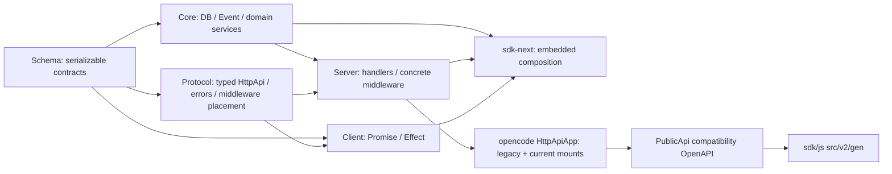
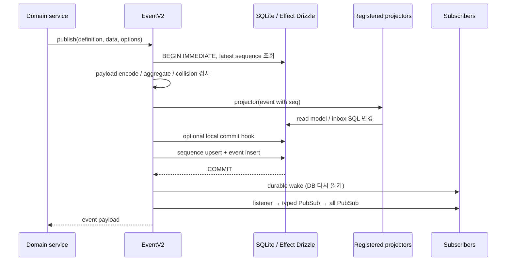
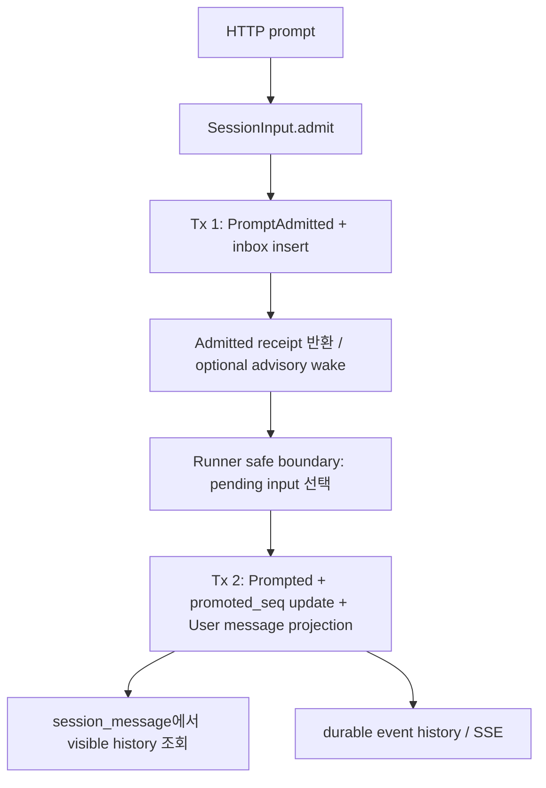
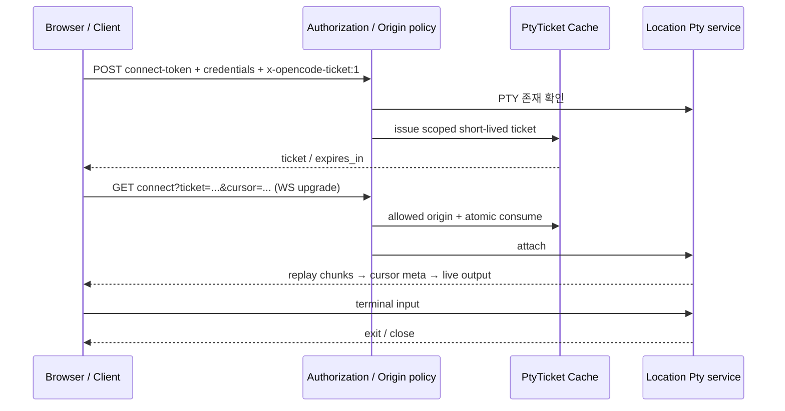
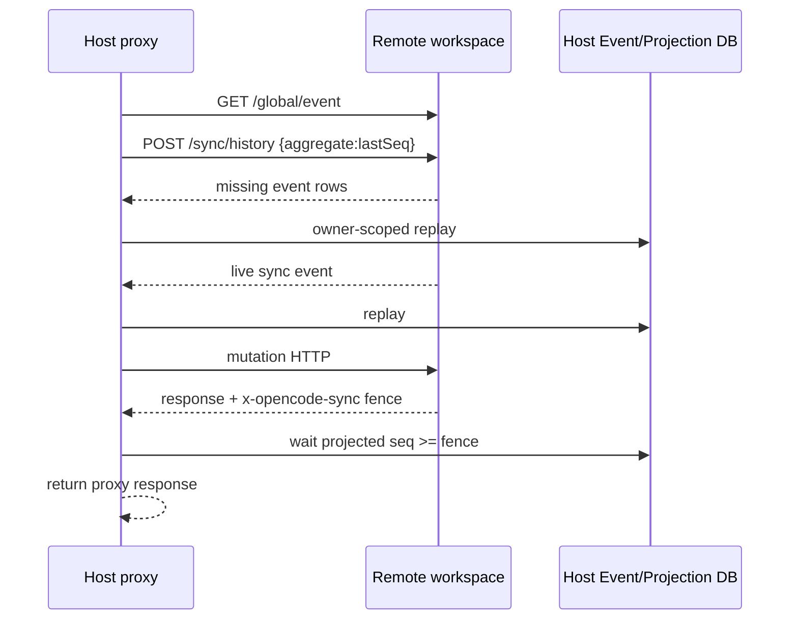
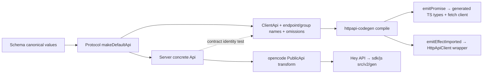

# OpenCode 데이터 저장과 API 분석

분석 기준은 `dev` 커밋 `907b3bc518fa48e90e8ec24dd327d13eee71c36c`이다. 2026-10-04 Asia/Seoul에 `/Users/yakisoba0728/Documents/GitHub/opencode`의 HEAD와 clean working tree를 확인했다. 원본 checkout은 변경하지 않았다. 이 보고서의 **구현 확인**은 해당 커밋의 소스와 호출 경로를 읽었다는 뜻이며, **테스트 확인**은 테스트 내용을 읽었다는 뜻이다. 실행 검증은 11절의 제한된 생성 Promise 클라이언트 검증에만 해당한다. Bun 테스트, 서버 기동, 실제 provider·공유 서비스 호출은 수행하지 않았다.

이 영역의 핵심은 다음과 같다.

- 기존 API와 현재 `/api/...` API가 같은 Effect HTTP 서버에 mount된다. 기존 경로가 있다는 이유로 서버 자체를 Hono 구현으로 설명하면 이 커밋과 맞지 않는다.
- Core의 하나의 SQLite 서비스와 `SessionProjector`가 기존 `message`/`part` 및 현재 `session_message`/`session_input`을 함께 관리한다. 세션 metadata는 공통 `session` 테이블을 사용한다.
- durable 이벤트·sequence·SQL projection은 하나의 `BEGIN IMMEDIATE` transaction에 묶인다. 실시간 알림은 그 transaction이 끝난 뒤 수행한다. 이 구조가 모든 파일 저장·원격 공유·import까지 포괄하는 것은 아니다.
- V2 프롬프트 응답은 **durable inbox 접수 영수증**이다. 모델이 보는 User 메시지로 승격하는 이벤트와 transaction은 별도다.
- 전체 서버 이벤트 SSE와 세션 durable replay SSE는 서로 다른 계약이다. 토큰 delta는 live-only이며 aggregate sequence·ownership·실행 coordinator도 서로 다른 책임이다.
- `sdk/js`의 `v2` 디렉터리는 기존/현재 API를 함께 담는 compatibility SDK다. 현재 계약 전용 Client와 embedded 조합은 `@opencode-ai/client` 및 `sdk-next`이다.

## 1. 계층, 소유권, 실제 조립

루트 지침은 Schema → Core/Protocol → Server 의존성과 Client의 Core/Server runtime import 금지를 요구한다. 실제 Protocol manifest는 Schema와 Effect만 의존하고, Server는 Core·Protocol을 조합한다. Schema는 wire/storage 계약과 같은 schema identity를 제공하며 host-side service 구현을 넣지 않는다. Core는 이 값을 domain facade로 노출한다. 예를 들어 `core/session/schema.ts`의 ID/Info는 Schema의 값을 그대로 re-export한다. [지침][root-guide], [Schema 경계][schema-guide], [Protocol manifest][protocol-manifest], [Server manifest][server-manifest], [세션 facade][session-schema].

Protocol의 `makeDefaultApi`가 endpoint 그룹과 Authorization/SchemaError middleware 배치를 소유한다. Location middleware의 concrete service identity는 Server가 주입한다. Client는 같은 Protocol factory에 client-local middleware key를 주입해 계약만 만든다. 따라서 generation을 위해 Core identity를 Client에 끌어오지 않는다. [Protocol API][protocol-api], [Server API][server-api], [Client 계약][client-contract].

실제 조립은 두 가지다.

| 진입점 | 조립 내용 | 의미 |
|---|---|---|
| `opencode/src/server/server.ts`의 `Default` / `listen` | Effect `HttpApiApp` web handler 또는 Node HTTP listener | 기존 CLI/TUI/GUI가 사용하는 서버의 compatibility 외형 |
| `opencode/.../httpapi/server.ts:createRoutes` | Root, 기존 Event/PTY/Instance, current Server API, `/doc`, UI fallback을 merge; V1/V2 domain graph와 projector·Event bridge 제공 | 기존 엔진과 V2 경로가 동시에 연결된 현재 production 조립 |
| `server/src/routes.ts:createRoutes` | current Protocol API와 Core graph, Local execution, Location map; `/openapi.json` | 별도 current 서버 조립 |
| `server/src/routes.ts:createEmbeddedRoutes` | 위 current graph에 password 없는 명시적 auth config | sdk-next의 프로세스 내부 HTTP transport |

근거: [서버 facade][legacy-server], [mount와 runtime graph][host-assembly], [current routes][current-routes]. standalone current Server는 legacy app graph를 불러오지 않는다. 반대로 combined `HttpApiApp`는 PTY 환경에 plugin layer를 공급한다. current standalone의 `PtyEnvironment` 기본 구현은 빈 env를 반환한다. 같은 Protocol이더라도 host composition으로 부가 동작이 달라질 수 있다. [PTY 환경][pty-env], [plugin PTY 연결][host-assembly].

## 2. SQLite 서비스와 실제 영속 데이터

`Database.Service`는 Effect Drizzle adapter를 만들고 WAL, `synchronous=NORMAL`, 5초 busy timeout, `cache_size=-64000`, FK enforcement, passive checkpoint를 설정한 뒤 migration을 적용한다. 시작 오류와 대부분의 SQL 오류는 `orDie`로 defect가 된다. `OPENCODE_DB`가 우선하고 상대 경로는 global data 디렉터리 아래다. latest/beta/prod는 `opencode.db`, 다른 channel은 suffix가 붙는다. [Database 초기화·경로][database].

Core package의 `#sqlite` conditional import가 Bun 또는 Core 자체 Node driver를 고른다. 이 driver들은 native SQLite connection을 Effect SQL과 raw Drizzle에 제공하고 Scope 종료 때 닫는다. 일반 query와 transaction reserve는 semaphore로 직렬화한다. 별도 `effect-sqlite-node` package는 존재하지만 조사한 TS runtime import에서는 소비 경로를 찾지 못했다. Core의 Node database를 이 package의 사용 사례라고 단정할 수 없다. [runtime 조건][core-manifest], [Bun driver][sqlite-bun], [Node driver][sqlite-node], [별도 adapter][sqlite-node-package].

Effect Drizzle adapter의 domain-independent 경계는 generic `SqlClient`다. transaction connection을 fiber context로 제공하므로 projector가 transaction callback의 `tx` 대신 자신이 캡처한 `db`를 yield해도 활성 transaction connection을 사용한다. 최상위는 deferred/immediate BEGIN, 중첩은 savepoint이며 실패·interrupt 시 rollback한다. 이 ambient connection 계약이 EventV2와 SQL projector를 연결한다. [adapter transaction][drizzle-session].

current full schema에는 domain 테이블 19개가 있으며 migration journal은 별도다. 모든 데이터가 이벤트에서 파생되지는 않는다.

| 테이블 | 핵심 키·저장 내용 | 경계와 제약 |
|---|---|---|
| `project`, `project_directory` | project ID, worktree, directory별 설정/strategy | project directory 복합 키; 프로젝트 위치 식별 |
| `workspace` | workspace ID, project 연결, adapter 상태/metadata | 원격·동기화 배치 정보; 실행 소유권과 다름 |
| `session` | session ID, project/directory/workspace/parent, title, agent/model, cost/tokens, revert 등 | V1/V2 공통; project FK cascade, parent/workspace ID는 nullable 참조이며 이 테이블에서 FK가 아님 |
| `message`, `part` | 기존 transcript의 JSON info 및 별도 part | message→session, part→message cascade; part.session_id는 별도 FK가 아님 |
| `session_message` | V2 `msg_*` ID, session, type, creator aggregate seq, encoded JSON | 전역 ID PK; `(session_id,seq)` unique; type+seq/time indexes |
| `session_input` | pending prompt JSON, `steer/queue`, admitted_seq, nullable promoted_seq | 전역 msg ID PK; session별 admission/promotion seq unique; pending delivery/seq index |
| `session_context_epoch` | session당 baseline, snapshot, baseline_seq | 로컬 실행 context snapshot; 전부 serialized event에 담기지 않음 |
| `event_sequence`, `event` | aggregate별 latest seq/owner, versioned type와 encoded payload | aggregate+seq unique 및 event ID 전역 PK; event FK cascade |
| `todo`, `permission`, `session_share` | 순서 있는 todo, 저장 승인, 공유 ID/secret/url | 각각 별도 저장 lifecycle; 자동으로 모두 event-sourced가 되는 것은 아님 |
| `account`, `account_state`, `control_account`, `credential`, `data_migration` | 계정·설정 상태·credential·migration marker | provider/auth 세부 내용은 03/06 범위 |

근거: [세션 테이블][session-sql], [이벤트 테이블][event-sql], [전체 생성 schema][schema-gen], [공유 테이블][share-sql]. `session_message.seq`는 row의 최초 projection/creator 순서를 유지한다. text/tool settlement가 row를 갱신할 때 최근 이벤트의 seq로 timeline 위치를 이동시키는 방식이 아니다. [message projection][projector-run].

`database/path.ts`는 Windows 절대 경로를 slash로 저장하고 플랫폼 경로로 복원한다. 기존 session의 빈 directory만 읽기 호환 예외다. DB 값이 곧 OS 경로 문자열과 항상 동일하다고 가정하면 안 된다. [경로 column][database-path].

`core/state.ts`는 이름과 달리 영속 store가 아니다. initial state에 Scope 소유 transform들을 다시 적용하고 finalize 후 visible state를 교체하는 인메모리 재구성 도구다. semaphore가 reload를 직렬화하고 Scope dispose와 batch가 transform 제거·reload를 관리한다. [State][state].

기존 `Storage.Service`도 남아 있다. `<Global.data>/storage/<key>.json`에 JSON을 읽고 쓰며 파일별 `TxReentrantLock`과 lazy migration marker를 사용한다. 여러 파일이나 SQL과의 원자성을 제공하지 않는다. canonical session/message는 현재 SQL이고, 조사한 production consumer에는 기존 session revert의 JSON 자료 사용이 있었다. [JSON Storage][json-storage].

## 3. Migration: 새 DB와 기존 설치가 다르다

빈 DB는 `schema.gen.ts`의 **현재 전체 schema**를 한 transaction으로 생성하고 모든 등록 migration을 완료 처리한다. 과거 SQL을 처음부터 재생하지 않는다. 기존 `session` 테이블이 있는 DB는 `migration(id,time_completed)` journal에서 미완료 항목을 골라 migration마다 transaction을 연다. session이 없는 비어 있지 않은 DB는 거부한다. 기존 Drizzle journal은 name 또는 UTC timestamp prefix를 통해 새 journal로 가져오며 모르는 timestamp는 실패한다. migration 전체를 하나의 원자적 upgrade라고 볼 수 없다. [migration 경로][migration].

Schema의 생성원은 Core의 `*.sql.ts`/`sql.ts`다. `core/script/migration.ts`는 snapshot 기반 incremental SQL을 TypeScript migration으로 바꾸고 full schema와 registry도 갱신한다. `--check`가 세 산출물의 동기화를 검사한다. 생성 파일을 계약의 유일한 손수 편집 원본으로 설명하면 안 된다. [migration generator][migration-generator], [Drizzle 입력][drizzle-config].

| migration | 실제 변화 | 데이터 호환 의미 |
|---|---|---|
| `20260312043431_session_message_cursor` | 기존 메시지 paging용 tuple index | time+ID keyset 읽기 지원 |
| `20260323234822_events`, `20260504145000_add_sync_owner` | event log/sequence, owner column | replay sequence와 원격 복제 소유 표시 |
| `20260603040000_session_message_projection_order` | 초기 projected message 삭제, seq 추가 | 과거 projection에 순서를 임의로 발명하지 않음 |
| `20260604172448_event_sourced_session_input` | beta inbox/projection/log/workspace reset, 새 inbox/index | 초기 inbox-local sequence에서 event sequence로 cutover |
| `20260622142730_simplify_session_context_epoch` | Context Epoch 저장 단순화 | 로컬 context schema 변경 |
| `20260622170816_reset_v2_session_state`, `20260622202450_simplify_session_input` | Context Epoch/inbox/V2 message/**전체 event·sequence**/workspace 삭제, session.workspace_id 해제 | canonical V1 session/message/part 보존; experimental history 폐기 |
| `20260510033149_session_usage` | 기존 assistant JSON에서 cost/token 합산 | 기존 session usage backfill |
| `20260601010001_normalize_storage_paths` | 저장 경로 slash 정규화 | Windows/native 경로 호환 |

등록 순서: [migration registry][migration-registry]. 삭제 범위: [V2 reset][migration-reset], [inbox simplify][migration-inbox]. 따라서 이 커밋의 모든 기존 설치를 이벤트 로그만으로 rebuild할 수 있다는 보장은 없다. migration 테스트는 V1 canonical row를 보존하고 이후 V1 event의 seq를 0부터 다시 시작하는 경우까지 확인한다. 이는 테스트의 정적 확인이며 직접 실행 결과는 아니다. [migration 테스트][migration-test]. 외부 workspace resource 정리는 SQL migration으로 수행할 수 없다는 changelog의 별도 요구도 구현 범위와 구분해야 한다. [changelog][changelog].

## 4. Durable 이벤트, projection, 알림

`Event.define`은 payload schema와 선택적인 `{aggregate,version}` durable 속성을 함께 정의한다. DB에는 `session.next.step.ended.2`처럼 versioned type을 쓰고 live wire payload에는 base type과 `durable.version`을 분리한다. Durable manifest가 stored type을 canonical schema로 decode한다. 첫 aggregate sequence는 0이며 존재하지 않는 sequence는 -1이다. [event 모델][schema-event], [decode와 seq][core-event].

Projector, local commit hook, sequence upsert, event insert는 같은 immediate transaction 안이다. 하나가 실패하면 SQL projection과 event도 rollback한다. projector가 event insert보다 먼저 실행되어도 외부에는 atomic commit이 보인다. commit 뒤 durable wake를 발행하고 live listener/stream에 통지한다. durable 이벤트 listener의 non-interruption 실패는 로그로 격리하지만 interruption은 유지한다. live-only 이벤트는 listener 실패가 fail-fast다. [transaction과 통지][event-commit], [observer 격리][event-notify].

이 구조는 **영속 outbox와 외부 delivery acknowledgement**까지 구현한 것이 아니다. commit 이후 process crash나 observer interruption에도 모든 live consumer가 받는다는 보장은 소스에서 확인되지 않는다. SQL 성공과 notify 성공을 동일하게 취급하면 retry 판단이 잘못될 수 있다. 또한 adapter 중첩 transaction은 savepoint다. outer transaction 내부에서 EventV2.publish를 호출할 경우 outer COMMIT까지 알림을 늦추는지 별도 검증이 필요하다. 조사한 domain 호출에서는 이 사용 사례를 확인하지 못했다. 이것은 구현 누락 판정이 아니라 transaction 계약의 남은 질문이다. [adapter transaction][drizzle-session], [event transaction 종료][event-commit].

`PublishOptions.commit`은 코드 주석상 replay/serialization에 포함하지 않는 local operational projection이다. ContextUpdated와 함께 Context Epoch snapshot을 advance하는 사례가 있다. DB `event`에는 id/aggregate/seq/type/data만 있으므로 live `location`·`metadata`도 durable read/replay에서 복원되지 않는다. live event 전체 JSON을 영속 원본으로 간주하면 안 된다. [옵션 계약][event-options], [stored columns][event-sql], [Context Epoch hook][context-epoch].

`SessionProjector`는 V1 Created/Updated/Deleted·Message/Part CRUD와 V2 lifecycle을 함께 등록한다. V1 API도 EventV2Bridge를 통해 Core event/projector 경로를 이용한다. combined server와 legacy runtime이 projector node를 설치하며 V2 Session node도 dependency로 연결한다. `opencode/server/projectors.ts`의 빈 initializer를 현재 SQL projection의 본체로 볼 수 없다. [등록][projector-registration], [서버 graph][host-assembly].

### 4.1 Replay와 owner

| 동작 | 구현 계약 |
|---|---|
| local publish | latest+1 할당, 전역 event ID 충돌 거부; replay owner fence는 검사하지 않음 |
| exact stale replay | aggregate seq의 기존 id/type/encoded data가 모두 같을 때 no-op; 다르면 divergence defect |
| new replay | aggregate envelope와 payload의 aggregate 일치, seq=latest+1 필수 |
| owner 충돌 | 일반 replay는 skip; strictOwner는 defect. strict 검사는 exact retry보다 먼저 수행 |
| owner 없을 때 | replay owner를 기록 가능; exact retry도 미소유 row를 claim할 수 있음 |
| `claim` | 기존 sequence row 단순 UPDATE; CAS/lease/row creation 없음 |
| `replayAll` | 배열이 한 aggregate이고 내부 seq가 연속인지 먼저 검사; 각 이벤트는 개별 commit |
| `remove` | event_sequence/event만 삭제; 모든 projection을 자동 초기화하는 API가 아님 |

근거: [replay 검증][event-commit], [replay와 batch][event-replay], [remove/claim][event-claim]. replay owner는 원격 복제 provenance/fence다. process-local Session execution coordinator나 향후 clustered 실행 lock과 구분한다. AGENTS에도 이 구분이 명시되어 있다. [V2 지침][root-guide].

### 4.2 Live stream과 durable stream

`all()`/typed `subscribe()`는 프로세스 내부 unbounded PubSub이고 history가 없다. `allBounded`는 subscriber별 dropping queue를 사용하며 overflow하면 `SubscriberOverflowError`로 그 stream을 종료한다. 현재 `/api/event`의 capacity는 256이다. publisher 전체를 느린 client 하나가 block하는 설계는 아니다. [bounded stream][event-bounded], [global native SSE][current-event-handler].

`durable({aggregateID,after})`는 **wake subscription을 먼저 등록하고** DB history를 읽는다. 이후 sliding capacity 1의 wake가 오면 `seq > last`를 DB에서 다시 읽는다. wake가 합쳐져도 log의 각 event를 읽으므로 history/live handoff race와 consumer 지연을 다룬다. 다만 wake는 process-local이다. 다른 프로세스가 같은 DB에 append한 사실을 감지하는 polling/changefeed는 이 구현에 없다. cross-process tail을 약속하는 API라고 해석할 수 없다. [durable replay-tail][event-durable].

Text/Reasoning/Tool Input/Compaction delta는 live-only다. full-value Ended 및 tool settlement가 durable 경계이며 projector도 delta를 등록하지 않는다. 따라서 replay/history는 원래 토큰 fragment를 재방송하는 기록이 아니다. Ended 전에 중단된 부분의 복구는 01과 함께 추가 확인해야 한다. [이벤트 구분][session-event-durable], [projector 등록][projector-registration].

## 5. Inbox, 메시지, 읽기 모델의 경계

V2의 `POST /api/session/:sessionID/prompt`는 `{id?,prompt,delivery?,resume?}`를 받고 `{data: SessionInput.Admitted}`를 반환한다. ID를 생략하면 msg ID를 생성하고 delivery는 steer다. `resume:false`는 접수만 한다. 세션/정규화 prompt/delivery가 동일한 msg ID retry는 같은 inbox로 수렴하며 충돌은 HTTP 409다. resume 여부는 durable 입력의 identity 일부가 아니므로 exact retry에 실행 wake를 다시 요청할 수 있다. [endpoint][protocol-session], [Session.prompt][session-core], [입력 equivalence][input-equivalent].

Admission projector는 같은 visible msg ID가 이미 존재하는지 검사하고 inbox에 넣는다. 충돌·concurrent admission 뒤에는 기존 row를 다시 읽어 exact identity 여부를 확인한다. promotion은 inbox의 null promoted_seq를 조건부로 갱신하고, 동일 `Prompted` transaction에서 User 메시지를 만든다. promoted_seq와 최초 message.seq는 그 이벤트 seq다. historical V2 Prompted만 존재하면 이미 promoted인 inbox를 합성할 수 있다. 이는 V1 `message/part` transcript를 자동으로 V2 transcript로 변환한다는 뜻은 아니다. [admission][input-admission], [promotion SQL][input-promotion], [동일 transaction projector][projector-input].

Steer 후보는 captured cutoff 이하 admitted_seq 오름차순, queue는 가장 오래된 pending 한 건이다. 여러 steer도 각 Prompted 이벤트마다 독립 transaction이다. batch 전체 atomic promotion은 아니다. 실제 safe boundary·turn budget·queue 실행 정책은 01 담당 보고서와 연결한다. [promotion loop][input-selection].

| 읽기 관점 | 기존 V1 | 현재 V2 |
|---|---|---|
| transcript | `message` + hydrated `part` | tagged `session_message` |
| timeline 순서 | `(time_created,id)` tuple | durable creator seq |
| prompt 성공 | endpoint에 따라 assistant 결과/stream 또는 async 수락 | admission receipt |
| fragment 표시 | `message.part.delta` 등 compatibility event | live-only `session.next.*.delta` |
| durable reconnect | 별도 sync log/catch-up 경로 | session events `after` seq와 finite history |
| context 조회 | 기존 history/filter logic | SessionHistory의 compaction/baseline selection |

근거: [V1 paging][v1-message-page], [V2 seq paging][session-message-page], [Store][session-store], [context history][session-history]. V2 assistant/tool/reasoning settlement는 assistantMessageID를 사용한다. provider-local call ID를 전역 transcript 소유권으로 쓰지 않는다. 새 step 때 최신 incomplete assistant를 처리하는 규칙과 과거 row 재활성화 방지 역시 projector/updater의 책임이다. [message updater][message-updater].

Revert commit은 boundary 이후 projected messages와 admitted/promoted input을 삭제하지만 event log는 유지한다. replay한 revert event가 같은 read model을 만들 수 있다. Todo는 별도 SQL delete/insert transaction 뒤 live-only `todo.updated`를 발행한다. 세션 주변 상태를 전부 log-derived model이라고 묶으면 이 차이를 놓친다. [revert projection][projector-revert], [todo 저장][todo].

## 6. 현재 Protocol HTTP 계약

Protocol은 selected experimental API라는 metadata를 유지한다. 다음은 실제 선언과 handler가 연결된 계약이다. API HTML의 전체 계획 목록은 이 inventory의 대체물이 아니다. [Api 그룹 조립][protocol-api].

| 영역 | 실제 경로·method | 응답·처리 경계 |
|---|---|---|
| readiness/context | GET `/api/health`, `/api/location` | `{healthy:true}` / resolved Location.Info |
| discovery | GET `/api/agent`, `/api/model`, `/api/provider[/:providerID]`, `/api/command`, `/api/skill`, `/api/reference` | 대부분 `{location,data}`; Location-scoped service snapshot |
| session collection | GET/POST `/api/session`, GET `/api/session/active` | list data+cursor, create data, process-local active drains |
| session item | GET `/api/session/:sessionID`, POST `agent`, `model`, `prompt`, `interrupt` | stored placement 사용; agent/model/interrupt는 204, prompt는 admission receipt |
| transcript | GET `.../message[/:messageID]`, `.../context` | projection read; single message는 session ownership 확인 |
| durable log | GET `.../history`, `.../event` | finite `{data,hasMore}` / replay-tail SSE |
| explicit operations | POST `.../compact`, `.../wait` | 선언은 존재; 현재 Core는 OperationUnavailable→503 |
| revert | POST `.../revert/stage`, `clear`, `commit` | staged state 또는 204; snapshot error를 public UnknownError로 변환 |
| filesystem | GET `/api/fs/read/*`, `/api/fs/list`, `/api/fs/find` | raw bytes+MIME / `{location,data}`; list/find relative path |
| permission | GET `/api/permission/request`, `/api/permission/saved`, DELETE saved ID; GET/POST session permission 및 GET/reply request ID | pending request 목록·세션 소유 request·저장 rule; create의 ask는 승인 결과를 기다릴 수 있음 |
| question | GET `/api/question/request`; GET session question, POST request `reply`/`reject` | Location 또는 session별 pending; reply/reject는 ownership 확인 후 204 |
| PTY | GET/POST `/api/pty`, GET/PUT/DELETE ID, POST connect-token, GET connect | retained exited info, ticket, raw WebSocket |
| integration | list/get, connect key/oauth, attempt status/complete/cancel | Location auth workflow; AuthorizationError는 400 일반화 |
| credential | PATCH/DELETE `/api/credential/:credentialID` | label update/remove, 204 |
| project copies | POST/DELETE `/experimental/project/:projectID/copy`, POST refresh | Protocol에 포함되지만 `/api` prefix가 없는 실제 예외 |
| server event | GET `/api/event` | 모든 Location의 native live event SSE |

근거: [session 계약][protocol-session], [message 계약][protocol-message], [filesystem][protocol-fs], [permission][protocol-permission], [question][protocol-question], [PTY][protocol-pty], [integration][protocol-integration], [credential][protocol-credential], [project copy 예외][protocol-copy]. 일반 project CRUD, workspace lifecycle, configuration, MCP/LSP, session delete/title/todo API가 모두 current Protocol에 이식되었다는 증거는 없다. 이들은 기존 API 또는 계획 문서에 남아 있다. tool 실행도 이 Protocol에 일반-purpose execute endpoint로 노출되지 않는다. tool discovery는 기존 experimental API이고 실제 실행은 Session의 모델/tool 경로가 소유한다.

### 6.1 요청 context와 저장된 placement

Non-session 경로의 Location middleware는 query `location[directory]`/`location[workspace]`를 우선하고, `x-opencode-directory`/`x-opencode-workspace`, 마지막으로 `process.cwd()`를 사용한다. directory header는 URI decode 실패 시 원 문자열을 유지한다. 각 handler의 `response()`가 resolved Location.Info와 data를 묶는다. [Location middleware][current-location].

Session item은 path session ID를 먼저 decode하고 DB의 directory/workspace를 조회하여 Location service graph를 제공한다. client가 다른 Location header를 보내도 세션 배치를 그 header로 덮어쓰는 구조가 아니다. 잘못된 ID는 400, 없는 row는 404다. [Session placement middleware][session-location]. `POST /api/session`은 payload.location 또는 process.cwd를 사용한다. 이 collection create를 non-session Location header fallback과 동일하다고 가정하지 않는다. [create handler][current-session-handler].

### 6.2 세 가지 pagination 계약

1. **Session list**: 기본 50, time_created+ID keyset, asc/desc와 previous/next 방향. opaque cursor는 Base64URL encoded JSON이며 query scope·search·order·anchor를 담고 limit은 제외한다. cursor가 있으면 그 query를 사용하고 page limit은 요청의 limit으로 정한다. 데이터가 한 건이라도 있으면 previous/next cursor를 만들므로 존재 자체가 뒤 페이지의 데이터 존재 증명은 아니다. invalid cursor는 400이다. [Protocol cursor][protocol-session], [list handler][current-session-handler], [SQL list][session-list].
2. **V2 message list**: 기본 50, 요청 limit 1–200; cursor는 `{id,order,direction}`. cursor+order 조합은 400. ID를 해당 session의 seq로 찾아 경계를 적용하며 anchor가 사라지거나 다른 세션이면 빈 page다. 기본 desc이고 previous는 반대 SQL 순서 후 결과를 뒤집어 요청 순서를 유지한다. cursor의 session ID를 wire에 넣거나 서명하는 방식은 아니다. [message query][protocol-message], [handler][current-message-handler], [SQL paging][session-message-page].
3. **Finite history**: 기본 50, HTTP 최대 100, exclusive nonnegative after; 기본 after 없음은 내부 -1. **public Session durable manifest**에 해당하는 event만 seq asc로 `limit+1` 읽고 hasMore를 계산한다. 필터링 gap이 정상이고 page 사이에 append된 event도 다음 page에 나타날 수 있다. snapshot 전체를 고정하는 pagination이 아니다. [history 선언][protocol-session], [readAggregate][event-history], [대표 테스트][history-test].

정적 확인한 세부 차이: Session query에 `project/subpath`가 선언되어 있지만 현재 Core list SQL은 project 조건만 적용하며 subpath 조건은 사용하지 않는다. 이 커밋에서 subpath filtering이 작동한다고 문서만으로 보장할 수 없다. [query 선언][protocol-session], [실제 list SQL][session-list].

### 6.3 오류와 stream 응답

Public error는 Protocol의 `Schema.TaggedErrorClass`다. 400 InvalidRequest/InvalidCursor, 401 Unauthorized, 403 Forbidden, 404 Session/Message/Provider/Permission/Question/PTY NotFound, 409 Conflict, 503 ServiceUnavailable, 500 UnknownError가 status와 `_tag`/message/필요 resource 필드를 함께 선언한다. domain error는 handler에서 wire error로 변환한다. 모든 Core defect가 이 오류 union의 한 가지로 자동 바뀌는 것은 아니다. 예를 들어 FS group은 개별 FileNotFound 계약을 선언하지 않고 raw byte handler를 제공한다. [오류 정의][protocol-errors], [FS handler][current-fs-handler].

SchemaError middleware는 decode error reason을 1024자 기준으로 자르고 warning을 남긴 후 InvalidRequestError를 반환한다. message decode/snapshot 오류는 generic message와 ref를 반환하는 handler가 있다. compact/wait는 실제 503 stub이며 automatic compaction과 명시적 compact endpoint를 혼동하면 안 된다. [schema error][current-schema-error], [오류 mapping][current-session-handler], [미구현 Core operation][session-unavailable].

`/api/event`는 readiness 이전 listener를 설치하고 server.connected 뒤 live events를 전달한다. `event:message`, JSON data, SSE id 없음, 15초 comment heartbeat, no-cache/no-transform·X-Accel-Buffering:no다. Location filter를 적용하지 않는 전역 native stream이다. `.../session/:id/event`는 `after`로 durable replay-tail을 요청한다. `Last-Event-ID`를 aggregate cursor 입력으로 읽는 코드 경로는 없다. reconnect는 호출자가 after를 관리해야 한다. 세션 stream에서 replay 중 defect가 나면 이미 열린 HTTP body의 stream 종료로 나타날 수 있으므로 finite endpoint의 JSON 오류와 같은 시점 계약은 아니다. [global SSE handler][current-event-handler], [Session SSE handler][current-session-handler], [replay-tail][event-durable].

## 7. 기존 HTTP API와 combined host의 transport

CLI serve/web는 `Server.listen`을 호출하며 TUI worker의 fetch RPC는 `Server.Default().app.fetch`를 직접 호출한다. TCP listener가 모든 요청에 필수인 것은 아니다. network listener는 Node createServer/NodeHttpServer를 쓰고, port=0 요청은 4096 우선 시도 후 OS-assigned port로 fallback한다. listener마다 env ConfigProvider를 공급하고 Scope로 수명을 관리한다. 반복·동시 stop을 cached Effect로 조정한다. [serve][cli-serve], [worker fetch][tui-worker], [listener][legacy-server], [stop][listener-stop].

### 7.1 기존 API inventory

아래는 기존 handler와 연결된 주요 계약이다. provider·MCP·TUI 세부 실행은 각각 03/06/04 보고서의 영역이다.

| 영역 | 주요 경로 | current API와 구분할 점 |
|---|---|---|
| global | GET health/event/config, PATCH config, POST dispose/upgrade | `/global/*`; health에 version, GlobalBus event envelope |
| project | GET `/project`, `/project/current`, `/:id/directories`; POST `/project/git/init`; PATCH ID | 기존 Project service와 InstanceContext; git init 뒤 identity 변경 시 reload |
| session | GET/POST `/session`, GET/PATCH/DELETE ID; children/todo/diff/fork/abort/init/summarize/revert/unrevert/share | 기존 wire SessionV1; patch 여러 필드는 순차 service 호출이며 하나의 event transaction으로 묶이지 않음 |
| message/part | GET/POST `.../message`, GET/DELETE message ID, DELETE/PATCH part ID | WithParts[]와 separate part; PATCH ID 세 개가 URL과 일치해야 함 |
| async input | POST `.../prompt_async`, `.../command`, `.../shell` | async prompt는 layer Scope에 fork 후 204; 이후 오류를 session.error로 전달 |
| file/search | `/find`, `/find/file`, `/find/symbol`, `/file`, `/file/content`, `/file/status` | text/binary JSON 외형; symbol/status는 실제 빈 배열 stub |
| tools/metadata | `/experimental/tool`, `/experimental/tool/ids`, `/agent`, `/command`, `/skill`, `/lsp`, `/formatter` | tool registry와 parameter schema discovery; 직접 실행 API가 아님 |
| permission | GET `/permission`, POST request reply; session permissions 호환 경로 | reply/message와 legacy response payload 차이 |
| question | GET `/question`, POST request reply/reject | 기존 pending question 목록과 answer 배열 |
| PTY | `/pty/shells`, `/pty`, ID, connect-token/connect | Core PTY 사용; 기존 외형은 running만 노출 |
| config/provider/auth | `/config`, `/config/providers`, `/provider`, `/provider/auth`, provider OAuth; PUT/DELETE `/auth/:providerID` | provider credential 관리이며 서버 Basic auth와 별개 |
| MCP | `/mcp`, server auth/callback/authenticate/connect/disconnect | typed errors + existing MCP service |
| workspace/sync/control | `/experimental/workspace/*`, `/sync/*`, `/experimental/control-plane/move-session`, `/tui/*` | remote placement·projection catch-up·process-local UI 제어 |
| all-project list | GET `/experimental/session` | 기존 updated-time numeric cursor와 response header |

근거: [기존 API 조립][legacy-api], [Session 경로][legacy-session-group], [Session handler][legacy-session-handler], [file handler][legacy-file-handler], [experimental handler][legacy-experimental-handler], [권한][legacy-permission], [질문][legacy-question], [PTY][legacy-pty-handler].

기존 POST message는 prompt 완료 결과를 JSON stream으로 출력한다. token별 화면 갱신은 별도 이벤트에서 온다. prompt_async의 204는 background 실행 성공 확인이 아니다. deleteMessage에는 explicit busy check가 있으나 part delete/update에서 같은 check를 확인하지 못했다. file.content는 텍스트 `trim()` 또는 base64 binary이고, 없는 파일은 빈 text를 반환한다. 따라서 `/api/fs/read/*`의 byte-exact file response와 같지 않다. [prompt/async handler][legacy-prompt-handler], [part mutation][legacy-part-handler], [file 외형][legacy-file-handler].

### 7.2 인증, CORS, middleware

Server 인증은 서버 전체 Basic username/password config다. `OPENCODE_SERVER_PASSWORD`가 없거나 빈 문자열이면 비활성, username 기본은 opencode다. current middleware와 legacy middleware 모두 auth_token query가 있으면 먼저 base64 decode하고, 아니면 Basic header를 읽는다. malformed credential은 빈 credential로 처리한다. legacy auth 오류는 empty 401, current는 bodyful UnauthorizedError다. WWW-Authenticate를 붙인다. [current auth 설정][server-auth], [current auth middleware][current-authorization], [기존 middleware][legacy-authorization].

기존 instance 그룹은 InstanceContext → WorkspaceRouting → Authorization 순으로 middleware를 선언하며 의미상 인증 후 routing 결정, local일 때 instance load, handler 실행으로 이어진다. raw UI fallback은 static public path에 대한 auth 예외를 자체 router middleware로 처리한다. public `/doc` schema에서 legacy auth metadata를 제거하는 작업은 runtime auth 제거와 다르다. [기존 group 선언][legacy-session-group], [auth public asset 분기][legacy-authorization], [PublicApi transform][public-api].

Combined app은 error/compression/cors-vary/fence/CORS layer를 assembly에서 제공한다. 이 layer 배열 순서만 보고 HTTP 실행 순서를 단정하지 않는다. CORS는 no-origin, localhost/127.0.0.1 HTTP, `oc://renderer`, Tauri origins, HTTPS opencode.ai 하위 도메인, 추가 cors 목록을 허용하고 preflight maxAge=86400을 설정한다. PTY origin 검사에는 same-host도 포함한다. cors-vary middleware는 Origin을 기존 Vary에 병합한다. [shared origin policy][cors], [assembly][host-assembly], [Vary 처리][cors-vary].

Response compression은 Uint8Array body, 1024 bytes 이상, 허용 content type, gzip/deflate negotiation 조건에만 적용한다. streaming body와 no-transform/event-stream은 제외하여 SSE를 버퍼 압축하지 않는다. outer error boundary는 declared typed error를 보존하고 defect-only failure를 처리한다. 알려진 config defect는 400, 나머지는 `{name:"UnknownError",data:{message,ref}}` 500으로 mapping한다. current Protocol의 `_tag` error, 기존 NamedError, raw empty error, proxy text error가 모두 같은 host에 있으므로 **단일 JSON 오류 envelope는 없다**. [compression][compression], [outer error boundary][outer-error], [기존 schema 오류][legacy-schema-error].

### 7.3 기존 workspace routing

기존 session path에서 찾은 workspaceID가 query.workspace보다 우선하며 session directory도 directory hint보다 우선한다. hint는 query.directory → x-opencode-directory → cwd다. workspace server의 `OPENCODE_WORKSPACE_ID`는 자신의 configured identity를 사용한다. remote target이면 HTTP/WS proxy로 넘기고 local InstanceContext를 만들지 않는다. local일 때 InstanceStore.load 후 InstanceRef/WorkspaceRef를 제공한다. `/session` list와 experimental workspace control은 host에 남기는 규칙이 있다. missing workspace는 text 500, sync loop 없는 target은 text 503이다. 이는 current SessionLocationMiddleware의 DB placement lookup과 다른 compatibility routing 체계다. [routing plan/proxy][legacy-workspace-routing], [instance context][instance-context].

### 7.4 SSE와 기존 pagination

| stream | source·scope | replay·buffer·framing |
|---|---|---|
| 기존 `/event` | EventV2Bridge → directory/workspace filter → `{id,type,properties}` | eager listener + unbounded queue; initial connected, 10초 tick 첫 tick drop; instance.disposed 포함 후 종료 |
| 기존 `/global/event` | GlobalBus `{directory,project?,workspace?,payload}` | callback listener live stream; sync payload 포함; connected/heartbeat는 directory 없는 envelope |
| current `/api/event` | EventV2 allBounded → native Schema encode | capacity 256; 모든 Location; 15초 comment heartbeat |
| current 세션 `/event` | durable DB + local wake | exclusive aggregate seq replay-tail; ephemeral 제외 |

기존 두 SSE도 payload JSON의 ID와 SSE framing ID가 다르다. framing에는 id가 없어 Last-Event-ID catch-up을 제공하지 않는다. `/event` eager listener와 `/global/event` callback listener 시작 시점도 동일하지 않다. [기존 SSE][legacy-event-handler], [GlobalBus SSE][legacy-global-handler], [Event bridge][event-bridge].

기존 message GET은 limit 생략/0이면 전체 이력, 양수이면 최신 N개를 읽고 page 안에서는 chronological로 reverse한다. before 단독 요청은 400, 다음 page가 있으면 Link/X-Next-Cursor와 CORS expose header를 붙인다. Base64URL `{id,time}` cursor는 timestamp tie를 ID로 처리한다. current의 1–200 limit과 달리 기존 query는 상한을 명시하지 않고 510개 응답 테스트도 있다. [기존 메시지 endpoint][legacy-session-handler], [cursor와 SQL][v1-message-page], [테스트][legacy-message-test].

`/experimental/session`은 기본 100, archived 제외, limit+1을 읽고 마지막 updated timestamp를 x-next-cursor로 반환한다. SQL은 ID tie-breaker를 정렬에 사용하지만 cursor에는 timestamp만 있고 다음 predicate는 `time_updated < cursor`다. **동일 timestamp가 page 경계에 걸리면 일부 row를 건너뛸 수 있다는 정적 추론**이다. 실행 재현은 하지 않았다. [global list handler][legacy-experimental-handler], [global list SQL][legacy-global-list].

## 8. PTY HTTP control과 WebSocket data plane

PTY ticket은 Core의 process-global Cache에 보관한다. SQLite/credential store와 다르며 TTL 기본 60초, capacity 10,000, random UUID다. `(ptyID,directory,workspaceID)` scope를 `invalidateWhen`으로 atomic match/consume한다. scope mismatch가 ticket을 성공 consume하는 것은 아니고, match 뒤 재사용은 실패한다. [ticket service][pty-ticket].

Ticket mint는 인증과 `x-opencode-ticket:1`, allowed request origin을 확인한다. custom header가 browser CORS preflight를 요구한다는 제약이 코드에 명시되어 있다. ticket query가 있는 connect는 auth middleware가 Basic 검사를 넘기고 handler가 scoped consume/origin을 확인한다. ticket 없는 connect는 일반 auth 경로다. [Protocol ticket 경로][protocol-pty], [current auth 위임][current-authorization], [current ticket handler][current-pty-handler].

Current connect는 PTY existence를 먼저 보고 empty 404를 반환한다. ticket 실패는 empty 403이며 cursor는 safe integer ≥-1일 때 사용하고 잘못된 값은 undefined로 처리한다. 기존 connect는 cursor schema 실패를 empty 400으로 처리한다. typed OpenAPI success.Boolean은 WebSocket frame의 데이터 타입을 설명하는 것이 아니다. raw handler와 x-websocket annotation을 함께 봐야 한다. [current connect][current-pty-handler], [기존 connect][legacy-pty-connect].

Replay, live output, close는 single writer가 처리하는 outbox queue로 직렬화된다. replay chunks → meta cursor → activate 순서로 handoff하고, reader/writer 중 먼저 끝난 쪽이 연결을 종료하며 detach를 finalizer로 보장한다. upgrade 뒤 PTY missing/exited race는 4404 close다. 이는 이벤트 aggregate seq가 아니라 PTY의 별도 output cursor 계약이며 상세 ring buffer/프로세스 관리 책임은 02다. [current writer][current-pty-handler], [기존 writer][legacy-pty-outbox].

기존 PTY API는 running만 노출하고 exited row를 숨긴다. current PTY는 종료 세션과 exitCode를 remove까지 보존한다. 기존 network listener는 WebSocketTracker에 close Effect를 등록하고 stop(true)에서 1001 server closing을 보내며 close마다 1초 timeout을 둔다. **current PTY handler에는 graceful-shutdown tracker 통합 TODO가 남아 있다.** 동일 host에 mount되었다고 모든 WS가 같은 종료 등록을 거친다고 가정하면 안 된다. [기존 retention][legacy-pty-handler], [tracker][websocket-tracker], [current TODO][current-pty-handler]. 실제 WS/ticket/종료 race는 실행하지 않았다.

## 9. Sync, projection fence, 공유와 import/export

### 9.1 기존 remote sync

`sync/README.md`의 `SyncEvent.run/init/subscribeAll`은 과거 abstraction 설명이다. 현재 해당 디렉터리에는 schema.ts만 구현으로 남고 server/initProjectors는 빈 compatibility 함수다. Core EventV2/projector가 실제 projection을 담당한다. [과거 설명][sync-readme], [빈 projector 초기화][legacy-projectors], [현재 sync handler][sync-handler].

| endpoint | 실제 완료 의미 |
|---|---|
| `/sync/start` | project의 workspace sync를 Scope에 fork하고 true; ignore된 실패나 sync 완료를 receipt가 보증하지 않음 |
| `/sync/history` | `{aggregateID:lastSeq}` record에 알려진 seq 이하를 제외한 EventTable rows; record 밖 aggregate는 전체 이력 |
| `/sync/replay` | serialized array→replayAll(owner=current workspace, strictOwner=true); 첫 aggregate를 sessionID로 반환 |
| `/sync/steal` | current workspace 존재 필요; session workspace placement 변경 |

History handler SQL에는 directory/project/workspace filter와 pagination이 없다. aggregate seq ASC 정렬은 aggregate 간 global chronology가 아니다. replay payload.directory는 log에 쓰이며 middleware routing directory를 바꾸는 입력이 아니다. replayAll은 이벤트별 transaction이므로 HTTP replay batch의 완전 원자성도 없다. [실제 SQL와 replay][sync-handler].

Remote workspace loop는 global SSE 연결 뒤 known seq map으로 history를 가져와 replay하고, 이후 `sync` live payload를 ownerID=workspace로 replay한다. heartbeat는 버리고 reconnect delay는 1초부터 최대 2분이다. live replay 실패는 로그 후 그 event를 넘기며 즉시 개별 retry하는 경로는 확인하지 못했다. [history/live loop][workspace-sync].

`x-opencode-sync`는 mutation 전후 sequence 변화로 만든 read-after-write fence다. host는 remote 응답 fence의 aggregate별 seq 이상이 로컬에 투영될 때까지 기다린다. 기본 5초 timeout과 요청 abort signal을 사용하고 실패는 503이다. 실행 lock/ownership과 별개인 통신 계약이다. [fence middleware][fence-middleware], [header][fence], [host wait][workspace-fence].

기존 workspace warp는 source sync 또는 local cancel → owner claim → 선택적 patch copy → history 10개씩 replay → steal → host placement 변경이다. 전체 distributed transaction/rollback이 아니고 history 없는 imported session의 전송 계약은 남은 질문이다. Core MoveSession의 새 경로와 기존 workspace warp도 같은 구현으로 묶지 않는다. [warp][workspace-warp].

### 9.2 Sharing은 entity snapshot 전송

SessionShare는 root session만 auto-share 대상으로 삼고 flag/config.auto에 따라 background share를 시작한다. disabled policy는 explicit share도 거부한다. ShareNext는 active org가 없으면 enterprise.url 또는 opncd.ai의 `/api/share`, org가 있으면 account URL의 `/api/shares`와 Bearer/x-org-id를 사용한다. [policy][session-share], [target 선택][share-target].

Share create는 remote POST → local session_share upsert → cache → full sync fork → Session share URL 변경으로 이어지며 하나의 transaction이 아니다. remove는 remote DELETE 성공 뒤 local row/cache/queue를 지우고 Session URL 변경은 별도다. remote/backend 완료와 local event 성공이 원자적으로 묶이지 않는다. [create/remove][share-create], [Session URL 변경][session-share].

Upload는 session/message/part/diff/model entity payload다. per-instance Map에서 entity key의 마지막 값으로 합치고 1초 후 flush한다. flush가 queue를 먼저 지운 뒤 POST하고 400+는 warning, 실패는 background log만 남긴다. durable outbox·명시 resend는 이 코드에 없다. 이 경로의 sync는 EventV2 replay replication과 별개다. message/part removed의 별도 upload와 remote snapshot 삭제 의미는 확인되지 않았다. [coalescing][share-queue], [flush/full][share-flush].

### 9.3 Export/import는 V1 transcript 교환

CLI export는 `{info,messages:[{info,parts}]}`를 JSON stdout으로 출력한다. sanitize option은 transcript/tool/file/path 등의 redaction이고 event log export가 아니다. import는 파일 또는 share URL을 받아 현재 instance의 projectID/directory/path로 placement를 바꾸고 원 session/message/part ID를 유지한다. URL에서 org auth header를 붙이는 것은 same-origin에 제한한다. [export][cli-export], [URL import][cli-import-fetch].

Import의 Session upsert는 existing ID의 placement 세 필드만 변경하고 Message/Part 충돌은 do-nothing이다. 각 row를 순차 insert하며 전체 transaction·EventV2 publish·projector가 없다. 부분 실패 가능성을 가진 transcript import이며 replay 가능한 완전 백업 복원이나 기존 session 전체 replace가 아니다. V2 session_message/inbox/context epoch 복원도 이 경로에 없다. [direct SQL import][cli-import-write].

## 10. Schema, 생성 SDK, embedded transport

### 10.1 계약 이름과 manifest

Schema root는 현재 unversioned domain contracts를 노출하고 별도 entrypoint가 기존 V1 compatibility를 보존한다. 일부 `session-v1.ts` 같은 entrypoint는 `v1/`로 이어지는 forwarding export다. Core의 schema.ts/v2-schema.ts도 Schema의 helper/value를 전달하는 facade이며 canonical identity를 새로 정의하지 않는다. browser-safe wire/storage 타입과 runtime registry/service를 분리하려는 구조다. [Schema root][schema-index], [V1 forwarding][schema-v1], [Core facade][core-schema], [V2 facade][core-v2-schema].

현재 Session.Info의 placement는 `location:{directory,workspaceID?}`이고 agent/model, cost/tokens와 time을 함께 담는다. V1 SessionInfo는 directory/workspaceID를 top-level에 두고 slug/version/share/permission 등의 호환 필드를 유지한다. 현재 SessionMessage는 `type` 기반 User/Assistant/Shell/Compaction 등의 union이며 assistant content 안에 text/reasoning/tool을 둔다. V1의 role message+parts와 구조가 다르다. wire timestamp는 millisecond number이고 Effect codec의 decoded 값은 DateTime.Utc다. [현재 세션][schema-session], [기존 세션][schema-v1-session], [현재 메시지][schema-message], [날짜 codec][schema-codec].

Unversioned export와 달리 `SessionV2.Info` 등의 schema identifier/brand는 아직 남아 있다. SessionID.create는 `ses_`를 만들지만 validator는 `ses` prefix만 검사하며 descending compatibility constructor도 유지한다. AbsolutePath/RelativePath는 이 Schema 계층에서 branded String이므로 이름 자체가 경로 정규화나 absolute/relative 검증을 제공하지는 않는다. 실제 경로 처리·소유 확인은 Core/Server 경계에서 따로 읽어야 한다. [ID 구현][schema-session-id], [공통 codec][schema-codec], [현재 명칭 지침][schema-guide].

그러나 지침의 목표와 현재 event manifest는 완전히 일치하지 않는다. `ServerDefinitions`는 V1 **durable** 정의 전체와 current SessionEvent 정의, feature events를 포함한다. 그러므로 V1 message.updated/message.part.updated 등도 현재 global event union에 포함된다. V1 live-only part delta/diff/error는 full compatibility `Definitions`에만 들어간다. “current client는 모든 V1 message event를 제외한다”는 설명은 구현상 틀리다. [manifest 구성][event-manifest], [durable manifest][durable-manifest], [Schema 지침][schema-guide].

정적 목록 집계에서 현재 Session durable=28, 전체 SessionEvent=32, combined durable manifest=35, ServerDefinitions=58, compatibility Definitions/Latest=88이다. 그런데 `schema/test/event-manifest.test.ts`는 32/55/85를 고정하고 slice(40,43) 위치를 검사한다. 추가된 revert 세 종류가 expectation에 반영되지 않은 것으로 **추론**한다. 이건 Bun suite 실행 실패를 확인한 것이 아니라 소스 목록과 assertion의 정적 불일치다. current 생성물의 history/events union에는 revert 세 종류가 포함되어 있다. [현재 목록][session-event-durable], [고정 assertion][manifest-test], [생성 history 타입][client-history-types].

### 10.2 현재 Client 생성 경로

실제 `client/script/build.ts`는 Server Api가 아니라 `ClientApi`를 compile한다. Client README의 Server import 설명은 현재 script와 다르다. `contract-identity.test.ts`가 compile/emitPromise 결과의 동등성을 비교하고 import-boundary test가 Client→Core/Server runtime dependency 금지를 검사한다. Promise global event type은 Protocol의 `OpenCodeEventEncoded`를 import하여 거대한 union 복제를 줄이며 Effect 생성물은 ClientApi를 runtime import한다. [Client build][client-build], [계약 동일성 테스트][client-contract-test], [import 경계 테스트][client-import-test].

Generator는 path/query/payload/header 입력을 flat operation input으로 합치고 name mapping을 적용한다. `{data}`만 있는 envelope는 data로 unwrap하지만 Location envelope나 cursor/hasMore wrapper는 유지한다. endpoint/middleware declared error status도 수집한다. Promise generation은 JSON, NoContent, SSE data를 지원하고 지원하지 않는 payload/success/error/stream encoding은 GenerationError를 낸다. Client 계약에서 `fs.read`, `pty.connect`, `pty.connectToken`을 명시적으로 omit한다. 이 API가 HTTP 서버에 없다는 뜻이 아니라 generated Client에 없는 것이다. [compile][codegen-compile], [encoding 제한][codegen-validation], [omission/name map][client-contract].

| 클라이언트 | runtime 계약 |
|---|---|
| current Promise | fetch/Headers/URL 기반; encoded wire 타입; declared HTTP error body를 parsed object 그대로 throw; 네 가지 ClientError reason으로 transport/예상 밖 status/content/malformed 구분 |
| current Effect | canonical ClientApi를 HttpApiClient.make로 사용; schema decode/encode와 Effect/Stream; HttpClientError/SchemaError/Sse.Retry를 ClientError로 감쌈; domain error 유지 |
| compatibility sdk/js `v2` | Hey API generated fetch client; 기존/현재 endpoint와 broader legacy events; wrapper interceptor와 legacy error normalization |
| sdk-next | current Effect Client + Core + Server의 Scope 소유 embedded 조합 |

Promise client는 success status를 정확히 검사하고 NoContent는 body cancel 후 undefined다. JSON은 content type과 syntax를 검사하나 domain field schema를 runtime validation하지 않는다. declared error에서도 `_tag`가 실제 union member인지 validate하지 않고 parsed body를 throw한다. 인터페이스의 타입과 runtime 신뢰 경계를 구분해야 한다. [Promise runtime][promise-runtime], [JSON helper][promise-json], [ClientError][promise-error].

SSE AsyncIterable은 iterate할 때 fetch를 시작한다. CRLF/CR/LF를 정규화하고 data 줄만 모아 JSON parse하며 heartbeat comment/event/id/retry 필드를 consumer output에 보존하지 않는다. buffer는 1MiB 상한이고 reader cancel/release를 finalizer로 수행한다. 자동 reconnect/retry 또는 Last-Event-ID를 만드는 코드가 없다. 호출자가 session after cursor를 재요청한다. Effect version은 HTTP/SSE/schema 처리 실패를 typed ClientError로 mapping하지만 underlying Effect library의 transport 정책 전체까지 이 소스 분석에서 실행 확인한 것은 아니다. [Promise SSE][promise-sse], [Effect wrapper][effect-client].

### 10.3 compatibility sdk/js의 생성원과 차이

`sdk/js/script/build.ts`는 `opencode`의 `bun dev generate`로 OpenAPI를 만들고 Hey API로 **src/v2/gen**을 재생성한다. `Server.openapi()`는 `OpenApi.fromApi(PublicApi)`이며 Hono OpenAPI가 아니다. 기존 `src/gen` V1 generation은 frozen compatibility surface이고 smoke test로 현재 서버 reachability를 확인한다. [SDK build][legacy-sdk-build], [OpenAPI entry][legacy-openapi], [V1 smoke][sdk-v1-test].

`PublicApi`는 component 이름/중복·optional/null·query number/boolean·body required·error shape를 기존 SDK와 맞춘다. legacy auth scheme/401 metadata는 spec에서 제거해도 runtime authentication은 유지한다. `/api/*` required body/error의 rewriting은 제한한다. generation script는 session history number query 및 Hey API SSE return generic 등을 추가 patch한다. 따라서 transform/script는 실질 계약 일부이고 생성물만 읽으면 원인을 놓친다. [compat transform][public-api], [generation patch][legacy-sdk-build].

compatibility wrapper는 directory/workspace를 header에 넣고 GET/HEAD에서 URL query로 이동시킨다. current path에는 bracket Location query도 추가하고 전달 header는 삭제한다. HTML response를 unsupported server version으로 감지하고 error interceptor가 message와 원 body를 보존한다. 이는 current Client의 공통 runtime 코드와 별개다. [SDK wrapper][legacy-sdk-client], [error normalization][legacy-sdk-error].

Compatibility generated SSE는 실패 시 retry/backoff를 수행하고 받은 framing id를 Last-Event-ID header에 넣는다. 정상 EOF이면 loop를 끝내며 JSON parse 실패는 raw string으로 yield할 수 있다. current Promise의 fail-fast/no-reconnect와 다르며, 서버가 framing id를 주지 않는 stream에서는 이 기능만으로 durable catch-up을 얻지 못한다. [기존 SSE runtime][legacy-sdk-retry].

정적 타입 차이도 있다. compatibility `Session.events`의 after는 string, history after/limit만 number patch를 적용한다. SSE response 타입은 string 기반 stream schema wrapper를 포함하는 반면 실제 parser는 JSON data payload를 yield한다. current Client의 SessionsEventsOutput durable-event object와 같지 않다. full PublicApi의 `V2Event`는 current ServerDefinitions보다 넓은 compatibility event union이다. 실제 combined runtime은 default Server Api를 mount하므로 full docs union과 runtime encoder 경계도 다르다. [legacy stream 타입][legacy-sdk-stream-types], [legacy parser][legacy-sdk-sse], [document tree][legacy-api], [actual mount][host-assembly].

### 10.4 sdk-next embedded 호출과 수명

`OpenCode.create()`는 Scope와 공유 Layer memoMap을 만들고 ApplicationTools/PermissionSaved를 build한다. `createEmbeddedRoutes()`를 `HttpRouter.toWebHandler`로 감싸 custom fetch의 Request를 web.handler에 전달한다. Client base URL은 `http://opencode.local`이지만 TCP listener나 subprocess를 만들지 않는 내부 transport다. auth config는 environment password와 무관하게 none을 명시한다. tool registration과 PermissionSaved를 같은 구성에 공급하고 Scope 종료에 web.dispose를 등록한다. 이것은 Core를 직접 호출하는 별도 fake client가 아니라 typed Server route를 통과하는 호출이다. [embedded 구현][embedded], [embedded auth][current-routes].

Tools.register는 ApplicationTools의 State.transform을 호출하는 scoped registration이다. State.transform이 owning Scope에 dispose finalizer를 등록하여 종료 시 transform을 제거하고 남은 등록으로 Map을 다시 구성한다. effect-based 도구 output과 실행 policy는 02 범위다. SDK/js의 createOpencode helper는 spawn된 server process+fetch client 조합이므로 sdk-next의 in-process embedded와 같은 API 이름이라도 실행 배치가 다르다. [등록 구현][application-tools], [Scope finalizer][state], [SDK-next tool adapter][sdk-next-tool], [기존 subprocess helper][legacy-sdk-server].

Embedded 테스트는 temporary DB, 재사용 session ID, admit-only/자동 wake, projected message ownership, global event readiness, missing resource, tool registration 등을 확인하도록 작성되어 있다. 이 suite는 실행하지 않았다. memoMap/Scope 설계가 반복 embedded init/cleanup과 연결되지만 cross-process 공유 DB tail까지 증명하지 않는다. [embedded tests][embedded-test].

## 11. 검증 기록과 실제 실행의 한계

| 검증 | 확인 범위 | 상태 |
|---|---|---|
| git HEAD/status, source inventory | 고정 커밋, 공용 checkout 변경 없음 | 실제 shell 확인 |
| Core event tests | transaction rollback/commit hook, observer failure·overflow, replay-tail handoff, seq/owner/id conflict | 테스트 소스 정적 확인 |
| prompt/projector/history tests | idempotent admission, concurrent promotion, ordering, public manifest gaps, limit+1, missing resource | 테스트 소스 정적 확인 |
| migration/adapter/storage tests | old journal/current schema/reset/V1 보존, path/usage, transaction/rollback, JSON lock | assertion 관련 구간 정적 확인 |
| HTTP middleware/legacy SDK tests | auth/CORS/Vary/error, routing, cursor, SSE readiness, generated request parity | 전체 또는 핵심 assertion 표본 정적 확인 |
| current location/PTY tests | native event across locations, exited retention, scoped ticket, WS input/output, plugin env | 테스트 정적 확인 |
| Schema/Client/codegen/embedded tests | canonical identity/boundaries, generation shape, streams/errors, embedded flow | 테스트 정적 확인 |
| 생성 Promise client 10개 시나리오 | 실제 generated request/JSON/error/SSE code를 Node에서 fetch double로 실행 | 제한 실행 PASS |
| Bun suite/typecheck/generation | 의존성 설치·Bun 필요 | 미실행 |
| 실제 HTTP listener/WS/remote sync/share/provider | network timing/native process/backend 계약 | 미실행 |

대표 근거: [Event tests][event-test], [prompt tests][prompt-test], [projector tests][projector-test], [history tests][history-test], [adapter tests][adapter-test], [auth tests][auth-test], [CORS tests][cors-test], [location tests][location-test], [PTY tests][pty-test], [ticket tests][ticket-test], [generated Client tests][promise-test], [codegen tests][codegen-test], [embedded tests][embedded-test]. 이 테스트가 저장소에 있다는 사실과 이 분석에서 성공했다는 사실을 구별한다.

제한 실행은 Node v26.9.0에서 현재 generated/client.ts와 client-error.ts를 메모리로 읽어 TypeScript를 strip한 뒤 data-URL module로 import했다. strip-only가 지원하지 않는 ClientError parameter property 한 곳만 constructor assignment로 기계적으로 낮췄다. 다른 transport/paging/SSE 함수는 실제 생성 소스를 사용했다. fetch double이 정해진 Response/ReadableStream을 반환하며 네트워크·서버·provider와 공용 DB를 사용하지 않았다. 다음 10개 시나리오가 통과했다.

1. session get 경로 ID encoding 및 `{data}` unwrap.
2. UTF-8 directory와 `location[workspace]` nested bracket query encoding.
3. interrupt POST와 204→undefined.
4. SSE lazy fetch, CRLF 분리·comment 무시·자동 reconnect 없음 및 shape validation 없음.
5. declared 401 JSON body 그대로 throw.
6. unexpected 502→ClientError UnexpectedStatus.
7. empty JSON→MalformedResponse.
8. invalid JSON→MalformedResponse.
9. HTML content-type→UnsupportedContentType.
10. invalid SSE JSON→MalformedResponse 및 reader 종료.

이 검증은 생성 Promise transport의 좁은 동작을 확인한다. TypeScript compile, Effect library decode, Server handler, DB transaction, PTY native runtime의 end-to-end 검증을 대신하지 않는다. 재현하려면 같은 generated 두 파일을 `node:module.stripTypeScriptTypes`로 처리하고 ClientError의 readonly parameter property를 assignment로 낮춘 후, fetch option에 Response fixture를 제공한다. 영속 산출물에는 별도 변환된 client나 테스트 harness를 저장하지 않았다.

## 12. 문서·지침·구현 불일치와 남은 질문

| 항목 | 이 커밋에서 확인한 내용 | 판정 수준 |
|---|---|---|
| `specs/v2/api.html` | `/api` 단일 canonical route 설계와 planned inventory; 실제 fs/read/list/find, permission/request, credential 등이 계획 명칭과 다름 | 명세와 구현 구분 |
| storage/sync 문서 | SyncEvent와 옛 storage/db 설명은 제거/완료된 migration의 배경 | 현재 callable 구현으로 사용 금지 |
| explicit compact/wait | endpoint는 선언/생성되어도 Core는 OperationUnavailable | 구현 확인 |
| session subpath | query schema에 있지만 SQL filter 없음 | 정적 구현 확인 |
| Schema V1-only 제외 지침 | current ServerDefinitions에도 V1 durable message/part events 포함 | 목표와 구현 차이 |
| event manifest assertion | current static counts가 고정 기대값보다 세 개 많음 | 정적 테스트 기대값 불일치; Bun 실행 미확인 |
| `/api/event` encoder와 combined legacy publisher | current handler는 allBounded 모든 event를 filter 없이 ServerDefinitions로 encode; 기존 runtime은 그 union 밖 PartDelta도 publish | stream encode 실패 가능 경로의 정적 추론; 실행 미확인 |
| compatibility global event docs | full ServerApi EventManifest를 문서에 넣지만 actual mount는 default Server Api | declaration/runtime 경계 확인 |
| existing global cursor | updated timestamp만 보관하여 동일 timestamp 경계에서 누락 가능 | 정적 추론; 실행 재현 없음 |
| current PTY shutdown | tracker 통합 TODO | 미완료 구현 확인 |

API HTML은 endpoint inventory가 스스로 planned routes라고 표현하며 SDK source-of-truth라는 설계 설명도 담고 있다. 실제 current generation source는 Protocol ClientApi/HttpApi이고, 기존 generation source는 PublicApi다. 계획 문서의 명칭과 문장을 현재 완료 상태로 대체하지 않았다. [API 계획][api-spec], [현재 script][client-build].

`/api/event`의 구체적 우려는 encoder가 `OpenCodeEvent`를 쓰는 점, allBounded에 manifest filter가 없는 점, combined host의 V1 updatePartDelta가 같은 EventV2에 publish하는 점에서 나온다. `message.part.delta`는 ServerDefinitions의 V1 durable filter 밖이다. 따라서 이 이벤트가 current stream으로 들어왔을 때 encoding failure로 종료될 가능성이 있다. 실행 재현은 하지 않았으며 event 계약 경계의 정적 질문으로 남긴다. [encoder][current-event-handler], [manifest filter][event-manifest], [V1 publisher][legacy-delta], [wire definition][legacy-delta-schema].

후속 확인은 다음 경계를 우선한다.

- **01-engine**: incomplete assistant의 crash 복구, admitted inbox 재개와 provider continuation 구분, 로컬 Context Epoch snapshot의 재생/복구 의미. 본 보고서는 durable 접수까지를 실행 완료로 보지 않는다.
- **02-tools**: PTY output cursor/ring-buffer 한계와 느린 WS queue, file/context path 처리, current PTY shutdown integration, permission/question의 process-local pending 수명.
- **03-models**: stored credential/account schema와 refresh의 atomicity는 provider 보고서에서 확인.
- **04/07-clients**: live stream 종료/overflow 때 durable after cursor로 catch-up하는지, compatibility/native event 구분을 실제 store가 어떻게 적용하는지.
- **06-extensions**: remote workspace history/live handoff, replay failure 후 catch-up, warp와 새 MoveSession의 역할, share backend 삭제/재시도 의미.
- **08-build-ops**: 두 generation pipeline과 stale manifest test의 CI 범위, standalone current API가 실제 배포 CLI에서 사용되는 범위.
- **이 영역 실행 질문**: multi-process SQLite init/tail, outer transaction의 postcommit 알림, exact type+version projector binding, import된 event-less session의 이후 sync/warp, global timestamp cursor boundary. 코드에서 없는 보장을 있는 것으로 가정하지 않는다.

## 13. 조사 범위와 산출물

저장·이벤트, 기존 transport/sync/share, Schema/SDK/codegen, current Protocol/Server를 병렬로 조사한 뒤 같은 고정 소스 기준으로 통합했다. 핵심 경로는 함수 본문·호출자·service graph까지 추적하고, generated 거대 union과 migration·generic query builder는 생성원 및 대표 경로를 중심으로 표본 확인했다. 정확한 reviewed/sampled/excluded path와 실행 여부는 [05-data-api.coverage.json](./05-data-api.coverage.json)에 기록했다. 전체 파일을 읽었다는 주장과 inventory/search에만 포함한 파일을 구분했다. Moodcode 설계 제안은 포함하지 않았다.

<!-- 모든 코드 링크는 분석 커밋에 고정되어 있다. -->

[adapter-test]: https://github.com/anomalyco/opencode/blob/907b3bc518fa48e90e8ec24dd327d13eee71c36c/packages/effect-drizzle-sqlite/test/sqlite.test.ts#L40
[api-spec]: https://github.com/anomalyco/opencode/blob/907b3bc518fa48e90e8ec24dd327d13eee71c36c/specs/v2/api.html#L413
[auth-test]: https://github.com/anomalyco/opencode/blob/907b3bc518fa48e90e8ec24dd327d13eee71c36c/packages/opencode/test/server/httpapi-authorization.test.ts#L79
[changelog]: https://github.com/anomalyco/opencode/blob/907b3bc518fa48e90e8ec24dd327d13eee71c36c/specs/v2/schema-changelog.md#L3
[cli-export]: https://github.com/anomalyco/opencode/blob/907b3bc518fa48e90e8ec24dd327d13eee71c36c/packages/opencode/src/cli/cmd/export.ts#L240
[cli-import-fetch]: https://github.com/anomalyco/opencode/blob/907b3bc518fa48e90e8ec24dd327d13eee71c36c/packages/opencode/src/cli/cmd/import.ts#L119
[cli-import-write]: https://github.com/anomalyco/opencode/blob/907b3bc518fa48e90e8ec24dd327d13eee71c36c/packages/opencode/src/cli/cmd/import.ts#L179
[cli-serve]: https://github.com/anomalyco/opencode/blob/907b3bc518fa48e90e8ec24dd327d13eee71c36c/packages/opencode/src/cli/cmd/serve.ts#L13
[client-build]: https://github.com/anomalyco/opencode/blob/907b3bc518fa48e90e8ec24dd327d13eee71c36c/packages/client/script/build.ts#L1
[client-contract]: https://github.com/anomalyco/opencode/blob/907b3bc518fa48e90e8ec24dd327d13eee71c36c/packages/client/src/contract.ts#L14
[client-contract-test]: https://github.com/anomalyco/opencode/blob/907b3bc518fa48e90e8ec24dd327d13eee71c36c/packages/client/test/contract-identity.test.ts#L24
[client-history-types]: https://github.com/anomalyco/opencode/blob/907b3bc518fa48e90e8ec24dd327d13eee71c36c/packages/client/src/generated/types.ts#L1098
[client-import-test]: https://github.com/anomalyco/opencode/blob/907b3bc518fa48e90e8ec24dd327d13eee71c36c/packages/client/test/import-boundaries.test.ts#L1
[codegen-compile]: https://github.com/anomalyco/opencode/blob/907b3bc518fa48e90e8ec24dd327d13eee71c36c/packages/httpapi-codegen/src/index.ts#L76
[codegen-test]: https://github.com/anomalyco/opencode/blob/907b3bc518fa48e90e8ec24dd327d13eee71c36c/packages/httpapi-codegen/test/generate.test.ts#L1
[codegen-validation]: https://github.com/anomalyco/opencode/blob/907b3bc518fa48e90e8ec24dd327d13eee71c36c/packages/httpapi-codegen/src/index.ts#L268
[compression]: https://github.com/anomalyco/opencode/blob/907b3bc518fa48e90e8ec24dd327d13eee71c36c/packages/opencode/src/server/routes/instance/httpapi/middleware/compression.ts#L31
[context-epoch]: https://github.com/anomalyco/opencode/blob/907b3bc518fa48e90e8ec24dd327d13eee71c36c/packages/core/src/session/context-epoch.ts#L72
[core-event]: https://github.com/anomalyco/opencode/blob/907b3bc518fa48e90e8ec24dd327d13eee71c36c/packages/core/src/event.ts#L21
[core-manifest]: https://github.com/anomalyco/opencode/blob/907b3bc518fa48e90e8ec24dd327d13eee71c36c/packages/core/package.json#L25
[core-schema]: https://github.com/anomalyco/opencode/blob/907b3bc518fa48e90e8ec24dd327d13eee71c36c/packages/core/src/schema.ts#L1
[core-v2-schema]: https://github.com/anomalyco/opencode/blob/907b3bc518fa48e90e8ec24dd327d13eee71c36c/packages/core/src/v2-schema.ts#L1
[cors]: https://github.com/anomalyco/opencode/blob/907b3bc518fa48e90e8ec24dd327d13eee71c36c/packages/server/src/cors.ts#L11
[cors-test]: https://github.com/anomalyco/opencode/blob/907b3bc518fa48e90e8ec24dd327d13eee71c36c/packages/opencode/test/server/httpapi-cors.test.ts#L46
[cors-vary]: https://github.com/anomalyco/opencode/blob/907b3bc518fa48e90e8ec24dd327d13eee71c36c/packages/opencode/src/server/routes/instance/httpapi/middleware/cors-vary.ts#L13
[current-authorization]: https://github.com/anomalyco/opencode/blob/907b3bc518fa48e90e8ec24dd327d13eee71c36c/packages/server/src/middleware/authorization.ts#L29
[current-event-handler]: https://github.com/anomalyco/opencode/blob/907b3bc518fa48e90e8ec24dd327d13eee71c36c/packages/server/src/handlers/event.ts#L9
[current-fs-handler]: https://github.com/anomalyco/opencode/blob/907b3bc518fa48e90e8ec24dd327d13eee71c36c/packages/server/src/handlers/fs.ts#L9
[current-location]: https://github.com/anomalyco/opencode/blob/907b3bc518fa48e90e8ec24dd327d13eee71c36c/packages/server/src/location.ts#L15
[current-message-handler]: https://github.com/anomalyco/opencode/blob/907b3bc518fa48e90e8ec24dd327d13eee71c36c/packages/server/src/handlers/message.ts#L27
[current-pty-handler]: https://github.com/anomalyco/opencode/blob/907b3bc518fa48e90e8ec24dd327d13eee71c36c/packages/server/src/handlers/pty.ts#L116
[current-routes]: https://github.com/anomalyco/opencode/blob/907b3bc518fa48e90e8ec24dd327d13eee71c36c/packages/server/src/routes.ts#L26
[current-schema-error]: https://github.com/anomalyco/opencode/blob/907b3bc518fa48e90e8ec24dd327d13eee71c36c/packages/server/src/middleware/schema-error.ts#L7
[current-session-handler]: https://github.com/anomalyco/opencode/blob/907b3bc518fa48e90e8ec24dd327d13eee71c36c/packages/server/src/handlers/session.ts#L19
[database]: https://github.com/anomalyco/opencode/blob/907b3bc518fa48e90e8ec24dd327d13eee71c36c/packages/core/src/database/database.ts#L22
[database-path]: https://github.com/anomalyco/opencode/blob/907b3bc518fa48e90e8ec24dd327d13eee71c36c/packages/core/src/database/path.ts#L43
[drizzle-config]: https://github.com/anomalyco/opencode/blob/907b3bc518fa48e90e8ec24dd327d13eee71c36c/packages/core/drizzle.config.ts#L3
[drizzle-session]: https://github.com/anomalyco/opencode/blob/907b3bc518fa48e90e8ec24dd327d13eee71c36c/packages/effect-drizzle-sqlite/src/effect-sqlite/session.ts#L118
[durable-manifest]: https://github.com/anomalyco/opencode/blob/907b3bc518fa48e90e8ec24dd327d13eee71c36c/packages/schema/src/durable-event-manifest.ts#L7
[effect-client]: https://github.com/anomalyco/opencode/blob/907b3bc518fa48e90e8ec24dd327d13eee71c36c/packages/client/src/generated-effect/client.ts#L1
[embedded]: https://github.com/anomalyco/opencode/blob/907b3bc518fa48e90e8ec24dd327d13eee71c36c/packages/sdk-next/src/opencode.ts#L10
[embedded-test]: https://github.com/anomalyco/opencode/blob/907b3bc518fa48e90e8ec24dd327d13eee71c36c/packages/sdk-next/test/embedded.test.ts#L10
[event-bounded]: https://github.com/anomalyco/opencode/blob/907b3bc518fa48e90e8ec24dd327d13eee71c36c/packages/core/src/event.ts#L152
[event-bridge]: https://github.com/anomalyco/opencode/blob/907b3bc518fa48e90e8ec24dd327d13eee71c36c/packages/opencode/src/event-v2-bridge.ts#L19
[event-claim]: https://github.com/anomalyco/opencode/blob/907b3bc518fa48e90e8ec24dd327d13eee71c36c/packages/core/src/event.ts#L514
[event-commit]: https://github.com/anomalyco/opencode/blob/907b3bc518fa48e90e8ec24dd327d13eee71c36c/packages/core/src/event.ts#L237
[event-durable]: https://github.com/anomalyco/opencode/blob/907b3bc518fa48e90e8ec24dd327d13eee71c36c/packages/core/src/event.ts#L565
[event-history]: https://github.com/anomalyco/opencode/blob/907b3bc518fa48e90e8ec24dd327d13eee71c36c/packages/core/src/event.ts#L63
[event-manifest]: https://github.com/anomalyco/opencode/blob/907b3bc518fa48e90e8ec24dd327d13eee71c36c/packages/schema/src/event-manifest.ts#L34
[event-notify]: https://github.com/anomalyco/opencode/blob/907b3bc518fa48e90e8ec24dd327d13eee71c36c/packages/core/src/event.ts#L369
[event-options]: https://github.com/anomalyco/opencode/blob/907b3bc518fa48e90e8ec24dd327d13eee71c36c/packages/core/src/event.ts#L118
[event-replay]: https://github.com/anomalyco/opencode/blob/907b3bc518fa48e90e8ec24dd327d13eee71c36c/packages/core/src/event.ts#L441
[event-sql]: https://github.com/anomalyco/opencode/blob/907b3bc518fa48e90e8ec24dd327d13eee71c36c/packages/core/src/event/sql.ts#L4
[event-test]: https://github.com/anomalyco/opencode/blob/907b3bc518fa48e90e8ec24dd327d13eee71c36c/packages/core/test/event.test.ts#L175
[fence]: https://github.com/anomalyco/opencode/blob/907b3bc518fa48e90e8ec24dd327d13eee71c36c/packages/opencode/src/server/shared/fence.ts#L8
[fence-middleware]: https://github.com/anomalyco/opencode/blob/907b3bc518fa48e90e8ec24dd327d13eee71c36c/packages/opencode/src/server/routes/instance/httpapi/middleware/fence.ts#L7
[history-test]: https://github.com/anomalyco/opencode/blob/907b3bc518fa48e90e8ec24dd327d13eee71c36c/packages/core/test/session-history.test.ts#L43
[host-assembly]: https://github.com/anomalyco/opencode/blob/907b3bc518fa48e90e8ec24dd327d13eee71c36c/packages/opencode/src/server/routes/instance/httpapi/server.ts#L130
[input-admission]: https://github.com/anomalyco/opencode/blob/907b3bc518fa48e90e8ec24dd327d13eee71c36c/packages/core/src/session/input.ts#L41
[input-equivalent]: https://github.com/anomalyco/opencode/blob/907b3bc518fa48e90e8ec24dd327d13eee71c36c/packages/core/src/session/input.ts#L191
[input-promotion]: https://github.com/anomalyco/opencode/blob/907b3bc518fa48e90e8ec24dd327d13eee71c36c/packages/core/src/session/input.ts#L118
[input-selection]: https://github.com/anomalyco/opencode/blob/907b3bc518fa48e90e8ec24dd327d13eee71c36c/packages/core/src/session/input.ts#L216
[instance-context]: https://github.com/anomalyco/opencode/blob/907b3bc518fa48e90e8ec24dd327d13eee71c36c/packages/opencode/src/server/routes/instance/httpapi/middleware/instance-context.ts#L23
[json-storage]: https://github.com/anomalyco/opencode/blob/907b3bc518fa48e90e8ec24dd327d13eee71c36c/packages/opencode/src/storage/storage.ts#L213
[legacy-api]: https://github.com/anomalyco/opencode/blob/907b3bc518fa48e90e8ec24dd327d13eee71c36c/packages/opencode/src/server/routes/instance/httpapi/api.ts#L48
[legacy-authorization]: https://github.com/anomalyco/opencode/blob/907b3bc518fa48e90e8ec24dd327d13eee71c36c/packages/opencode/src/server/routes/instance/httpapi/middleware/authorization.ts#L19
[legacy-delta]: https://github.com/anomalyco/opencode/blob/907b3bc518fa48e90e8ec24dd327d13eee71c36c/packages/opencode/src/session/session.ts#L877
[legacy-delta-schema]: https://github.com/anomalyco/opencode/blob/907b3bc518fa48e90e8ec24dd327d13eee71c36c/packages/schema/src/v1/session.ts#L632
[legacy-event-handler]: https://github.com/anomalyco/opencode/blob/907b3bc518fa48e90e8ec24dd327d13eee71c36c/packages/opencode/src/server/routes/instance/httpapi/handlers/event.ts#L25
[legacy-experimental-handler]: https://github.com/anomalyco/opencode/blob/907b3bc518fa48e90e8ec24dd327d13eee71c36c/packages/opencode/src/server/routes/instance/httpapi/handlers/experimental.ts#L94
[legacy-file-handler]: https://github.com/anomalyco/opencode/blob/907b3bc518fa48e90e8ec24dd327d13eee71c36c/packages/opencode/src/server/routes/instance/httpapi/handlers/file.ts#L62
[legacy-global-handler]: https://github.com/anomalyco/opencode/blob/907b3bc518fa48e90e8ec24dd327d13eee71c36c/packages/opencode/src/server/routes/instance/httpapi/handlers/global.ts#L16
[legacy-global-list]: https://github.com/anomalyco/opencode/blob/907b3bc518fa48e90e8ec24dd327d13eee71c36c/packages/opencode/src/session/session.ts#L555
[legacy-message-test]: https://github.com/anomalyco/opencode/blob/907b3bc518fa48e90e8ec24dd327d13eee71c36c/packages/opencode/test/server/session-messages.test.ts#L89
[legacy-openapi]: https://github.com/anomalyco/opencode/blob/907b3bc518fa48e90e8ec24dd327d13eee71c36c/packages/opencode/src/server/server.ts#L67
[legacy-part-handler]: https://github.com/anomalyco/opencode/blob/907b3bc518fa48e90e8ec24dd327d13eee71c36c/packages/opencode/src/server/routes/instance/httpapi/handlers/session.ts#L380
[legacy-permission]: https://github.com/anomalyco/opencode/blob/907b3bc518fa48e90e8ec24dd327d13eee71c36c/packages/opencode/src/server/routes/instance/httpapi/handlers/permission.ts#L12
[legacy-projectors]: https://github.com/anomalyco/opencode/blob/907b3bc518fa48e90e8ec24dd327d13eee71c36c/packages/opencode/src/server/projectors.ts#L1
[legacy-prompt-handler]: https://github.com/anomalyco/opencode/blob/907b3bc518fa48e90e8ec24dd327d13eee71c36c/packages/opencode/src/server/routes/instance/httpapi/handlers/session.ts#L295
[legacy-pty-connect]: https://github.com/anomalyco/opencode/blob/907b3bc518fa48e90e8ec24dd327d13eee71c36c/packages/opencode/src/server/routes/instance/httpapi/handlers/pty.ts#L181
[legacy-pty-handler]: https://github.com/anomalyco/opencode/blob/907b3bc518fa48e90e8ec24dd327d13eee71c36c/packages/opencode/src/server/routes/instance/httpapi/handlers/pty.ts#L38
[legacy-pty-outbox]: https://github.com/anomalyco/opencode/blob/907b3bc518fa48e90e8ec24dd327d13eee71c36c/packages/opencode/src/server/routes/instance/httpapi/handlers/pty.ts#L223
[legacy-question]: https://github.com/anomalyco/opencode/blob/907b3bc518fa48e90e8ec24dd327d13eee71c36c/packages/opencode/src/server/routes/instance/httpapi/handlers/question.ts#L12
[legacy-schema-error]: https://github.com/anomalyco/opencode/blob/907b3bc518fa48e90e8ec24dd327d13eee71c36c/packages/opencode/src/server/routes/instance/httpapi/middleware/schema-error.ts#L6
[legacy-sdk-build]: https://github.com/anomalyco/opencode/blob/907b3bc518fa48e90e8ec24dd327d13eee71c36c/packages/sdk/js/script/build.ts#L12
[legacy-sdk-client]: https://github.com/anomalyco/opencode/blob/907b3bc518fa48e90e8ec24dd327d13eee71c36c/packages/sdk/js/src/v2/client.ts#L18
[legacy-sdk-error]: https://github.com/anomalyco/opencode/blob/907b3bc518fa48e90e8ec24dd327d13eee71c36c/packages/sdk/js/src/error-interceptor.ts#L13
[legacy-sdk-server]: https://github.com/anomalyco/opencode/blob/907b3bc518fa48e90e8ec24dd327d13eee71c36c/packages/sdk/js/src/v2/server.ts#L1
[legacy-sdk-sse]: https://github.com/anomalyco/opencode/blob/907b3bc518fa48e90e8ec24dd327d13eee71c36c/packages/sdk/js/src/v2/gen/core/serverSentEvents.gen.ts#L183
[legacy-sdk-stream-types]: https://github.com/anomalyco/opencode/blob/907b3bc518fa48e90e8ec24dd327d13eee71c36c/packages/sdk/js/src/v2/gen/types.gen.ts#L11877
[legacy-server]: https://github.com/anomalyco/opencode/blob/907b3bc518fa48e90e8ec24dd327d13eee71c36c/packages/opencode/src/server/server.ts#L56
[legacy-session-group]: https://github.com/anomalyco/opencode/blob/907b3bc518fa48e90e8ec24dd327d13eee71c36c/packages/opencode/src/server/routes/instance/httpapi/groups/session.ts#L29
[legacy-session-handler]: https://github.com/anomalyco/opencode/blob/907b3bc518fa48e90e8ec24dd327d13eee71c36c/packages/opencode/src/server/routes/instance/httpapi/handlers/session.ts#L64
[legacy-workspace-routing]: https://github.com/anomalyco/opencode/blob/907b3bc518fa48e90e8ec24dd327d13eee71c36c/packages/opencode/src/server/routes/instance/httpapi/middleware/workspace-routing.ts#L65
[listener-stop]: https://github.com/anomalyco/opencode/blob/907b3bc518fa48e90e8ec24dd327d13eee71c36c/packages/opencode/src/server/server.ts#L172
[location-test]: https://github.com/anomalyco/opencode/blob/907b3bc518fa48e90e8ec24dd327d13eee71c36c/packages/opencode/test/server/httpapi-v2-location.test.ts#L80
[manifest-test]: https://github.com/anomalyco/opencode/blob/907b3bc518fa48e90e8ec24dd327d13eee71c36c/packages/schema/test/event-manifest.test.ts#L10
[message-updater]: https://github.com/anomalyco/opencode/blob/907b3bc518fa48e90e8ec24dd327d13eee71c36c/packages/core/src/session/message-updater.ts#L186
[migration]: https://github.com/anomalyco/opencode/blob/907b3bc518fa48e90e8ec24dd327d13eee71c36c/packages/core/src/database/migration.ts#L18
[migration-generator]: https://github.com/anomalyco/opencode/blob/907b3bc518fa48e90e8ec24dd327d13eee71c36c/packages/core/script/migration.ts#L94
[migration-inbox]: https://github.com/anomalyco/opencode/blob/907b3bc518fa48e90e8ec24dd327d13eee71c36c/packages/core/src/database/migration/20260622202450_simplify_session_input.ts#L8
[migration-registry]: https://github.com/anomalyco/opencode/blob/907b3bc518fa48e90e8ec24dd327d13eee71c36c/packages/core/src/database/migration.gen.ts#L3
[migration-reset]: https://github.com/anomalyco/opencode/blob/907b3bc518fa48e90e8ec24dd327d13eee71c36c/packages/core/src/database/migration/20260622170816_reset_v2_session_state.ts#L8
[migration-test]: https://github.com/anomalyco/opencode/blob/907b3bc518fa48e90e8ec24dd327d13eee71c36c/packages/core/test/database-migration.test.ts#L298
[outer-error]: https://github.com/anomalyco/opencode/blob/907b3bc518fa48e90e8ec24dd327d13eee71c36c/packages/opencode/src/server/routes/instance/httpapi/middleware/error.ts#L6
[projector-input]: https://github.com/anomalyco/opencode/blob/907b3bc518fa48e90e8ec24dd327d13eee71c36c/packages/core/src/session/projector.ts#L348
[projector-registration]: https://github.com/anomalyco/opencode/blob/907b3bc518fa48e90e8ec24dd327d13eee71c36c/packages/core/src/session/projector.ts#L214
[projector-revert]: https://github.com/anomalyco/opencode/blob/907b3bc518fa48e90e8ec24dd327d13eee71c36c/packages/core/src/session/projector.ts#L413
[projector-run]: https://github.com/anomalyco/opencode/blob/907b3bc518fa48e90e8ec24dd327d13eee71c36c/packages/core/src/session/projector.ts#L133
[projector-test]: https://github.com/anomalyco/opencode/blob/907b3bc518fa48e90e8ec24dd327d13eee71c36c/packages/core/test/session-projector.test.ts#L133
[promise-error]: https://github.com/anomalyco/opencode/blob/907b3bc518fa48e90e8ec24dd327d13eee71c36c/packages/client/src/generated/client-error.ts#L1
[promise-json]: https://github.com/anomalyco/opencode/blob/907b3bc518fa48e90e8ec24dd327d13eee71c36c/packages/client/src/generated/client.ts#L1006
[promise-runtime]: https://github.com/anomalyco/opencode/blob/907b3bc518fa48e90e8ec24dd327d13eee71c36c/packages/client/src/generated/client.ts#L140
[promise-sse]: https://github.com/anomalyco/opencode/blob/907b3bc518fa48e90e8ec24dd327d13eee71c36c/packages/client/src/generated/client.ts#L192
[promise-test]: https://github.com/anomalyco/opencode/blob/907b3bc518fa48e90e8ec24dd327d13eee71c36c/packages/client/test/promise.test.ts#L1
[prompt-test]: https://github.com/anomalyco/opencode/blob/907b3bc518fa48e90e8ec24dd327d13eee71c36c/packages/core/test/session-prompt.test.ts#L143
[protocol-api]: https://github.com/anomalyco/opencode/blob/907b3bc518fa48e90e8ec24dd327d13eee71c36c/packages/protocol/src/api.ts#L25
[protocol-copy]: https://github.com/anomalyco/opencode/blob/907b3bc518fa48e90e8ec24dd327d13eee71c36c/packages/protocol/src/groups/project-copy.ts#L7
[protocol-credential]: https://github.com/anomalyco/opencode/blob/907b3bc518fa48e90e8ec24dd327d13eee71c36c/packages/protocol/src/groups/credential.ts#L6
[protocol-errors]: https://github.com/anomalyco/opencode/blob/907b3bc518fa48e90e8ec24dd327d13eee71c36c/packages/protocol/src/errors.ts#L3
[protocol-fs]: https://github.com/anomalyco/opencode/blob/907b3bc518fa48e90e8ec24dd327d13eee71c36c/packages/protocol/src/groups/fs.ts#L20
[protocol-integration]: https://github.com/anomalyco/opencode/blob/907b3bc518fa48e90e8ec24dd327d13eee71c36c/packages/protocol/src/groups/integration.ts#L10
[protocol-manifest]: https://github.com/anomalyco/opencode/blob/907b3bc518fa48e90e8ec24dd327d13eee71c36c/packages/protocol/package.json#L13
[protocol-message]: https://github.com/anomalyco/opencode/blob/907b3bc518fa48e90e8ec24dd327d13eee71c36c/packages/protocol/src/groups/message.ts#L7
[protocol-permission]: https://github.com/anomalyco/opencode/blob/907b3bc518fa48e90e8ec24dd327d13eee71c36c/packages/protocol/src/groups/permission.ts#L21
[protocol-pty]: https://github.com/anomalyco/opencode/blob/907b3bc518fa48e90e8ec24dd327d13eee71c36c/packages/protocol/src/groups/pty.ts#L9
[protocol-question]: https://github.com/anomalyco/opencode/blob/907b3bc518fa48e90e8ec24dd327d13eee71c36c/packages/protocol/src/groups/question.ts#L18
[protocol-session]: https://github.com/anomalyco/opencode/blob/907b3bc518fa48e90e8ec24dd327d13eee71c36c/packages/protocol/src/groups/session.ts#L25
[pty-env]: https://github.com/anomalyco/opencode/blob/907b3bc518fa48e90e8ec24dd327d13eee71c36c/packages/server/src/pty-environment.ts#L12
[pty-test]: https://github.com/anomalyco/opencode/blob/907b3bc518fa48e90e8ec24dd327d13eee71c36c/packages/opencode/test/server/httpapi-v2-pty.test.ts#L65
[pty-ticket]: https://github.com/anomalyco/opencode/blob/907b3bc518fa48e90e8ec24dd327d13eee71c36c/packages/core/src/pty/ticket.ts#L9
[public-api]: https://github.com/anomalyco/opencode/blob/907b3bc518fa48e90e8ec24dd327d13eee71c36c/packages/opencode/src/server/routes/instance/httpapi/public.ts#L55
[root-guide]: https://github.com/anomalyco/opencode/blob/907b3bc518fa48e90e8ec24dd327d13eee71c36c/AGENTS.md#L1
[schema-event]: https://github.com/anomalyco/opencode/blob/907b3bc518fa48e90e8ec24dd327d13eee71c36c/packages/schema/src/event.ts#L9
[schema-gen]: https://github.com/anomalyco/opencode/blob/907b3bc518fa48e90e8ec24dd327d13eee71c36c/packages/core/src/database/schema.gen.ts#L8
[schema-guide]: https://github.com/anomalyco/opencode/blob/907b3bc518fa48e90e8ec24dd327d13eee71c36c/packages/schema/AGENTS.md#L1
[schema-index]: https://github.com/anomalyco/opencode/blob/907b3bc518fa48e90e8ec24dd327d13eee71c36c/packages/schema/src/index.ts#L1
[schema-v1]: https://github.com/anomalyco/opencode/blob/907b3bc518fa48e90e8ec24dd327d13eee71c36c/packages/schema/src/session-v1.ts#L1
[sdk-next-tool]: https://github.com/anomalyco/opencode/blob/907b3bc518fa48e90e8ec24dd327d13eee71c36c/packages/sdk-next/src/tool.ts#L1
[sdk-v1-test]: https://github.com/anomalyco/opencode/blob/907b3bc518fa48e90e8ec24dd327d13eee71c36c/packages/opencode/test/server/sdk-v1-smoke.test.ts#L1
[server-api]: https://github.com/anomalyco/opencode/blob/907b3bc518fa48e90e8ec24dd327d13eee71c36c/packages/server/src/api.ts#L1
[server-auth]: https://github.com/anomalyco/opencode/blob/907b3bc518fa48e90e8ec24dd327d13eee71c36c/packages/server/src/auth.ts#L20
[server-manifest]: https://github.com/anomalyco/opencode/blob/907b3bc518fa48e90e8ec24dd327d13eee71c36c/packages/server/package.json#L15
[session-core]: https://github.com/anomalyco/opencode/blob/907b3bc518fa48e90e8ec24dd327d13eee71c36c/packages/core/src/session.ts#L360
[session-event-durable]: https://github.com/anomalyco/opencode/blob/907b3bc518fa48e90e8ec24dd327d13eee71c36c/packages/schema/src/session-event.ts#L448
[session-history]: https://github.com/anomalyco/opencode/blob/907b3bc518fa48e90e8ec24dd327d13eee71c36c/packages/core/src/session/history.ts#L13
[session-list]: https://github.com/anomalyco/opencode/blob/907b3bc518fa48e90e8ec24dd327d13eee71c36c/packages/core/src/session.ts#L268
[session-location]: https://github.com/anomalyco/opencode/blob/907b3bc518fa48e90e8ec24dd327d13eee71c36c/packages/server/src/middleware/session-location.ts#L24
[session-message-page]: https://github.com/anomalyco/opencode/blob/907b3bc518fa48e90e8ec24dd327d13eee71c36c/packages/core/src/session.ts#L304
[session-schema]: https://github.com/anomalyco/opencode/blob/907b3bc518fa48e90e8ec24dd327d13eee71c36c/packages/core/src/session/schema.ts#L3
[session-share]: https://github.com/anomalyco/opencode/blob/907b3bc518fa48e90e8ec24dd327d13eee71c36c/packages/opencode/src/share/session.ts#L26
[session-sql]: https://github.com/anomalyco/opencode/blob/907b3bc518fa48e90e8ec24dd327d13eee71c36c/packages/core/src/session/sql.ts#L22
[session-store]: https://github.com/anomalyco/opencode/blob/907b3bc518fa48e90e8ec24dd327d13eee71c36c/packages/core/src/session/store.ts#L35
[session-unavailable]: https://github.com/anomalyco/opencode/blob/907b3bc518fa48e90e8ec24dd327d13eee71c36c/packages/core/src/session.ts#L417
[share-create]: https://github.com/anomalyco/opencode/blob/907b3bc518fa48e90e8ec24dd327d13eee71c36c/packages/opencode/src/share/share-next.ts#L310
[share-flush]: https://github.com/anomalyco/opencode/blob/907b3bc518fa48e90e8ec24dd327d13eee71c36c/packages/opencode/src/share/share-next.ts#L247
[share-queue]: https://github.com/anomalyco/opencode/blob/907b3bc518fa48e90e8ec24dd327d13eee71c36c/packages/opencode/src/share/share-next.ts#L124
[share-sql]: https://github.com/anomalyco/opencode/blob/907b3bc518fa48e90e8ec24dd327d13eee71c36c/packages/core/src/share/sql.ts#L5
[share-target]: https://github.com/anomalyco/opencode/blob/907b3bc518fa48e90e8ec24dd327d13eee71c36c/packages/opencode/src/share/share-next.ts#L206
[sqlite-bun]: https://github.com/anomalyco/opencode/blob/907b3bc518fa48e90e8ec24dd327d13eee71c36c/packages/core/src/database/sqlite.bun.ts#L121
[sqlite-node]: https://github.com/anomalyco/opencode/blob/907b3bc518fa48e90e8ec24dd327d13eee71c36c/packages/core/src/database/sqlite.node.ts#L115
[sqlite-node-package]: https://github.com/anomalyco/opencode/blob/907b3bc518fa48e90e8ec24dd327d13eee71c36c/packages/effect-sqlite-node/src/index.ts#L1
[state]: https://github.com/anomalyco/opencode/blob/907b3bc518fa48e90e8ec24dd327d13eee71c36c/packages/core/src/state.ts#L61
[application-tools]: https://github.com/anomalyco/opencode/blob/907b3bc518fa48e90e8ec24dd327d13eee71c36c/packages/core/src/tool/application-tools.ts#L43
[schema-session]: https://github.com/anomalyco/opencode/blob/907b3bc518fa48e90e8ec24dd327d13eee71c36c/packages/schema/src/session.ts#L18
[schema-v1-session]: https://github.com/anomalyco/opencode/blob/907b3bc518fa48e90e8ec24dd327d13eee71c36c/packages/schema/src/v1/session.ts#L490
[schema-message]: https://github.com/anomalyco/opencode/blob/907b3bc518fa48e90e8ec24dd327d13eee71c36c/packages/schema/src/session-message.ts#L164
[schema-codec]: https://github.com/anomalyco/opencode/blob/907b3bc518fa48e90e8ec24dd327d13eee71c36c/packages/schema/src/schema.ts#L25
[schema-session-id]: https://github.com/anomalyco/opencode/blob/907b3bc518fa48e90e8ec24dd327d13eee71c36c/packages/schema/src/session-id.ts#L5
[legacy-sdk-retry]: https://github.com/anomalyco/opencode/blob/907b3bc518fa48e90e8ec24dd327d13eee71c36c/packages/sdk/js/src/v2/gen/core/serverSentEvents.gen.ts#L95
[sync-handler]: https://github.com/anomalyco/opencode/blob/907b3bc518fa48e90e8ec24dd327d13eee71c36c/packages/opencode/src/server/routes/instance/httpapi/handlers/sync.ts#L27
[sync-readme]: https://github.com/anomalyco/opencode/blob/907b3bc518fa48e90e8ec24dd327d13eee71c36c/packages/opencode/src/sync/README.md#L1
[ticket-test]: https://github.com/anomalyco/opencode/blob/907b3bc518fa48e90e8ec24dd327d13eee71c36c/packages/core/test/pty/ticket.test.ts#L14
[todo]: https://github.com/anomalyco/opencode/blob/907b3bc518fa48e90e8ec24dd327d13eee71c36c/packages/core/src/session/todo.ts#L36
[tui-worker]: https://github.com/anomalyco/opencode/blob/907b3bc518fa48e90e8ec24dd327d13eee71c36c/packages/opencode/src/cli/tui/worker.ts#L30
[v1-message-page]: https://github.com/anomalyco/opencode/blob/907b3bc518fa48e90e8ec24dd327d13eee71c36c/packages/opencode/src/session/message-v2.ts#L429
[websocket-tracker]: https://github.com/anomalyco/opencode/blob/907b3bc518fa48e90e8ec24dd327d13eee71c36c/packages/opencode/src/server/routes/instance/httpapi/websocket-tracker.ts#L5
[workspace-fence]: https://github.com/anomalyco/opencode/blob/907b3bc518fa48e90e8ec24dd327d13eee71c36c/packages/opencode/src/control-plane/workspace.ts#L827
[workspace-sync]: https://github.com/anomalyco/opencode/blob/907b3bc518fa48e90e8ec24dd327d13eee71c36c/packages/opencode/src/control-plane/workspace.ts#L307
[workspace-warp]: https://github.com/anomalyco/opencode/blob/907b3bc518fa48e90e8ec24dd327d13eee71c36c/packages/opencode/src/control-plane/workspace.ts#L559
