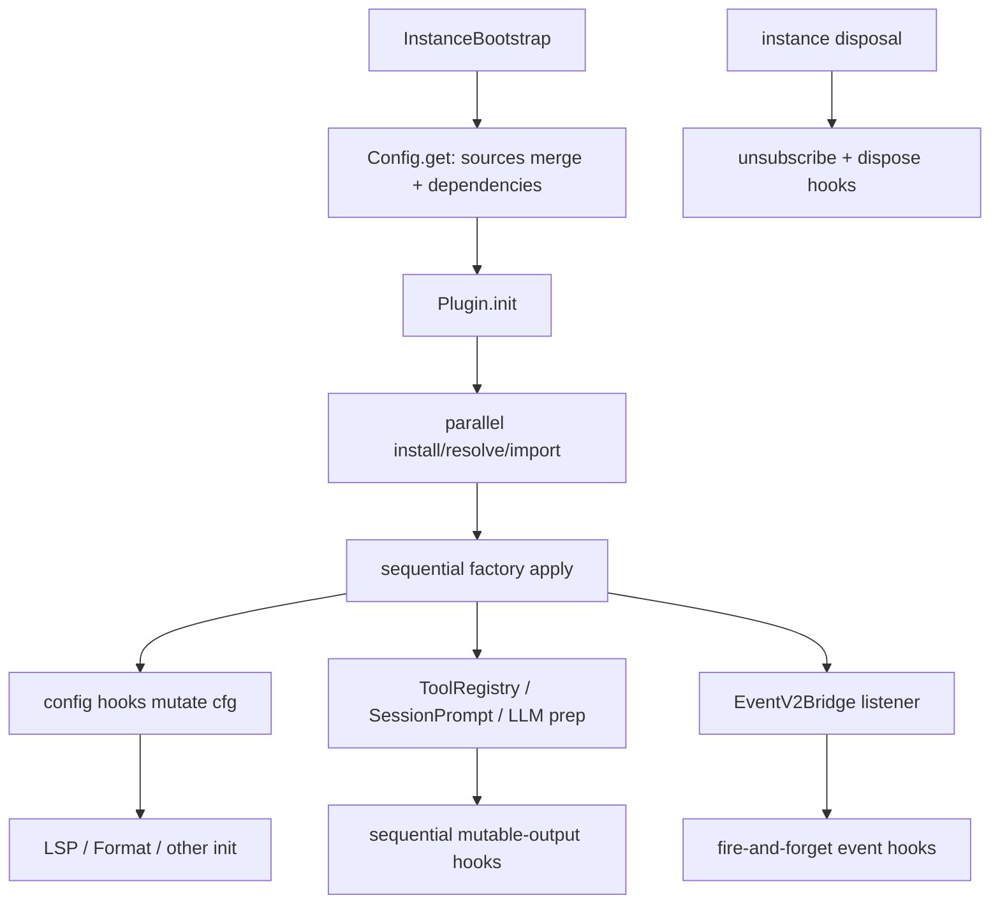
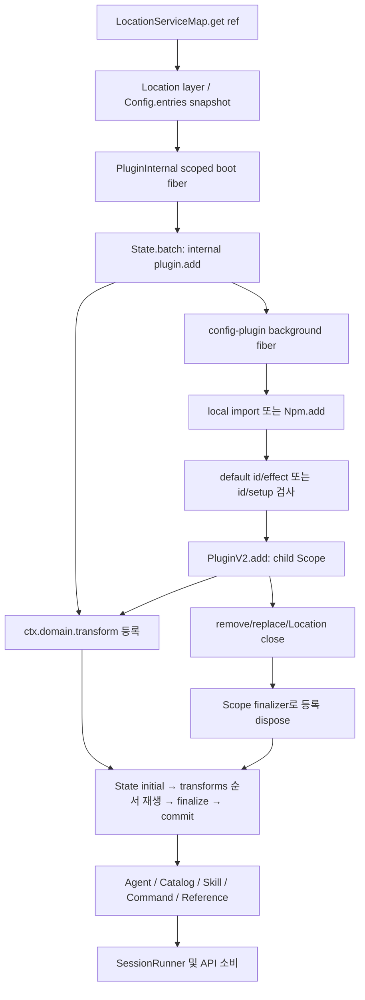
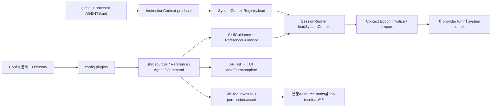
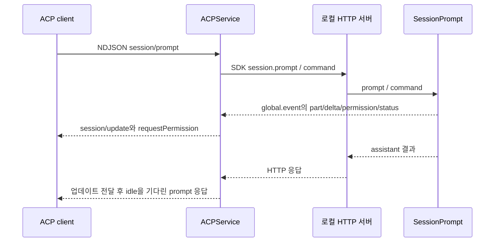

# OpenCode 설정과 확장 기능 분석

분석 기준은 `dev` 브랜치의 커밋 **907b3bc518fa48e90e8ec24dd327d13eee71c36c**이다. 분석일은 2026-10-04 Asia/Seoul이며 checkout HEAD 일치를 확인했다. 범위는 공통 계획의 `06-extensions`: 설정, 공통 플러그인 프레임워크, skill/instruction/command/reference, MCP, LSP/formatter, ACP/IDE, VSCode/GitHub/Slack, control plane과 workspace adapter이다. 소스 checkout은 읽기 전용으로 유지했다.

## 핵심 발견과 읽는 순서

1. **기존 실행과 V2 확장은 함께 존재한다.** 기존 Config/Plugin/MCP/LSP/Format/SessionPrompt 경로가 실제 제품 통합을 수행하고, V2는 Location별 Config 문서와 State transform/Effect Scope 기반 확장을 구축한다. Reference처럼 기존 엔진이 core 서비스를 재사용하는 혼합 지점도 있다.
2. **설정 우선순위는 파일 종류와 소비 도메인에 따라 달라진다.** 기존 구현은 deep merge·특수 배열 병합과 plugin provenance를 사용한다. V2는 ordered entries와 도메인별 projection을 사용하고 provider policy는 역순이다.
3. **설정 호환은 기능·ABI 호환을 보장하지 않는다.** V1→V2 migration과 V2→V1 lowering은 별개이며 손실·충돌 진단이 있다. legacy plugin 함수가 native plugin 객체로 바뀌는 어댑터는 없고 MCP timeout vocabulary도 양쪽에서 다르다.
4. **플러그인 lifecycle의 핵심은 등록 수명이다.** 기존 구현은 instance hooks와 cleanup, V2는 child Scope와 재생 가능한 transform이다. native setup 실패/replace/remove가 등록을 정리하지만 계획에 있는 순서 유지·일반 coalescing·자동 watcher·tool/session/event 확장 전체가 구현된 것은 아니다.
5. **V2 타입과 실제 기능 연결을 나누어 읽어야 한다.** native mcp/lsp/formatter 설정 타입이 있어도 native runner에는 해당 transport/leaf가 연결되지 않았다. config.instructions도 schema에는 있지만 native producer는 AGENTS.md만 읽는다.
6. **외부 클라이언트의 `sdk/v2` 이름만으로 엔진을 판단하면 안 된다.** ACP, VSCode, Slack과 실제 GitHub Action은 기존 `/session` 또는 SessionPrompt 경로를 사용한다. workspace adapter는 실행 환경 준비/연결과 이벤트 동기화 계약이며 범용 분산 SessionRunner 구현을 뜻하지 않는다.

각 결론의 코드와 테스트 근거는 해당 절에 커밋 고정 GitHub 링크로 연결한다. 이 보고서에서 **구현**은 지정 커밋 소스에서 추적한 사실, **명세**는 목표/검토 문서의 요구, **해석**은 코드에서 도출했으나 실행하지 않은 제약을 뜻한다. 테스트는 별도로 명시한 경우를 제외하고 모두 **소스 열람**이다. 저장소 기능 테스트·typecheck·실제 provider/외부 서비스 호출은 실행하지 않았다.

## 책임과 조사 경계

| 위치 | 확장에서의 책임 | 경계 |
|---|---|---|
| packages/plugin | legacy Plugin/Hooks/custom Tool/Workspace ABI와 별도 native Effect/Promise ABI | TUI rendering/slots는 04-tui, 공급자별 auth는 03-models |
| packages/opencode/src/config, plugin, skill, command, session/instruction | 기존 discovery/merge/install/hooks와 model context 생성 | SessionPrompt orchestration은 01-engine, 도구 settlement/permission은 02-tools |
| packages/core/src/config, plugin, skill, command, instruction-context, reference, integration | Location별 typed state/projection/Scope/credential connection 및 context producers | Provider별 request/refresh는 03-models, durable events/context epoch는 01·05 |
| packages/opencode/src/mcp, lsp, format | 프로토콜 client/process 수명, 외부 도구·진단·포맷 결과의 기존 엔진 연결 | API protocol/auth 전체는 05-data-api |
| packages/opencode/src/acp, ide; sdks/vscode; github; packages/slack | 외부 인터페이스와 기존 engine/API를 연결 | 일반 배포·release는 08-build-ops |
| packages/opencode/src/control-plane; core/src/control-plane | workspace adapter, 환경 준비, connection routing, sync/move glue | 저장·replay 세부는 05, filesystem/worktree/tool 경계는 02 |
| .opencode | 이 저장소가 직접 사용하는 authoring 예시·자산 | TUI smoke plugin/themes는 04, glossary는 command가 명시적으로 참조하는 콘텐츠 |

기존 경로는 `InstanceState` 기반 directory/instance 서비스가 Config와 Plugin을 lazy initialize하고 SessionPrompt가 hook/MCP/tool/LSP를 소비한다. native 경로는 server/embedded application의 LocationServiceMap이 Config/PluginInternal과 domain 서비스를 구성한 뒤 SessionRunner와 list API가 소비한다. 두 경로의 상세 흐름은 아래 절에서 각각 설명한다.

## 기존 구현: 설정의 실제 계층과 우선순위

`packages/opencode/src/config/config.ts`의 Config.Service는 process-global layer 안에 global cache와 directory-keyed InstanceState를 별도로 둔다. `get()`은 per-instance mutable config 객체를 반환한다(614-635). `getGlobal()`은 무한 TTL 캐시(295-307)이다. `InstanceState.make/get`의 ScopedCache key는 directory이며 disposer가 invalidation과 scope finalizer를 실행한다. [Config state](https://github.com/anomalyco/opencode/blob/907b3bc518fa48e90e8ec24dd327d13eee71c36c/packages/opencode/src/config/config.ts#L614-L635), [InstanceState](https://github.com/anomalyco/opencode/blob/907b3bc518fa48e90e8ec24dd327d13eee71c36c/packages/opencode/src/effect/instance-state.ts#L26-L50).

로드 순서는 아래 표의 뒤 항목이 일반 필드를 덮어쓴다. 일반 merge는 remeda mergeDeep이며 `instructions`만 두 source 모두 존재할 때 concat+Set이다(40-51). plugin은 별도 provenance-aware union/dedupe를 수행한다(337-368).

|순서|로드 소스와 구현|
|---|---|
|1|Auth의 wellknown credential마다 `origin/.well-known/opencode`; inline `config`와 선택적 remote_config HTTP 응답을 합친 뒤 로드(370-410)|
|2|전역 config.json→opencode.json→opencode.jsonc; legacy `config` TOML migration도 이 단계(260-293, 412-413)|
|3|OPENCODE_CONFIG 파일(415-418)|
|4|프로젝트 directory→worktree 사이 opencode.json/jsonc를 root-first로 로드(420-424)|
|5|ConfigPaths.directories 각 directory의 `.opencode` 설정, command/agent/mode Markdown, auto-discovered plugin(430-480)|
|6|OPENCODE_CONFIG_CONTENT(482-490)|
|7|활성 account/org config; 실패는 debug log 후 계속(492-528)|
|8|system managed directory의 opencode.json→jsonc(530-536)|
|9|macOS MDM plist(538-548)|
|10|mode→primary agent migration, OPENCODE_PERMISSION, legacy tools→permission, username/autoshare/compaction flags(550-598)|

[전체 instance loader](https://github.com/anomalyco/opencode/blob/907b3bc518fa48e90e8ec24dd327d13eee71c36c/packages/opencode/src/config/config.ts#L328-L610).

프로젝트 일반 JSON 파일은 ConfigPaths.files의 `afs.up(...).toReversed()`로 root-first이고 같은 디렉터리 JSONC가 JSON 뒤에 적용된다. 반면 directories는 `global config→가까운 .opencode→조상 .opencode→home .opencode→OPENCODE_CONFIG_DIR`이다. 이 순서를 config.ts가 다시 뒤집지 않으므로 여러 `.opencode`끼리는 뒤의 조상이 승리한다. 이는 문서화된 'closest wins'로 단순화하면 안 되는 정적 사실이다. [ConfigPaths](https://github.com/anomalyco/opencode/blob/907b3bc518fa48e90e8ec24dd327d13eee71c36c/packages/opencode/src/config/paths.ts#L10-L40), [FSUtil.up](https://github.com/anomalyco/opencode/blob/907b3bc518fa48e90e8ec24dd327d13eee71c36c/packages/core/src/fs-util.ts#L168-L181).

OPENCODE_DISABLE_PROJECT_CONFIG는 프로젝트 JSON/.opencode discovery를 막지만 전역 config, home .opencode, custom config directory까지 막는 것은 아니다. Managed directory는 macOS `/Library/Application Support/opencode`, Windows ProgramData/opencode, 기타 `/etc/opencode`; macOS plist는 사용자별 경로 우선이며 `plutil` JSON 변환 후 MDM metadata를 제거한다. [Managed](https://github.com/anomalyco/opencode/blob/907b3bc518fa48e90e8ec24dd327d13eee71c36c/packages/opencode/src/config/managed.ts#L20-L65).

원격 config는 HttpClient+transient read retry를 사용한다. HTTP 200 HTML 로그인 페이지도 RemoteAuthError로 다룬다(201-225). wellknown token은 authEnv overlay로 URL/header/config 치환에 전달하며 이 단계에서 process.env에 저장하지 않는다(370-405). Account token은 별도로 process.env와 Env.Service에 쓰인다(504-507). [Remote fetching](https://github.com/anomalyco/opencode/blob/907b3bc518fa48e90e8ec24dd327d13eee71c36c/packages/opencode/src/config/config.ts#L201-L225).

주의: MDM plist merge는 `mergePluginOrigins`를 거치지 않고 일반 merge만 수행한다(538-548). server Plugin은 `cfg.plugin_origins`만 로드하므로 MDM의 plugin 필드와 origins 간 정렬이 보장되는지 별도 검증이 필요하다. 또 전역 3개 JSON 파일은 loadGlobal 내부에서 일반 merge한 뒤 Global.Path.config라는 단일 origin으로 붙는다. '원래 선언 파일 provenance를 항상 유지한다'는 표현도 모든 global file에 정확하지 않다.

## 기존 구현: 파싱·변수·Markdown·업데이트

ConfigVariable.substitute는 JSONC 파싱 전 텍스트 치환이다. `{env:NAME}`은 명시 env→process.env→빈 문자열(35-38). `{file:path}`는 declaring config directory 기준, `~/` 확장, 파일 trim 후 JSON string escape를 제거한 내용 삽입(61-85). `//`로 시작하는 행에 있는 file token은 건너뛰며 일반 config에서 없는 파일은 InvalidError, TUI에서 missing=empty이다. [변수 구현](https://github.com/anomalyco/opencode/blob/907b3bc518fa48e90e8ec24dd327d13eee71c36c/packages/opencode/src/config/variable.ts#L33-L90).

ConfigParse.jsonc는 trailing comma를 허용하고 오류 line/column과 input을 보고한다(8-32). schema decode는 errors=all, onExcessProperty=ignore, propertyOrder=original(35-60). 따라서 알 수 없는 top-level 필드를 무조건 reject하지 않으며 permission rule key 순서를 유지한다. Config.loadConfig는 legacy theme/keybinds/tui를 삭제하고 V2 lowering 후 V1 schema decode한다. $schema가 없으면 **원본 텍스트**에 schema를 삽입하는 best-effort write를 하므로 치환된 secret이나 lowered projection을 저장하지 않는다(227-250). [파서](https://github.com/anomalyco/opencode/blob/907b3bc518fa48e90e8ec24dd327d13eee71c36c/packages/opencode/src/config/parse.ts#L8-L60), [loadConfig](https://github.com/anomalyco/opencode/blob/907b3bc518fa48e90e8ec24dd327d13eee71c36c/packages/opencode/src/config/config.ts#L227-L250).

ConfigAgent는 `{agent,agents}/**/*.md`, ConfigCommand는 `{command,commands}/**/*.md`, legacy mode는 `{mode,modes}/*.md`를 glob한다. Markdown body가 prompt/template, YAML frontmatter가 나머지 설정이다. 이름은 스캔 directory에 대한 relative path의 anchored prefix와 확장자를 제거하므로 nested/team 이름을 보존하고 부모 경로의 `agent` 문자열 오인식을 막는다. Markdown parser는 core/config/markdown에 위임한다. parse 실패는 각 scanner에서 skip; 유효 Markdown의 agent/command schema 오류는 throw, mode schema 오류는 skip이다. [agent](https://github.com/anomalyco/opencode/blob/907b3bc518fa48e90e8ec24dd327d13eee71c36c/packages/opencode/src/config/agent.ts#L11-L57), [command](https://github.com/anomalyco/opencode/blob/907b3bc518fa48e90e8ec24dd327d13eee71c36c/packages/opencode/src/config/command.ts#L13-L36), [entry-name](https://github.com/anomalyco/opencode/blob/907b3bc518fa48e90e8ec24dd327d13eee71c36c/packages/opencode/src/config/entry-name.ts#L8-L18).

Config.update는 현재 directory/**config.json**에 raw original 구조와 patch를 deep merge해서 JSON stringify한다(638-650). get의 프로젝트 discovery는 opencode.json/jsonc이므로 이 쓰기 목적지가 실제 후속 get에 적용되는지는 API 소비자 계약 확인이 필요하다. update 자체는 instance cache를 invalidate하지 않는다. HTTP handler는 update 후 markInstanceForDisposal을 호출한다. [update](https://github.com/anomalyco/opencode/blob/907b3bc518fa48e90e8ec24dd327d13eee71c36c/packages/opencode/src/config/config.ts#L638-L650), [HTTP caller](https://github.com/anomalyco/opencode/blob/907b3bc518fa48e90e8ec24dd327d13eee71c36c/packages/opencode/src/server/routes/instance/httpapi/handlers/config.ts#L18-L21).

updateGlobal은 jsonc→json→config.json 중 첫 존재 파일, 없으면 jsonc를 택한다(140-147). JSONC recursive modify로 주석을 보존하고 JSON은 raw V2 구조를 보존한 채 stringify한다(656-679). `shell:""`은 global에서는 필드 삭제 sentinel, project에서는 빈 값 유지. plugin_origins는 writable에서 제외한다(164-173). changed일 때만 global cache invalidate; global HTTP handler도 changed일 때 비동기로 모든 instance를 dispose하고 event를 낸다. 일반 updateGlobal에는 plugin installer와 같은 flock이 없다. [global write](https://github.com/anomalyco/opencode/blob/907b3bc518fa48e90e8ec24dd327d13eee71c36c/packages/opencode/src/config/config.ts#L656-L679), [global HTTP](https://github.com/anomalyco/opencode/blob/907b3bc518fa48e90e8ec24dd327d13eee71c36c/packages/opencode/src/server/routes/instance/httpapi/handlers/global.ts#L74-L81).

## 기존 구현: V2→기존 V1 호환의 범위

ConfigV2Compat.lower는 V2 엔진을 실행하는 adapter가 아니라 지원 가능한 V2 **설정 문법을 V1로 투영**한다. 스키마 validate 이전에 native `permissions`가 root/agents/agent/mode 어디에든 있으면 빈 배열·malformed 값 포함 hard reject한다. 권한 의미를 추측 변환하지 않는다(91-113). unsupported/invalid/conflict diagnostics는 path/kind/message만 포함한다. [compat entry](https://github.com/anomalyco/opencode/blob/907b3bc518fa48e90e8ec24dd327d13eee71c36c/packages/opencode/src/config/v2-compat.ts#L91-L131).

|V2 설정|V1 투영/손실|
|---|---|
|snapshots/media|snapshot/attachment; 같은 document에 V1 field 있으면 V1 우선(134-142)|
|model string #variant/object|provider/model로 투영; top-level variant는 unsupported(145-151,350-359)|
|skills array|로컬 paths / HTTP urls 객체로 분리(154-161)|
|compaction keep.tokens/buffer|preserve_recent_tokens/reserved(164-185)|
|agents|agent, system→prompt, disabled→disable, request.body→options, request.headers unsupported(207-225,396-407)|
|commands|command와 model/variant 투영(228-242,409-410)|
|mcp.servers|flat mcp name map; disabled→enabled, OAuth snake_case→camelCase(244-331,369-393)|
|MCP timeout object|startup가 없고 catalog=execution 둘 다 있을 때만 scalar; global은 experimental.mcp_timeout(300-310,362-366)|
|plugins/providers/websearch/warming|unsupported 진단 후 V1 schema가 unknown field를 무시(117-118)|
|custom LSP without extensions|V1에서 표현 불가해 omit; builtin/disabled/extension 명시 서버 유지(334-348)|

[변환 함수](https://github.com/anomalyco/opencode/blob/907b3bc518fa48e90e8ec24dd327d13eee71c36c/packages/opencode/src/config/v2-compat.ts#L334-L410). 같은 document의 native/legacy conflict는 legacy 우선이지만 **다른 파일의 더 높은 우선순위 native projection**은 이전 파일 V1 값을 덮어쓸 수 있다. update는 raw V2 fields를 보존하므로 읽기 호환이 파일을 V1로 영구 migration하지 않는다.

추가 실행 계약 손실: ConfigCommandV1.Info에 variant가 있고 lowerCommand도 이를 만들지만 legacy Command.Info 및 command copy에 variant가 없다. SessionPrompt.command는 input.variant만 prompt에 전달한다. 따라서 command config의 variant를 lowering에서 보존했다는 사실만으로 실제 LLM variant 적용까지 보장하면 안 된다. [V1 config command](https://github.com/anomalyco/opencode/blob/907b3bc518fa48e90e8ec24dd327d13eee71c36c/packages/core/src/v1/config/command.ts#L5-L12), [Command mapping](https://github.com/anomalyco/opencode/blob/907b3bc518fa48e90e8ec24dd327d13eee71c36c/packages/opencode/src/command/index.ts#L90-L102), [prompt input](https://github.com/anomalyco/opencode/blob/907b3bc518fa48e90e8ec24dd327d13eee71c36c/packages/opencode/src/session/prompt.ts#L1466-L1473).

TUI 설정은 별도 TuiConfig.Service의 tui.json/jsonc이고 server Config는 TUI keys를 제거한다. TUI loader는 read/parse/schema/plugin 오류를 log+skip하며 variables missing=empty, 알 수 없는 keybind 제거, host sound path resolve를 한다(99-147). TUI migration은 tui.json이 없는 directory에서 theme/keybinds/선택된 legacy tui fields를 추출하고 backup 후 원본 keys를 strip한다(29-67,89-113). server/npm와 TUI entrypoint 분리는 여기 확인했으나 렌더링/runtime 자세한 책임은 04다. [TUI config](https://github.com/anomalyco/opencode/blob/907b3bc518fa48e90e8ec24dd327d13eee71c36c/packages/opencode/src/config/tui.ts#L99-L147), [migration](https://github.com/anomalyco/opencode/blob/907b3bc518fa48e90e8ec24dd327d13eee71c36c/packages/opencode/src/config/tui-migrate.ts#L29-L67).

## 기존 구현: 공통 plugin discovery·install·load

Config plugin spec은 string 또는 `[string, options record]`. `{plugin,plugins}/*.{ts,js}`만 auto-discovery한다. configured path-like specs는 **선언 파일 기준으로** file URL로 normalize하므로 후속 merge가 base directory를 바꾸지 않는다. `.tsx`는 legacy server auto-discovery 대상이 아니다. Dedupe identity는 npm package name(버전 제외) 또는 exact file URL이고 뒤 source가 승리한다. [ConfigPlugin](https://github.com/anomalyco/opencode/blob/907b3bc518fa48e90e8ec24dd327d13eee71c36c/packages/opencode/src/config/plugin.ts#L18-L76).

Config 초기화는 각 config directory에 gitignore를 best-effort 생성하고 `@opencode-ai/plugin`을 Npm.Service.install로 background detached fiber 설치한다. dependency 실패는 warning 후 void이며 waitForDependencies는 모든 fiber를 join한다. External server plugin이 있으면 index가 **먼저 wait**하고 loader를 호출한다. [dependency stage](https://github.com/anomalyco/opencode/blob/907b3bc518fa48e90e8ec24dd327d13eee71c36c/packages/opencode/src/config/config.ts#L450-L479).

PluginLoader는 plan→resolve target/install→entry detection→npm compatibility→dynamic import→caller finish를 분리한다. `loadExternal`은 Promise.all로 parallel resolve/import하고 successful 결과의 config order를 보존한다. deprecated Codex/Copilot npm names는 silent skip; 이는 built-in auth plugin으로 옮겼기 때문이다. [loader pipeline](https://github.com/anomalyco/opencode/blob/907b3bc518fa48e90e8ec24dd327d13eee71c36c/packages/opencode/src/plugin/loader.ts#L86-L144), [batch/retry](https://github.com/anomalyco/opencode/blob/907b3bc518fa48e90e8ec24dd327d13eee71c36c/packages/opencode/src/plugin/loader.ts#L203-L235).

file target은 package directory 또는 index.{ts,tsx,js,mjs,cjs}로 resolve. npm target은 Npm.add; 무버전 package는 @latest. package `exports["./server"]`/`exports["./tui"]`에서 string/import/default를 읽고 server만 main fallback. package export의 `.`는 server fallback으로 쓰지 않는다. entry는 package directory 바깥으로 나갈 수 없다. engines.opencode gate는 npm만, 유효 semver 및 major!=0일 때 적용한다. [shared resolution](https://github.com/anomalyco/opencode/blob/907b3bc518fa48e90e8ec24dd327d13eee71c36c/packages/opencode/src/plugin/shared.ts#L89-L169), [compat/install](https://github.com/anomalyco/opencode/blob/907b3bc518fa48e90e8ec24dd327d13eee71c36c/packages/opencode/src/plugin/shared.ts#L194-L235).

retry는 file pre-import install 단계의 'missing package.json or index file'만, wait callback 있으면 dependency 준비 후 한 번이다. dynamic import 이후 실패는 Bun cache 때문에 재시도하지 않는다. server caller는 wait를 먼저 수행하고 loader에 wait callback을 넘기지 않는다. entry missing은 theme-only TUI package도 지원하도록 별도 callback을 제공한다.

CLI `plugin <module>`/`plug`는 createPlugTask→installPlugin→readPluginManifest→patchPluginConfig이다. exports별 config default options를 tuple로 쓰며 server는 opencode, tui는 tui 설정 파일을 각각 patch. local Git은 worktree/.opencode, non-Git/root slash는 directory/.opencode, --global은 global config. 기존 package version은 force 없으면 noop; force는 tuple options 유지하고 duplicate package entries를 제거한다. package `oc-themes`만 있어도 TUI target 가능. [CLI](https://github.com/anomalyco/opencode/blob/907b3bc518fa48e90e8ec24dd327d13eee71c36c/packages/opencode/src/cli/cmd/plug.ts#L70-L175), [manifest](https://github.com/anomalyco/opencode/blob/907b3bc518fa48e90e8ec24dd327d13eee71c36c/packages/opencode/src/plugin/install.ts#L128-L165).

patchOne은 config-name별 Flock 아래 read→JSONC validate→modify→write를 수행해 다중 프로세스 update 손실을 막는다. server+tui 두 파일은 순차 개별 lock/write이며 한 transaction은 아니다(421-433). default ConfigPaths.fileInDirectory는 json→jsonc이고 첫 존재 파일, 없으면 json; 일부 installer test fake deps는 jsonc→json이라 그 테스트 출력만으로 production default filename을 판단하면 안 된다. [patching](https://github.com/anomalyco/opencode/blob/907b3bc518fa48e90e8ec24dd327d13eee71c36c/packages/opencode/src/plugin/install.ts#L333-L439).

PluginMeta는 state/plugin-meta.json에 id별 fingerprint(파일 mtime 또는 npm requested/resolved version), load_count, first/last/changed time와 copied themes를 기록한다. Flock 보호 touchMany/list. **server Plugin.index는 touch하지 않으며 실제 touchMany 호출자는 [TUI runtime](https://github.com/anomalyco/opencode/blob/907b3bc518fa48e90e8ec24dd327d13eee71c36c/packages/opencode/src/plugin/tui/runtime.ts#L773-L785)**이다. metadata가 공통 서버 plugin hot-reload를 구현한다고 해석하면 안 된다. [Meta](https://github.com/anomalyco/opencode/blob/907b3bc518fa48e90e8ec24dd327d13eee71c36c/packages/opencode/src/plugin/meta.ts#L108-L158).

## 기존 구현: plugin API와 실제 주입점·수명

Public legacy API는 Plugin(input, options)→Promise<Hooks>. input은 SDK client/project/directory/worktree/serverUrl/Bun shell/experimental_workspace.register이며 tool context는 abort, metadata, ask, directory/worktree를 받는다. 새 V1 object module `{id?,server}`와 legacy function export를 모두 읽는다. object default는 server/tui를 동시에 가질 수 없고 file object plugin은 id 필수, npm은 package name fallback. legacy module은 Object.values 모두 server-compatible여야 하므로 helper export가 섞이면 TypeError가 될 수 있다. [API](https://github.com/anomalyco/opencode/blob/907b3bc518fa48e90e8ec24dd327d13eee71c36c/packages/plugin/src/index.ts#L47-L80), [module validation](https://github.com/anomalyco/opencode/blob/907b3bc518fa48e90e8ec24dd327d13eee71c36c/packages/opencode/src/plugin/shared.ts#L272-L323).

server plugin InstanceState는 SDK client를 live Server URL 또는 embedded Server.Default.app.fetch로 구성하고 auth headers와 directory를 넣는다. register adapter는 project.id에 연결된다. built-ins 먼저, external 다음이며 flags.disableDefaultPlugins와 flags.pure는 각각 기본/외부 plugin을 제어한다(143-184). provider auth 내부는 03 담당. [input construction](https://github.com/anomalyco/opencode/blob/907b3bc518fa48e90e8ec24dd327d13eee71c36c/packages/opencode/src/plugin/index.ts#L143-L184).

parallel import 뒤 applyPlugin은 sequential이라 hook registration order가 deterministic. config hook은 같은 cfg object를 받아 mutation할 수 있고 실패는 log+ignore. Bootstrap은 config.get→plugin.init→LSP/formatter 등 init 순서로 이 mutation을 허용한다. event listener는 directory만 필터하고 `{id,type,properties}` legacy shape를 fire-and-forget 전달한다. unsubscribe와 hook.dispose는 InstanceState finalizer에 등록하며 dispose 오류는 ignore. 일반 trigger는 동일 mutable output을 hooks 순서대로 await하고 오류를 별도로 catch하지 않는다. [apply/lifecycle](https://github.com/anomalyco/opencode/blob/907b3bc518fa48e90e8ec24dd327d13eee71c36c/packages/opencode/src/plugin/index.ts#L219-L296), [bootstrap](https://github.com/anomalyco/opencode/blob/907b3bc518fa48e90e8ec24dd327d13eee71c36c/packages/opencode/src/project/bootstrap.ts#L32-L45).

|hook/extension|실제 소비 지점|
|---|---|
|tool definitions|ToolRegistry는 config tool/tools 파일 export 및 Hooks.tool을 수집하고 Zod를 Effect Schema+JSON Schema 경계로 변환(125-204); tool.definition은 model exposure 전에(310-338)|
|tool context|EffectBridge로 Promise ask의 instance/workspace context 보존, output truncate 및 attachments/metadata 반영(143-169)|
|tool.execute.before/after|SessionTools의 model-facing execute wrapper 전후(92-133); subtask와 MCP 경로에도 호출 존재|
|chat.message|SessionPrompt가 parts resolve 후 user message 저장 전에(999-1009)|
|messages/system transform|prompt loop의 messages transform(1255); LLMRequestPrep의 system transform(69-78)|
|chat.params/chat.headers|LLMRequestPrep(114-146); provider-specific 세부는 03|
|command.execute.before|command expansion/agent/subtask resolve 뒤 prompt 앞(1460-1464)|
|shell.env|ShellTool(417), direct prompt shell(554), PTY HTTP handler(71)|
|compaction/text hooks|compaction.ts373/379/500, processor.ts530; 엔진 상세 01|

[tool bridge](https://github.com/anomalyco/opencode/blob/907b3bc518fa48e90e8ec24dd327d13eee71c36c/packages/opencode/src/tool/registry.ts#L125-L204), [execution wrapper](https://github.com/anomalyco/opencode/blob/907b3bc518fa48e90e8ec24dd327d13eee71c36c/packages/opencode/src/session/tools.ts#L92-L133), [LLM prep](https://github.com/anomalyco/opencode/blob/907b3bc518fa48e90e8ec24dd327d13eee71c36c/packages/opencode/src/session/llm/request.ts#L114-L146).

API Hooks에는 [permission.ask](https://github.com/anomalyco/opencode/blob/907b3bc518fa48e90e8ec24dd327d13eee71c36c/packages/plugin/src/index.ts#L261)가 선언돼 있지만 src 전체 검색에서 trigger 호출을 발견하지 못했다. 타입 선언과 실제 주입점이 일치한다고 일반화하면 안 된다. 또한 event promise는 await/catch되지 않아 background hook failure/ordering이 일반 trigger의 계약과 다르다. 자동 server hot reload는 이 구현에서 확인하지 못했으며 config update의 instance disposal이 재초기화 경로다.

## 기존 구현: skills·instructions·commands

Skill은 `.claude/skills/**/SKILL.md`와 `.agents`를 home/project 조상에서 발견하고, Config.directories의 `{skill,skills}`와 cfg.skills.paths/urls를 추가한다. external flags는 Claude only 또는 둘 다 disable. 명시 relative skill path는 current directory 기준이다. name string frontmatter 필요, description optional; description 없는 skill은 lookup/command에는 있지만 fmt catalog에서는 빠진다. invalid frontmatter parse는 Session.Error+log 후 skip. built-in customize-opencode를 먼저 넣어 user disk same name이 덮어쓸 수 있다. [skill discovery](https://github.com/anomalyco/opencode/blob/907b3bc518fa48e90e8ec24dd327d13eee71c36c/packages/opencode/src/skill/index.ts#L173-L243), [built-in and availability](https://github.com/anomalyco/opencode/blob/907b3bc518fa48e90e8ec24dd327d13eee71c36c/packages/opencode/src/skill/index.ts#L273-L315).

Skill load는 unbounded concurrent add이며 same-name은 warning 후 shared dictionary overwrite(125-139,240-243). 따라서 discovery source 순서와 duplicate name winner가 결정적이라고 보장할 근거는 없다. available(agent)는 skill permission deny를 제외하고 SystemPrompt.skills는 disabled skill tool 검사 및 catalog를 system에 넣는다. SkillTool은 require→ctx.ask(skill,name)→Ripgrep 부속 파일 최대 10개 샘플→content/base directory 반환. builtin `<built-in>`은 tool에서 별도 base-dir 처리하지 않아 virtual location 부속 파일 탐색이 의도대로인지 미검증. [tool](https://github.com/anomalyco/opencode/blob/907b3bc518fa48e90e8ec24dd327d13eee71c36c/packages/opencode/src/tool/skill.ts#L21-L66), [system injection](https://github.com/anomalyco/opencode/blob/907b3bc518fa48e90e8ec24dd327d13eee71c36c/packages/opencode/src/session/system.ts#L107-L119).

Remote skill Discovery는 URL/index.json `{skills:[{name,files,version?}]}` 계약이다. `cache/skills/name`이 cache key이며 URL별 namespace가 아니다. index는 매번 fetch, unversioned/same version은 기존 file skip; version change는 staging 다운로드 모두 성공 후 version marker와 rename/backup rollback, 실패하면 이전 cache 유지. concurrency는 skill 4/file 8. [remote cache](https://github.com/anomalyco/opencode/blob/907b3bc518fa48e90e8ec24dd327d13eee71c36c/packages/opencode/src/skill/discovery.ts#L49-L131).

Instruction global은 config/AGENTS.md→home/.claude/CLAUDE.md 중 첫 존재, project는 AGENTS.md→CLAUDE.md→CONTEXT.md 중 **첫 존재하는 파일 유형**을 선택한다. `findUp`이 모든 조상을 반환하므로 주석과 달리 그 유형의 모든 ancestor instructions를 포함한다. config.instructions의 absolute/glob/relative/home/HTTP URL도 더한다. files concurrency8/remote4, remote request timeout5s, 실패 빈 문자열. [system paths](https://github.com/anomalyco/opencode/blob/907b3bc518fa48e90e8ec24dd327d13eee71c36c/packages/opencode/src/session/instruction.ts#L110-L168), [findUp](https://github.com/anomalyco/opencode/blob/907b3bc518fa48e90e8ec24dd327d13eee71c36c/packages/core/src/fs-util.ts#L154-L165).

ReadTool의 instruction.resolve는 읽는 파일 directory에서 current instance root 전까지 올라가 nearby 지침을 붙인다. systemPaths/읽는 지침 자체/과거 completed read metadata.loaded/current assistant message claims를 제외한다. compacted read는 과거 loaded에서 제외된다(17-31). text read 결과는 system-reminder와 metadata.loaded에 기록하고 claims는 prompt assistant finalizer에서 clear한다. [resolve](https://github.com/anomalyco/opencode/blob/907b3bc518fa48e90e8ec24dd327d13eee71c36c/packages/opencode/src/session/instruction.ts#L179-L220), [read integration](https://github.com/anomalyco/opencode/blob/907b3bc518fa48e90e8ec24dd327d13eee71c36c/packages/opencode/src/tool/read.ts#L350-L366). V2 InstructionContext의 차이는 아래 native context 절에서 설명한다.

Command InstanceState는 built-in init/review→cfg.command overwrite→MCP prompts overwrite→skill commands(이미 같은 이름 있으면 skip)로 구성한다. MCP template getter는 실제 getPrompt를 lazy 호출하고 text message만 합친다. skill command는 skill.all을 사용하므로 모델 catalog available(agent)와 권한 필터가 다르다. 수동 command 경로는 SkillTool의 ask를 거치지 않고 body를 prompt로 사용한다. [command assembly](https://github.com/anomalyco/opencode/blob/907b3bc518fa48e90e8ec24dd327d13eee71c36c/packages/opencode/src/command/index.ts#L65-L151).

SessionPrompt.command는 command/agent/model 존재 확인, quoted args tokenize, $1..$N(마지막 placeholder는 나머지 args join), $ARGUMENTS raw replacement, placeholder 없으면 args append, `!` shell command를 preferred shell로 parallel 실행, @file reference resolve, command/model/agent 선택, subtask part 또는 normal parts, hook, prompt, Command.Executed event 순서다. inline `!` expansion은 Process.text를 직접 호출하는 경로이며 일반 ShellTool wrapper와 구별해야 한다. [command executor](https://github.com/anomalyco/opencode/blob/907b3bc518fa48e90e8ec24dd327d13eee71c36c/packages/opencode/src/session/prompt.ts#L1356-L1479).

## 기존 구현: 저장소 예시·테스트·잔여 질문

`.opencode/command/commit.md`는 model/subtask frontmatter와 git diff/status의 inline shell expansion을 실제 사용한다(1-37). translate.md는 glossary를 자연어로 참조(1-14)하며 glossary files는 별도 auto config loader 대상이 아니다. `.opencode/agent/triage.md`는 hidden primary+model/color 및 github-triage만 허용한 tools frontmatter(1-9), body의 routing 지침을 보여준다. effect/RTL skill 두 개는 정상 name/description frontmatter+업무 지침이다. `ConfigCommand.load`, `ConfigAgent.load`, `Skill.discoverSkills`의 glob에 정확히 연결되는 **저장소 자체 설정 사례**로 다루고 내용을 실행하거나 외부 repo를 clone하지 않았다. `.opencode/plugins/tui-smoke.tsx`, themes JSON/TUI 설정·렌더링은 04 경계; server auto glob은 이 tsx를 잡지 않는다. [commit example](https://github.com/anomalyco/opencode/blob/907b3bc518fa48e90e8ec24dd327d13eee71c36c/.opencode/command/commit.md#L1-L37), [triage example](https://github.com/anomalyco/opencode/blob/907b3bc518fa48e90e8ec24dd327d13eee71c36c/.opencode/agent/triage.md#L1-L43).

`.opencode/opencode.jsonc`는 Effect repository와 로컬 logs/data reference를 선언하고 두 GitHub custom tool을 기본으로 비활성화한다. custom tool은 legacy `tool()` ABI의 예시다. `github-pr-search`는 공개 저장소 PR 검색 결과를 텍스트로 반환하고, `github-triage`는 선택한 팀에서 임의 담당자를 골라 현재 issue의 assignee를 변경한다. 이 도구들을 실제 호출하지 않았다. [저장소 config](https://github.com/anomalyco/opencode/blob/907b3bc518fa48e90e8ec24dd327d13eee71c36c/.opencode/opencode.jsonc#L5-L19), [검색 도구](https://github.com/anomalyco/opencode/blob/907b3bc518fa48e90e8ec24dd327d13eee71c36c/.opencode/tool/github-pr-search.ts#L23-L64), [triage 도구](https://github.com/anomalyco/opencode/blob/907b3bc518fa48e90e8ec24dd327d13eee71c36c/.opencode/tool/github-triage.ts#L38-L60).

읽은 테스트의 대표 시나리오:

- `config/config.test.ts` sampled: jsonc overrides json(657), env/file substitution와 원본 token 보존(679-741), shell clearing(360-400), raw V2 update fixtures(438-486), native permissions no-write reject(488-585), plugin/instruction merge 및 origins(1189-1320), remote/account/managed/flags 목록. 파일 전체는 2234줄이므로 sampled로 표시.
- `config/v2-compat.test.ts` 전체: fixture read, lossy conversions와 secrets-free diagnostics(87-126), legacy precedence(128-145), malformed V1 그대로 reject, native permission hard reject(206-239), input nonmutation(258-283), projection 미저장(287-313), 실제 Config service native load(315-368).
- `config/markdown.test.ts`, `entry-name.test.ts`, `lsp.test.ts` 전체: permissive YAML parsing, email/backtick @file 제외, nested/Windows 이름 회귀, custom LSP extensions 요구 및 empty array 허용. `config/plugin.test.ts`는 빈 파일이다.
- `plugin/shared.test.ts`, `trigger.test.ts` 전체: npm alias/git spec parsing, sync/async hook await(76-106). `loader-shared.test.ts` sampled: init/import/shape failure에도 다음 plugin(627-775), tuple options(812), config order(852-900), pure(903), pre-import one retry(1137-1306); npm entry/default module 관련 test 이름과 source를 대조.
- `plugin/install.test.ts`, `install-concurrency.test.ts`, `meta.test.ts` 전체: dual server/tui writes, default export config options, JSONC comments, tuple 유지 force replace, scope, malformed/manifest/install 실패; 별도 processes 6개 installer update 및 12개 meta updates. **실행하지 않았다**.
- `skill/skill.test.ts`, `skill/discovery.test.ts`, `tool/skill.test.ts` 전체: 외부 directories flags, description 없는 skills, dirs, typed missing, remote cache/version refresh/partial failure old cache 유지(154-184), content/부속 파일/permission ask(33-93).
- `session/instruction.test.ts` 전체: system global/project, nearby once-per-message/clear/history metadata, Claude-disable. remote instruction HTTP test는 `test.todo`(209)다. `session/prompt.test.ts` sampled: preferred shell inline expansion(1815-1845), unknown command typed error(2444-2470).

대표 테스트 근거: [permissions hard reject](https://github.com/anomalyco/opencode/blob/907b3bc518fa48e90e8ec24dd327d13eee71c36c/packages/opencode/test/config/v2-compat.test.ts#L206-L239), [hook 순차 await](https://github.com/anomalyco/opencode/blob/907b3bc518fa48e90e8ec24dd327d13eee71c36c/packages/opencode/test/plugin/trigger.test.ts#L76-L106), [loader order](https://github.com/anomalyco/opencode/blob/907b3bc518fa48e90e8ec24dd327d13eee71c36c/packages/opencode/test/plugin/loader-shared.test.ts#L852-L900), [remote skill 실패 보존](https://github.com/anomalyco/opencode/blob/907b3bc518fa48e90e8ec24dd327d13eee71c36c/packages/opencode/test/skill/discovery.test.ts#L154-L184), [inline shell](https://github.com/anomalyco/opencode/blob/907b3bc518fa48e90e8ec24dd327d13eee71c36c/packages/opencode/test/session/prompt.test.ts#L1815-L1845), [remote instruction TODO](https://github.com/anomalyco/opencode/blob/907b3bc518fa48e90e8ec24dd327d13eee71c36c/packages/opencode/test/session/instruction.test.ts#L209).

우선 교차 확인 질문은 Config.update의 config.json이 후속 get과 연결되는지(05), MDM plugin origins 정렬, multiple .opencode priority 의도, duplicate skill name의 deterministic winner, builtin skill virtual directory, command-config variant의 실행 손실, API permission.ask 미연결, event hook failure/ordering, V2 instruction paths/URL 연결이다. 이들은 소스에서 보인 경계 또는 미확인점이며 실행 회귀·취약점으로 확정하지 않았다. provider auth internals는 03, TUI plugin rendering/runtime는 04, engine scheduling/compaction 세부는 01, 일반 도구 권한/프로세스 경계는 02, server disposal/events 세부는 05로 넘긴다.

## V2 설정: 합쳐진 객체 대신 순서 있는 원본 문서

`packages/core/src/config.ts`의 `Config.Service`는 `get()`·`update()`를 제공하지 않는다. `entries()`가 저우선순위부터 고우선순위까지 `Document { path?, info } | Directory { path }`를 반환한다. 스칼라가 필요한 소비자는 `Config.latest(entries, key)`로 마지막으로 정의한 값을 선택하고, agent/provider/skill/command/reference는 전용 config 플러그인이 문서 목록을 순회한다. 따라서 V1의 범용 deep merge 규칙을 V2 전체에 적용하면 틀린다. [config.ts:109–145](https://github.com/anomalyco/opencode/blob/907b3bc518fa48e90e8ec24dd327d13eee71c36c/packages/core/src/config.ts#L109-L145)

검색 순서는 global `opencode.json`→`opencode.jsonc`→global Directory, project root에서 열린 디렉터리까지의 직접 JSON/JSONC 파일, root에서 가까운 순서의 `.opencode` 내부 JSON/JSONC와 각각의 Directory이다. 모든 `.opencode` 문서는 직접 프로젝트 문서 뒤에 오므로 root `.opencode`도 가까운 일반 JSON보다 우선한다. 같은 디렉터리에서는 JSONC가 JSON보다 뒤에 온다. global config 디렉터리 자체를 Location으로 여는 경우 재검색을 피한다. `config.json`은 V2 대상이 아니다. [config.ts:164–203](https://github.com/anomalyco/opencode/blob/907b3bc518fa48e90e8ec24dd327d13eee71c36c/packages/core/src/config.ts#L164-L203) 실제 파일과 ordering을 구성하는 테스트가 있으며 Location을 연 뒤 파일을 바꾸어도 기존 entries가 유지됨을 확인한다. [config.test.ts:164–231](https://github.com/anomalyco/opencode/blob/907b3bc518fa48e90e8ec24dd327d13eee71c36c/packages/core/test/config/config.test.ts#L164-L231) [config.test.ts:727–798](https://github.com/anomalyco/opencode/blob/907b3bc518fa48e90e8ec24dd327d13eee71c36c/packages/core/test/config/config.test.ts#L727-L798)

`experimental.policies`는 일반 설정과 역순이다. 문서 목록을 뒤집어 파일 내부 statement 순서는 유지하고 `policy.load`에 전달한다. 이는 user-global 정책이 repository 정책을 덮어쓰도록 한 선택이다. tool permission rules와 provider 정책은 별개다. 이 순서의 실제 결과는 global deny/project allow 테스트에 들어 있다. [config.ts:204–211](https://github.com/anomalyco/opencode/blob/907b3bc518fa48e90e8ec24dd327d13eee71c36c/packages/core/src/config.ts#L204-L211) [config.test.ts:693–725](https://github.com/anomalyco/opencode/blob/907b3bc518fa48e90e8ec24dd327d13eee71c36c/packages/core/test/config/config.test.ts#L693-L725)

V2 loader는 파일을 읽어 JSONC parse와 Effect Schema decode만 한다. 빈 파일·parse 오류·schema 실패 문서는 반환하지 않으며 초과 필드는 ignore한다. V1의 `{env:...}`/`{file:...}`, well-known remote config, managed config, inline config나 update API를 이 loader가 실행하는 근거는 없다. 이 결론은 이 함수와 dependency에 한정한 정적 확인이며 별도 embedding/CLI 설정까지 부정하는 뜻은 아니다. 설정은 Location layer 생성 시 한 번 읽고 재사용한다. domain `reload()`를 호출해도 `config.entries()`가 같은 snapshot을 주므로 파일 편집을 자동 반영하지 않는다. [config.ts:142–161](https://github.com/anomalyco/opencode/blob/907b3bc518fa48e90e8ec24dd327d13eee71c36c/packages/core/src/config.ts#L142-L161) [config.ts:173–217](https://github.com/anomalyco/opencode/blob/907b3bc518fa48e90e8ec24dd327d13eee71c36c/packages/core/src/config.ts#L173-L217)

### V1 → V2 자동 판별과 변환

`isV1()`은 `command`, `plugin`, `snapshot`, `agent`, `provider`, `permission`, `attachment` 등의 legacy 전용 top-level 키 하나라도 있으면 문서 전체를 V1으로 판별한다. 그 뒤 V1 schema로 decode하고 `migrate()`한 객체를 V2 schema로 decode한다. native 키와 legacy 키를 문서에 섞으면 native-only 필드가 V1 decode 과정에서 무시될 수 있다. 이는 양쪽 필드를 개별적으로 병합하는 호환 계층과 다르다. [migrate.ts:10–33](https://github.com/anomalyco/opencode/blob/907b3bc518fa48e90e8ec24dd327d13eee71c36c/packages/core/src/v1/config/migrate.ts#L10-L33) [config.ts:155–160](https://github.com/anomalyco/opencode/blob/907b3bc518fa48e90e8ec24dd327d13eee71c36c/packages/core/src/config.ts#L155-L160)

변환은 `snapshot→snapshots`, `attachment→attachments`, `agent/mode→agents`, `plugin→plugins`와 tuple options의 객체화, `skills.paths/urls→skills[]`, `command→commands`, `reference→references`, `permission/tools→permissions[]`, `prompt→system`, `disable→disabled`를 포함한다. `write/patch` tool boolean은 `edit`로 통합된다. MCP flat server map은 `mcp.servers`, `enabled`는 `disabled`, timeout 숫자는 `{request}`로 옮긴다. provider options의 native/AI SDK request 변환은 03-models의 경계다. [migrate.ts:35–161](https://github.com/anomalyco/opencode/blob/907b3bc518fa48e90e8ec24dd327d13eee71c36c/packages/core/src/v1/config/migrate.ts#L35-L161)

파일 형식 호환과 플러그인 ABI 호환은 분리해야 한다. legacy `plugin` 문자열을 native `plugins`로 바꾸어도 그 패키지의 default export가 legacy 함수라면 V2 외부 loader의 `{id,effect}`/`{id,setup}` 검사에 맞지 않는다. 이 경우 V2는 loading failure를 무시한다. `ConfigMigrateV1`가 legacy plugin 구현을 변환하는 것은 아니다. [external.ts:15–29](https://github.com/anomalyco/opencode/blob/907b3bc518fa48e90e8ec24dd327d13eee71c36c/packages/core/src/config/plugin/external.ts#L15-L29) [external.ts:73–87](https://github.com/anomalyco/opencode/blob/907b3bc518fa48e90e8ec24dd327d13eee71c36c/packages/core/src/config/plugin/external.ts#L73-L87)

### 각 도메인의 병합은 그 도메인이 소유한다

| 도메인 | 실제 적용 규칙 |
|---|---|
| Agent | global permission 전부를 먼저 기존/새 agent에 붙인 뒤 agent-local 규칙을 붙인다. 정의한 scalar만 교체하고 headers/body는 `Object.assign`; `disabled`면 map에서 제거한다. model만 바꿀 때 기존 variant를 유지한다. |
| Command | 문서의 inline commands와 Directory의 `{command,commands}/**/*.md`를 entries 순서로 처리한다. body는 template, 상대 경로는 이름이므로 `nested/docs`가 된다. |
| Skill | 모든 Directory의 skill/skills를 먼저 등록하고 authored skills 배열을 그 뒤에 등록한다. configured relative source는 문서가 있는 디렉터리 대신 **Location.directory** 기준이다. |
| Reference | 별칭별 map으로 나중 문서가 이긴다. relative local path는 **해당 config 문서 디렉터리** 기준이고 `~/`는 global home이다. |
| Provider | provider/model patch와 variant별 headers/body를 도메인 editor로 투영한다. `model` 기본값은 latest이다. |

근거: [Agent](https://github.com/anomalyco/opencode/blob/907b3bc518fa48e90e8ec24dd327d13eee71c36c/packages/core/src/config/plugin/agent.ts#L54-L115), [Command](https://github.com/anomalyco/opencode/blob/907b3bc518fa48e90e8ec24dd327d13eee71c36c/packages/core/src/config/plugin/command.ts#L20-L82), [Skill](https://github.com/anomalyco/opencode/blob/907b3bc518fa48e90e8ec24dd327d13eee71c36c/packages/core/src/config/plugin/skill.ts#L18-L46), [Reference](https://github.com/anomalyco/opencode/blob/907b3bc518fa48e90e8ec24dd327d13eee71c36c/packages/core/src/config/plugin/reference.ts#L19-L69), [Provider](https://github.com/anomalyco/opencode/blob/907b3bc518fa48e90e8ec24dd327d13eee71c36c/packages/core/src/config/plugin/provider.ts#L13-L110). 경로 기준 차이는 설정을 다른 위치로 옮길 때 실제 의미가 바뀌는 제약이다.

## V2 플러그인: 등록을 Scope에 귀속하고 상태를 재생한다

### 실제 package ABI와 boot 경로

`@opencode-ai/plugin`은 legacy root/tool/tui와 `v2/effect`, `v2/promise`를 별도로 export한다. native Effect plugin은 `{ id, effect(ctx): Effect<void,never,Scope> }`, Promise plugin은 `{ id, setup(ctx): Promise<void>|void }`이다. setup 반환값에 hook 객체를 담지 않고 ctx의 등록 API를 호출한다. public domain draft 타입은 generated SDK 타입을 사용하며 core host에서 branded ID/schema로 변환한다. [package.json:11–28](https://github.com/anomalyco/opencode/blob/907b3bc518fa48e90e8ec24dd327d13eee71c36c/packages/plugin/package.json#L11-L28) [plugin.ts:1–16](https://github.com/anomalyco/opencode/blob/907b3bc518fa48e90e8ec24dd327d13eee71c36c/packages/plugin/src/v2/effect/plugin.ts#L1-L16) [plugin.ts:1–15](https://github.com/anomalyco/opencode/blob/907b3bc518fa48e90e8ec24dd327d13eee71c36c/packages/plugin/src/v2/promise/plugin.ts#L1-L15) [host.ts:20–42](https://github.com/anomalyco/opencode/blob/907b3bc518fa48e90e8ec24dd327d13eee71c36c/packages/core/src/plugin/host.ts#L20-L42)

실제 `locationServices`에 Config, Agent, Command, Reference, Integration, Catalog, AISDK, PluginV2, PluginInternal, Skill, SystemContext가 들어 있다. Location ref로 LayerMap을 만들고 fresh layer를 구성하며 idle TTL은 60분이다. 프로그램 전역 singleton 플러그인이 아니라 Location별 서비스/등록/Scope가 핵심이다. [location-services.ts:42–79](https://github.com/anomalyco/opencode/blob/907b3bc518fa48e90e8ec24dd327d13eee71c36c/packages/core/src/location-services.ts#L42-L79) [location-services.ts:84–111](https://github.com/anomalyco/opencode/blob/907b3bc518fa48e90e8ec24dd327d13eee71c36c/packages/core/src/location-services.ts#L84-L111)

이 구성은 선언만 있는 layer가 아니다. native server routes가 LocationServiceMap unbound node를 요구하고 `AppNodeBuilder.build`가 실제 map 구현으로 교체한다. Location middleware는 query `location[directory]`/`location[workspace]` 또는 x-opencode headers로 ref를 정한 뒤 그 map의 layer를 request effect에 제공한다. command/skill/reference API handler가 그 안의 해당 service를 호출하고 응답에 Location metadata를 넣는다. [routes.ts:26–37](https://github.com/anomalyco/opencode/blob/907b3bc518fa48e90e8ec24dd327d13eee71c36c/packages/server/src/routes.ts#L26-L37) [routes.ts:51–59](https://github.com/anomalyco/opencode/blob/907b3bc518fa48e90e8ec24dd327d13eee71c36c/packages/server/src/routes.ts#L51-L59) [app-node-builder.ts:6–16](https://github.com/anomalyco/opencode/blob/907b3bc518fa48e90e8ec24dd327d13eee71c36c/packages/core/src/effect/app-node-builder.ts#L6-L16) [location.ts:15–60](https://github.com/anomalyco/opencode/blob/907b3bc518fa48e90e8ec24dd327d13eee71c36c/packages/server/src/location.ts#L15-L60)

`PluginInternal`은 공통 host와 내부 서비스를 연결하고 boot `State.batch` 안에서 순서대로 등록한다: config-reference → built-in agent/command/skill → models.dev → config-agent/command/skill → provider plugins → external configured plugins → config-provider → variant. 실제 순서는 목표 문서의 도식과 완전히 같지 않다. boot는 `forkScoped(startImmediately)`이고 외부 플러그인 로딩도 별도 scoped fiber이다. slow package 설치가 Location layer 생성 완료를 기다리게 만들지 않는다. [internal.ts:81–124](https://github.com/anomalyco/opencode/blob/907b3bc518fa48e90e8ec24dd327d13eee71c36c/packages/core/src/plugin/internal.ts#L81-L124) [external.ts:39–89](https://github.com/anomalyco/opencode/blob/907b3bc518fa48e90e8ec24dd327d13eee71c36c/packages/core/src/config/plugin/external.ts#L39-L89)

### Discovery·설치·옵션·오류

entries의 Document에서 configured plugins를, Directory에서 정렬한 `{plugin,plugins}/*.{ts,js}`를 모은다. glob은 recursive가 아니고 `.tsx`도 아니다. `./`·`../`는 문서 기준 resolve, `file://`는 파일 경로, absolute는 직접 import, 나머지는 Npm.add 결과 entrypoint를 import한다. 이후 configured 순서대로 실행하며 module **default**가 맞는 plugin 객체여야 한다. ref options는 해당 plugin host에만 `{...host, options}`로 주입한다. npm install 실패·import 실패·잘못된 ABI는 개별 `ignoreCause`라 다음 plugin을 계속 로드한다. legacy package identity dedupe 대신 같은 runtime id이면 PluginV2 replacement가 발생한다. [external.ts:40–87](https://github.com/anomalyco/opencode/blob/907b3bc518fa48e90e8ec24dd327d13eee71c36c/packages/core/src/config/plugin/external.ts#L40-L87)

V2 Npm 서비스는 process-global cache `cache/packages/<spec>`에 npm Arborist로 설치하고 filesystem lock으로 같은 디렉터리를 직렬화한다. `.npmrc`/env 설정은 `@npmcli/config`로 읽으며 lifecycle scripts는 `ignoreScripts:true`다. cache 안에 해당 node_modules 패키지가 존재하면 entrypoint resolve만 하고 새 latest 여부는 조회하지 않는다. 외부 plugin module 실행 자체는 동일 프로세스의 dynamic import로 수행되며 별도 실행 sandbox는 이 경로에 없다. 이는 확장 코드의 실행 계약이지 취약점 재현 결과가 아니다. [npm.ts:87–145](https://github.com/anomalyco/opencode/blob/907b3bc518fa48e90e8ec24dd327d13eee71c36c/packages/core/src/npm.ts#L87-L145) [npm-config.ts:12–32](https://github.com/anomalyco/opencode/blob/907b3bc518fa48e90e8ec24dd327d13eee71c36c/packages/core/src/npm-config.ts#L12-L32)

### Add/remove/wait와 scoped registration

`PluginV2.add(id)`는 id별 mutex를 사용한다. lock 획득 전 loading Set을 검사하므로 로딩 중인 동일 id의 add는 재귀 호출과 동시 요청을 구분하지 않고 load cycle로 거부한다. 같은 id의 기존 child Scope를 닫은 뒤 새 child Scope에서 effect를 수행한다. setup 실패면 child scope를 닫아 이미 등록한 항목을 정리하고 실패 Exit를 저장하여 기존/새 `wait(id)`에 전달한다. 성공 시 Added event를 발행하고 active map에 기록하며 waiters를 깨운다. `remove`는 loading 중 거부, active Scope close와 State batch를 수행한다. Location 종료는 전체 plugin Scope를 닫는다. [plugin.ts:35–133](https://github.com/anomalyco/opencode/blob/907b3bc518fa48e90e8ec24dd327d13eee71c36c/packages/core/src/plugin.ts#L35-L133)

`wait`는 plugin setup의 완료를 뜻한다. plugin이 setup 내부에서 따로 fork한 후 반환하면 background work까지 기다리지 않는다. 특히 `config-plugin` effect 자체가 fork한 뒤 끝나므로 `wait('config-plugin')`은 모든 외부 plugins의 로딩 barrier가 아니다. plugin add/remove에는 일반화된 실행 timeout·retry 정책이 없으며 예상하지 못한 오류는 defect다. [plugin.ts:100–125](https://github.com/anomalyco/opencode/blob/907b3bc518fa48e90e8ec24dd327d13eee71c36c/packages/core/src/plugin.ts#L100-L125) [external.ts:89–90](https://github.com/anomalyco/opencode/blob/907b3bc518fa48e90e8ec24dd327d13eee71c36c/packages/core/src/config/plugin/external.ts#L89-L90)

실패 정리의 경계에도 주의가 필요하다. child Scope를 닫는 onExit는 `effect(host)`에 붙어 있고 Added/active/waiter 성공 처리는 `State.batch` 본문 안에서 수행한다. batch가 마지막에 domain reload를 수행하다 실패하는 경우는 setup effect 실패와 같은 경로가 아니다. **해석:** 이 늦은 materialization 실패에서 active map/Scope까지 원복된다는 보장은 해당 코드에서 확인하지 못했다. 관련 테스트는 setup defect를 검증하며 batch flush defect의 rollback은 실행 미검증 질문으로 남긴다. [plugin.ts:52–80](https://github.com/anomalyco/opencode/blob/907b3bc518fa48e90e8ec24dd327d13eee71c36c/packages/core/src/plugin.ts#L52-L80) [state.ts:33–40](https://github.com/anomalyco/opencode/blob/907b3bc518fa48e90e8ec24dd327d13eee71c36c/packages/core/src/state.ts#L33-L40) [plugin.test.ts:24–37](https://github.com/anomalyco/opencode/blob/907b3bc518fa48e90e8ec24dd327d13eee71c36c/packages/core/test/plugin.test.ts#L24-L37)

`State.create`는 초기값에서 모든 활성 transform을 등록 순서로 재실행하고 finalize 성공 후 새 state를 교체한다. Semaphore 1개로 reload를 직렬화한다. transform 등록과 dispose는 uninterruptible이며 Scope finalizer 또는 명시적 registration.dispose가 활성 항목을 제거하고 다시 materialize한다. dispose는 idempotent다. `State.batch`는 fiber context에 Set<Reload>를 넣어 affected domain마다 한 번 reload한다. 도메인 간 원자 transaction은 없다. [state.ts:29–41](https://github.com/anomalyco/opencode/blob/907b3bc518fa48e90e8ec24dd327d13eee71c36c/packages/core/src/state.ts#L29-L41) [state.ts:61–128](https://github.com/anomalyco/opencode/blob/907b3bc518fa48e90e8ec24dd327d13eee71c36c/packages/core/src/state.ts#L61-L128)

동일 id replacement는 기존 transform을 삭제하고 새 transform을 배열 끝에 추가한다. 따라서 명세의 'same-ID retains order position'을 현재 구현이 보장한다고 말할 수 없다. generic reload는 Semaphore로 직렬화하지만 일반 concurrent reload coalescing이나 같은 domain recursive reload의 명시적 rejection 구현은 이 helper에서 발견하지 못했다. transform 안에서 같은 domain reload를 기다리면 semaphore 재진입이 문제될 수 있다는 해석이며 실행 재현은 하지 않았다. [plugin.ts:54–63](https://github.com/anomalyco/opencode/blob/907b3bc518fa48e90e8ec24dd327d13eee71c36c/packages/core/src/plugin.ts#L54-L63) [state.ts:78–85](https://github.com/anomalyco/opencode/blob/907b3bc518fa48e90e8ec24dd327d13eee71c36c/packages/core/src/state.ts#L78-L85) [state.ts:112–120](https://github.com/anomalyco/opencode/blob/907b3bc518fa48e90e8ec24dd327d13eee71c36c/packages/core/src/state.ts#L112-L120)

`finalize`는 State commit 전이다. 예를 들어 Catalog는 `Event.Updated`를 finalize 안에서 publish한 뒤 State가 committed pointer를 바꾼다. 그래서 'update event는 언제나 새 state commit 뒤'라는 목표 계약을 그대로 사실로 쓰면 안 된다. subscriber가 실제로 stale read를 하는지는 Event 실행/스케줄링을 함께 검증해야 하며 05-data-api와의 질문으로 남긴다. Reference는 finalize 안에서 materialized map을 갱신하고 event를 보내므로 상태 구현 방식도 Catalog와 다르다. [state.ts:66–69](https://github.com/anomalyco/opencode/blob/907b3bc518fa48e90e8ec24dd327d13eee71c36c/packages/core/src/state.ts#L66-L69) [catalog.ts:160–169](https://github.com/anomalyco/opencode/blob/907b3bc518fa48e90e8ec24dd327d13eee71c36c/packages/core/src/catalog.ts#L160-L169) [reference.ts:58–106](https://github.com/anomalyco/opencode/blob/907b3bc518fa48e90e8ec24dd327d13eee71c36c/packages/core/src/reference.ts#L58-L106)

### 공개 host 범위와 Promise bridge

실제 `PluginContext`는 options, agent, aisdk, catalog, command, integration, plugin, reference, skill만 제공한다. 대부분 `transform + reload`이고 AISDK만 sdk/language runtime callbacks다. 타입 파일 `event.ts`, filesystem/path/location/npm.ts가 존재해도 host property로 노출된 것은 아니다. tool/session/event runtime API, 일반 filesystem capability를 현 API로 오인하면 안 된다. [context.ts:12–22](https://github.com/anomalyco/opencode/blob/907b3bc518fa48e90e8ec24dd327d13eee71c36c/packages/plugin/src/v2/effect/context.ts#L12-L22) [host.ts:29–218](https://github.com/anomalyco/opencode/blob/907b3bc518fa48e90e8ec24dd327d13eee71c36c/packages/core/src/plugin/host.ts#L29-L218)

AISDK callbacks는 등록 당시 배열의 순서대로 실행하고 Scope 종료 시 제거한다. native session runner는 Catalog와 Integration을 직접 사용하므로 AISDK hooks의 존재가 모든 provider turn에서 호출된다는 뜻은 아니다. AISDK language cache는 provider/model/variant key로 재사용되며 hook dispose가 이 cache를 지우는 코드는 없다. provider-specific 실제 경로와 credentials refresh는 03-models가 주 담당이다. [aisdk.ts:149–228](https://github.com/anomalyco/opencode/blob/907b3bc518fa48e90e8ec24dd327d13eee71c36c/packages/core/src/aisdk.ts#L149-L228) [model.ts:185–212](https://github.com/anomalyco/opencode/blob/907b3bc518fa48e90e8ec24dd327d13eee71c36c/packages/core/src/session/runner/model.ts#L185-L212)

`PluginPromise.fromPromise`는 Effect context와 plugin Scope를 캡처하여 async setup의 transform 등록을 그 Scope 안에서 실행한다. registration.dispose를 Promise 함수로 감싸고 boot batching context도 보존한다. child Promise plugin은 다시 같은 bridge로 변환한다. 이 wrapper는 legacy Plugin/Hooks 어댑터가 아니다. [promise.ts:11–92](https://github.com/anomalyco/opencode/blob/907b3bc518fa48e90e8ec24dd327d13eee71c36c/packages/core/src/plugin/promise.ts#L11-L92)

현재 실제 domain refresh의 대표 사례는 ModelsDevPlugin이다. integration/catalog transform이 `modelsDev.get()`을 Effect로 수행하고 ModelsDev.Refreshed를 구독하여 integration.reload 뒤 catalog.reload를 호출한다. 초기값과 모든 활성 transform을 다시 재생하므로 다른 config/provider transform도 재적용한다. 반면 config 파일을 다시 읽는 watcher는 이 방식으로 아직 붙어 있지 않다. [models-dev.ts:119–144](https://github.com/anomalyco/opencode/blob/907b3bc518fa48e90e8ec24dd327d13eee71c36c/packages/core/src/plugin/models-dev.ts#L119-L144) [models-dev.ts:178–181](https://github.com/anomalyco/opencode/blob/907b3bc518fa48e90e8ec24dd327d13eee71c36c/packages/core/src/plugin/models-dev.ts#L178-L181)

## V2 skill·instruction·reference·command가 모델과 UI에 들어가는 위치

### Skill: source registry와 content cache

SkillV2는 directory/url/embedded source를 등록하는 State 컨테이너이다. source equality로 중복 source를 제거하고, list는 source 순서로 읽어 name별 map에 저장하므로 **나중 source가 같은 이름을 덮어쓴다**. directory loader는 정렬한 `{*.md,**/SKILL.md}`를 읽는다. root `foo.md`는 frontmatter name 없이 foo로 사용할 수 있으나 nested SKILL.md는 name이 필요하다. description/slash는 optional이다. JSON config만 아니라 built-in customize-opencode도 embedded source로 들어온다. [skill.ts:33–118](https://github.com/anomalyco/opencode/blob/907b3bc518fa48e90e8ec24dd327d13eee71c36c/packages/core/src/skill.ts#L33-L118) [skill.ts:13–29](https://github.com/anomalyco/opencode/blob/907b3bc518fa48e90e8ec24dd327d13eee71c36c/packages/core/src/plugin/skill.ts#L13-L29)

source key별 `Info[]` cache는 최초 list 뒤 계속 유지되며 `SkillV2.reload()`는 sources의 State만 재생한다. content cache를 지우지 않는다. 따라서 skill 파일 편집·같은 URL의 remote version 변경이 같은 Location에서 바로 반영되는 것으로 단정할 수 없다. 코드에는 filesystem watch invalidation에 대한 QUESTION도 남아 있다. [skill.ts:107–127](https://github.com/anomalyco/opencode/blob/907b3bc518fa48e90e8ec24dd327d13eee71c36c/packages/core/src/skill.ts#L107-L127)

remote discovery는 `<base>/index.json`의 skills/name/version/files를 읽어 URL별 hash cache에 다운로드한다. skill concurrency=4, file concurrency=8이고 transient 실패는 jitter/exponential 재시도 두 번을 사용한다. 상대 경로/동일 origin/skill root 포함을 검사한다. version이 바뀌면 staging 디렉터리에 전체를 받은 뒤 rename으로 교체하고 실패 시 이전 cache를 보존한다. version이 없거나 동일하면 기존 파일을 재다운로드하지 않는다. 이 lower-level disk refresh와 SkillV2 메모리 cache 갱신은 별개다. [discovery.ts:12–53](https://github.com/anomalyco/opencode/blob/907b3bc518fa48e90e8ec24dd327d13eee71c36c/packages/core/src/skill/discovery.ts#L12-L53) [discovery.ts:73–207](https://github.com/anomalyco/opencode/blob/907b3bc518fa48e90e8ec24dd327d13eee71c36c/packages/core/src/skill/discovery.ts#L73-L207)

`SkillGuidance.load(agent)`는 permissions로 deny된 skill을 빼고 description이 있는 이름·설명만 system context에 광고한다. 실제 본문은 skill tool이 permission.assert 후 불러온다. 도구는 SKILL.md 외 resource 최대 10개 경로를 정렬해 안내하며 스크립트를 자동 실행하지 않는다. [guidance.ts:46–69](https://github.com/anomalyco/opencode/blob/907b3bc518fa48e90e8ec24dd327d13eee71c36c/packages/core/src/skill/guidance.ts#L46-L69) [skill.ts:63–98](https://github.com/anomalyco/opencode/blob/907b3bc518fa48e90e8ec24dd327d13eee71c36c/packages/core/src/tool/skill.ts#L63-L98)

### Instructions: ambient context의 재관찰

InstructionContext는 global/config/AGENTS.md 및 canonical Location.directory→project.directory 조상들의 **AGENTS.md만** 읽는다. project opt-out 또는 canonical project 밖이면 프로젝트 검색을 건너뛴다. global 뒤 가까운 파일부터 root 파일 순으로 렌더링하며 경로를 canonicalize/dedupe한다. V1의 CLAUDE.md/CONTEXT.md fallback, authored instructions local/glob/URL, read할 파일 아래쪽의 추가 instructions는 이 producer에서 구현하지 않는다. config.Info.instructions를 보존하는 것과 실제 주입은 다른 사실이다. [instruction-context.ts:40–74](https://github.com/anomalyco/opencode/blob/907b3bc518fa48e90e8ec24dd327d13eee71c36c/packages/core/src/instruction-context.ts#L40-L74)

한 번 등록한 producer의 `load`가 각 observation에서 파일을 다시 읽는다. 내용 변경/삭제는 SystemContext update/removal text로 표현하고, 이미 발견한 파일이 read 전 사라지거나 search/read가 실패하면 Unavailable로 처리하여 기존 context snapshot을 보존한다. '없음'과 '관찰 불가능'을 구분하는 설계다. 빈 AGENTS.md는 available empty content이다. [instruction-context.ts:29–38](https://github.com/anomalyco/opencode/blob/907b3bc518fa48e90e8ec24dd327d13eee71c36c/packages/core/src/instruction-context.ts#L29-L38) [instruction-context.ts:71–89](https://github.com/anomalyco/opencode/blob/907b3bc518fa48e90e8ec24dd327d13eee71c36c/packages/core/src/instruction-context.ts#L71-L89) [instruction-context.test.ts:73–106](https://github.com/anomalyco/opencode/blob/907b3bc518fa48e90e8ec24dd327d13eee71c36c/packages/core/test/instruction-context.test.ts#L73-L106) [instruction-context.test.ts:112–213](https://github.com/anomalyco/opencode/blob/907b3bc518fa48e90e8ec24dd327d13eee71c36c/packages/core/test/instruction-context.test.ts#L112-L213)

### Reference: 선언·materialization·guidance·파일 mention

Reference는 config/plugin transform으로 local 또는 git source를 name별 등록한다. 잘못된 alias/remote repository/branch는 건너뛰고 local path는 존재 검사를 하지 않는다. git source는 Repository.cachePath를 즉시 Info에 넣고 RepositoryCache.ensure(refresh:true)를 Location Scope의 fiber로 실행한다. list 또는 reference.updated가 clone 성공/readiness를 뜻하지 않는다. 실패는 warning이고 reference 선언은 남을 수 있다. [reference.ts:19–69](https://github.com/anomalyco/opencode/blob/907b3bc518fa48e90e8ec24dd327d13eee71c36c/packages/core/src/config/plugin/reference.ts#L19-L69) [reference.ts:58–106](https://github.com/anomalyco/opencode/blob/907b3bc518fa48e90e8ec24dd327d13eee71c36c/packages/core/src/reference.ts#L58-L106)

ReferenceGuidance는 description이 있는 reference의 name/path/description을 system context에 싣는다. `hidden` 필터는 guidance 쪽에 없으며 hidden은 TUI autocomplete에서 사용된다. agent tool의 external_directory 권한과 서로 별개이며 V2 core reference 등록만으로 filesystem access 허용을 자동 보장하지 않는다. [guidance.ts:40–61](https://github.com/anomalyco/opencode/blob/907b3bc518fa48e90e8ec24dd327d13eee71c36c/packages/core/src/reference/guidance.ts#L40-L61) [autocomplete.tsx:423–441](https://github.com/anomalyco/opencode/blob/907b3bc518fa48e90e8ec24dd327d13eee71c36c/packages/tui/src/component/prompt/autocomplete.tsx#L423-L441)

기존 엔진도 core Reference를 일부 재사용한다. legacy Agent는 reference config가 있으면 `PluginV2.wait('core/config-reference')` 후 Reference.list의 directory에 대한 기본 external-directory allow를 구성한다. SystemPrompt.environment는 LocationServiceMap의 Reference.list를 읽어 설명 있는 reference를 모델 prompt에 넣는다. 즉 reference는 legacy와 V2가 혼합된 연결 지점이다. [agent.ts:102–112](https://github.com/anomalyco/opencode/blob/907b3bc518fa48e90e8ec24dd327d13eee71c36c/packages/opencode/src/agent/agent.ts#L102-L112) [system.ts:68–102](https://github.com/anomalyco/opencode/blob/907b3bc518fa48e90e8ec24dd327d13eee71c36c/packages/opencode/src/session/system.ts#L68-L102)

TUI data provider는 `/api/reference` 응답과 reference.updated를 통해 목록을 갱신한다. autocomplete는 숨기지 않은 alias를 파일 경로에 연결하고 선택 시 `application/x-directory` FilePart에 실제 cache/local file URL을 넣는다. 확인한 코드는 `@alias` 선택 경로이며 `@alias/path`에 대해 완전한 탐색이 구현되어 있다고 확대하지 않는다. [data.tsx:392–393](https://github.com/anomalyco/opencode/blob/907b3bc518fa48e90e8ec24dd327d13eee71c36c/packages/tui/src/context/data.tsx#L392-L393) [data.tsx:528–536](https://github.com/anomalyco/opencode/blob/907b3bc518fa48e90e8ec24dd327d13eee71c36c/packages/tui/src/context/data.tsx#L528-L536) [autocomplete.tsx:282–287](https://github.com/anomalyco/opencode/blob/907b3bc518fa48e90e8ec24dd327d13eee71c36c/packages/tui/src/component/prompt/autocomplete.tsx#L282-L287) [autocomplete.tsx:423–441](https://github.com/anomalyco/opencode/blob/907b3bc518fa48e90e8ec24dd327d13eee71c36c/packages/tui/src/component/prompt/autocomplete.tsx#L423-L441)

### Command와 실제 runner 연결

CommandV2에는 built-in init/review와 JSON/Markdown commands를 만드는 registry와 get/list/reload가 있다. config model/agent/variant/subtask metadata도 등록한다. `/api/command` handler는 CommandV2.list를 호출하지만 core SessionRunner에서 CommandV2.get 또는 command expansion을 호출하는 경로는 찾지 못했다. 현재 TUI의 slash 입력 경로는 `sync.data.command`를 검사한 뒤 legacy SDK `session.command`를 호출한다. 따라서 'V2 command registry 있음'과 'V2에서 positional/shell/template command 실행'은 구분해야 한다. [command.ts:22–64](https://github.com/anomalyco/opencode/blob/907b3bc518fa48e90e8ec24dd327d13eee71c36c/packages/core/src/command.ts#L22-L64) [command.ts:30–44](https://github.com/anomalyco/opencode/blob/907b3bc518fa48e90e8ec24dd327d13eee71c36c/packages/core/src/config/plugin/command.ts#L30-L44) [command.ts:1–8](https://github.com/anomalyco/opencode/blob/907b3bc518fa48e90e8ec24dd327d13eee71c36c/packages/server/src/handlers/command.ts#L1-L8) [index.tsx:1071–1091](https://github.com/anomalyco/opencode/blob/907b3bc518fa48e90e8ec24dd327d13eee71c36c/packages/tui/src/component/prompt/index.tsx#L1071-L1091)

V2 SessionRunner의 실제 주입점은 `loadSystemContext = combine(registry.load(), skillGuidance.load(agent), referenceGuidance.load())`이다. selected agent와 Location 일치 검사를 거친 뒤 Context Epoch initialize/prepare, model resolve, tool registry materialize를 수행한다. skill·reference·AGENTS 변경은 이 context 계약을 통해 provider turn에 반영된다. 세부 durable epoch/history 및 실행 직렬화는 01-engine가 담당한다. [llm.ts:168–203](https://github.com/anomalyco/opencode/blob/907b3bc518fa48e90e8ec24dd327d13eee71c36c/packages/core/src/session/runner/llm.ts#L168-L203)

## MCP·LSP·formatter의 기존 런타임과 V2 범위

실제 MCP/LSP/formatter 구현은 `packages/opencode/src`에 있으며 per-instance Effect 서비스다. HTTP API node 등록은 [server/routes/instance/httpapi/server.ts L249–255](https://github.com/anomalyco/opencode/blob/907b3bc518fa48e90e8ec24dd327d13eee71c36c/packages/opencode/src/server/routes/instance/httpapi/server.ts#L249-L255), 프로젝트 bootstrap은 [project/bootstrap.ts L35–44](https://github.com/anomalyco/opencode/blob/907b3bc518fa48e90e8ec24dd327d13eee71c36c/packages/opencode/src/project/bootstrap.ts#L35-L44). Bootstrap은 Config를 읽고 Plugin.init을 먼저 호출한다([project/bootstrap.ts L38–44](https://github.com/anomalyco/opencode/blob/907b3bc518fa48e90e8ec24dd327d13eee71c36c/packages/opencode/src/project/bootstrap.ts#L38-L44)). 그 뒤 LSP/Format 등 init을 병렬 호출하므로 plugin의 config 수정이 서비스 초기화 전에 반영된다.

V2 [core/integration.ts](https://github.com/anomalyco/opencode/blob/907b3bc518fa48e90e8ec24dd327d13eee71c36c/packages/core/src/integration.ts#L140-L194)는 credential 기반 범용 integration registry다. MCP transport·catalog·OAuth callback server 구현이 아니다. [core/integration/connection.ts L1–12](https://github.com/anomalyco/opencode/blob/907b3bc518fa48e90e8ec24dd327d13eee71c36c/packages/core/src/integration/connection.ts#L1-L12)는 schema.Connection 재export뿐이다. 실제 V2 사용 예: [core/session/runner/model.ts L205–211](https://github.com/anomalyco/opencode/blob/907b3bc518fa48e90e8ec24dd327d13eee71c36c/packages/core/src/session/runner/model.ts#L205-L211)이 provider의 integrationID 또는 providerID로 active connection을 선택하고 credential을 resolve해 모델 호출에 주입한다.

[core/tool/builtins.ts L19–29](https://github.com/anomalyco/opencode/blob/907b3bc518fa48e90e8ec24dd327d13eee71c36c/packages/core/src/tool/builtins.ts#L19-L29)에는 dynamic MCP/plugin registration와 LSP 등 도구 연결을 후속 작업으로 남긴 명시적 TODO가 있다. Core location 서비스([core/location-services.ts L49](https://github.com/anomalyco/opencode/blob/907b3bc518fa48e90e8ec24dd327d13eee71c36c/packages/core/src/location-services.ts#L49-L49))에는 Integration은 있으나 MCP/LSP/Format 서비스가 없다. [packages/core/package.json](https://github.com/anomalyco/opencode/blob/907b3bc518fa48e90e8ec24dd327d13eee71c36c/packages/core/package.json#L1-L133)에는 MCP SDK dependency가 없고 opencode package는 SDK 1.29.0을 사용한다. V2 설정 schema의 존재만으로 MCP/LSP/formatter 실행의 포팅 완료를 추정하면 안 된다.

## MCP 연결·catalog·도구 주입

[mcp/index.ts L38](https://github.com/anomalyco/opencode/blob/907b3bc518fa48e90e8ec24dd327d13eee71c36c/packages/opencode/src/mcp/index.ts#L38-L38) 기본 timeout은 30초다. [mcp/index.ts L39](https://github.com/anomalyco/opencode/blob/907b3bc518fa48e90e8ec24dd327d13eee71c36c/packages/opencode/src/mcp/index.ts#L39-L39)는 roots capability만 광고하며 sampling/elicitation/tasks는 주석이다. client 생성 [mcp/index.ts L75](https://github.com/anomalyco/opencode/blob/907b3bc518fa48e90e8ec24dd327d13eee71c36c/packages/opencode/src/mcp/index.ts#L75-L75)는 opencode/version을 전송하고 roots 요청에 instance directory URI 한 개를 반환한다. 상태 union은 connected/disabled/failed/needs_auth/needs_client_registration([mcp/index.ts L83](https://github.com/anomalyco/opencode/blob/907b3bc518fa48e90e8ec24dd327d13eee71c36c/packages/opencode/src/mcp/index.ts#L83-L83)).

remote 연결 [mcp/index.ts L236–338](https://github.com/anomalyco/opencode/blob/907b3bc518fa48e90e8ec24dd327d13eee71c36c/packages/opencode/src/mcp/index.ts#L236-L338): URL 검증 → StreamableHTTP → 일반 연결 실패 시 SSE fallback. custom headers는 두 transport에 전달된다([mcp/index.ts L269](https://github.com/anomalyco/opencode/blob/907b3bc518fa48e90e8ec24dd327d13eee71c36c/packages/opencode/src/mcp/index.ts#L269-L269)). OAuth는 명시 false일 때만 꺼진다([mcp/index.ts L240](https://github.com/anomalyco/opencode/blob/907b3bc518fa48e90e8ec24dd327d13eee71c36c/packages/opencode/src/mcp/index.ts#L240-L240)). Unauthorized/OAuth 관련 에러는 needs_auth 또는 client_registration 상태와 toast로 변환하고 transport fallback을 중단한다([mcp/index.ts L295–331](https://github.com/anomalyco/opencode/blob/907b3bc518fa48e90e8ec24dd327d13eee71c36c/packages/opencode/src/mcp/index.ts#L295-L331)). 인증 실패와 일반 transport 실패는 서로 다른 상태 경로다.

local 연결 [mcp/index.ts L340–370](https://github.com/anomalyco/opencode/blob/907b3bc518fa48e90e8ec24dd327d13eee71c36c/packages/opencode/src/mcp/index.ts#L340-L370): argv를 그대로 spawn하고 cwd는 instance directory 기준 상대경로, env는 process.env/BUN_BE_BUN/설정 env를 합친다. stderr를 로그로 소비하며 연결 timeout 후 client close한다. connectTransport [mcp/index.ts L218–232](https://github.com/anomalyco/opencode/blob/907b3bc518fa48e90e8ec24dd327d13eee71c36c/packages/opencode/src/mcp/index.ts#L218-L232)는 성공 시 client ownership을 호출자에게 넘기고 실패 시 close한다. tools capability 서버의 첫 list 실패는 client를 close하고 failed 상태로 기록한다([mcp/index.ts L391–412](https://github.com/anomalyco/opencode/blob/907b3bc518fa48e90e8ec24dd327d13eee71c36c/packages/opencode/src/mcp/index.ts#L391-L412)).

InstanceState [mcp/index.ts L492–560](https://github.com/anomalyco/opencode/blob/907b3bc518fa48e90e8ec24dd327d13eee71c36c/packages/opencode/src/mcp/index.ts#L492-L560)은 disabled 항목을 연결하지 않고 활성 서버 초기화를 병렬 수행한다. 서버 하나의 실패가 다른 연결을 중단하지 않는다. per-instance cache는 clients/defs/instructions다. native tool definition을 캐시하고 consumers는 복사해야 한다([mcp/index.ts L156–162](https://github.com/anomalyco/opencode/blob/907b3bc518fa48e90e8ec24dd327d13eee71c36c/packages/opencode/src/mcp/index.ts#L156-L162)). 서버 지시문은 trim해 저장하고 연결된 서버 순으로 반환한다([mcp/index.ts L615](https://github.com/anomalyco/opencode/blob/907b3bc518fa48e90e8ec24dd327d13eee71c36c/packages/opencode/src/mcp/index.ts#L615-L615)).

watch [mcp/index.ts L442–472](https://github.com/anomalyco/opencode/blob/907b3bc518fa48e90e8ec24dd327d13eee71c36c/packages/opencode/src/mcp/index.ts#L442-L472)는 client identity를 확인해 교체된 client의 늦은 onclose/list_changed가 현 상태를 덮지 않게 한다. onclose는 cache 삭제→failed Connection closed→ToolsChanged event다. finalizer [mcp/index.ts L531–556](https://github.com/anomalyco/opencode/blob/907b3bc518fa48e90e8ec24dd327d13eee71c36c/packages/opencode/src/mcp/index.ts#L531-L556)는 stdio 하위 프로세스를 pgrep으로 찾아 SIGTERM한 뒤 client를 닫고 cache를 지운다. pendingOAuthTransports는 process-global이라 이 finalizer가 전체 map을 clear한다.

add [mcp/index.ts L641](https://github.com/anomalyco/opencode/blob/907b3bc518fa48e90e8ec24dd327d13eee71c36c/packages/opencode/src/mcp/index.ts#L641-L641)은 runtime s.config에만 기록한다. connect [mcp/index.ts L648](https://github.com/anomalyco/opencode/blob/907b3bc518fa48e90e8ec24dd327d13eee71c36c/packages/opencode/src/mcp/index.ts#L648-L648)은 enabled true를 강제하고 disconnect [mcp/index.ts L653](https://github.com/anomalyco/opencode/blob/907b3bc518fa48e90e8ec24dd327d13eee71c36c/packages/opencode/src/mcp/index.ts#L653-L653)은 runtime disabled로 전환한다. 이 API 동작은 설정 파일 영속 저장과 다르다. timeout 선택 [mcp/index.ts L661–688](https://github.com/anomalyco/opencode/blob/907b3bc518fa48e90e8ec24dd327d13eee71c36c/packages/opencode/src/mcp/index.ts#L661-L688)은 runtime override → static server.timeout → experimental.mcp_timeout이다. prompt/resource 요청도 timeout을 적용한다([mcp/index.ts L740](https://github.com/anomalyco/opencode/blob/907b3bc518fa48e90e8ec24dd327d13eee71c36c/packages/opencode/src/mcp/index.ts#L740-L740)).

Catalog pagination [mcp/catalog.ts L18–36](https://github.com/anomalyco/opencode/blob/907b3bc518fa48e90e8ec24dd327d13eee71c36c/packages/opencode/src/mcp/catalog.ts#L18-L36)은 빈 cursor도 다음 페이지로 취급하고 중복 cursor 및 1000페이지 상한으로 종료한다. Catalog toolName [mcp/catalog.ts L117–120](https://github.com/anomalyco/opencode/blob/907b3bc518fa48e90e8ec24dd327d13eee71c36c/packages/opencode/src/mcp/catalog.ts#L117-L120)은 서버/도구 이름을 sanitize해 `_`로 합친다. 서로 다른 원본 이름이 같은 key가 되는 collision을 거부하는 코드는 없어 Record의 뒤 항목이 앞 항목을 덮을 수 있다(정적 제한).

Catalog convertTool [mcp/catalog.ts L42–83](https://github.com/anomalyco/opencode/blob/907b3bc518fa48e90e8ec24dd327d13eee71c36c/packages/opencode/src/mcp/catalog.ts#L42-L83)은 inputSchema를 복사해 object/properties/additionalProperties=false로 만들고 client.callTool에 timeout, abortSignal, resetTimeoutOnProgress를 전달한다. isError 응답은 throw한다. structuredContent는 content가 비어 있을 때만 JSON text fallback이다([mcp/catalog.ts L75](https://github.com/anomalyco/opencode/blob/907b3bc518fa48e90e8ec24dd327d13eee71c36c/packages/opencode/src/mcp/catalog.ts#L75-L75)). resources는 uri, templates는 uriTemplate을 key로 쓰며 서버 prefix의 `%`/`:`를 escape한다([mcp/catalog.ts L85–115](https://github.com/anomalyco/opencode/blob/907b3bc518fa48e90e8ec24dd327d13eee71c36c/packages/opencode/src/mcp/catalog.ts#L85-L115)).

listTools [mcp/catalog.ts L145–161](https://github.com/anomalyco/opencode/blob/907b3bc518fa48e90e8ec24dd327d13eee71c36c/packages/opencode/src/mcp/catalog.ts#L145-L161)은 특정 output schema 참조 검증 오류에만 느슨한 schema로 재시도한다. 임의 JSON-RPC 오류를 무시하는 fallback은 아니다. session resolve [session/tools.ts L390–489](https://github.com/anomalyco/opencode/blob/907b3bc518fa48e90e8ec24dd327d13eee71c36c/packages/opencode/src/session/tools.ts#L390-L489)는 native MCP definition을 ProviderTransform용 schema로 변환하고 plugin before/after hook, 특정 MCP key permission, 응답 text/image/resource 변환, truncation을 적용한다.

session MCP resource list/read 도구는 read permission `mcp:server:*` 또는 `mcp:server:uri`를 요청한다([session/tools.ts L136](https://github.com/anomalyco/opencode/blob/907b3bc518fa48e90e8ec24dd327d13eee71c36c/packages/opencode/src/session/tools.ts#L136-L136), [session/tools.ts L343](https://github.com/anomalyco/opencode/blob/907b3bc518fa48e90e8ec24dd327d13eee71c36c/packages/opencode/src/session/tools.ts#L343-L343)). blob은 10MiB와 허용 MIME 제한을 적용한다([session/tools.ts L32](https://github.com/anomalyco/opencode/blob/907b3bc518fa48e90e8ec24dd327d13eee71c36c/packages/opencode/src/session/tools.ts#L32-L32)). 최종 모델 tool 광고에서 agent/session 권한과 user.tools false를 적용하는 위치는 [session/llm/request.ts L210–215](https://github.com/anomalyco/opencode/blob/907b3bc518fa48e90e8ec24dd327d13eee71c36c/packages/opencode/src/session/llm/request.ts#L210-L215)다. session tools 조립 위치만 보고 visibility 판단을 끝내면 안 된다.

code mode가 활성일 때 개별 MCP 도구 루프 대신 catalog snapshot을 사용한다([session/tools.ts L388](https://github.com/anomalyco/opencode/blob/907b3bc518fa48e90e8ec24dd327d13eee71c36c/packages/opencode/src/session/tools.ts#L388-L388), [tool/code-mode.ts L207](https://github.com/anomalyco/opencode/blob/907b3bc518fa48e90e8ec24dd327d13eee71c36c/packages/opencode/src/tool/code-mode.ts#L207-L207)). child invoke도 hook/permission/abort/timeout을 별도로 적용한다([tool/code-mode.ts L134–186](https://github.com/anomalyco/opencode/blob/907b3bc518fa48e90e8ec24dd327d13eee71c36c/packages/opencode/src/tool/code-mode.ts#L134-L186)). MCP 지시문은 system prompt에 XML mcp_instructions로 삽입된다([session/system.ts L121](https://github.com/anomalyco/opencode/blob/907b3bc518fa48e90e8ec24dd327d13eee71c36c/packages/opencode/src/session/system.ts#L121-L121)). 해당 서버의 도구가 모두 denied이면 지시문도 제외하되 도구 0개 서버의 지시문은 포함된다. prompt caller는 [session/prompt.ts L1261](https://github.com/anomalyco/opencode/blob/907b3bc518fa48e90e8ec24dd327d13eee71c36c/packages/opencode/src/session/prompt.ts#L1261-L1261).

사용자 MCP resource attachment는 [session/prompt.ts L715](https://github.com/anomalyco/opencode/blob/907b3bc518fa48e90e8ec24dd327d13eee71c36c/packages/opencode/src/session/prompt.ts#L715-L715)에서 readResource를 호출해 synthetic part로 변환한다. 명시적 사용자 attachment 경로와 모델 도구 승인 경로를 구분해야 한다. MCP prompt→command는 [command/index.ts L105–130](https://github.com/anomalyco/opencode/blob/907b3bc518fa48e90e8ec24dd327d13eee71c36c/packages/opencode/src/command/index.ts#L105-L130)에서 `${server}:${prompt}`로 등록하고 `$1...` 인수를 전달하며 text message content만 템플릿에 포함한다. Command.state는 instance cache([command/index.ts L159](https://github.com/anomalyco/opencode/blob/907b3bc518fa48e90e8ec24dd327d13eee71c36c/packages/opencode/src/command/index.ts#L159-L159))이고 ToolsChanged에 의한 갱신 경로는 찾지 못했다.

## MCP OAuth·저장·API

auth 저장은 [mcp/auth.ts L37](https://github.com/anomalyco/opencode/blob/907b3bc518fa48e90e8ec24dd327d13eee71c36c/packages/opencode/src/mcp/auth.ts#L37-L37)의 Global.Path.data/mcp-auth.json, EffectFlock lock과 mode 0600 write([mcp/auth.ts L76–82](https://github.com/anomalyco/opencode/blob/907b3bc518fa48e90e8ec24dd327d13eee71c36c/packages/opencode/src/mcp/auth.ts#L76-L82))다. malformed/missing 파일은 빈 map으로 취급한다. getForUrl [mcp/auth.ts L89–95](https://github.com/anomalyco/opencode/blob/907b3bc518fa48e90e8ec24dd327d13eee71c36c/packages/opencode/src/mcp/auth.ts#L89-L95)는 저장 serverUrl의 정확한 일치를 요구한다. 서버 이름이 같아도 URL 변경 시 기존 token/client를 재사용하지 않는다.

OAuthProvider [mcp/oauth-provider.ts L35](https://github.com/anomalyco/opencode/blob/907b3bc518fa48e90e8ec24dd327d13eee71c36c/packages/opencode/src/mcp/oauth-provider.ts#L35-L35)는 explicit redirectUri → callbackPort → 기본 127.0.0.1:19876 경로 순이다. redirect URL은 HTTP/HTTPS scheme만 허용([mcp/oauth-provider.ts L127](https://github.com/anomalyco/opencode/blob/907b3bc518fa48e90e8ec24dd327d13eee71c36c/packages/opencode/src/mcp/oauth-provider.ts#L127-L127)), PKCE/state는 저장하고 crypto random 32byte state를 쓴다([mcp/oauth-provider.ts L147](https://github.com/anomalyco/opencode/blob/907b3bc518fa48e90e8ec24dd327d13eee71c36c/packages/opencode/src/mcp/oauth-provider.ts#L147-L147)). PendingProvider [mcp/oauth-provider.ts L187–242](https://github.com/anomalyco/opencode/blob/907b3bc518fa48e90e8ec24dd327d13eee71c36c/packages/opencode/src/mcp/oauth-provider.ts#L187-L242)는 재인증 중 기존 저장 credential을 그대로 유지하고 새 client/tokens를 buffer한다. tokens가 있어야 commit하며 최종 auth entry는 현재 URL로 교체한다([mcp/oauth-provider.ts L216](https://github.com/anomalyco/opencode/blob/907b3bc518fa48e90e8ec24dd327d13eee71c36c/packages/opencode/src/mcp/oauth-provider.ts#L216-L216)).

startAuth [mcp/index.ts L806–870](https://github.com/anomalyco/opencode/blob/907b3bc518fa48e90e8ec24dd327d13eee71c36c/packages/opencode/src/mcp/index.ts#L806-L870)은 remote/OAuth 지원을 확인하고 callback server를 준비한 뒤 새 state와 PendingProvider를 만든다. auth flow는 StreamableHTTP만 쓴다. 직접 client.connect([mcp/index.ts L855](https://github.com/anomalyco/opencode/blob/907b3bc518fa48e90e8ec24dd327d13eee71c36c/packages/opencode/src/mcp/index.ts#L855-L855))에는 일반 connectTransport의 timeout wrapper가 없다. authenticate [mcp/index.ts L872–916](https://github.com/anomalyco/opencode/blob/907b3bc518fa48e90e8ec24dd327d13eee71c36c/packages/opencode/src/mcp/index.ts#L872-L916)은 redirect 없는 연결도 list/store 가능하다. browser 경로는 callback wait 등록 후 browser open하고 실패 시 BrowserOpenFailed event를 발행하지만 callback 대기는 유지한다.

finishAuth [mcp/index.ts L918–942](https://github.com/anomalyco/opencode/blob/907b3bc518fa48e90e8ec24dd327d13eee71c36c/packages/opencode/src/mcp/index.ts#L918-L942)는 토큰 교환 성공 후 commit/PKCE 제거/pending 제거/재연결한다. 실패 시 기존 credential 보존. removeAuth [mcp/index.ts L944](https://github.com/anomalyco/opencode/blob/907b3bc518fa48e90e8ec24dd327d13eee71c36c/packages/opencode/src/mcp/index.ts#L944-L944)는 저장 credential 제거와 callback 취소/pending map 삭제다. OAuth callback [mcp/oauth-callback.ts L6](https://github.com/anomalyco/opencode/blob/907b3bc518fa48e90e8ec24dd327d13eee71c36c/packages/opencode/src/mcp/oauth-callback.ts#L6-L6)은 IPv4 loopback만 bind한다. state 필수/known 여부 및 code/error를 검사([mcp/oauth-callback.ts L56–102](https://github.com/anomalyco/opencode/blob/907b3bc518fa48e90e8ec24dd327d13eee71c36c/packages/opencode/src/mcp/oauth-callback.ts#L56-L102)), pending 5분 timeout([mcp/oauth-callback.ts L24](https://github.com/anomalyco/opencode/blob/907b3bc518fa48e90e8ec24dd327d13eee71c36c/packages/opencode/src/mcp/oauth-callback.ts#L24-L24)), idle 시 서버 close([mcp/oauth-callback.ts L35](https://github.com/anomalyco/opencode/blob/907b3bc518fa48e90e8ec24dd327d13eee71c36c/packages/opencode/src/mcp/oauth-callback.ts#L35-L35))다.

callback server와 pending map은 process-global([mcp/oauth-callback.ts L18](https://github.com/anomalyco/opencode/blob/907b3bc518fa48e90e8ec24dd327d13eee71c36c/packages/opencode/src/mcp/oauth-callback.ts#L18-L18)), 서버 port/path도 하나이며 재설정 시 기존 서버를 stop한다([mcp/oauth-callback.ts L105](https://github.com/anomalyco/opencode/blob/907b3bc518fa48e90e8ec24dd327d13eee71c36c/packages/opencode/src/mcp/oauth-callback.ts#L105-L105)). pending transport도 서버 이름만 key다([mcp/index.ts L109](https://github.com/anomalyco/opencode/blob/907b3bc518fa48e90e8ec24dd327d13eee71c36c/packages/opencode/src/mcp/index.ts#L109-L109)). instance 격리와 다른 lifetime 경계가 정적으로 보이지만 동시 cross-instance auth 영향은 실행 미검증이다. CLI [cli/cmd/mcp.ts L452–500](https://github.com/anomalyco/opencode/blob/907b3bc518fa48e90e8ec24dd327d13eee71c36c/packages/opencode/src/cli/cmd/mcp.ts#L452-L500)의 비대화 add는 URL/argv·header/env를 검증하고 global config에 영속 write한다. JSONC modify는 [cli/cmd/mcp.ts L412–426](https://github.com/anomalyco/opencode/blob/907b3bc518fa48e90e8ec24dd327d13eee71c36c/packages/opencode/src/cli/cmd/mcp.ts#L412-L426). interactive local command는 split(" ")([cli/cmd/mcp.ts L569](https://github.com/anomalyco/opencode/blob/907b3bc518fa48e90e8ec24dd327d13eee71c36c/packages/opencode/src/cli/cmd/mcp.ts#L569-L569)), 비대화 argv는 보존된다.

CLI config 후보 검색은 실제 [cli/cmd/mcp.ts L394–410](https://github.com/anomalyco/opencode/blob/907b3bc518fa48e90e8ec24dd327d13eee71c36c/packages/opencode/src/cli/cmd/mcp.ts#L394-L410)에서 json이 jsonc보다 먼저다(주석의 jsonc 우선 설명과 다름). auth CLI는 authenticate로 브라우저/콜백 과정을 사용한다([cli/cmd/mcp.ts L259](https://github.com/anomalyco/opencode/blob/907b3bc518fa48e90e8ec24dd327d13eee71c36c/packages/opencode/src/cli/cmd/mcp.ts#L259-L259)). HTTP API `/mcp` 및 auth/connect/disconnect 계약은 [server/routes/instance/httpapi/groups/mcp.ts L32–39](https://github.com/anomalyco/opencode/blob/907b3bc518fa48e90e8ec24dd327d13eee71c36c/packages/opencode/src/server/routes/instance/httpapi/groups/mcp.ts#L32-L39), instance-context/authorization middleware [server/routes/instance/httpapi/groups/mcp.ts L146–148](https://github.com/anomalyco/opencode/blob/907b3bc518fa48e90e8ec24dd327d13eee71c36c/packages/opencode/src/server/routes/instance/httpapi/groups/mcp.ts#L146-L148). handlers/mcp.ts는 runtime service를 호출하고 typed 404/unsupported OAuth 400을 변환한다.

HTTP connect는 실패 status도 service 내부에 기록되므로 응답 true만으로 connected를 판별할 수 없다([server/routes/instance/httpapi/handlers/mcp.ts](https://github.com/anomalyco/opencode/blob/907b3bc518fa48e90e8ec24dd327d13eee71c36c/packages/opencode/src/server/routes/instance/httpapi/handlers/mcp.ts#L1-L111), [mcp/index.ts L648](https://github.com/anomalyco/opencode/blob/907b3bc518fa48e90e8ec24dd327d13eee71c36c/packages/opencode/src/mcp/index.ts#L648-L648)). status endpoint로 결과 상태를 확인하는 계약이다.

## SDK patch의 역할

root package.json patchedDependencies는 [patches/@modelcontextprotocol%2Fsdk@1.29.0.patch](https://github.com/anomalyco/opencode/blob/907b3bc518fa48e90e8ec24dd327d13eee71c36c/patches/@modelcontextprotocol%252Fsdk@1.29.0.patch#L1-L390)를 사용한다. 설치된 원 SDK 전체는 node_modules가 없어 독해하지 못했다. patch는 관련 CJS와 일부 ESM 구간을 샘플 독해했다. [patches/@modelcontextprotocol%2Fsdk@1.29.0.patch L35](https://github.com/anomalyco/opencode/blob/907b3bc518fa48e90e8ec24dd327d13eee71c36c/patches/@modelcontextprotocol%252Fsdk@1.29.0.patch#L35-L35) session-expired callback, [patches/@modelcontextprotocol%2Fsdk@1.29.0.patch L81](https://github.com/anomalyco/opencode/blob/907b3bc518fa48e90e8ec24dd327d13eee71c36c/patches/@modelcontextprotocol%252Fsdk@1.29.0.patch#L81-L81) reinitialize 분리, [patches/@modelcontextprotocol%2Fsdk@1.29.0.patch L122](https://github.com/anomalyco/opencode/blob/907b3bc518fa48e90e8ec24dd327d13eee71c36c/patches/@modelcontextprotocol%252Fsdk@1.29.0.patch#L122-L122) listTools metadata를 첫 페이지에서만 초기화해 후속 페이지 validator 보존.

[patches/@modelcontextprotocol%2Fsdk@1.29.0.patch L149](https://github.com/anomalyco/opencode/blob/907b3bc518fa48e90e8ec24dd327d13eee71c36c/patches/@modelcontextprotocol%252Fsdk@1.29.0.patch#L149-L149) JSON-RPC 오류 응답을 정상 response 처리해 SSE 재연결 오인을 막고, [patches/@modelcontextprotocol%2Fsdk@1.29.0.patch L159–218](https://github.com/anomalyco/opencode/blob/907b3bc518fa48e90e8ec24dd327d13eee71c36c/patches/@modelcontextprotocol%252Fsdk@1.29.0.patch#L159-L218) HTTP session 404에 단일 recovery promise로 초기화/한 차례 재시도하며 취소된 request를 재실행하지 않는다. [patches/@modelcontextprotocol%2Fsdk@1.29.0.patch L297–305](https://github.com/anomalyco/opencode/blob/907b3bc518fa48e90e8ec24dd327d13eee71c36c/patches/@modelcontextprotocol%252Fsdk@1.29.0.patch#L297-L305) OAuth scope 선택 및 지원/refresh grant 조건의 offline_access 추가, [patches/@modelcontextprotocol%2Fsdk@1.29.0.patch L334](https://github.com/anomalyco/opencode/blob/907b3bc518fa48e90e8ec24dd327d13eee71c36c/patches/@modelcontextprotocol%252Fsdk@1.29.0.patch#L334-L334) token membership 비교. 관련 session-recovery/transport/catalog/oauth-provider 테스트 소스가 각 계약을 검증하도록 작성되어 있다.

## V2 Integration 계약

[core/integration.ts L140–194](https://github.com/anomalyco/opencode/blob/907b3bc518fa48e90e8ec24dd327d13eee71c36c/packages/core/src/integration.ts#L140-L194)는 register/transform/list/get, connection(active/resolve/key/oauth/update/remove), attempt(status/complete/cancel)를 제공한다. locationLayer [core/integration.ts L221](https://github.com/anomalyco/opencode/blob/907b3bc518fa48e90e8ec24dd327d13eee71c36c/packages/core/src/integration.ts#L221-L221)은 Credential/Event/Scope에 의존하고 registry는 초기 빈 상태다. scoped transform([core/integration.ts L234–270](https://github.com/anomalyco/opencode/blob/907b3bc518fa48e90e8ec24dd327d13eee71c36c/packages/core/src/integration.ts#L234-L270))은 ref 및 key/env/OAuth method를 합치고 scope finalizer가 원래 상태를 복구한다. 등록은 Event.Updated를 발행한다([core/integration.ts L285](https://github.com/anomalyco/opencode/blob/907b3bc518fa48e90e8ec24dd327d13eee71c36c/packages/core/src/integration.ts#L285-L285)).

connection 후보는 최신 저장 credential 우선, 이후 선언 env 중 값이 있는 후보([core/integration.ts L288–300](https://github.com/anomalyco/opencode/blob/907b3bc518fa48e90e8ec24dd327d13eee71c36c/packages/core/src/integration.ts#L288-L300)); 공개 Info에는 secret을 제외한다([core/integration.ts L303](https://github.com/anomalyco/opencode/blob/907b3bc518fa48e90e8ec24dd327d13eee71c36c/packages/core/src/integration.ts#L303-L303)). active는 첫 후보([core/integration.ts L381](https://github.com/anomalyco/opencode/blob/907b3bc518fa48e90e8ec24dd327d13eee71c36c/packages/core/src/integration.ts#L381-L381)). resolve [core/integration.ts L385–403](https://github.com/anomalyco/opencode/blob/907b3bc518fa48e90e8ec24dd327d13eee71c36c/packages/core/src/integration.ts#L385-L403)은 key/env 또는 OAuth credential을 반환한다. 만료 5분 전부터 method.refresh가 있으면 갱신 후 저장한다. refresh가 없으면 만료된 OAuth도 현재 credential을 반환하는 소스 계약이다.

OAuth authorize는 forked scope에서 수행한다([core/integration.ts L418–457](https://github.com/anomalyco/opencode/blob/907b3bc518fa48e90e8ec24dd327d13eee71c36c/packages/core/src/integration.ts#L418-L457)). auto는 callback을 배경 실행하며 code 방식은 complete를 기다린다. attempt는 메모리에 있고 TTL 10분, terminal retention 1분, scrub 30초([core/integration.ts L198](https://github.com/anomalyco/opencode/blob/907b3bc518fa48e90e8ec24dd327d13eee71c36c/packages/core/src/integration.ts#L198-L198)). settle [core/integration.ts L322–344](https://github.com/anomalyco/opencode/blob/907b3bc518fa48e90e8ec24dd327d13eee71c36c/packages/core/src/integration.ts#L322-L344)은 pending을 먼저 terminal로 바꾼 뒤 credential 저장과 ConnectionUpdated/Updated event를 발행한다. complete는 코드 누락 typed error, 완료 재호출 no-op, 동시 completing 경합은 defect([core/integration.ts L484–503](https://github.com/anomalyco/opencode/blob/907b3bc518fa48e90e8ec24dd327d13eee71c36c/packages/core/src/integration.ts#L484-L503)). cancel은 pending을 제거하고 scope를 닫는다([core/integration.ts L505](https://github.com/anomalyco/opencode/blob/907b3bc518fa48e90e8ec24dd327d13eee71c36c/packages/core/src/integration.ts#L505-L505)).

[packages/plugin/src/v2/effect/integration.ts L1–63](https://github.com/anomalyco/opencode/blob/907b3bc518fa48e90e8ec24dd327d13eee71c36c/packages/plugin/src/v2/effect/integration.ts#L1-L63)와 promise wrapper가 plugin에 integration transform/active/resolve를 노출하고 [core/plugin/host.ts L103–191](https://github.com/anomalyco/opencode/blob/907b3bc518fa48e90e8ec24dd327d13eee71c36c/packages/core/src/plugin/host.ts#L103-L191)이 branded ID 및 OAuth material을 연결한다. [packages/protocol/src/groups/integration.ts](https://github.com/anomalyco/opencode/blob/907b3bc518fa48e90e8ec24dd327d13eee71c36c/packages/protocol/src/groups/integration.ts#L1-L130)의 `/api/integration` 및 attempt API는 location query에 의해 분리된다. [packages/server/src/handlers/integration.ts L8–17](https://github.com/anomalyco/opencode/blob/907b3bc518fa48e90e8ec24dd327d13eee71c36c/packages/server/src/handlers/integration.ts#L8-L17)은 인증 실패를 InvalidRequestError integration_authorization으로 변환한다.

V2 integration의 일반 credential lifetime 계약은 본 절 범위이고, provider별 authorize 구현/credential SQL storage 상세는 다른 영역과 교차 확인해야 한다.

## Config 명세와 compatibility의 차이

V2 [core/config/mcp.ts L7–10](https://github.com/anomalyco/opencode/blob/907b3bc518fa48e90e8ec24dd327d13eee71c36c/packages/core/src/config/mcp.ts#L7-L10) timeout은 startup/request다. Local은 command/cwd/env/disabled, remote는 URL/headers/OAuth snake_case, Info는 defaults+servers다([core/config/mcp.ts L15–48](https://github.com/anomalyco/opencode/blob/907b3bc518fa48e90e8ec24dd327d13eee71c36c/packages/core/src/config/mcp.ts#L15-L48)). [specs/v2/config.md L313–349](https://github.com/anomalyco/opencode/blob/907b3bc518fa48e90e8ec24dd327d13eee71c36c/specs/v2/config.md#L313-L349)도 startup/request budget과 nested servers를 설명한다. 반면 [config/v2-compat.ts L23–27](https://github.com/anomalyco/opencode/blob/907b3bc518fa48e90e8ec24dd327d13eee71c36c/packages/opencode/src/config/v2-compat.ts#L23-L27)의 private Timeout은 startup/catalog/execution이다.

compat lowerTimeout [config/v2-compat.ts L362–366](https://github.com/anomalyco/opencode/blob/907b3bc518fa48e90e8ec24dd327d13eee71c36c/packages/opencode/src/config/v2-compat.ts#L362-L366)은 startup을 거절하고 catalog/execution이 모두 있고 같을 때만 V1 숫자로 내린다. request는 excess property ignore schema에 의해 인식되지 않는다([config/v2-compat.ts L21](https://github.com/anomalyco/opencode/blob/907b3bc518fa48e90e8ec24dd327d13eee71c36c/packages/opencode/src/config/v2-compat.ts#L21-L21)). 현재 core/schema/spec의 request가 legacy compat에 그대로 전달되면 timeout 소실 가능성이 있는 정적 불일치이며 실행 검증은 하지 않았다. V1 migrate [core/v1/config/migrate.ts L127–161](https://github.com/anomalyco/opencode/blob/907b3bc518fa48e90e8ec24dd327d13eee71c36c/packages/core/src/v1/config/migrate.ts#L127-L161)은 기존 scalar/experimental timeout을 V2 request로 올린다. migrate와 compat를 대칭 변환이라고 설명하면 부정확하다.

legacy V1 MCP timeout schema 설명은 기본 5000ms이나 실제 runtime DEFAULT_TIMEOUT은 30000ms([core/v1/config/mcp.ts](https://github.com/anomalyco/opencode/blob/907b3bc518fa48e90e8ec24dd327d13eee71c36c/packages/core/src/v1/config/mcp.ts#L1-L63), [mcp/index.ts L38](https://github.com/anomalyco/opencode/blob/907b3bc518fa48e90e8ec24dd327d13eee71c36c/packages/opencode/src/mcp/index.ts#L38-L38)). V2 lsp/formatter false/true/object schema는 [core/config/lsp.ts](https://github.com/anomalyco/opencode/blob/907b3bc518fa48e90e8ec24dd327d13eee71c36c/packages/core/src/config/lsp.ts#L1-L18)/formatter.ts, 명세는 [specs/v2/config.md L125](https://github.com/anomalyco/opencode/blob/907b3bc518fa48e90e8ec24dd327d13eee71c36c/specs/v2/config.md#L125-L125). custom LSP extensions eventual validation와 달리 V1 refinement는 Boolean(extensions)여서 []도 통과한다.

compat normalizeLsp [config/v2-compat.ts L334–348](https://github.com/anomalyco/opencode/blob/907b3bc518fa48e90e8ec24dd327d13eee71c36c/packages/opencode/src/config/v2-compat.ts#L334-L348)은 custom extensions 없는 서버를 버리고 diagnostic 옵션을 지원하지 않는다. 이 bridge 제약과 향후 Core runtime 계약을 구분해야 한다.

## LSP 서비스·진단·파일 도구

[lsp/lsp.ts L151](https://github.com/anomalyco/opencode/blob/907b3bc518fa48e90e8ec24dd327d13eee71c36c/packages/opencode/src/lsp/lsp.ts#L151-L151)에서 설정 absent/false는 disabled다. true/object는 builtin 전체를 등록하되 ty/pyright flag로 하나를 선택([lsp/lsp.ts L98](https://github.com/anomalyco/opencode/blob/907b3bc518fa48e90e8ec24dd327d13eee71c36c/packages/opencode/src/lsp/lsp.ts#L98-L98))하고 object override로 disabled/command/env/extensions/initialization을 적용([lsp/lsp.ts L160](https://github.com/anomalyco/opencode/blob/907b3bc518fa48e90e8ec24dd327d13eee71c36c/packages/opencode/src/lsp/lsp.ts#L160-L160)). 상태는 per-instance clients/server/broken/spawning([lsp/lsp.ts L112](https://github.com/anomalyco/opencode/blob/907b3bc518fa48e90e8ec24dd327d13eee71c36c/packages/opencode/src/lsp/lsp.ts#L112-L112)). 시작부터 모든 서버를 실행하지 않고 getClients로 요청 파일에 맞는 서버를 lazy spawn한다([lsp/lsp.ts L208](https://github.com/anomalyco/opencode/blob/907b3bc518fa48e90e8ec24dd327d13eee71c36c/packages/opencode/src/lsp/lsp.ts#L208-L208)). root+serverID key의 spawning map이 중복 launch를 막는다([lsp/lsp.ts L259](https://github.com/anomalyco/opencode/blob/907b3bc518fa48e90e8ec24dd327d13eee71c36c/packages/opencode/src/lsp/lsp.ts#L259-L259)).

getClients는 InstanceContext.containsPath를 검사([lsp/lsp.ts L210](https://github.com/anomalyco/opencode/blob/907b3bc518fa48e90e8ec24dd327d13eee71c36c/packages/opencode/src/lsp/lsp.ts#L210-L210)). 해당 함수는 instance directory 또는 git worktree에 포함되는 파일을 허용하며 worktree '/'는 제외한다([project/instance-context.ts L15](https://github.com/anomalyco/opencode/blob/907b3bc518fa48e90e8ec24dd327d13eee71c36c/packages/opencode/src/project/instance-context.ts#L15-L15)). missing process/start/init 실패는 broken에 기록해 같은 state에서 재시도하지 않는다([lsp/lsp.ts L221](https://github.com/anomalyco/opencode/blob/907b3bc518fa48e90e8ec24dd327d13eee71c36c/packages/opencode/src/lsp/lsp.ts#L221-L221)). state disposal이 모든 현재 client를 shutdown한다([lsp/lsp.ts L198](https://github.com/anomalyco/opencode/blob/907b3bc518fa48e90e8ec24dd327d13eee71c36c/packages/opencode/src/lsp/lsp.ts#L198-L198)). status는 활성 client만 connected로 반환해 broken 서버가 error로 열거되지 않는다([lsp/lsp.ts L313](https://github.com/anomalyco/opencode/blob/907b3bc518fa48e90e8ec24dd327d13eee71c36c/packages/opencode/src/lsp/lsp.ts#L313-L313)).

hasClients [lsp/lsp.ts L328–342](https://github.com/anomalyco/opencode/blob/907b3bc518fa48e90e8ec24dd327d13eee71c36c/packages/opencode/src/lsp/lsp.ts#L328-L342)는 extension/root/broken 기반 적합성 검사이며 실제 launch 성공/실행파일 가용성을 보장하지 않는다. getClients의 외부 경로 검사와도 위치가 다르다. touchFile [lsp/lsp.ts L344–362](https://github.com/anomalyco/opencode/blob/907b3bc518fa48e90e8ec24dd327d13eee71c36c/packages/opencode/src/lsp/lsp.ts#L344-L362)는 lazy client에 현재 파일을 open/change하고 document/full 진단을 기다릴 수 있다. 전체 Promise 실패를 삼켜 파일 도구 자체를 LSP 장애로 실패시키지 않는다.

[lsp/client.ts L13](https://github.com/anomalyco/opencode/blob/907b3bc518fa48e90e8ec24dd327d13eee71c36c/packages/opencode/src/lsp/client.ts#L13-L13) timeout: request3s, document5s, full10s, initialize45s, diagnostics debounce150ms. JSON-RPC stdio, publish push와 document/workspace pull 결과를 합쳐 dedup한다([lsp/client.ts L91](https://github.com/anomalyco/opencode/blob/907b3bc518fa48e90e8ec24dd327d13eee71c36c/packages/opencode/src/lsp/client.ts#L91-L91), [lsp/client.ts L139](https://github.com/anomalyco/opencode/blob/907b3bc518fa48e90e8ec24dd327d13eee71c36c/packages/opencode/src/lsp/client.ts#L139-L139)). initialize는 버전 지원 false 등의 diagnostic capability를 광고하고 dynamic register/unregister 및 workspace/configuration을 지원한다([lsp/client.ts L176–255](https://github.com/anomalyco/opencode/blob/907b3bc518fa48e90e8ec24dd327d13eee71c36c/packages/opencode/src/lsp/client.ts#L176-L255)). refresh 요청은 no-op([lsp/client.ts L206](https://github.com/anomalyco/opencode/blob/907b3bc518fa48e90e8ec24dd327d13eee71c36c/packages/opencode/src/lsp/client.ts#L206-L206)).

document diagnostic identifier들을 병렬 요청한다([lsp/client.ts L416–427](https://github.com/anomalyco/opencode/blob/907b3bc518fa48e90e8ec24dd327d13eee71c36c/packages/opencode/src/lsp/client.ts#L416-L427)). 빠른 현재 파일 결과가 생기면 document wait를 일찍 완료하고 느린 결과는 나중에 merge한다([lsp/client.ts L382–410](https://github.com/anomalyco/opencode/blob/907b3bc518fa48e90e8ec24dd327d13eee71c36c/packages/opencode/src/lsp/client.ts#L382-L410)). full은 document와 workspace pull 모두를 기다린다([lsp/client.ts L429](https://github.com/anomalyco/opencode/blob/907b3bc518fa48e90e8ec24dd327d13eee71c36c/packages/opencode/src/lsp/client.ts#L429-L429)). push freshness는 version(있으면)과 timestamp/변경 이후 도착 여부를 검사하고 debounce한다([lsp/client.ts L464](https://github.com/anomalyco/opencode/blob/907b3bc518fa48e90e8ec24dd327d13eee71c36c/packages/opencode/src/lsp/client.ts#L464-L464)). push 또는 늦은 capability registration을 기다리는 race가 있다([lsp/client.ts L499](https://github.com/anomalyco/opencode/blob/907b3bc518fa48e90e8ec24dd327d13eee71c36c/packages/opencode/src/lsp/client.ts#L499-L499)).

notify.open [lsp/client.ts L554–621](https://github.com/anomalyco/opencode/blob/907b3bc518fa48e90e8ec24dd327d13eee71c36c/packages/opencode/src/lsp/client.ts#L554-L621)은 파일을 다시 읽고 didOpen/didChangeWatchedFiles 또는 버전 증가 didChange를 보낸다. incremental sync도 전체 문서를 교체하는 range 편집을 보내며, no-op server 오류 보존을 위해 기존 diagnostics를 미리 지우지 않는다([lsp/client.ts L564](https://github.com/anomalyco/opencode/blob/907b3bc518fa48e90e8ec24dd327d13eee71c36c/packages/opencode/src/lsp/client.ts#L564-L564)). shutdown은 stream end/jsonrpc dispose/process stop([lsp/client.ts L640](https://github.com/anomalyco/opencode/blob/907b3bc518fa48e90e8ec24dd327d13eee71c36c/packages/opencode/src/lsp/client.ts#L640-L640))이며 graceful LSP shutdown request를 보내는 경로는 아니다.

diagnostic.pretty는 one-based 위치, severity를 표시([lsp/diagnostic.ts L13](https://github.com/anomalyco/opencode/blob/907b3bc518fa48e90e8ec24dd327d13eee71c36c/packages/opencode/src/lsp/diagnostic.ts#L13-L13)); report는 severity 1 error만 파일별 20개로 제한([lsp/diagnostic.ts L20](https://github.com/anomalyco/opencode/blob/907b3bc518fa48e90e8ec24dd327d13eee71c36c/packages/opencode/src/lsp/diagnostic.ts#L20-L20)). lsp/server.ts는 큰 builtin catalog로 sampled 처리했다. NearestRoot는 instance fallback([lsp/server.ts L32](https://github.com/anomalyco/opencode/blob/907b3bc518fa48e90e8ec24dd327d13eee71c36c/packages/opencode/src/lsp/server.ts#L32-L32)), StrictNearestRoot는 marker 없으면 undefined([lsp/server.ts L56](https://github.com/anomalyco/opencode/blob/907b3bc518fa48e90e8ec24dd327d13eee71c36c/packages/opencode/src/lsp/server.ts#L56-L56)). TypeScript는 tsserver 필요([lsp/server.ts L125](https://github.com/anomalyco/opencode/blob/907b3bc518fa48e90e8ec24dd327d13eee71c36c/packages/opencode/src/lsp/server.ts#L125-L125)), ESLint는 dependency 확인 뒤 download/build([lsp/server.ts L173](https://github.com/anomalyco/opencode/blob/907b3bc518fa48e90e8ec24dd327d13eee71c36c/packages/opencode/src/lsp/server.ts#L173-L173)), Roslyn은 설치 promise 공유([lsp/server.ts L737](https://github.com/anomalyco/opencode/blob/907b3bc518fa48e90e8ec24dd327d13eee71c36c/packages/opencode/src/lsp/server.ts#L737-L737)), JDTLS는 Java21 및 Gradle/Maven/Eclipse root([lsp/server.ts L1147](https://github.com/anomalyco/opencode/blob/907b3bc518fa48e90e8ec24dd327d13eee71c36c/packages/opencode/src/lsp/server.ts#L1147-L1147)).

각 서버는 PATH/local dependency/global bin 및 download fallback을 다르게 구현한다. OPENCODE_DISABLE_LSP_DOWNLOAD의 대표 분기는 확인했으나 모든 Npm.which 경로를 중앙에서 차단한다고 단정할 수 없다. 실제 다운로드/프로세스 검증은 하지 않았다. 파일 변경 순서는 write/edit/apply_patch→formatter await→file/watch event→LSP.touchFile(document)→error diagnostics를 tool output에 포함이다([tool/write.ts L64–89](https://github.com/anomalyco/opencode/blob/907b3bc518fa48e90e8ec24dd327d13eee71c36c/packages/opencode/src/tool/write.ts#L64-L89), [tool/edit.ts L197](https://github.com/anomalyco/opencode/blob/907b3bc518fa48e90e8ec24dd327d13eee71c36c/packages/opencode/src/tool/edit.ts#L197-L197), [tool/apply_patch.ts L253–289](https://github.com/anomalyco/opencode/blob/907b3bc518fa48e90e8ec24dd327d13eee71c36c/packages/opencode/src/tool/apply_patch.ts#L253-L289)). read는 warm LSP touch를 scope fork로 수행한다([tool/read.ts L117](https://github.com/anomalyco/opencode/blob/907b3bc518fa48e90e8ec24dd327d13eee71c36c/packages/opencode/src/tool/read.ts#L117-L117)).

LSP 모델 도구는 9 operation, one-based 입력, lsp permission을 요구한다([tool/lsp.ts L49–80](https://github.com/anomalyco/opencode/blob/907b3bc518fa48e90e8ec24dd327d13eee71c36c/packages/opencode/src/tool/lsp.ts#L49-L80)). ToolRegistry에서 experimentalLspTool flag에만 노출([tool/registry.ts L247](https://github.com/anomalyco/opencode/blob/907b3bc518fa48e90e8ec24dd327d13eee71c36c/packages/opencode/src/tool/registry.ts#L247-L247)); CLI debug diagnostics는 full 모드([cli/cmd/debug/lsp.ts L22](https://github.com/anomalyco/opencode/blob/907b3bc518fa48e90e8ec24dd327d13eee71c36c/packages/opencode/src/cli/cmd/debug/lsp.ts#L22-L22)).

## Formatter 동작과 정적 제한

[format/index.ts L120](https://github.com/anomalyco/opencode/blob/907b3bc518fa48e90e8ec24dd327d13eee71c36c/packages/opencode/src/format/index.ts#L120-L120) absent/false는 disabled, true/object는 builtin을 name별 등록한다([format/index.ts L130](https://github.com/anomalyco/opencode/blob/907b3bc518fa48e90e8ec24dd327d13eee71c36c/packages/opencode/src/format/index.ts#L130-L130)). extension에 맞는 enabled 검사는 병렬([format/index.ts L57](https://github.com/anomalyco/opencode/blob/907b3bc518fa48e90e8ec24dd327d13eee71c36c/packages/opencode/src/format/index.ts#L57-L57))이고 실제 여러 formatter 실행은 순차([format/index.ts L80](https://github.com/anomalyco/opencode/blob/907b3bc518fa48e90e8ec24dd327d13eee71c36c/packages/opencode/src/format/index.ts#L80-L80))다. command cache는 성공 argv만 캐시하므로 false/undefined probe는 다음에도 반복한다([format/index.ts L43](https://github.com/anomalyco/opencode/blob/907b3bc518fa48e90e8ec24dd327d13eee71c36c/packages/opencode/src/format/index.ts#L43-L43)). `$FILE`은 각 argv의 첫 occurrence를 replace([format/index.ts L82](https://github.com/anomalyco/opencode/blob/907b3bc518fa48e90e8ec24dd327d13eee71c36c/packages/opencode/src/format/index.ts#L82-L82)), cwd는 instance이며 env를 확장한다. process stdout/err는 무시한다([format/index.ts L90](https://github.com/anomalyco/opencode/blob/907b3bc518fa48e90e8ec24dd327d13eee71c36c/packages/opencode/src/format/index.ts#L90-L90)).

format.file은 matching formatter가 없을 때만 false([format/index.ts L78](https://github.com/anomalyco/opencode/blob/907b3bc518fa48e90e8ec24dd327d13eee71c36c/packages/opencode/src/format/index.ts#L78-L78)), matching이 있어도 모든 실행이 실패/비정상 exit한 경우 true를 반환한다([format/index.ts L96–114](https://github.com/anomalyco/opencode/blob/907b3bc518fa48e90e8ec24dd327d13eee71c36c/packages/opencode/src/format/index.ts#L96-L114)). 반환값을 formatting 성공 보장으로 해석하면 안 된다. 명시 formatter timeout은 없다. formatter catalog는 PATH/config/package dependency 기반 enabled detection이며 prettier/biome 등은 Npm.which도 사용한다([format/formatter.ts L38–154](https://github.com/anomalyco/opencode/blob/907b3bc518fa48e90e8ec24dd327d13eee71c36c/packages/opencode/src/format/formatter.ts#L38-L154)). Ruff enabled면 uv formatter를 비활성화하는 연결 규칙([format/index.ts L139](https://github.com/anomalyco/opencode/blob/907b3bc518fa48e90e8ec24dd327d13eee71c36c/packages/opencode/src/format/index.ts#L139-L139))이 있다.

name override는 `Formatter[name]` export lookup([format/index.ts L136](https://github.com/anomalyco/opencode/blob/907b3bc518fa48e90e8ec24dd327d13eee71c36c/packages/opencode/src/format/index.ts#L136-L136))을 하지만 등록 key는 item.name이다. export clang/name clang-format([format/formatter.ts L166](https://github.com/anomalyco/opencode/blob/907b3bc518fa48e90e8ec24dd327d13eee71c36c/packages/opencode/src/format/formatter.ts#L166-L166)), rlang/name air([format/formatter.ts L218](https://github.com/anomalyco/opencode/blob/907b3bc518fa48e90e8ec24dd327d13eee71c36c/packages/opencode/src/format/formatter.ts#L218-L218)), uvformat/name uv([format/formatter.ts L236](https://github.com/anomalyco/opencode/blob/907b3bc518fa48e90e8ec24dd327d13eee71c36c/packages/opencode/src/format/formatter.ts#L236-L236))는 다르다. 따라서 이름별 설정에서 extensions/env만 조정하고 command를 생략한 override가 builtin enabled/ext를 잃을 가능성이 있다([format/index.ts L149–155](https://github.com/anomalyco/opencode/blob/907b3bc518fa48e90e8ec24dd327d13eee71c36c/packages/opencode/src/format/index.ts#L149-L155)). 소스 기반 inference이며 해당 alias 시나리오 테스트 실행/명시 테스트는 확인하지 못했다.

formatter 문서의 background 표현([packages/web/src/content/docs/formatters.mdx L55](https://github.com/anomalyco/opencode/blob/907b3bc518fa48e90e8ec24dd327d13eee71c36c/packages/web/src/content/docs/formatters.mdx#L55-L55))과 실제 file tool의 await를 구분한다. 사용자가 보는 변경 tool 완료에는 formatter/LSP 대기 시간이 포함될 수 있다.

## 테스트 독해 범위와 남은 검증

MCP tests 전체: lifecycle/catalog/auth/oauth-provider/oauth-auto-connect/oauth-browser/oauth-callback/browser/transport/session-recovery. headers.test.ts는 관련 구간만 sampled. Local HTTP/stdio fixture와 mocked SDK/browser/provider를 섞어 계약을 검증하도록 작성되어 있으나 이번에는 실행하지 않았다. MCP lifecycle는 roots/cwd/catalog pagination/list_changed/disconnect/reconnect/replacement/instance isolation/output schema fallback/timeout/abort/disabled/resources/callback cancel을 다룬다. auto-connect는 URL binding/재인증 credential 보존/commit/no redirect/resource-only 등을 다룬다. 근거: [test/mcp/lifecycle.test.ts L185–560](https://github.com/anomalyco/opencode/blob/907b3bc518fa48e90e8ec24dd327d13eee71c36c/packages/opencode/test/mcp/lifecycle.test.ts#L185-L560), [test/mcp/oauth-auto-connect.test.ts L142–300](https://github.com/anomalyco/opencode/blob/907b3bc518fa48e90e8ec24dd327d13eee71c36c/packages/opencode/test/mcp/oauth-auto-connect.test.ts#L142-L300).

Core integration.test.ts 전체 독해: scoped transform 복구/독립 method/key credential/events/code OAuth/코드 누락 유지/cancel/auto completion/10분 expiry/env projection. LSP client/index/lifecycle/launch tests 전체 독해: incremental range/push freshness/dynamic pull/fast identifier/workspace completion/opt-in flags/download flag. jdtls-root.test.ts와 fake server는 sampled로 root 선택 대표 사례만 확인했다. 근거: [packages/core/test/integration.test.ts L1–349](https://github.com/anomalyco/opencode/blob/907b3bc518fa48e90e8ec24dd327d13eee71c36c/packages/core/test/integration.test.ts#L1-L349). 근거: [test/lsp/client.test.ts L146–488](https://github.com/anomalyco/opencode/blob/907b3bc518fa48e90e8ec24dd327d13eee71c36c/packages/opencode/test/lsp/client.test.ts#L146-L488), [test/lsp/index.test.ts L29–231](https://github.com/anomalyco/opencode/blob/907b3bc518fa48e90e8ec24dd327d13eee71c36c/packages/opencode/test/lsp/index.test.ts#L29-L231).

lifecycle.test의 outside hasClients 사례는 false를 assert하지 않고 typeof boolean만 검사([test/lsp/lifecycle.test.ts L78–83](https://github.com/anomalyco/opencode/blob/907b3bc518fa48e90e8ec24dd327d13eee71c36c/packages/opencode/test/lsp/lifecycle.test.ts#L78-L83))하므로 테스트 제목을 강한 보장으로 인용하면 안 된다. config/lsp.test.ts는 [] extensions가 현재 허용됨을 명시한다([test/config/lsp.test.ts L53–58](https://github.com/anomalyco/opencode/blob/907b3bc518fa48e90e8ec24dd327d13eee71c36c/packages/opencode/test/config/lsp.test.ts#L53-L58)). Format tests 전체는 opt-in/disable/Ruff-uv/instance isolation/parallel probes/sequential xAB output을 다룬다. tool/lsp, CLI mcp-add, HTTP mcp/httpapi-mcp-oauth 테스트도 전체 독해했으나 후자 OAuth API는 fake service 응답 계약이고 실제 browser flow 검증은 아니다. 근거: [test/format/format.test.ts L69–235](https://github.com/anomalyco/opencode/blob/907b3bc518fa48e90e8ec24dd327d13eee71c36c/packages/opencode/test/format/format.test.ts#L69-L235), [test/tool/lsp.test.ts L1–184](https://github.com/anomalyco/opencode/blob/907b3bc518fa48e90e8ec24dd327d13eee71c36c/packages/opencode/test/tool/lsp.test.ts#L1-L184), [test/cli/mcp-add.test.ts L1–74](https://github.com/anomalyco/opencode/blob/907b3bc518fa48e90e8ec24dd327d13eee71c36c/packages/opencode/test/cli/mcp-add.test.ts#L1-L74), [test/server/httpapi-mcp.test.ts L1–223](https://github.com/anomalyco/opencode/blob/907b3bc518fa48e90e8ec24dd327d13eee71c36c/packages/opencode/test/server/httpapi-mcp.test.ts#L1-L223), [test/server/httpapi-mcp-oauth.test.ts L1–73](https://github.com/anomalyco/opencode/blob/907b3bc518fa48e90e8ec24dd327d13eee71c36c/packages/opencode/test/server/httpapi-mcp-oauth.test.ts#L1-L73).

미검증: native V2 MCP/LSP/Format 연결 계획 및 plugin registration path, request vs catalog/execution timeout bridge, process-global auth의 동시 instance/name 충돌, auth interruption cleanup, formatter alias override, LSP inflight-disposal/restart, 실제 서버 버전/다운로드/OS별 stop behavior, Integration refresh concurrency. 교차 질문: 03 provider auth와 Integration refresh contract, 02 code-mode child permission 및 file write error budget, 04/07 MCP/LSP UI events/status 소비, 05 location authorization 및 credential persistence. 인접 영역은 확장 주입 지점을 확인했으며 해당 영역 전체를 조사한 것은 아니다.

## ACP: 프로토콜 변환 계층과 실제 엔진 경로

`opencode acp`는 로컬 HTTP 서버를 띄우고 인증 헤더를 넣은 SDK client를 만든 뒤 stdin/stdout NDJSON을 `AgentSideConnection`에 연결한다. ACP Agent는 각 프로토콜 메서드를 Effect 서비스에 위임하고 오류를 SDK `RequestError`로 변환한다. [CLI](https://github.com/anomalyco/opencode/blob/907b3bc518fa48e90e8ec24dd327d13eee71c36c/packages/opencode/src/cli/cmd/acp.ts#L19-L71), [Agent 위임](https://github.com/anomalyco/opencode/blob/907b3bc518fa48e90e8ec24dd327d13eee71c36c/packages/opencode/src/acp/agent.ts#L24-L92).

여기의 `@opencode-ai/sdk/v2`는 native SessionV2 엔진을 뜻하지 않는다. ACP prompt는 SDK `session.prompt`를 호출하고 `/session` HttpApi handler는 기존 `SessionPrompt.Service.prompt`를 실행한다. [ACP prompt](https://github.com/anomalyco/opencode/blob/907b3bc518fa48e90e8ec24dd327d13eee71c36c/packages/opencode/src/acp/service.ts#L509-L589), [HTTP 엔진 연결](https://github.com/anomalyco/opencode/blob/907b3bc518fa48e90e8ec24dd327d13eee71c36c/packages/opencode/src/server/routes/instance/httpapi/handlers/session.ts#L295-L338).

initialize는 protocolVersion 1, image/embeddedContext, HTTP/SSE MCP, load/list/resume/close/fork를 광고한다. 인증은 `opencode auth login`을 terminal-auth metadata로 안내하며 authenticate는 method ID 검증 뒤 `{}`를 반환한다. 이 메서드가 provider credential을 발급하는 것은 아니다. Provider 인증 내부는 03 영역이다. [capability/auth](https://github.com/anomalyco/opencode/blob/907b3bc518fa48e90e8ec24dd327d13eee71c36c/packages/opencode/src/acp/service.ts#L94-L146).

ACP 세션 상태는 Ref의 Map이며 cwd, 선택 model/variant/mode, MCP 목록, part metadata를 보관한다. backing 세션은 서버가 영속화한다. load는 전체 메시지를 replay하고 resume는 최근 20개로 선택값을 복원하되 transcript replay 없이 응답한다. close는 ACP Map/cache를 지우고 backing abort를 요청하며 세션 삭제를 요청하지 않는다. 설정 변경은 ACP 메모리 상태를 변경하여 다음 prompt 인자에 반영한다. [ACP 상태](https://github.com/anomalyco/opencode/blob/907b3bc518fa48e90e8ec24dd327d13eee71c36c/packages/opencode/src/acp/session.ts#L24-L43), [load/resume/close](https://github.com/anomalyco/opencode/blob/907b3bc518fa48e90e8ec24dd327d13eee71c36c/packages/opencode/src/acp/service.ts#L211-L360).

Directory는 cwd별 `Effect.cached` snapshot으로 중복 load를 합친다. 실제 서비스 factory는 loader를 SDK 호출로 대체하여 provider/agent/command/skill/config를 병렬 조회하고, 비공개·subagent를 mode에서 제외하며 skill을 이름 중복 없는 slash command로 합친다. slash command는 SDK command를 실행하고 compact는 summarize를 실행한다. [Directory cache](https://github.com/anomalyco/opencode/blob/907b3bc518fa48e90e8ec24dd327d13eee71c36c/packages/opencode/src/acp/directory.ts#L144-L210), [SDK snapshot](https://github.com/anomalyco/opencode/blob/907b3bc518fa48e90e8ec24dd327d13eee71c36c/packages/opencode/src/acp/service.ts#L743-L796).

이벤트 구독은 global SSE를 순서대로 처리하며 1초 뒤 재연결한다. `runUntilIdle`은 구독 연결을 기다리고 HTTP 결과와 idle waiter를 모두 기다린다. stream 단절은 waiter를 reject한다. text/reasoning delta는 알려진 ACP session에만 전달하고 부족한 part metadata는 SDK로 조회한다. 도구 상태는 pending/in_progress/completed/failed로 바꾸고 shell 출력 snapshot의 중복 content를 생략한다. [이벤트/idle](https://github.com/anomalyco/opencode/blob/907b3bc518fa48e90e8ec24dd327d13eee71c36c/packages/opencode/src/acp/event.ts#L74-L189).

승인 요청은 세션별 Promise queue로 직렬화하여 다른 세션의 이벤트 전달을 막지 않는다. client에 requestPermission이 없거나 실패·취소되면 reject한다. once/always/reject를 SDK permission.reply로 반환하며 edit 승인 시 제안 diff를 client writeTextFile에도 전달할 수 있다. 이 파일 쓰기는 await하지 않는 보조 동기화다. [승인 변환](https://github.com/anomalyco/opencode/blob/907b3bc518fa48e90e8ec24dd327d13eee71c36c/packages/opencode/src/acp/permission.ts#L26-L115).

ACP가 받은 MCP는 stdio command/environment 또는 remote URL/headers로 변환해 `sdk.mcp.add({directory,name,config})`에 등록한다. 중복 캐시는 session ID별이지만 실제 add에는 session ID가 없으므로 MCP 연결 수명은 directory 서비스에 속한다. 등록 실패는 무시하며 close에서 연결 제거는 호출하지 않는다. [MCP 등록](https://github.com/anomalyco/opencode/blob/907b3bc518fa48e90e8ec24dd327d13eee71c36c/packages/opencode/src/acp/service.ts#L1010-L1078).

## IDE·VSCode·GitHub·Slack

IDE helper는 TERM_PROGRAM/GIT_ASKPASS로 5종 에디터를 판별하고 CLI의 `--install-extension sst-dev.opencode`로 설치한다. 생산 호출 경로 검색에서는 helper의 호출자를 확인하지 못했으므로 자동 설치 기능의 활성 경로로 단정하지 않는다. VSCode 확장은 별개로 명령 3개를 등록하고 terminal에 `opencode --port <random>`을 입력한다. [IDE helper](https://github.com/anomalyco/opencode/blob/907b3bc518fa48e90e8ec24dd327d13eee71c36c/packages/opencode/src/ide/index.ts#L6-L51).

VSCode는 현재 파일·선택 줄을 `@path#Lstart-end`로 만들고 `/app` 연결을 최대 10회 확인한 뒤 `/tui/append-prompt`로 전달한다. 서버는 `TuiEvent.PromptAppend`를 publish하고 TUI는 현재 workspace와 이벤트 workspace가 일치하면 입력 buffer에 삽입한다. ACP를 사용하지 않는 terminal/TUI 연동이다. [VSCode 전체 흐름](https://github.com/anomalyco/opencode/blob/907b3bc518fa48e90e8ec24dd327d13eee71c36c/sdks/vscode/src/extension.ts#L45-L135), [TUI HTTP 접점](https://github.com/anomalyco/opencode/blob/907b3bc518fa48e90e8ec24dd327d13eee71c36c/packages/opencode/src/server/routes/instance/httpapi/handlers/tui.ts#L27-L38), [입력 소비](https://github.com/anomalyco/opencode/blob/907b3bc518fa48e90e8ec24dd327d13eee71c36c/packages/tui/src/component/prompt/index.tsx#L237-L248). 렌더링 상세는 04 영역이다.

GitHub Action 실제 진입은 `github/action.yml`의 `opencode github run` → CLI lazy import → `github.handler.ts.githubRun`이다. `github/index.ts`는 별도 SDK+serve 개발 경로이며 Action 실행 본체로 혼동하면 안 된다. Action은 최신 release binary를 설치·캐시하므로 실제 배포 버전은 외부 latest에 달린다. [Action 계약](https://github.com/anomalyco/opencode/blob/907b3bc518fa48e90e8ec24dd327d13eee71c36c/github/action.yml#L41-L79), [CLI 진입](https://github.com/anomalyco/opencode/blob/907b3bc518fa48e90e8ec24dd327d13eee71c36c/packages/opencode/src/cli/cmd/github.ts#L17-L34).

실제 handler는 InstanceRef/Git/Session/SessionShare/SessionPrompt/EventV2Bridge를 받아 내부 SessionPrompt를 직접 호출한다. issue/comment/PR/review 외에 schedule/workflow_dispatch도 지원한다. 사용자 이벤트는 collaborator admin/write를 검사하고 repo 이벤트는 검사하지 않는다. 세션에는 question deny만 추가한다. OIDC/PAT를 OpenCode App token으로 교환하거나 GITHUB_TOKEN을 직접 사용한다. 작업 뒤 변경·새 commit·branch 전환을 구분하여 commit/push/PR/comment를 수행하며 이미 열린 PR과 새 commit 없는 branch를 처리한다. [초기화·이벤트별 실행](https://github.com/anomalyco/opencode/blob/907b3bc518fa48e90e8ec24dd327d13eee71c36c/packages/opencode/src/cli/cmd/github.handler.ts#L378-L661), [실제 prompt와 도구 없는 summary fallback](https://github.com/anomalyco/opencode/blob/907b3bc518fa48e90e8ec24dd327d13eee71c36c/packages/opencode/src/cli/cmd/github.handler.ts#L897-L982).

정적 관찰 제약: Action AGENT 입력은 환경으로 전달되지만 실제 chat에서는 agent를 생략해 config 기본 agent를 사용한다(911). App token 경로의 configureGit은 global user.name/email을 설정하지만 restoreGitConfig는 기존 local extraheader만 복원한다(1022–1047). [Git configure/restore](https://github.com/anomalyco/opencode/blob/907b3bc518fa48e90e8ec24dd327d13eee71c36c/packages/opencode/src/cli/cmd/github.handler.ts#L1022-L1047). 외부 메시지·Git mutation·인증을 실행 검증하지 않았다.

Slack은 Bolt Socket Mode로 시작하고 legacy SDK `createOpencode({port:0})`로 서버를 띄운다. channel-thread key의 process-local Map이 세션을 연결하고 최초 생성 시 share를 요청한다. 메시지는 session.prompt, 완료된 tool event는 Slack thread의 짧은 알림, 최종 text는 say로 보낸다. 재시작 후 thread 매핑 복원, 승인 UI, cancel, session별 enqueue/중복 알림 제어는 이 파일에서 확인되지 않는다. [Slack 실행 계약](https://github.com/anomalyco/opencode/blob/907b3bc518fa48e90e8ec24dd327d13eee71c36c/packages/slack/src/index.ts#L1-L145).

## Control plane과 workspace adapter

legacy plugin input의 `experimental_workspace.register`는 현재 project ID의 adapter Map에 등록한다. custom이 builtin worktree보다 우선하며 같은 project/type은 최신 등록이 덮어쓴다. map의 unregister/dispose와 global fallback은 구현에서 확인되지 않는다. public plugin WorkspaceAdapter에는 configure/create/remove/target가 있고 내부 계약에는 optional list와 Instance/Workspace context를 추가한다. EffectBridge가 Promise callback으로 현재 context를 전달하고 builtin worktree adapter는 이를 AppRuntime에 다시 provide한다. [등록·우선순위](https://github.com/anomalyco/opencode/blob/907b3bc518fa48e90e8ec24dd327d13eee71c36c/packages/opencode/src/control-plane/adapters/index.ts#L5-L41), [공개 계약](https://github.com/anomalyco/opencode/blob/907b3bc518fa48e90e8ec24dd327d13eee71c36c/packages/plugin/src/index.ts#L26-L66), [내부 계약](https://github.com/anomalyco/opencode/blob/907b3bc518fa48e90e8ec24dd327d13eee71c36c/packages/opencode/src/control-plane/types.ts#L30-L58).

workspace create는 configure → DB row insert → auth/workspace/OTEL 환경 전달 → adapter.create → status 연결 대기 순서다. adapter.create 실패 시 삽입 row가 남는다. local target는 directory 존재로 connected/error를 판정하고 remote target는 scoped FiberMap에서 global SSE와 sync/history를 연결한다. remote durable event는 ownerID와 함께 replay하고 heartbeat 외 이벤트는 GlobalBus로 전달한다. 재연결은 최대 2분까지 지수 backoff한다. [생성·연결](https://github.com/anomalyco/opencode/blob/907b3bc518fa48e90e8ec24dd327d13eee71c36c/packages/opencode/src/control-plane/workspace.ts#L366-L558).

HTTP middleware는 session ownership 또는 workspace query로 target를 선택한다. local은 directory/workspace context를 provide하고 remote는 HTTP/WebSocket을 proxy한다. remote가 syncing하지 않으면 503이고 upstream sync fence가 오면 local sequence projection이 도달할 때까지 기다린다. host directory/workspace query와 내부 header를 원격으로 그대로 전달하지 않는 계약이다. [routing/proxy/fence](https://github.com/anomalyco/opencode/blob/907b3bc518fa48e90e8ec24dd327d13eee71c36c/packages/opencode/src/server/routes/instance/httpapi/middleware/workspace-routing.ts#L113-L208).

legacy sessionWarp는 이전 remote history 최종 동기화 또는 local prompt cancel → ownership claim → optional patch copy → local setWorkspace 또는 remote event 10개 batch replay/steal → setWorkspace 순서다. patch remote HTTP 오류는 fallback으로 흡수되고 결과 확인 없이 이어질 수 있으며 전체 이동을 하나의 원자적 transaction으로 감싸지 않는다. remove는 연결된 root 세션 삭제·sync 중단 후 adapter remove 오류를 로그로 흡수하고 row를 삭제한다. [warp와 remove](https://github.com/anomalyco/opencode/blob/907b3bc518fa48e90e8ec24dd327d13eee71c36c/packages/opencode/src/control-plane/workspace.ts#L559-L815).

V2 core MoveSession은 같은 project의 directory만 받는다. 필요한 Git 변경을 capture/apply한 뒤 SessionEvent.Moved를 publish하고 마지막에 source changes를 discard한다. source reset 실패는 이미 이동 이벤트가 발행된 상태에서 오류가 된다. active SessionExecution 중단, remote adapter, event replay/steal은 이 서비스에 없다. 명세도 explicit workspace identity를 미래 placement 의미로 예약한다. [MoveSession 전체 핵심](https://github.com/anomalyco/opencode/blob/907b3bc518fa48e90e8ec24dd327d13eee71c36c/packages/core/src/control-plane/move-session.ts#L77-L138), [V2 placement 명세](https://github.com/anomalyco/opencode/blob/907b3bc518fa48e90e8ec24dd327d13eee71c36c/specs/v2/session.md#L39-L50).

UI 접점은 TUI workspace adapter list/create/warp API와 project store의 workspace.status 이벤트다. 화면 상세는 04 영역이며 plugin이 화면 renderer에 직접 target를 주입하는 경로는 아니다. [FolderWorkspacePlugin](https://github.com/anomalyco/opencode/blob/907b3bc518fa48e90e8ec24dd327d13eee71c36c/packages/plugin/src/example-workspace.ts#L1-L34)은 로컬 폴더 예제, [debug plugin](https://github.com/anomalyco/opencode/blob/907b3bc518fa48e90e8ec24dd327d13eee71c36c/packages/opencode/src/control-plane/dev/debug-workspace-plugin.ts#L1-L73)은 별도 서버를 가짜 remote로 연결하는 개발 보조이고 [README](https://github.com/anomalyco/opencode/blob/907b3bc518fa48e90e8ec24dd327d13eee71c36c/packages/opencode/src/control-plane/dev/README.md#L1-L19)는 한 번에 한 workspace만 작동한다고 명시한다.

## 테스트 확인과 남은 질문

이 영역의 테스트는 실행하지 않았다. Bun PATH와 source node_modules가 없어 공용 checkout을 변경하지 않고 정적으로 읽었다. ACP CLI의 lifecycle/initialize-auth/skills/prompt-content tests는 전체를 읽었다. EOF 종료, capability/auth, load/resume/list/close, skill command, embedded/image/file content를 fake LLM으로 확인하도록 작성되어 있다. config-options와 ACP unit tests는 일부 본문 또는 테스트 제목을 확인했다. 제목에 나타난 시나리오는 model/effort 설정, 세션간 이벤트 분리, thought part 경계, tool output dedupe, permission queue 분리·reject, model/history 복원과 usage 계산이다. 전체 assertion을 독해한 것으로 일반화하지 않는다. [CLI lifecycle](https://github.com/anomalyco/opencode/blob/907b3bc518fa48e90e8ec24dd327d13eee71c36c/packages/opencode/test/cli/acp/lifecycle.test.ts#L1-L118), [initialize/auth](https://github.com/anomalyco/opencode/blob/907b3bc518fa48e90e8ec24dd327d13eee71c36c/packages/opencode/test/cli/acp/initialize-auth.test.ts#L1-L61).

adapter/plugin 등록 테스트는 전체 독해했고, 대형 workspace 및 HTTP routing/proxy 테스트는 제목·관련 구간 확인으로 표시했다. 시나리오는 project별 adapter 격리·덮어쓰기, 생성 환경·실패 후 잔여 row, git worktree, remote SSE/history/warp/claim/fence와 timeout/abort다. MoveSession tests의 세 Git-backed 사례와 주요 assertion은 읽었다. checkout 간 변경 이동, 같은 checkout 하위 디렉터리 이동, nested 변경만 전송하고 unrelated/staged 파일을 유지하는 경우를 확인한다. GitHub action tests는 response text와 too-large error helper 수준이며 실제 GitHub·Slack·VSCode 통합 실행 검증은 확인하지 않았다. [adapter 계약](https://github.com/anomalyco/opencode/blob/907b3bc518fa48e90e8ec24dd327d13eee71c36c/packages/opencode/test/control-plane/adapters.test.ts#L1-L71), [MoveSession 주요 사례](https://github.com/anomalyco/opencode/blob/907b3bc518fa48e90e8ec24dd327d13eee71c36c/packages/core/test/move-session.test.ts#L53-L230), [GitHub helper test](https://github.com/anomalyco/opencode/blob/907b3bc518fa48e90e8ec24dd327d13eee71c36c/packages/opencode/test/cli/github-action.test.ts#L1-L199).

남은 질문: 01에는 active V2 runner 중 MoveSession이 호출될 때 Location 재선택/취소 계약, 04에는 VSCode prompt append와 workspace 전환 시 활성 입력 범위, 05에는 legacy ownership claim/replay와 native V2 실행 ownership의 구분을 교차 확인해야 한다. ACP Directory snapshot refresh·ManagedRuntime/event subscription dispose, directory 수준 MCP 이름 충돌·close 정리, adapter unregister와 global 등록 의도, GitHub AGENT 입력의 현재 미반영은 별도 확인 대상이다.

## V2 명세와 코드의 차이

아래는 구현 누락 또는 문서 drift의 정적 관찰이다. runtime 실패를 재현하거나 새 제품 설계를 제안한 결과가 아니다.

| 명세/계획 | 지정 커밋의 구현 |
|---|---|
| config review: command/commands와 default_agent를 제거 | Config.Info.commands/default_agent, config-command, config-agent latest default가 존재하고 테스트도 있다. |
| configured plugins는 npm package만, local path/file URL 제외 | ConfigExternalPlugin이 relative/absolute/file URL import를 지원하며 테스트가 있다. |
| config watcher가 바뀐 문서를 domain rebuild에 반영 | Config.entries는 Location open snapshot이며 watcher 연결이 없다. |
| skill watcher는 stale entries/content 제거 | SkillV2 sources reload와 parsed content cache가 분리되고 content invalidation이 없다. |
| plugin API의 tool/session/event, filesystem/path/location/npm capability | 타입 파일/예시·계획은 있으나 실제 PluginContext/host에는 해당 domains가 없다. |
| 일반 rebuild coalescing/recursive rejection/same-ID 순서 유지 | State는 Semaphore 직렬화+명시 batch, replacement 등록은 append, 별도 rejection/coalescing 없음. |
| event는 새 state commit 이후 | Catalog finalize publish가 State commit 앞이다. |
| Promise API는 향후 설계 | 실제 Promise authoring API와 fromPromise wrapper 및 테스트가 있다. |
| config instructions paths/globs/URLs가 ambient context | schema/migration에 보존되지만 native InstructionContext는 AGENTS.md만 소비한다. |
| MCP startup/request schema와 런타임 | native schema는 존재하지만 native runner 연결 없음; V1로 lowering하는 별도 compat는 startup/catalog/execution을 사용하여 drift가 있다. |

설계 근거는 [config review](https://github.com/anomalyco/opencode/blob/907b3bc518fa48e90e8ec24dd327d13eee71c36c/specs/v2/config.md#L37-L50), [default_agent](https://github.com/anomalyco/opencode/blob/907b3bc518fa48e90e8ec24dd327d13eee71c36c/specs/v2/config.md#L243-L251), [configured plugins](https://github.com/anomalyco/opencode/blob/907b3bc518fa48e90e8ec24dd327d13eee71c36c/specs/v2/config.md#L86-L110), [plugin target status](https://github.com/anomalyco/opencode/blob/907b3bc518fa48e90e8ec24dd327d13eee71c36c/packages/plugin/src/v2/effect/PLAN.md#L1-L15), [lifecycle config edit](https://github.com/anomalyco/opencode/blob/907b3bc518fa48e90e8ec24dd327d13eee71c36c/specs/v2/catalog-config-plugin-lifecycle.md#L295-L302)이다. 이 표의 구현 근거는 위 각 절의 코드와 테스트 링크에 연결된다.

## V2 관련 테스트에서 확인한 계약

이 절의 테스트는 **소스를 읽었고 실행하지 않았다**. 일반 shell PATH에 Bun이 없고 공용 checkout에 node_modules가 없었다. 외부 provider, MCP 서버, language server 다운로드, plugin package 설치, OAuth login, GitHub/Slack 통신도 실행하지 않았다.

| 읽은 테스트 | 검증하려는 시나리오와 한계 |
|---|---|
| core/test/config/config.test.ts | latest scalar, V1 판별·property-based migration(100개 임의값), JSON/JSONC priority와 snapshot, config.json 제외, schema 비작성, malformed 파일 skip, reverse policy, project boundary. provider request 변환 세부는 03 경계. |
| core/test/config/plugin.test.ts | Promise/Effect relative module + options, invalid/missing 이후 계속 load, npm add stub, directory module discovery. 실제 npm network install을 검증한 테스트는 아니다. |
| core/test/plugin.test.ts | wait readiness, activation defect 전달, same-ID replace, remove 후 agent 제거. 서로 다른 plugin 사이 replacement 순서 유지 검증은 없다. |
| core/test/plugin/promise.test.ts | async setup registration과 options, explicit dispose. |
| core/test/state.test.ts | interruption 중 transform commit과 Scope 정리, effectful replay, double dispose idempotence, batch로 domain별 finalize 1번. 일반 concurrent coalescing/recursive reload 테스트는 없다. |
| core/test/config/agent.test.ts | POSIX/Windows home expansion, global rules before local rules, partial headers/body merge, disabled 제거, legacy/native Markdown agent와 nested 이름. |
| core/test/config/command.test.ts 및 command.test.ts | inline→Markdown override, model/variant/subtask, nested 이름, runtime registry patch. 실제 command template 실행은 검증하지 않는다. |
| core/test/skill.test.ts 및 config/skill.test.ts | source dedupe·later source override, root foo.md slash, URL 최초 1회 pull, permission filter, Location-relative path/home expansion. |
| core/test/skill-discovery.test.ts | invalid path/origin 거부, resource 다운로드, version refresh, partial 실패 후 이전 cache 보존, complete update의 stale file 제거. fake HttpClient 사용. |
| core/test/instruction-context.test.ts | AGENTS aggregate 순서/변경/삭제/빈 내용, Unavailable 보존, discovered/read race, canonical bounds, opt-out. |
| core/test/reference.test.ts 및 reference-guidance.test.ts | scoped removal, git cache path 계산, description 안내/무설명 제외. 실제 git clone readiness는 검증하지 않는다. |
| core/test/skill/guidance.test.ts | description/permission filtering, wildcard deny 뒤 specific allow/deny, 이전 목록을 supersede. |
| core/test/tool-skill.test.ts | 실제 canonical registry settlement에서 selected name 승인, 본문/resource result, missing/denied error, root flat skill의 sibling files 비포함. Permission/Skill service를 stub한 도구 계약 테스트다. |

대표 근거: [config](https://github.com/anomalyco/opencode/blob/907b3bc518fa48e90e8ec24dd327d13eee71c36c/packages/core/test/config/config.test.ts#L55-L87), [external plugin](https://github.com/anomalyco/opencode/blob/907b3bc518fa48e90e8ec24dd327d13eee71c36c/packages/core/test/config/plugin.test.ts#L107-L202), [plugin](https://github.com/anomalyco/opencode/blob/907b3bc518fa48e90e8ec24dd327d13eee71c36c/packages/core/test/plugin.test.ts#L11-L71), [State](https://github.com/anomalyco/opencode/blob/907b3bc518fa48e90e8ec24dd327d13eee71c36c/packages/core/test/state.test.ts#L8-L115), [remote skills](https://github.com/anomalyco/opencode/blob/907b3bc518fa48e90e8ec24dd327d13eee71c36c/packages/core/test/skill-discovery.test.ts#L106-L165), [instructions](https://github.com/anomalyco/opencode/blob/907b3bc518fa48e90e8ec24dd327d13eee71c36c/packages/core/test/instruction-context.test.ts#L175-L323).

## 조사 범위, 실행 확인과 남은 질문

전체 읽기와 일부 구간 확인은 [06-extensions.coverage.json](/Users/yakisoba0728/Documents/GitHub/Moodcode/docs/opencode-analysis/06-extensions.coverage.json)에 분리했다. 구현·테스트·명세를 함께 조사했으며 생성 SDK는 소비 메서드와 source route가 같은 계약을 가리키는지 확인하는 데 사용했다. generated SDK 전체, 공급자별 인증·request adapter, TUI renderer/slot, 일반 build/release 구현은 각 담당 영역에 남겼다. `.opencode`의 JSONC·Markdown·skill·custom tool은 authoring 예시로 읽었고 실제 tool·plugin·script를 실행하지 않았다. command가 참조하는 glossary, 테마·스크린샷·아이콘 등 자산은 내용을 확장 런타임으로 취급하지 않았다.

**실행 확인:** 분석 시작과 완료 시 source HEAD와 working tree를 확인했다. 원본 checkout의 변경·의존성 설치 없이 보고서 소스 링크의 파일/줄 범위와 coverage JSON을 검증했다. Bun이 일반 shell PATH에 없고 공용 checkout에 의존성을 설치하지 않았으므로 repository unit/integration tests·typecheck는 실행하지 않았다. 읽은 테스트의 assertion은 구현 의도를 뒷받침하지만 이 환경에서의 통과를 뜻하지 않는다. npm 설치, remote skill 다운로드, reference clone, MCP/OAuth, language server/formatter, ACP client, VSCode terminal, GitHub/Slack의 실제 연결도 미검증이다.

| 교차 영역 | 남은 질문 |
|---|---|
| 01-engine | native command registry의 실제 입력 expansion 경로는 어디에서 완성되는가? background plugin과 reference 준비 전 Context Epoch admission이 보장하는 snapshot은 무엇인가? |
| 02-tools | native canonical ToolRegistry에 MCP/plugin/LSP를 붙일 때 leaf 수명·권한·취소를 어떤 계약으로 결합하는가? reference의 외부 디렉터리 권한은 두 엔진에서 같은 결과를 만드는가? |
| 03-models | AISDK callbacks와 language cache가 native runner에서 실제 사용되는 범위는 어디까지이며 plugin unload/replace 뒤 cache를 어떻게 갱신하는가? Integration credential/OAuth 변화가 Catalog/model resolve에 전파되는 경계는 무엇인가? |
| 04-tui | legacy sync.command와 native location command/skill data가 어떤 입력 경로에서 합쳐지는가? PluginMeta와 TUI runtime의 reload/cleanup은 공통 plugin lifecycle과 어떻게 맞물리는가? |
| 05-data-api | Catalog의 finalize publish와 State commit 순서가 subscriber의 read에 주는 보장은 무엇인가? 늦은 batch materialization 실패 시 plugin active/Scope/waiter 상태는 어떻게 정리되는가? workspace move의 영속 위치·active runner·remote replay 경계는 무엇인가? |
| 07-clients | workspace adapter의 connection URL/headers와 인증·재연결·credential 전달이 웹/데스크톱에서 어떤 경계로 사용되는가? |
| 08-build-ops | 실제 배포 entrypoint에서 legacy와 native 서비스가 어떻게 선택되는가? GitHub Action의 agent 입력 전달과 SDK/ACP/IDE version drift를 release 검증에서 잡는가? |

06 영역 자체에서는 native 설정 재독해/watcher, skill content cache invalidation, same-ID transform 순서, 늦은 plugin materialization 실패, MCP timeout schema/lowering의 어휘 차이가 후속 확인 대상이다. 위 항목은 고정 커밋에서 확인한 계약의 한계를 기록한 것이며 실행 실패나 취약점의 재현 결과가 아니다.
