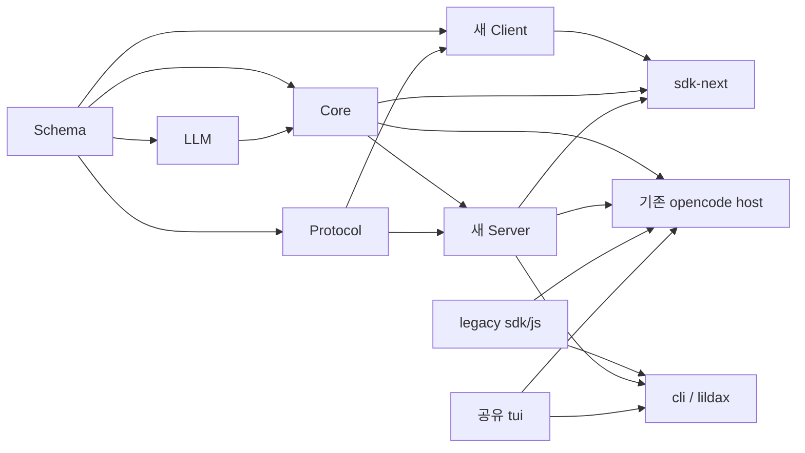
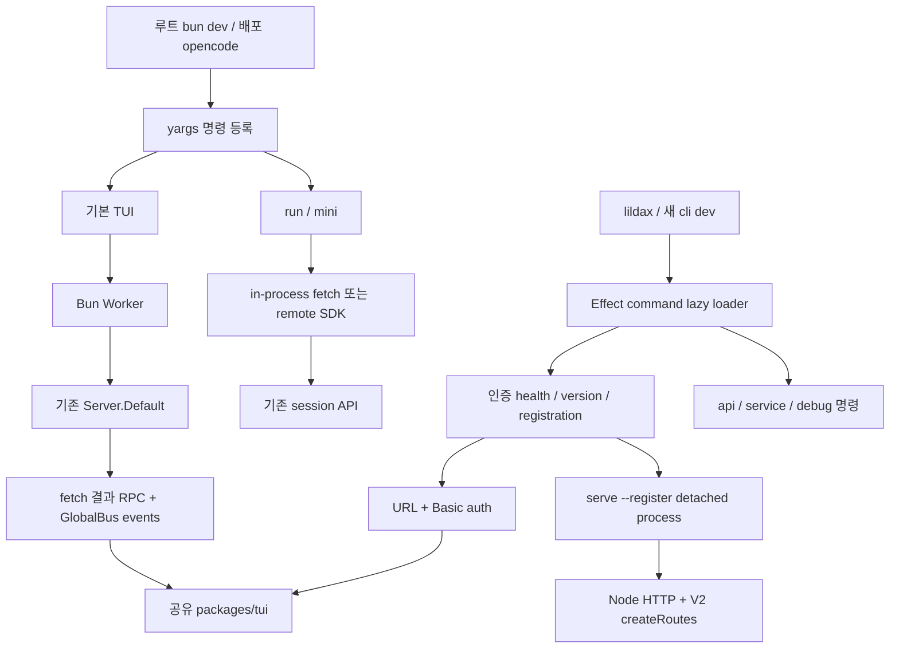
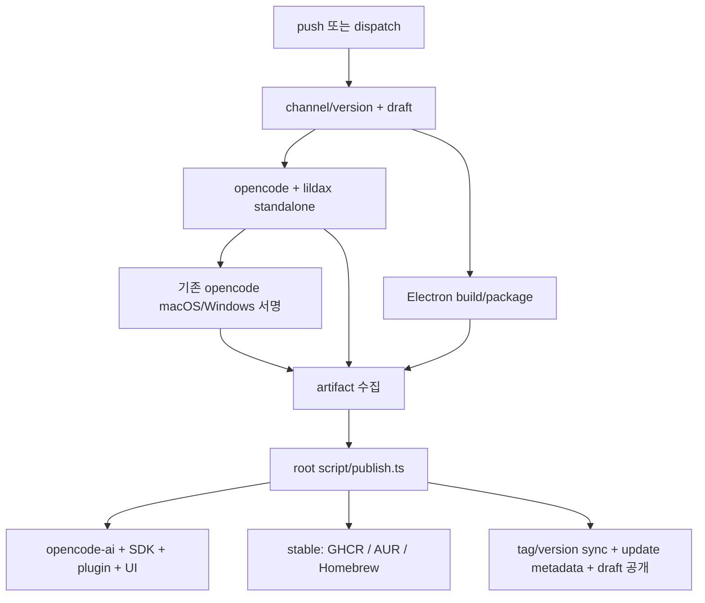
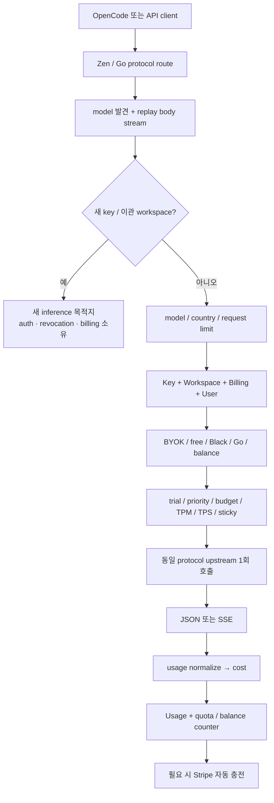
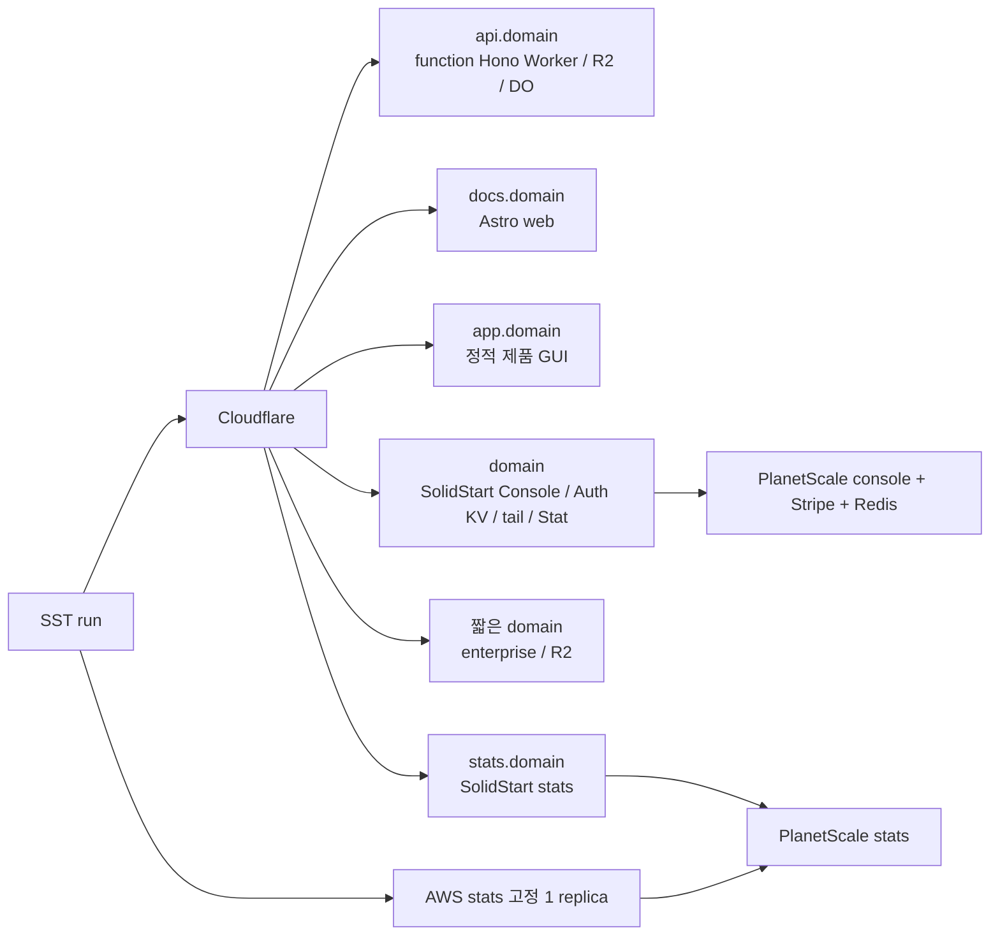
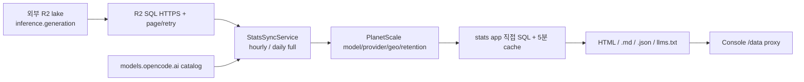

# OpenCode 빌드와 테스트 및 운영 분석

분석 대상은 `anomalyco/opencode`의 `dev` 커밋 **`907b3bc518fa48e90e8ec24dd327d13eee71c36c`**이다. 분석일은 2026-10-04 Asia/Seoul이며, 공용 checkout의 HEAD 일치와 변경 사항 없음부터 확인했다. 이 보고서는 모노레포 연결, CLI 프로세스, 배포물, 검증 체계, 클라우드 서비스를 다룬다. 코딩 엔진·도구·모델 adapter·TUI 화면·API 저장·확장·제품 GUI의 상세는 각각 01–07 보고서 경계다. Moodcode 설계 제안은 포함하지 않는다.

**소스 확인**은 해당 커밋 코드와 테스트를 읽어 확인한 사실, **실행 확인**은 이번 조사에서 실제 수행한 제한적 검증, **해석**은 코드에서 도출한 의미, **미확인**은 외부 상태나 실행이 필요한 사항을 뜻한다. 테스트가 존재한다는 사실을 테스트 통과로 표현하지 않는다. 모든 GitHub 링크는 같은 커밋을 가리킨다. 파일별 범위는 [08-build-ops.coverage.json](./08-build-ops.coverage.json)에 기록했다.

## 1. 핵심 결론

1. 루트의 기본 `bun dev`와 표준 npm 발행은 **기존 `packages/opencode` CLI**로 이어진다. 새 `packages/cli`는 `lildax`라는 2.0 preview executable을 구성하며, 독립 daemon을 통해 같은 TUI 패키지를 호출한다. 새 CLI도 표준 workflow에서 빌드하지만 npm 발행 상위 스크립트에는 연결되지 않았다.
2. `@opencode-ai/sdk/v2`라는 import 이름만으로 엔진 V2 사용을 판단할 수 없다. 기존 `run`의 `client.session.prompt`는 `/session/{sessionID}/message`, 새 daemon의 `client.v2.*`는 `/api/*`다. 새 `@opencode-ai/client`/`sdk-next`도 별도 계층으로 병존한다.
3. 배포 CLI는 Bun standalone이며 TUI·parser worker, 모델 snapshot, 기본 웹 UI를 함께 넣는다. npm 설치에는 Node postinstall이 필요하지만 설치 이후 기존 CLI 실행은 raw binary다. Node용 서버 bundle은 Desktop 연결용으로 따로 만든다.
4. **CI의 실제 Turbo test graph는 6개 패키지만 포함한다.** LLM·Client·TUI 등 개별 test script의 존재가 일반 CI 실행을 의미하지 않는다. Linux에 별도 codegen/API exerciser gate가 있고, performance 검사도 기본 E2E와 분리된다.
5. Console은 기존 Zen 과금·라우팅 서비스를 보유하면서 새 Console/inference로 이관하는 관문이다. 새 키와 이관 workspace는 기존 인증·잔액 검사보다 먼저 목적지로 전달되고, 신규 로그인/Go 가입 경로도 새 서비스로 이동한다.
6. `packages/stats`는 외부 inference lake를 집계하는 공개 서비스다. 로컬 CLI의 `stats`, 다운로드 ledger `STATS.md`, Console의 Stat Worker와 서로 다르다. README의 Lambda 설명보다 현재 AWS container daemon 코드가 실행 근거다.

## 2. 모노레포 지형과 의존성

루트는 private ESM workspace다. `packages/*`, `packages/console/*`, `packages/stats/*`, `packages/sdk/js`를 Bun이 묶는다. `packageManager`는 Bun 1.3.14이고, catalog는 Effect 4.0.0-beta.83, OpenTUI 0.4.5, TypeScript 5.8.2와 native-preview `tsgo`, Solid 1.9.10 등을 공유한다. `workspace:*`는 소스 연결, `catalog:`는 버전 공유 계약이다. `bun.lock`은 플랫폼 optional package와 patch hash도 고정한다. [루트 manifest](https://github.com/anomalyco/opencode/blob/907b3bc518fa48e90e8ec24dd327d13eee71c36c/package.json#L5-L95)

| 계층 | 패키지/디렉터리 | 역할과 조사 경계 |
|---|---|---|
| 기존 실행 host | `opencode` | yargs CLI, legacy 서버·호환층·worker; 08은 시작/운영, 01–06은 서비스 내부 |
| 새 실행 host | `cli` | Effect CLI spec/handler, daemon 관리, `lildax` compile |
| 도메인/계약 | `schema`, `core`, `llm`, `protocol`, `server` | Schema leaf → Core/Protocol → Server; 01/02/03/05 |
| 네트워크/embedded client | `client`, `sdk-next`, `sdk/js`, `httpapi-codegen` | 새 Promise/Effect client, embedded 조합, legacy SDK/codegen; 05 |
| native/시험 보조 | `effect-drizzle-sqlite`, `effect-sqlite-node`, `http-recorder`, `codemode` | SQLite adapter, HTTP fixture recorder, 도구 코드 실행; 02/03/05 |
| 터미널 UI | `tui` | 두 CLI가 공유하는 OpenTUI/Solid 화면; 04 |
| 제품 GUI | `app`, `desktop`, `session-ui`, `ui`, `enterprise`, `storybook` | 브라우저/현재 Electron 앱·공유 UI·공유 사이트; 07 |
| 확장 | `plugin`, `slack`, `github`, `sdks/vscode`, `.opencode` | plugin SDK와 외부 host integration; 06 |
| 서비스 | `console/{app,core,function,mail,resource,support}`, `stats/{app,core,server}`, `function`, `web` | Zen/계정/과금, 공개 집계, API Worker, 문서 SSR; 08 |
| 운영 | `script`, `packages/script`, `infra`, `containers`, `.github`, `nix`, `patches`, `perf` | 버전·발행·자원·CI·호환성·성능 작업; 08 |
| 독립 자산 프로젝트 | `artifacts/glm52-rise-video` | Remotion 홍보 영상, 자체 lockfile; root workspace 밖 |

이 표는 manifest와 실제 import를 함께 본 것이다. 예를 들어 기존 opencode는 Core를 devDependency로 선언하지만 runtime 소스에서 광범위하게 import하고 standalone에 번들한다. 따라서 npm source dependency 지형과 최종 executable 지형은 같지 않다. 많은 내부 패키지는 `.ts` export를 직접 노출하고 일반 `build` script가 없다. `core` manifest의 `bin/opencode`만으로 실제 배포 주체가 Core라고 판단해서도 안 된다. [opencode manifest](https://github.com/anomalyco/opencode/blob/907b3bc518fa48e90e8ec24dd327d13eee71c36c/packages/opencode/package.json#L18-L35), [Core exports/conditional imports](https://github.com/anomalyco/opencode/blob/907b3bc518fa48e90e8ec24dd327d13eee71c36c/packages/core/package.json#L15-L40)

화살표는 제공자에서 소비자로 향한다. 이 도식은 계약 방향의 요약이며 모든 UI/서비스 import를 열거하지 않는다. Client가 Core/Server를 runtime import하지 않아야 한다는 루트 지침과, sdk-next가 이들을 조합한다는 경계가 핵심이다. [루트 의존성 지침](https://github.com/anomalyco/opencode/blob/907b3bc518fa48e90e8ec24dd327d13eee71c36c/AGENTS.md#L1-L4), [sdk-next manifest](https://github.com/anomalyco/opencode/blob/907b3bc518fa48e90e8ec24dd327d13eee71c36c/packages/sdk-next/package.json#L1-L25)

루트 개발 명령은 제품 GUI `dev:web`와 문서 `packages/web`을 구분한다. `dev:console`은 file descriptor 한도를 올리고 console/app을, `dev:stats`는 production SST shell에서 stats/app을 실행한다. 후자는 단순 격리된 로컬 DB 실행과 다르다. `random`은 placeholder, `sso`는 운영 AWS 로그인 helper다. [루트 scripts](https://github.com/anomalyco/opencode/blob/907b3bc518fa48e90e8ec24dd327d13eee71c36c/package.json#L8-L23)

## 3. 실제 CLI 진입점과 프로세스 수명

### 3.1 기존 opencode: worker·embedded·원격 연결

`packages/opencode/src/index.ts`는 yargs로 TUI 기본 명령, attach/run, serve/web, providers/account, agent/models, MCP/ACP, import/export/session/db, GitHub/PR, stats/upgrade/uninstall/plugin/debug를 등록한다. log/pure flag와 `AGENT`, `OPENCODE`, PID 환경을 설정하며 오류를 포맷한 뒤 최종 `process.exit()`한다. 종료를 기다리는 child가 남지 않게 하는 명시적 정책이다. `Heap.start`는 opt-in RSS 2 GiB 초과 시 분당 검사와 재무장 조건을 사용한다. [명령 등록](https://github.com/anomalyco/opencode/blob/907b3bc518fa48e90e8ec24dd327d13eee71c36c/packages/opencode/src/index.ts#L45-L116), [오류/종료](https://github.com/anomalyco/opencode/blob/907b3bc518fa48e90e8ec24dd327d13eee71c36c/packages/opencode/src/index.ts#L118-L142), [heap 진단](https://github.com/anomalyco/opencode/blob/907b3bc518fa48e90e8ec24dd327d13eee71c36c/packages/opencode/src/cli/heap.ts#L12-L42)

기본 `$0 [project]`는 디렉터리를 실경로로 정한 뒤 worker를 만든다. worker 경로는 compile define → 배포 worker.js → 소스 worker.ts 순이다. CLI 환경을 worker에 전달하고 `SIGUSR2`로 config invalidate/instance dispose를 요청한다. 별도 network flag가 없으면 **외부 socket을 열지 않고** `createWorkerFetch` RPC와 `global.event` channel을 사용한다. port/hostname/mDNS를 명시하면 worker가 실제 HTTP 서버를 연다. [worker 선택·RPC transport](https://github.com/anomalyco/opencode/blob/907b3bc518fa48e90e8ec24dd327d13eee71c36c/packages/opencode/src/cli/cmd/tui.ts#L24-L56), [spawn/transport](https://github.com/anomalyco/opencode/blob/907b3bc518fa48e90e8ec24dd327d13eee71c36c/packages/opencode/src/cli/cmd/tui.ts#L198-L249)

worker의 `fetch`는 `Server.Default().app.fetch(Request)`를 호출하고 response body를 text로 읽어 RPC result로 반환한다. 화면 이벤트는 GlobalBus에서 별도의 RPC event로 전달한다. 따라서 이 경로의 fetch response 자체는 점진적 body stream이 아니며 화면 갱신은 별도 이벤트 계약이다. 종료 시 instance들을 dispose하고 HTTP server를 닫는다. CLI는 `shutdown`을 최대 5초 기다린 뒤 worker를 terminate한다. RPC helper 자체에는 reject/error-result/timeout 프로토콜이 없으므로 호출자가 제한과 cleanup을 소유한다. [worker 구현](https://github.com/anomalyco/opencode/blob/907b3bc518fa48e90e8ec24dd327d13eee71c36c/packages/opencode/src/cli/tui/worker.ts#L23-L77), [RPC](https://github.com/anomalyco/opencode/blob/907b3bc518fa48e90e8ec24dd327d13eee71c36c/packages/opencode/src/util/rpc.ts#L5-L63), [종료](https://github.com/anomalyco/opencode/blob/907b3bc518fa48e90e8ec24dd327d13eee71c36c/packages/opencode/src/cli/cmd/tui.ts#L219-L228)

`attach`는 주어진 URL과 Basic auth headers, directory, config, legacy TUI plugin host로 같은 TUI를 호출한다. `serve`/`web`은 per-request directory로 instance를 불러오는 기존 서버를 시작하므로 초기 project instance를 만들지 않는다. `web`은 서버 URL을 browser로 연다. 기본 network port는 0, hostname은 127.0.0.1이고 CLI 명시값과 global config를 병합한다. TUI 기본 경로는 `resolveNetworkOptionsNoConfig`를 사용한다는 차이가 있다. [attach](https://github.com/anomalyco/opencode/blob/907b3bc518fa48e90e8ec24dd327d13eee71c36c/packages/opencode/src/cli/cmd/attach.ts#L107-L145), [serve](https://github.com/anomalyco/opencode/blob/907b3bc518fa48e90e8ec24dd327d13eee71c36c/packages/opencode/src/cli/cmd/serve.ts#L6-L23), [web](https://github.com/anomalyco/opencode/blob/907b3bc518fa48e90e8ec24dd327d13eee71c36c/packages/opencode/src/cli/cmd/web.ts#L31-L82), [network](https://github.com/anomalyco/opencode/blob/907b3bc518fa48e90e8ec24dd327d13eee71c36c/packages/opencode/src/cli/network.ts#L6-L79)

### 3.2 run과 mini는 기존 API 경로다

`opencode run`은 비대화형 단일 prompt/event 출력 경로이며, `--mini`는 별도 footer/scrollback interactive runtime으로 분기한다. run의 local 경로는 프로세스 내부 `Server.Default().app.fetch`를 SDK fetch로 주입하고, attach 경로는 remote SDK를 만든다. `--mini`의 UI 내부는 04 경계다. [run 모드 선언](https://github.com/anomalyco/opencode/blob/907b3bc518fa48e90e8ec24dd327d13eee71c36c/packages/opencode/src/cli/cmd/run.ts#L3-L15), [local/remote 실행](https://github.com/anomalyco/opencode/blob/907b3bc518fa48e90e8ec24dd327d13eee71c36c/packages/opencode/src/cli/cmd/run.ts#L907-L961)

비대화형 execute는 session/agent를 정하고 event를 구독한 뒤 `session.command` 또는 `session.prompt`를 보낸다. 완료 text/tool/reasoning/step 이벤트를 출력하고 해당 session의 idle에서 끝난다. `--format json`은 `{type,timestamp,sessionID,...}` NDJSON이다. 완료 text part를 출력하므로 이 CLI의 표준 출력과 provider token delta stream은 다르다. `session.error`를 누적하고 SDK prompt 실패는 nonzero exit로 처리한다. 자동 허용을 선택하지 않은 비대화형 permission 요청은 reject한다. [구독/입력](https://github.com/anomalyco/opencode/blob/907b3bc518fa48e90e8ec24dd327d13eee71c36c/packages/opencode/src/cli/cmd/run.ts#L833-L877), [출력/idle/permission](https://github.com/anomalyco/opencode/blob/907b3bc518fa48e90e8ec24dd327d13eee71c36c/packages/opencode/src/cli/cmd/run.ts#L693-L823)

SDK의 `/v2`는 생성 SDK 버전 이름이고 그 안에는 기존과 V2 서버 계약이 공존한다. 이 run이 사용하는 `session.prompt` URL은 `/session/{sessionID}/message`다. daemon health의 `v2.health` URL은 `/api/health`다. `run`을 이름만 보고 SessionV2 drain으로 직접 진입한다고 설명하면 틀린다. [legacy prompt URL](https://github.com/anomalyco/opencode/blob/907b3bc518fa48e90e8ec24dd327d13eee71c36c/packages/sdk/js/src/v2/gen/sdk.gen.ts#L3742-L3794), [V2 health URL](https://github.com/anomalyco/opencode/blob/907b3bc518fa48e90e8ec24dd327d13eee71c36c/packages/sdk/js/src/v2/gen/sdk.gen.ts#L5024-L5035)

기존 명령 상당수는 `effectCmd` adapter를 사용한다. handler 선택 시 AppRuntime을 lazy import하고, 필요한 명령만 InstanceStore에서 directory context를 load해 InstanceRef를 제공한다. `finally`에서 dispose한다. `instance:false`와 동적 판정은 계정/DB/serve/remote run 등 startup 비용과 context 불일치를 줄이는 장치다. 이전 `bootstrap`의 finally 정리와 병존하며 모두 엔진 V2 전환을 뜻하지는 않는다. [effectCmd](https://github.com/anomalyco/opencode/blob/907b3bc518fa48e90e8ec24dd327d13eee71c36c/packages/opencode/src/cli/effect-cmd.ts#L69-L96), [bootstrap](https://github.com/anomalyco/opencode/blob/907b3bc518fa48e90e8ec24dd327d13eee71c36c/packages/opencode/src/cli/bootstrap.ts#L4-L10)

### 3.3 새 CLI: lazy command tree와 인증 daemon

새 진입점은 Effect `Command` spec에 handler loader를 연결한 뒤 Daemon/NodeServices layer와 scope를 제공하고 NodeRuntime.runMain으로 실행한다. handler를 실제 선택하기 전까지 dynamic import하지 않는다. named command는 `api`, `debug agents`, `migrate`, `service start/restart/status/stop/password`, `serve`이며 기존 CLI의 명령 전체를 대체하지 않는다. `migrate`는 현재 **“No migrations to run.” 출력만 하는 stub**이다. root `--version`은 코드상 `local`을 넘기며 daemon 호환성은 별도 InstallationVersion define를 사용한다. [새 index](https://github.com/anomalyco/opencode/blob/907b3bc518fa48e90e8ec24dd327d13eee71c36c/packages/cli/src/index.ts#L10-L32), [command spec](https://github.com/anomalyco/opencode/blob/907b3bc518fa48e90e8ec24dd327d13eee71c36c/packages/cli/src/commands/commands.ts#L6-L52), [lazy runtime](https://github.com/anomalyco/opencode/blob/907b3bc518fa48e90e8ec24dd327d13eee71c36c/packages/cli/src/framework/runtime.ts#L58-L76), [migrate](https://github.com/anomalyco/opencode/blob/907b3bc518fa48e90e8ec24dd327d13eee71c36c/packages/cli/src/commands/handlers/migrate.ts#L1-L5)

기본 handler는 `daemon.transport()`를 확보한 다음 `runTui`를 lazy import한다. 같은 `@opencode-ai/tui`를 호출하지만 args는 비어 있고 terminalSuspend를 끄며 pluginHost.start/dispose는 no-op이다. `/config/providers`, `/provider`, `/agent`, `/config`가 404이면 빈 legacy defaults를 돌려준다. 이는 제공되지 않은 기능을 완성한 compatibility layer가 아니라 공유 provider-connect 화면까지 접근하는 초기 adapter다. [default handler](https://github.com/anomalyco/opencode/blob/907b3bc518fa48e90e8ec24dd327d13eee71c36c/packages/cli/src/commands/handlers/default.ts#L6-L12), [TUI adapter/fallback](https://github.com/anomalyco/opencode/blob/907b3bc518fa48e90e8ec24dd327d13eee71c36c/packages/cli/src/tui.ts#L7-L37), [명세의 완료/제약](https://github.com/anomalyco/opencode/blob/907b3bc518fa48e90e8ec24dd327d13eee71c36c/specs/tui-package.md#L484-L516)

daemon은 `Global.Path.state/server.json`과 `password`를 사용한다. password는 32 random byte base64url을 0600 임시 파일 후 rename으로 기록하고 재시작에도 유지한다. registration은 `{id,version,url,pid}`다. 실제 연결 성공 조건은 인증된 health 요청의 `healthy:true`와 버전 일치다. compiled 바이너리는 같은 버전 daemon을 재사용하지만 Bun source 실행은 기존 daemon을 중단하고 새로 spawn한다. detached child는 같은 executable/entrypoint의 `serve --register`이며 stdio를 무시하고 unref한다. 50ms 간격 최대 약 5초 준비 재시도를 사용한다. [password/health](https://github.com/anomalyco/opencode/blob/907b3bc518fa48e90e8ec24dd327d13eee71c36c/packages/cli/src/services/daemon.ts#L35-L78), [start/transport](https://github.com/anomalyco/opencode/blob/907b3bc518fa48e90e8ec24dd327d13eee71c36c/packages/cli/src/services/daemon.ts#L110-L144)

stop은 registration만 믿고 PID를 kill하지 않는다. 먼저 인증 health와 동일 registration을 확인하고 SIGTERM, 대기, 다시 동일 여부 확인 후 SIGKILL한다. register는 UUID 소유자를 기록하고 10초마다 자신의 id가 여전히 등록되어 있는지 확인해 소유권을 잃으면 자기 프로세스를 종료한다. scope finalizer도 자신의 registration일 때만 지운다. password 변경 명령은 기존 daemon을 먼저 중단한다. **해석:** OS launchd/systemd service 설치가 아니라 사용자 상태 디렉터리를 통한 프로세스 발견·교체 방식이다. 동시 start의 flock/단일 admission은 보이지 않으며 UUID check가 대체 프로세스의 생존을 조정한다. [stop/owner check](https://github.com/anomalyco/opencode/blob/907b3bc518fa48e90e8ec24dd327d13eee71c36c/packages/cli/src/services/daemon.ts#L80-L107), [status/register/finalizer](https://github.com/anomalyco/opencode/blob/907b3bc518fa48e90e8ec24dd327d13eee71c36c/packages/cli/src/services/daemon.ts#L146-L185), [password command](https://github.com/anomalyco/opencode/blob/907b3bc518fa48e90e8ec24dd327d13eee71c36c/packages/cli/src/commands/handlers/service/password.ts#L8-L15)

새 `serve`는 Node HTTP 서버에서 `createRoutes(password)`를 호스팅한다. port 생략 시 4096부터 다음 port로 재귀 탐색하며 explicit port는 그대로 bind한다. 서버 scope를 유지하는 Effect.never 동안 registration을 관리한다. createRoutes는 V2 API handlers와 Location/authorization, Database/EventV2/SessionV2, process-global SessionExecutionLocal/LocationServiceMap을 구성한다. daemon transport 자체가 durable 실행 복구를 추가하지는 않는다. [serve/bind](https://github.com/anomalyco/opencode/blob/907b3bc518fa48e90e8ec24dd327d13eee71c36c/packages/cli/src/commands/handlers/serve.ts#L15-L46), [V2 service composition](https://github.com/anomalyco/opencode/blob/907b3bc518fa48e90e8ec24dd327d13eee71c36c/packages/server/src/routes.ts#L26-L62)

`api`는 raw HTTP method/path 또는 현재 daemon의 `/openapi.json` operationId를 선택한다. path parameter는 encodeURIComponent하고 남는 param은 query로 보낸다. header/data를 합쳐 요청하고 body를 stdout에 쓴다. 최종 response의 HTTP non-2xx를 exit failure로 바꾸는 로직은 이 handler에 없다. [api](https://github.com/anomalyco/opencode/blob/907b3bc518fa48e90e8ec24dd327d13eee71c36c/packages/cli/src/commands/handlers/api.ts#L17-L84)

### 3.4 background job은 daemon durable queue가 아니다

Core BackgroundJob은 SynchronizedRef<Map>와 job별 closeable Scope, done/promoted/tail Deferred를 사용하는 **process-local registry**다. `start`는 상태를 게시한 뒤 즉시 작업을 fork하고 같은 running id는 기존 info를 반환한다. `extend`는 pending을 먼저 늘리고 앞선 tail을 기다려 순차 실행하며 마지막 sequence의 output을 보관한다. token은 이전 incarnation의 늦은 settle이 새 job을 덮지 못하게 한다. timeout wait는 작업을 취소하지 않는다. `promote`는 background metadata와 notification을 설정하며 실행은 계속한다. cancel은 상태·done을 완료하고 scope를 닫는다. [비영속 계약](https://github.com/anomalyco/opencode/blob/907b3bc518fa48e90e8ec24dd327d13eee71c36c/packages/core/src/background-job.ts#L113-L124), [settle/token](https://github.com/anomalyco/opencode/blob/907b3bc518fa48e90e8ec24dd327d13eee71c36c/packages/core/src/background-job.ts#L126-L169), [start/extend](https://github.com/anomalyco/opencode/blob/907b3bc518fa48e90e8ec24dd327d13eee71c36c/packages/core/src/background-job.ts#L202-L289), [wait/promote/cancel](https://github.com/anomalyco/opencode/blob/907b3bc518fa48e90e8ec24dd327d13eee71c36c/packages/core/src/background-job.ts#L292-L357)

기존 opencode의 adapter는 같은 Core engine을 InstanceState로 감싸 **instance마다 별도 registry**를 만든다. Core node는 global node다. 프로세스 재시작/owner scope 폐쇄 때 상태를 복구하는 저장이나 remote worker semantics가 없으며, scope 폐쇄 후 abandoned registry의 running status가 settle된다고 약속하지 않는 테스트도 있다. existing task tool/experimental 관찰과 V2 bash TODO의 경계를 구분해야 한다. [legacy adapter](https://github.com/anomalyco/opencode/blob/907b3bc518fa48e90e8ec24dd327d13eee71c36c/packages/opencode/src/background/job.ts#L17-L35), [scope 종료 테스트](https://github.com/anomalyco/opencode/blob/907b3bc518fa48e90e8ec24dd327d13eee71c36c/packages/core/test/background-job.test.ts#L89-L104), [V2 bash 관찰 TODO](https://github.com/anomalyco/opencode/blob/907b3bc518fa48e90e8ec24dd327d13eee71c36c/packages/core/src/tool/bash.ts#L74)

## 4. 빌드·설치·업데이트·배포

### 4.1 standalone의 입력과 타깃

기존 build는 모델 snapshot을 읽고, 기본적으로 app build를 실행해 dist 파일을 file import로 embed한다. `--skip-embed-web-ui`로 생략할 수 있다. 모델 데이터는 `MODELS_DEV_API_JSON`이 없으면 build 시점의 models.dev 응답이다. 새 CLI는 models.opencode.ai를 사용한다. **해석:** 커밋과 lockfile만으로 완전히 재현되는 빌드가 아니며 외부 모델 snapshot도 고정해야 한다. Core migration은 별도 SQL asset 생성이 아니라 migration.gen.ts가 TypeScript 모듈들을 import하는 번들 경로다. [웹 UI embedding](https://github.com/anomalyco/opencode/blob/907b3bc518fa48e90e8ec24dd327d13eee71c36c/packages/opencode/script/build.ts#L14-L51), [기존 snapshot](https://github.com/anomalyco/opencode/blob/907b3bc518fa48e90e8ec24dd327d13eee71c36c/packages/opencode/script/generate.ts#L10-L13), [새 snapshot](https://github.com/anomalyco/opencode/blob/907b3bc518fa48e90e8ec24dd327d13eee71c36c/packages/cli/script/generate.ts#L1-L5), [migration imports](https://github.com/anomalyco/opencode/blob/907b3bc518fa48e90e8ec24dd327d13eee71c36c/packages/core/src/database/migration.gen.ts#L1-L8)

| 플랫폼 | 일반 | baseline/ABI variant |
|---|---|---|
| Linux | arm64, x64 | x64 baseline; arm64-musl, x64-musl, x64-baseline-musl |
| Darwin | arm64, x64 | x64 baseline |
| Windows | arm64, x64 | x64 baseline |

두 빌드 모두 총 12타깃이다. `--single`은 현재 OS/arch의 일반 타깃을 남기고 musl을 제외한다. `--single --baseline`은 일반과 baseline을 모두 남긴다. 기존 빌드는 OpenTUI, watcher, fff의 모든 CPU/OS optional package를 install한다. 새 빌드의 명시 설치는 OpenTUI만이다. [기존 targets/filter](https://github.com/anomalyco/opencode/blob/907b3bc518fa48e90e8ec24dd327d13eee71c36c/packages/opencode/script/build.ts#L53-L143), [새 targets/filter](https://github.com/anomalyco/opencode/blob/907b3bc518fa48e90e8ec24dd327d13eee71c36c/packages/cli/script/build.ts#L23-L51)

기존 compile entrypoints는 CLI, TUI worker, OpenTUI tree-sitter worker, 생성 웹 UI module이다. Bunfs root를 Windows와 Unix에 맞추고 worker path·models/version/channel/libc를 define한다. autoloadBunfig/Dotenv는 끄지만 package.json/tsconfig autoload는 켠다. system CA와 user agent를 execArgv에 넣는다. native library는 libc define와 optional target package를 함께 맞춰야 한다. [compile 설정](https://github.com/anomalyco/opencode/blob/907b3bc518fa48e90e8ec24dd327d13eee71c36c/packages/opencode/script/build.ts#L159-L201)

기존 빌드는 macOS local 타깃을 embed 후 ad-hoc 재서명하고, 현재 OS/arch의 ABI 없는 타깃에 `--version` smoke를 수행한다. Linux release archive는 tar.gz, 기타는 zip이다. 새 `lildax` compile은 CLI entrypoint 하나이며 기존 host/parser worker·app embedding·재서명·동일 smoke 단계를 명시하지 않는다. 이것이 모든 OpenTUI asset이 빠진다는 뜻은 아니며 실제 compile/native runtime은 별도 검증이 필요하다. [기존 후처리](https://github.com/anomalyco/opencode/blob/907b3bc518fa48e90e8ec24dd327d13eee71c36c/packages/opencode/script/build.ts#L204-L250), [새 compile](https://github.com/anomalyco/opencode/blob/907b3bc518fa48e90e8ec24dd327d13eee71c36c/packages/cli/script/build.ts#L65-L116)

### 4.2 npm 설치물과 source launcher를 구분해야 한다

기존 `bin/opencode` 소스는 Node launcher지만 실제 publish는 이를 복사하지 않는다. `opencode-ai` 생성 manifest는 모든 platform package를 optionalDependency로 지정하고, `bin/opencode.exe` placeholder + postinstall.mjs를 만든다. Node postinstall이 플랫폼/AVX2/musl 후보를 찾아 raw binary를 hardlink/copy한다. Unix도 목적 파일명은 opencode.exe다. optional package가 없으면 임시 prefix에 npm install --ignore-scripts로 후보를 설치하고 `--version` 검증 후 선택한다. **설치에는 Node, 설치 성공 뒤 실행에는 bundled Bun standalone**이라는 구분이다. [npm 생성물](https://github.com/anomalyco/opencode/blob/907b3bc518fa48e90e8ec24dd327d13eee71c36c/packages/opencode/script/publish.ts#L34-L69), [후보/fallback](https://github.com/anomalyco/opencode/blob/907b3bc518fa48e90e8ec24dd327d13eee71c36c/packages/opencode/script/postinstall.mjs#L31-L144), [binary 배치](https://github.com/anomalyco/opencode/blob/907b3bc518fa48e90e8ec24dd327d13eee71c36c/packages/opencode/script/postinstall.mjs#L146-L175)

새 CLI publish script는 `lildax.cjs`를 `bin/lildax`로 복사하고 postinstall을 정의하지 않는다. 실행 시 Node launcher가 `OPENCODE_BIN_PATH`, cached `.lildax`, 플랫폼 optional package를 찾아 실행한다. 후보 binary의 실행 검증이나 추가 npm 설치는 이 launcher에 없다. 따라서 실행 시 Node 요구와 설치 오류 복구가 기존 npm 구조와 다르다. [새 publish](https://github.com/anomalyco/opencode/blob/907b3bc518fa48e90e8ec24dd327d13eee71c36c/packages/cli/script/publish.ts#L29-L53), [launcher 탐색](https://github.com/anomalyco/opencode/blob/907b3bc518fa48e90e8ec24dd327d13eee71c36c/packages/cli/bin/lildax.cjs#L79-L130)

### 4.3 shell installer와 Installation 서비스

루트 `install`은 `$HOME/.opencode/bin`에 GitHub release binary를 설치한다. Rosetta/AVX2/musl을 탐지하고 latest/지정 version 다운로드, 압축 해제, shell PATH 변경 및 GITHUB_PATH 등록을 처리한다. checksum 확인과 설치 후 `--version` smoke는 이 파일에서 발견하지 못했다. 이를 npm postinstall의 후보 실행 검증과 혼동하면 안 된다. [platform 선택](https://github.com/anomalyco/opencode/blob/907b3bc518fa48e90e8ec24dd327d13eee71c36c/install#L68-L205), [설치/PATH](https://github.com/anomalyco/opencode/blob/907b3bc518fa48e90e8ec24dd327d13eee71c36c/install#L327-L444)

Installation 서비스는 실행 경로의 `.opencode/bin`/`.local/bin`을 curl 설치로 판정하고 그 외 global package list로 설치 manager를 추정한다. npm/bun/pnpm의 channel별 registry, Homebrew core/tap, Scoop, Chocolatey, GitHub latest에서 최신 version을 읽는다. upgrade는 manager를 실행하거나 installer HTTP body를 Bash/sh stdin에 넣는다. Homebrew tap은 git pull --ff-only 후 자동 update를 끄고 upgrade한다. 실패 출력은 UpgradeFailedError로 정제한다. [방식/latest 판정](https://github.com/anomalyco/opencode/blob/907b3bc518fa48e90e8ec24dd327d13eee71c36c/packages/opencode/src/installation/index.ts#L174-L264), [upgrade/error](https://github.com/anomalyco/opencode/blob/907b3bc518fa48e90e8ec24dd327d13eee71c36c/packages/opencode/src/installation/index.ts#L139-L165), [manager switch](https://github.com/anomalyco/opencode/blob/907b3bc518fa48e90e8ec24dd327d13eee71c36c/packages/opencode/src/installation/index.ts#L265-L320)

자동 업데이트는 기본 TUI → worker.checkUpgrade → cli/upgrade 경로다. config false/disable flag면 중단하고 notify 모드 및 major/minor 차이면 event만 발생한다. 알려진 manager의 patch 업데이트만 자동 수행하며 실패는 삼킨다. 새 CLI의 daemon 교체는 이 다운로드/업데이트 정책과 별개의 프로세스 version 교체다. [자동 upgrade](https://github.com/anomalyco/opencode/blob/907b3bc518fa48e90e8ec24dd327d13eee71c36c/packages/opencode/src/cli/upgrade.ts#L8-L52)

정적 불일치도 남는다. yarn detection/Method는 있지만 upgrade switch의 yarn case가 없다. Bash 미존재 시 sh fallback을 선택하는 테스트는 있어도 installer의 `[[ ]]`, 배열, pipefail에 대한 POSIX sh 실행을 보장하지 않는다. shell installer Windows 경로는 arm64를 거부하고 `opencode`를 이동하지만 Windows signed asset은 opencode.exe다. 해당 환경에서 재현하지 않았으므로 **검토 질문**으로 기록한다.

삭제 명령은 data/cache/config/state를 대상으로 keep-data/keep-config와 dry-run/force를 제공한다. curl 설치의 binary는 직접 삭제하지 않고 마지막 수동 제거 안내를 출력하며, 다른 manager는 uninstall 명령을 실행한다. cache/state는 keep-data와 별개라 daemon registration/password도 제거 범위에 들어간다. 이번 조사에서는 삭제 명령을 실행하지 않았다. [uninstall 범위와 실행](https://github.com/anomalyco/opencode/blob/907b3bc518fa48e90e8ec24dd327d13eee71c36c/packages/opencode/src/cli/cmd/uninstall.ts#L90-L221)

### 4.4 릴리스 연결과 실패/재시도 단위

`@opencode-ai/script`는 root Bun version의 caret 범위를 검사하고 channel/version을 환경·bump·명시 version·branch에서 결정한다. preview version은 branch와 시각 기반, stable bump는 npm latest를 조회한다. stable/beta는 version script가 draft release를 만들고 일반 dev preview에는 release ID가 없다. [Script](https://github.com/anomalyco/opencode/blob/907b3bc518fa48e90e8ec24dd327d13eee71c36c/packages/script/src/index.ts#L5-L72), [draft 생성](https://github.com/anomalyco/opencode/blob/907b3bc518fa48e90e8ec24dd327d13eee71c36c/script/version.ts#L9-L28)

publish workflow는 두 CLI를 빌드하고 lildax artifacts까지 수집한다. 그러나 최종 루트 publish가 호출하는 것은 opencode·sdk/js·plugin·ui뿐이다. cli/script/publish.ts의 호출자는 표준 workflow/root script 검색에서 찾지 못했다. 따라서 **빌드 artifact 존재와 npm 공개의 연결을 분리**한다. [두 CLI 빌드](https://github.com/anomalyco/opencode/blob/907b3bc518fa48e90e8ec24dd327d13eee71c36c/.github/workflows/publish.yml#L89-L115), [preview artifact 수집](https://github.com/anomalyco/opencode/blob/907b3bc518fa48e90e8ec24dd327d13eee71c36c/.github/workflows/publish.yml#L541-L544), [최종 호출](https://github.com/anomalyco/opencode/blob/907b3bc518fa48e90e8ec24dd327d13eee71c36c/script/publish.ts#L38-L48)

기존 CLI macOS job은 Developer ID/hardened runtime/timestamp와 strict 검증을, Windows job은 Azure Artifact Signing과 Authenticode Valid 검증을 사용한다. 대상 패턴은 기존 opencode-*이며 lildax에 동일 서명을 적용한다고 단정하지 않는다. 루트 publish는 전체 manifests version 변경, Bun install, legacy SDK 재생성 후 publish하며 stable에서는 release commit tag와 dev version을 동기화하고 draft를 공개한다. 이는 정적 workflow 확인이고 release를 실행하지 않았다. [macOS 서명](https://github.com/anomalyco/opencode/blob/907b3bc518fa48e90e8ec24dd327d13eee71c36c/.github/workflows/publish.yml#L147-L190), [Windows 서명](https://github.com/anomalyco/opencode/blob/907b3bc518fa48e90e8ec24dd327d13eee71c36c/.github/workflows/publish.yml#L237-L292), [루트 publish 전체](https://github.com/anomalyco/opencode/blob/907b3bc518fa48e90e8ec24dd327d13eee71c36c/script/publish.ts#L13-L69)

opencode npm 발행은 version 존재를 먼저 확인해 재실행을 허용한다. stable에만 GHCR multiarch, AUR opencode-bin, Homebrew tap을 갱신하고 ripgrep을 OS package 의존성으로 둔다. Scoop/Chocolatey 직접 발행은 해당 script에 없다. Docker는 Alpine + libgcc/libstdc++/ripgrep이고 amd64 baseline-musl, arm64-musl을 넣어 --version으로 확인한다. [발행](https://github.com/anomalyco/opencode/blob/907b3bc518fa48e90e8ec24dd327d13eee71c36c/packages/opencode/script/publish.ts#L10-L24), [stable 외부 배포](https://github.com/anomalyco/opencode/blob/907b3bc518fa48e90e8ec24dd327d13eee71c36c/packages/opencode/script/publish.ts#L81-L213), [Docker](https://github.com/anomalyco/opencode/blob/907b3bc518fa48e90e8ec24dd327d13eee71c36c/packages/opencode/Dockerfile#L1-L18)

## 5. Bun/Node·native·patch·Nix 제약

Core conditional imports는 Bun/Node별 SQLite·PTY·fff를 선택한다. Bun은 bun:sqlite/bun-pty/fff-bun, Node는 node:sqlite/@lydell/node-pty를 사용하고 Node fff는 available:false이며 create가 실패한다. Windows Node PTY는 useConptyDll을 설정한다. 이 조건부 호환을 전체 CLI의 Node 실행 보장으로 확대하면 안 된다. [조건부 imports](https://github.com/anomalyco/opencode/blob/907b3bc518fa48e90e8ec24dd327d13eee71c36c/packages/core/package.json#L25-L40), [Node PTY](https://github.com/anomalyco/opencode/blob/907b3bc518fa48e90e8ec24dd327d13eee71c36c/packages/core/src/pty/pty.node.ts#L6-L10), [Node fff](https://github.com/anomalyco/opencode/blob/907b3bc518fa48e90e8ec24dd327d13eee71c36c/packages/core/src/filesystem/fff.node.ts#L130-L136)

`build-node.ts`는 CLI가 아닌 Config/Server/bootstrap/Database exports의 Node ESM bundle이다. Desktop predev/prebuild가 실제 호출자이며 jsonc-parser·@lydell/node-pty는 external, embedded web UI는 빈 module이다. root postinstall의 fix-node-pty는 non-Windows spawn-helper 권한을 고치지만 검사 경로는 여전히 unscoped node_modules/node-pty다. scoped package의 실제 설치 배치와 맞는지 미확인이다. [Node build](https://github.com/anomalyco/opencode/blob/907b3bc518fa48e90e8ec24dd327d13eee71c36c/packages/opencode/script/build-node.ts#L15-L30), [Node entry](https://github.com/anomalyco/opencode/blob/907b3bc518fa48e90e8ec24dd327d13eee71c36c/packages/opencode/src/node.ts#L1-L4), [Desktop 호출](https://github.com/anomalyco/opencode/blob/907b3bc518fa48e90e8ec24dd327d13eee71c36c/packages/desktop/scripts/prebuild.ts#L10), [helper 권한](https://github.com/anomalyco/opencode/blob/907b3bc518fa48e90e8ec24dd327d13eee71c36c/packages/core/script/fix-node-pty.ts#L11-L27)

root trustedDependencies, overrides, patchedDependencies는 배포의 실제 입력이다. Bun install은 exact 버전을 쓰고 새 resolved version에 3일 minimum release age를 적용하되 OpenTUI/native·일부 adapter·Electron build 도구는 예외다. 이미 lock된 모든 버전의 나이를 다시 검사한다는 의미는 아니다. [install 정책](https://github.com/anomalyco/opencode/blob/907b3bc518fa48e90e8ec24dd327d13eee71c36c/bunfig.toml#L1-L5), [trust/patch 설정](https://github.com/anomalyco/opencode/blob/907b3bc518fa48e90e8ec24dd327d13eee71c36c/package.json#L129-L168)

| patch/운영 도구 | 역할 | 주 담당 경계 |
|---|---|---|
| Effect | SSE wire JSON wrapper에 별도 `IdentifierStream` OpenAPI 이름 부여, schema 충돌 회피 | 05 API/codegen |
| photon | wasm-bindgen imports를 module.exports와 분리; global WASM path override | 02 이미지 도구 / 08 embedding |
| npmcli agent/pacote | proxy URL 문자열, HTTP/tarball 오류 뒤 git clone fallback | 06 plugin 설치 |
| standard-openapi/gcp-metadata | 외부 `$ref` 처리, GCP 외부 AggregateError를 unavailable로 정리 | 05/03 |
| MCP SDK | 404 session 재초기화 공유 Promise·한 번 재요청, OAuth refresh/offline_access | 06 |
| Solid/dnd/virtual-core/pierre trees | cleanup 재진입, plugin 보존, offset clamp/padding, expansion cleanup | 04/07 |
| AI SDK 여러 provider | pinned adapter 동작 보완; root/lock 적용 확인 | 03 상세 |

Effect와 photon은 단순 버전 pin이 아니라 배포물 동작에 직접 연결된다. core/image/photon은 WASM file을 embed해 global path를 설정한 뒤 lazy import한다. MCP/AI/UI patch의 세부 의미는 해당 영역 분석에 넘긴다. [Effect patch](https://github.com/anomalyco/opencode/blob/907b3bc518fa48e90e8ec24dd327d13eee71c36c/patches/effect%404.0.0-beta.83.patch#L18-L24), [photon path patch](https://github.com/anomalyco/opencode/blob/907b3bc518fa48e90e8ec24dd327d13eee71c36c/patches/%40silvia-odwyer%252Fphoton-node%400.3.4.patch#L280-L285), [photon loader](https://github.com/anomalyco/opencode/blob/907b3bc518fa48e90e8ec24dd327d13eee71c36c/packages/core/src/image/photon.ts#L1-L18), [MCP 재연결 patch](https://github.com/anomalyco/opencode/blob/907b3bc518fa48e90e8ec24dd327d13eee71c36c/patches/%40modelcontextprotocol%252Fsdk%401.29.0.patch#L159-L217)

upgrade-opentui는 manifests/catalog/overrides를 같이 바꾸고 install 후 stale lock entry를 검사하며 알려진 spinner peer residue만 제한적으로 정리한다. native core와 Solid wrapper 버전의 동기화 도구다. 반면 patches/install-korean-ime-fix.sh는 patchedDependencies 밖의 커뮤니티 fork installer이며 clone/reset과 오래된 TUI path sed를 사용한다. 현재 packages/tui 기준 공식 빌드 흐름으로 취급하지 않는다. [OpenTUI upgrade](https://github.com/anomalyco/opencode/blob/907b3bc518fa48e90e8ec24dd327d13eee71c36c/script/upgrade-opentui.ts#L35-L95), [lock 검증](https://github.com/anomalyco/opencode/blob/907b3bc518fa48e90e8ec24dd327d13eee71c36c/script/upgrade-opentui.ts#L129-L191), [IME fork installer](https://github.com/anomalyco/opencode/blob/907b3bc518fa48e90e8ec24dd327d13eee71c36c/patches/install-korean-ime-fix.sh#L21-L64)

Nix flake는 Linux/Darwin × arm64/x64의 4개 시스템과 opencode/opencode-desktop/devShell을 제공한다. devShell의 Node는 20이며 CI Node 24와 다르다. node_modules는 플랫폼별 fixed-output derivation으로 packages/lock/patch 등을 입력으로 frozen install --ignore-scripts한 뒤 symlink와 Bun binary를 정규화한다. Bun cross-platform install과 native install이 byte-identical하지 않아 hash workflow도 각 플랫폼 native runner를 사용한다. [flake](https://github.com/anomalyco/opencode/blob/907b3bc518fa48e90e8ec24dd327d13eee71c36c/flake.nix#L11-L70), [fixed-output install](https://github.com/anomalyco/opencode/blob/907b3bc518fa48e90e8ec24dd327d13eee71c36c/nix/node_modules.nix#L25-L77), [hash workflow](https://github.com/anomalyco/opencode/blob/907b3bc518fa48e90e8ec24dd327d13eee71c36c/.github/workflows/nix-hashes.yml#L25-L79)

Nix CLI는 Bun mismatch를 warning으로 완화하고 nixpkgs models-dev snapshot을 build 입력에 넣고 runtime models fetch를 끈다. --single --skip-install compile, config schema 생성, ripgrep wrapper/completions, --version install check를 수행한다. 남은 정적 불일치는 opencode.nix default의 `node-modules.nix`와 실제 `node_modules.nix` 철자, nix-eval의 `desktop`와 flake의 `opencode-desktop` output 이름이다. flake는 node_modules 인자를 명시해 첫 default를 우회한다. models-snapshot workflow는 v2 branch를 checkout하고 dev 커밋에 없는 update-models-snapshot.ts/snapshot.txt를 대상으로 하므로 이 보고서의 dev 생성 경로와 분리한다. Nix 자체는 실행하지 않았다. [Nix CLI](https://github.com/anomalyco/opencode/blob/907b3bc518fa48e90e8ec24dd327d13eee71c36c/nix/opencode.nix#L14-L95), [Nix eval 이름](https://github.com/anomalyco/opencode/blob/907b3bc518fa48e90e8ec24dd327d13eee71c36c/.github/workflows/nix-eval.yml#L43), [별도 branch snapshot](https://github.com/anomalyco/opencode/blob/907b3bc518fa48e90e8ec24dd327d13eee71c36c/.github/workflows/models-snapshot.yml#L25-L46)

## 6. Console/Zen: 모델 프록시·계정·과금과 서비스 이관

### 6.1 서비스 계층과 현재 cutover

Console은 코딩 엔진과 다른 서비스다. app은 SolidStart 공개 사이트·workspace 관리·Zen API·Stripe webhook, core는 계정/workspace/모델/과금, function은 OpenAuth issuer·tail·속도 통계 Worker, resource는 SST adapter, mail은 초대 메일, support는 내부 조회 화면이다. 서비스 context는 Promise와 AsyncLocalStorage Actor/Database이며 엔진의 Effect node graph와 다르다. [Context](https://github.com/anomalyco/opencode/blob/907b3bc518fa48e90e8ec24dd327d13eee71c36c/packages/console/core/src/context.ts#L1-L20), [Actor](https://github.com/anomalyco/opencode/blob/907b3bc518fa48e90e8ec24dd327d13eee71c36c/packages/console/core/src/actor.ts#L36-L80)

가장 중요한 분기는 generation handler가 기존 validateModel/authenticate/validateBilling 전에 **proxyInference**를 호출한다는 것이다. 새 `oc_sk_` key 또는 migrated_at가 있는 legacy workspace key는 새 inference URL로 전달된다. `/zen/v1/...`는 OpenAI/Anthropic/Google native path로, Go는 `/go/...`로 매핑한다. imported BYOK는 workspace/provider-derived `conn_...` ID와 native model ID를 사용한다. code comment는 목적지가 auth/revocation/accounting을 소유한다고 명시한다. 따라서 아래 legacy 과금 구현을 이관된 모든 요청의 현재 정책으로 설명하면 안 된다. [handler 분기](https://github.com/anomalyco/opencode/blob/907b3bc518fa48e90e8ec24dd327d13eee71c36c/packages/console/app/src/routes/zen/util/handler.ts#L93-L146), [proxy path/인증 소유](https://github.com/anomalyco/opencode/blob/907b3bc518fa48e90e8ec24dd327d13eee71c36c/packages/console/app/src/lib/inference-proxy.ts#L7-L114)

infra는 production/dev에 `https://<domain>/console`과 `/inference` URL을 link하고 preview에는 빈 URL을 준다. 조사한 SST 코드가 이 목적지 서비스 자체를 생성한다는 근거는 없다. 프록시의 목적지 계약까지 확인했으며 내부 구현·운영 상태는 미확인이다. [migration URL](https://github.com/anomalyco/opencode/blob/907b3bc518fa48e90e8ec24dd327d13eee71c36c/infra/console.ts#L223-L231)

로그인 issuer는 신규 계정과 Black 구독 없는 기존 계정을 새 Console로 보내고, 기존 app session도 Black/migration 여부에 따라 redirect한다. Go 가입 `generateLiteCheckoutUrl`은 즉시 이동 오류를 던져 뒤 Stripe 가입 코드에 도달하지 않는다. Black webhook은 renewal을 cancel_at_period_end로 되돌리지만 기존 subscribeBlack/waitlist 함수도 남아 있다. **해석:** 기존 Black 이용자 유지와 새 Console cutover가 함께 있는 이관 관문이며, 이는 엔진 V1/V2 이동과 별개다. [auth cutover](https://github.com/anomalyco/opencode/blob/907b3bc518fa48e90e8ec24dd327d13eee71c36c/packages/console/function/src/auth.ts#L157-L214), [app session](https://github.com/anomalyco/opencode/blob/907b3bc518fa48e90e8ec24dd327d13eee71c36c/packages/console/app/src/context/auth.ts#L66-L114), [Go 가입 중단](https://github.com/anomalyco/opencode/blob/907b3bc518fa48e90e8ec24dd327d13eee71c36c/packages/console/core/src/billing.ts#L299-L308), [Black retirement](https://github.com/anomalyco/opencode/blob/907b3bc518fa48e90e8ec24dd327d13eee71c36c/packages/console/app/src/routes/stripe/webhook.ts#L198-L208), [잔존 Black 코드](https://github.com/anomalyco/opencode/blob/907b3bc518fa48e90e8ec24dd327d13eee71c36c/packages/console/core/src/billing.ts#L473-L534)

### 6.2 요청 본문과 provider 라우팅

protocol routes는 공통 handler의 format/modelList/auth parser를 정한다. Anthropic messages는 x-api-key/full, Go chat은 Bearer/oa-compat/lite, Google은 URL에서 model과 stream 여부를 추출한다. provider helper가 존재한다는 사실과 cross-protocol 변환의 실제 활성화는 구분해야 한다. [Anthropic route](https://github.com/anomalyco/opencode/blob/907b3bc518fa48e90e8ec24dd327d13eee71c36c/packages/console/app/src/routes/zen/v1/messages.ts#L5-L13), [Go route](https://github.com/anomalyco/opencode/blob/907b3bc518fa48e90e8ec24dd327d13eee71c36c/packages/console/app/src/routes/zen/go/v1/chat/completions.ts#L5-L13), [Google route](https://github.com/anomalyco/opencode/blob/907b3bc518fa48e90e8ec24dd327d13eee71c36c/packages/console/app/src/routes/zen/v1/models/%5Bmodel%5D.ts#L5-L15)

prepareRequestBody는 root model string을 발견할 때까지 청크를 보관하고 UTF-8 byte 위치를 찾아 model ID만 교체하는 replay stream을 만든다. model이 앞이면 큰 messages를 미리 읽지 않지만 뒤에 있으면 그 위치까지 buffer한다. OpenAI-compatible usage 요청은 마지막 4 KiB를 남겨 종료 brace 앞에 stream_options.include_usage를 삽입한다. stream은 일회용이고 cancel은 원본 reader로 이어진다. [body 준비](https://github.com/anomalyco/opencode/blob/907b3bc518fa48e90e8ec24dd327d13eee71c36c/packages/console/app/src/routes/zen/util/requestBody.ts#L4-L105), [usage 삽입](https://github.com/anomalyco/opencode/blob/907b3bc518fa48e90e8ec24dd327d13eee71c36c/packages/console/app/src/routes/zen/util/requestBody.ts#L173-L235)

모델 catalog는 ZEN_MODELS1…30 secret 문자열을 이어 붙여 Zod validation한다. 가격/익명/BYOK/trial/sticky/fallback/rateLimit, provider priority/weight/TPM/TPS/예산 설정을 담고 여러 API key를 composite provider ID로 펼친다. 이 분석은 secret을 조회하지 않아 실제 공급자/가격/한도 데이터는 확정하지 않았다. [model schema/loading](https://github.com/anomalyco/opencode/blob/907b3bc518fa48e90e8ec24dd327d13eee71c36c/packages/console/core/src/model.ts#L28-L118), [composite providers](https://github.com/anomalyco/opencode/blob/907b3bc518fa48e90e8ec24dd327d13eee71c36c/packages/console/core/src/model.ts#L119-L181)

legacy 선택은 BYOK 우선 → disabled 제외 및 trial priority → budget/TPM/TPS 자격 → 최고 priority의 weight pool → session/workspace/IP hash 선택 → 가능한 sticky 유지/더 좋은 budget·TPS 후보 → configured fallback이다. fallback은 후보 선정이지 실패한 fetch의 자동 failover loop가 아니다. providerRequest는 한 번 호출하며 요청/provider format 불일치와 특수 Anthropic modifier 요청은 fetch 전에 오류가 된다. 현재 body 변경은 model ID/usage 옵션이며 ProviderHelper.modifyBody를 이 경로에서 호출하지 않는다. 외부 provider에는 OpenCode 식별 headers를 제거하고 새 inference 계열에는 내부 Zen headers를 추가한다. [선택](https://github.com/anomalyco/opencode/blob/907b3bc518fa48e90e8ec24dd327d13eee71c36c/packages/console/app/src/routes/zen/util/handler.ts#L575-L692), [한 번 호출](https://github.com/anomalyco/opencode/blob/907b3bc518fa48e90e8ec24dd327d13eee71c36c/packages/console/app/src/routes/zen/util/handler.ts#L300-L306), [형식/header 제약](https://github.com/anomalyco/opencode/blob/907b3bc518fa48e90e8ec24dd327d13eee71c36c/packages/console/app/src/routes/zen/util/handler.ts#L208-L276)

### 6.3 응답·취소·오류와 accounting 시점

SSE 여부는 upstream content-type으로 결정한다. 비스트림은 JSON usage를 읽고 저장한다. SSE는 part별 usage를 수집하며 **원본 reader done 시점**에 cost/quota/balance를 기록하고 필요하면 cost chunk/충전을 수행한다. fetch에는 요청 AbortSignal이, downstream cancel에는 upstream reader.cancel이 연결된다. 준비 중 disconnect는 499가 된다. 중간 abort의 부분 usage reconciliation 경로는 이 handler에서 확인되지 않았다. [응답/완료](https://github.com/anomalyco/opencode/blob/907b3bc518fa48e90e8ec24dd327d13eee71c36c/packages/console/app/src/routes/zen/util/handler.ts#L318-L400), [cancel](https://github.com/anomalyco/opencode/blob/907b3bc518fa48e90e8ec24dd327d13eee71c36c/packages/console/app/src/routes/zen/util/handler.ts#L444-L465)

오류 mapping은 region/consent 403, auth/credits/월 한도/model 401, rate/free/Go/Black limit 429 + 선택 Retry-After, 기타 500이다. upstream 404는 SolidStart의 응답 교체를 피하려고 400으로 바꾼다. 이는 legacy handler의 계약이며 목적지 프록시 요청은 새 서비스 응답을 직접 전달한다. [오류 mapping](https://github.com/anomalyco/opencode/blob/907b3bc518fa48e90e8ec24dd327d13eee71c36c/packages/console/app/src/routes/zen/util/handler.ts#L480-L543)

### 6.4 계정·workspace·key 모델

Account는 로그인 정체성, Auth는 GitHub/Google/email 연결, User는 workspace membership과 admin/member role·개인 한도다. Workspace는 region/consent/block/provider flag/migration timestamp, Billing은 workspace 잔액·구독을 소유한다. key는 workspace와 user를 함께 참조한다. create는 active account 아래 transaction으로 Workspace/admin User/Billing(balance=0)을 만들고 system Actor에서 기본 key를 생성한다. 초대 email은 로그인 시 account에 연결하고 key를 만들며 메일 전송 실패는 초대를 취소하지 않는다. [Workspace.create](https://github.com/anomalyco/opencode/blob/907b3bc518fa48e90e8ec24dd327d13eee71c36c/packages/console/core/src/workspace.ts#L17-L58), [User invite/join](https://github.com/anomalyco/opencode/blob/907b3bc518fa48e90e8ec24dd327d13eee71c36c/packages/console/core/src/user.ts#L58-L200)

legacy key는 sk- + 64 random 문자이고 soft delete된다. admin은 다른 사용자 key metadata를 보지만 key 값은 해당 소유자에게만 반환한다. BYOK credentials 수정/삭제는 workspace admin 작업으로 upsert한다. request 인증은 Key/Workspace/Billing/User와 disabled Model/BYOK/구독 usage를 join하며 익명 허용 모델, workspace block 및 provider flag를 검사한다. country/Go training consent/DeepSeek cn region 조건도 있다. [Key](https://github.com/anomalyco/opencode/blob/907b3bc518fa48e90e8ec24dd327d13eee71c36c/packages/console/core/src/key.ts#L11-L90), [BYOK](https://github.com/anomalyco/opencode/blob/907b3bc518fa48e90e8ec24dd327d13eee71c36c/packages/console/core/src/provider.ts#L18-L54), [legacy auth](https://github.com/anomalyco/opencode/blob/907b3bc518fa48e90e8ec24dd327d13eee71c36c/packages/console/app/src/routes/zen/util/handler.ts#L695-L829), [region/consent](https://github.com/anomalyco/opencode/blob/907b3bc518fa48e90e8ec24dd327d13eee71c36c/packages/console/app/src/routes/zen/util/handler.ts#L137-L171)

OpenAuth issuer는 Cloudflare KV, GitHub OAuth/Google OIDC를 사용하고 verified email을 요구한다. non-production은 anoma.ly email 제한이 있으며 app redirect는 localhost/127.0.0.1 또는 HTTPS opencode.ai 하위 도메인으로 제한한다. CLI provider OAuth 구현과 이 Console 계정 issuer는 별도 경계다. [issuer/identity](https://github.com/anomalyco/opencode/blob/907b3bc518fa48e90e8ec24dd327d13eee71c36c/packages/console/function/src/auth.ts#L42-L66), [verified email](https://github.com/anomalyco/opencode/blob/907b3bc518fa48e90e8ec24dd327d13eee71c36c/packages/console/function/src/auth.ts#L123-L155), [redirect policy](https://github.com/anomalyco/opencode/blob/907b3bc518fa48e90e8ec24dd327d13eee71c36c/packages/console/function/src/auth-redirect.ts#L1-L18)

### 6.5 금액·quota·Stripe 흐름

legacy billing source는 anonymous → byok → free → Black → Go/lite → balance 순이다. Black 주간/rolling, Go 주간/가입일 anchor 월간/rolling을 검사하며 useBalance면 구독 한도 오류에서 잔액으로 내려갈 수 있다. balance는 workspace/user 월 한도도 검사한다. 인증 BYOK/free는 잔액을 차감하지 않아도 usage/cost를 기록한다. [validateBilling](https://github.com/anomalyco/opencode/blob/907b3bc518fa48e90e8ec24dd327d13eee71c36c/packages/console/app/src/routes/zen/util/handler.ts#L832-L1009)

비용은 input/output/cache read/write token × 단가다. peak가 우선, 그다음 input+cache input threshold에 따른 long-context tier를 적용한다. reasoning token은 별도 저장하지만 여기서 별도 비용항으로 추가하지 않는다. 금액은 integer micro-cent로 cent×1,000,000, $1=100,000,000 단위다. Go quota에는 costMultiplier를 적용하고 Usage row는 원 cost와 multiplier를 함께 보관한다. [calculateCost](https://github.com/anomalyco/opencode/blob/907b3bc518fa48e90e8ec24dd327d13eee71c36c/packages/console/app/src/routes/zen/util/handler.ts#L1023-L1067), [금액 helper](https://github.com/anomalyco/opencode/blob/907b3bc518fa48e90e8ec24dd327d13eee71c36c/packages/console/core/src/util/price.ts#L1-L7), [usage/quota 저장](https://github.com/anomalyco/opencode/blob/907b3bc518fa48e90e8ec24dd327d13eee71c36c/packages/console/app/src/routes/zen/util/handler.ts#L1103-L1278)

주간은 UTC 월요일 00시, Go 월간은 가입일·시각 anchor이며 짧은 달은 말일 보정한다. rolling은 모든 요청의 최근 N시간 재합산이 아니라 timeUpdated로 시작한 window 누적/reset이다. DB는 PlanetScale serverless MySQL + Drizzle이다. handler의 Usage insert와 counter update는 top-level Database.use의 Promise.all이며 전체를 명시 transaction으로 묶지 않는다. 반면 credits balance 증가와 Payment insert는 transaction이다. [window](https://github.com/anomalyco/opencode/blob/907b3bc518fa48e90e8ec24dd327d13eee71c36c/packages/console/core/src/util/date.ts#L1-L37), [구독 분석](https://github.com/anomalyco/opencode/blob/907b3bc518fa48e90e8ec24dd327d13eee71c36c/packages/console/core/src/subscription.ts#L53-L153), [DB context/transaction](https://github.com/anomalyco/opencode/blob/907b3bc518fa48e90e8ec24dd327d13eee71c36c/packages/console/core/src/drizzle/index.ts#L19-L83), [schema](https://github.com/anomalyco/opencode/blob/907b3bc518fa48e90e8ec24dd327d13eee71c36c/packages/console/core/src/schema/billing.sql.ts#L17-L135)

자동 충전은 balance usage 기록 뒤 조건부 DB update로 1분 reload lock을 잡고 Stripe invoice에 credits/processing fee를 추가해 off-session 결제한다. 실패는 reload error와 자동충전 disable로 정리하고, 성공 잔액 증가는 invoice.payment_succeeded webhook으로 들어온다. webhook은 signature 확인 후 checkout/payment method/구독/payment/refund를 반영한다. subscription payment 기록과 PAYG balance 증가는 다르며 refund는 top-up만 balance를 차감한다. [reload admission](https://github.com/anomalyco/opencode/blob/907b3bc518fa48e90e8ec24dd327d13eee71c36c/packages/console/app/src/routes/zen/util/handler.ts#L1283-L1310), [Billing.reload](https://github.com/anomalyco/opencode/blob/907b3bc518fa48e90e8ec24dd327d13eee71c36c/packages/console/core/src/billing.ts#L68-L134), [결제 성공](https://github.com/anomalyco/opencode/blob/907b3bc518fa48e90e8ec24dd327d13eee71c36c/packages/console/app/src/routes/stripe/webhook.ts#L278-L312), [webhook 입구](https://github.com/anomalyco/opencode/blob/907b3bc518fa48e90e8ec24dd327d13eee71c36c/packages/console/app/src/routes/stripe/webhook.ts#L14-L106), [refund](https://github.com/anomalyco/opencode/blob/907b3bc518fa48e90e8ec24dd327d13eee71c36c/packages/console/app/src/routes/stripe/webhook.ts#L228-L390)

운영 제약은 다음처럼 소스 사실과 해석을 분리한다.

- **소스 확인:** 잔액/quota/rate는 요청 전에 읽고 응답 후 기록한다. **해석:** 사용량 사전 예약이 없으므로 동시 요청의 엄밀한 hard ceiling으로 해석하지 않는다.
- 특정 hot workspace는 Redis delta를 약 1/100 확률로 getdel해 counter에 합산한다. Usage row는 계속 저장하지만 aggregate가 지연될 수 있다. 해당 helper의 주기적 마지막 flush나 DB 실패 뒤 delta 복원은 확인되지 않았다. [usageBatcher](https://github.com/anomalyco/opencode/blob/907b3bc518fa48e90e8ec24dd327d13eee71c36c/packages/console/app/src/routes/zen/util/usageBatcher.ts#L4-L30)
- Stripe event ID 기반 deduplication을 webhook/Payment schema에서 확인하지 못했다. 재전달/reconciliation은 검토 질문이며 실제 중복 사고를 관찰한 것은 아니다.
- secret 값, production Stripe/DB 상태, 실제 cutover workspace 분포는 조회하지 않았다.

### 6.6 제한·관측·운영 도구

free/익명은 Upstash Redis 일간 IP count, 유료는 model/key/minute count를 사용하고 trial IP token 누적은 DB다. provider TPM은 분별 input token DB, TPS는 현재/직전 분 표본, budget은 Redis provider/priority/minute spend다. 일일 IP 신규 lifetime 조건에 두 배 allowance가 있고 client-header 검사 분기는 임시 비활성이다. [IP limit](https://github.com/anomalyco/opencode/blob/907b3bc518fa48e90e8ec24dd327d13eee71c36c/packages/console/app/src/routes/zen/util/ipRateLimiter.ts#L8-L48), [key limit](https://github.com/anomalyco/opencode/blob/907b3bc518fa48e90e8ec24dd327d13eee71c36c/packages/console/app/src/routes/zen/util/keyRateLimiter.ts#L6-L36), [provider budget](https://github.com/anomalyco/opencode/blob/907b3bc518fa48e90e8ec24dd327d13eee71c36c/packages/console/app/src/routes/zen/util/providerBudgetTracker.ts#L60-L147)

Console의 별도 Stat Worker는 provider/model/tpsGoal ID들의 최근 30분 qualify/unqualify DB 표본을 POST 조회하는 helper다. routing의 modelTpsLimiter는 Worker를 거치지 않고 같은 테이블의 현재·직전 분을 직접 읽고 응답 output TPS 표본을 upsert한다. 공개 stats lake 집계와 다른 기능이며 이 Worker URL의 현재 소비자는 확인되지 않았다. [Stat Worker](https://github.com/anomalyco/opencode/blob/907b3bc518fa48e90e8ec24dd327d13eee71c36c/packages/console/function/src/stat.ts#L6-L41), [routing TPS limiter](https://github.com/anomalyco/opencode/blob/907b3bc518fa48e90e8ec24dd327d13eee71c36c/packages/console/app/src/routes/zen/util/modelTpsLimiter.ts#L25-L85)

logger.metric은 `_metric:<JSON>` 로그를 출력하고 tail Worker가 상태/지역/길이/token/cost/TTFB를 정리한다. **Honeycomb batch export fetch는 주석 처리돼 있다.** alert webhook과 SST monitoring 선언이 있어도 이 tail에서 metrics가 현재 Honeycomb으로 전송된다고 설명할 수 없다. 별도 Honeycomb webhook은 token/TRIGGERED를 확인해 Discord incident를 보내는 구현이다. [logger](https://github.com/anomalyco/opencode/blob/907b3bc518fa48e90e8ec24dd327d13eee71c36c/packages/console/app/src/routes/zen/util/logger.ts#L3-L11), [tail/export](https://github.com/anomalyco/opencode/blob/907b3bc518fa48e90e8ec24dd327d13eee71c36c/packages/console/function/src/log-processor.ts#L24-L66), [alert webhook](https://github.com/anomalyco/opencode/blob/907b3bc518fa48e90e8ec24dd327d13eee71c36c/packages/console/app/src/routes/honeycomb/webhook.ts#L77-L104)

model/limit 운영 script는 secret JSON을 임시 편집·validate·promote한다. 실행하지 않았다. support 앱은 workspace/billing/users/payments/usage를 조회하고 production SST shell dev 명령을 제공하지만 infra 배포 선언은 찾지 못했다. main app의 support APIs는 별도 Bearer key/schema validation 아래 block/delete/quota/referral 등을 수행한다. quota reset은 사용량만 0으로 하고 window timestamp는 유지한다. [모델 편집](https://github.com/anomalyco/opencode/blob/907b3bc518fa48e90e8ec24dd327d13eee71c36c/packages/console/core/script/update-models.ts#L8-L43), [promote](https://github.com/anomalyco/opencode/blob/907b3bc518fa48e90e8ec24dd327d13eee71c36c/packages/console/core/script/promote-models.ts#L8-L33), [support 조회](https://github.com/anomalyco/opencode/blob/907b3bc518fa48e90e8ec24dd327d13eee71c36c/packages/console/support/src/lib/lookup.ts#L41-L129), [quota reset](https://github.com/anomalyco/opencode/blob/907b3bc518fa48e90e8ec24dd327d13eee71c36c/packages/console/core/src/quota.ts#L7-L62)

Console build는 Cloudflare-module Nitro/Node compatibility이며 production/local resource adapter가 다르다. local Bucket.put은 no-op, waitUntil은 await하므로 local 시험을 production parity로 볼 수 없다. docs/share/data proxy, schema/sitemap 생성, desktop metadata를 이용한 download redirect도 console/app 역할이다. 특히 `/docs`, `/s`는 web origin, `/data`는 stats origin에 연결된다. [resource adapter](https://github.com/anomalyco/opencode/blob/907b3bc518fa48e90e8ec24dd327d13eee71c36c/packages/console/resource/resource.node.ts#L5-L21), [docs proxy](https://github.com/anomalyco/opencode/blob/907b3bc518fa48e90e8ec24dd327d13eee71c36c/packages/console/app/src/routes/docs/%5B...path%5D.ts#L5-L22), [stats proxy/cache](https://github.com/anomalyco/opencode/blob/907b3bc518fa48e90e8ec24dd327d13eee71c36c/packages/console/app/src/lib/stats-proxy.ts#L9-L67), [desktop download](https://github.com/anomalyco/opencode/blob/907b3bc518fa48e90e8ec24dd327d13eee71c36c/packages/console/app/src/routes/download/%5Bchannel%5D/%5Bplatform%5D.ts#L22-L39)

## 7. SST·stats·function·문서 서비스

### 7.1 자원 배치와 배포 경계

SST app 이름은 opencode, state home은 Cloudflare, AWS provider는 us-east-1이며 PlanetScale/Stripe/Honeycomb을 함께 선언한다. production은 retain/protect이고 run은 app → 조건부 stats → console → enterprise를 import하며 monitoring은 production/vimtor에만 둔다. deploy workflow는 anomalyco/opencode의 dev/production push에서 AWS OIDC role과 cloud secrets로 sst deploy를 수행한다. [SST entry](https://github.com/anomalyco/opencode/blob/907b3bc518fa48e90e8ec24dd327d13eee71c36c/sst.config.ts#L3-L44), [deployment job](https://github.com/anomalyco/opencode/blob/907b3bc518fa48e90e8ec24dd327d13eee71c36c/.github/workflows/deploy.yml#L16-L49)

| stage | 기본 domain | AWS stats 생성 | Console migration 목적지 |
|---|---|---|---|
| production | opencode.ai | 예 | 같은 domain의 /console, /inference |
| dev | dev.opencode.ai | 예 | 같은 domain의 /console, /inference |
| 개인/기타 | stage.dev.opencode.ai | 아니요 | 빈 URL, 독립 preview DB |

`awsStage=production 또는 dev`, `deployAws=stage===awsStage`다. 개인 stage가 공유 AWS stack을 참조한다는 코드는 확인되지 않았으며 `/data` 가용성도 외부 배치 확인이 필요하다. [stage 조건](https://github.com/anomalyco/opencode/blob/907b3bc518fa48e90e8ec24dd327d13eee71c36c/infra/stage.ts#L1-L9)

app infra는 api Worker에 R2/GitHub App/admin/support link, docs SSR에 API_URL/stage, GUI 정적 app에 dist build를 연결한다. legacy SYNC_SERVER Durable Object binding transform은 특정 개인 stage를 제외한다. DO migration의 newSqliteClasses가 주석 처리돼 있어 실제 배포 성공은 정적 코드만으로 확정하지 않는다. enterprise는 별도 R2 storage adapter다. [app resources](https://github.com/anomalyco/opencode/blob/907b3bc518fa48e90e8ec24dd327d13eee71c36c/infra/app.ts#L13-L69), [enterprise](https://github.com/anomalyco/opencode/blob/907b3bc518fa48e90e8ec24dd327d13eee71c36c/infra/enterprise.ts#L4-L18), [Console resources](https://github.com/anomalyco/opencode/blob/907b3bc518fa48e90e8ec24dd327d13eee71c36c/infra/console.ts#L252-L323)

monitoring에는 15분·최소 150건·70% model 오류율, 30분·최소 100건·P50 TPS≤10 등의 trigger가 있고 401/특정 사용량 429를 제외한다. production 외 trigger는 disable하고 Console Honeycomb webhook을 알림 대상으로 둔다. 구성 확인이며 실제 metrics 수집/알림 성공을 검증하지 않았다. [monitoring](https://github.com/anomalyco/opencode/blob/907b3bc518fa48e90e8ec24dd327d13eee71c36c/infra/monitoring.ts#L41-L85), [TPS trigger](https://github.com/anomalyco/opencode/blob/907b3bc518fa48e90e8ec24dd327d13eee71c36c/infra/monitoring.ts#L160-L247)

### 7.2 stats: 외부 lake → MySQL → 공개 사이트

현재 stats는 app/core/server다. README의 function/Lambda 안내는 현 구현과 맞지 않는다. daemon은 AWS arm64 0.25 vCPU/2GB, min=max=1 container에서 Bun/Effect로 실행한다. infra는 LakeVpc/LakeCluster 이름을 유지하며 0.5GB crash-loop와 query cost를 피하는 설명이 있다. web은 Cloudflare SolidStart stats.domain, public canonical은 domain/data다. [stats infra](https://github.com/anomalyco/opencode/blob/907b3bc518fa48e90e8ec24dd327d13eee71c36c/infra/stats.ts#L4-L126)

daemon은 statsLayer/R2Sql.layer를 launch하고 최근 model_stat.updated_at 기준으로 최초 pass를 지연한다. UTC 날짜가 바뀌면 full을 하루 한 번 시도하고 이후 1시간 incremental, full 실패는 incremental fallback, pass 오류는 warning으로 흡수한다. full 시도가 실패해도 lastFullDay를 기록하여 같은 process/day에 full 재시도는 없다. [daemon schedule](https://github.com/anomalyco/opencode/blob/907b3bc518fa48e90e8ec24dd327d13eee71c36c/packages/stats/server/src/stat-sync.ts#L11-L60), [sync orchestration](https://github.com/anomalyco/opencode/blob/907b3bc518fa48e90e8ec24dd327d13eee71c36c/packages/stats/core/src/stat-sync.ts#L38-L200)

window는 약 56일, 하한 2026-05-28, ingestion lag 5분과 minute boundary다. incremental은 ISO week와 2시간 lookback, retention은 16일 lookback을 사용한다. R2 query concurrency는 4이며 repository writes/cleanup은 unbounded parallel이다. 전체 테이블의 atomic transaction은 확인되지 않았다. `lastSyncedAt`은 완료 pass marker가 아니라 MAX(model_stat.updated_at)이므로 부분 저장 뒤 재시작에서도 지연될 수 있다. 이는 주석의 last completed sync보다 약한 구현이다. [window/lookback](https://github.com/anomalyco/opencode/blob/907b3bc518fa48e90e8ec24dd327d13eee71c36c/packages/stats/core/src/stat-sync.ts#L22-L32), [query/write 병렬성](https://github.com/anomalyco/opencode/blob/907b3bc518fa48e90e8ec24dd327d13eee71c36c/packages/stats/core/src/stat-sync.ts#L134-L178), [lastSyncedAt](https://github.com/anomalyco/opencode/blob/907b3bc518fa48e90e8ec24dd327d13eee71c36c/packages/stats/core/src/domain/model.ts#L120-L145)

R2Sql은 Bun.fetch idle timeout을 끄고 interruption signal과 15분 AbortSignal을 합친다. 10,000행 상한을 unique cursor columns로 page한다. 40005 timeout/429/5xx만 동일 page에서 2회 retry하며 syntax/auth/row-limit 오류는 재시도하지 않는다. [transport/pagination/retry](https://github.com/anomalyco/opencode/blob/907b3bc518fa48e90e8ec24dd327d13eee71c36c/packages/stats/core/src/r2-sql.ts#L56-L122)

대상은 lake의 generation.completed, inference/inference-legacy source, go 또는 free traffic이다. source는 2026-08-11T10:57:48.186Z handoff로 중복을 피한다. 모든 로컬 OpenCode 사용자를 수집하는 서비스가 아니다. 모델 저자/lab attribution, stealth unknown, StatsHiddenModels 제외를 적용하고 catalog는 10초 timeout/5분 cache 뒤 fallback한다. [source filter](https://github.com/anomalyco/opencode/blob/907b3bc518fa48e90e8ec24dd327d13eee71c36c/packages/stats/core/src/domain/inference.ts#L295-L339), [catalog identity](https://github.com/anomalyco/opencode/blob/907b3bc518fa48e90e8ec24dd327d13eee71c36c/packages/stats/core/src/domain/catalog-identity.ts#L3-L24)

web 조회는 daemon repository가 아닌 직접 PlanetScale SQL → Effect.runPromise 경로다. Promise cache는 5분/최대 256개, 실패는 제거한다. middleware는 Accept Markdown, .md/.json/llms.txt와 canonical redirects를 처리하며 응답은 max-age=60/s-maxage=300/stale 하루다. health는 `{ok:true,app:stats}`만 반환하므로 DB/최근 집계 health와 다르다. newsletter는 EmailOctopus로 연결한다. 이전 Honeycomb CSV/JSON backfill은 별도 helper로 남아 있다. [조회/cache](https://github.com/anomalyco/opencode/blob/907b3bc518fa48e90e8ec24dd327d13eee71c36c/packages/stats/core/src/domain/home.ts#L196-L205), [home 실행](https://github.com/anomalyco/opencode/blob/907b3bc518fa48e90e8ec24dd327d13eee71c36c/packages/stats/core/src/domain/home.ts#L319-L338), [format middleware](https://github.com/anomalyco/opencode/blob/907b3bc518fa48e90e8ec24dd327d13eee71c36c/packages/stats/app/src/middleware.ts#L39-L68)

stats Docker는 Bun 1.3.14-alpine과 Turbo prune 2.8.13을 사용한다. root Turbo 2.10.2와 다르며 pruned workspace/lock metadata를 갱신해 frozen production install한다. [Docker](https://github.com/anomalyco/opencode/blob/907b3bc518fa48e90e8ec24dd327d13eee71c36c/packages/stats/server/Dockerfile#L1-L32)

### 7.3 function Worker: legacy 공유와 GitHub token 중계

Hono api.ts가 api.domain Worker 진입점이다. legacy share는 session ID suffix로 Durable Object를 찾고 UUID secret을 만들며 sync key 범위를 검증해 R2/DO에 info/message/part JSON을 저장한다. subscribe는 저장 상태를 WebSocket replay/broadcast하고 share_data는 표시용 JSON을 만든다. GitHub Action 경로는 OIDC issuer/JWKS/audience/repository claim 확인 후 GitHub App installation token을, PAT 경로는 repo admin/push/maintain 확인 후 token을 돌려준다. Feishu→Discord support relay도 같은 Worker에 있다. [DO/share](https://github.com/anomalyco/opencode/blob/907b3bc518fa48e90e8ec24dd327d13eee71c36c/packages/function/src/api.ts#L16-L115), [GitHub exchange](https://github.com/anomalyco/opencode/blob/907b3bc518fa48e90e8ec24dd327d13eee71c36c/packages/function/src/api.ts#L262-L307)

GitHub token API의 실제 소비자는 github/index.ts/기존 github.handler, share_data/share_poll 소비자는 web 공유 화면이다. repository-wide 검색에서 share_create/share_sync의 현재 producer는 찾지 못했다. enterprise 공유는 별도 backend이므로 function을 현재 공유 전체의 유일한 실행 backend로 보지 않는다. publish의 R2 key `share/${key}.json`과 clear의 session/message/info prefix가 다르고 DO deleteAll만 일치한다는 정적 관찰도 05 교차 질문이다. 삭제 문제를 실행 재현한 것은 아니다. [R2 저장/삭제](https://github.com/anomalyco/opencode/blob/907b3bc518fa48e90e8ec24dd327d13eee71c36c/packages/function/src/api.ts#L55-L109)

### 7.4 문서 SSR와 두 codegen 경로

web은 제품 GUI와 별개인 Astro 5.7.13/Starlight 0.34.3/Solid/Cloudflare SSR, `/docs` base와 영어+17 번역 locale의 content collections다. cookie/Accept-Language locale redirect, 원문 Markdown endpoint도 있다. legacy 공유 Astro page는 function share_data로 SSR metadata를 읽고 Solid Share는 share_poll WebSocket/2초 재접속과 v1 message 변환을 사용한다. 문서/공유 화면 세부는 05/07 경계다. [web manifest](https://github.com/anomalyco/opencode/blob/907b3bc518fa48e90e8ec24dd327d13eee71c36c/packages/web/package.json#L1-L44), [원문 endpoint](https://github.com/anomalyco/opencode/blob/907b3bc518fa48e90e8ec24dd327d13eee71c36c/packages/web/src/pages/%5B...slug%5D.md.ts#L1-L30)

Astro build-done은 opencode schema.ts를 spawn해 config.json/tui.json을 만든다. 원천은 **ConfigV1.Info/TuiConfig.Info**이며 Effect JSON Schema 변환에 null/allOf 정규화, integer max, models.dev refs와 JSONC metadata를 보정한다. 새 V2 설정 전체가 자동 게시된다는 의미가 아니다. spawnSync status를 검사하지 않으므로 schema 생성 실패 진단이 약할 수 있다. [Astro hook](https://github.com/anomalyco/opencode/blob/907b3bc518fa48e90e8ec24dd327d13eee71c36c/packages/web/astro.config.mjs#L315-L323), [schema 원천](https://github.com/anomalyco/opencode/blob/907b3bc518fa48e90e8ec24dd327d13eee71c36c/packages/opencode/script/schema.ts#L68-L76)

| 생성 경로 | 실행과 원천 | 검증/소유 |
|---|---|---|
| legacy SDK/OpenAPI | root script/generate → sdk/js build → bun dev generate/Server.openapi | dev generate workflow의 commit/push + repository prettier |
| 새 Client | packages/client generate → ClientApi contract/httpapi-codegen | generated/generated-effect; Linux CI drift gate |
| config/tui JSON Schema | console build와 web Astro hook → opencode/schema | legacy ConfigV1/TuiConfig; 배포 사이트 자산 |

root generate는 새 Client를 생성하지 않는다. 루트 AGENTS의 public Protocol/Server 변경 후 client generate 지침은 별도 경로다. generation scripts는 소스를 수정/commit할 수 있어 이번 분석에서는 실행하지 않았다. [root generate](https://github.com/anomalyco/opencode/blob/907b3bc518fa48e90e8ec24dd327d13eee71c36c/script/generate.ts#L5-L9), [새 Client build](https://github.com/anomalyco/opencode/blob/907b3bc518fa48e90e8ec24dd327d13eee71c36c/packages/client/script/build.ts#L7-L29)

## 8. CI·테스트·성능: 무엇이 실제 gate인가

### 8.1 공통 실행 정책과 task graph

루트 test script는 의도적으로 실패하고 bunfig.test.root도 존재하지 않는 do-not-run-tests-from-root다. package directory에서 Bun test를 실행해야 한다. root typecheck는 Turbo fan-out이며 대부분 tsgo --noEmit, app/desktop 등은 project build mode다. web/function manifests에는 typecheck script가 없다. 루트 typecheck CI는 Linux 한 job이다. [root test guard](https://github.com/anomalyco/opencode/blob/907b3bc518fa48e90e8ec24dd327d13eee71c36c/package.json#L23), [Bun guard](https://github.com/anomalyco/opencode/blob/907b3bc518fa48e90e8ec24dd327d13eee71c36c/bunfig.toml#L7-L8), [typecheck CI](https://github.com/anomalyco/opencode/blob/907b3bc518fa48e90e8ec24dd327d13eee71c36c/.github/workflows/typecheck.yml#L10-L21)

**실행 확인:** root/workspace manifests, turbo.json, bun.lock만 독립 임시 디렉터리에 복사하여 **`npx turbo@2.10.2 run test --dry-run=json`**을 실행했다(exit 0). 22 graph tasks 가운데 실제 test command는 아래 6개였다. 임시 환경은 정리했고 공용 checkout에는 설치·생성물을 만들지 않았다.

| 일반 CI test task | 주요 실제 검증 |
|---|---|
| `opencode` | legacy services/CLI/API/프로세스 및 호환 회귀 |
| `@opencode-ai/core` | 새 domain/util/runtime tests |
| `@opencode-ai/function` | GitHub repository claim parser |
| `@opencode-ai/app` | unit + browser 조건 tests |
| `@opencode-ai/ui` | UI unit |
| `@opencode-ai/session-ui` | 세션 공용 UI unit |

turbo.json에는 generic test task 없이 이 6개 package-qualified task만 있다. LLM/Client/TUI에는 개별 test script가 있지만 graph에서는 dependency build만 나타났고 command는 NONEXISTENT였다. codemode/sdk-next/httpapi-codegen/effect adapter/http-recorder/legacy SDK/Console/stats의 개별 tests도 이 일반 CI test graph에 없다. 이는 **실제 task 선택 검증**이며 unit tests를 실행/통과했다는 의미가 아니다. [Turbo task 정의](https://github.com/anomalyco/opencode/blob/907b3bc518fa48e90e8ec24dd327d13eee71c36c/turbo.json#L11-L34)

test workflow의 unit은 Linux/Windows에서 GITHUB_ACTIONS=false bun turbo test를 실행한다. Windows filewatcher를 disable하며 Linux에만 Client generated drift와 legacy HTTP exerciser coverage/auth/effect gate가 있다. app E2E는 Linux/Windows Chromium, CI retry 2, artifact 7일 보존이다. macOS unit/E2E matrix는 없으며 signing/native build matrix가 이를 대신 검증하는 것은 아니다. [unit/gates](https://github.com/anomalyco/opencode/blob/907b3bc518fa48e90e8ec24dd327d13eee71c36c/.github/workflows/test.yml#L24-L80), [E2E](https://github.com/anomalyco/opencode/blob/907b3bc518fa48e90e8ec24dd327d13eee71c36c/.github/workflows/test.yml#L82-L151)

setup-bun은 node-gyp 요구 때문에 Node 24를 먼저 설치하고 root Bun version을 읽는다. x64는 baseline distribution, Windows는 peer-variant fix를 이유로 root 1.3.14 대신 1.4.2를 사용한다. 기본 bun install에는 frozen-lockfile flag가 없다. E2E의 앞선 Node 24.15 설정은 후속 setup-bun의 Node 24 설정과 함께 봐야 한다. Husky pre-push는 caret Bun 범위 + exact mismatch warning 후 typecheck하며, script/hooks의 직접 hook 작성은 별도 legacy helper다. [setup-bun](https://github.com/anomalyco/opencode/blob/907b3bc518fa48e90e8ec24dd327d13eee71c36c/.github/actions/setup-bun/action.yml#L11-L40), [install](https://github.com/anomalyco/opencode/blob/907b3bc518fa48e90e8ec24dd327d13eee71c36c/.github/actions/setup-bun/action.yml#L60-L62), [pre-push](https://github.com/anomalyco/opencode/blob/907b3bc518fa48e90e8ec24dd327d13eee71c36c/.husky/pre-push#L1-L20)

### 8.2 읽은 테스트가 뒷받침하는 계약

| 묶음 | 확인한 테스트 시나리오 | 한계 |
|---|---|---|
| 기존 CLI read-only smoke | mcp/providers/models/agent/session/stats/db의 exit/output | 비어 있는 격리 환경에서 wiring 생존 확인; 전체 행동 보장 아님 |
| run subprocess | text/tool continuation 순서, thinking, 잘못된 model의 nonzero 종료, unknown stream finish continuation, NDJSON/오류 순도 | TestLLMServer 기반, 실제 공급자 아님 |
| serve subprocess | 포트 bind/health, scope 종료 child cleanup | 기존 CLI 시작→HTTP 연결을 검증; 새 daemon 아님 |
| TUI host/Effect adapter | lazy import, worker env, symlink cwd, replay flags, InstanceRef await 유지 | renderer 내부는 04 |
| 새 CLI api | operationId/path encode/query, missing parameter, raw method | daemon start/restart/race/auth/compiled TUI 통합 tests는 발견 못함 |
| BackgroundJob | publish-before-run, pending-before-extension, same-id dedup, 순차 tail, timeout/error/token/cancel/promote/snapshot | process-local scope 폐쇄 후 durable settlement는 의도적으로 약속하지 않음 |
| Installation | registry/channel/latest, brew core/tap, Scoop/Chocolatey, 실패 출력 redaction, Bash→sh 선택 | mock HTTP/process이며 실제 install/update 아님 |
| Console | body model 위치/nested/BOM/큰 payload/usage 삽입, protocol usage, pricing, country/consent, UTC/가입일 windows, OAuth redirect | handler 전체·실 DB/Redis/Stripe·동시 회계·cutover destination 미검증 |
| stats | R2 0/9,999/10,000/10,001/20,005행 pagination·null/quote cursor·page retry/failure, catalog identity, ranking/retention/source handoff, agent formats | 실제 lake query/DB 적용 미검증; 일반 CI graph 제외 |
| function | repository claim의 legacy/custom/immutable subject, missing/invalid | OIDC/JWKS/GitHub App/DO/R2/WebSocket 통합 미검증 |
| 공통 lock | subprocess contention, crash/stale breaker/token mismatch/Effect scope release | 파일잠금 세부는 02/06 경계 |

근거: [CLI smoke](https://github.com/anomalyco/opencode/blob/907b3bc518fa48e90e8ec24dd327d13eee71c36c/packages/opencode/test/cli/smokes/read-only.test.ts#L1-L115), [run process](https://github.com/anomalyco/opencode/blob/907b3bc518fa48e90e8ec24dd327d13eee71c36c/packages/opencode/test/cli/run/run-process.test.ts#L11-L166), [serve process](https://github.com/anomalyco/opencode/blob/907b3bc518fa48e90e8ec24dd327d13eee71c36c/packages/opencode/test/cli/serve/serve-process.test.ts#L13-L60), [격리 fixture](https://github.com/anomalyco/opencode/blob/907b3bc518fa48e90e8ec24dd327d13eee71c36c/packages/opencode/test/lib/cli-process.ts#L62-L77), [새 API tests](https://github.com/anomalyco/opencode/blob/907b3bc518fa48e90e8ec24dd327d13eee71c36c/packages/cli/src/commands/handlers/api.test.ts#L4-L35), [Core job tests](https://github.com/anomalyco/opencode/blob/907b3bc518fa48e90e8ec24dd327d13eee71c36c/packages/core/test/background-job.test.ts#L9-L104), [legacy job tests](https://github.com/anomalyco/opencode/blob/907b3bc518fa48e90e8ec24dd327d13eee71c36c/packages/opencode/test/background/job.test.ts#L128-L242), [설치 tests](https://github.com/anomalyco/opencode/blob/907b3bc518fa48e90e8ec24dd327d13eee71c36c/packages/opencode/test/installation/installation.test.ts#L69-L239), [Console body tests](https://github.com/anomalyco/opencode/blob/907b3bc518fa48e90e8ec24dd327d13eee71c36c/packages/console/app/test/requestBody.test.ts#L4-L137), [구독 tests](https://github.com/anomalyco/opencode/blob/907b3bc518fa48e90e8ec24dd327d13eee71c36c/packages/console/core/test/subscription.test.ts#L9-L106), [R2 tests](https://github.com/anomalyco/opencode/blob/907b3bc518fa48e90e8ec24dd327d13eee71c36c/packages/stats/core/src/r2-sql.test.ts#L1-L80), [function tests](https://github.com/anomalyco/opencode/blob/907b3bc518fa48e90e8ec24dd327d13eee71c36c/packages/function/test/github.test.ts#L1-L39)

이 테스트들은 읽었으며 Bun unit/integration 실행은 하지 않았다. comments도 현재 구현보다 뒤처질 수 있다. 예를 들어 CLI fixture의 “run만 구현” 주석보다 아래 serve 구현/tests가 현재 동작 근거이고, stats README의 Lambda 설명도 현 server와 다르다.

### 8.3 codegen gate와 성능 검사

legacy test:httpapi는 route coverage/missing·skip, auth, Effect 계약을 fail flag로 검사한다. 새 Client drift gate는 재생성 뒤 generated/generated-effect diff가 없어야 한다. 이는 새 Client/LLM/TUI test suite 전체 실행과 동등하지 않다. generated 파일 직접 수정 금지와 생성 원천의 책임은 05 보고서와 연결한다. [HTTP gate script](https://github.com/anomalyco/opencode/blob/907b3bc518fa48e90e8ec24dd327d13eee71c36c/packages/opencode/package.json#L11), [Client scripts](https://github.com/anomalyco/opencode/blob/907b3bc518fa48e90e8ec24dd327d13eee71c36c/packages/client/package.json#L1-L30)

perf/test-suite.md는 수동 성능 연구 기록이고 마지막 full-suite sanity 실패도 적혀 있다. bench-test-suite는 실제 suite wall time과 best/median/worst를 출력하지만 기본 measured run은 1회다. profile-test-files는 파일별 subprocess를 순차 측정한다. debug startup은 performance.now 출력, time/trace-imports와 prebuild-test-cli는 진단 도구다. 저장된 과거 수치를 이번 분석의 측정값으로 인용하지 않는다. [성능 기록의 실패](https://github.com/anomalyco/opencode/blob/907b3bc518fa48e90e8ec24dd327d13eee71c36c/perf/test-suite.md#L128-L135), [bench](https://github.com/anomalyco/opencode/blob/907b3bc518fa48e90e8ec24dd327d13eee71c36c/packages/opencode/script/bench-test-suite.ts#L1-L52), [startup](https://github.com/anomalyco/opencode/blob/907b3bc518fa48e90e8ec24dd327d13eee71c36c/packages/opencode/src/cli/cmd/debug/startup.ts#L4-L10)

app test:bench/test:stability는 production build와 single-worker Playwright config를 사용하는 별도 검사이며 기본 E2E는 performance/**를 제외한다. 성능 시각 안정성과 전체 흐름은 07 주 담당이다. [기본 제외](https://github.com/anomalyco/opencode/blob/907b3bc518fa48e90e8ec24dd327d13eee71c36c/packages/app/playwright.config.ts#L11-L12)

## 9. 나머지 루트 설정·보조 디렉터리·공통 유틸리티

### 9.1 운영 자료와 자산

| 영역 | 현재 역할/담당 |
|---|---|
| `packages/containers` | Ubuntu 24.04→Bun/Node→Rust/Tauri 및 publish CI 이미지, Buildx amd64/arm64 GHCR 게시. 다른 workflow의 실제 job.container 소비자는 검색에서 찾지 못함. 현재 Electron runtime과 Tauri image를 혼동하지 않음 |
| `artifacts/glm52-rise-video` | React/Remotion composition·통계 데이터·mp4/png 홍보물; root workspace 밖의 독립 프로젝트 |
| `script/stats.ts`, `STATS.md` | GitHub asset + npm 다운로드 누적 daily ledger; stats 모델 집계/CLI token stats/Console Stat와 다름 |
| 번역 scripts | app/ui/desktop dictionary/key/placeholder/plural drift, installed CLI bounded pool·모델/variant 확인·대상 밖 수정 감지. root test file은 일반 Turbo에서 실행되지 않음 |
| `.github` 유지보수 | triage/review/중복/PR 기준/issue·PR closure/compliance/notify/unlock. 제품 테스트·배포 gate와 별도 |
| docs workflows | locale-sync는 if:false, docs-update는 sst/opencode 조건으로 현재 anomalyco/opencode와 불일치; models-snapshot은 v2 branch |
| `.editorconfig`, prettier/oxlint | LF/2 spaces, semi=false/120 columns; type-aware lint와 Effect/Solid 예외, generated 제외 |
| `.gitattributes`, ignore 파일들 | 생성 SDK/client/migration diff/format 범위, Docker context, recorder 가짜 키 scan 예외 |
| `.vscode`, `.zed` | formatter/debug 설정 예시; 제품 runtime 아님 |
| `CONTRIBUTING`, 다국어 README, `CONTEXT`, `specs` | 기여/설계/계약 자료. 경로와 완료 상태는 실행 소스로 교차 확인 |
| `LICENSE`, `SECURITY.md` | MIT copyright/notice 및 보안 보고 정책. 실제 dependency/asset 각각의 권리까지 이 보고서에서 검증하지 않음 |

containers script의 publishing 경로는 확인했지만 실행하지 않았다. stats workflow의 POSTHOG_KEY는 script 실행 step이 아니라 후속 commit step에만 있어 현재 YAML상 송신은 key 부재로 skip한다. 이는 외부 PostHog의 실제 데이터 관측이 아니다. [containers build](https://github.com/anomalyco/opencode/blob/907b3bc518fa48e90e8ec24dd327d13eee71c36c/packages/containers/script/build.ts#L14-L66), [download stats workflow](https://github.com/anomalyco/opencode/blob/907b3bc518fa48e90e8ec24dd327d13eee71c36c/.github/workflows/stats.yml#L1-L35), [MIT](https://github.com/anomalyco/opencode/blob/907b3bc518fa48e90e8ec24dd327d13eee71c36c/LICENSE#L1-L21)

### 9.2 공통 util은 독립 패키지가 아니다

별도 packages/util은 없고 Core와 기존 opencode 아래로 분산된다. 재수출 wrapper와 유사 이름의 다른 구현을 구분한다.

| 모듈/패턴 | 운영상 역할/소유 경계 |
|---|---|
| Global/XDG | data/config/cache/state/tmp/log/bin/repos 생성; daemon registration/password는 state. OPENCODE_TEST_HOME은 home getter, XDG_*가 실제 데이터 root를 정함. config-dir flag는 제공된 service 설정을 바꿈 |
| Flock | mkdir/heartbeat/owner token/stale breaker를 통한 cross-process lock, Promise·AbortSignal·asyncDispose. 모델 snapshot/plugin 설치에 연결; 03/06 |
| EffectFlock | FSUtil/Global과 scoped heartbeat/acquireRelease, typed timeout/compromised; npm/repository/config/MCP auth에 연결; 02/06 |
| Module/Glob/which | package-relative resolve, glob/minimatch, PATH 및 managed bin; plugin/config/LSP/filesystem |
| NamedError/Identifier | Schema 직렬화 named error 호환, Schema ID 재수출; 05 |
| token/binary/encode/hash/path/wildcard | token 추정·정렬 검색·encoding/hash·표시 경로·Windows match 등; 사용 도메인 02/03/04 |
| legacy LocalContext | AsyncLocalStorage adapter; context 세부 01/05/06 |
| AsyncQueue | FIFO waiter/영구 iterator; 자체 종료/backpressure protocol 없음 |
| timeout/defer/signal | Promise race·resource dispose·one-shot signal; timeout만으로 underlying operation 취소하지 않음 |
| transient HTTP retry | errors/response 기반 2회 exponential jitter; 설치/설정/계정/문서 읽기 경로 |
| Rpc / ProxyEnv | worker JSON RPC 및 http/https/ws proxy/no_proxy 처리; transport·모델 연결 03/04/05 |

Global은 import 시 directory 생성 side effect도 가진다. 실행 검증이 실제 사용자 상태를 건드리지 않게 fixture는 HOME/XDG_*와 pure/no-update/no-fetch를 묶어 격리한다. [Global](https://github.com/anomalyco/opencode/blob/907b3bc518fa48e90e8ec24dd327d13eee71c36c/packages/core/src/global.ts#L10-L43), [Flock API](https://github.com/anomalyco/opencode/blob/907b3bc518fa48e90e8ec24dd327d13eee71c36c/packages/core/src/util/flock.ts#L310-L356), [Effect lock](https://github.com/anomalyco/opencode/blob/907b3bc518fa48e90e8ec24dd327d13eee71c36c/packages/core/src/util/effect-flock.ts#L253-L283), [timeout](https://github.com/anomalyco/opencode/blob/907b3bc518fa48e90e8ec24dd327d13eee71c36c/packages/opencode/src/util/timeout.ts#L1-L12), [ProxyEnv](https://github.com/anomalyco/opencode/blob/907b3bc518fa48e90e8ec24dd327d13eee71c36c/packages/opencode/src/util/proxy-env.ts#L36-L69)

Core lazy는 호출 전에 loaded=true, reset 없음이고 기존 lazy는 성공 후 loaded=true + reset/loaded를 제공한다. 예외 재시도 의미까지 동일한 구현으로 취급하지 않는다. shared runtime/memoMap/AppNodeBuilder의 상세 수명은 01·05 경계이며 08은 CLI/daemon에 어떤 graph를 제공하는지까지 추적했다.

## 10. 실행 검증과 남은 질문

### 10.1 이번 분석에서 실제 실행한 것

| 검증 | 결과 | 보장하는 범위 |
|---|---|---|
| git rev-parse/status | 지정 commit 일치, 소스 clean | 기준/읽기 전용 유지 |
| manifest/경로/호출자 검색, 모든 source link 줄 검증 | 완료 | 정적 구조와 근거 파일/line 존재 |
| isolated Turbo 2.10.2 dry-run | exit 0, 22 graph tasks / test 6개 | task 선택만; 실제 tests 아님 |
| bash -n install | 통과 | Bash 문법; sh/OS 실제 설치 아님 |
| Node v26.9.0 --check | postinstall.mjs/lildax.cjs/source launcher 통과 | JavaScript 문법 |
| /tmp CommonJS wrapper + 가짜 executable | override path, 공백 argv 보존, exit 7 전달 통과 | wrapper child launch/exit; 실제 compiled/native 아님 |

source extensionless bin/opencode를 repo의 type:module 맥락에서 직접 Node 실행하는 첫 시도는 실패했다. wrapper 검증은 이를 바로잡아 독립 CommonJS 배포 맥락으로 수행했다. 기존 npm production 실행은 앞서 설명한 raw binary라 이 wrapper 검증 자체가 production npm install 검증은 아니다.

Bun과 Nix는 일반 PATH에 없고 source checkout에 dependencies를 설치하지 않았다. **Bun tests/typecheck, standalone compile, OpenTUI/native PTY, Nix derivation, 실제 npm 설치·upgrade·서명·release·SST deploy를 실행하지 않았다.** provider/DB/Redis/Stripe/cloud secret 및 실제 계정 상태도 호출/조회하지 않았다. 위 CI 소스는 검사 구성이며 해당 커밋의 원격 CI 성공 기록은 조회하지 않았다.

### 10.2 해결되지 않은 운영 질문과 교차 담당

| 질문 | 근거/다음 교차 확인 |
|---|---|
| lildax 공개 npm/서명/자동 update의 실제 연결은 어디인가? | cli publish script와 root release의 불연결, worker asset/runtime/daemon 통합 검증 필요; 04/08 |
| 새 TUI의 legacy defaults를 실제 provider/config API로 언제 교체하는가? | 동일 화면 호출과 서비스 기능 완성은 별개; 03/04/05/06 |
| 새 Console/inference 구현 및 imported BYOK/revocation/quota 계약은 어디에 있는가? | proxy destination만 확인; 03/08 |
| quota 동시성·SSE abort·partial write·Redis 마지막 delta·Stripe 재전달을 어떻게 reconcile하는가? | 후행 accounting과 외부 서비스 상태 미확인; 08 |
| Black retirement와 잔존 enroll/support 운영 범위, Honeycomb 수집 대체 경로는 무엇인가? | 제거되지 않은 코드와 비활성 export; 08 |
| 일반 CI의 LLM/Client/TUI/stats 등 test 누락은 의도인가? | isolated task graph로 확인; 전체 담당 |
| Windows/sh/yarn install 경로, node-pty helper 배치, Nix 경로/output 차이는 별도 검증되는가? | 정적 불일치, 현 플랫폼 실행 미확인; 02/07/08 |
| 개인 stage /data와 stats full-pass completion을 어떻게 보장하는가? | stats 생성 조건, MAX(updated_at) 지연, partial write; 08 |
| legacy function share producer·R2 clear key·DO migration의 현재 계약은 무엇인가? | web consumer는 존재, producer 미발견; 05/06/07 |
| V2 config 문서/schema 공개 및 generated 계약 drift의 전체 gate는 무엇인가? | ConfigV1 게시, 분리된 codegen, web/function typecheck 부재; 05/06 |
| containers/Tauri 잔여물이 다른 저장소 CI에서 쓰이는가? | 이 저장소의 caller 검색만 확인; 07/08 |

생성 SDK/Client/schema, migration snapshot, 번역/이미지/영상은 원천과 실행 연결을 우선 조사했다. 반복 자산/과거 migration 전량/타 담당의 기능 내부는 완독했다고 주장하지 않는다. 실제 파일별 reviewed/sampled/excluded와 미확인 항목은 coverage JSON을 기준으로 삼는다.
