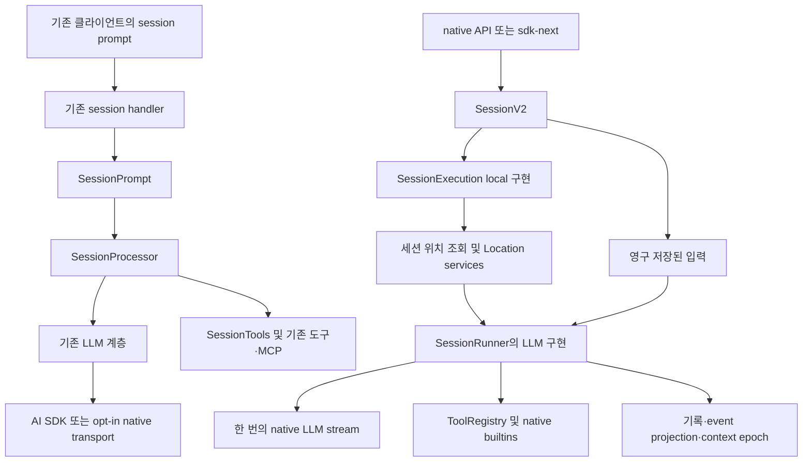

# 메인 엔진 구조와 실제 연결

기준: 2026-10-07 조회, upstream `4ac0d9c3d169bbe81d9570013effdda3fe24d36e`. Moodcode 비교 기준은 `6d9a952`다.

## 핵심 판단

OpenCode는 하나의 완성된 새 엔진만 사용하는 구조가 아니다. **기존 session 엔진과 native V2 엔진이 서버 안에 함께 연결되어 있다.** 기존 엔진이 넓은 제품 기능을 담당하고 V2는 입력 접수·실행 경계·컨텍스트·도구 계약을 다시 분리한다. Moodcode에는 기존 엔진의 필요한 행동과 V2의 명확한 경계를 참고하되, 현재 자체 엔진의 저장·승인·복구 계약을 유지하는 편이 적합하다.

이 판단은 디렉터리 이름이나 TODO만으로 내리지 않았다. 일반 클라이언트 호출, 서버 handler, service 구성, runner, leaf tool을 이어서 확인했다. 세부 근거는 각 분석 문서에 있다.

## 실제 경로

일반 TUI submit과 app compatibility submit은 기존 엔진으로 연결된다. `sdk/js`의 `v2`라는 이름만으로 native `SessionV2` 사용이라고 판단하면 안 된다. native 서버/SDK 경로는 별도로 존재한다. [실행 경로 분석](./01-execution-state.md).

기존 서버는 기존 route와 native route를 함께 병합하고, `SessionV2`에 `SessionExecutionLocal`과 Location service map을 제공한다. native-only 서버도 동일한 local 실행 구현을 주입한다. 즉 V2는 단순한 미래 문서가 아니라 실제 연결된 코드지만, 기존 기능 전체가 이 경로로 이전된 것은 아니다. [기존 서버 구성](https://github.com/anomalyco/opencode/blob/4ac0d9c3d169bbe81d9570013effdda3fe24d36e/packages/opencode/src/server/routes/instance/httpapi/server.ts#L271), [native 서버 구성](https://github.com/anomalyco/opencode/blob/4ac0d9c3d169bbe81d9570013effdda3fe24d36e/packages/server/src/routes.ts#L51).

`sdk-next`는 native 서버의 embedded web handler를 자체 fetch로 감싸 typed client를 만든다. 이를 보고 Electron도 반드시 로컬 HTTP 서버를 띄워야 한다고 결론 내릴 필요는 없다. Moodcode의 현재 library→harness/utility process 계약은 그대로 유지할 수 있다. [sdk-next](https://github.com/anomalyco/opencode/blob/4ac0d9c3d169bbe81d9570013effdda3fe24d36e/packages/sdk-next/src/opencode.ts#L11).

## 모듈을 나눈 이유

| 계층 | OpenCode의 책임 | Moodcode에서 참고할 계약 |
|---|---|---|
| Schema | IDs, session/message/event, model·tool 데이터 정의 | engine·host·클라이언트가 공유하는 버전 있는 계약 |
| Core | 저장, 실행, 위치, 모델 선택, 파일·권한·도구·컨텍스트 | 애플리케이션 transport와 분리한 엔진 |
| LLM | 공급자 protocol 변환, route/executor, 한 turn의 정규화 | 공급자는 모델 통신만 담당; 반복·도구 실행은 runner 소유 |
| Protocol | HTTP endpoint·오류·middleware 요구 정의 | 필요하면 transport adapter가 engine 오류를 외부 오류로 변환 |
| Server | 실제 services와 protocol 결합 | 부팅·종료·위치·인증은 host의 책임 |
| SDK/client | 계약의 호출과 embedded 연결 | GUI나 CLI가 엔진 구현을 직접 알지 않도록 분리 |
| 기존 opencode 패키지 | 제품 기능과 과도기 호환 실행 | 필요한 사용자 행동을 검증할 참조; 독립 구현의 필수 의존성 아님 |

upstream은 Schema→Core/Protocol→Server 방향을 지침으로 정하고 client runtime의 Core/Server 직접 의존을 금지한다. 이 검토는 package manifests·구성 지점을 읽었으며, 전체 dependency graph의 타입 검사나 bundle 검사까지 수행한 것은 아니다. [upstream 지침](https://github.com/anomalyco/opencode/blob/4ac0d9c3d169bbe81d9570013effdda3fe24d36e/AGENTS.md#L1), [Protocol 구성](https://github.com/anomalyco/opencode/blob/4ac0d9c3d169bbe81d9570013effdda3fe24d36e/packages/protocol/src/api.ts#L25).

## 실행 소유 범위

V2에서 DB·event·execution router는 application/global 범위다. 모델·도구·권한·파일·runner는 Location 범위다. 실제 drain 시작 때 세션의 현재 위치를 읽으므로, 세션 ID만으로 실행을 호출하고 파일 위치를 host가 임의로 결합하지 않는다. Location은 directory와 선택적 workspace identity를 갖는다. [Location](https://github.com/anomalyco/opencode/blob/4ac0d9c3d169bbe81d9570013effdda3fe24d36e/packages/core/src/location.ts#L17), [실행 상세](./01-execution-state.md).

`LayerNode`/`AppNodeBuilder`는 의존성과 global/location tag를 추적하고, 전역 의존성을 분리하며, unbound 구현 교체·중복·순환을 검사한다. Location services는 `LayerMap`으로 구성되고 60분 idle TTL이 있다. Effect의 scope가 자원 수명을 관리한다. Moodcode가 이 프레임워크를 새로 도입해야 한다는 의미는 아니다. 현재 ports와 명시적 workspace scope에 같은 수명 규칙을 적용하면 된다. [LayerNode](https://github.com/anomalyco/opencode/blob/4ac0d9c3d169bbe81d9570013effdda3fe24d36e/packages/core/src/effect/layer-node.ts#L163), [Location services](https://github.com/anomalyco/opencode/blob/4ac0d9c3d169bbe81d9570013effdda3fe24d36e/packages/core/src/location-services.ts#L96).

서버 정적 객체·SDK handler·plugin 등록 코드 한 파일만 보면 scope를 오판할 수 있다. 등록 해제는 하위 State와 Effect scope에서 처리되기도 한다. 문서와 TODO도 구현 상태를 정확히 반영하지 않는 경우가 있어, 아래 callpath와 관련 테스트를 함께 읽었다. [도구·권한 분석](./03-tools-permissions.md).

## Moodcode 대비

| 엔진 기능 | OpenCode에서 확인한 상태 | Moodcode 현재 상태 | 독립 구현 판단 |
|---|---|---|---|
| 기본 코딩 반복 | 양쪽 경로에 구현 | read→patch/command 승인→후속 turn 구현 | 현재 loop 보존 |
| 입력 접수·중복 | V2 durable inbox, exact retry | durable input/Run와 request fingerprint | 현재 정합성 유지하고 pending 입력 확장 |
| 실행 중 사용자 입력 | V2 steer/queue, safe boundary | 새 입력은 active workspace일 때 거부 | 높은 우선순위 |
| 실행 단위 | V2 drain에는 영구 Run identity 없음 | 영구 Run과 terminal 상태·원인 | Moodcode Run 유지 |
| 장기 대화 | 의미 요약·context epoch·tool pruning | byte cap, tool 묶음, 출처 있는 발췌 | model metadata와 versioned summary 추가 |
| 메시지·사용량 | text/reasoning/tool/step parts, richer usage | text와 complete tool call, input/output usage | provider event 확장 |
| 도구 | 기존 경로가 더 넓음, native builtins subset | 읽기·검색·patch·명령·복원 | exact edit, 질문, skill/reference부터 |
| 승인 | 규칙·scope·remembered 정책 | DB pending approval, 정확한 preview/fingerprint | 현재 binding 위에 범위 정책 추가 |
| 취소·재시작 | V2 process-local; post-crash continuation deferred | interrupted, pending expiry, 효과 격리·복구 | 자동 도구 재실행 금지 유지 |
| 같은 저장소 병렬 실행 | V2는 다른 세션 동시 drain 가능 | active Run 하나/workspace | 파일 효과 병렬화는 worktree 격리 이후 |
| 확장 | 기존 MCP·plugins·task/LSP 등이 구현; native 이관은 부분적 | MCP·제품 subagent·LSP 미구현 | 안정된 lifecycle 계약 뒤 adapter 추가 |

Moodcode의 실제 근거: [Run·공개 계약](../../packages/contracts/src/index.ts), [admission](../../packages/engine/src/storage/index.ts), [runner](../../packages/engine/src/runner/index.ts), [context](../../packages/engine/src/context/index.ts), [구현 상태](../moodcode/implementation-status.md). 비교는 코드와 이전 검증 기록에 근거하며 이번에 런타임 테스트를 재실행한 결과는 아니다.

## 이전 분석 이후 변경

이전 pin `907b3bc518fa48e90e8ec24dd327d13eee71c36c`와 이번 pin의 전체 diff는 80개 경로다. 이번 엔진 inventory 범위 안에서는 lockfile·manifest 4개, 기존 message projection 1개, 해당 테스트 1개가 변경됐다. 핵심 V2 runner/coordinator/context 소스는 동일하다.

기존 `message-v2.ts`는 xAI tool result의 이미지에서 PNG/JPEG/WebP 외 MIME을 제거한다. 관련 테스트도 추가됐다. xAI SDK/patch와 GitLab provider 버전이 변경되어, 소스 구조가 같더라도 외부 adapter 동작이 완전히 같다고 가정할 수 없다. [변경 비교](https://github.com/anomalyco/opencode/compare/907b3bc518fa48e90e8ec24dd327d13eee71c36c...4ac0d9c3d169bbe81d9570013effdda3fe24d36e), [모델 분석](./02-model-context.md).

## 확인 범위와 한계

Git tracked 파일 6,628개 중 엔진·관련 테스트·spec·구성 범위 1,376개를 inventory에 기록했다. 핵심 실행 경로와 주요 경계는 세 개의 세부 분석과 root 구성 검토로 추적했다. **1,376개 파일을 모두 정독했다는 주장은 하지 않는다.** 직접 읽은 깊이는 coverage, 그 밖의 경로는 inventory로 구분한다.

이번 검토는 정적 소스·기존 테스트 코드·설계 문서 분석이다. 참조 checkout에는 의존성이 설치되지 않았고 PATH에 Bun이 없으므로 upstream build/test/live model 검증을 실행하지 않았다. 모델별 전체 호환성, 운영 중 네트워크 오류, OS별 process teardown, 장기 성능은 실제 자체 엔진 구현 단계에서 별도 검증한다. 제공자별 모든 세부 protocol와 모든 migration·fixture를 정독한 검토도 아니다.

라이선스는 루트 MIT와 tracked 별도 LICENSE를 확인했고, 전체 전이 의존성/미디어의 권리 검증을 완료했다는 뜻은 아니다. [라이선스·출처](./05-license-and-provenance.md).
