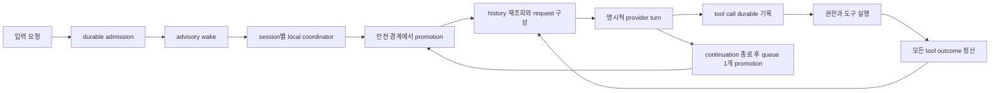

# OpenCode 실행·상태 엔진 분석과 Moodcode 독립 구현 계약

검토 기준은 OpenCode `4ac0d9c3d169bbe81d9570013effdda3fe24d36e`, Moodcode `6d9a9527b74e543dfab55a9a401b47176d27bff8`이다. 원본 checkout은 `/Users/yakisoba0728/Documents/GitHub/opencode-engine-reference-4ac0d9c3d1`에 고정했다. 이 문서는 원본 코드, 프롬프트, 테스트를 이식하는 문서가 아니라 관찰한 동작과 Moodcode가 소유할 계약을 설명한다. 원본 테스트는 실행하지 않았다. 아래의 “구현됨”은 소스의 실행 경로를 확인했다는 뜻이며 실제 모델·OS·재시작 환경에서 검증했다는 뜻은 아니다.

## 1. 가장 중요한 결론

OpenCode 엔진은 현재 한 덩어리가 아니다. 앱/TUI의 기존 사용 흐름은 V1 `SessionPrompt`·`SessionProcessor`를 계속 사용하고, 별도 native API에는 V2 durable inbox·SessionRunner가 연결되어 있다. `sdk/v2`라는 경로 이름만으로 native V2 실행이라고 판단하면 안 된다. 최신 V2는 재구성 방향을 이해하는 좋은 참고지만 V1 기능 전체를 대체한 완성 엔진으로 취급할 수 없다.

Moodcode에는 이미 durable Run, 입력 재시도 식별, SQLite 원자적 이벤트·상태 기록, provider/tool 예산, 승인 대기, 취소 정리, 재시작 중단 처리와 workspace 단위 실행 독점이 있다. 이 기반을 버리고 OpenCode의 process-local drain 모델을 옮길 이유는 없다. 다음 확장은 **독립 input admission → 안전한 promotion → 명시적인 provider turn → 도구 정산 → 다음 turn → durable terminal**로 구분하는 것이다.

## 2. 실제 진입 경로

| 사용자/호출 경로 | 실제 실행 대상 | 확인 근거 |
| --- | --- | --- |
| TUI 일반 프롬프트 | legacy `sdk.client.session.prompt` → `SessionPrompt.prompt` | [TUI submit](https://github.com/anomalyco/opencode/blob/4ac0d9c3d169bbe81d9570013effdda3fe24d36e/packages/tui/src/component/prompt/index.tsx#L1092-L1112), [legacy handler](https://github.com/anomalyco/opencode/blob/4ac0d9c3d169bbe81d9570013effdda3fe24d36e/packages/opencode/src/server/routes/instance/httpapi/handlers/session.ts#L295-L329) |
| 앱의 서버 호환 façade | legacy `promptAsync`, interrupt는 legacy abort | [app compatibility](https://github.com/anomalyco/opencode/blob/4ac0d9c3d169bbe81d9570013effdda3fe24d36e/packages/app/src/utils/server-compat.ts#L197-L212) |
| native Session API | `SessionV2.prompt` admission receipt 반환, 실행은 advisory wake | [native handler](https://github.com/anomalyco/opencode/blob/4ac0d9c3d169bbe81d9570013effdda3fe24d36e/packages/server/src/handlers/session.ts#L139-L170) |
| native/기존 혼합 서버 | V1 routes와 native routes 동시 제공, `SessionExecutionLocal` 주입 | [merged server](https://github.com/anomalyco/opencode/blob/4ac0d9c3d169bbe81d9570013effdda3fe24d36e/packages/opencode/src/server/routes/instance/httpapi/server.ts#L278-L306) |
| standalone native server | global service graph에 local execution 구현 연결 | [native routes](https://github.com/anomalyco/opencode/blob/4ac0d9c3d169bbe81d9570013effdda3fe24d36e/packages/server/src/routes.ts#L26-L62) |

## 3. V1 루프: 완성된 사용자 흐름이 가진 책임

V1 prompt는 session 확인, revert 정리, 입력 확장·메시지 기록, session touch, 입력별 도구 권한 설정 후 루프에 들어간다. `noReply`는 메시지 기록만 한다. 사용자 메시지는 즉시 기록되며 V2의 pending inbox와 같은 독립 admission lifecycle은 아니다. 파일·미디어·MCP 리소스·agent reference 확장 및 플러그인 입력 변환도 이 큰 모듈에 포함되어 있다. 이번 실행 분석에서는 입력 변환의 진입·저장 경계를 확인했으며 모든 미디어 분기는 이 문서의 완독 범위가 아니다. [prompt recording](https://github.com/anomalyco/opencode/blob/4ac0d9c3d169bbe81d9570013effdda3fe24d36e/packages/opencode/src/session/prompt.ts#L635-L700), [save and start](https://github.com/anomalyco/opencode/blob/4ac0d9c3d169bbe81d9570013effdda3fe24d36e/packages/opencode/src/session/prompt.ts#L995-L1071)

각 반복은 compacted history를 다시 읽고 최근 user·assistant·finished step·subtask를 찾는다. 종료 판정은 finish reason 하나에 의존하지 않는다. provider가 `stop`을 보내도 local tool call이 있으면 결과를 모델에 돌려줘야 하므로 계속한다. cleanup이 orphan/interrupted로 표시한 도구는 다시 실행해야 할 작업으로 세지 않는다. subtask와 compaction 작업을 우선 처리하고, 모델과 agent를 선택하고, reminders·도구·MCP·skills·instructions·plugin transforms를 조합하여 processor에 넘긴다. structured output, content-filter와 compaction 결과도 루프를 바꾼다. [V1 loop](https://github.com/anomalyco/opencode/blob/4ac0d9c3d169bbe81d9570013effdda3fe24d36e/packages/opencode/src/session/prompt.ts#L1081-L1347)

실행 소유권은 instance별 `SessionRunState`의 session→Runner map이다. Runner는 Idle, Running, Shell, ShellThenRun을 구분한다. 같은 session resume은 이미 실행 중인 결과를 join한다. shell 이후 하나의 대기 run을 이어갈 수 있다. cancel은 scope 안의 fiber 정산을 기다리고 idle 처리를 한다. V1 cancel은 session 관련 background job과 자식 관련 job도 찾아 중단한다. [run state](https://github.com/anomalyco/opencode/blob/4ac0d9c3d169bbe81d9570013effdda3fe24d36e/packages/opencode/src/session/run-state.ts#L35-L143), [Runner transitions](https://github.com/anomalyco/opencode/blob/4ac0d9c3d169bbe81d9570013effdda3fe24d36e/packages/opencode/src/effect/runner.ts#L115-L202)

Processor는 stream 이전 snapshot을 찍고, assistant·text·reasoning·tool state를 기록한다. pending→running→completed/error를 추적하며 반복되는 같은 tool/input은 추가 권한을 요청한다. 중단·에러 cleanup에서는 미완료 text/reasoning을 마무리하고, 남은 도구를 interrupted metadata가 있는 error로 닫는다. provider 실패의 retry, overflow→compaction, idle status도 processor 책임이다. V1에 있는 retry가 V2에도 자동으로 존재하는 것은 아니다. [stream settlement](https://github.com/anomalyco/opencode/blob/4ac0d9c3d169bbe81d9570013effdda3fe24d36e/packages/opencode/src/session/processor.ts#L98-L253), [cleanup/retry](https://github.com/anomalyco/opencode/blob/4ac0d9c3d169bbe81d9570013effdda3fe24d36e/packages/opencode/src/session/processor.ts#L553-L696)

Moodcode는 이 기능들의 책임을 이해하되 1,631줄 prompt 모듈이나 provider 라이브러리가 도구 orchestration을 숨기는 구조를 재현할 필요가 없다.

## 4. V2 입력과 실행의 네 경계

### 4.1 Admission: 수락과 실행 완료는 서로 다른 사실

`SessionV2.prompt`는 입력 MIME 정보를 정규화하고 ID를 정한 뒤 `PromptAdmitted`를 publish한다. 이 event transaction이 `session_input` pending row를 만든다. 기록을 완료한 뒤 `resume !== false`이면 wake를 호출한다. 반환값은 admittedSeq, prompt ID, session ID, delivery, creation time, 선택적 promotedSeq다. 모델 답변이나 작업 완료를 뜻하지 않는다. [admission façade](https://github.com/anomalyco/opencode/blob/4ac0d9c3d169bbe81d9570013effdda3fe24d36e/packages/core/src/session.ts#L360-L385), [receipt schema](https://github.com/anomalyco/opencode/blob/4ac0d9c3d169bbe81d9570013effdda3fe24d36e/packages/schema/src/session-input.ts#L14-L23)

같은 prompt ID는 session·정규화 prompt·delivery가 모두 같을 때만 정확한 재시도로 인정한다. 내용이나 queue/steer가 달라지면 conflict다. `resume`은 receipt identity에 포함되지 않아 admit-only 후 같은 ID로 wake를 다시 요청할 수 있다. 동시 admission race에서는 저장된 row를 다시 읽고 일치 여부를 확인한다. 기존 projected Prompted 기록도 promoted inbox row로 수용하므로 역사 재생과 retry가 이어진다. [identity/race handling](https://github.com/anomalyco/opencode/blob/4ac0d9c3d169bbe81d9570013effdda3fe24d36e/packages/core/src/session/input.ts#L41-L168), [equivalence](https://github.com/anomalyco/opencode/blob/4ac0d9c3d169bbe81d9570013effdda3fe24d36e/packages/core/src/session/input.ts#L191-L214)

### 4.2 Promotion: pending 입력을 모델에게 보이는 history로 전환

Admission 자체는 transcript user message를 만들지 않는다. runner가 Prompted event를 내고, 같은 transaction에서 input promotedSeq와 user projection을 함께 반영한다. 즉 pending queue를 실제 읽힌 사용자 메시지로 오해하지 않는다. [projection boundary](https://github.com/anomalyco/opencode/blob/4ac0d9c3d169bbe81d9570013effdda3fe24d36e/packages/core/src/session/projector.ts#L348-L374)

기본 delivery는 steer다. 진행 중인 provider/tool 경계를 넘은 다음, cutoff 이전에 admission된 steers를 admission 순서로 묶어 promotion한다. cutoff 이후 새 입력은 다음 경계에 남는다. queue는 현재 continuation이 끝나 session이 idle이 될 지점에서 FIFO 하나만 promotion하고 다시 continuation을 평가한다. queue 하나를 시작할 때 이미 대기하는 steers도 해당 cutoff 안에서 반영한다. 새 입력을 하나 이상 promotion하면 agent step allowance는 한 번 reset된다. [promotion queries](https://github.com/anomalyco/opencode/blob/4ac0d9c3d169bbe81d9570013effdda3fe24d36e/packages/core/src/session/input.ts#L245-L288), [turn boundary](https://github.com/anomalyco/opencode/blob/4ac0d9c3d169bbe81d9570013effdda3fe24d36e/packages/core/src/session/runner/llm.ts#L173-L202), [drain loop](https://github.com/anomalyco/opencode/blob/4ac0d9c3d169bbe81d9570013effdda3fe24d36e/packages/core/src/session/runner/llm.ts#L392-L415)

### 4.3 Coordinator: runtime 알림과 durable 작업을 분리

process-global coordinator의 `run`은 같은 session의 진행 중 drain을 join하거나 idle에서 force=true drain을 시작한다. `wake`는 pendingWake boolean으로 중복 알림을 합치고 force=false drain을 시작한다. force=false는 eligible pending input이 없으면 모델을 호출하지 않는다. 다른 session key는 동시에 실행한다. 이 Map/Fiber 소유권은 SQLite에 durable lease로 기록되는 분산 실행 소유권이 아니다. [coordinator](https://github.com/anomalyco/opencode/blob/4ac0d9c3d169bbe81d9570013effdda3fe24d36e/packages/core/src/session/run-coordinator.ts#L24-L104)

실행 location은 admission 당시 closure에 고정하지 않고 drain 시작 시 SessionStore로 다시 조회한다. location-scoped runner/model/tools/permission을 제공한다. 매 turn은 현재 session location과 runner location을 비교하여 이동 후 stale runner가 다음 turn을 시작하지 않도록 interrupt한다. 이 검사는 분산 lease fencing을 대신하지 않는다. [local routing](https://github.com/anomalyco/opencode/blob/4ac0d9c3d169bbe81d9570013effdda3fe24d36e/packages/core/src/session/execution/local.ts#L16-L35), [placement check](https://github.com/anomalyco/opencode/blob/4ac0d9c3d169bbe81d9570013effdda3fe24d36e/packages/core/src/session/runner/llm.ts#L179-L181)

### 4.4 Provider turn과 도구 정산

runner는 매 turn session·agent·model·history를 다시 조회하고 request를 만든 다음 `llm.stream(request)`를 명시적으로 한 번 소비한다. 끝나는 마지막 agent step에서는 tools를 비우고 toolChoice를 none으로 둔다. 이전 turn의 in-memory conversation만 이어붙이는 방식이 아니다. [request assembly](https://github.com/anomalyco/opencode/blob/4ac0d9c3d169bbe81d9570013effdda3fe24d36e/packages/core/src/session/runner/llm.ts#L197-L241)

complete local tool call은 event publication을 완료한 뒤 child fiber로 즉시 실행한다. stream이 아직 열려 있을 때도 실행을 시작할 수 있고 여러 local tool이 동시에 실행된다. publisher의 Semaphore는 event publication을 직렬화한다. provider stream 종료 후 시작한 모든 tool fiber의 settlement를 기다리고 결과를 durable 기록한 다음 history를 다시 읽어 continuation한다. provider-executed tool은 local executor로 중복 실행하지 않는다. [eager execution and settlement](https://github.com/anomalyco/opencode/blob/4ac0d9c3d169bbe81d9570013effdda3fe24d36e/packages/core/src/session/runner/llm.ts#L237-L354)

tool call ID는 provider 내부 ID다. turn마다 반복될 수 있으므로 모든 tool event는 owning assistantMessageID도 포함한다. publisher는 같은 turn 안 duplicate call/result와 stream ordering 오류를 거부하고 provider call metadata와 result metadata를 분리한다. 이는 Moodcode의 globally unique ToolCallRecord ID를 없애야 한다는 뜻이 아니라 `(turnId, providerCallId)`와 내부 tool ID의 명시적 매핑이 필요하다는 뜻이다. [publisher identity](https://github.com/anomalyco/opencode/blob/4ac0d9c3d169bbe81d9570013effdda3fe24d36e/packages/core/src/session/runner/publish-llm-event.ts#L313-L394), [projection ownership](https://github.com/anomalyco/opencode/blob/4ac0d9c3d169bbe81d9570013effdda3fe24d36e/packages/core/src/session/message-updater.ts#L95-L99)

## 5. 상태·저장·이벤트 재생

| 저장 경계 | 역할 | 중요 조건 |
| --- | --- | --- |
| session | 배치 위치·agent·model·metadata | V1/current 공존으로 created 등의 legacy event도 projection에 사용 |
| session_input | 수락했으나 아직 반영하지 않은 입력 | admitted_seq와 promoted_seq 분리, delivery별 pending index |
| session_message | user/system/assistant/shell/compaction 등 typed projection | transcript order는 ID/클라이언트 time 대신 source aggregate seq |
| session_context_epoch | privileged baseline과 관측 snapshot | 모델 history와 운영 snapshot은 서로 다른 용도 |
| event, event_sequence | durable aggregate journal과 head | projection·event·head가 같은 SQLite immediate transaction |

[session SQL](https://github.com/anomalyco/opencode/blob/4ac0d9c3d169bbe81d9570013effdda3fe24d36e/packages/core/src/session/sql.ts#L119-L176), [typed message contracts](https://github.com/anomalyco/opencode/blob/4ac0d9c3d169bbe81d9570013effdda3fe24d36e/packages/schema/src/session-message.ts#L81-L213), [atomic event publication](https://github.com/anomalyco/opencode/blob/4ac0d9c3d169bbe81d9570013effdda3fe24d36e/packages/core/src/event.ts#L237-L363)

text/reasoning/tool-input delta는 live-only다. 최종 Ended event가 full value를 durable 저장한다. publisher는 정상 end 외에도 failure/interrupt에서 buffered fragments를 flush한다. 따라서 “실시간으로 보였다”와 “재연결 후 복구된다”는 다른 경계다. 프로세스 강제 종료가 flush 전에 오면 해당 block의 아직 종료하지 않은 fragments를 잃을 수 있다. 이 한계는 소스 구조상 추론이며 이번에 crash 실험한 결과는 아니다. [live/durable events](https://github.com/anomalyco/opencode/blob/4ac0d9c3d169bbe81d9570013effdda3fe24d36e/packages/schema/src/session-event.ts#L197-L269), [fragments and flush](https://github.com/anomalyco/opencode/blob/4ac0d9c3d169bbe81d9570013effdda3fe24d36e/packages/core/src/session/runner/publish-llm-event.ts#L91-L163)

durable tail은 먼저 session별 sliding-capacity-1 wake subscription을 등록하고 history를 읽는다. 이후 wake마다 SQLite를 재조회한다. 알림은 dirty signal이고 실제 이벤트는 journal에 있으므로 notification coalescing이 journal event loss를 뜻하지 않는다. finite history는 public durable manifest로 먼저 필터링하고 limit+1을 읽어 hasMore를 계산한다. after는 exclusive seq다. seq gap은 허용되며 private/legacy events를 제외한 결과에서도 순서가 유지된다. [tail handoff](https://github.com/anomalyco/opencode/blob/4ac0d9c3d169bbe81d9570013effdda3fe24d36e/packages/core/src/event.ts#L541-L604), [finite history](https://github.com/anomalyco/opencode/blob/4ac0d9c3d169bbe81d9570013effdda3fe24d36e/packages/core/src/event.ts#L63-L108)

replay는 같은 aggregate의 연속 sequence, 동일 ID/type/encoded payload 재생 일치, owner 조건을 검사한다. exact replay는 중복 projection을 만들지 않고 충돌이나 sequence gap을 거부한다. replay owner claim은 동기화·projection reconstruction용이다. active model execution의 distributed ownership/lease로 해석하면 안 된다. incompatible historical payload projector를 정확한 type+version으로 binding하는 작업도 TODO로 남아 있다. [replay checks](https://github.com/anomalyco/opencode/blob/4ac0d9c3d169bbe81d9570013effdda3fe24d36e/packages/core/src/event.ts#L179-L180), [identity/owner/sequence](https://github.com/anomalyco/opencode/blob/4ac0d9c3d169bbe81d9570013effdda3fe24d36e/packages/core/src/event.ts#L254-L315), [replayAll](https://github.com/anomalyco/opencode/blob/4ac0d9c3d169bbe81d9570013effdda3fe24d36e/packages/core/src/event.ts#L480-L510)

history는 최신 completed compaction 이후의 메시지와 baseline 이후 chronological system update를 선택한다. full transcript pagination과 모델 context selection은 서로 다른 API이다. [history selection](https://github.com/anomalyco/opencode/blob/4ac0d9c3d169bbe81d9570013effdda3fe24d36e/packages/core/src/session/history.ts#L13-L101), [messages pagination](https://github.com/anomalyco/opencode/blob/4ac0d9c3d169bbe81d9570013effdda3fe24d36e/packages/core/src/session.ts#L304-L336)

## 6. 취소·중단·재시작의 실제 의미

V2 interrupt는 해당 process의 owner fiber를 interrupt하고 cleanup을 기다린다. interrupt 시 이미 등록된 pendingWake는 지운다. durable inbox는 삭제하지 않는다. idle/missing session은 no-op다. 다만 **interrupt cleanup 동안 새로 등록된 wake**는 successor를 시작할 수 있다. “interrupt 이후 절대로 다시 실행 안 됨” 계약은 아니다. join한 waiter를 취소하는 것도 execution owner를 취소하는 것과 다르다. [interrupt and successor](https://github.com/anomalyco/opencode/blob/4ac0d9c3d169bbe81d9570013effdda3fe24d36e/packages/core/src/session/run-coordinator.ts#L51-L101), [cleanup race test](https://github.com/anomalyco/opencode/blob/4ac0d9c3d169bbe81d9570013effdda3fe24d36e/packages/core/test/session-run-coordinator.test.ts#L247-L282)

runner는 provider/tool interruption에서 tool fibers를 지우고 unsettled tool을 실패로 기록하며 active assistant도 failed로 닫는다. 권한 승인 거절 또는 question dismissal은 오류를 모델에 넘겨 계속 시도하는 대신 loop를 interrupt한다. 일반 tool failure와 policy-blocked result는 모델에게 반환하고 계속할 수 있다. 이 선택은 제품 계약이므로 Moodcode의 현재 denial 동작과 명시적으로 비교해야 한다. [settlement branches](https://github.com/anomalyco/opencode/blob/4ac0d9c3d169bbe81d9570013effdda3fe24d36e/packages/core/src/session/runner/llm.ts#L144-L150), [interrupt cleanup](https://github.com/anomalyco/opencode/blob/4ac0d9c3d169bbe81d9570013effdda3fe24d36e/packages/core/src/session/runner/llm.ts#L286-L354)

새 drain 시작 시 기존 context의 pending/running tool은 durable failure로 닫는다. 해당 tool side effect를 다시 실행하지 않는다. 하지만 이것은 **promoted input이나 dispatch된 provider 작업의 자동 crash recovery**가 아니다. advisory wake는 pending input이 없으면 모델을 재호출하지 않는다. explicit resume(force)은 projected history를 바탕으로 새 provider attempt를 시작할 수 있다. restart 후 active registry는 비어 있고, 실행 status의 durable lifecycle은 아직 V2에 없다. [prior unfinished tool handling](https://github.com/anomalyco/opencode/blob/4ac0d9c3d169bbe81d9570013effdda3fe24d36e/packages/core/src/session/runner/llm.ts#L119-L139), [execution guard](https://github.com/anomalyco/opencode/blob/4ac0d9c3d169bbe81d9570013effdda3fe24d36e/packages/core/src/session/runner/llm.ts#L392-L399), [documented recovery boundary](https://github.com/anomalyco/opencode/blob/4ac0d9c3d169bbe81d9570013effdda3fe24d36e/specs/v2/session.md#L153-L185)

## 7. 구현·문서·추론 구분

| 항목 | 현재 확인한 구현 | 해석 |
| --- | --- | --- |
| durable admission·steer·queue | 구현됨 | V2의 가장 유용한 재구현 참고 계약 |
| local single-session coordinator | 구현됨 | process-local; distributed ownership 없음 |
| per-turn location fencing | 구현됨 | runtime replacement까지 해결하는 일반 lease 아님 |
| eager tool settlement·reasoning·snapshot·automatic/overflow compaction | 실행 코드에 있음 | runner 상단 unchecked TODO만 읽으면 누락된 것으로 오판 |
| 공개 shell·skill·compact·wait API | OperationUnavailable | bash/skill tool 등록이나 자동 compaction 존재와 별개의 API |
| 세션/runner 수준 provider 재시도·watchdog·universal timeout | V2 정책은 deferred | V1 processor retry 또는 HTTP transport retry와 구분 |
| agent steps | 마지막 turn에서 tools disabled | 계속 steer를 admission하면 allowance reset 가능 |
| inbox backlog/steer batch/per-turn tool concurrency limits | follow-up | bounded resource policy 필요 |
| step usage·snapshot event | 기록됨, cost는 runner에서 0 | 완성된 가격/집계 체계로 간주하지 않음 |
| durable execution terminal/status·post-crash provider retry | 아직 일반 보장 없음 | Moodcode의 Run 계약을 보존할 이유 |

[unavailable public methods](https://github.com/anomalyco/opencode/blob/4ac0d9c3d169bbe81d9570013effdda3fe24d36e/packages/core/src/session.ts#L387-L423), [actual snapshot settlement](https://github.com/anomalyco/opencode/blob/4ac0d9c3d169bbe81d9570013effdda3fe24d36e/packages/core/src/session/runner/llm.ts#L325-L345), [stale runner checklist](https://github.com/anomalyco/opencode/blob/4ac0d9c3d169bbe81d9570013effdda3fe24d36e/packages/core/src/session/runner/llm.ts#L43-L90), [explicit local limits follow-ups](https://github.com/anomalyco/opencode/blob/4ac0d9c3d169bbe81d9570013effdda3fe24d36e/specs/v2/session.md#L165-L173)

HTTP 요청 실행기의 retryable status 재시도는 별도 transport 정책이다. 위 표의 deferred는 HTTP 재시도가 전혀 없다는 뜻이 아니라, session/runner가 durable attempt·stream 부분 결과·도구 효과·재시작을 묶어 관리하는 일반 retry/watchdog 정책이 아직 없다는 뜻이다. transport의 구체적인 재시도 조건과 상한은 [모델·컨텍스트 보고서](/Users/yakisoba0728/Documents/GitHub/Moodcode/docs/opencode-engine-review/02-model-context.md)에서 확인한다.

## 8. Moodcode 현재 코드 대비

| 계약 | Moodcode 현재 근거 | 유지/확장 방향 |
| --- | --- | --- |
| 요청 재시도 식별·receipt | [store admission](/Users/yakisoba0728/Documents/GitHub/Moodcode/packages/engine/src/storage/index.ts:212), [contracts](/Users/yakisoba0728/Documents/GitHub/Moodcode/packages/contracts/src/index.ts:27) | 유지. 새 inbox API의 identity에 delivery와 정규화 옵션 포함 |
| admission 시 실행·즉시 user visibility | store.admit가 input/run/user를 한 transaction으로 생성 | 새 input.accept는 pending 입력으로 별도 설계; 기존 run.submit 호환 유지 |
| 실행 중 추가 입력 | [workspace busy check](/Users/yakisoba0728/Documents/GitHub/Moodcode/packages/engine/src/storage/index.ts:222) | 현재는 WORKSPACE_BUSY. queue/steer lifecycle 추가 필요 |
| 독점 범위 | [partial unique index](/Users/yakisoba0728/Documents/GitHub/Moodcode/packages/engine/src/storage/index.ts:136) | workspace 단위 효과 독점 보존. OpenCode session concurrency를 그대로 풀지 않음 |
| 명시적 provider turn·history reload | [execute loop](/Users/yakisoba0728/Documents/GitHub/Moodcode/packages/engine/src/runner/index.ts:343) | 이미 있음. durable turn ID/attempt/finish 사실을 추가 |
| streaming tool call 기록 | providerTurn은 complete calls를 모아 message.completed 후 tool 실행 | explicit tool proposal/turn ownership을 추가. side effect 이전 durable 기록 보존 |
| 도구 실행 방식 | [sequential settlement](/Users/yakisoba0728/Documents/GitHub/Moodcode/packages/engine/src/runner/index.ts:375) | 읽기 작업에 한정한 bounded concurrency부터; patch/command 효과는 직렬화 |
| tool call identity | [internal ID mapping](/Users/yakisoba0728/Documents/GitHub/Moodcode/packages/engine/src/runner/index.ts:560) | 내부 global ID 유지, providerCallId는 turn scope. 현재 run 전체 provider ID 재사용 금지 계약 변경 시 migration/tests 필요 |
| 메시지 모델 | [flat Message/ProviderEvent](/Users/yakisoba0728/Documents/GitHub/Moodcode/packages/engine/src/ports.ts:21), [Message contract](/Users/yakisoba0728/Documents/GitHub/Moodcode/packages/contracts/src/index.ts:33) | ordered text/reasoning/tool/attachment parts로 점진 확장. 기존 content projection 제공 |
| 이벤트 durable/live | [message delta commits](/Users/yakisoba0728/Documents/GitHub/Moodcode/packages/engine/src/runner/index.ts:427), [subscription handoff](/Users/yakisoba0728/Documents/GitHub/Moodcode/packages/engine/src/storage/index.ts:427) | 현재 delta도 durable이며 atomic snapshot+seq 있음. 최적화 시 crash-loss 범위와 flush cadence 명시 |
| Run terminal·approval expiry | [terminal transaction](/Users/yakisoba0728/Documents/GitHub/Moodcode/packages/engine/src/storage/index.ts:325) | 보존. pending inbox에도 cancel/remove/expiry 이벤트 필요 |
| 재시작 | [recoverInterrupted](/Users/yakisoba0728/Documents/GitHub/Moodcode/packages/engine/src/storage/index.ts:466) | active Run/tool/approval을 중단·expire. 자동 재실행 대신 명시적 새 resume/retry 계약 설계 |
| DB owner·writer 설정 | [ownership and durability](/Users/yakisoba0728/Documents/GitHub/Moodcode/packages/engine/src/storage/index.ts:88) | 현재 exclusive DB owner, WAL, synchronous FULL 보존 |
| 예산·cleanup 불확실성 | [limits](/Users/yakisoba0728/Documents/GitHub/Moodcode/packages/contracts/src/index.ts:12), [cleanup wait](/Users/yakisoba0728/Documents/GitHub/Moodcode/packages/engine/src/runner/index.ts:143) | turn allowance reset과 Run 전체 wall-clock/tools/output 상한을 분리; quarantine 보존 |

Moodcode는 explicit Run을 durable 추적하는 설계이고 OpenCode V2 drain은 durable Run ID가 없는 운영 실행 단위다. 어느 쪽이 자동으로 더 좋은 것이 아니라 제품이 사용자에게 설명할 실행/취소/회복 단위가 다르다. Moodcode의 기존 Run 기록과 checkpoint/review binding은 유지하는 편이 migration과 회복 계약을 단순하게 만든다.

## 9. 독립 재구현 우선순위와 수용 기준

1. **새 inbox 계약과 migration.** 기존 run.submit의 즉시 실행·WORKSPACE_BUSY 의미를 유지하고 별도 input.accept를 추가한다. receipt는 inputId, admittedSeq, pending/promoted 상태, 선택적 runId를 표현한다. idempotency key는 session·정규화 prompt·delivery·실행 설정에 binding한다. pending이 visible user message보다 먼저 나타나며 cancellation과 backlog 제한을 가진다.
2. **promotion과 scheduler.** queue는 새 Run에 binding하고 steer는 진행 중 Run의 다음 안전 turn/tool settlement 경계에 binding한다. admissionSeq cutoff, FIFO 하나씩 promotion, 여러 steers batch 순서, cancel 중 새 admission의 동작을 계약으로 고정한다. workspace 효과 독점은 그대로 유지한다.
3. **durable turn/parts.** input/run/turn/attempt/internalToolId/providerCallId를 구분한다. 완성된 call·승인·side-effect 시작·outcome의 위치를 기록한다. 오래된 consumer를 위한 flat content projection을 제공한다. provider-native replay는 모델/provider 호환 조건 아래에 보존한다.
4. **취소와 재시작.** cancel 요청 receipt와 실제 cleanup completed를 분리한다. process가 죽은 위치가 admission 전후, promotion 전후, dispatch 전후, effect 전후 중 어디인지 durable 기록으로 분류한다. ambiguous provider/effect 작업을 자동 재실행하지 않고 recovery-required 상태로 설명한다.
5. **bounded execution.** queue 수·steer batch·active read tools·provider silence/absolute timeout·retry attempt·event flush/backpressure를 설정한다. 입력 promotion의 turn allowance reset이 Run 전체 wall-clock/tool/output 상한을 무한히 늘리지 않도록 한다.
6. **read-side 분리와 성능.** transcript page, model context query, event history/tail을 별도 쿼리로 유지한다. 현재 getSnapshot 전체 로드를 hot path에서 줄이고 SQLite index·큰 tool output artifact를 대상으로 실제 긴 session benchmark를 만든다.

각 단계는 OpenCode 타입 이름·테이블 이름·프롬프트 문구를 복제하지 않고 Moodcode의 contracts/ports를 기준으로 작성한다. runtime 수정은 이번 분석 단계에서 하지 않았다.

## 10. 테스트 소스에서 확인한 수용 사례

테스트 **실행 결과가 아니라 테스트 본문/의도 검토**다. 같은 사례를 Moodcode 고유 API와 fixtures로 새로 작성해야 한다.

| 사례 | 확인한 upstream test body |
| --- | --- |
| admit-only는 transcript 밖에 남고 정확한 재시도는 하나의 row | [admission/idempotency](https://github.com/anomalyco/opencode/blob/4ac0d9c3d169bbe81d9570013effdda3fe24d36e/packages/core/test/session-prompt.test.ts#L143-L162), [exact retry](https://github.com/anomalyco/opencode/blob/4ac0d9c3d169bbe81d9570013effdda3fe24d36e/packages/core/test/session-prompt.test.ts#L252-L359) |
| 같은 ID 내용/delivery/session 변경은 conflict | [conflicts](https://github.com/anomalyco/opencode/blob/4ac0d9c3d169bbe81d9570013effdda3fe24d36e/packages/core/test/session-prompt.test.ts#L292-L340), [cross-session ID](https://github.com/anomalyco/opencode/blob/4ac0d9c3d169bbe81d9570013effdda3fe24d36e/packages/core/test/session-prompt.test.ts#L488-L515) |
| cutoff 이후 steer는 다음 경계에 남고 promotion race는 한 번만 반영 | [promotion](https://github.com/anomalyco/opencode/blob/4ac0d9c3d169bbe81d9570013effdda3fe24d36e/packages/core/test/session-prompt.test.ts#L362-L400) |
| 같은 session resume은 하나의 provider run | [join](https://github.com/anomalyco/opencode/blob/4ac0d9c3d169bbe81d9570013effdda3fe24d36e/packages/core/test/session-runner.test.ts#L1838-L1875) |
| 진행 중 steer는 현재 request를 바꾸지 않고 다음 request에 반영 | [steer](https://github.com/anomalyco/opencode/blob/4ac0d9c3d169bbe81d9570013effdda3fe24d36e/packages/core/test/session-runner.test.ts#L1877-L1918) |
| queue는 tool continuation 뒤 실행, 여러 queue는 FIFO 하나씩 | [queue](https://github.com/anomalyco/opencode/blob/4ac0d9c3d169bbe81d9570013effdda3fe24d36e/packages/core/test/session-runner.test.ts#L1920-L1965), [FIFO](https://github.com/anomalyco/opencode/blob/4ac0d9c3d169bbe81d9570013effdda3fe24d36e/packages/core/test/session-runner.test.ts#L2053-L2093) |
| interrupt 후 pending queue/steer를 later resume에 보존 | [pending retention](https://github.com/anomalyco/opencode/blob/4ac0d9c3d169bbe81d9570013effdda3fe24d36e/packages/core/test/session-runner.test.ts#L1967-L2050) |
| tool 다섯 개를 즉시 시작하되 모두 정산 전 다음 provider 호출 안 함 | [tool settlement barrier](https://github.com/anomalyco/opencode/blob/4ac0d9c3d169bbe81d9570013effdda3fe24d36e/packages/core/test/session-runner.test.ts#L1689-L1747) |
| prior process unfinished tool은 재실행 대신 error projection | [prior tool outcome](https://github.com/anomalyco/opencode/blob/4ac0d9c3d169bbe81d9570013effdda3fe24d36e/packages/core/test/session-runner.test.ts#L2264-L2421) |
| tool/provider interrupt에서 durable error 후 replay 동일 | [interruption/replay](https://github.com/anomalyco/opencode/blob/4ac0d9c3d169bbe81d9570013effdda3fe24d36e/packages/core/test/session-runner.test.ts#L2954-L3061) |
| steer promotion이 step allowance reset | [step reset](https://github.com/anomalyco/opencode/blob/4ac0d9c3d169bbe81d9570013effdda3fe24d36e/packages/core/test/session-runner.test.ts#L3112-L3161) |
| projection/local commit 실패는 event/head도 rollback | [atomic rollback](https://github.com/anomalyco/opencode/blob/4ac0d9c3d169bbe81d9570013effdda3fe24d36e/packages/core/test/event.test.ts#L192-L213) |

## 11. 검토 범위와 남은 검증

V2 session façade, input lifecycle, coordinator, local routing, runner orchestration, event publisher, store/history/SQL, event journal, projector/updater, 현재 typed message·event schema를 완독했다. V1 processor/run-state/Effect Runner는 완독했고 1,631줄 prompt는 실행·저장·contract 관련 분기를 정밀 읽었다. 테스트는 admission 파일을 완독하고 concurrency·steer/queue·settlement·interrupt·prior-process recovery의 선택 본문을 검토했다. 나머지 테스트 이름 검색은 semantic body coverage로 세지 않는다. 파일별 hash·줄 수·read level·읽은 범위는 `01-execution-state.coverage.json`에 기록한다.

이번 범위는 live provider, 원본 build/typecheck/test, 실제 SIGKILL crash, SQLite 대규모 성능, 도구별 OS cleanup을 실행 검증하지 않았다. plugin/MCP/PTY/LSP와 context/provider의 세부 leaf 구현은 다른 분석 범위다. “OpenCode 저장소 전체를 완독했다” 또는 “라이선스 조건을 만족하는 clean room 구현을 입증했다”는 주장은 하지 않는다.
